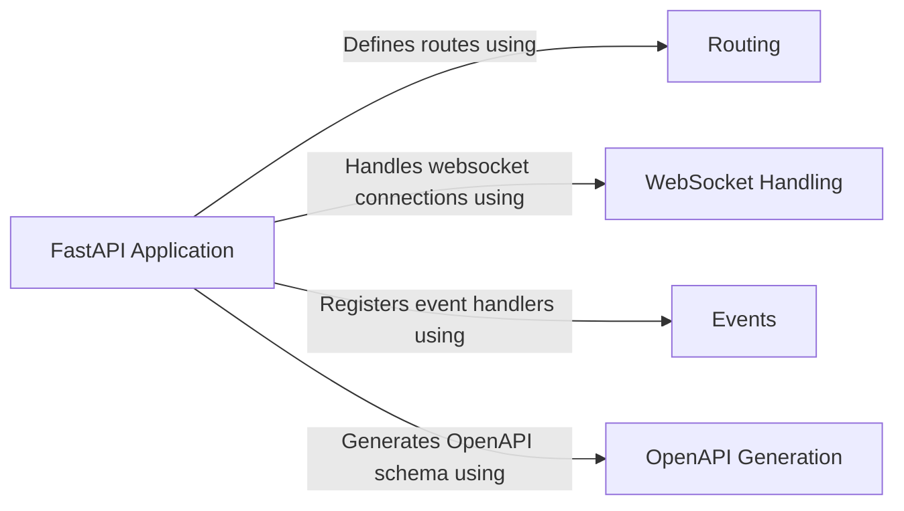

## Component Details

The Core Application component in FastAPI orchestrates the initialization, configuration, and request handling of the API. It serves as the central point for managing the application's lifecycle, defining routes, integrating middleware, and generating the OpenAPI schema. It provides the entry point for handling incoming requests and coordinating the various components of the framework, ensuring a cohesive and well-structured API.

### FastAPI Application
The FastAPI class is the core of the framework, inheriting from Starlette and providing a high-level interface for defining API endpoints and their corresponding handlers. It manages the application's lifecycle, including startup and shutdown events, and provides methods for including routers and defining routes for different HTTP methods and WebSocket connections.
- **Related Classes/Methods**: `fastapi.fastapi.applications.FastAPI` (48:4585), `fastapi.fastapi.applications.FastAPI.__init__` (64:964), `fastapi.fastapi.applications.FastAPI.openapi` (966:996), `fastapi.fastapi.applications.FastAPI.setup` (998:1049), `fastapi.fastapi.applications.FastAPI.add_api_route` (1056:1113), `fastapi.fastapi.applications.FastAPI.api_route` (1115:1173), `fastapi.fastapi.applications.FastAPI.add_api_websocket_route` (1175:1188), `fastapi.fastapi.applications.FastAPI.websocket` (1190:1253), `fastapi.fastapi.applications.FastAPI.include_router` (1255:1458), `fastapi.fastapi.applications.FastAPI.get` (1460:1831), `fastapi.fastapi.applications.FastAPI.put` (1833:2209), `fastapi.fastapi.applications.FastAPI.post` (2211:2587), `fastapi.fastapi.applications.FastAPI.delete` (2589:2960), `fastapi.fastapi.applications.FastAPI.options` (2962:3333), `fastapi.fastapi.applications.FastAPI.head` (3335:3706), `fastapi.fastapi.applications.FastAPI.patch` (3708:4084), `fastapi.fastapi.applications.FastAPI.trace` (4086:4457), `fastapi.fastapi.applications.FastAPI.on_event` (4476:4495)

### Routing
The routing component is responsible for mapping incoming HTTP requests to the appropriate handler functions. It uses methods like `add_api_route`, `api_route`, `get`, `post`, etc., to define routes for different HTTP methods. The `include_router` method allows grouping routes into routers for better organization.
- **Related Classes/Methods**: `fastapi.fastapi.applications.FastAPI.add_api_route` (1056:1113), `fastapi.fastapi.applications.FastAPI.api_route` (1115:1173), `fastapi.fastapi.applications.FastAPI.include_router` (1255:1458), `fastapi.fastapi.applications.FastAPI.get` (1460:1831), `fastapi.fastapi.applications.FastAPI.put` (1833:2209), `fastapi.fastapi.applications.FastAPI.post` (2211:2587), `fastapi.fastapi.applications.FastAPI.delete` (2589:2960), `fastapi.fastapi.applications.FastAPI.options` (2962:3333), `fastapi.fastapi.applications.FastAPI.head` (3335:3706), `fastapi.fastapi.applications.FastAPI.patch` (3708:4084), `fastapi.fastapi.applications.FastAPI.trace` (4086:4457)

### WebSocket Handling
The WebSocket handling component supports WebSocket communication through the `add_api_websocket_route` and `websocket` methods. These methods allow defining routes that handle WebSocket connections, enabling real-time communication between the server and clients.
- **Related Classes/Methods**: `fastapi.fastapi.applications.FastAPI.add_api_websocket_route` (1175:1188), `fastapi.fastapi.applications.FastAPI.websocket` (1190:1253)

### Events
The events component allows registering event handlers for specific events in the application lifecycle, such as startup and shutdown. The `on_event` method is used to register these handlers, enabling actions to be performed when these events occur.
- **Related Classes/Methods**: `fastapi.fastapi.applications.FastAPI.on_event` (4476:4495)

### OpenAPI Generation
The OpenAPI generation component automatically generates an OpenAPI schema for the API, which can be used for documentation and client generation. The `openapi` method is responsible for generating this schema based on the defined routes and their parameters.
- **Related Classes/Methods**: `fastapi.fastapi.applications.FastAPI.openapi` (966:996)