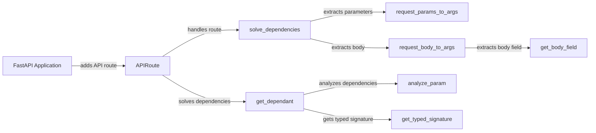

## Component Details

The Dependency Injection system in FastAPI is responsible for automatically resolving and injecting dependencies into route handler functions. It analyzes the function signature, extracts data from various parts of the request (path, query, headers, cookies, body, files), validates the data, and passes it to the handler as arguments. This simplifies data access, promotes code reusability, and enhances testability by ensuring handlers receive data in the expected format.

### FastAPI Application
The FastAPI application is the central component that manages the API. It registers routes and their associated dependencies, acting as the entry point for handling incoming requests.
- **Related Classes/Methods**: `fastapi.fastapi.applications.FastAPI:add_api_route` (1056:1113)

### APIRoute
The APIRoute component represents a single API endpoint. It receives incoming requests, orchestrates the dependency resolution process, and ultimately executes the route's handler function with the resolved dependencies.
- **Related Classes/Methods**: `fastapi.fastapi.routing.APIRoute:get_route_handler` (571:586)

### get_dependant
This function analyzes the dependencies of a route handler. It inspects the handler's signature, identifies dependencies (path parameters, query parameters, headers, cookies, request body, etc.), and creates a `Dependant` object that encapsulates information about these dependencies.
- **Related Classes/Methods**: `fastapi.fastapi.dependencies.utils:get_dependant` (265:314), `fastapi.fastapi.dependencies.utils:analyze_param` (348:511)

### solve_dependencies
This function recursively resolves the dependencies of a route. It iterates through the dependencies identified by `get_dependant`, retrieves the required data from the request (path, query, headers, cookies, body), validates the data, and injects the resolved values into the handler function.
- **Related Classes/Methods**: `fastapi.fastapi.dependencies.utils:solve_dependencies` (572:695)

### request_params_to_args
This function extracts path and query parameters from the request and converts them into arguments suitable for the handler function. It performs validation and handles default values.
- **Related Classes/Methods**: `fastapi.fastapi.dependencies.utils:request_params_to_args` (740:816)

### request_body_to_args
This function extracts the request body and converts it into arguments for the handler function. It handles different content types (JSON, form data, etc.) and validates the body against the expected type.
- **Related Classes/Methods**: `fastapi.fastapi.dependencies.utils:request_body_to_args` (884:927)

### get_body_field
This function extracts a specific field from the request body, particularly when the body is a Pydantic model.
- **Related Classes/Methods**: `fastapi.fastapi.dependencies.utils:get_body_field` (930:980)

### analyze_param
This function analyzes a single parameter of a route handler and determines how to extract its value from the request. It handles different parameter types (path, query, header, cookie, body, etc.) and returns a dictionary containing information about the parameter.
- **Related Classes/Methods**: `fastapi.fastapi.dependencies.utils:analyze_param` (348:511)

### get_typed_signature
This function retrieves the typed signature of a callable, providing type hints for parameters and return values. This information is crucial for dependency resolution and validation.
- **Related Classes/Methods**: `fastapi.fastapi.dependencies.utils:get_typed_signature` (231:244)