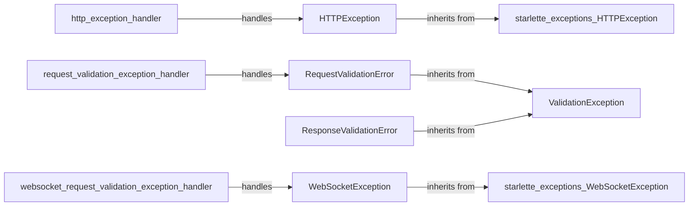

## Component Details

The Exception Handling component in FastAPI provides a structured way to manage errors that occur during request processing. It defines custom exception classes for validation errors and leverages exception handlers to return appropriate HTTP responses. This system ensures that errors are handled gracefully, providing informative feedback to the client and simplifying debugging.

### HTTPException
An exception that can be raised to return HTTP error responses with a specific status code and detail. It inherits from Starlette's HTTPException, allowing FastAPI to leverage Starlette's existing exception handling capabilities for HTTP-related errors.
- **Related Classes/Methods**: `fastapi.exceptions.HTTPException` (9:65)

### RequestValidationError
An exception raised when the request data does not validate against the expected schema. It contains the validation errors and the request body, providing detailed information about why the request failed validation. It inherits from ValidationException.
- **Related Classes/Methods**: `fastapi.exceptions.RequestValidationError` (157:160)

### ResponseValidationError
An exception raised when the response data does not validate against the expected schema. It contains the validation errors and the response body. It inherits from ValidationException.
- **Related Classes/Methods**: `fastapi.exceptions.ResponseValidationError` (167:176)

### ValidationException
Base class for validation exceptions in FastAPI. It serves as a common ancestor for RequestValidationError and ResponseValidationError, providing a consistent interface for handling validation-related errors.
- **Related Classes/Methods**: `fastapi.exceptions.ValidationException` (149:154)

### WebSocketException
An exception that can be raised in WebSocket endpoints to return error responses. It inherits from Starlette's WebSocketException, allowing FastAPI to leverage Starlette's existing exception handling capabilities for WebSocket-related errors.
- **Related Classes/Methods**: `fastapi.exceptions.WebSocketException` (68:136)

### http_exception_handler
An exception handler for HTTPException. It returns a JSON response with the error details and status code, providing a standardized way to handle HTTP-related errors and return informative error messages to the client.
- **Related Classes/Methods**: `fastapi.fastapi.exception_handlers.http_exception_handler` (11:17)

### request_validation_exception_handler
An exception handler for RequestValidationError. It returns a JSON response with the validation errors and a 422 status code, providing specific feedback to the client about why the request failed validation.
- **Related Classes/Methods**: `fastapi.fastapi.exception_handlers.request_validation_exception_handler` (20:26)

### websocket_request_validation_exception_handler
An exception handler for WebSocketRequestValidationError. It closes the WebSocket connection with a specific code and reason, providing a mechanism for handling validation errors in WebSocket communication.
- **Related Classes/Methods**: `fastapi.fastapi.exception_handlers.websocket_request_validation_exception_handler` (29:34)