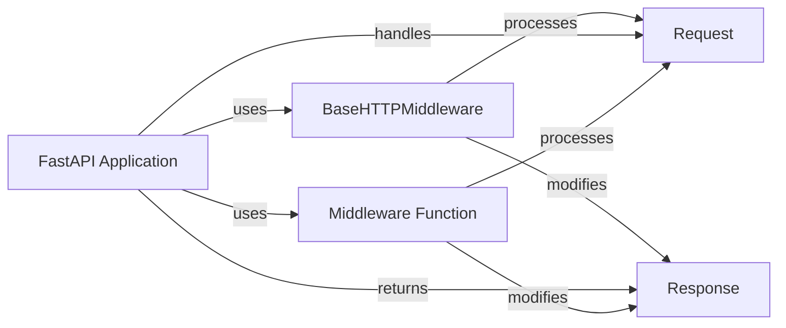

## Component Details

The middleware component in FastAPI allows developers to intercept and process requests and responses globally. It provides a mechanism to run code before and after each request, enabling functionalities like authentication, logging, request/response modification, and more. Middleware functions are executed in the order they are added to the FastAPI application, forming a chain of processing steps.

### FastAPI Application
The FastAPI application is the central point for registering routes and middleware. It inherits from Starlette and manages the request-response cycle.
- **Related Classes/Methods**: `fastapi.fastapi.applications.FastAPI:__init__` (64:964), `fastapi.fastapi.applications.FastAPI:add_middleware` (full file reference)

### BaseHTTPMiddleware
Base class for creating HTTP middleware. It provides a structure for defining middleware that processes requests and responses.  It requires subclasses to implement the `dispatch` method, which receives the request and the next middleware in the chain.
- **Related Classes/Methods**: `starlette.middleware.base.BaseHTTPMiddleware` (full file reference)

### Request
The Request object encapsulates the incoming HTTP request. Middleware can access and modify the request object to perform tasks such as authentication, validation, or request transformation.
- **Related Classes/Methods**: `starlette.requests.Request` (full file reference)

### Response
The Response object represents the HTTP response that will be sent back to the client. Middleware can access and modify the response object to perform tasks such as adding headers, compressing the response, or logging.
- **Related Classes/Methods**: `starlette.responses.Response` (full file reference)

### Middleware Function
A middleware function is a callable that receives a request and a call_next function as arguments. It processes the request, can modify it, and then calls call_next to pass the request to the next middleware or the endpoint handler. It can also process the response returned by call_next before returning it to the client.
- **Related Classes/Methods**: `fastapi.middleware` (full file reference)