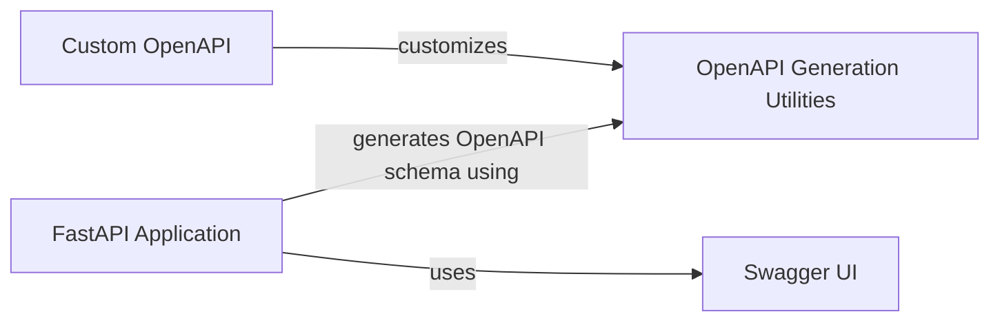

## Component Details

The OpenAPI schema generation in FastAPI is a crucial process for creating API documentation and enabling client generation. It involves the FastAPI application leveraging utility functions to construct a comprehensive schema representing the API's endpoints, parameters, security schemes, and responses. This schema is then used to render the Swagger UI, providing a user-friendly interface for interacting with the API. Customization options allow developers to tailor the schema to their specific needs.

### FastAPI Application
Represents the core FastAPI application instance, responsible for managing routes, middleware, and exception handlers. It initiates the OpenAPI schema generation process through its `openapi` method.
- **Related Classes/Methods**: `fastapi.applications.FastAPI:openapi` (966:996)

### OpenAPI Generation Utilities
A collection of utility functions that perform the heavy lifting of constructing the OpenAPI schema. These functions handle tasks such as extracting parameter information, building request bodies, and generating unique operation IDs.
- **Related Classes/Methods**: `fastapi.openapi.utils:get_openapi_security_definitions` (78:92), `fastapi.openapi.utils:_get_openapi_operation_parameters` (95:167), `fastapi.openapi.utils:get_openapi_operation_request_body` (170:204), `fastapi.openapi.utils:generate_operation_id` (207:219), `fastapi.openapi.utils:get_openapi_operation_metadata` (228:251), `fastapi.openapi.utils:get_openapi_path` (254:443), `fastapi.openapi.utils:get_fields_from_routes` (446:474), `fastapi.openapi.utils:get_openapi` (477:569)

### Swagger UI
Provides the HTML and JavaScript necessary to render the Swagger UI, a visual interface for exploring and interacting with the generated OpenAPI schema. It allows users to view API documentation and make requests directly from the browser.
- **Related Classes/Methods**: `fastapi.openapi.docs:get_swagger_ui_html` (26:158)

### Custom OpenAPI
Demonstrates the ability to customize the OpenAPI schema generation process. This allows developers to modify the schema to meet specific requirements or add additional information.
- **Related Classes/Methods**: `fastapi.docs_src.extending_openapi.tutorial001:custom_openapi` (12:26)