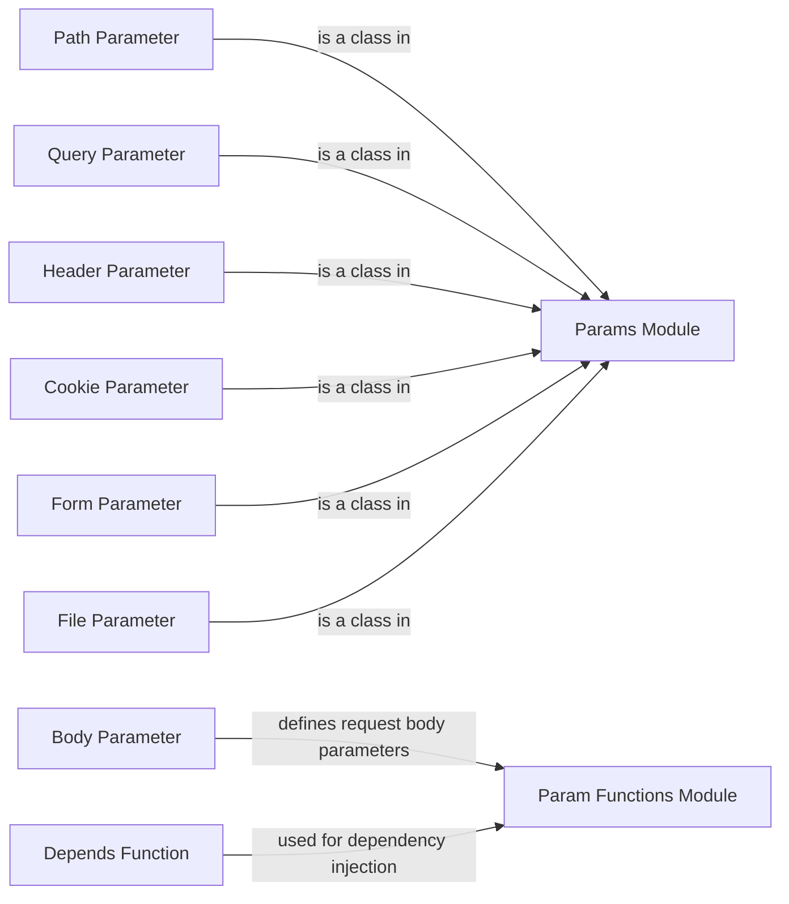

## Component Details

The Parameter Definition component in FastAPI provides a mechanism for defining and validating request parameters. It includes classes and functions for specifying the type, validation rules, and metadata of parameters extracted from various sources, such as path, query, headers, cookies, body, forms, and files. This component enables developers to define how data should be extracted and validated from incoming requests, ensuring data integrity and consistency. The core of this component lies in the `params` and `param_functions` modules, which work together to simplify parameter definition and dependency injection.

### Path Parameter
The `Path` class defines path parameters and enables their dependency injection. It encapsulates information about the path parameter, such as its default value and validation rules. It resides within the `fastapi.params` module.
- **Related Classes/Methods**: `fastapi.fastapi.params.Path` (139:222), `fastapi.fastapi.params.Path.__init__` (142:222)

### Query Parameter
The `Query` class defines query parameters and enables their dependency injection. It encapsulates information about the query parameter, such as its default value, alias, and validation rules. It resides within the `fastapi.params` module.
- **Related Classes/Methods**: `fastapi.fastapi.params.Query` (225:306), `fastapi.fastapi.params.Query.__init__` (228:306)

### Header Parameter
The `Header` class defines header parameters and enables their dependency injection. It encapsulates information about the header parameter, such as its default value, alias, and validation rules. It resides within the `fastapi.params` module.
- **Related Classes/Methods**: `fastapi.fastapi.params.Header` (309:392), `fastapi.fastapi.params.Header.__init__` (312:392)

### Cookie Parameter
The `Cookie` class defines cookie parameters and enables their dependency injection. It encapsulates information about the cookie parameter, such as its default value and validation rules. It resides within the `fastapi.params` module.
- **Related Classes/Methods**: `fastapi.fastapi.params.Cookie` (395:476), `fastapi.fastapi.params.Cookie.__init__` (398:476)

### Body Parameter
The `Body` function is used to define request body parameters. It simplifies the process of defining request body parameters and resides within the `fastapi.param_functions` module.
- **Related Classes/Methods**: `fastapi.fastapi.param_functions.Body` (1263:1589)

### Form Parameter
The `Form` class defines form data parameters and enables their dependency injection. It encapsulates information about the form parameter, such as its default value and validation rules. It resides within the `fastapi.params` module.
- **Related Classes/Methods**: `fastapi.fastapi.params.Form` (596:677), `fastapi.fastapi.params.Form.__init__` (597:677)

### File Parameter
The `File` class defines file upload parameters and enables their dependency injection. It encapsulates information about the file parameter, such as its default value and validation rules. It resides within the `fastapi.params` module.
- **Related Classes/Methods**: `fastapi.fastapi.params.File` (680:761), `fastapi.fastapi.params.File.__init__` (681:761)

### Depends Function
The `Depends` function is used for dependency injection in FastAPI. It allows you to declare dependencies that will be resolved and injected into your endpoint functions. It resides within the `fastapi.param_functions` module.
- **Related Classes/Methods**: `fastapi.fastapi.param_functions.Depends` (2220:2277)

### Param Functions Module
The `param_functions` module contains functions that are shortcuts for creating instances of the parameter classes in the `params` module. These functions include `Path`, `Query`, `Header`, `Cookie`, `Body`, `Form`, `File`, `Depends`, and `Security`.
- **Related Classes/Methods**: `fastapi.fastapi.param_functions.Path` (11:336), `fastapi.fastapi.param_functions.Query` (339:640), `fastapi.fastapi.param_functions.Header` (643:956), `fastapi.fastapi.param_functions.Cookie` (959:1260), `fastapi.fastapi.param_functions.Body` (1263:1589), `fastapi.fastapi.param_functions.Form` (1592:1903), `fastapi.fastapi.param_functions.File` (1906:2217), `fastapi.fastapi.param_functions.Depends` (2220:2277), `fastapi.fastapi.param_functions.Security` (2280:2360)

### Params Module
The `params` module contains classes that are used for dependency injection of request parameters. These classes include `Path`, `Query`, `Header`, `Cookie`, `Form`, and `File`.
- **Related Classes/Methods**: `fastapi.fastapi.params.Path` (139:222), `fastapi.fastapi.params.Query` (225:306), `fastapi.fastapi.params.Header` (309:392), `fastapi.fastapi.params.Cookie` (395:476), `fastapi.fastapi.params.Form` (596:677), `fastapi.fastapi.params.File` (680:761)