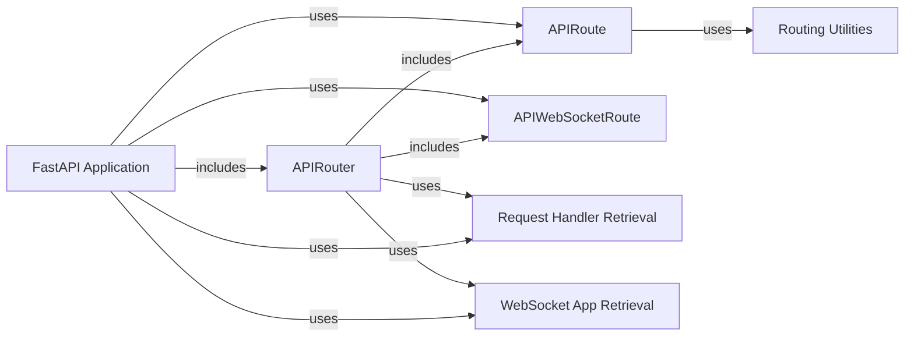

## Component Details

The routing mechanism in FastAPI is responsible for mapping incoming HTTP requests and WebSocket connections to the appropriate handler functions. It defines API routes, WebSocket routes, and routers for grouping related routes. The process involves defining routes using the FastAPI application or APIRouter, which then associates paths and HTTP methods with handler functions. When a request comes in, FastAPI's routing logic matches the request to the appropriate route and executes the corresponding handler, preparing and serializing the response before sending it back to the client.

### FastAPI Application
The FastAPI class represents the core application and inherits from Starlette. It serves as the main entry point for defining API endpoints, handling requests, and managing middleware. It includes methods for defining routes for different HTTP methods (GET, POST, PUT, DELETE, etc.) and WebSocket endpoints, as well as including other routers.
- **Related Classes/Methods**: `fastapi.applications.FastAPI:__init__` (64:964), `fastapi.applications.FastAPI:add_api_route` (1056:1113), `fastapi.applications.FastAPI:api_route` (1115:1173), `fastapi.applications.FastAPI:add_api_websocket_route` (1175:1188), `fastapi.applications.FastAPI:websocket` (1190:1253), `fastapi.applications.FastAPI:include_router` (1255:1458), `fastapi.applications.FastAPI:get` (1460:1831), `fastapi.applications.FastAPI:put` (1833:2209), `fastapi.applications.FastAPI:post` (2211:2587), `fastapi.applications.FastAPI:delete` (2589:2960), `fastapi.applications.FastAPI:options` (2962:3333), `fastapi.applications.FastAPI:head` (3335:3706), `fastapi.applications.FastAPI:patch` (3708:4084), `fastapi.applications.FastAPI:trace` (4086:4457)

### APIRouter
The APIRouter class allows you to create modular sets of API routes. It can be included in the main FastAPI application or nested within other routers. It provides methods for defining routes for different HTTP methods and WebSocket endpoints, similar to the FastAPI application itself.
- **Related Classes/Methods**: `fastapi.routing.APIRouter:__init__` (622:860), `fastapi.routing.APIRouter:add_api_route` (881:961), `fastapi.routing.APIRouter:api_route` (963:1023), `fastapi.routing.APIRouter:add_api_websocket_route` (1025:1044), `fastapi.routing.APIRouter:websocket` (1046:1111), `fastapi.routing.APIRouter:include_router` (1122:1364), `fastapi.routing.APIRouter:get` (1366:1741), `fastapi.routing.APIRouter:put` (1743:2123), `fastapi.routing.APIRouter:post` (2125:2505), `fastapi.routing.APIRouter:delete` (2507:2882), `fastapi.routing.APIRouter:options` (2884:3259), `fastapi.routing.APIRouter:head` (3261:3641), `fastapi.routing.APIRouter:patch` (3643:4023), `fastapi.routing.APIRouter:trace` (4025:4405)

### APIRoute
The APIRoute class represents a single API route, associating a path, HTTP method(s), and a route handler function. It's responsible for processing incoming requests, calling the handler, and returning the response. It also handles dependency injection and validation.
- **Related Classes/Methods**: `fastapi.routing.APIRoute:__init__` (429:569), `fastapi.routing.APIRoute:get_route_handler` (571:586)

### APIWebSocketRoute
The APIWebSocketRoute class represents a WebSocket endpoint. It handles WebSocket connections, manages communication between the client and server, and executes the WebSocket handler function.
- **Related Classes/Methods**: `fastapi.routing.APIWebSocketRoute:__init__` (389:419)

### Routing Utilities
This component includes utility functions for preparing and serializing responses. `_prepare_response_content` handles tasks like converting data to a suitable format (e.g., JSON) and setting appropriate headers. `serialize_response` deals with the final serialization of the response before sending it to the client.
- **Related Classes/Methods**: `fastapi.routing:_prepare_response_content` (79:123), `fastapi.routing:serialize_response` (143:201)

### Request Handler Retrieval
The `get_request_handler` function is responsible for retrieving the appropriate handler function for a given request based on the route and HTTP method. It performs route matching and dispatches the request to the correct handler.
- **Related Classes/Methods**: `fastapi.routing:get_request_handler` (217:357)

### WebSocket App Retrieval
The `get_websocket_app` function is responsible for retrieving the appropriate application for a given websocket request based on the route. It performs route matching and dispatches the request to the correct application.
- **Related Classes/Methods**: `fastapi.routing:get_websocket_app` (360:385)