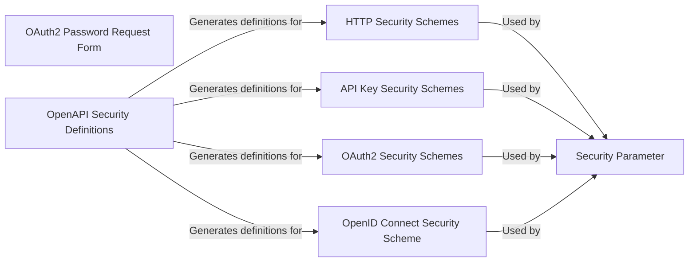

## Component Details

The Security component in FastAPI provides a flexible and extensible way to secure applications using various authentication and authorization schemes. It offers implementations for HTTP Basic, HTTP Bearer, API Key (via query, header, or cookie), OAuth2 (including password and authorization code flows), and OpenID Connect. These schemes are implemented as classes that can be used as dependencies in FastAPI route handlers, allowing for easy integration of security measures. The component also includes utilities for generating OpenAPI security definitions, ensuring that the security schemes are properly documented in the API specification.

### HTTP Security Schemes
This component provides HTTP-based authentication schemes, including HTTPBasic and HTTPBearer. These classes handle the authentication logic using standard HTTP authentication mechanisms. They inherit from HTTPBase, which defines the basic structure for HTTP authentication schemes.
- **Related Classes/Methods**: `fastapi.fastapi.security.http.HTTPBase` (69:94), `fastapi.fastapi.security.http.HTTPBasic` (97:217), `fastapi.fastapi.security.http.HTTPBearer` (220:321)

### API Key Security Schemes
This component implements API key-based authentication schemes, allowing clients to authenticate using an API key passed via query parameters (APIKeyQuery), HTTP headers (APIKeyHeader), or cookies (APIKeyCookie). Each class is responsible for extracting the API key from the appropriate location and validating it.
- **Related Classes/Methods**: `fastapi.fastapi.security.api_key.APIKeyQuery` (23:112), `fastapi.fastapi.security.api_key.APIKeyHeader` (115:200), `fastapi.fastapi.security.api_key.APIKeyCookie` (203:288)

### OAuth2 Security Schemes
This component provides OAuth2-based authentication schemes, including OAuth2, OAuth2PasswordBearer, and OAuth2AuthorizationCodeBearer. These classes handle the authentication logic using the OAuth2 protocol. OAuth2PasswordBearer is commonly used for password-based flows, while OAuth2AuthorizationCodeBearer is used for authorization code flows.
- **Related Classes/Methods**: `fastapi.fastapi.security.oauth2.OAuth2` (308:388), `fastapi.fastapi.security.oauth2.OAuth2PasswordBearer` (391:485), `fastapi.fastapi.security.oauth2.OAuth2AuthorizationCodeBearer` (488:595)

### OAuth2 Password Request Form
This component represents the OAuth2PasswordRequestForm, which is used to handle the request body for password-based OAuth2 flows. It defines the structure of the request, including username and password fields, and performs validation.
- **Related Classes/Methods**: `fastapi.fastapi.security.oauth2.OAuth2PasswordRequestForm` (16:149)

### OpenID Connect Security Scheme
This component includes the OpenIdConnect class, which defines how authentication is performed using the OpenID Connect protocol. It handles the discovery of the OpenID Connect provider's configuration and the validation of ID tokens.
- **Related Classes/Methods**: `fastapi.fastapi.security.open_id_connect_url.OpenIdConnect` (11:84)

### Security Parameter
This component represents the Security class from fastapi.param_functions. It's used as a dependency injection parameter to declare security requirements for a specific endpoint. It allows developers to specify which security schemes should be applied to a route.
- **Related Classes/Methods**: `fastapi.fastapi.param_functions:Security` (2280:2360)

### OpenAPI Security Definitions
This component represents the get_openapi_security_definitions function, which is responsible for generating the OpenAPI security definitions based on the security schemes used in the application. It ensures that the API documentation accurately reflects the security requirements of the API.
- **Related Classes/Methods**: `fastapi.fastapi.openapi.utils:get_openapi_security_definitions` (78:92)