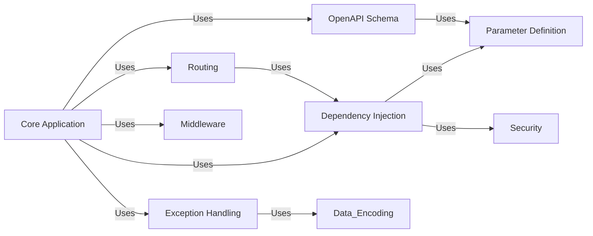

## Component Details

FastAPI is a modern, high-performance web framework for building APIs with Python. It leverages type hints to provide automatic data validation, serialization, and API documentation. The framework is built on top of Starlette and Pydantic, offering a robust and efficient foundation for developing web applications and APIs.

### Core Application
The Core Application component is the heart of a FastAPI application, responsible for initializing and configuring the API. It manages the creation of routes, middleware, exception handlers, and integrates with the OpenAPI schema generation. It serves as the central point for managing the application's lifecycle and configuration, providing the entry point for handling incoming requests and coordinating the various components of the framework.
- **Related Classes/Methods**: `fastapi.fastapi.applications.FastAPI:__init__` (64:964), `fastapi.fastapi.applications.FastAPI:setup` (998:1049), `fastapi.fastapi.applications.FastAPI:add_api_route` (1056:1113), `fastapi.fastapi.applications.FastAPI:add_api_websocket_route` (1175:1188), `fastapi.fastapi.applications.FastAPI:include_router` (1255:1458), `fastapi.fastapi.applications.FastAPI:on_event` (4476:4495), `fastapi.fastapi.applications.FastAPI:openapi` (966:996)

### Routing
The Routing component is responsible for mapping incoming HTTP requests to the appropriate handler functions. It defines API routes, WebSocket routes, and routers for grouping related routes. It also handles the preparation and serialization of responses, ensuring that requests are directed to the correct handlers and responses are formatted correctly before being sent back to the client.
- **Related Classes/Methods**: `fastapi.fastapi.routing.APIRoute:__init__` (429:569), `fastapi.fastapi.routing.APIRoute:get_route_handler` (571:586), `fastapi.fastapi.routing.APIWebSocketRoute:__init__` (389:419), `fastapi.fastapi.routing.APIRouter:__init__` (622:860), `fastapi.fastapi.routing.APIRouter:add_api_route` (881:961), `fastapi.fastapi.routing.APIRouter:add_api_websocket_route` (1025:1044), `fastapi.fastapi.routing.APIRouter:include_router` (1122:1364), `fastapi.fastapi.routing:get_request_handler` (217:357), `fastapi.fastapi.routing:get_websocket_app` (360:385), `fastapi.fastapi.routing:_prepare_response_content` (79:123), `fastapi.fastapi.routing:serialize_response` (143:201)

### Dependency Injection
The Dependency Injection component manages the resolution and injection of dependencies into route handler functions. It extracts data from various sources (path, query, headers, cookies, body, forms, files), validates the data, and injects it into the handler functions as arguments. This component simplifies the process of accessing request data and ensures that handler functions receive the required data in the correct format, promoting code reusability and testability.
- **Related Classes/Methods**: `fastapi.fastapi.dependencies.utils:get_dependant` (265:314), `fastapi.fastapi.dependencies.utils:solve_dependencies` (572:695), `fastapi.fastapi.dependencies.utils:request_params_to_args` (740:816), `fastapi.fastapi.dependencies.utils:request_body_to_args` (884:927), `fastapi.fastapi.dependencies.utils:get_body_field` (930:980), `fastapi.fastapi.dependencies.utils:analyze_param` (348:511), `fastapi.fastapi.dependencies.utils:get_typed_signature` (231:244)

### Parameter Definition
The Parameter Definition component provides a set of tools for defining and validating request parameters. It includes classes and functions for specifying the type, validation rules, and metadata of parameters extracted from various sources, such as path, query, headers, cookies, body, forms, and files. This component enables developers to define how data should be extracted and validated from incoming requests, ensuring data integrity and consistency.
- **Related Classes/Methods**: `fastapi.fastapi.params.Path:__init__` (142:222), `fastapi.fastapi.params.Query:__init__` (228:306), `fastapi.fastapi.params.Header:__init__` (312:392), `fastapi.fastapi.params.Cookie:__init__` (398:476), `fastapi.fastapi.params.Form:__init__` (597:677), `fastapi.fastapi.params.File:__init__` (681:761), `fastapi.fastapi.param_functions:Path` (11:336), `fastapi.fastapi.param_functions:Query` (339:640), `fastapi.fastapi.param_functions:Header` (643:956), `fastapi.fastapi.param_functions:Cookie` (959:1260), `fastapi.fastapi.param_functions:Body` (1263:1589), `fastapi.fastapi.param_functions:Form` (1592:1903), `fastapi.fastapi.param_functions:File` (1906:2217), `fastapi.fastapi.param_functions:Depends` (2220:2277), `fastapi.fastapi.param_functions:Security` (2280:2360)

### Security
The Security component provides a set of security schemes for securing FastAPI applications. It includes support for HTTP Basic, HTTP Bearer, API Key, OAuth2, and OpenID Connect. This component handles authentication and authorization of requests, ensuring that only authorized users can access protected resources and that sensitive data is protected from unauthorized access.
- **Related Classes/Methods**: `fastapi.fastapi.security.http.HTTPBase:__init__` (70:80), `fastapi.fastapi.security.http.HTTPBase:__call__` (82:94), `fastapi.fastapi.security.http.HTTPBasic:__init__` (130:185), `fastapi.fastapi.security.http.HTTPBasic:__call__` (187:217), `fastapi.fastapi.security.http.HTTPBearer:__init__` (252:299), `fastapi.fastapi.security.http.HTTPBearer:__call__` (301:321), `fastapi.fastapi.security.api_key.APIKeyQuery:__init__` (55:108), `fastapi.fastapi.security.api_key.APIKeyQuery:__call__` (110:112), `fastapi.fastapi.security.api_key.APIKeyHeader:__init__` (147:196), `fastapi.fastapi.security.api_key.APIKeyHeader:__call__` (198:200), `fastapi.fastapi.security.api_key.APIKeyCookie:__init__` (235:284), `fastapi.fastapi.security.api_key.APIKeyCookie:__call__` (286:288), `fastapi.fastapi.security.oauth2.OAuth2PasswordRequestForm:__init__` (61:149), `fastapi.fastapi.security.oauth2.OAuth2:__init__` (321:377), `fastapi.fastapi.security.oauth2.OAuth2:__call__` (379:388), `fastapi.fastapi.security.oauth2.OAuth2PasswordBearer:__init__` (400:471), `fastapi.fastapi.security.oauth2.OAuth2PasswordBearer:__call__` (473:485), `fastapi.fastapi.security.oauth2.OAuth2AuthorizationCodeBearer:__init__` (494:581), `fastapi.fastapi.security.oauth2.OAuth2AuthorizationCodeBearer:__call__` (583:595), `fastapi.fastapi.security.open_id_connect_url.OpenIdConnect:__init__` (17:73)

### OpenAPI Schema
The OpenAPI Schema component is responsible for generating the OpenAPI schema for the API. It collects information about the routes, parameters, security schemes, and responses, and generates a JSON or YAML representation of the API. This schema can be used for API documentation, client generation, and other purposes, providing a standardized way to describe the API's functionality and structure.
- **Related Classes/Methods**: `fastapi.fastapi.openapi.utils:get_openapi` (477:569), `fastapi.fastapi.openapi.utils:get_openapi_security_definitions` (78:92), `fastapi.fastapi.openapi.utils:_get_openapi_operation_parameters` (95:167), `fastapi.fastapi.openapi.utils:get_openapi_operation_request_body` (170:204), `fastapi.fastapi.openapi.utils:get_openapi_path` (254:443)

### Exception Handling
The Exception Handling component provides a centralized mechanism for handling exceptions that occur during request processing. It includes default handlers for HTTP exceptions and request validation exceptions, and allows developers to define custom exception handlers. This component ensures that errors are handled gracefully and informative error responses are returned to the client, improving the user experience and simplifying debugging.
- **Related Classes/Methods**: `fastapi.fastapi.exception_handlers:http_exception_handler` (11:17), `fastapi.fastapi.exception_handlers:request_validation_exception_handler` (20:26), `fastapi.fastapi.exception_handlers:websocket_request_validation_exception_handler` (29:34), `fastapi.fastapi.exceptions.RequestValidationError:__init__` (158:160), `fastapi.fastapi.exceptions.ResponseValidationError:__init__` (168:170)

### Middleware
The Middleware component provides a mechanism for intercepting and processing requests and responses as they flow through the application. It allows developers to add custom logic to modify requests before they reach the route handler, or to modify responses before they are sent back to the client. This component can be used for tasks such as authentication, logging, request transformation, and response compression, providing a flexible way to extend the functionality of the framework.
- **Related Classes/Methods**: `fastapi.middleware` (full file reference)