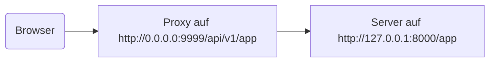

# Hinter einem Proxy

In manchen Situationen müssen Sie möglicherweise einen **Proxy**-Server wie Traefik oder Nginx verwenden, mit einer Konfiguration, die ein zusätzliches Pfadpräfix hinzufügt, das von Ihrer Anwendung nicht gesehen wird.

In diesen Fällen können Sie `root_path` verwenden, um Ihre Anwendung zu konfigurieren.

Der `root_path` („Wurzelpfad“) ist ein Mechanismus, der von der ASGI-Spezifikation bereitgestellt wird (auf der FastAPI via Starlette aufbaut).

Der `root_path` wird verwendet, um diese speziellen Fälle zu handhaben.

Und er wird auch intern beim Mounten von Unteranwendungen verwendet.

## Proxy mit einem abgetrennten Pfadpräfix

Ein Proxy mit einem abgetrennten Pfadpräfix bedeutet in diesem Fall, dass Sie einen Pfad unter `/app` in Ihrem Code deklarieren könnten, dann aber, eine Ebene darüber, den Proxy hinzufügen, der Ihre **FastAPI**-Anwendung unter einem Pfad wie `/api/v1` platziert.

In diesem Fall würde der ursprüngliche Pfad `/app` tatsächlich unter `/api/v1/app` bereitgestellt.

Auch wenn Ihr gesamter Code unter der Annahme geschrieben ist, dass es nur `/app` gibt.

```Python hl_lines="6"
{!../../../docs_src/behind_a_proxy/tutorial001.py!}
```

Und der Proxy würde das **Pfadpräfix** on-the-fly **"entfernen**", bevor er die Anfrage an Uvicorn übermittelt, dafür sorgend, dass Ihre Anwendung davon überzeugt ist, dass sie unter `/app` bereitgestellt wird, sodass Sie nicht Ihren gesamten Code dahingehend aktualisieren müssen, das Präfix `/api/v1` zu verwenden.

Bis hierher würde alles wie gewohnt funktionieren.

Wenn Sie dann jedoch die Benutzeroberfläche der integrierten Dokumentation (das Frontend) öffnen, wird angenommen, dass sich das OpenAPI-Schema unter `/openapi.json` anstelle von `/api/v1/openapi.json` befindet.

Das Frontend (das im Browser läuft) würde also versuchen, `/openapi.json` zu erreichen und wäre nicht in der Lage, das OpenAPI-Schema abzurufen.

Da wir für unsere Anwendung einen Proxy mit dem Pfadpräfix `/api/v1` haben, muss das Frontend das OpenAPI-Schema unter `/api/v1/openapi.json` abrufen.



/// tip | "Tipp"

Die IP `0.0.0.0` wird üblicherweise verwendet, um anzudeuten, dass das Programm alle auf diesem Computer/Server verfügbaren IPs abhört.

///

Die Benutzeroberfläche der Dokumentation würde benötigen, dass das OpenAPI-Schema deklariert, dass sich dieser API-`server` unter `/api/v1` (hinter dem Proxy) befindet. Zum Beispiel:

```JSON hl_lines="4-8"
{
    "openapi": "3.1.0",
    // Hier mehr Einstellungen
    "servers": [
        {
            "url": "/api/v1"
        }
    ],
    "paths": {
            // Hier mehr Einstellungen
    }
}
```

In diesem Beispiel könnte der „Proxy“ etwa **Traefik** sein. Und der Server wäre so etwas wie **Uvicorn**, auf dem Ihre FastAPI-Anwendung ausgeführt wird.

### Bereitstellung des `root_path`

Um dies zu erreichen, können Sie die Kommandozeilenoption `--root-path` wie folgt verwenden:

<div class="termy">

```console
$ uvicorn main:app --root-path /api/v1

<span style="color: green;">INFO</span>:     Uvicorn running on http://127.0.0.1:8000 (Press CTRL+C to quit)
```

</div>

Falls Sie Hypercorn verwenden, das hat auch die Option `--root-path`.

/// note | "Technische Details"

Die ASGI-Spezifikation definiert einen `root_path` für diesen Anwendungsfall.

Und die Kommandozeilenoption `--root-path` stellt diesen `root_path` bereit.

///

### Überprüfen des aktuellen `root_path`

Sie können den aktuellen `root_path` abrufen, der von Ihrer Anwendung für jede Anfrage verwendet wird. Er ist Teil des `scope`-Dictionarys (das ist Teil der ASGI-Spezifikation).

Hier fügen wir ihn, nur zu Demonstrationszwecken, in die Nachricht ein.

```Python hl_lines="8"
{!../../../docs_src/behind_a_proxy/tutorial001.py!}
```

Wenn Sie Uvicorn dann starten mit:

<div class="termy">

```console
$ uvicorn main:app --root-path /api/v1

<span style="color: green;">INFO</span>:     Uvicorn running on http://127.0.0.1:8000 (Press CTRL+C to quit)
```

</div>

wäre die Response etwa:

```JSON
{
    "message": "Hello World",
    "root_path": "/api/v1"
}
```

### Festlegen des `root_path` in der FastAPI-Anwendung

Falls Sie keine Möglichkeit haben, eine Kommandozeilenoption wie `--root-path` oder ähnlich zu übergeben, können Sie als Alternative beim Erstellen Ihrer FastAPI-Anwendung den Parameter `root_path` setzen:

```Python hl_lines="3"
{!../../../docs_src/behind_a_proxy/tutorial002.py!}
```

Die Übergabe des `root_path` an `FastAPI` wäre das Äquivalent zur Übergabe der `--root-path`-Kommandozeilenoption an Uvicorn oder Hypercorn.

### Über `root_path`

Beachten Sie, dass der Server (Uvicorn) diesen `root_path` für nichts anderes außer die Weitergabe an die Anwendung verwendet.

Aber wenn Sie mit Ihrem Browser auf <a href="http://127.0.0.1:8000" class="external-link" target="_blank">http://127.0.0.1:8000/app</a> gehen, sehen Sie die normale Antwort:

```JSON
{
    "message": "Hello World",
    "root_path": "/api/v1"
}
```

Es wird also nicht erwartet, dass unter `http://127.0.0.1:8000/api/v1/app` darauf zugegriffen wird.

Uvicorn erwartet, dass der Proxy unter `http://127.0.0.1:8000/app` auf Uvicorn zugreift, und dann liegt es in der Verantwortung des Proxys, das zusätzliche `/api/v1`-Präfix darüber hinzuzufügen.

## Über Proxys mit einem abgetrennten Pfadpräfix

Bedenken Sie, dass ein Proxy mit abgetrennten Pfadpräfix nur eine von vielen Konfigurationsmöglichkeiten ist.

Wahrscheinlich wird in vielen Fällen die Standardeinstellung sein, dass der Proxy kein abgetrenntes Pfadpräfix hat.

In einem solchen Fall (ohne ein abgetrenntes Pfadpräfix) würde der Proxy auf etwas wie `https://myawesomeapp.com` lauschen, und wenn der Browser dann zu `https://myawesomeapp.com/api/v1/` wechselt, und Ihr Server (z. B. Uvicorn) auf `http://127.0.0.1:8000` lauscht, würde der Proxy (ohne ein abgetrenntes Pfadpräfix) über denselben Pfad auf Uvicorn zugreifen: `http://127.0.0.1:8000/api/v1/app`.

## Lokal testen mit Traefik

Sie können das Experiment mit einem abgetrennten Pfadpräfix ganz einfach lokal ausführen, indem Sie <a href="https://docs.traefik.io/" class="external-link" target="_blank">Traefik</a> verwenden.

<a href="https://github.com/containous/traefik/releases" class="external-link" target="_blank">Laden Sie Traefik herunter</a>, es ist eine einzelne Binärdatei, Sie können die komprimierte Datei extrahieren und sie direkt vom Terminal aus ausführen.

Dann erstellen Sie eine Datei `traefik.toml` mit:

```TOML hl_lines="3"
[entryPoints]
  [entryPoints.http]
    address = ":9999"

[providers]
  [providers.file]
    filename = "routes.toml"
```

Dadurch wird Traefik angewiesen, Port 9999 abzuhören und eine andere Datei `routes.toml` zu verwenden.

/// tip | "Tipp"

Wir verwenden Port 9999 anstelle des Standard-HTTP-Ports 80, damit Sie ihn nicht mit Administratorrechten (`sudo`) ausführen müssen.

///

Erstellen Sie nun die andere Datei `routes.toml`:

```TOML hl_lines="5  12  20"
[http]
  [http.middlewares]

    [http.middlewares.api-stripprefix.stripPrefix]
      prefixes = ["/api/v1"]

  [http.routers]

    [http.routers.app-http]
      entryPoints = ["http"]
      service = "app"
      rule = "PathPrefix(`/api/v1`)"
      middlewares = ["api-stripprefix"]

  [http.services]

    [http.services.app]
      [http.services.app.loadBalancer]
        [[http.services.app.loadBalancer.servers]]
          url = "http://127.0.0.1:8000"
```

Diese Datei konfiguriert Traefik, das Pfadpräfix `/api/v1` zu verwenden.

Und dann leitet Traefik seine Anfragen an Ihren Uvicorn weiter, der unter `http://127.0.0.1:8000` läuft.

Starten Sie nun Traefik:

<div class="termy">

```console
$ ./traefik --configFile=traefik.toml

INFO[0000] Configuration loaded from file: /home/user/awesomeapi/traefik.toml
```

</div>

Und jetzt starten Sie Ihre Anwendung mit Uvicorn, indem Sie die Option `--root-path` verwenden:

<div class="termy">

```console
$ uvicorn main:app --root-path /api/v1

<span style="color: green;">INFO</span>:     Uvicorn running on http://127.0.0.1:8000 (Press CTRL+C to quit)
```

</div>

### Die Responses betrachten

Wenn Sie nun zur URL mit dem Port für Uvicorn gehen: <a href="http://127.0.0.1:8000/app" class="external-link" target="_blank">http://127.0.0.1:8000/app</a>, sehen Sie die normale Response:

```JSON
{
    "message": "Hello World",
    "root_path": "/api/v1"
}
```

/// tip | "Tipp"

Beachten Sie, dass, obwohl Sie unter `http://127.0.0.1:8000/app` darauf zugreifen, als `root_path` angezeigt wird `/api/v1`, welches aus der Option `--root-path` stammt.

///

Öffnen Sie nun die URL mit dem Port für Traefik, einschließlich des Pfadpräfixes: <a href="http://127.0.0.1:9999/api/v1/app" class="external-link" target="_blank">http://127.0.0.1:9999/api/v1/app</a>.

Wir bekommen die gleiche Response:

```JSON
{
    "message": "Hello World",
    "root_path": "/api/v1"
}
```

Diesmal jedoch unter der URL mit dem vom Proxy bereitgestellten Präfixpfad: `/api/v1`.

Die Idee hier ist natürlich, dass jeder über den Proxy auf die Anwendung zugreifen soll, daher ist die Version mit dem Pfadpräfix `/api/v1` die „korrekte“.

Und die von Uvicorn direkt bereitgestellte Version ohne Pfadpräfix (`http://127.0.0.1:8000/app`) wäre ausschließlich für den Zugriff durch den _Proxy_ (Traefik) bestimmt.

Dies demonstriert, wie der Proxy (Traefik) das Pfadpräfix verwendet und wie der Server (Uvicorn) den `root_path` aus der Option `--root-path` verwendet.

### Es in der Dokumentationsoberfläche betrachten

Jetzt folgt der spaßige Teil. ✨

Der „offizielle“ Weg, auf die Anwendung zuzugreifen, wäre über den Proxy mit dem von uns definierten Pfadpräfix. Wenn Sie also die von Uvicorn direkt bereitgestellte Dokumentationsoberfläche ohne das Pfadpräfix in der URL ausprobieren, wird es erwartungsgemäß nicht funktionieren, da erwartet wird, dass der Zugriff über den Proxy erfolgt.

Sie können das unter <a href="http://127.0.0.1:8000/docs" class="external-link" target="_blank">http://127.0.0.1:8000/docs</a> sehen:


Wenn wir jedoch unter der „offiziellen“ URL, über den Proxy mit Port `9999`, unter `/api/v1/docs`, auf die Dokumentationsoberfläche zugreifen, funktioniert es ordnungsgemäß! 🎉

Sie können das unter <a href="http://127.0.0.1:9999/api/v1/docs" class="external-link" target="_blank">http://127.0.0.1:9999/api/v1/docs</a> testen:


Genau so, wie wir es wollten. ✔️

Dies liegt daran, dass FastAPI diesen `root_path` verwendet, um den Default-`server` in OpenAPI mit der von `root_path` bereitgestellten URL zu erstellen.

## Zusätzliche Server

/// warning | "Achtung"

Dies ist ein fortgeschrittener Anwendungsfall. Überspringen Sie das gerne.

///

Standardmäßig erstellt **FastAPI** einen `server` im OpenAPI-Schema mit der URL für den `root_path`.

Sie können aber auch andere alternative `server` bereitstellen, beispielsweise wenn Sie möchten, dass *dieselbe* Dokumentationsoberfläche mit einer Staging- und Produktionsumgebung interagiert.

Wenn Sie eine benutzerdefinierte Liste von Servern (`servers`) übergeben und es einen `root_path` gibt (da Ihre API hinter einem Proxy läuft), fügt **FastAPI** einen „Server“ mit diesem `root_path` am Anfang der Liste ein.

Zum Beispiel:

```Python hl_lines="4-7"
{!../../../docs_src/behind_a_proxy/tutorial003.py!}
```

Erzeugt ein OpenAPI-Schema, wie:

```JSON hl_lines="5-7"
{
    "openapi": "3.1.0",
    // Hier mehr Einstellungen
    "servers": [
        {
            "url": "/api/v1"
        },
        {
            "url": "https://stag.example.com",
            "description": "Staging environment"
        },
        {
            "url": "https://prod.example.com",
            "description": "Production environment"
        }
    ],
    "paths": {
            // Hier mehr Einstellungen
    }
}
```

/// tip | "Tipp"

Beachten Sie den automatisch generierten Server mit dem `URL`-Wert `/api/v1`, welcher vom `root_path` stammt.

///

In der Dokumentationsoberfläche unter <a href="http://127.0.0.1:9999/api/v1/docs" class="external-link" target="_blank">http://127.0.0.1:9999/api/v1/docs</a> würde es so aussehen:


/// tip | "Tipp"

Die Dokumentationsoberfläche interagiert mit dem von Ihnen ausgewählten Server.

///

### Den automatischen Server von `root_path` deaktivieren

Wenn Sie nicht möchten, dass **FastAPI** einen automatischen Server inkludiert, welcher `root_path` verwendet, können Sie den Parameter `root_path_in_servers=False` verwenden:

```Python hl_lines="9"
{!../../../docs_src/behind_a_proxy/tutorial004.py!}
```

Dann wird er nicht in das OpenAPI-Schema aufgenommen.

## Mounten einer Unteranwendung

Wenn Sie gleichzeitig eine Unteranwendung mounten (wie beschrieben in [Unteranwendungen – Mounts](sub-applications.md){.internal-link target=_blank}) und einen Proxy mit `root_path` verwenden wollen, können Sie das normal tun, wie Sie es erwarten würden.

FastAPI verwendet intern den `root_path` auf intelligente Weise, sodass es einfach funktioniert. ✨
