# Hinter einem Proxy { #behind-a-proxy }

In vielen Situationen würden Sie einen **Proxy** wie Traefik oder Nginx vor Ihrer FastAPI-App verwenden.

Diese Proxys könnten HTTPS-Zertifikate und andere Dinge handhaben.

## Proxy-<abbr title="weitergeleitete Header">Forwarded-Header</abbr> { #proxy-forwarded-headers }

Ein **Proxy** vor Ihrer Anwendung würde normalerweise einige Header on-the-fly setzen, bevor er die Requests an den **Server** sendet, um den Server wissen zu lassen, dass der Request vom Proxy **weitergeleitet** wurde, einschließlich der ursprünglichen (öffentlichen) URL, inklusive der Domain, dass HTTPS verwendet wird, usw.

Das **Server**-Programm (z. B. **Uvicorn** via **FastAPI CLI**) ist in der Lage, diese Header zu interpretieren und diese Information dann an Ihre Anwendung weiterzugeben.

Aber aus Sicherheitsgründen, da der Server nicht weiß, dass er hinter einem vertrauenswürdigen Proxy läuft, wird er diese Header nicht interpretieren.

/// note | Technische Details

Die Proxy-Header sind:

* <a href="https://developer.mozilla.org/en-US/docs/Web/HTTP/Reference/Headers/X-Forwarded-For" class="external-link" target="_blank">X-Forwarded-For</a>
* <a href="https://developer.mozilla.org/en-US/docs/Web/HTTP/Reference/Headers/X-Forwarded-Proto" class="external-link" target="_blank">X-Forwarded-Proto</a>
* <a href="https://developer.mozilla.org/en-US/docs/Web/HTTP/Reference/Headers/X-Forwarded-Host" class="external-link" target="_blank">X-Forwarded-Host</a>

///

### Proxy-Forwarded-Header aktivieren { #enable-proxy-forwarded-headers }

Sie können FastAPI CLI mit der *CLI-Option* `--forwarded-allow-ips` starten und die IP-Adressen übergeben, denen vertraut werden soll, um diese Forwarded-Header zu lesen.

Wenn Sie es auf `--forwarded-allow-ips="*"` setzen, würde es allen eingehenden IPs vertrauen.

Wenn Ihr **Server** hinter einem vertrauenswürdigen **Proxy** sitzt und nur der Proxy mit ihm spricht, würde dies dazu führen, dass er die IP dieses **Proxys** akzeptiert, was auch immer sie ist.

<div class="termy">

```console
$ fastapi run --forwarded-allow-ips="*"

<span style="color: green;">INFO</span>:     Uvicorn running on http://127.0.0.1:8000 (Press CTRL+C to quit)
```

</div>

### Weiterleitungen mit HTTPS { #redirects-with-https }

Angenommen, Sie definieren eine *Pfadoperation* `/items/`:

{* ../../docs_src/behind_a_proxy/tutorial001_01.py hl[6] *}

Wenn der Client versucht, zu `/items` zu gehen, würde er standardmäßig zu `/items/` umgeleitet.

Aber bevor Sie die *CLI-Option* `--forwarded-allow-ips` setzen, könnte er zu `http://localhost:8000/items/` umleiten.

Aber möglicherweise wird Ihre Anwendung unter `https://mysuperapp.com` gehostet, und die Weiterleitung sollte zu `https://mysuperapp.com/items/` erfolgen.

Durch Setzen von `--proxy-headers` kann FastAPI jetzt an den richtigen Ort umleiten. 😎

```
https://mysuperapp.com/items/
```

/// tip | Tipp

Wenn Sie mehr über HTTPS erfahren möchten, lesen Sie den Leitfaden [Über HTTPS](../deployment/https.md){.internal-link target=_blank}.

///

### Wie Proxy-Forwarded-Header funktionieren

Hier ist eine visuelle Darstellung, wie der **Proxy** weitergeleitete Header zwischen dem Client und dem **Anwendungsserver** hinzufügt:

```mermaid
sequenceDiagram
    participant Client
    participant Proxy as Proxy/Loadbalancer
    participant Server as FastAPI Server

    Client->>Proxy: HTTPS-Request<br/>Host: mysuperapp.com<br/>Pfad: /items

    Note over Proxy: Proxy fügt Forwarded-Header hinzu

    Proxy->>Server: HTTP-Request<br/>X-Forwarded-For: [client IP]<br/>X-Forwarded-Proto: https<br/>X-Forwarded-Host: mysuperapp.com<br/>Pfad: /items

    Note over Server: Server interpretiert die Header<br/>(wenn --forwarded-allow-ips gesetzt ist)

    Server->>Proxy: HTTP-Response<br/>mit correkten HTTPS-URLs

    Proxy->>Client: HTTPS-Response
```



Der **Proxy** fängt den ursprünglichen Client-Request ab und fügt die speziellen *Forwarded*-Header (`X-Forwarded-*`) hinzu, bevor er den Request an den **Anwendungsserver** weitergibt.

Diese Header bewahren Informationen über den ursprünglichen Request, die sonst verloren gingen:

* **X-Forwarded-For**: Die ursprüngliche IP-Adresse des Clients
* **X-Forwarded-Proto**: Das ursprüngliche Protokoll (`https`)
* **X-Forwarded-Host**: Der ursprüngliche Host (`mysuperapp.com`)

Wenn **FastAPI CLI** mit `--forwarded-allow-ips` konfiguriert ist, vertraut es diesen Headern und verwendet sie, z. B. um die korrekten URLs in Weiterleitungen zu erzeugen.

## Proxy mit einem abgetrennten Pfadpräfix { #proxy-with-a-stripped-path-prefix }

Sie könnten einen Proxy haben, der Ihrer Anwendung ein Pfadpräfix hinzufügt.

In diesen Fällen können Sie <abbr title="Wurzelpfad">`root_path`</abbr> verwenden, um Ihre Anwendung zu konfigurieren.

Der `root_path` ist ein Mechanismus, der von der ASGI-Spezifikation bereitgestellt wird (auf der FastAPI via Starlette aufbaut).

Der `root_path` wird verwendet, um diese speziellen Fälle zu handhaben.

Und er wird auch intern beim Mounten von Unteranwendungen verwendet.

Ein Proxy mit einem abgetrennten Pfadpräfix bedeutet in diesem Fall, dass Sie einen Pfad unter `/app` in Ihrem Code deklarieren könnten, dann aber, eine Ebene darüber, den Proxy hinzufügen, der Ihre **FastAPI**-Anwendung unter einem Pfad wie `/api/v1` platziert.

In diesem Fall würde der ursprüngliche Pfad `/app` tatsächlich unter `/api/v1/app` bereitgestellt.

Auch wenn Ihr gesamter Code unter der Annahme geschrieben ist, dass es nur `/app` gibt.

{* ../../docs_src/behind_a_proxy/tutorial001.py hl[6] *}

Und der Proxy würde das **Pfadpräfix** on-the-fly **„entfernen“**, bevor er den <abbr title="Request – Anfrage: Daten, die der Client zum Server sendet">Request</abbr> an den Anwendungsserver (wahrscheinlich Uvicorn via FastAPI CLI) übermittelt, dafür sorgend, dass Ihre Anwendung davon überzeugt ist, dass sie unter `/app` bereitgestellt wird, sodass Sie nicht Ihren gesamten Code dahingehend aktualisieren müssen, das Präfix `/api/v1` zu verwenden.

Bis hierher würde alles wie gewohnt funktionieren.

Wenn Sie dann jedoch die Benutzeroberfläche der integrierten Dokumentation (das Frontend) öffnen, wird angenommen, dass sich das OpenAPI-Schema unter `/openapi.json` anstelle von `/api/v1/openapi.json` befindet.

Also würde das Frontend (das im Browser läuft) versuchen, `/openapi.json` zu erreichen und wäre nicht in der Lage, das OpenAPI-Schema abzurufen.

Da wir für unsere Anwendung einen Proxy mit dem Pfadpräfix `/api/v1` haben, muss das Frontend das OpenAPI-Schema unter `/api/v1/openapi.json` abrufen.


/// tip | Tipp

Die IP `0.0.0.0` wird üblicherweise verwendet, um anzudeuten, dass das Programm alle auf diesem Computer/Server verfügbaren IPs abhört.

///

Die Benutzeroberfläche der Dokumentation würde benötigen, dass das OpenAPI-Schema deklariert, dass sich dieser API-`server` unter `/api/v1` (hinter dem Proxy) befindet. Zum Beispiel:

```JSON hl_lines="4-8"
{
    "openapi": "3.1.0",
    // Hier mehr Einstellungen
    "servers": [
        {
            "url": "/api/v1"
        }
    ],
    "paths": {
            // Hier mehr Einstellungen
    }
}
```

In diesem Beispiel könnte der „Proxy“ etwa **Traefik** sein. Und der Server wäre etwas wie FastAPI CLI mit **Uvicorn**, auf dem Ihre FastAPI-Anwendung ausgeführt wird.

### Bereitstellung des `root_path` { #providing-the-root-path }

Um dies zu erreichen, können Sie die Kommandozeilenoption `--root-path` wie folgt verwenden:

<div class="termy">

```console
$ fastapi run main.py --forwarded-allow-ips="*" --root-path /api/v1

<span style="color: green;">INFO</span>:     Uvicorn running on http://127.0.0.1:8000 (Press CTRL+C to quit)
```

</div>

Falls Sie Hypercorn verwenden, das hat auch die Option `--root-path`.

/// note | Technische Details

Die ASGI-Spezifikation definiert einen `root_path` für diesen Anwendungsfall.

Und die Kommandozeilenoption `--root-path` stellt diesen `root_path` bereit.

///

### Testen des aktuellen `root_path` { #checking-the-current-root-path }

Sie können den aktuellen `root_path` abrufen, der von Ihrer Anwendung für jeden Request verwendet wird. Er ist Teil des `scope`-<abbr title="Dictionary – Zuordnungstabelle: In anderen Sprachen auch Hash, Map, Objekt, Assoziatives Array genannt">Dictionarys</abbr> (das ist Teil der ASGI-Spezifikation).

Hier fügen wir ihn, nur zu Demonstrationszwecken, in die Nachricht ein.

{* ../../docs_src/behind_a_proxy/tutorial001.py hl[8] *}

Wenn Sie Uvicorn dann starten mit:

<div class="termy">

```console
$ fastapi run main.py --forwarded-allow-ips="*" --root-path /api/v1

<span style="color: green;">INFO</span>:     Uvicorn running on http://127.0.0.1:8000 (Press CTRL+C to quit)
```

</div>

wäre die <abbr title="Response – Antwort: Daten, die der Server zum anfragenden Client zurücksendet">Response</abbr> etwa:

```JSON
{
    "message": "Hello World",
    "root_path": "/api/v1"
}
```

### Festlegen des `root_path` in der FastAPI-Anwendung { #setting-the-root-path-in-the-fastapi-app }

Falls Sie keine Möglichkeit haben, eine Kommandozeilenoption wie `--root-path` oder ähnlich zu übergeben, können Sie, alternativ dazu, beim Erstellen Ihrer FastAPI-Anwendung den Parameter `root_path` setzen:

{* ../../docs_src/behind_a_proxy/tutorial002.py hl[3] *}

Die Übergabe des `root_path` an `FastAPI` wäre das Äquivalent zur Übergabe der `--root-path`-Kommandozeilenoption an Uvicorn oder Hypercorn.

### Über `root_path` { #about-root-path }

Beachten Sie, dass der Server (Uvicorn) diesen `root_path` für nichts anderes verwendet als für die Weitergabe an die Anwendung.

Aber wenn Sie mit Ihrem Browser auf <a href="http://127.0.0.1:8000" class="external-link" target="_blank">http://127.0.0.1:8000/app</a> gehen, sehen Sie die normale Response:

```JSON
{
    "message": "Hello World",
    "root_path": "/api/v1"
}
```

Es wird also nicht erwartet, dass unter `http://127.0.0.1:8000/api/v1/app` darauf zugegriffen wird.

Uvicorn erwartet, dass der Proxy unter `http://127.0.0.1:8000/app` auf Uvicorn zugreift, und dann liegt es in der Verantwortung des Proxys, das zusätzliche `/api/v1`-Präfix darüber hinzuzufügen.

## Über Proxys mit einem abgetrennten Pfadpräfix { #about-proxies-with-a-stripped-path-prefix }

Bedenken Sie, dass ein Proxy mit abgetrenntem Pfadpräfix nur eine von vielen Konfigurationsmöglichkeiten ist.

Wahrscheinlich wird in vielen Fällen die Standardeinstellung sein, dass der Proxy kein abgetrenntes Pfadpräfix hat.

In einem solchen Fall (ohne ein abgetrenntes Pfadpräfix) würde der Proxy auf etwas wie `https://myawesomeapp.com` lauschen, und wenn der Browser dann zu `https://myawesomeapp.com/api/v1/app` wechselt, und Ihr Server (z. B. Uvicorn) auf `http://127.0.0.1:8000` lauscht, würde der Proxy (ohne ein abgetrenntes Pfadpräfix) über denselben Pfad auf Uvicorn zugreifen: `http://127.0.0.1:8000/api/v1/app`.

## Lokal testen mit Traefik { #testing-locally-with-traefik }

Sie können das Experiment mit einem abgetrennten Pfadpräfix einfach lokal ausführen, indem Sie <a href="https://docs.traefik.io/" class="external-link" target="_blank">Traefik</a> verwenden.

<a href="https://github.com/containous/traefik/releases" class="external-link" target="_blank">Laden Sie Traefik herunter</a>, es ist eine einzelne Binärdatei, Sie können die komprimierte Datei extrahieren und sie direkt vom Terminal aus ausführen.

Dann erstellen Sie eine Datei `traefik.toml` mit:

```TOML hl_lines="3"
[entryPoints]
  [entryPoints.http]
    address = ":9999"

[providers]
  [providers.file]
    filename = "routes.toml"
```

Dadurch wird Traefik angewiesen, Port 9999 abzuhören und eine andere Datei `routes.toml` zu verwenden.

/// tip | Tipp

Wir verwenden Port 9999 anstelle des Standard-HTTP-Ports 80, damit Sie ihn nicht mit Administratorrechten (`sudo`) ausführen müssen.

///

Erstellen Sie nun die andere Datei `routes.toml`:

```TOML hl_lines="5  12  20"
[http]
  [http.middlewares]

    [http.middlewares.api-stripprefix.stripPrefix]
      prefixes = ["/api/v1"]

  [http.routers]

    [http.routers.app-http]
      entryPoints = ["http"]
      service = "app"
      rule = "PathPrefix(`/api/v1`)"
      middlewares = ["api-stripprefix"]

  [http.services]

    [http.services.app]
      [http.services.app.loadBalancer]
        [[http.services.app.loadBalancer.servers]]
          url = "http://127.0.0.1:8000"
```

Diese Datei konfiguriert Traefik, das Pfadpräfix `/api/v1` zu verwenden.

Und dann leitet Traefik seine Requests an Ihren Uvicorn weiter, der unter `http://127.0.0.1:8000` läuft.

Starten Sie nun Traefik:

<div class="termy">

```console
$ ./traefik --configFile=traefik.toml

INFO[0000] Configuration loaded from file: /home/user/awesomeapi/traefik.toml
```

</div>

Und jetzt starten Sie Ihre Anwendung mit Uvicorn, indem Sie die Option `--root-path` verwenden:

<div class="termy">

```console
$ fastapi run main.py --forwarded-allow-ips="*" --root-path /api/v1

<span style="color: green;">INFO</span>:     Uvicorn running on http://127.0.0.1:8000 (Press CTRL+C to quit)
```

</div>

### Die Responses testen { #check-the-responses }

Wenn Sie nun zur URL mit dem Port für Uvicorn gehen: <a href="http://127.0.0.1:8000/app" class="external-link" target="_blank">http://127.0.0.1:8000/app</a>, sehen Sie die normale Response:

```JSON
{
    "message": "Hello World",
    "root_path": "/api/v1"
}
```

/// tip | Tipp

Beachten Sie, dass, obwohl Sie unter `http://127.0.0.1:8000/app` darauf zugreifen, als `root_path` angezeigt wird `/api/v1`, welches aus der Option `--root-path` stammt.

///

Öffnen Sie nun die URL mit dem Port für Traefik, einschließlich des Pfadpräfixes: <a href="http://127.0.0.1:9999/api/v1/app" class="external-link" target="_blank">http://127.0.0.1:9999/api/v1/app</a>.

Wir bekommen die gleiche Response:

```JSON
{
    "message": "Hello World",
    "root_path": "/api/v1"
}
```

Diesmal jedoch unter der URL mit dem vom Proxy bereitgestellten Präfixpfad: `/api/v1`.

Die Idee hier ist natürlich, dass jeder über den Proxy auf die Anwendung zugreifen soll, daher ist die Version mit dem Pfadpräfix `/api/v1` die „korrekte“.

Und die von Uvicorn direkt bereitgestellte Version ohne Pfadpräfix (`http://127.0.0.1:8000/app`) wäre ausschließlich für den Zugriff durch den _Proxy_ (Traefik) bestimmt.

Dies demonstriert, wie der Proxy (Traefik) das Pfadpräfix verwendet und wie der Server (Uvicorn) den `root_path` aus der Option `--root-path` verwendet.

### Es in der Dokumentationsoberfläche testen { #check-the-docs-ui }

Jetzt folgt der spaßige Teil. ✨

Der „offizielle“ Weg, auf die Anwendung zuzugreifen, wäre über den Proxy mit dem von uns definierten Pfadpräfix. Wenn Sie also die von Uvicorn direkt bereitgestellte Dokumentationsoberfläche ohne das Pfadpräfix in der URL ausprobieren, wird es erwartungsgemäß nicht funktionieren, da erwartet wird, dass der Zugriff über den Proxy erfolgt.

Sie können das unter <a href="http://127.0.0.1:8000/docs" class="external-link" target="_blank">http://127.0.0.1:8000/docs</a> sehen:


Wenn wir jedoch unter der „offiziellen“ URL, über den Proxy mit Port `9999`, unter `/api/v1/docs`, auf die Dokumentationsoberfläche zugreifen, funktioniert es ordnungsgemäß! 🎉

Sie können das unter <a href="http://127.0.0.1:9999/api/v1/docs" class="external-link" target="_blank">http://127.0.0.1:9999/api/v1/docs</a> testen:


Genau so, wie wir es wollten. ✔️

Dies liegt daran, dass FastAPI diesen `root_path` verwendet, um den Default-`server` in OpenAPI mit der von `root_path` bereitgestellten URL zu erstellen.

## Zusätzliche Server { #additional-servers }

/// warning | Achtung

Dies ist ein fortgeschrittener Anwendungsfall. Überspringen Sie das gerne.

///

Standardmäßig erstellt **FastAPI** einen `server` im OpenAPI-Schema mit der URL für den `root_path`.

Sie können aber auch andere alternative `servers` bereitstellen, beispielsweise wenn Sie möchten, dass *dieselbe* Dokumentationsoberfläche mit einer Staging- und Produktionsumgebung interagiert.

Wenn Sie eine benutzerdefinierte Liste von Servern (`servers`) übergeben und es einen `root_path` gibt (da Ihre API hinter einem Proxy läuft), fügt **FastAPI** einen „Server“ mit diesem `root_path` am Anfang der Liste ein.

Zum Beispiel:

{* ../../docs_src/behind_a_proxy/tutorial003.py hl[4:7] *}

Erzeugt ein OpenAPI-Schema, wie:

```JSON hl_lines="5-7"
{
    "openapi": "3.1.0",
    // Hier mehr Einstellungen
    "servers": [
        {
            "url": "/api/v1"
        },
        {
            "url": "https://stag.example.com",
            "description": "Staging environment"
        },
        {
            "url": "https://prod.example.com",
            "description": "Production environment"
        }
    ],
    "paths": {
            // Hier mehr Einstellungen
    }
}
```

/// tip | Tipp

Beachten Sie den automatisch generierten Server mit dem `URL`-Wert `/api/v1`, welcher vom `root_path` stammt.

///

In der Dokumentationsoberfläche unter <a href="http://127.0.0.1:9999/api/v1/docs" class="external-link" target="_blank">http://127.0.0.1:9999/api/v1/docs</a> würde es so aussehen:


/// tip | Tipp

Die Dokumentationsoberfläche interagiert mit dem von Ihnen ausgewählten Server.

///

### Den automatischen Server von `root_path` deaktivieren { #disable-automatic-server-from-root-path }

Wenn Sie nicht möchten, dass **FastAPI** einen automatischen Server inkludiert, welcher `root_path` verwendet, können Sie den Parameter `root_path_in_servers=False` verwenden:

{* ../../docs_src/behind_a_proxy/tutorial004.py hl[9] *}

Dann wird er nicht in das OpenAPI-Schema aufgenommen.

## Mounten einer Unteranwendung { #mounting-a-sub-application }

Wenn Sie gleichzeitig eine Unteranwendung mounten (wie beschrieben in [Unteranwendungen – Mounts](sub-applications.md){.internal-link target=_blank}) und einen Proxy mit `root_path` verwenden wollen, können Sie das normal tun, wie Sie es erwarten würden.

FastAPI verwendet intern den `root_path` auf intelligente Weise, sodass es einfach funktioniert. ✨
