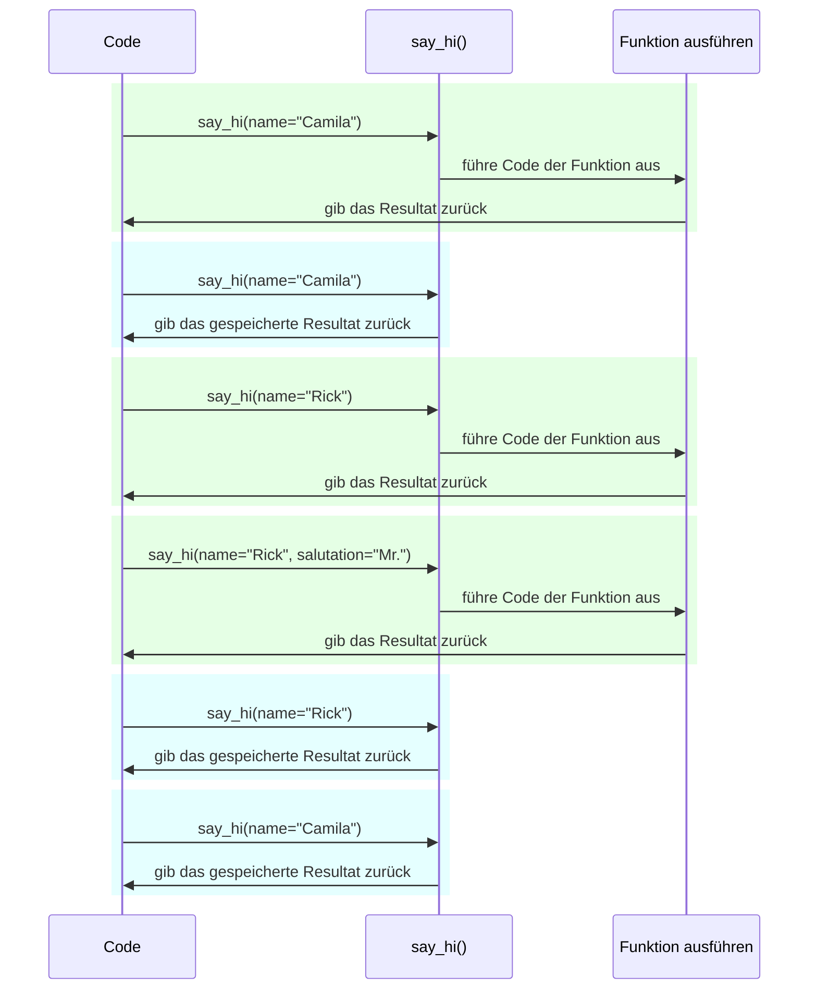

# Einstellungen und Umgebungsvariablen { #settings-and-environment-variables }

In vielen Fällen benötigt Ihre Anwendung möglicherweise einige externe Einstellungen oder Konfigurationen, zum Beispiel geheime Schlüssel, Datenbank-Anmeldeinformationen, Anmeldeinformationen für E-Mail-Dienste, usw.

Die meisten dieser Einstellungen sind variabel (können sich ändern), wie z. B. Datenbank-URLs. Und vieles könnten schützenswerte, geheime Daten sein.

Aus diesem Grund werden diese üblicherweise in Umgebungsvariablen bereitgestellt, die von der Anwendung gelesen werden.

/// tip | Tipp

Um Umgebungsvariablen zu verstehen, können Sie [Umgebungsvariablen](../environment-variables.md){.internal-link target=_blank} lesen.

///

## Typen und Validierung { #types-and-validation }

Diese Umgebungsvariablen können nur Text-Zeichenketten verarbeiten, da sie außerhalb von Python liegen und mit anderen Programmen und dem Rest des Systems (und sogar mit verschiedenen Betriebssystemen wie Linux, Windows, macOS) kompatibel sein müssen.

Das bedeutet, dass jeder in Python aus einer Umgebungsvariablen gelesene Wert ein `str` ist und jede Konvertierung in einen anderen Typ oder jede Validierung im Code erfolgen muss.

## Pydantic `Settings` { #pydantic-settings }

Glücklicherweise bietet Pydantic ein großartiges Werkzeug zur Verarbeitung dieser Einstellungen, die von Umgebungsvariablen stammen, mit <a href="https://docs.pydantic.dev/latest/concepts/pydantic_settings/" class="external-link" target="_blank">Pydantic: Settings Management</a>.

### `pydantic-settings` installieren { #install-pydantic-settings }

Stellen Sie zunächst sicher, dass Sie Ihre [virtuelle Umgebung](../virtual-environments.md){.internal-link target=_blank} erstellt und aktiviert haben, und installieren Sie dann das Package `pydantic-settings`:

<div class="termy">

```console
$ pip install pydantic-settings
---> 100%
```

</div>

Es ist bereits enthalten, wenn Sie die `all`-Extras installiert haben, mit:

<div class="termy">

```console
$ pip install "fastapi[all]"
---> 100%
```

</div>

/// info | Info

In Pydantic v1 war es im Hauptpackage enthalten. Jetzt wird es als unabhängiges Package verteilt, sodass Sie wählen können, ob Sie es installieren möchten oder nicht, falls Sie die Funktionalität nicht benötigen.

///

### Das `Settings`-Objekt erstellen { #create-the-settings-object }

Importieren Sie `BaseSettings` aus Pydantic und erstellen Sie eine Unterklasse, ganz ähnlich wie bei einem Pydantic-Modell.

Auf die gleiche Weise wie bei Pydantic-Modellen deklarieren Sie Klassenattribute mit Typannotationen und möglicherweise Defaultwerten.

Sie können dieselben Validierungs-Funktionen und -Tools verwenden, die Sie für Pydantic-Modelle verwenden, z. B. verschiedene Datentypen und zusätzliche Validierungen mit `Field()`.

//// tab | Pydantic v2

{* ../../docs_src/settings/tutorial001.py hl[2,5:8,11] *}

////

//// tab | Pydantic v1

/// info | Info

In Pydantic v1 würden Sie `BaseSettings` direkt von `pydantic` statt von `pydantic_settings` importieren.

///

{* ../../docs_src/settings/tutorial001_pv1.py hl[2,5:8,11] *}

////

/// tip | Tipp

Für ein schnelles Copy-and-paste verwenden Sie nicht dieses Beispiel, sondern das letzte unten.

///

Wenn Sie dann eine Instanz dieser `Settings`-Klasse erstellen (in diesem Fall als `settings`-Objekt), liest Pydantic die Umgebungsvariablen ohne Berücksichtigung der Groß- und Kleinschreibung. Eine Variable `APP_NAME` in Großbuchstaben wird also als Attribut `app_name` gelesen.

Als Nächstes werden die Daten konvertiert und validiert. Wenn Sie also dieses `settings`-Objekt verwenden, verfügen Sie über Daten mit den von Ihnen deklarierten Typen (z. B. ist `items_per_user` ein `int`).

### `settings` verwenden { #use-the-settings }

Dann können Sie das neue `settings`-Objekt in Ihrer Anwendung verwenden:

{* ../../docs_src/settings/tutorial001.py hl[18:20] *}

### Den Server ausführen { #run-the-server }

Als Nächstes würden Sie den Server ausführen und die Konfigurationen als Umgebungsvariablen übergeben. Sie könnten beispielsweise `ADMIN_EMAIL` und `APP_NAME` festlegen mit:

<div class="termy">

```console
$ ADMIN_EMAIL="deadpool@example.com" APP_NAME="ChimichangApp" fastapi run main.py

<span style="color: green;">INFO</span>:     Uvicorn running on http://127.0.0.1:8000 (Press CTRL+C to quit)
```

</div>

/// tip | Tipp

Um mehrere Umgebungsvariablen für einen einzelnen Befehl festzulegen, trennen Sie diese einfach durch ein Leerzeichen und fügen Sie alle vor dem Befehl ein.

///

Und dann würde die Einstellung `admin_email` auf `"deadpool@example.com"` gesetzt.

Der `app_name` wäre `"ChimichangApp"`.

Und `items_per_user` würde seinen Defaultwert von `50` behalten.

## Einstellungen in einem anderen Modul { #settings-in-another-module }

Sie könnten diese Einstellungen in eine andere Moduldatei einfügen, wie Sie in [Größere Anwendungen – mehrere Dateien](../tutorial/bigger-applications.md){.internal-link target=_blank} gesehen haben.

Sie könnten beispielsweise eine Datei `config.py` haben mit:

{* ../../docs_src/settings/app01/config.py *}

Und dann verwenden Sie diese in einer Datei `main.py`:

{* ../../docs_src/settings/app01/main.py hl[3,11:13] *}

/// tip | Tipp

Sie benötigen außerdem eine Datei `__init__.py`, wie in [Größere Anwendungen – mehrere Dateien](../tutorial/bigger-applications.md){.internal-link target=_blank} gesehen.

///

## Einstellungen in einer Abhängigkeit { #settings-in-a-dependency }

In manchen Fällen kann es nützlich sein, die Einstellungen mit einer Abhängigkeit bereitzustellen, anstatt ein globales Objekt `settings` zu haben, das überall verwendet wird.

Dies könnte besonders beim Testen nützlich sein, da es sehr einfach ist, eine Abhängigkeit mit Ihren eigenen benutzerdefinierten Einstellungen zu überschreiben.

### Die Konfigurationsdatei { #the-config-file }

Ausgehend vom vorherigen Beispiel könnte Ihre Datei `config.py` so aussehen:

{* ../../docs_src/settings/app02/config.py hl[10] *}

Beachten Sie, dass wir jetzt keine Standardinstanz `settings = Settings()` erstellen.

### Die Haupt-Anwendungsdatei { #the-main-app-file }

Jetzt erstellen wir eine Abhängigkeit, die ein neues `config.Settings()` zurückgibt.

{* ../../docs_src/settings/app02_an_py39/main.py hl[6,12:13] *}

/// tip | Tipp

Wir werden das `@lru_cache` in Kürze besprechen.

Im Moment nehmen Sie an, dass `get_settings()` eine normale Funktion ist.

///

Und dann können wir das von der *Pfadoperation-Funktion* als Abhängigkeit einfordern und es überall dort verwenden, wo wir es brauchen.

{* ../../docs_src/settings/app02_an_py39/main.py hl[17,19:21] *}

### Einstellungen und Tests { #settings-and-testing }

Dann wäre es sehr einfach, beim Testen ein anderes Einstellungsobjekt bereitzustellen, indem man eine Abhängigkeitsüberschreibung für `get_settings` erstellt:

{* ../../docs_src/settings/app02/test_main.py hl[9:10,13,21] *}

Bei der Abhängigkeitsüberschreibung legen wir einen neuen Wert für `admin_email` fest, wenn wir das neue `Settings`-Objekt erstellen, und geben dann dieses neue Objekt zurück.

Dann können wir testen, ob das verwendet wird.

## Lesen einer `.env`-Datei { #reading-a-env-file }

Wenn Sie viele Einstellungen haben, die sich möglicherweise oft ändern, vielleicht in verschiedenen Umgebungen, kann es nützlich sein, diese in eine Datei zu schreiben und sie dann daraus zu lesen, als wären sie Umgebungsvariablen.

Diese Praxis ist so weit verbreitet, dass sie einen Namen hat. Diese Umgebungsvariablen werden üblicherweise in einer Datei `.env` abgelegt und die Datei wird „dotenv“ genannt.

/// tip | Tipp

Eine Datei, die mit einem Punkt (`.`) beginnt, ist eine versteckte Datei in Unix-ähnlichen Systemen wie Linux und macOS.

Aber eine dotenv-Datei muss nicht unbedingt genau diesen Dateinamen haben.

///

Pydantic unterstützt das Lesen dieser Dateitypen mithilfe einer externen Bibliothek. Weitere Informationen finden Sie unter <a href="https://docs.pydantic.dev/latest/concepts/pydantic_settings/#dotenv-env-support" class="external-link" target="_blank">Pydantic Settings: Dotenv (.env) support</a>.

/// tip | Tipp

Damit das funktioniert, müssen Sie `pip install python-dotenv` ausführen.

///

### Die `.env`-Datei { #the-env-file }

Sie könnten eine `.env`-Datei haben, mit:

```bash
ADMIN_EMAIL="deadpool@example.com"
APP_NAME="ChimichangApp"
```

### Einstellungen aus `.env` lesen { #read-settings-from-env }

Und dann aktualisieren Sie Ihre `config.py` mit:

//// tab | Pydantic v2

{* ../../docs_src/settings/app03_an/config.py hl[9] *}

/// tip | Tipp

Das Attribut `model_config` wird nur für die Pydantic-Konfiguration verwendet. Weitere Informationen finden Sie unter <a href="https://docs.pydantic.dev/latest/concepts/config/" class="external-link" target="_blank">Pydantic: Concepts: Configuration</a>.

///

////

//// tab | Pydantic v1

{* ../../docs_src/settings/app03_an/config_pv1.py hl[9:10] *}

/// tip | Tipp

Die Klasse `Config` wird nur für die Pydantic-Konfiguration verwendet. Weitere Informationen finden Sie unter <a href="https://docs.pydantic.dev/1.10/usage/model_config/" class="external-link" target="_blank">Pydantic Model Config</a>.

///

////

/// info | Info

In Pydantic Version 1 erfolgte die Konfiguration in einer internen Klasse `Config`, in Pydantic Version 2 erfolgt sie in einem Attribut `model_config`. Dieses Attribut akzeptiert ein <abbr title="Dictionary – Zuordnungstabelle: In anderen Sprachen auch Hash, Map, Objekt, Assoziatives Array genannt">`dict`</abbr>. Um automatische Codevervollständigung und Inline-Fehlerberichte zu erhalten, können Sie `SettingsConfigDict` importieren und verwenden, um dieses `dict` zu definieren.

///

Hier definieren wir die Konfiguration `env_file` innerhalb Ihrer Pydantic-`Settings`-Klasse und setzen den Wert auf den Dateinamen mit der dotenv-Datei, die wir verwenden möchten.

### Die `Settings` nur einmal laden mittels `lru_cache` { #creating-the-settings-only-once-with-lru-cache }

Das Lesen einer Datei von der Festplatte ist normalerweise ein kostspieliger (langsamer) Vorgang, daher möchten Sie ihn wahrscheinlich nur einmal ausführen und dann dasselbe Einstellungsobjekt erneut verwenden, anstatt es für jeden <abbr title="Request – Anfrage: Daten, die der Client zum Server sendet">Request</abbr> zu lesen.

Aber jedes Mal, wenn wir ausführen:

```Python
Settings()
```

würde ein neues `Settings`-Objekt erstellt und bei der Erstellung würde die `.env`-Datei erneut ausgelesen.

Wenn die Abhängigkeitsfunktion wie folgt wäre:

```Python
def get_settings():
    return Settings()
```

würden wir dieses Objekt für jeden Request erstellen und die `.env`-Datei für jeden Request lesen. ⚠️

Da wir jedoch den `@lru_cache`-Dekorator oben verwenden, wird das `Settings`-Objekt nur einmal erstellt, nämlich beim ersten Aufruf. ✔️

{* ../../docs_src/settings/app03_an_py39/main.py hl[1,11] *}

Dann wird bei allen nachfolgenden Aufrufen von `get_settings()`, in den Abhängigkeiten für darauffolgende Requests, dasselbe Objekt zurückgegeben, das beim ersten Aufruf zurückgegeben wurde, anstatt den Code von `get_settings()` erneut auszuführen und ein neues `Settings`-Objekt zu erstellen.

#### Technische Details zu `lru_cache` { #lru-cache-technical-details }

`@lru_cache` ändert die Funktion, die es dekoriert, dahingehend, denselben Wert zurückzugeben, der beim ersten Mal zurückgegeben wurde, anstatt ihn erneut zu berechnen und den Code der Funktion jedes Mal auszuführen.

Die darunter liegende Funktion wird also für jede Argumentkombination einmal ausgeführt. Und dann werden die von jeder dieser Argumentkombinationen zurückgegebenen Werte immer wieder verwendet, wenn die Funktion mit genau derselben Argumentkombination aufgerufen wird.

Wenn Sie beispielsweise eine Funktion haben:

```Python
@lru_cache
def say_hi(name: str, salutation: str = "Ms."):
    return f"Hello {salutation} {name}"
```

könnte Ihr Programm so ausgeführt werden:



Im Fall unserer Abhängigkeit `get_settings()` akzeptiert die Funktion nicht einmal Argumente, sodass sie immer den gleichen Wert zurückgibt.

Auf diese Weise verhält es sich fast so, als wäre es nur eine globale Variable. Da es jedoch eine Abhängigkeitsfunktion verwendet, können wir diese zu Testzwecken problemlos überschreiben.

`@lru_cache` ist Teil von `functools`, welches Teil von Pythons Standardbibliothek ist. Weitere Informationen dazu finden Sie in der <a href="https://docs.python.org/3/library/functools.html#functools.lru_cache" class="external-link" target="_blank">Python Dokumentation für `@lru_cache`</a>.

## Zusammenfassung { #recap }

Mit Pydantic Settings können Sie die Einstellungen oder Konfigurationen für Ihre Anwendung verwalten und dabei die gesamte Leistungsfähigkeit der Pydantic-Modelle nutzen.

* Durch die Verwendung einer Abhängigkeit können Sie das Testen vereinfachen.
* Sie können `.env`-Dateien damit verwenden.
* Durch die Verwendung von `@lru_cache` können Sie vermeiden, die dotenv-Datei bei jedem Request erneut zu lesen, während Sie sie während des Testens überschreiben können.
