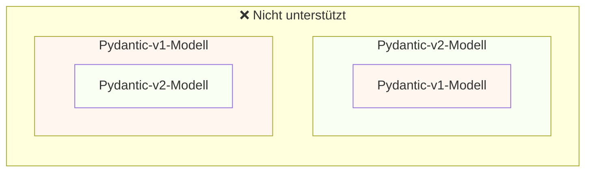
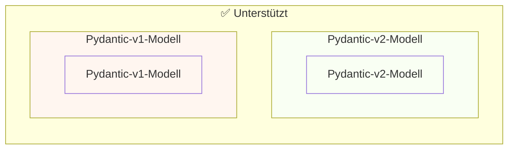

# Von Pydantic v1 zu Pydantic v2 migrieren { #migrate-from-pydantic-v1-to-pydantic-v2 }

Wenn Sie eine ältere FastAPI-App haben, nutzen Sie möglicherweise Pydantic Version 1.

FastAPI unterstützt seit Version 0.100.0 sowohl Pydantic v1 als auch v2.

Wenn Sie Pydantic v2 installiert hatten, wurde dieses verwendet. Wenn stattdessen Pydantic v1 installiert war, wurde jenes verwendet.

Pydantic v1 ist jetzt deprecatet und die Unterstützung dafür wird in den nächsten Versionen von FastAPI entfernt, Sie sollten also zu **Pydantic v2 migrieren**. Auf diese Weise erhalten Sie die neuesten Features, Verbesserungen und Fixes.

/// warning | Achtung

Außerdem hat das Pydantic-Team die Unterstützung für Pydantic v1 in den neuesten Python-Versionen eingestellt, beginnend mit **Python 3.14**.

Wenn Sie die neuesten Features von Python nutzen möchten, müssen Sie sicherstellen, dass Sie Pydantic v2 verwenden.

///

Wenn Sie eine ältere FastAPI-App mit Pydantic v1 haben, zeige ich Ihnen hier, wie Sie sie zu Pydantic v2 migrieren, und die **neuen Features in FastAPI 0.119.0**, die Ihnen bei einer schrittweisen Migration helfen.

## Offizieller Leitfaden { #official-guide }

Pydantic hat einen offiziellen <a href="https://docs.pydantic.dev/latest/migration/" class="external-link" target="_blank">Migrationsleitfaden</a> von v1 zu v2.

Er enthält auch, was sich geändert hat, wie Validierungen nun korrekter und strikter sind, mögliche Stolpersteine, usw.

Sie können ihn lesen, um besser zu verstehen, was sich geändert hat.

## Tests { #tests }

Stellen Sie sicher, dass Sie [Tests](../tutorial/testing.md){.internal-link target=_blank} für Ihre App haben und diese in Continuous Integration (CI) ausführen.

Auf diese Weise können Sie das Update durchführen und sicherstellen, dass weiterhin alles wie erwartet funktioniert.

## `bump-pydantic` { #bump-pydantic }

In vielen Fällen, wenn Sie reguläre Pydantic-Modelle ohne Anpassungen verwenden, können Sie den Großteil des Prozesses der Migration von Pydantic v1 auf Pydantic v2 automatisieren.

Sie können <a href="https://github.com/pydantic/bump-pydantic" class="external-link" target="_blank">`bump-pydantic`</a> vom selben Pydantic-Team verwenden.

Dieses Tool hilft Ihnen, den Großteil des zu ändernden Codes automatisch anzupassen.

Danach können Sie die Tests ausführen und prüfen, ob alles funktioniert. Falls ja, sind Sie fertig. 😎

## Pydantic v1 in v2 { #pydantic-v1-in-v2 }

Pydantic v2 enthält alles aus Pydantic v1 als Untermodul `pydantic.v1`.

Das bedeutet, Sie können die neueste Version von Pydantic v2 installieren und die alten Pydantic‑v1‑Komponenten aus diesem Untermodul importieren und verwenden, als hätten Sie das alte Pydantic v1 installiert.

{* ../../docs_src/pydantic_v1_in_v2/tutorial001_an_py310.py hl[1,4] *}

### FastAPI-Unterstützung für Pydantic v1 in v2 { #fastapi-support-for-pydantic-v1-in-v2 }

Seit FastAPI 0.119.0 gibt es außerdem eine teilweise Unterstützung für Pydantic v1 innerhalb von Pydantic v2, um die Migration auf v2 zu erleichtern.

Sie könnten also Pydantic auf die neueste Version 2 aktualisieren und die Importe so ändern, dass das Untermodul `pydantic.v1` verwendet wird, und in vielen Fällen würde es einfach funktionieren.

{* ../../docs_src/pydantic_v1_in_v2/tutorial002_an_py310.py hl[2,5,15] *}

/// warning | Achtung

Beachten Sie, dass, da das Pydantic‑Team Pydantic v1 in neueren Python‑Versionen nicht mehr unterstützt, beginnend mit Python 3.14, auch die Verwendung von `pydantic.v1` unter Python 3.14 und höher nicht unterstützt wird.

///

### Pydantic v1 und v2 in derselben App { #pydantic-v1-and-v2-on-the-same-app }

Es wird von Pydantic **nicht unterstützt**, dass ein Pydantic‑v2‑Modell Felder hat, die als Pydantic‑v1‑Modelle definiert sind, und umgekehrt.

... aber Sie können getrennte Modelle, die Pydantic v1 bzw. v2 nutzen, in derselben App verwenden.

In einigen Fällen ist es sogar möglich, sowohl Pydantic‑v1‑ als auch Pydantic‑v2‑Modelle in derselben **Pfadoperation** Ihrer FastAPI‑App zu verwenden:

{* ../../docs_src/pydantic_v1_in_v2/tutorial003_an_py310.py hl[2:3,6,12,21:22] *}

Im obigen Beispiel ist das Eingabemodell ein Pydantic‑v1‑Modell, und das Ausgabemodell (definiert in `response_model=ItemV2`) ist ein Pydantic‑v2‑Modell.

### Pydantic v1 Parameter { #pydantic-v1-parameters }

Wenn Sie einige der FastAPI-spezifischen Tools für Parameter wie `Body`, `Query`, `Form`, usw. zusammen mit Pydantic‑v1‑Modellen verwenden müssen, können Sie die aus `fastapi.temp_pydantic_v1_params` importieren, während Sie die Migration zu Pydantic v2 abschließen:

{* ../../docs_src/pydantic_v1_in_v2/tutorial004_an_py310.py hl[4,18] *}

### In Schritten migrieren { #migrate-in-steps }

/// tip | Tipp

Probieren Sie zuerst `bump-pydantic` aus. Wenn Ihre Tests erfolgreich sind und das funktioniert, sind Sie mit einem einzigen Befehl fertig. ✨

///

Wenn `bump-pydantic` für Ihren Anwendungsfall nicht funktioniert, können Sie die Unterstützung für Pydantic‑v1‑ und Pydantic‑v2‑Modelle in derselben App nutzen, um die Migration zu Pydantic v2 schrittweise durchzuführen.

Sie könnten zuerst Pydantic auf die neueste Version 2 aktualisieren und die Importe so ändern, dass für all Ihre Modelle `pydantic.v1` verwendet wird.

Anschließend können Sie beginnen, Ihre Modelle gruppenweise von Pydantic v1 auf v2 zu migrieren – in kleinen, schrittweisen Etappen. 🚶
