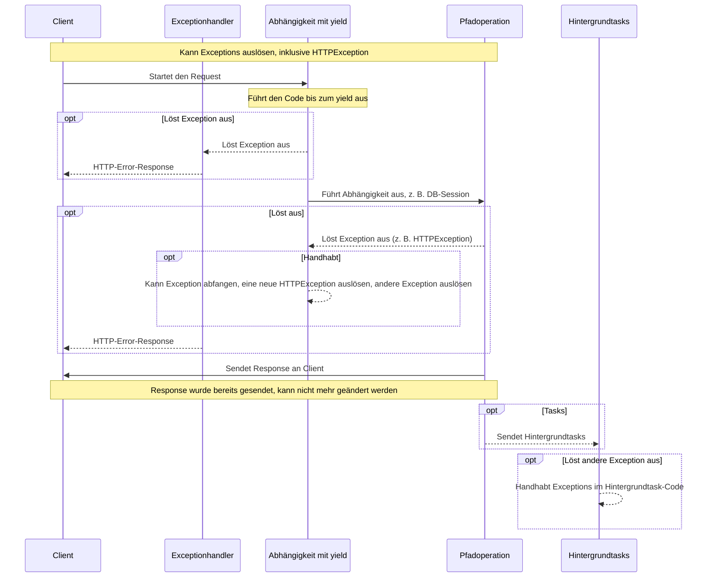
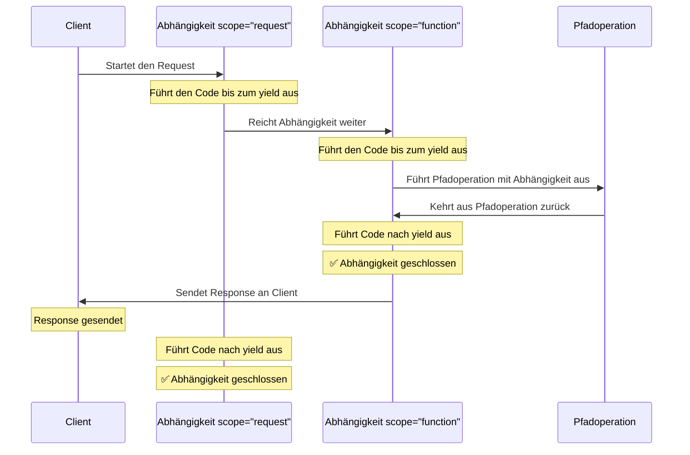

# Abhängigkeiten mit `yield` { #dependencies-with-yield }

FastAPI unterstützt Abhängigkeiten, die nach Abschluss einige <abbr title="Manchmal auch genannt „Exit Code“, „Cleanup Code“, „Teardown Code“, „Closing Code“, „Kontextmanager Exit Code“, usw.">zusätzliche Schritte ausführen</abbr>.

Verwenden Sie dazu `yield` statt `return` und schreiben Sie die zusätzlichen Schritte / den zusätzlichen Code danach.

/// tip | Tipp

Stellen Sie sicher, dass Sie `yield` nur einmal pro Abhängigkeit verwenden.

///

/// note | Technische Details

Jede Funktion, die dekoriert werden kann mit:

* <a href="https://docs.python.org/3/library/contextlib.html#contextlib.contextmanager" class="external-link" target="_blank">`@contextlib.contextmanager`</a> oder
* <a href="https://docs.python.org/3/library/contextlib.html#contextlib.asynccontextmanager" class="external-link" target="_blank">`@contextlib.asynccontextmanager`</a>

kann auch als gültige **FastAPI**-Abhängigkeit verwendet werden.

Tatsächlich verwendet FastAPI diese beiden Dekoratoren intern.

///

## Eine Datenbank-Abhängigkeit mit `yield` { #a-database-dependency-with-yield }

Sie könnten damit beispielsweise eine Datenbanksession erstellen und diese nach Abschluss schließen.

Nur der Code vor und einschließlich der `yield`-Anweisung wird ausgeführt, bevor eine <abbr title="Response – Antwort: Daten, die der Server zum anfragenden Client zurücksendet">Response</abbr> erzeugt wird:

{* ../../docs_src/dependencies/tutorial007.py hl[2:4] *}

Der ge`yield`ete Wert ist das, was in *Pfadoperationen* und andere Abhängigkeiten eingefügt wird:

{* ../../docs_src/dependencies/tutorial007.py hl[4] *}

Der auf die `yield`-Anweisung folgende Code wird nach der Response ausgeführt:

{* ../../docs_src/dependencies/tutorial007.py hl[5:6] *}

/// tip | Tipp

Sie können `async`- oder reguläre Funktionen verwenden.

**FastAPI** wird bei jeder das Richtige tun, so wie auch bei normalen Abhängigkeiten.

///

## Eine Abhängigkeit mit `yield` und `try` { #a-dependency-with-yield-and-try }

Wenn Sie einen `try`-Block in einer Abhängigkeit mit `yield` verwenden, empfangen Sie alle Exceptions, die bei Verwendung der Abhängigkeit geworfen wurden.

Wenn beispielsweise ein Code irgendwann in der Mitte, in einer anderen Abhängigkeit oder in einer *Pfadoperation*, ein „Rollback“ einer Datenbanktransaktion macht oder eine andere Exception verursacht, empfangen Sie die Exception in Ihrer Abhängigkeit.

Sie können also mit `except SomeException` diese bestimmte Exception innerhalb der Abhängigkeit handhaben.

Auf die gleiche Weise können Sie `finally` verwenden, um sicherzustellen, dass die Exit-Schritte ausgeführt werden, unabhängig davon, ob eine Exception geworfen wurde oder nicht.

{* ../../docs_src/dependencies/tutorial007.py hl[3,5] *}

## Unterabhängigkeiten mit `yield` { #sub-dependencies-with-yield }

Sie können Unterabhängigkeiten und „Bäume“ von Unterabhängigkeiten beliebiger Größe und Form haben, und einige oder alle davon können `yield` verwenden.

**FastAPI** stellt sicher, dass der „Exit-Code“ in jeder Abhängigkeit mit `yield` in der richtigen Reihenfolge ausgeführt wird.

Beispielsweise kann `dependency_c` von `dependency_b` und `dependency_b` von `dependency_a` abhängen:

{* ../../docs_src/dependencies/tutorial008_an_py39.py hl[6,14,22] *}

Und alle können `yield` verwenden.

In diesem Fall benötigt `dependency_c` zum Ausführen seines Exit-Codes, dass der Wert von `dependency_b` (hier `dep_b` genannt) verfügbar ist.

Und wiederum benötigt `dependency_b` den Wert von `dependency_a` (hier `dep_a` genannt) für seinen Exit-Code.

{* ../../docs_src/dependencies/tutorial008_an_py39.py hl[18:19,26:27] *}

Auf die gleiche Weise könnten Sie einige Abhängigkeiten mit `yield` und einige andere Abhängigkeiten mit `return` haben, und alle können beliebig voneinander abhängen.

Und Sie könnten eine einzelne Abhängigkeit haben, die auf mehreren ge`yield`eten Abhängigkeiten basiert, usw.

Sie können beliebige Kombinationen von Abhängigkeiten haben.

**FastAPI** stellt sicher, dass alles in der richtigen Reihenfolge ausgeführt wird.

/// note | Technische Details

Dieses funktioniert dank Pythons <a href="https://docs.python.org/3/library/contextlib.html" class="external-link" target="_blank">Kontextmanager</a>.

**FastAPI** verwendet sie intern, um das zu erreichen.

///

## Abhängigkeiten mit `yield` und `HTTPException` { #dependencies-with-yield-and-httpexception }

Sie haben gesehen, dass Sie Abhängigkeiten mit `yield` verwenden und `try`-Blöcke haben können, die versuchen, irgendeinen Code auszuführen und dann, nach `finally`, Exit-Code ausführen.

Sie können auch `except` verwenden, um die geworfene Exception abzufangen und damit etwas zu tun.

Zum Beispiel können Sie eine andere Exception auslösen, wie `HTTPException`.

/// tip | Tipp

Dies ist eine etwas fortgeschrittene Technik, die Sie in den meisten Fällen nicht wirklich benötigen, da Sie Exceptions (einschließlich `HTTPException`) innerhalb des restlichen Anwendungscodes auslösen können, beispielsweise in der *Pfadoperation-Funktion*.

Aber es ist für Sie da, wenn Sie es brauchen. 🤓

///

{* ../../docs_src/dependencies/tutorial008b_an_py39.py hl[18:22,31] *}

Wenn Sie Exceptions abfangen und darauf basierend eine benutzerdefinierte Response erstellen möchten, erstellen Sie einen [benutzerdefinierten Exceptionhandler](../handling-errors.md#install-custom-exception-handlers){.internal-link target=_blank}.

## Abhängigkeiten mit `yield` und `except` { #dependencies-with-yield-and-except }

Wenn Sie eine Exception mit `except` in einer Abhängigkeit mit `yield` abfangen und sie nicht erneut auslösen (oder eine neue Exception auslösen), kann FastAPI nicht feststellen, dass es eine Exception gab, genau so wie es bei normalem Python der Fall wäre:

{* ../../docs_src/dependencies/tutorial008c_an_py39.py hl[15:16] *}

In diesem Fall sieht der Client eine *HTTP 500 Internal Server Error*-Response, wie es sein sollte, da wir keine `HTTPException` oder Ähnliches auslösen, aber der Server hat **keine Logs** oder einen anderen Hinweis darauf, was der Fehler war. 😱

### In Abhängigkeiten mit `yield` und `except` immer `raise` verwenden { #always-raise-in-dependencies-with-yield-and-except }

Wenn Sie eine Exception in einer Abhängigkeit mit `yield` abfangen, sollten Sie – sofern Sie nicht eine andere `HTTPException` oder Ähnliches auslösen – **die ursprüngliche Exception erneut auslösen**.

Sie können dieselbe Exception mit `raise` erneut auslösen:

{* ../../docs_src/dependencies/tutorial008d_an_py39.py hl[17] *}

Jetzt erhält der Client dieselbe *HTTP 500 Internal Server Error*-Response, aber der Server enthält unseren benutzerdefinierten `InternalError` in den Logs. 😎

## Ausführung von Abhängigkeiten mit `yield` { #execution-of-dependencies-with-yield }

Die Ausführungsreihenfolge ähnelt mehr oder weniger dem folgenden Diagramm. Die Zeit verläuft von oben nach unten. Und jede Spalte ist einer der interagierenden oder Code-ausführenden Teilnehmer.



/// info | Info

Es wird nur **eine Response** an den Client gesendet. Es kann eine Error-Response oder die Response der *Pfadoperation* sein.

Nachdem eine dieser Responses gesendet wurde, kann keine weitere Response gesendet werden.

///

/// tip | Tipp

Wenn Sie in dem Code der *Pfadoperation-Funktion* irgendeine Exception auslösen, wird sie an die Abhängigkeiten mit `yield` weitergegeben, einschließlich `HTTPException`. In den meisten Fällen sollten Sie dieselbe Exception oder eine neue aus der Abhängigkeit mit `yield` erneut auslösen, um sicherzustellen, dass sie korrekt gehandhabt wird.

///

## Frühes Beenden und `scope` { #early-exit-and-scope }

Normalerweise wird der Exit-Code von Abhängigkeiten mit `yield` ausgeführt **nachdem die Response** an den Client gesendet wurde.

Wenn Sie aber wissen, dass Sie die Abhängigkeit nach der Rückkehr aus der *Pfadoperation-Funktion* nicht mehr benötigen, können Sie `Depends(scope="function")` verwenden, um FastAPI mitzuteilen, dass es die Abhängigkeit nach der Rückkehr aus der *Pfadoperation-Funktion* schließen soll, jedoch **bevor** die **Response gesendet wird**.

{* ../../docs_src/dependencies/tutorial008e_an_py39.py hl[12,16] *}

`Depends()` erhält einen `scope`-Parameter, der sein kann:

* `"function"`: startet die Abhängigkeit vor der *Pfadoperation-Funktion*, die den Request bearbeitet, beendet die Abhängigkeit nach dem Ende der *Pfadoperation-Funktion*, aber **bevor** die Response an den Client zurückgesendet wird. Die Abhängigkeitsfunktion wird also **um** die *Pfadoperation-**Funktion*** **herum** ausgeführt.
* `"request"`: startet die Abhängigkeit vor der *Pfadoperation-Funktion*, die den Request bearbeitet (ähnlich wie bei `"function"`), beendet sie jedoch **nachdem** die Response an den Client zurückgesendet wurde. Die Abhängigkeitsfunktion wird also **um** den **Request**- und Response-Zyklus **herum** ausgeführt.

Wenn nicht angegeben und die Abhängigkeit `yield` hat, hat sie standardmäßig einen `scope` von `"request"`.

### `scope` für Unterabhängigkeiten { #scope-for-sub-dependencies }

Wenn Sie eine Abhängigkeit mit `scope="request"` (dem Default) deklarieren, muss jede Unterabhängigkeit ebenfalls einen `scope` von `"request"` haben.

Eine Abhängigkeit mit `scope` von `"function"` kann jedoch Abhängigkeiten mit `scope` von `"function"` und `scope` von `"request"` haben.

Das liegt daran, dass jede Abhängigkeit in der Lage sein muss, ihren Exit-Code vor den Unterabhängigkeiten auszuführen, da sie diese während ihres Exit-Codes möglicherweise noch verwenden muss.



## Abhängigkeiten mit `yield`, `HTTPException`, `except` und Hintergrundtasks { #dependencies-with-yield-httpexception-except-and-background-tasks }

Abhängigkeiten mit `yield` haben sich im Laufe der Zeit weiterentwickelt, um verschiedene Anwendungsfälle abzudecken und einige Probleme zu beheben.

Wenn Sie sehen möchten, was sich in verschiedenen Versionen von FastAPI geändert hat, lesen Sie mehr dazu im fortgeschrittenen Teil, unter [Fortgeschrittene Abhängigkeiten – Abhängigkeiten mit `yield`, `HTTPException`, `except` und Hintergrundtasks](../../advanced/advanced-dependencies.md#dependencies-with-yield-httpexception-except-and-background-tasks){.internal-link target=_blank}.
## Kontextmanager { #context-managers }

### Was sind „Kontextmanager“ { #what-are-context-managers }

„Kontextmanager“ (Englisch „Context Manager“) sind bestimmte Python-Objekte, die Sie in einer `with`-Anweisung verwenden können.

Beispielsweise können Sie <a href="https://docs.python.org/3/tutorial/inputoutput.html#reading-and-writing-files" class="external-link" target="_blank">`with` verwenden, um eine Datei auszulesen</a>:

```Python
with open("./somefile.txt") as f:
    contents = f.read()
    print(contents)
```

Im Hintergrund erstellt das `open("./somefile.txt")` ein Objekt, das als „Kontextmanager“ bezeichnet wird.

Dieser stellt sicher, dass, wenn der `with`-Block beendet ist, die Datei geschlossen wird, auch wenn Exceptions geworfen wurden.

Wenn Sie eine Abhängigkeit mit `yield` erstellen, erstellt **FastAPI** dafür intern einen Kontextmanager und kombiniert ihn mit einigen anderen zugehörigen Tools.

### Kontextmanager in Abhängigkeiten mit `yield` verwenden { #using-context-managers-in-dependencies-with-yield }

/// warning | Achtung

Dies ist mehr oder weniger eine „fortgeschrittene“ Idee.

Wenn Sie gerade erst mit **FastAPI** beginnen, möchten Sie das vielleicht vorerst überspringen.

///

In Python können Sie Kontextmanager erstellen, indem Sie <a href="https://docs.python.org/3/reference/datamodel.html#context-managers" class="external-link" target="_blank">eine Klasse mit zwei Methoden erzeugen: `__enter__()` und `__exit__()`</a>.

Sie können solche auch innerhalb von **FastAPI**-Abhängigkeiten mit `yield` verwenden, indem Sie `with`- oder `async with`-Anweisungen innerhalb der Abhängigkeits-Funktion verwenden:

{* ../../docs_src/dependencies/tutorial010.py hl[1:9,13] *}

/// tip | Tipp

Andere Möglichkeiten, einen Kontextmanager zu erstellen, sind:

* <a href="https://docs.python.org/3/library/contextlib.html#contextlib.contextmanager" class="external-link" target="_blank">`@contextlib.contextmanager`</a> oder
* <a href="https://docs.python.org/3/library/contextlib.html#contextlib.asynccontextmanager" class="external-link" target="_blank">`@contextlib.asynccontextmanager`</a>

Verwenden Sie diese, um eine Funktion zu dekorieren, die ein einziges `yield` hat.

Das ist es auch, was **FastAPI** intern für Abhängigkeiten mit `yield` verwendet.

Aber Sie müssen die Dekoratoren nicht für FastAPI-Abhängigkeiten verwenden (und das sollten Sie auch nicht).

FastAPI erledigt das intern für Sie.

///
