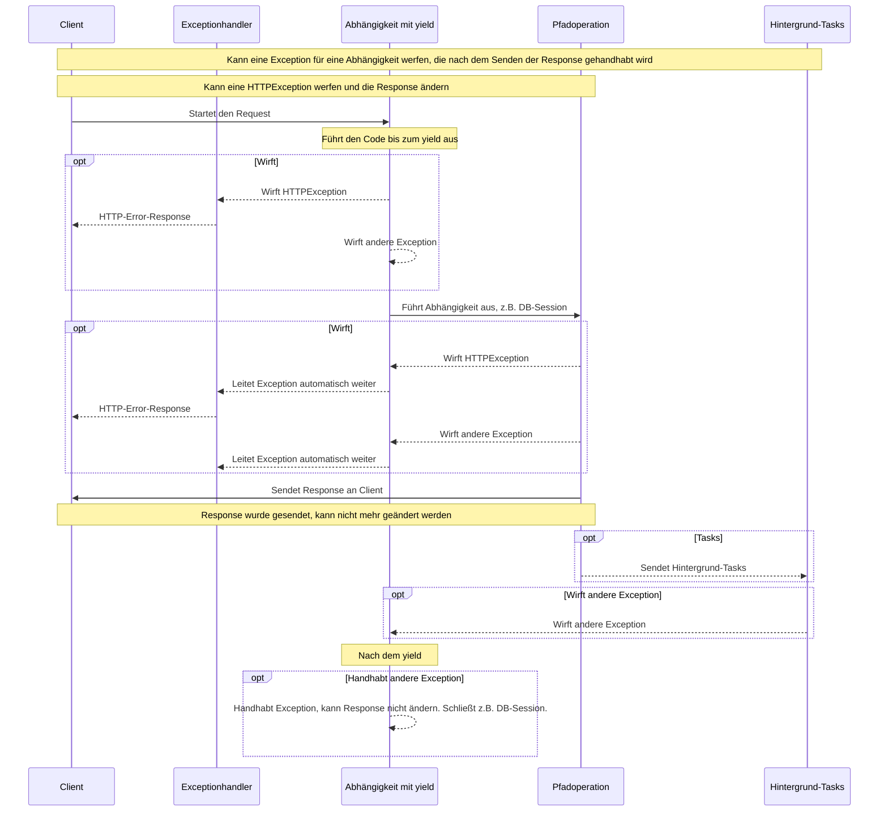

# Abhängigkeiten mit yield

FastAPI unterstützt Abhängigkeiten, die nach Abschluss einige <abbr title='Manchmal auch genannt "exit", "cleanup", "teardown", "close", "context managers", ...'>zusätzliche Schritte ausführen</abbr>.

Verwenden Sie dazu `yield` statt `return` und schreiben Sie die zusätzlichen Schritte danach.

!!! tip
    Stellen Sie sicher, dass Sie `yield` nur einmal pro Abhängigkeit verwenden.

!!! note "Technische Details"
    Jede Funktion, die dekoriert werden kann mit:

    * <a href="https://docs.python.org/3/library/contextlib.html#contextlib.contextmanager" class="external-link" target="_blank">`@contextlib.contextmanager`</a> oder
    * <a href="https://docs.python.org/3/library/contextlib.html#contextlib.asynccontextmanager" class="external-link" target="_blank">`@contextlib.asynccontextmanager`</a>

    kann auch als gültige **FastAPI**-Abhängigkeit verwendet werden.

    Tatsächlich verwendet FastAPI diese beiden Dekoratoren intern.

## Eine Datenbank-Abhängigkeit mit `yield`.

Sie könnten damit beispielsweise eine Datenbank-Session erstellen und diese nach Abschluss schließen.

Nur der Code vor und einschließlich der `yield`-Anweisung wird ausgeführt, bevor eine Response gesendet wird:

```Python hl_lines="2-4"
{!../../../docs_src/dependencies/tutorial007.py!}
```

Der ge`yield`ete Wert ist das, was in *Pfadoperationen* und andere Abhängigkeiten eingefügt wird:

```Python hl_lines="4"
{!../../../docs_src/dependencies/tutorial007.py!}
```

Der auf die `yield`-Anweisung folgende Code wird ausgeführt, nachdem die Response gesendet wurde:

```Python hl_lines="5-6"
{!../../../docs_src/dependencies/tutorial007.py!}
```

!!! tip
    Sie können `async`hrone oder normale Funktionen verwenden.

    **FastAPI** wird bei jeder das Richtige tun, so wie auch bei normalen Abhängigkeiten.

## Eine Abhängigkeit mit `yield` und `try`.

Wenn Sie einen `try`-Block in einer Abhängigkeit mit `yield` verwenden, empfangen Sie alle Exceptions, die bei Verwendung der Abhängigkeit geworfen wurden.

Wenn beispielsweise ein Code irgendwann in der Mitte, in einer anderen Abhängigkeit oder in einer *Pfadoperation*, ein "Rollback" einer Datenbanktransaktion oder einen anderen Fehler verursacht, empfangen Sie die resultierende Exception in Ihrer Abhängigkeit.

Sie können also mit `except SomeException` diese bestimmte Exception innerhalb der Abhängigkeit handhaben.

Auf die gleiche Weise können Sie `finally` verwenden, um sicherzustellen, dass die Exit-Schritte ausgeführt werden, unabhängig davon, ob eine Exception geworfen wurde oder nicht.

```Python hl_lines="3  5"
{!../../../docs_src/dependencies/tutorial007.py!}
```

## Unterabhängigkeiten mit `yield`.

Sie können Unterabhängigkeiten und "Bäume" von Unterabhängigkeiten beliebiger Größe und Form haben, und einige oder alle davon können `yield` verwenden.

**FastAPI** stellt sicher, dass der "Exit-Code" in jeder Abhängigkeit mit `yield` in der richtigen Reihenfolge ausgeführt wird.

Beispielsweise kann `dependency_c` von `dependency_b` und `dependency_b` von `dependency_a` abhängen:

=== "Python 3.9+"

    ```Python hl_lines="6  14  22"
    {!> ../../../docs_src/dependencies/tutorial008_an_py39.py!}
    ```

=== "Python 3.6+"

    ```Python hl_lines="5  13  21"
    {!> ../../../docs_src/dependencies/tutorial008_an.py!}
    ```

=== "Python 3.6+ nicht annotiert"

    !!! tip
        Bevorzugen Sie die `Annotated`-Version, falls möglich.

    ```Python hl_lines="4  12  20"
    {!> ../../../docs_src/dependencies/tutorial008.py!}
    ```

Und alle können `yield` verwenden.

In diesem Fall benötigt `dependency_c` zum Ausführen seines Exit-Codes, dass der Wert von `dependency_b` (hier `dep_b` genannt) verfügbar ist.

Und wiederum benötigt `dependency_b` den Wert von `dependency_a` (hier `dep_a` genannt) für seinen Exit-Code.

=== "Python 3.9+"

    ```Python hl_lines="18-19  26-27"
    {!> ../../../docs_src/dependencies/tutorial008_an_py39.py!}
    ```

=== "Python 3.6+"

    ```Python hl_lines="17-18  25-26"
    {!> ../../../docs_src/dependencies/tutorial008_an.py!}
    ```

=== "Python 3.6+ nicht annotiert"

    !!! tip
        Bevorzugen Sie die `Annotated`-Version, falls möglich.

    ```Python hl_lines="16-17  24-25"
    {!> ../../../docs_src/dependencies/tutorial008.py!}
    ```

Auf die gleiche Weise könnten Sie Abhängigkeiten mischen, die `yield`en oder `return`en.

Und Sie könnten eine einzelne Abhängigkeit haben, die auf mehreren ge`yield`eten Abhängigkeiten basiert, usw.

Sie können beliebige Kombinationen von Abhängigkeiten haben.

**FastAPI** stellt sicher, dass alles in der richtigen Reihenfolge ausgeführt wird.

!!! note "Technische Details"
    Dieses funktioniert dank Pythons <a href="https://docs.python.org/3/library/contextlib.html" class="external-link" target="_blank">Kontextmanager</a>.

    **FastAPI** verwendet sie intern, um das zu erreichen.

## Abhängigkeiten mit `yield` und `HTTPException`.

Sie haben gesehen, dass Ihre Abhängigkeiten `yield` verwenden können und `try`-Blöcke haben können, die Ausnahmen abfangen.

Es könnte verlockend sein, im Exit-Code nach dem `yield` eine `HTTPException` oder ähnliches zu werfen. Aber **das wird nicht funktionieren**.

Der Exit-Code in Abhängigkeiten mit `yield` wird ausgeführt, *nachdem* die Antwort gesendet wurde, [Exceptionhandler](../handling-errors.md#benutzerdefinierte-exceptionhandler-definieren){.internal-link target=_blank} wurden also bereits ausgeführt. Niemand fängt Exceptions, die im Exit-Code ihrer Abhängigkeiten (nach dem `yield`) geworfen werden.

Wenn Sie also nach dem `yield` eine `HTTPException` auslösen, ist der standardmäßige (oder ein beliebiger benutzerdefinierter) Exceptionhandler, der `HTTPException` abfängt und eine HTTP 400 Antwort zurückgibt, nicht mehr da, um diese Exception abzufangen.

Das ist es was erlaubt, dass alles, was in der Abhängigkeit erstellt wurde (z.B. eine DB-Session), beispielsweise von Hintergrund-Tasks verwendet werden kann.

Hintergrund-Tasks werden ausgeführt, *nachdem* die Antwort gesendet wurde. Es gibt also keine Möglichkeit, eine `HTTPException` auszulösen, da es nicht einmal eine Möglichkeit gibt, die *bereits gesendete* Antwort zu ändern.

Aber wenn ein Hintergrund-Task einen DB-Error erzeugt, können Sie zumindest ein Rollback durchführen, oder die Session innerhalb der Abhängigkeit mit `yield` sauber schließen, und den Fehler möglicherweise protokollieren oder an ein Remote-Tracking-System melden.

Wenn Sie Code haben, von dem Sie wissen, dass er eine Exception auslösen könnte, machen Sie das Normale/"Pythonische" und fügen Sie in diesem Codeabschnitt einen `try`-Block ein.

Wenn Sie benutzerdefinierte Exceptions haben, die Sie handhaben möchten, *bevor* Sie die Response zurückgeben, was möglicherweise die Response ändert, vielleicht sogar eine `HTTPException` auslöst, dann erstellen Sie einen [benutzerdefinierten Exceptionhandler](../handling-errors.md#benutzerdefinierte-exceptionhandler-definieren){.internal-link target=_blank}.

!!! tip
    Sie können immer noch Exceptions werfen, einschließlich `HTTPException`, *vor* dem `yield`. Aber nicht danach.

Die Ausführungsreihenfolge ähnelt mehr oder weniger dem folgenden Diagramm. Die Zeit verläuft von oben nach unten. Und jede Spalte ist einer der interagierenden oder Code-ausführenden Teilnehmer.



!!! info
    Es wird nur **eine Response** an den Client gesendet. Es kann eine Error-Response oder die Response der *Pfadoperation* sein.

    Nachdem eine dieser Responses gesendet wurde, kann keine weitere Response gesendet werden.

!!! tip
    Obiges Diagramm verwendet `HTTPException`, aber Sie können auch jede andere Exception auslösen, für die Sie einen [benutzerdefinierten Exceptionhandler](../handling-errors.md#benutzerdefinierte-exceptionhandler-definieren){.internal-link target=_blank} erstellt haben.

    Wenn Sie eine Exception auslösen, wird diese mit yield an die Abhängigkeiten übergeben, einschließlich `HTTPException`, und dann **erneut** an die Exceptionhandler. Wenn für diese Exception kein Exceptionhandler vorhanden ist, wird sie von der internen Default `ServerErrorMiddleware` gehandhabt, was einen HTTP-Statuscode 500 zurückgibt, um den Client darüber zu informieren, dass ein Fehler auf dem Server aufgetreten ist.

## Kontextmanager

### Was sind "Kontextmanager"

"Kontextmanager" (Englisch "Context Manager") sind bestimmte Python-Objekte, die Sie in einer `with`-Anweisung verwenden können.

Beispielsweise können Sie <a href="https://docs.python.org/3/tutorial/inputoutput.html#reading-and-writing-files" class="external-link" target="_blank">`with` verwenden, um eine Datei auszulesen</a>:

```Python
with open("./somefile.txt") as f:
    contents = f.read()
    print(contents)
```

Im Hintergrund erstellt das `open("./somefile.txt")` ein Objekt, das als "Kontextmanager" bezeichnet wird.

Dieser stellt sicher dass, wenn der `with`-Block beendet ist, die Datei geschlossen wird, auch wenn Exceptions geworfen wurden.

Wenn Sie eine Abhängigkeit mit `yield` erstellen, konvertiert **FastAPI** diese intern in einen Kontextmanager und kombiniert sie mit einigen anderen zugehörigen Tools.

### Kontextmanager in Abhängigkeiten mit `yield` verwenden

!!! warning "Achtung"
    Dies ist mehr oder weniger eine "fortgeschrittene" Idee.

    Wenn Sie gerade erst mit **FastAPI** beginnen, möchten Sie das vielleicht vorerst überspringen.

In Python können Sie Kontextmanager erstellen, indem Sie <a href="https://docs.python.org/3/reference/datamodel.html#context-managers" class="external-link" target="_blank">eine Klasse mit zwei Methoden erzeugen: `__enter__()` und `__exit__()`</a>.

Sie können solche auch innerhalb von **FastAPI**-Abhängigkeiten mit `yield` verwenden, indem Sie `with`- oder `async with`-Anweisungen innerhalb der Abhängigkeits-Funktion verwenden:

```Python hl_lines="1-9  13"
{!../../../docs_src/dependencies/tutorial010.py!}
```

!!! tip
    Andere Möglichkeiten, einen Kontextmanager zu erstellen, sind:

    * <a href="https://docs.python.org/3/library/contextlib.html#contextlib.contextmanager" class="external-link" target="_blank">`@contextlib.contextmanager`</a> oder
    * <a href="https://docs.python.org/3/library/contextlib.html#contextlib.asynccontextmanager" class="external-link" target="_blank">`@contextlib.asynccontextmanager`</a>

    Verwenden Sie diese, um eine Funktion zu dekorieren, die ein einziges `yield` hat.

    Das ist es auch, was **FastAPI** intern für Abhängigkeiten mit `yield` verwendet.

    Aber Sie müssen die Dekoratoren nicht für FastAPI-Abhängigkeiten verwenden (und das sollten Sie auch nicht).

    FastAPI erledigt das intern für Sie.
