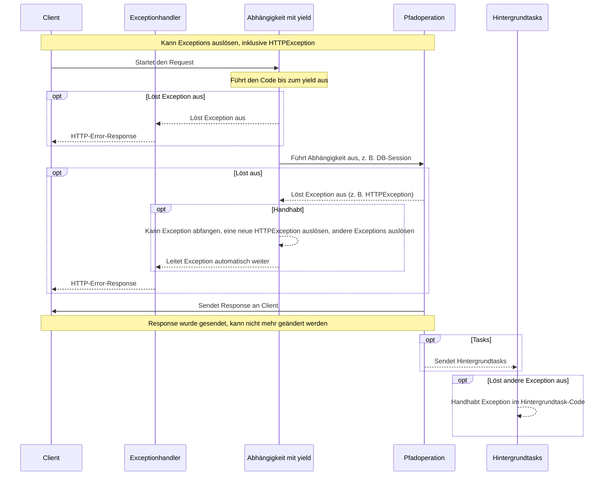

# Abhängigkeiten mit yield

FastAPI unterstützt Abhängigkeiten, die nach Abschluss einige <abbr title="Manchmal auch genannt „Exit Code“, „Cleanup Code“, „Teardown Code“, „Closing Code“, „Kontext Manager Exit Code“, usw.">zusätzliche Schritte ausführen</abbr>.

Verwenden Sie dazu `yield` statt `return` und schreiben Sie die zusätzlichen Schritte / den zusätzlichen Code danach.

/// tip | "Tipp"

Stellen Sie sicher, dass Sie `yield` nur einmal pro Abhängigkeit verwenden.

///

/// note | "Technische Details"

Jede Funktion, die dekoriert werden kann mit:

* <a href="https://docs.python.org/3/library/contextlib.html#contextlib.contextmanager" class="external-link" target="_blank">`@contextlib.contextmanager`</a> oder
* <a href="https://docs.python.org/3/library/contextlib.html#contextlib.asynccontextmanager" class="external-link" target="_blank">`@contextlib.asynccontextmanager`</a>

kann auch als gültige **FastAPI**-Abhängigkeit verwendet werden.

Tatsächlich verwendet FastAPI diese beiden Dekoratoren intern.

///

## Eine Datenbank-Abhängigkeit mit `yield`.

Sie könnten damit beispielsweise eine Datenbanksession erstellen und diese nach Abschluss schließen.

Nur der Code vor und einschließlich der `yield`-Anweisung wird ausgeführt, bevor eine Response erzeugt wird:

```Python hl_lines="2-4"
{!../../../docs_src/dependencies/tutorial007.py!}
```

Der ge`yield`ete Wert ist das, was in *Pfadoperationen* und andere Abhängigkeiten eingefügt wird:

```Python hl_lines="4"
{!../../../docs_src/dependencies/tutorial007.py!}
```

Der auf die `yield`-Anweisung folgende Code wird ausgeführt, nachdem die Response gesendet wurde:

```Python hl_lines="5-6"
{!../../../docs_src/dependencies/tutorial007.py!}
```

/// tip | "Tipp"

Sie können `async`hrone oder reguläre Funktionen verwenden.

**FastAPI** wird bei jeder das Richtige tun, so wie auch bei normalen Abhängigkeiten.

///

## Eine Abhängigkeit mit `yield` und `try`.

Wenn Sie einen `try`-Block in einer Abhängigkeit mit `yield` verwenden, empfangen Sie alle Exceptions, die bei Verwendung der Abhängigkeit geworfen wurden.

Wenn beispielsweise ein Code irgendwann in der Mitte, in einer anderen Abhängigkeit oder in einer *Pfadoperation*, ein „Rollback“ einer Datenbanktransaktion oder einen anderen Fehler verursacht, empfangen Sie die resultierende Exception in Ihrer Abhängigkeit.

Sie können also mit `except SomeException` diese bestimmte Exception innerhalb der Abhängigkeit handhaben.

Auf die gleiche Weise können Sie `finally` verwenden, um sicherzustellen, dass die Exit-Schritte ausgeführt werden, unabhängig davon, ob eine Exception geworfen wurde oder nicht.

```Python hl_lines="3  5"
{!../../../docs_src/dependencies/tutorial007.py!}
```

## Unterabhängigkeiten mit `yield`.

Sie können Unterabhängigkeiten und „Bäume“ von Unterabhängigkeiten beliebiger Größe und Form haben, und einige oder alle davon können `yield` verwenden.

**FastAPI** stellt sicher, dass der „Exit-Code“ in jeder Abhängigkeit mit `yield` in der richtigen Reihenfolge ausgeführt wird.

Beispielsweise kann `dependency_c` von `dependency_b` und `dependency_b` von `dependency_a` abhängen:

//// tab | Python 3.9+

```Python hl_lines="6  14  22"
{!> ../../../docs_src/dependencies/tutorial008_an_py39.py!}
```

////

//// tab | Python 3.8+

```Python hl_lines="5  13  21"
{!> ../../../docs_src/dependencies/tutorial008_an.py!}
```

////

//// tab | Python 3.8+ nicht annotiert

/// tip | "Tipp"

Bevorzugen Sie die `Annotated`-Version, falls möglich.

///

```Python hl_lines="4  12  20"
{!> ../../../docs_src/dependencies/tutorial008.py!}
```

////

Und alle können `yield` verwenden.

In diesem Fall benötigt `dependency_c` zum Ausführen seines Exit-Codes, dass der Wert von `dependency_b` (hier `dep_b` genannt) verfügbar ist.

Und wiederum benötigt `dependency_b` den Wert von `dependency_a` (hier `dep_a` genannt) für seinen Exit-Code.

//// tab | Python 3.9+

```Python hl_lines="18-19  26-27"
{!> ../../../docs_src/dependencies/tutorial008_an_py39.py!}
```

////

//// tab | Python 3.8+

```Python hl_lines="17-18  25-26"
{!> ../../../docs_src/dependencies/tutorial008_an.py!}
```

////

//// tab | Python 3.8+ nicht annotiert

/// tip | "Tipp"

Bevorzugen Sie die `Annotated`-Version, falls möglich.

///

```Python hl_lines="16-17  24-25"
{!> ../../../docs_src/dependencies/tutorial008.py!}
```

////

Auf die gleiche Weise könnten Sie einige Abhängigkeiten mit `yield` und einige andere Abhängigkeiten mit `return` haben, und alle können beliebig voneinander abhängen.

Und Sie könnten eine einzelne Abhängigkeit haben, die auf mehreren ge`yield`eten Abhängigkeiten basiert, usw.

Sie können beliebige Kombinationen von Abhängigkeiten haben.

**FastAPI** stellt sicher, dass alles in der richtigen Reihenfolge ausgeführt wird.

/// note | "Technische Details"

Dieses funktioniert dank Pythons <a href="https://docs.python.org/3/library/contextlib.html" class="external-link" target="_blank">Kontextmanager</a>.

**FastAPI** verwendet sie intern, um das zu erreichen.

///

## Abhängigkeiten mit `yield` und `HTTPException`.

Sie haben gesehen, dass Ihre Abhängigkeiten `yield` verwenden können und `try`-Blöcke haben können, die Exceptions abfangen.

Auf die gleiche Weise könnten Sie im Exit-Code nach dem `yield` eine `HTTPException` oder ähnliches auslösen.

/// tip | "Tipp"

Dies ist eine etwas fortgeschrittene Technik, die Sie in den meisten Fällen nicht wirklich benötigen, da Sie Exceptions (einschließlich `HTTPException`) innerhalb des restlichen Anwendungscodes auslösen können, beispielsweise in der *Pfadoperation-Funktion*.

Aber es ist für Sie da, wenn Sie es brauchen. 🤓

///

//// tab | Python 3.9+

```Python hl_lines="18-22  31"
{!> ../../../docs_src/dependencies/tutorial008b_an_py39.py!}
```

////

//// tab | Python 3.8+

```Python hl_lines="17-21  30"
{!> ../../../docs_src/dependencies/tutorial008b_an.py!}
```

////

//// tab | Python 3.8+ nicht annotiert

/// tip | "Tipp"

Bevorzugen Sie die `Annotated`-Version, falls möglich.

///

```Python hl_lines="16-20  29"
{!> ../../../docs_src/dependencies/tutorial008b.py!}
```

////

Eine Alternative zum Abfangen von Exceptions (und möglicherweise auch zum Auslösen einer weiteren `HTTPException`) besteht darin, einen [benutzerdefinierten Exceptionhandler](../handling-errors.md#benutzerdefinierte-exceptionhandler-definieren){.internal-link target=_blank} zu erstellen.

## Ausführung von Abhängigkeiten mit `yield`

Die Ausführungsreihenfolge ähnelt mehr oder weniger dem folgenden Diagramm. Die Zeit verläuft von oben nach unten. Und jede Spalte ist einer der interagierenden oder Code-ausführenden Teilnehmer.



/// info

Es wird nur **eine Response** an den Client gesendet. Es kann eine Error-Response oder die Response der *Pfadoperation* sein.

Nachdem eine dieser Responses gesendet wurde, kann keine weitere Response gesendet werden.

///

/// tip | "Tipp"

Obiges Diagramm verwendet `HTTPException`, aber Sie können auch jede andere Exception auslösen, die Sie in einer Abhängigkeit mit `yield` abfangen, oder mit einem [benutzerdefinierten Exceptionhandler](../handling-errors.md#benutzerdefinierte-exceptionhandler-definieren){.internal-link target=_blank} erstellt haben.

Wenn Sie eine Exception auslösen, wird diese mit yield an die Abhängigkeiten übergeben, einschließlich `HTTPException`, und dann **erneut** an die Exceptionhandler. Wenn es für diese Exception keinen Exceptionhandler gibt, wird sie von der internen Default-`ServerErrorMiddleware` gehandhabt, was einen HTTP-Statuscode 500 zurückgibt, um den Client darüber zu informieren, dass ein Fehler auf dem Server aufgetreten ist.

///

## Abhängigkeiten mit `yield`, `HTTPException` und Hintergrundtasks

/// warning | "Achtung"

Sie benötigen diese technischen Details höchstwahrscheinlich nicht, Sie können diesen Abschnitt überspringen und weiter unten fortfahren.

Diese Details sind vor allem dann nützlich, wenn Sie eine Version von FastAPI vor 0.106.0 verwendet haben und Ressourcen aus Abhängigkeiten mit `yield` in Hintergrundtasks verwendet haben.

///

Vor FastAPI 0.106.0 war das Auslösen von Exceptions nach `yield` nicht möglich, der Exit-Code in Abhängigkeiten mit `yield` wurde ausgeführt, *nachdem* die Response gesendet wurde, die [Exceptionhandler](../handling-errors.md#benutzerdefinierte-exceptionhandler-definieren){.internal-link target=_blank} wären also bereits ausgeführt worden.

Dies wurde hauptsächlich so konzipiert, damit die gleichen Objekte, die durch Abhängigkeiten ge`yield`et werden, innerhalb von Hintergrundtasks verwendet werden können, da der Exit-Code ausgeführt wird, nachdem die Hintergrundtasks abgeschlossen sind.

Da dies jedoch bedeuten würde, darauf zu warten, dass die Response durch das Netzwerk reist, während eine Ressource unnötigerweise in einer Abhängigkeit mit yield gehalten wird (z. B. eine Datenbankverbindung), wurde dies in FastAPI 0.106.0 geändert.

/// tip | "Tipp"

Darüber hinaus handelt es sich bei einem Hintergrundtask normalerweise um einen unabhängigen Satz von Logik, der separat behandelt werden sollte, mit eigenen Ressourcen (z. B. einer eigenen Datenbankverbindung).

Auf diese Weise erhalten Sie wahrscheinlich saubereren Code.

///

Wenn Sie sich früher auf dieses Verhalten verlassen haben, sollten Sie jetzt die Ressourcen für Hintergrundtasks innerhalb des Hintergrundtasks selbst erstellen und intern nur Daten verwenden, die nicht von den Ressourcen von Abhängigkeiten mit `yield` abhängen.

Anstatt beispielsweise dieselbe Datenbanksitzung zu verwenden, würden Sie eine neue Datenbanksitzung innerhalb des Hintergrundtasks erstellen und die Objekte mithilfe dieser neuen Sitzung aus der Datenbank abrufen. Und anstatt das Objekt aus der Datenbank als Parameter an die Hintergrundtask-Funktion zu übergeben, würden Sie die ID dieses Objekts übergeben und das Objekt dann innerhalb der Hintergrundtask-Funktion erneut laden.

## Kontextmanager

### Was sind „Kontextmanager“

„Kontextmanager“ (Englisch „Context Manager“) sind bestimmte Python-Objekte, die Sie in einer `with`-Anweisung verwenden können.

Beispielsweise können Sie <a href="https://docs.python.org/3/tutorial/inputoutput.html#reading-and-writing-files" class="external-link" target="_blank">`with` verwenden, um eine Datei auszulesen</a>:

```Python
with open("./somefile.txt") as f:
    contents = f.read()
    print(contents)
```

Im Hintergrund erstellt das `open("./somefile.txt")` ein Objekt, das als „Kontextmanager“ bezeichnet wird.

Dieser stellt sicher dass, wenn der `with`-Block beendet ist, die Datei geschlossen wird, auch wenn Exceptions geworfen wurden.

Wenn Sie eine Abhängigkeit mit `yield` erstellen, erstellt **FastAPI** dafür intern einen Kontextmanager und kombiniert ihn mit einigen anderen zugehörigen Tools.

### Kontextmanager in Abhängigkeiten mit `yield` verwenden

/// warning | "Achtung"

Dies ist mehr oder weniger eine „fortgeschrittene“ Idee.

Wenn Sie gerade erst mit **FastAPI** beginnen, möchten Sie das vielleicht vorerst überspringen.

///

In Python können Sie Kontextmanager erstellen, indem Sie <a href="https://docs.python.org/3/reference/datamodel.html#context-managers" class="external-link" target="_blank">eine Klasse mit zwei Methoden erzeugen: `__enter__()` und `__exit__()`</a>.

Sie können solche auch innerhalb von **FastAPI**-Abhängigkeiten mit `yield` verwenden, indem Sie `with`- oder `async with`-Anweisungen innerhalb der Abhängigkeits-Funktion verwenden:

```Python hl_lines="1-9  13"
{!../../../docs_src/dependencies/tutorial010.py!}
```

/// tip | "Tipp"

Andere Möglichkeiten, einen Kontextmanager zu erstellen, sind:

* <a href="https://docs.python.org/3/library/contextlib.html#contextlib.contextmanager" class="external-link" target="_blank">`@contextlib.contextmanager`</a> oder
* <a href="https://docs.python.org/3/library/contextlib.html#contextlib.asynccontextmanager" class="external-link" target="_blank">`@contextlib.asynccontextmanager`</a>

Verwenden Sie diese, um eine Funktion zu dekorieren, die ein einziges `yield` hat.

Das ist es auch, was **FastAPI** intern für Abhängigkeiten mit `yield` verwendet.

Aber Sie müssen die Dekoratoren nicht für FastAPI-Abhängigkeiten verwenden (und das sollten Sie auch nicht).

FastAPI erledigt das intern für Sie.

///
