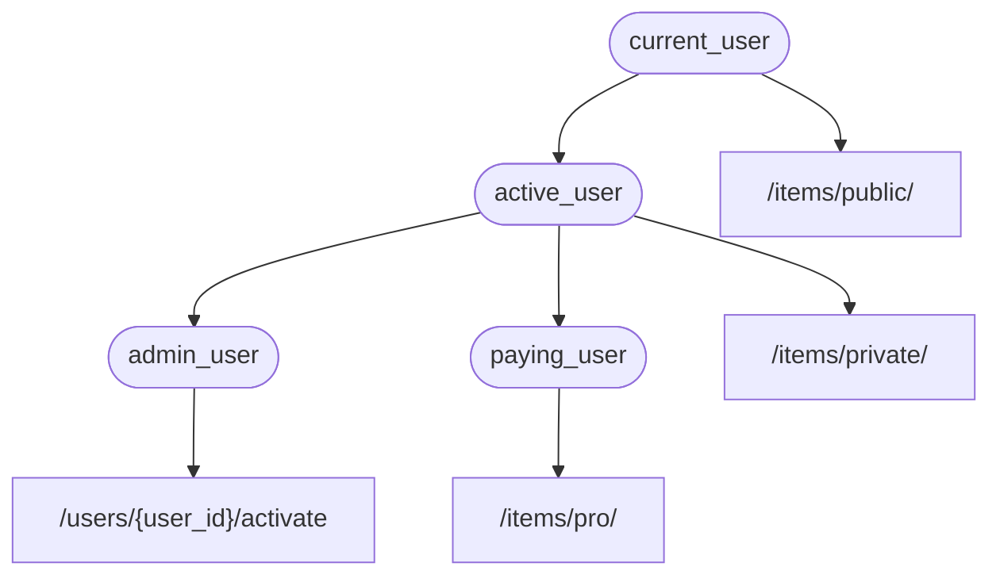

# Abhängigkeiten { #dependencies }

**FastAPI** hat ein sehr mächtiges, aber intuitives **<abbr title="auch bekannt als: Komponenten, Ressourcen, Provider, Services, Injectables">Dependency Injection</abbr>** System.

Es ist so konzipiert, sehr einfach zu verwenden zu sein und es jedem Entwickler sehr leicht zu machen, andere Komponenten mit **FastAPI** zu integrieren.

## Was ist „Dependency Injection“ { #what-is-dependency-injection }

**„Dependency Injection“** bedeutet in der Programmierung, dass es für Ihren Code (in diesem Fall Ihre *Pfadoperation-Funktionen*) eine Möglichkeit gibt, Dinge zu deklarieren, die er verwenden möchte und die er zum Funktionieren benötigt: „Abhängigkeiten“ – „Dependencies“.

Das System (in diesem Fall **FastAPI**) kümmert sich dann darum, Ihren Code mit den erforderlichen Abhängigkeiten zu versorgen („die Abhängigkeiten einfügen“ – „inject the dependencies“).

Das ist sehr nützlich, wenn Sie:

* Eine gemeinsame Logik haben (die gleiche Code-Logik immer und immer wieder).
* Datenbankverbindungen teilen.
* Sicherheit, Authentifizierung, Rollenanforderungen, usw. durchsetzen.
* Und viele andere Dinge ...

All dies, während Sie Codeverdoppelung minimieren.

## Erste Schritte { #first-steps }

Sehen wir uns ein sehr einfaches Beispiel an. Es ist so einfach, dass es vorerst nicht sehr nützlich ist.

Aber so können wir uns besser auf die Funktionsweise des **Dependency Injection** Systems konzentrieren.

### Eine Abhängigkeit erstellen, oder <abbr title="Das von dem abhängt, die zu verwendende Abhängigkeit">„Dependable“</abbr> { #create-a-dependency-or-dependable }

Konzentrieren wir uns zunächst auf die Abhängigkeit – die Dependency.

Es handelt sich einfach um eine Funktion, die die gleichen Parameter entgegennimmt wie eine *Pfadoperation-Funktion*:
{* ../../docs_src/dependencies/tutorial001_an_py310.py hl[8:9] *}

Das war's schon.

**Zwei Zeilen**.

Und sie hat die gleiche Form und Struktur wie alle Ihre *Pfadoperation-Funktionen*.

Sie können sie sich als *Pfadoperation-Funktion* ohne den „Dekorator“ (ohne `@app.get("/some-path")`) vorstellen.

Und sie kann alles zurückgeben, was Sie möchten.

In diesem Fall erwartet diese Abhängigkeit:

* Einen optionalen Query-Parameter `q`, der ein `str` ist.
* Einen optionalen Query-Parameter `skip`, der ein `int` ist und standardmäßig `0` ist.
* Einen optionalen Query-Parameter `limit`, der ein `int` ist und standardmäßig `100` ist.

Und dann wird einfach ein <abbr title="Dictionary – Zuordnungstabelle: In anderen Sprachen auch Hash, Map, Objekt, Assoziatives Array genannt">`dict`</abbr> zurückgegeben, welches diese Werte enthält.

/// info | Info

FastAPI unterstützt (und empfiehlt die Verwendung von) `Annotated` seit Version 0.95.0.

Wenn Sie eine ältere Version haben, werden Sie Fehler angezeigt bekommen, wenn Sie versuchen, `Annotated` zu verwenden.

Bitte [aktualisieren Sie FastAPI](../../deployment/versions.md#upgrading-the-fastapi-versions){.internal-link target=_blank} daher mindestens zu Version 0.95.1, bevor Sie `Annotated` verwenden.

///

### `Depends` importieren { #import-depends }

{* ../../docs_src/dependencies/tutorial001_an_py310.py hl[3] *}

### Die Abhängigkeit im <abbr title="Das Abhängige, der Verwender der Abhängigkeit">„Dependant“</abbr> deklarieren { #declare-the-dependency-in-the-dependant }

So wie auch `Body`, `Query`, usw., verwenden Sie `Depends` mit den Parametern Ihrer *Pfadoperation-Funktion*:

{* ../../docs_src/dependencies/tutorial001_an_py310.py hl[13,18] *}

Obwohl Sie `Depends` in den Parametern Ihrer Funktion genauso verwenden wie `Body`, `Query`, usw., funktioniert `Depends` etwas anders.

Sie übergeben `Depends` nur einen einzigen Parameter.

Dieser Parameter muss so etwas wie eine Funktion sein.

Sie **rufen diese nicht direkt auf** (fügen Sie am Ende keine Klammern hinzu), sondern übergeben sie einfach als Parameter an `Depends()`.

Und diese Funktion akzeptiert Parameter auf die gleiche Weise wie *Pfadoperation-Funktionen*.

/// tip | Tipp

Im nächsten Kapitel erfahren Sie, welche anderen „Dinge“, außer Funktionen, Sie als Abhängigkeiten verwenden können.

///

Immer wenn ein neuer <abbr title="Request – Anfrage: Daten, die der Client zum Server sendet">Request</abbr> eintrifft, kümmert sich **FastAPI** darum:

* Ihre Abhängigkeitsfunktion („Dependable“) mit den richtigen Parametern aufzurufen.
* Sich das Ergebnis von dieser Funktion zu holen.
* Dieses Ergebnis dem Parameter Ihrer *Pfadoperation-Funktion* zuzuweisen.


Auf diese Weise schreiben Sie gemeinsam genutzten Code nur einmal, und **FastAPI** kümmert sich darum, ihn für Ihre *Pfadoperationen* aufzurufen.

/// check | Testen

Beachten Sie, dass Sie keine spezielle Klasse erstellen und diese irgendwo an **FastAPI** übergeben müssen, um sie zu „registrieren“ oder so ähnlich.

Sie übergeben es einfach an `Depends` und **FastAPI** weiß, wie der Rest erledigt wird.

///

## `Annotated`-Abhängigkeiten wiederverwenden { #share-annotated-dependencies }

In den Beispielen oben sehen Sie, dass es ein kleines bisschen **Codeverdoppelung** gibt.

Wenn Sie die Abhängigkeit `common_parameters()` verwenden, müssen Sie den gesamten Parameter mit der Typannotation und `Depends()` schreiben:

```Python
commons: Annotated[dict, Depends(common_parameters)]
```

Da wir jedoch `Annotated` verwenden, können wir diesen `Annotated`-Wert in einer Variablen speichern und an mehreren Stellen verwenden:

{* ../../docs_src/dependencies/tutorial001_02_an_py310.py hl[12,16,21] *}

/// tip | Tipp

Das ist schlicht Standard-Python, es wird als „Typalias“ bezeichnet und ist eigentlich nicht **FastAPI**-spezifisch.

Da **FastAPI** jedoch auf Standard-Python, einschließlich `Annotated`, basiert, können Sie diesen Trick in Ihrem Code verwenden. 😎

///

Die Abhängigkeiten funktionieren weiterhin wie erwartet, und das **Beste daran** ist, dass die **Typinformationen erhalten bleiben**, was bedeutet, dass Ihr Editor Ihnen weiterhin **automatische Vervollständigung**, **Inline-Fehler**, usw. bieten kann. Das Gleiche gilt für andere Tools wie `mypy`.

Das ist besonders nützlich, wenn Sie es in einer **großen Codebasis** verwenden, in der Sie in **vielen *Pfadoperationen*** immer wieder **dieselben Abhängigkeiten** verwenden.

## `async` oder nicht `async` { #to-async-or-not-to-async }

Da Abhängigkeiten auch von **FastAPI** aufgerufen werden (so wie Ihre *Pfadoperation-Funktionen*), gelten beim Definieren Ihrer Funktionen die gleichen Regeln.

Sie können `async def` oder einfach `def` verwenden.

Und Sie können Abhängigkeiten mit `async def` innerhalb normaler `def`-*Pfadoperation-Funktionen* oder `def`-Abhängigkeiten innerhalb von `async def`-*Pfadoperation-Funktionen*, usw. deklarieren.

Es spielt keine Rolle. **FastAPI** weiß, was zu tun ist.

/// note | Hinweis

Wenn Ihnen das nichts sagt, lesen Sie den [Async: *„In Eile?“*](../../async.md#in-a-hurry){.internal-link target=_blank}-Abschnitt über `async` und `await` in der Dokumentation.

///

## Integriert in OpenAPI { #integrated-with-openapi }

Alle Requestdeklarationen, -validierungen und -anforderungen Ihrer Abhängigkeiten (und Unterabhängigkeiten) werden in dasselbe OpenAPI-Schema integriert.

Die interaktive Dokumentation enthält also auch alle Informationen aus diesen Abhängigkeiten:


## Einfache Verwendung { #simple-usage }

Näher betrachtet, werden *Pfadoperation-Funktionen* deklariert, um verwendet zu werden, wann immer ein *Pfad* und eine *Operation* übereinstimmen, und dann kümmert sich **FastAPI** darum, die Funktion mit den richtigen Parametern aufzurufen, die Daten aus dem Request extrahierend.

Tatsächlich funktionieren alle (oder die meisten) Webframeworks auf die gleiche Weise.

Sie rufen diese Funktionen niemals direkt auf. Sie werden von Ihrem Framework aufgerufen (in diesem Fall **FastAPI**).

Mit dem Dependency Injection System können Sie **FastAPI** ebenfalls mitteilen, dass Ihre *Pfadoperation-Funktion* von etwas anderem „abhängt“, das vor Ihrer *Pfadoperation-Funktion* ausgeführt werden soll, und **FastAPI** kümmert sich darum, es auszuführen und die Ergebnisse zu „injizieren“.

Andere gebräuchliche Begriffe für dieselbe Idee der „Abhängigkeitsinjektion“ sind:

* Ressourcen
* Provider
* Services
* Injectables
* Komponenten

## **FastAPI**-Plugins { #fastapi-plug-ins }

Integrationen und „Plugins“ können mit dem **Dependency Injection** System erstellt werden. Aber tatsächlich besteht **keine Notwendigkeit, „Plugins“ zu erstellen**, da es durch die Verwendung von Abhängigkeiten möglich ist, eine unendliche Anzahl von Integrationen und Interaktionen zu deklarieren, die dann für Ihre *Pfadoperation-Funktionen* verfügbar sind.

Und Abhängigkeiten können auf sehr einfache und intuitive Weise erstellt werden, sodass Sie einfach die benötigten Python-Packages importieren und sie in wenigen Codezeilen, *im wahrsten Sinne des Wortes*, mit Ihren API-Funktionen integrieren.

Beispiele hierfür finden Sie in den nächsten Kapiteln zu relationalen und NoSQL-Datenbanken, Sicherheit usw.

## **FastAPI**-Kompatibilität { #fastapi-compatibility }

Die Einfachheit des Dependency Injection Systems macht **FastAPI** kompatibel mit:

* allen relationalen Datenbanken
* NoSQL-Datenbanken
* externen Packages
* externen APIs
* Authentifizierungs- und Autorisierungssystemen
* API-Nutzungs-Überwachungssystemen
* <abbr title="Response – Antwort: Daten, die der Server zum anfragenden Client zurücksendet">Responsedaten</abbr>-Injektionssystemen
* usw.

## Einfach und leistungsstark { #simple-and-powerful }

Obwohl das hierarchische Dependency Injection System sehr einfach zu definieren und zu verwenden ist, ist es dennoch sehr mächtig.

Sie können Abhängigkeiten definieren, die selbst wiederum Abhängigkeiten definieren können.

Am Ende wird ein hierarchischer Baum von Abhängigkeiten erstellt, und das **Dependency Injection** System kümmert sich darum, alle diese Abhängigkeiten (und deren Unterabhängigkeiten) für Sie aufzulösen und die Ergebnisse bei jedem Schritt einzubinden (zu injizieren).

Nehmen wir zum Beispiel an, Sie haben vier API-Endpunkte (*Pfadoperationen*):

* `/items/public/`
* `/items/private/`
* `/users/{user_id}/activate`
* `/items/pro/`

Dann könnten Sie für jeden davon unterschiedliche Berechtigungsanforderungen hinzufügen, nur mit Abhängigkeiten und Unterabhängigkeiten:



## Integriert mit **OpenAPI** { #integrated-with-openapi_1 }

Alle diese Abhängigkeiten, während sie ihre Anforderungen deklarieren, fügen auch Parameter, Validierungen, usw. zu Ihren *Pfadoperationen* hinzu.

**FastAPI** kümmert sich darum, alles zum OpenAPI-Schema hinzuzufügen, damit es in den interaktiven Dokumentationssystemen angezeigt wird.
