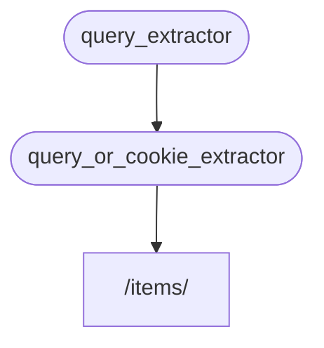

# Unterabhängigkeiten { #sub-dependencies }

Sie können Abhängigkeiten erstellen, die **Unterabhängigkeiten** haben.

Diese können so **tief** verschachtelt sein, wie nötig.

**FastAPI** kümmert sich darum, sie aufzulösen.

## Erste Abhängigkeit, „Dependable“ { #first-dependency-dependable }

Sie könnten eine erste Abhängigkeit („Dependable“) wie folgt erstellen:

{* ../../docs_src/dependencies/tutorial005_an_py310.py hl[8:9] *}

Diese deklariert einen optionalen Query-Parameter `q` vom Typ `str` und gibt ihn dann einfach zurück.

Das ist recht einfach (nicht sehr nützlich), hilft uns aber dabei, uns auf die Funktionsweise der Unterabhängigkeiten zu konzentrieren.

## Zweite Abhängigkeit, „Dependable“ und „Dependant“ { #second-dependency-dependable-and-dependant }

Dann können Sie eine weitere Abhängigkeitsfunktion (ein „Dependable“) erstellen, die gleichzeitig eine eigene Abhängigkeit deklariert (also auch ein „Dependant“ ist):

{* ../../docs_src/dependencies/tutorial005_an_py310.py hl[13] *}

Betrachten wir die deklarierten Parameter:

* Obwohl diese Funktion selbst eine Abhängigkeit ist („Dependable“, etwas hängt von ihr ab), deklariert sie auch eine andere Abhängigkeit („Dependant“, sie hängt von etwas anderem ab).
    * Sie hängt von `query_extractor` ab und weist den von diesem zurückgegebenen Wert dem Parameter `q` zu.
* Sie deklariert außerdem ein optionales `last_query`-Cookie, ein `str`.
    * Wenn der Benutzer keine Query `q` übermittelt hat, verwenden wir die zuletzt übermittelte Query, die wir zuvor in einem Cookie gespeichert haben.

## Die Abhängigkeit verwenden { #use-the-dependency }

Diese Abhängigkeit verwenden wir nun wie folgt:

{* ../../docs_src/dependencies/tutorial005_an_py310.py hl[23] *}

/// info | Info

Beachten Sie, dass wir in der *Pfadoperation-Funktion* nur eine einzige Abhängigkeit deklarieren, den `query_or_cookie_extractor`.

Aber **FastAPI** wird wissen, dass es zuerst `query_extractor` auflösen muss, um dessen Resultat an `query_or_cookie_extractor` zu übergeben, wenn dieses aufgerufen wird.

///



## Dieselbe Abhängigkeit mehrmals verwenden { #using-the-same-dependency-multiple-times }

Wenn eine Ihrer Abhängigkeiten mehrmals für dieselbe *Pfadoperation* deklariert wird, beispielsweise wenn mehrere Abhängigkeiten eine gemeinsame Unterabhängigkeit haben, wird **FastAPI** diese Unterabhängigkeit nur einmal pro <abbr title="Request – Anfrage: Daten, die der Client zum Server sendet">Request</abbr> aufrufen.

Und es speichert den zurückgegebenen Wert in einem <abbr title="Mechanismus, der bereits berechnete/generierte Werte zwischenspeichert, um sie später wiederzuverwenden, anstatt sie erneut zu berechnen.">„Cache“</abbr> und übergibt diesen gecachten Wert an alle „Dependanten“, die ihn in diesem spezifischen Request benötigen, anstatt die Abhängigkeit mehrmals für denselben Request aufzurufen.

In einem fortgeschrittenen Szenario, bei dem Sie wissen, dass die Abhängigkeit bei jedem Schritt (möglicherweise mehrmals) in demselben Request aufgerufen werden muss, anstatt den zwischengespeicherten Wert zu verwenden, können Sie den Parameter `use_cache=False` festlegen, wenn Sie `Depends` verwenden:

//// tab | Python 3.8+

```Python hl_lines="1"
async def needy_dependency(fresh_value: Annotated[str, Depends(get_value, use_cache=False)]):
    return {"fresh_value": fresh_value}
```

////

//// tab | Python 3.8+ nicht annotiert

/// tip | Tipp

Bevorzugen Sie die `Annotated`-Version, falls möglich.

///

```Python hl_lines="1"
async def needy_dependency(fresh_value: str = Depends(get_value, use_cache=False)):
    return {"fresh_value": fresh_value}
```

////

## Zusammenfassung { #recap }

Abgesehen von all den ausgefallenen Wörtern, die hier verwendet werden, ist das **Dependency Injection**-System recht simpel.

Einfach Funktionen, die genauso aussehen wie *Pfadoperation-Funktionen*.

Dennoch ist es sehr mächtig und ermöglicht Ihnen die Deklaration beliebig tief verschachtelter Abhängigkeits-„Graphen“ (Bäume).

/// tip | Tipp

All dies scheint angesichts dieser einfachen Beispiele möglicherweise nicht so nützlich zu sein.

Aber Sie werden in den Kapiteln über **Sicherheit** sehen, wie nützlich das ist.

Und Sie werden auch sehen, wie viel Code Sie dadurch einsparen.

///
