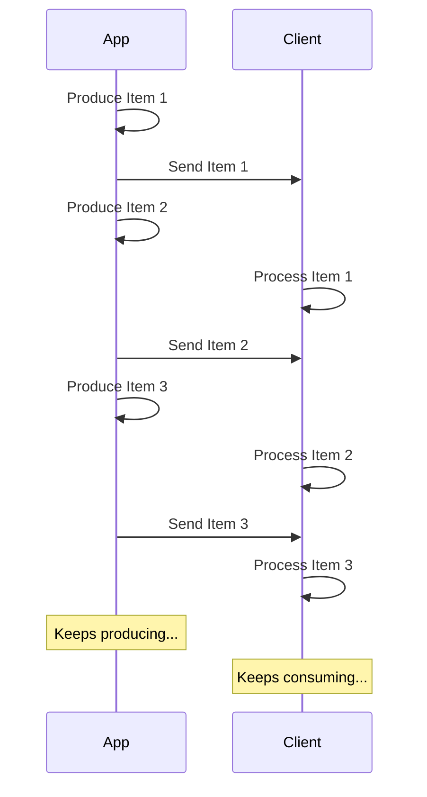

# JSON Lines streamen { #stream-json-lines }

Sie könnten eine Folge von Daten haben, die Sie in einem „Stream“ senden möchten, das können Sie mit **JSON Lines** tun.

/// info | Info

Hinzugefügt in FastAPI 0.134.0.

///

## Was ist ein Stream? { #what-is-a-stream }

„Streaming“ von Daten bedeutet, dass Ihre App damit beginnt, Datenelemente an den Client zu senden, ohne darauf zu warten, dass die gesamte Folge von Elementen fertig ist.

Sie sendet also das erste Element, der Client empfängt es und beginnt mit der Verarbeitung, und Sie erzeugen währenddessen möglicherweise bereits das nächste Element.



Es könnte sogar ein unendlicher Stream sein, bei dem Sie kontinuierlich Daten senden.

## JSON Lines { #json-lines }

In diesen Fällen ist es üblich, „JSON Lines“ zu senden, das ist ein Format, bei dem Sie pro Zeile genau ein JSON-Objekt senden.

Eine Response hätte einen Content-Type von `application/jsonl` (anstelle von `application/json`) und der Body sähe etwa so aus:

```json
{"name": "Plumbus", "description": "A multi-purpose household device."}
{"name": "Portal Gun", "description": "A portal opening device."}
{"name": "Meeseeks Box", "description": "A box that summons a Meeseeks."}
```

Es ist einem JSON-Array (entspricht einer Python-Liste) sehr ähnlich, aber anstatt in `[]` eingeschlossen zu sein und `,` zwischen den Elementen zu haben, gibt es hier **ein JSON-Objekt pro Zeile**, sie sind durch ein Zeilenumbruchzeichen getrennt.

/// info | Info

Der wichtige Punkt ist, dass Ihre App in der Lage ist, jede Zeile der Reihe nach zu erzeugen, während der Client die vorherigen Zeilen konsumiert.

///

/// note | Technische Details

Da jedes JSON-Objekt durch einen Zeilenumbruch getrennt wird, können sie keine wörtlichen Zeilenumbrüche in ihrem Inhalt enthalten, aber sie können escapte Zeilenumbrüche (`\n`) enthalten, das ist Teil des JSON-Standards.

Normalerweise müssen Sie sich darum aber nicht kümmern, das geschieht automatisch, lesen Sie weiter. 🤓

///

## Anwendungsfälle { #use-cases }

Sie könnten dies verwenden, um Daten von einem **AI LLM**-Service, aus **Logs** oder **Telemetrie**, oder aus anderen Typen von Daten zu streamen, die sich in **JSON**-Items strukturieren lassen.

/// tip | Tipp

Wenn Sie Binärdaten streamen möchten, zum Beispiel Video oder Audio, sehen Sie sich den erweiterten Leitfaden an: [Daten streamen](../advanced/stream-data.md).

///

## JSON Lines mit FastAPI streamen { #stream-json-lines-with-fastapi }

Um JSON Lines mit FastAPI zu streamen, können Sie anstelle von `return` in Ihrer *Pfadoperation-Funktion* `yield` verwenden, um jedes Element der Reihe nach zu erzeugen.

{* ../../docs_src/stream_json_lines/tutorial001_py310.py ln[1:24] hl[24] *}

Wenn jedes JSON-Item, das Sie zurücksenden möchten, vom Typ `Item` ist (ein Pydantic-Modell) und es sich um eine async-Funktion handelt, können Sie den Rückgabetyp als `AsyncIterable[Item]` deklarieren:

{* ../../docs_src/stream_json_lines/tutorial001_py310.py ln[1:24] hl[9:11,22] *}

Wenn Sie den Rückgabetyp deklarieren, wird FastAPI ihn verwenden, um die Daten zu **validieren**, sie in OpenAPI zu **dokumentieren**, sie zu **filtern** und sie mit Pydantic zu **serialisieren**.

/// tip | Tipp

Da Pydantic es auf der **Rust**-Seite serialisiert, erhalten Sie eine deutlich höhere **Leistung** als wenn Sie keinen Rückgabetyp deklarieren.

///

### Nicht-async *Pfadoperation-Funktionen* { #non-async-path-operation-functions }

Sie können auch normale `def`-Funktionen (ohne `async`) verwenden und `yield` auf die gleiche Weise einsetzen.

FastAPI stellt sicher, dass sie korrekt ausgeführt werden, sodass der Event Loop nicht blockiert wird.

Da die Funktion in diesem Fall nicht async ist, wäre der richtige Rückgabetyp `Iterable[Item]`:

{* ../../docs_src/stream_json_lines/tutorial001_py310.py ln[27:30] hl[28] *}

### Kein Rückgabetyp { #no-return-type }

Sie können den Rückgabetyp auch weglassen. FastAPI verwendet dann den [`jsonable_encoder`](./encoder.md), um die Daten in etwas zu konvertieren, das zu JSON serialisiert werden kann, und sendet sie anschließend als JSON Lines.

{* ../../docs_src/stream_json_lines/tutorial001_py310.py ln[33:36] hl[34] *}

## Server-Sent Events (SSE) { #server-sent-events-sse }

FastAPI hat außerdem erstklassige Unterstützung für Server-Sent Events (SSE), die dem sehr ähnlich sind, aber ein paar zusätzliche Details mitbringen. Sie können im nächsten Kapitel mehr darüber lernen: [Server-Sent Events (SSE)](server-sent-events.md). 🤓
