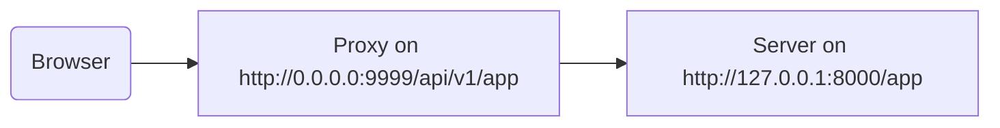

# ⛅ 🗳

⚠, 👆 5️⃣📆 💪 ⚙️ **🗳** 💽 💖 Traefik ⚖️ 👌 ⏮️ 📳 👈 🚮 ➕ ➡ 🔡 👈 🚫 👀 👆 🈸.

👫 💼 👆 💪 ⚙️ `root_path` 🔗 👆 🈸.

`root_path` 🛠️ 🚚 🔫 🔧 (👈 FastAPI 🏗 🔛, 🔘 💃).

`root_path` ⚙️ 🍵 👫 🎯 💼.

&amp; ⚫️ ⚙️ 🔘 🕐❔ 🗜 🎧-🈸.

## 🗳 ⏮️ 🎞 ➡ 🔡

✔️ 🗳 ⏮️ 🎞 ➡ 🔡, 👉 💼, ⛓ 👈 👆 💪 📣 ➡ `/app` 👆 📟, ✋️ ⤴️, 👆 🚮 🧽 🔛 🔝 (🗳) 👈 🔜 🚮 👆 **FastAPI** 🈸 🔽 ➡ 💖 `/api/v1`.

👉 💼, ⏮️ ➡ `/app` 🔜 🤙 🍦 `/api/v1/app`.

✋️ 🌐 👆 📟 ✍ 🤔 📤 `/app`.

&amp; 🗳 🔜 **"❎"** **➡ 🔡** 🔛 ✈ ⏭ 📶 📨 Uvicorn, 🚧 👆 🈸 🤔 👈 ⚫️ 🍦 `/app`, 👈 👆 🚫 ✔️ ℹ 🌐 👆 📟 🔌 🔡 `/api/v1`.

🆙 📥, 🌐 🔜 👷 🛎.

✋️ ⤴️, 🕐❔ 👆 📂 🛠️ 🩺 🎚 (🕸), ⚫️ 🔜 ⌛ 🤚 🗄 🔗 `/openapi.json`, ↩️ `/api/v1/openapi.json`.

, 🕸 (👈 🏃 🖥) 🔜 🔄 🏆 `/openapi.json` &amp; 🚫🔜 💪 🤚 🗄 🔗.

↩️ 👥 ✔️ 🗳 ⏮️ ➡ 🔡 `/api/v1` 👆 📱, 🕸 💪 ☕ 🗄 🔗 `/api/v1/openapi.json`.



!!! tip
    📢 `0.0.0.0` 🛎 ⚙️ ⛓ 👈 📋 👂 🔛 🌐 📢 💪 👈 🎰/💽.

🩺 🎚 🔜 💪 🗄 🔗 📣 👈 👉 🛠️ `server` 🔎 `/api/v1` (⛅ 🗳). 🖼:

```JSON hl_lines="4-8"
{
    "openapi": "3.0.2",
    // More stuff here
    "servers": [
        {
            "url": "/api/v1"
        }
    ],
    "paths": {
            // More stuff here
    }
}
```

👉 🖼, "🗳" 💪 🕳 💖 **Traefik**. &amp; 💽 🔜 🕳 💖 **Uvicorn**, 🏃‍♂ 👆 FastAPI 🈸.

### 🚚 `root_path`

🏆 👉, 👆 💪 ⚙️ 📋 ⏸ 🎛 `--root-path` 💖:

<div class="termy">

```console
$ uvicorn main:app --root-path /api/v1

<span style="color: green;">INFO</span>:     Uvicorn running on http://127.0.0.1:8000 (Press CTRL+C to quit)
```

</div>

🚥 👆 ⚙️ Hypercorn, ⚫️ ✔️ 🎛 `--root-path`.

!!! note "📡 ℹ"
    🔫 🔧 🔬 `root_path` 👉 ⚙️ 💼.

     &amp; `--root-path` 📋 ⏸ 🎛 🚚 👈 `root_path`.

### ✅ ⏮️ `root_path`

👆 💪 🤚 ⏮️ `root_path` ⚙️ 👆 🈸 🔠 📨, ⚫️ 🍕 `scope` 📖 (👈 🍕 🔫 🔌).

📥 👥 ✅ ⚫️ 📧 🎦 🎯.

```Python hl_lines="8"
{!../../../docs_src/behind_a_proxy/tutorial001.py!}
```

⤴️, 🚥 👆 ▶️ Uvicorn ⏮️:

<div class="termy">

```console
$ uvicorn main:app --root-path /api/v1

<span style="color: green;">INFO</span>:     Uvicorn running on http://127.0.0.1:8000 (Press CTRL+C to quit)
```

</div>

📨 🔜 🕳 💖:

```JSON
{
    "message": "Hello World",
    "root_path": "/api/v1"
}
```

### ⚒ `root_path` FastAPI 📱

👐, 🚥 👆 🚫 ✔️ 🌌 🚚 📋 ⏸ 🎛 💖 `--root-path` ⚖️ 🌓, 👆 💪 ⚒ `root_path` 🔢 🕐❔ 🏗 👆 FastAPI 📱:

```Python hl_lines="3"
{!../../../docs_src/behind_a_proxy/tutorial002.py!}
```

🚶‍♀️ `root_path` `FastAPI` 🔜 🌓 🚶‍♀️ `--root-path` 📋 ⏸ 🎛 Uvicorn ⚖️ Hypercorn.

### 🔃 `root_path`

✔️ 🤯 👈 💽 (Uvicorn) 🏆 🚫 ⚙️ 👈 `root_path` 🕳 🙆 🌘 🚶‍♀️ ⚫️ 📱.

✋️ 🚥 👆 🚶 ⏮️ 👆 🖥 <a href="http://127.0.0.1:8000" class="external-link" target="_blank">http://127.0.0.1:8000/app</a> 👆 🔜 👀 😐 📨:

```JSON
{
    "message": "Hello World",
    "root_path": "/api/v1"
}
```

, ⚫️ 🏆 🚫 ⌛ 🔐 `http://127.0.0.1:8000/api/v1/app`.

Uvicorn 🔜 ⌛ 🗳 🔐 Uvicorn `http://127.0.0.1:8000/app`, &amp; ⤴️ ⚫️ 🔜 🗳 🎯 🚮 ➕ `/api/v1` 🔡 🔛 🔝.

## 🔃 🗳 ⏮️ 🎞 ➡ 🔡

✔️ 🤯 👈 🗳 ⏮️ 🎞 ➡ 🔡 🕴 1️⃣ 🌌 🔗 ⚫️.

🎲 📚 💼 🔢 🔜 👈 🗳 🚫 ✔️ 🏚 ➡ 🔡.

💼 💖 👈 (🍵 🎞 ➡ 🔡), 🗳 🔜 👂 🔛 🕳 💖 `https://myawesomeapp.com`, &amp; ⤴️ 🚥 🖥 🚶 `https://myawesomeapp.com/api/v1/app` &amp; 👆 💽 (✅ Uvicorn) 👂 🔛 `http://127.0.0.1:8000` 🗳 (🍵 🎞 ➡ 🔡) 🔜 🔐 Uvicorn 🎏 ➡: `http://127.0.0.1:8000/api/v1/app`.

## 🔬 🌐 ⏮️ Traefik

👆 💪 💪 🏃 🥼 🌐 ⏮️ 🎞 ➡ 🔡 ⚙️ <a href="https://docs.traefik.io/" class="external-link" target="_blank">Traefik</a>.

<a href="https://github.com/containous/traefik/releases" class="external-link" target="_blank">⏬ Traefik</a>, ⚫️ 👁 💱, 👆 💪 ⚗ 🗜 📁 &amp; 🏃 ⚫️ 🔗 ⚪️➡️ 📶.

⤴️ ✍ 📁 `traefik.toml` ⏮️:

```TOML hl_lines="3"
[entryPoints]
  [entryPoints.http]
    address = ":9999"

[providers]
  [providers.file]
    filename = "routes.toml"
```

👉 💬 Traefik 👂 🔛 ⛴ 9️⃣9️⃣9️⃣9️⃣ &amp; ⚙️ ➕1️⃣ 📁 `routes.toml`.

!!! tip
    👥 ⚙️ ⛴ 9️⃣9️⃣9️⃣9️⃣ ↩️ 🐩 🇺🇸🔍 ⛴ 8️⃣0️⃣ 👈 👆 🚫 ✔️ 🏃 ⚫️ ⏮️ 📡 (`sudo`) 😌.

🔜 ✍ 👈 🎏 📁 `routes.toml`:

```TOML hl_lines="5  12  20"
[http]
  [http.middlewares]

    [http.middlewares.api-stripprefix.stripPrefix]
      prefixes = ["/api/v1"]

  [http.routers]

    [http.routers.app-http]
      entryPoints = ["http"]
      service = "app"
      rule = "PathPrefix(`/api/v1`)"
      middlewares = ["api-stripprefix"]

  [http.services]

    [http.services.app]
      [http.services.app.loadBalancer]
        [[http.services.app.loadBalancer.servers]]
          url = "http://127.0.0.1:8000"
```

👉 📁 🔗 Traefik ⚙️ ➡ 🔡 `/api/v1`.

&amp; ⤴️ ⚫️ 🔜 ❎ 🚮 📨 👆 Uvicorn 🏃‍♂ 🔛 `http://127.0.0.1:8000`.

🔜 ▶️ Traefik:

<div class="termy">

```console
$ ./traefik --configFile=traefik.toml

INFO[0000] Configuration loaded from file: /home/user/awesomeapi/traefik.toml
```

</div>

&amp; 🔜 ▶️ 👆 📱 ⏮️ Uvicorn, ⚙️ `--root-path` 🎛:

<div class="termy">

```console
$ uvicorn main:app --root-path /api/v1

<span style="color: green;">INFO</span>:     Uvicorn running on http://127.0.0.1:8000 (Press CTRL+C to quit)
```

</div>

### ✅ 📨

🔜, 🚥 👆 🚶 📛 ⏮️ ⛴ Uvicorn: <a href="http://127.0.0.1:8000/app" class="external-link" target="_blank">http://127.0.0.1:8000/app</a>, 👆 🔜 👀 😐 📨:

```JSON
{
    "message": "Hello World",
    "root_path": "/api/v1"
}
```

!!! tip
    👀 👈 ✋️ 👆 🔐 ⚫️ `http://127.0.0.1:8000/app` ⚫️ 🎦 `root_path` `/api/v1`, ✊ ⚪️➡️ 🎛 `--root-path`.

&amp; 🔜 📂 📛 ⏮️ ⛴ Traefik, ✅ ➡ 🔡: <a href="http://127.0.0.1:9999/api/v1/app" class="external-link" target="_blank">http://127.0.0.1:9999/api/v1/app</a>.

👥 🤚 🎏 📨:

```JSON
{
    "message": "Hello World",
    "root_path": "/api/v1"
}
```

✋️ 👉 🕰 📛 ⏮️ 🔡 ➡ 🚚 🗳: `/api/v1`.

↗️, 💭 📥 👈 👱 🔜 🔐 📱 🔘 🗳, ⏬ ⏮️ ➡ 🔡 `/app/v1` "☑" 1️⃣.

&amp; ⏬ 🍵 ➡ 🔡 (`http://127.0.0.1:8000/app`), 🚚 Uvicorn 🔗, 🔜 🎯 _🗳_ (Traefik) 🔐 ⚫️.

👈 🎦 ❔ 🗳 (Traefik) ⚙️ ➡ 🔡 &amp; ❔ 💽 (Uvicorn) ⚙️ `root_path` ⚪️➡️ 🎛 `--root-path`.

### ✅ 🩺 🎚

✋️ 📥 🎊 🍕. 👶

"🛂" 🌌 🔐 📱 🔜 🔘 🗳 ⏮️ ➡ 🔡 👈 👥 🔬. , 👥 🔜 ⌛, 🚥 👆 🔄 🩺 🎚 🍦 Uvicorn 🔗, 🍵 ➡ 🔡 📛, ⚫️ 🏆 🚫 👷, ↩️ ⚫️ ⌛ 🔐 🔘 🗳.

👆 💪 ✅ ⚫️ <a href="http://127.0.0.1:8000/docs" class="external-link" target="_blank">http://127.0.0.1:8000/docs</a>:


✋️ 🚥 👥 🔐 🩺 🎚 "🛂" 📛 ⚙️ 🗳 ⏮️ ⛴ `9999`, `/api/v1/docs`, ⚫️ 👷 ☑ ❗ 👶

👆 💪 ✅ ⚫️ <a href="http://127.0.0.1:9999/api/v1/docs" class="external-link" target="_blank">http://127.0.0.1:9999/api/v1/docs</a>:


▶️️ 👥 💚 ⚫️. 👶 👶

👉 ↩️ FastAPI ⚙️ 👉 `root_path` ✍ 🔢 `server` 🗄 ⏮️ 📛 🚚 `root_path`.

## 🌖 💽

!!! warning
    👉 🌅 🏧 ⚙️ 💼. 💭 🆓 🚶 ⚫️.

🔢, **FastAPI** 🔜 ✍ `server` 🗄 🔗 ⏮️ 📛 `root_path`.

✋️ 👆 💪 🚚 🎏 🎛 `servers`, 🖼 🚥 👆 💚 *🎏* 🩺 🎚 🔗 ⏮️ 🏗 &amp; 🏭 🌐.

🚥 👆 🚶‍♀️ 🛃 📇 `servers` &amp; 📤 `root_path` (↩️ 👆 🛠️ 👨‍❤‍👨 ⛅ 🗳), **FastAPI** 🔜 📩 "💽" ⏮️ 👉 `root_path` ▶️ 📇.

🖼:

```Python hl_lines="4-7"
{!../../../docs_src/behind_a_proxy/tutorial003.py!}
```

🔜 🏗 🗄 🔗 💖:

```JSON hl_lines="5-7"
{
    "openapi": "3.0.2",
    // More stuff here
    "servers": [
        {
            "url": "/api/v1"
        },
        {
            "url": "https://stag.example.com",
            "description": "Staging environment"
        },
        {
            "url": "https://prod.example.com",
            "description": "Production environment"
        }
    ],
    "paths": {
            // More stuff here
    }
}
```

!!! tip
    👀 🚘-🏗 💽 ⏮️ `url` 💲 `/api/v1`, ✊ ⚪️➡️ `root_path`.

🩺 🎚 <a href="http://127.0.0.1:9999/api/v1/docs" class="external-link" target="_blank">http://127.0.0.1:9999/api/v1/docs</a> ⚫️ 🔜 👀 💖:


!!! tip
    🩺 🎚 🔜 🔗 ⏮️ 💽 👈 👆 🖊.

### ❎ 🏧 💽 ⚪️➡️ `root_path`

🚥 👆 🚫 💚 **FastAPI** 🔌 🏧 💽 ⚙️ `root_path`, 👆 💪 ⚙️ 🔢 `root_path_in_servers=False`:

```Python hl_lines="9"
{!../../../docs_src/behind_a_proxy/tutorial004.py!}
```

&amp; ⤴️ ⚫️ 🏆 🚫 🔌 ⚫️ 🗄 🔗.

## 🗜 🎧-🈸

🚥 👆 💪 🗻 🎧-🈸 (🔬 [🎧 🈸 - 🗻](./sub-applications.md){.internal-link target=_blank}) ⏪ ⚙️ 🗳 ⏮️ `root_path`, 👆 💪 ⚫️ 🛎, 👆 🔜 ⌛.

FastAPI 🔜 🔘 ⚙️ `root_path` 🎆, ⚫️ 🔜 👷. 👶
