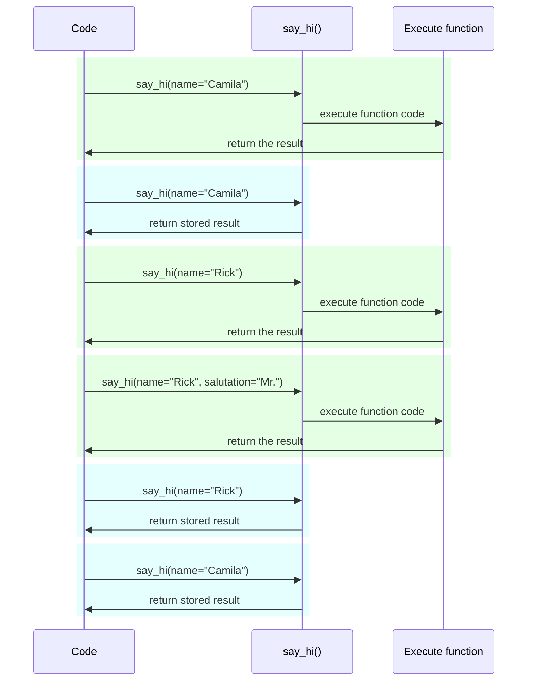

# ⚒ &amp; 🌐 🔢

📚 💼 👆 🈸 💪 💪 🔢 ⚒ ⚖️ 📳, 🖼 ㊙ 🔑, 💽 🎓, 🎓 📧 🐕‍🦺, ♒️.

🏆 👫 ⚒ 🔢 (💪 🔀), 💖 💽 📛. &amp; 📚 💪 🚿, 💖 ㊙.

👉 🤔 ⚫️ ⚠ 🚚 👫 🌐 🔢 👈 ✍ 🈸.

## 🌐 🔢

/// tip

🚥 👆 ⏪ 💭 ⚫️❔ "🌐 🔢" &amp; ❔ ⚙️ 👫, 💭 🆓 🚶 ⏭ 📄 🔛.

///

<a href="https://en.wikipedia.org/wiki/Environment_variable" class="external-link" target="_blank">🌐 🔢</a> (💭 "🇨🇻 {") 🔢 👈 🖖 🏞 🐍 📟, 🏃‍♂ ⚙️, &amp; 💪 ✍ 👆 🐍 📟 (⚖️ 🎏 📋 👍).

👆 💪 ✍ &amp; ⚙️ 🌐 🔢 🐚, 🍵 💆‍♂ 🐍:

//// tab | 💾, 🇸🇻, 🚪 🎉

<div class="termy">

```console
// You could create an env var MY_NAME with
$ export MY_NAME="Wade Wilson"

// Then you could use it with other programs, like
$ echo "Hello $MY_NAME"

Hello Wade Wilson
```

</div>

////

//// tab | 🚪 📋

<div class="termy">

```console
// Create an env var MY_NAME
$ $Env:MY_NAME = "Wade Wilson"

// Use it with other programs, like
$ echo "Hello $Env:MY_NAME"

Hello Wade Wilson
```

</div>

////

### ✍ 🇨🇻 {🐍

👆 💪 ✍ 🌐 🔢 🏞 🐍, 📶 (⚖️ ⏮️ 🙆 🎏 👩‍🔬), &amp; ⤴️ ✍ 👫 🐍.

🖼 👆 💪 ✔️ 📁 `main.py` ⏮️:

```Python hl_lines="3"
import os

name = os.getenv("MY_NAME", "World")
print(f"Hello {name} from Python")
```

/// tip

🥈 ❌ <a href="https://docs.python.org/3.8/library/os.html#os.getenv" class="external-link" target="_blank">`os.getenv()`</a> 🔢 💲 📨.

🚥 🚫 🚚, ⚫️ `None` 🔢, 📥 👥 🚚 `"World"` 🔢 💲 ⚙️.

///

⤴️ 👆 💪 🤙 👈 🐍 📋:

<div class="termy">

```console
// Here we don't set the env var yet
$ python main.py

// As we didn't set the env var, we get the default value

Hello World from Python

// But if we create an environment variable first
$ export MY_NAME="Wade Wilson"

// And then call the program again
$ python main.py

// Now it can read the environment variable

Hello Wade Wilson from Python
```

</div>

🌐 🔢 💪 ⚒ 🏞 📟, ✋️ 💪 ✍ 📟, &amp; 🚫 ✔️ 🏪 (💕 `git`) ⏮️ 🎂 📁, ⚫️ ⚠ ⚙️ 👫 📳 ⚖️ ⚒.

👆 💪 ✍ 🌐 🔢 🕴 🎯 📋 👼, 👈 🕴 💪 👈 📋, &amp; 🕴 🚮 📐.

👈, ✍ ⚫️ ▶️️ ⏭ 📋 ⚫️, 🔛 🎏 ⏸:

<div class="termy">

```console
// Create an env var MY_NAME in line for this program call
$ MY_NAME="Wade Wilson" python main.py

// Now it can read the environment variable

Hello Wade Wilson from Python

// The env var no longer exists afterwards
$ python main.py

Hello World from Python
```

</div>

/// tip

👆 💪 ✍ 🌅 🔃 ⚫️ <a href="https://12factor.net/config" class="external-link" target="_blank">1️⃣2️⃣-⚖ 📱: 📁</a>.

///

### 🆎 &amp; 🔬

👫 🌐 🔢 💪 🕴 🍵 ✍ 🎻, 👫 🔢 🐍 &amp; ✔️ 🔗 ⏮️ 🎏 📋 &amp; 🎂 ⚙️ (&amp; ⏮️ 🎏 🏃‍♂ ⚙️, 💾, 🚪, 🇸🇻).

👈 ⛓ 👈 🙆 💲 ✍ 🐍 ⚪️➡️ 🌐 🔢 🔜 `str`, &amp; 🙆 🛠️ 🎏 🆎 ⚖️ 🔬 ✔️ 🔨 📟.

## Pydantic `Settings`

👐, Pydantic 🚚 👑 🚙 🍵 👫 ⚒ 👟 ⚪️➡️ 🌐 🔢 ⏮️ <a href="https://docs.pydantic.dev/latest/concepts/pydantic_settings/" class="external-link" target="_blank">Pydantic: ⚒ 🧾</a>.

### ✍ `Settings` 🎚

🗄 `BaseSettings` ⚪️➡️ Pydantic &amp; ✍ 🎧-🎓, 📶 🌅 💖 ⏮️ Pydantic 🏷.

🎏 🌌 ⏮️ Pydantic 🏷, 👆 📣 🎓 🔢 ⏮️ 🆎 ✍, &amp; 🎲 🔢 💲.

👆 💪 ⚙️ 🌐 🎏 🔬 ⚒ &amp; 🧰 👆 ⚙️ Pydantic 🏷, 💖 🎏 📊 🆎 &amp; 🌖 🔬 ⏮️ `Field()`.

{* ../../docs_src/settings/tutorial001.py hl[2,5:8,11] *}

/// tip

🚥 👆 💚 🕳 ⏩ 📁 &amp; 📋, 🚫 ⚙️ 👉 🖼, ⚙️ 🏁 1️⃣ 🔛.

///

⤴️, 🕐❔ 👆 ✍ 👐 👈 `Settings` 🎓 (👉 💼, `settings` 🎚), Pydantic 🔜 ✍ 🌐 🔢 💼-😛 🌌,, ↖-💼 🔢 `APP_NAME` 🔜 ✍ 🔢 `app_name`.

⏭ ⚫️ 🔜 🗜 &amp; ✔ 💽. , 🕐❔ 👆 ⚙️ 👈 `settings` 🎚, 👆 🔜 ✔️ 📊 🆎 👆 📣 (✅ `items_per_user` 🔜 `int`).

### ⚙️ `settings`

⤴️ 👆 💪 ⚙️ 🆕 `settings` 🎚 👆 🈸:

{* ../../docs_src/settings/tutorial001.py hl[18:20] *}

### 🏃 💽

⏭, 👆 🔜 🏃 💽 🚶‍♀️ 📳 🌐 🔢, 🖼 👆 💪 ⚒ `ADMIN_EMAIL` &amp; `APP_NAME` ⏮️:

<div class="termy">

```console
$ ADMIN_EMAIL="deadpool@example.com" APP_NAME="ChimichangApp" uvicorn main:app

<span style="color: green;">INFO</span>:     Uvicorn running on http://127.0.0.1:8000 (Press CTRL+C to quit)
```

</div>

/// tip

⚒ 💗 🇨🇻 {👁 📋 🎏 👫 ⏮️ 🚀, &amp; 🚮 👫 🌐 ⏭ 📋.

///

&amp; ⤴️ `admin_email` ⚒ 🔜 ⚒ `"deadpool@example.com"`.

`app_name` 🔜 `"ChimichangApp"`.

&amp; `items_per_user` 🔜 🚧 🚮 🔢 💲 `50`.

## ⚒ ➕1️⃣ 🕹

👆 💪 🚮 👈 ⚒ ➕1️⃣ 🕹 📁 👆 👀 [🦏 🈸 - 💗 📁](../tutorial/bigger-applications.md){.internal-link target=_blank}.

🖼, 👆 💪 ✔️ 📁 `config.py` ⏮️:

{* ../../docs_src/settings/app01/config.py *}

&amp; ⤴️ ⚙️ ⚫️ 📁 `main.py`:

{* ../../docs_src/settings/app01/main.py hl[3,11:13] *}

/// tip

👆 🔜 💪 📁 `__init__.py` 👆 👀 🔛 [🦏 🈸 - 💗 📁](../tutorial/bigger-applications.md){.internal-link target=_blank}.

///

## ⚒ 🔗

🍾 ⚫️ 5️⃣📆 ⚠ 🚚 ⚒ ⚪️➡️ 🔗, ↩️ ✔️ 🌐 🎚 ⏮️ `settings` 👈 ⚙️ 🌐.

👉 💪 ✴️ ⚠ ⏮️ 🔬, ⚫️ 📶 ⏩ 🔐 🔗 ⏮️ 👆 👍 🛃 ⚒.

### 📁 📁

👟 ⚪️➡️ ⏮️ 🖼, 👆 `config.py` 📁 💪 👀 💖:

{* ../../docs_src/settings/app02/config.py hl[10] *}

👀 👈 🔜 👥 🚫 ✍ 🔢 👐 `settings = Settings()`.

### 👑 📱 📁

🔜 👥 ✍ 🔗 👈 📨 🆕 `config.Settings()`.

{* ../../docs_src/settings/app02/main.py hl[5,11:12] *}

/// tip

👥 🔜 🔬 `@lru_cache` 🍖.

🔜 👆 💪 🤔 `get_settings()` 😐 🔢.

///

&amp; ⤴️ 👥 💪 🚚 ⚫️ ⚪️➡️ *➡ 🛠️ 🔢* 🔗 &amp; ⚙️ ⚫️ 🙆 👥 💪 ⚫️.

{* ../../docs_src/settings/app02/main.py hl[16,18:20] *}

### ⚒ &amp; 🔬

⤴️ ⚫️ 🔜 📶 ⏩ 🚚 🎏 ⚒ 🎚 ⏮️ 🔬 🏗 🔗 🔐 `get_settings`:

{* ../../docs_src/settings/app02/test_main.py hl[9:10,13,21] *}

🔗 🔐 👥 ⚒ 🆕 💲 `admin_email` 🕐❔ 🏗 🆕 `Settings` 🎚, &amp; ⤴️ 👥 📨 👈 🆕 🎚.

⤴️ 👥 💪 💯 👈 ⚫️ ⚙️.

## 👂 `.env` 📁

🚥 👆 ✔️ 📚 ⚒ 👈 🎲 🔀 📚, 🎲 🎏 🌐, ⚫️ 5️⃣📆 ⚠ 🚮 👫 🔛 📁 &amp; ⤴️ ✍ 👫 ⚪️➡️ ⚫️ 🚥 👫 🌐 🔢.

👉 💡 ⚠ 🥃 👈 ⚫️ ✔️ 📛, 👫 🌐 🔢 🛎 🥉 📁 `.env`, &amp; 📁 🤙 "🇨🇻".

/// tip

📁 ▶️ ⏮️ ❣ (`.`) 🕵‍♂ 📁 🖥-💖 ⚙️, 💖 💾 &amp; 🇸🇻.

✋️ 🇨🇻 📁 🚫 🤙 ✔️ ✔️ 👈 ☑ 📁.

///

Pydantic ✔️ 🐕‍🦺 👂 ⚪️➡️ 👉 🆎 📁 ⚙️ 🔢 🗃. 👆 💪 ✍ 🌖 <a href="https://docs.pydantic.dev/latest/concepts/pydantic_settings/#dotenv-env-support" class="external-link" target="_blank">Pydantic ⚒: 🇨🇻 (.🇨🇻) 🐕‍🦺</a>.

/// tip

👉 👷, 👆 💪 `pip install python-dotenv`.

///

###  `.env` 📁

👆 💪 ✔️ `.env` 📁 ⏮️:

```bash
ADMIN_EMAIL="deadpool@example.com"
APP_NAME="ChimichangApp"
```

### ✍ ⚒ ⚪️➡️ `.env`

&amp; ⤴️ ℹ 👆 `config.py` ⏮️:

{* ../../docs_src/settings/app03/config.py hl[9:10] *}

📥 👥 ✍ 🎓 `Config` 🔘 👆 Pydantic `Settings` 🎓, &amp; ⚒ `env_file` 📁 ⏮️ 🇨🇻 📁 👥 💚 ⚙️.

/// tip

`Config` 🎓 ⚙️ Pydantic 📳. 👆 💪 ✍ 🌖 <a href="https://docs.pydantic.dev/latest/api/config/" class="external-link" target="_blank">Pydantic 🏷 📁</a>

///

### 🏗 `Settings` 🕴 🕐 ⏮️ `lru_cache`

👂 📁 ⚪️➡️ 💾 🛎 ⚠ (🐌) 🛠️, 👆 🎲 💚 ⚫️ 🕴 🕐 &amp; ⤴️ 🏤-⚙️ 🎏 ⚒ 🎚, ↩️ 👂 ⚫️ 🔠 📨.

✋️ 🔠 🕰 👥:

```Python
Settings()
```

🆕 `Settings` 🎚 🔜 ✍, &amp; 🏗 ⚫️ 🔜 ✍ `.env` 📁 🔄.

🚥 🔗 🔢 💖:

```Python
def get_settings():
    return Settings()
```

👥 🔜 ✍ 👈 🎚 🔠 📨, &amp; 👥 🔜 👂 `.env` 📁 🔠 📨. 👶 👶

✋️ 👥 ⚙️ `@lru_cache` 👨‍🎨 🔛 🔝, `Settings` 🎚 🔜 ✍ 🕴 🕐, 🥇 🕰 ⚫️ 🤙. 👶 👶

{* ../../docs_src/settings/app03/main.py hl[1,10] *}

⤴️ 🙆 🏁 🤙 `get_settings()` 🔗 ⏭ 📨, ↩️ 🛠️ 🔗 📟 `get_settings()` &amp; 🏗 🆕 `Settings` 🎚, ⚫️ 🔜 📨 🎏 🎚 👈 📨 🔛 🥇 🤙, 🔄 &amp; 🔄.

#### `lru_cache` 📡 ℹ

`@lru_cache` 🔀 🔢 ⚫️ 🎀 📨 🎏 💲 👈 📨 🥇 🕰, ↩️ 💻 ⚫️ 🔄, 🛠️ 📟 🔢 🔠 🕰.

, 🔢 🔛 ⚫️ 🔜 🛠️ 🕐 🔠 🌀 ❌. &amp; ⤴️ 💲 📨 🔠 👈 🌀 ❌ 🔜 ⚙️ 🔄 &amp; 🔄 🕐❔ 🔢 🤙 ⏮️ ⚫️❔ 🎏 🌀 ❌.

🖼, 🚥 👆 ✔️ 🔢:

```Python
@lru_cache
def say_hi(name: str, salutation: str = "Ms."):
    return f"Hello {salutation} {name}"
```

👆 📋 💪 🛠️ 💖 👉:



💼 👆 🔗 `get_settings()`, 🔢 🚫 ✊ 🙆 ❌, ⚫️ 🕧 📨 🎏 💲.

👈 🌌, ⚫️ 🎭 🌖 🚥 ⚫️ 🌐 🔢. ✋️ ⚫️ ⚙️ 🔗 🔢, ⤴️ 👥 💪 🔐 ⚫️ 💪 🔬.

`@lru_cache` 🍕 `functools` ❔ 🍕 🐍 🐩 🗃, 👆 💪 ✍ 🌅 🔃 ⚫️ <a href="https://docs.python.org/3/library/functools.html#functools.lru_cache" class="external-link" target="_blank">🐍 🩺 `@lru_cache`</a>.

## 🌃

👆 💪 ⚙️ Pydantic ⚒ 🍵 ⚒ ⚖️ 📳 👆 🈸, ⏮️ 🌐 🏋️ Pydantic 🏷.

* ⚙️ 🔗 👆 💪 📉 🔬.
* 👆 💪 ⚙️ `.env` 📁 ⏮️ ⚫️.
* ⚙️ `@lru_cache` ➡️ 👆 ❎ 👂 🇨🇻 📁 🔄 &amp; 🔄 🔠 📨, ⏪ 🤝 👆 🔐 ⚫️ ⏮️ 🔬.
