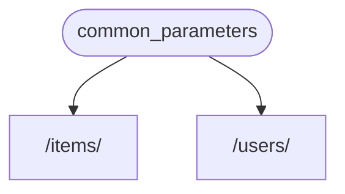
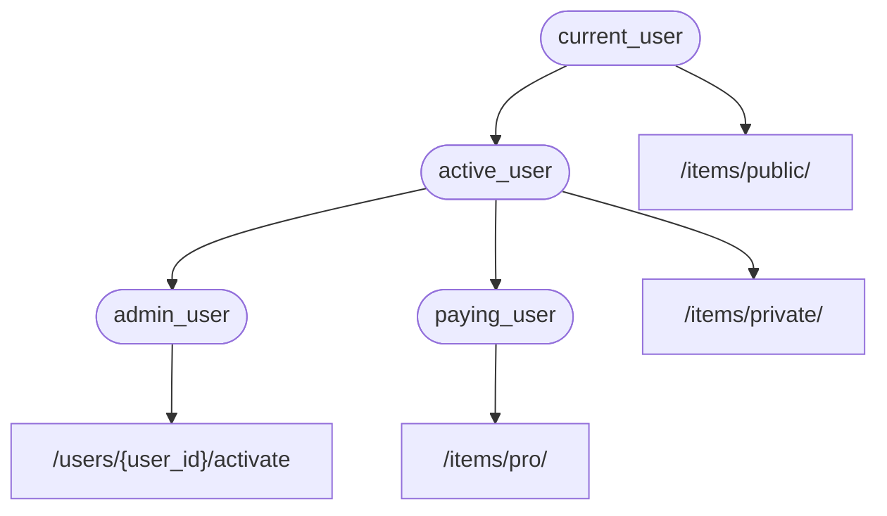

# 🔗

**FastAPI** ✔️ 📶 🏋️ ✋️ 🏋️ **<abbr title="also known as components, resources, providers, services, injectables">🔗 💉</abbr>** ⚙️.

⚫️ 🏗 📶 🙅 ⚙️, &amp; ⚒ ⚫️ 📶 ⏩ 🙆 👩‍💻 🛠️ 🎏 🦲 ⏮️ **FastAPI**.

## ⚫️❔ "🔗 💉"

**"🔗 💉"** ⛓, 📋, 👈 📤 🌌 👆 📟 (👉 💼, 👆 *➡ 🛠️ 🔢*) 📣 👜 👈 ⚫️ 🚚 👷 &amp; ⚙️: "🔗".

&amp; ⤴️, 👈 ⚙️ (👉 💼 **FastAPI**) 🔜 ✊ 💅 🔨 ⚫️❔ 💪 🚚 👆 📟 ⏮️ 📚 💪 🔗 ("💉" 🔗).

👉 📶 ⚠ 🕐❔ 👆 💪:

* ✔️ 💰 ⚛ (🎏 📟 ⚛ 🔄 &amp; 🔄).
* 💰 💽 🔗.
* 🛠️ 💂‍♂, 🤝, 🔑 📄, ♒️.
*  &amp; 📚 🎏 👜...

🌐 👫, ⏪ 📉 📟 🔁.

## 🥇 🔁

➡️ 👀 📶 🙅 🖼. ⚫️ 🔜 🙅 👈 ⚫️ 🚫 📶 ⚠, 🔜.

✋️ 👉 🌌 👥 💪 🎯 🔛 ❔ **🔗 💉** ⚙️ 👷.

### ✍ 🔗, ⚖️ "☑"

➡️ 🥇 🎯 🔛 🔗.

⚫️ 🔢 👈 💪 ✊ 🌐 🎏 🔢 👈 *➡ 🛠️ 🔢* 💪 ✊:

{* ../../docs_src/dependencies/tutorial001.py hl[8:11] *}

👈 ⚫️.

**2️⃣ ⏸**.

&amp; ⚫️ ✔️ 🎏 💠 &amp; 📊 👈 🌐 👆 *➡ 🛠️ 🔢* ✔️.

👆 💪 💭 ⚫️ *➡ 🛠️ 🔢* 🍵 "👨‍🎨" (🍵 `@app.get("/some-path")`).

&amp; ⚫️ 💪 📨 🕳 👆 💚.

👉 💼, 👉 🔗 ⌛:

* 📦 🔢 🔢 `q` 👈 `str`.
* 📦 🔢 🔢 `skip` 👈 `int`, &amp; 🔢 `0`.
* 📦 🔢 🔢 `limit` 👈 `int`, &amp; 🔢 `100`.

&amp; ⤴️ ⚫️ 📨 `dict` ⚗ 📚 💲.

### 🗄 `Depends`

{* ../../docs_src/dependencies/tutorial001.py hl[3] *}

### 📣 🔗, "⚓️"

🎏 🌌 👆 ⚙️ `Body`, `Query`, ♒️. ⏮️ 👆 *➡ 🛠️ 🔢* 🔢, ⚙️ `Depends` ⏮️ 🆕 🔢:

{* ../../docs_src/dependencies/tutorial001.py hl[15,20] *}

👐 👆 ⚙️ `Depends` 🔢 👆 🔢 🎏 🌌 👆 ⚙️ `Body`, `Query`, ♒️, `Depends` 👷 👄 🎏.

👆 🕴 🤝 `Depends` 👁 🔢.

👉 🔢 🔜 🕳 💖 🔢.

&amp; 👈 🔢 ✊ 🔢 🎏 🌌 👈 *➡ 🛠️ 🔢* .

/// tip

👆 🔜 👀 ⚫️❔ 🎏 "👜", ↖️ ⚪️➡️ 🔢, 💪 ⚙️ 🔗 ⏭ 📃.

///

🕐❔ 🆕 📨 🛬, **FastAPI** 🔜 ✊ 💅:

* 🤙 👆 🔗 ("☑") 🔢 ⏮️ ☑ 🔢.
* 🤚 🏁 ⚪️➡️ 👆 🔢.
* 🛠️ 👈 🏁 🔢 👆 *➡ 🛠️ 🔢*.

👉 🌌 👆 ✍ 🔗 📟 🕐 &amp; **FastAPI** ✊ 💅 🤙 ⚫️ 👆 *➡ 🛠️*.

/// check

👀 👈 👆 🚫 ✔️ ✍ 🎁 🎓 &amp; 🚶‍♀️ ⚫️ 👱 **FastAPI** "®" ⚫️ ⚖️ 🕳 🎏.

👆 🚶‍♀️ ⚫️ `Depends` &amp; **FastAPI** 💭 ❔ 🎂.

///

##  `async` ⚖️ 🚫 `async`

🔗 🔜 🤙 **FastAPI** (🎏 👆 *➡ 🛠️ 🔢*), 🎏 🚫 ✔ ⏪ 🔬 👆 🔢.

👆 💪 ⚙️ `async def` ⚖️ 😐 `def`.

&amp; 👆 💪 📣 🔗 ⏮️ `async def` 🔘 😐 `def` *➡ 🛠️ 🔢*, ⚖️ `def` 🔗 🔘 `async def` *➡ 🛠️ 🔢*, ♒️.

⚫️ 🚫 🤔. **FastAPI** 🔜 💭 ⚫️❔.

/// note

🚥 👆 🚫 💭, ✅ [🔁: *"🏃 ❓" *](../../async.md){.internal-link target=_blank} 📄 🔃 `async` &amp; `await` 🩺.

///

## 🛠️ ⏮️ 🗄

🌐 📨 📄, 🔬 &amp; 📄 👆 🔗 (&amp; 🎧-🔗) 🔜 🛠️ 🎏 🗄 🔗.

, 🎓 🩺 🔜 ✔️ 🌐 ℹ ⚪️➡️ 👫 🔗 💁‍♂️:

## 🙅 ⚙️

🚥 👆 👀 ⚫️, *➡ 🛠️ 🔢* 📣 ⚙️ 🕐❔ *➡* &amp; *🛠️* 🏏, &amp; ⤴️ **FastAPI** ✊ 💅 🤙 🔢 ⏮️ ☑ 🔢, ❎ 📊 ⚪️➡️ 📨.

🤙, 🌐 (⚖️ 🏆) 🕸 🛠️ 👷 👉 🎏 🌌.

👆 🙅 🤙 👈 🔢 🔗. 👫 🤙 👆 🛠️ (👉 💼, **FastAPI**).

⏮️ 🔗 💉 ⚙️, 👆 💪 💬 **FastAPI** 👈 👆 *➡ 🛠️ 🔢* "🪀" 🔛 🕳 🙆 👈 🔜 🛠️ ⏭ 👆 *➡ 🛠️ 🔢*, &amp; **FastAPI** 🔜 ✊ 💅 🛠️ ⚫️ &amp; "💉" 🏁.

🎏 ⚠ ⚖ 👉 🎏 💭 "🔗 💉":

* ℹ
* 🐕‍🦺
* 🐕‍🦺
* 💉
* 🦲

## **FastAPI** 🔌-🔌

🛠️ &amp; "🔌-"Ⓜ 💪 🏗 ⚙️ **🔗 💉** ⚙️. ✋️ 👐, 📤 🤙 **🙅‍♂ 💪 ✍ "🔌-🔌"**, ⚙️ 🔗 ⚫️ 💪 📣 ♾ 🔢 🛠️ &amp; 🔗 👈 ▶️️ 💪 👆 *➡ 🛠️ 🔢*.

&amp; 🔗 💪 ✍ 📶 🙅 &amp; 🏋️ 🌌 👈 ✔ 👆 🗄 🐍 📦 👆 💪, &amp; 🛠️ 👫 ⏮️ 👆 🛠️ 🔢 👩‍❤‍👨 ⏸ 📟, *🌖*.

👆 🔜 👀 🖼 👉 ⏭ 📃, 🔃 🔗 &amp; ☁ 💽, 💂‍♂, ♒️.

## **FastAPI** 🔗

🦁 🔗 💉 ⚙️ ⚒ **FastAPI** 🔗 ⏮️:

* 🌐 🔗 💽
* ☁ 💽
* 🔢 📦
* 🔢 🔗
* 🤝 &amp; ✔ ⚙️
* 🛠️ ⚙️ ⚖ ⚙️
* 📨 💽 💉 ⚙️
* ♒️.

## 🙅 &amp; 🏋️

👐 🔗 🔗 💉 ⚙️ 📶 🙅 🔬 &amp; ⚙️, ⚫️ 📶 🏋️.

👆 💪 🔬 🔗 👈 🔄 💪 🔬 🔗 👫.

🔚, 🔗 🌲 🔗 🏗, &amp; **🔗 💉** ⚙️ ✊ 💅 🔬 🌐 👉 🔗 👆 (&amp; 👫 🎧-🔗) &amp; 🚚 (💉) 🏁 🔠 🔁.

🖼, ➡️ 💬 👆 ✔️ 4️⃣ 🛠️ 🔗 (*➡ 🛠️*):

* `/items/public/`
* `/items/private/`
* `/users/{user_id}/activate`
* `/items/pro/`

⤴️ 👆 💪 🚮 🎏 ✔ 📄 🔠 👫 ⏮️ 🔗 &amp; 🎧-🔗:

## 🛠️ ⏮️ **🗄**

🌐 👫 🔗, ⏪ 📣 👫 📄, 🚮 🔢, 🔬, ♒️. 👆 *➡ 🛠️*.

**FastAPI** 🔜 ✊ 💅 🚮 ⚫️ 🌐 🗄 🔗, 👈 ⚫️ 🎦 🎓 🧾 ⚙️.
