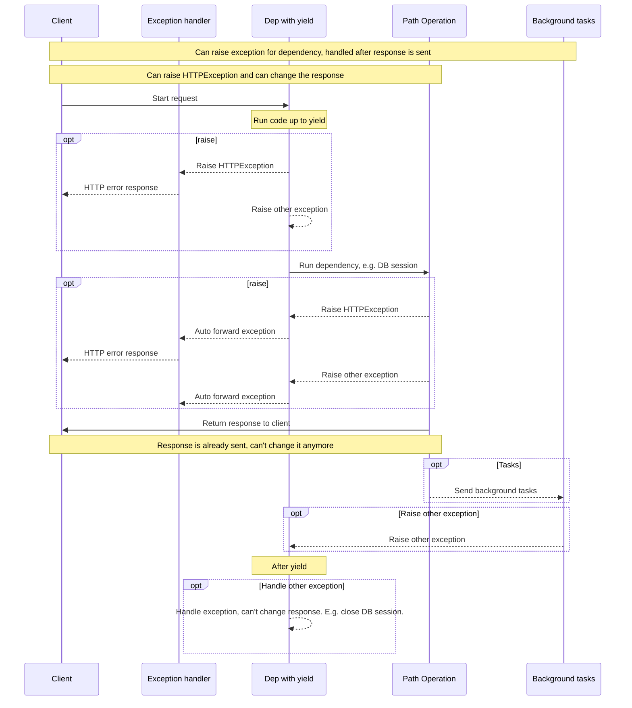

# 🔗 ⏮️ 🌾

FastAPI 🐕‍🦺 🔗 👈 <abbr title='sometimes also called "exit", "cleanup", "teardown", "close", "context managers", ...'>➕ 🔁 ⏮️ 🏁</abbr>.

👉, ⚙️ `yield` ↩️ `return`, &amp; ✍ ➕ 🔁 ⏮️.

!!! tip
    ⚒ 💭 ⚙️ `yield` 1️⃣ 👁 🕰.

!!! note "📡 ℹ"
    🙆 🔢 👈 ☑ ⚙️ ⏮️:

    * <a href="https://docs.python.org/3/library/contextlib.html#contextlib.contextmanager" class="external-link" target="_blank">`@contextlib.contextmanager`</a> ⚖️
    * <a href="https://docs.python.org/3/library/contextlib.html#contextlib.asynccontextmanager" class="external-link" target="_blank">`@contextlib.asynccontextmanager`</a>

    🔜 ☑ ⚙️ **FastAPI** 🔗.

    👐, FastAPI ⚙️ 📚 2️⃣ 👨‍🎨 🔘.

## 💽 🔗 ⏮️ `yield`

🖼, 👆 💪 ⚙️ 👉 ✍ 💽 🎉 &amp; 🔐 ⚫️ ⏮️ 🏁.

🕴 📟 ⏭ &amp; 🔌 `yield` 📄 🛠️ ⏭ 📨 📨:

```Python hl_lines="2-4"
{!../../../docs_src/dependencies/tutorial007.py!}
```

🌾 💲 ⚫️❔ 💉 🔘 *➡ 🛠️* &amp; 🎏 🔗:

```Python hl_lines="4"
{!../../../docs_src/dependencies/tutorial007.py!}
```

📟 📄 `yield` 📄 🛠️ ⏮️ 📨 ✔️ 🚚:

```Python hl_lines="5-6"
{!../../../docs_src/dependencies/tutorial007.py!}
```

!!! tip
    👆 💪 ⚙️ `async` ⚖️ 😐 🔢.

    **FastAPI** 🔜 ▶️️ 👜 ⏮️ 🔠, 🎏 ⏮️ 😐 🔗.

## 🔗 ⏮️ `yield` &amp; `try`

🚥 👆 ⚙️ `try` 🍫 🔗 ⏮️ `yield`, 👆 🔜 📨 🙆 ⚠ 👈 🚮 🕐❔ ⚙️ 🔗.

🖼, 🚥 📟 ☝ 🖕, ➕1️⃣ 🔗 ⚖️ *➡ 🛠️*, ⚒ 💽 💵 "💾" ⚖️ ✍ 🙆 🎏 ❌, 👆 🔜 📨 ⚠ 👆 🔗.

, 👆 💪 👀 👈 🎯 ⚠ 🔘 🔗 ⏮️ `except SomeException`.

🎏 🌌, 👆 💪 ⚙️ `finally` ⚒ 💭 🚪 📶 🛠️, 🙅‍♂ 🤔 🚥 📤 ⚠ ⚖️ 🚫.

```Python hl_lines="3  5"
{!../../../docs_src/dependencies/tutorial007.py!}
```

## 🎧-🔗 ⏮️ `yield`

👆 💪 ✔️ 🎧-🔗 &amp; "🌲" 🎧-🔗 🙆 📐 &amp; 💠, &amp; 🙆 ⚖️ 🌐 👫 💪 ⚙️ `yield`.

**FastAPI** 🔜 ⚒ 💭 👈 "🚪 📟" 🔠 🔗 ⏮️ `yield` 🏃 ☑ ✔.

🖼, `dependency_c` 💪 ✔️ 🔗 🔛 `dependency_b`, &amp; `dependency_b` 🔛 `dependency_a`:

```Python hl_lines="4  12  20"
{!../../../docs_src/dependencies/tutorial008.py!}
```

&amp; 🌐 👫 💪 ⚙️ `yield`.

👉 💼 `dependency_c`, 🛠️ 🚮 🚪 📟, 💪 💲 ⚪️➡️ `dependency_b` (📥 📛 `dep_b`) 💪.

&amp; , 🔄, `dependency_b` 💪 💲 ⚪️➡️ `dependency_a` (📥 📛 `dep_a`) 💪 🚮 🚪 📟.

```Python hl_lines="16-17  24-25"
{!../../../docs_src/dependencies/tutorial008.py!}
```

🎏 🌌, 👆 💪 ✔️ 🔗 ⏮️ `yield` &amp; `return` 🌀.

&amp; 👆 💪 ✔️ 👁 🔗 👈 🚚 📚 🎏 🔗 ⏮️ `yield`, ♒️.

👆 💪 ✔️ 🙆 🌀 🔗 👈 👆 💚.

**FastAPI** 🔜 ⚒ 💭 🌐 🏃 ☑ ✔.

!!! note "📡 ℹ"
    👉 👷 👏 🐍 <a href="https://docs.python.org/3/library/contextlib.html" class="external-link" target="_blank">🔑 👨‍💼</a>.

    **FastAPI** ⚙️ 👫 🔘 🏆 👉.

## 🔗 ⏮️ `yield` &amp; `HTTPException`

👆 👀 👈 👆 💪 ⚙️ 🔗 ⏮️ `yield` &amp; ✔️ `try` 🍫 👈 ✊ ⚠.

⚫️ 5️⃣📆 😋 🤚 `HTTPException` ⚖️ 🎏 🚪 📟, ⏮️ `yield`. ✋️ **⚫️ 🏆 🚫 👷**.

🚪 📟 🔗 ⏮️ `yield` 🛠️ *⏮️* 📨 📨, [⚠ 🐕‍🦺](../handling-errors.md#install-custom-exception-handlers){.internal-link target=_blank} 🔜 ✔️ ⏪ 🏃. 📤 🕳 😽 ⚠ 🚮 👆 🔗 🚪 📟 (⏮️ `yield`).

, 🚥 👆 🤚 `HTTPException` ⏮️ `yield`, 🔢 (⚖️ 🙆 🛃) ⚠ 🐕‍🦺 👈 ✊ `HTTPException`Ⓜ &amp; 📨 🇺🇸🔍 4️⃣0️⃣0️⃣ 📨 🏆 🚫 📤 ✊ 👈 ⚠ 🚫🔜.

👉 ⚫️❔ ✔ 🕳 ⚒ 🔗 (✅ 💽 🎉), 🖼, ⚙️ 🖥 📋.

🖥 📋 🏃 *⏮️* 📨 ✔️ 📨. 📤 🙅‍♂ 🌌 🤚 `HTTPException` ↩️ 📤 🚫 🌌 🔀 📨 👈 *⏪ 📨*.

✋️ 🚥 🖥 📋 ✍ 💽 ❌, 🌘 👆 💪 💾 ⚖️ 😬 🔐 🎉 🔗 ⏮️ `yield`, &amp; 🎲 🕹 ❌ ⚖️ 📄 ⚫️ 🛰 🕵 ⚙️.

🚥 👆 ✔️ 📟 👈 👆 💭 💪 🤚 ⚠, 🏆 😐/"🙃" 👜 &amp; 🚮 `try` 🍫 👈 📄 📟.

🚥 👆 ✔️ 🛃 ⚠ 👈 👆 🔜 💖 🍵 *⏭* 🛬 📨 &amp; 🎲 ❎ 📨, 🎲 🙋‍♀ `HTTPException`, ✍ [🛃 ⚠ 🐕‍🦺](../handling-errors.md#install-custom-exception-handlers){.internal-link target=_blank}.

!!! tip
    👆 💪 🤚 ⚠ 🔌 `HTTPException` *⏭* `yield`. ✋️ 🚫 ⏮️.

🔁 🛠️ 🌅 ⚖️ 🌘 💖 👉 📊. 🕰 💧 ⚪️➡️ 🔝 🔝. &amp; 🔠 🏓 1️⃣ 🍕 🔗 ⚖️ 🛠️ 📟.



!!! info
    🕴 **1️⃣ 📨** 🔜 📨 👩‍💻. ⚫️ 💪 1️⃣ ❌ 📨 ⚖️ ⚫️ 🔜 📨 ⚪️➡️ *➡ 🛠️*.

    ⏮️ 1️⃣ 📚 📨 📨, 🙅‍♂ 🎏 📨 💪 📨.

!!! tip
    👉 📊 🎦 `HTTPException`, ✋️ 👆 💪 🤚 🙆 🎏 ⚠ ❔ 👆 ✍ [🛃 ⚠ 🐕‍🦺](../handling-errors.md#install-custom-exception-handlers){.internal-link target=_blank}.

    🚥 👆 🤚 🙆 ⚠, ⚫️ 🔜 🚶‍♀️ 🔗 ⏮️ 🌾, 🔌 `HTTPException`, &amp; ⤴️ **🔄** ⚠ 🐕‍🦺. 🚥 📤 🙅‍♂ ⚠ 🐕‍🦺 👈 ⚠, ⚫️ 🔜 ⤴️ 🍵 🔢 🔗 `ServerErrorMiddleware`, 🛬 5️⃣0️⃣0️⃣ 🇺🇸🔍 👔 📟, ➡️ 👩‍💻 💭 👈 📤 ❌ 💽.

## 🔑 👨‍💼

### ⚫️❔ "🔑 👨‍💼"

"🔑 👨‍💼" 🙆 👈 🐍 🎚 👈 👆 💪 ⚙️ `with` 📄.

🖼, <a href="https://docs.python.org/3/tutorial/inputoutput.html#reading-and-writing-files" class="external-link" target="_blank">👆 💪 ⚙️ `with` ✍ 📁</a>:

```Python
with open("./somefile.txt") as f:
    contents = f.read()
    print(contents)
```

🔘, `open("./somefile.txt")` ✍ 🎚 👈 🤙 "🔑 👨‍💼".

🕐❔ `with` 🍫 🏁, ⚫️ ⚒ 💭 🔐 📁, 🚥 📤 ⚠.

🕐❔ 👆 ✍ 🔗 ⏮️ `yield`, **FastAPI** 🔜 🔘 🗜 ⚫️ 🔑 👨‍💼, &amp; 🌀 ⚫️ ⏮️ 🎏 🔗 🧰.

### ⚙️ 🔑 👨‍💼 🔗 ⏮️ `yield`

!!! warning
    👉, 🌅 ⚖️ 🌘, "🏧" 💭.

    🚥 👆 ▶️ ⏮️ **FastAPI** 👆 💪 💚 🚶 ⚫️ 🔜.

🐍, 👆 💪 ✍ 🔑 👨‍💼 <a href="https://docs.python.org/3/reference/datamodel.html#context-managers" class="external-link" target="_blank">🏗 🎓 ⏮️ 2️⃣ 👩‍🔬: `__enter__()` &amp; `__exit__()`</a>.

👆 💪 ⚙️ 👫 🔘 **FastAPI** 🔗 ⏮️ `yield` ⚙️
`with` ⚖️ `async with` 📄 🔘 🔗 🔢:

```Python hl_lines="1-9  13"
{!../../../docs_src/dependencies/tutorial010.py!}
```

!!! tip
    ➕1️⃣ 🌌 ✍ 🔑 👨‍💼 ⏮️:

    * <a href="https://docs.python.org/3/library/contextlib.html#contextlib.contextmanager" class="external-link" target="_blank">`@contextlib.contextmanager`</a> ⚖️
    * <a href="https://docs.python.org/3/library/contextlib.html#contextlib.asynccontextmanager" class="external-link" target="_blank">`@contextlib.asynccontextmanager`</a>

    ⚙️ 👫 🎀 🔢 ⏮️ 👁 `yield`.

    👈 ⚫️❔ **FastAPI** ⚙️ 🔘 🔗 ⏮️ `yield`.

    ✋️ 👆 🚫 ✔️ ⚙️ 👨‍🎨 FastAPI 🔗 (&amp; 👆 🚫🔜 🚫).

    FastAPI 🔜 ⚫️ 👆 🔘.
