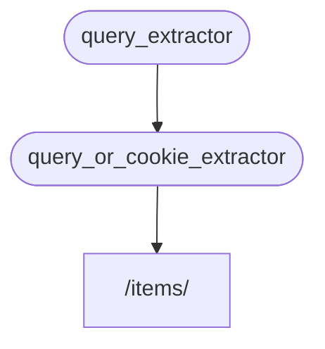

# 🎧-🔗

👆 💪 ✍ 🔗 👈 ✔️ **🎧-🔗**.

👫 💪 **⏬** 👆 💪 👫.

**FastAPI** 🔜 ✊ 💅 🔬 👫.

## 🥇 🔗 "☑"

👆 💪 ✍ 🥇 🔗 ("☑") 💖:

=== "🐍 3️⃣.6️⃣ &amp; 🔛"

    ```Python hl_lines="8-9"
    {!> ../../../docs_src/dependencies/tutorial005.py!}
    ```

=== "🐍 3️⃣.1️⃣0️⃣ &amp; 🔛"

    ```Python hl_lines="6-7"
    {!> ../../../docs_src/dependencies/tutorial005_py310.py!}
    ```

⚫️ 📣 📦 🔢 🔢 `q` `str`, &amp; ⤴️ ⚫️ 📨 ⚫️.

👉 🙅 (🚫 📶 ⚠), ✋️ 🔜 ℹ 👥 🎯 🔛 ❔ 🎧-🔗 👷.

## 🥈 🔗, "☑" &amp; "⚓️"

⤴️ 👆 💪 ✍ ➕1️⃣ 🔗 🔢 ("☑") 👈 🎏 🕰 📣 🔗 🚮 👍 (⚫️ "⚓️" 💁‍♂️):

=== "🐍 3️⃣.6️⃣ &amp; 🔛"

    ```Python hl_lines="13"
    {!> ../../../docs_src/dependencies/tutorial005.py!}
    ```

=== "🐍 3️⃣.1️⃣0️⃣ &amp; 🔛"

    ```Python hl_lines="11"
    {!> ../../../docs_src/dependencies/tutorial005_py310.py!}
    ```

➡️ 🎯 🔛 🔢 📣:

* ✋️ 👉 🔢 🔗 ("☑") ⚫️, ⚫️ 📣 ➕1️⃣ 🔗 (⚫️ "🪀" 🔛 🕳 🙆).
    * ⚫️ 🪀 🔛 `query_extractor`, &amp; 🛠️ 💲 📨 ⚫️ 🔢 `q`.
* ⚫️ 📣 📦 `last_query` 🍪, `str`.
    * 🚥 👩‍💻 🚫 🚚 🙆 🔢 `q`, 👥 ⚙️ 🏁 🔢 ⚙️, ❔ 👥 🖊 🍪 ⏭.

## ⚙️ 🔗

⤴️ 👥 💪 ⚙️ 🔗 ⏮️:

=== "🐍 3️⃣.6️⃣ &amp; 🔛"

    ```Python hl_lines="22"
    {!> ../../../docs_src/dependencies/tutorial005.py!}
    ```

=== "🐍 3️⃣.1️⃣0️⃣ &amp; 🔛"

    ```Python hl_lines="19"
    {!> ../../../docs_src/dependencies/tutorial005_py310.py!}
    ```

!!! info
    👀 👈 👥 🕴 📣 1️⃣ 🔗 *➡ 🛠️ 🔢*, `query_or_cookie_extractor`.

    ✋️ **FastAPI** 🔜 💭 👈 ⚫️ ✔️ ❎ `query_extractor` 🥇, 🚶‍♀️ 🏁 👈 `query_or_cookie_extractor` ⏪ 🤙 ⚫️.



## ⚙️ 🎏 🔗 💗 🕰

🚥 1️⃣ 👆 🔗 📣 💗 🕰 🎏 *➡ 🛠️*, 🖼, 💗 🔗 ✔️ ⚠ 🎧-🔗, **FastAPI** 🔜 💭 🤙 👈 🎧-🔗 🕴 🕐 📍 📨.

&amp; ⚫️ 🔜 🖊 📨 💲 <abbr title="A utility/system to store computed/generated values, to re-use them instead of computing them again.">"💾"</abbr> &amp; 🚶‍♀️ ⚫️ 🌐 "⚓️" 👈 💪 ⚫️ 👈 🎯 📨, ↩️ 🤙 🔗 💗 🕰 🎏 📨.

🏧 😐 🌐❔ 👆 💭 👆 💪 🔗 🤙 🔠 🔁 (🎲 💗 🕰) 🎏 📨 ↩️ ⚙️ "💾" 💲, 👆 💪 ⚒ 🔢 `use_cache=False` 🕐❔ ⚙️ `Depends`:

```Python hl_lines="1"
async def needy_dependency(fresh_value: str = Depends(get_value, use_cache=False)):
    return {"fresh_value": fresh_value}
```

## 🌃

↖️ ⚪️➡️ 🌐 🎀 🔤 ⚙️ 📥, **🔗 💉** ⚙️ 🙅.

🔢 👈 👀 🎏 *➡ 🛠️ 🔢*.

✋️, ⚫️ 📶 🏋️, &amp; ✔ 👆 📣 🎲 🙇 🐦 🔗 "📊" (🌲).

!!! tip
    🌐 👉 💪 🚫 😑 ⚠ ⏮️ 👫 🙅 🖼.

    ✋️ 👆 🔜 👀 ❔ ⚠ ⚫️ 📃 🔃 **💂‍♂**.

     &amp; 👆 🔜 👀 💸 📟 ⚫️ 🔜 🖊 👆.
