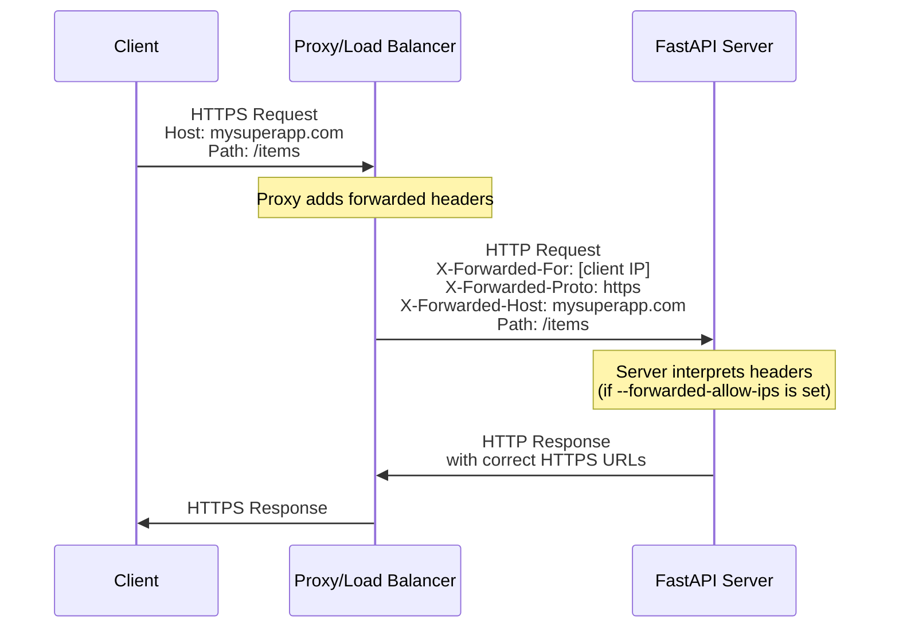
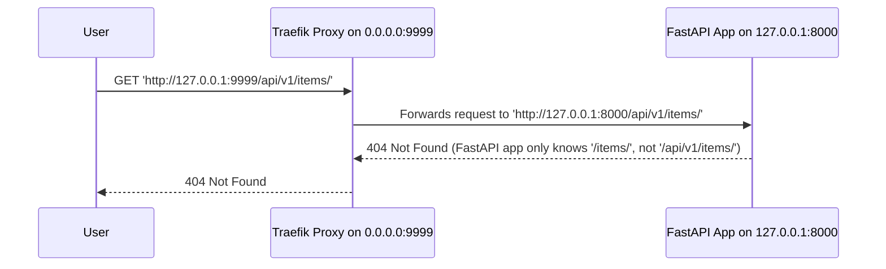
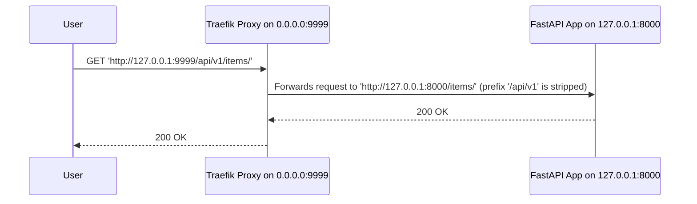
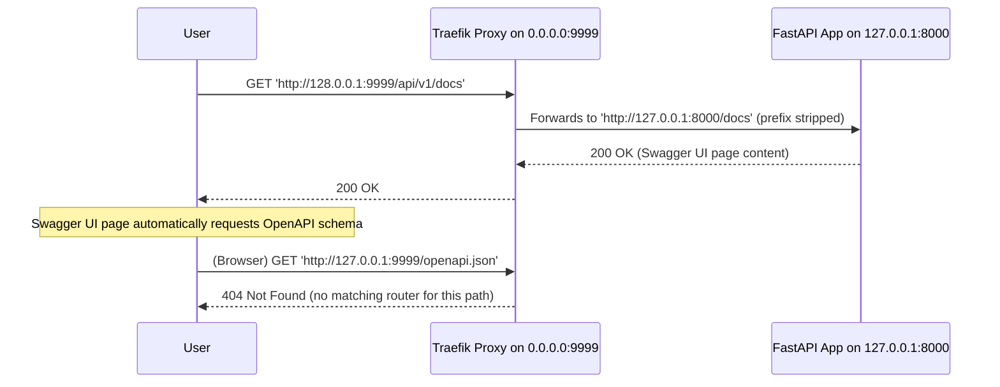

# Behind a Proxy { #behind-a-proxy }

In many situations, you would use a **proxy** like Traefik or Nginx in front of your FastAPI app.

These proxies could handle HTTPS certificates and other things.

## Proxy Forwarded Headers { #proxy-forwarded-headers }

A **proxy** in front of your application would normally set some headers on the fly before sending the requests to your **server** to let the server know that the request was **forwarded** by the proxy, letting it know the original (public) URL, including the domain, that it is using HTTPS, etc.

The **server** program (for example **Uvicorn** via **FastAPI CLI**) is capable of interpreting these headers, and then passing that information to your application.

But for security, as the server doesn't know it is behind a trusted proxy, it won't interpret those headers.

/// note | Technical Details

The proxy headers are:

* <a href="https://developer.mozilla.org/en-US/docs/Web/HTTP/Reference/Headers/X-Forwarded-For" class="external-link" target="_blank">X-Forwarded-For</a>
* <a href="https://developer.mozilla.org/en-US/docs/Web/HTTP/Reference/Headers/X-Forwarded-Proto" class="external-link" target="_blank">X-Forwarded-Proto</a>
* <a href="https://developer.mozilla.org/en-US/docs/Web/HTTP/Reference/Headers/X-Forwarded-Host" class="external-link" target="_blank">X-Forwarded-Host</a>

///

### Enable Proxy Forwarded Headers { #enable-proxy-forwarded-headers }

You can start FastAPI CLI with the *CLI Option* `--forwarded-allow-ips` and pass the IP addresses that should be trusted to read those forwarded headers.

If you set it to `--forwarded-allow-ips="*"` it would trust all the incoming IPs.

If your **server** is behind a trusted **proxy** and only the proxy talks to it, this would make it accept whatever is the IP of that **proxy**.

<div class="termy">

```console
$ fastapi run --forwarded-allow-ips="*"

<span style="color: green;">INFO</span>:     Uvicorn running on http://127.0.0.1:8000 (Press CTRL+C to quit)
```

</div>

/// note

The default value for the `--forwarded-allow-ips` option is `127.0.0.1`.

This means that your **server** will trust a **proxy** running on the same host and will accept headers added by that **proxy**.

///


### Redirects with HTTPS { #redirects-with-https }

For example, let's say you define a *path operation* `/items/`:

{* ../../docs_src/behind_a_proxy/tutorial001_01_py310.py hl[6] *}

If the client tries to go to `/items`, by default, it would be redirected to `/items/`.

But before setting the *CLI Option* `--forwarded-allow-ips` it could redirect to `http://localhost:8000/items/`.

But maybe your application is hosted at `https://mysuperapp.com`, and the redirection should be to `https://mysuperapp.com/items/`.

By setting `--proxy-headers` now FastAPI would be able to redirect to the right location. 😎

```
https://mysuperapp.com/items/
```

/// tip

If you want to learn more about HTTPS, check the guide [About HTTPS](../deployment/https.md){.internal-link target=_blank}.

///

### How Proxy Forwarded Headers Work { #how-proxy-forwarded-headers-work }

Here's a visual representation of how the **proxy** adds forwarded headers between the client and the **application server**:



The **proxy** intercepts the original client request and adds the special *forwarded* headers (`X-Forwarded-*`) before passing the request to the **application server**.

These headers preserve information about the original request that would otherwise be lost:

* **X-Forwarded-For**: The original client's IP address
* **X-Forwarded-Proto**: The original protocol (`https`)
* **X-Forwarded-Host**: The original host (`mysuperapp.com`)

When **FastAPI CLI** is configured with `--forwarded-allow-ips`, it trusts these headers and uses them, for example to generate the correct URLs in redirects.

## Testing locally with Traefik { #testing-locally-with-traefik }

You can easily run the configuration with reverse proxy and ASGI application behind it locally using <a href="https://docs.traefik.io/" class="external-link" target="_blank">Traefik</a>.

<a href="https://github.com/containous/traefik/releases" class="external-link" target="_blank">Download Traefik</a>, it's a single binary, you can extract the compressed file and run it directly from the terminal.

Then create a file `traefik.toml` with:

```TOML hl_lines="3"
[entryPoints]
  [entryPoints.http]
    address = ":9999"

[providers]
  [providers.file]
    filename = "routes.toml"
```

This tells Traefik to listen on port 9999 and to use another file `routes.toml`.

/// tip

We are using port 9999 instead of the standard HTTP port 80 so that you don't have to run it with admin (`sudo`) privileges.

///

Now create that other file `routes.toml`:

```TOML hl_lines="8  15"
[http]

  [http.routers]

    [http.routers.app-http]
      entryPoints = ["http"]
      service = "app"
      rule = "PathPrefix(`/`)"

  [http.services]

    [http.services.app]
      [http.services.app.loadBalancer]
        [[http.services.app.loadBalancer.servers]]
          url = "http://127.0.0.1:8000"
```

This file configures Traefik to forward all requests (``rule = "PathPrefix(`/`)"``) to your Uvicorn running on `http://127.0.0.1:8000`.

Now start Traefik:

<div class="termy">

```console
$ ./traefik --configFile=traefik.toml

INFO[0000] Configuration loaded from file: /home/user/awesomeapi/traefik.toml
```

</div>

And now let's start our app:

{* ../../docs_src/behind_a_proxy/tutorial001_01_py310.py *}


<div class="termy">

```console
$ fastapi run main.py --forwarded-allow-ips="*"

<span style="color: green;">INFO</span>:     Uvicorn running on http://127.0.0.1:8000 (Press CTRL+C to quit)
```

</div>

/// note

`--forwarded-allow-ips="*"` option is redundant in this case since Uvicorn trusts **proxy** running on the same host by-default.

///

Open `http://127.0.0.1:9999/items` in your browser.
Your request will be redirected by FastAPI to `http://127.0.0.1:8000/items/` and you will see:

```json
["plumbus","portal gun"]
```

## Serve the app under a path prefix { #serve-the-app-under-a-path-prefix }

In production, you might want to serve your FastAPI application under a URL prefix, such as:

```
https://example.com/api/v1
```

instead of serving it directly at the root of the domain.

### Why serve under a prefix? { #why-serve-under-a-prefix }

This is common when:

* You host several applications on the same host and port - for example, an API, a dashboard, and an admin panel, all behind the same domain.
Serving them under different prefixes (like `/api`, `/dashboard`, and `/admin`) helps you avoid setting up multiple domains or ports and prevents cross-origin (CORS) issues.
* You deploy multiple API versions (e.g. `/v1`, `/v2`) side by side to ensure backward compatibility while rolling out new features.

Hosting under a prefix keeps everything accessible under a single base URL (like `https://example.com`), simplifying proxy, SSL, and frontend configuration.

### Routing requests through a reverse proxy { #routing-requests-through-a-reverse-proxy }

In these setups, you typically run your FastAPI app behind the same reverse proxy such as Traefik, Nginx, Caddy, or an API Gateway.
The proxy is configured to route requests under a specific path prefix.

For example, using a Traefik router:

```TOML hl_lines="8"
[http]

  [http.routers]

    [http.routers.app-http]
      entryPoints = ["http"]
      service = "app"
      rule = "PathPrefix(`/api/v1`)"

  [http.services]

    [http.services.app]
      [http.services.app.loadBalancer]
        [[http.services.app.loadBalancer.servers]]
          url = "http://127.0.0.1:8000"
```

This router config tells Traefik to forward all requests starting with `/api/v1` to your FastAPI service.

In this case, the original path `/items/` would actually be served at `/api/v1/items/`.

Even though all your code is written assuming there's just `/items/`.

...but your app only knows routes like `/items/` and has no idea about the `/api/v1` prefix.

{* ../../docs_src/behind_a_proxy/tutorial001_01_py310.py hl[6] *}

As a result, the app won't be able to match the routes correctly, and clients will get `404 Not Found` errors 😱.




/// tip

The IP `0.0.0.0` is commonly used to mean that the program listens on all the IPs available in that machine/server.

///

### Stripping the prefix { #stripping-the-prefix }

One simple way to solve the problem described above is to configure the proxy to strip the prefix before forwarding the request to the app.
For example, if the client requests `/api/v1/items/`, the proxy forwards it as just `/items/`.

```TOML hl_lines="2-5 13"
[http]
  [http.middlewares]

    [http.middlewares.api-stripprefix.stripPrefix]
      prefixes = ["/api/v1"]

  [http.routers]

    [http.routers.app-http]
      entryPoints = ["http"]
      service = "app"
      rule = "PathPrefix(`/api/v1`)"
      middlewares = ["api-stripprefix"]

  [http.services]

    [http.services.app]
      [http.services.app.loadBalancer]
        [[http.services.app.loadBalancer.servers]]
          url = "http://127.0.0.1:8000"
```

The proxy would be **"stripping"** the **path prefix** on the fly before transmitting the request to the app server (probably Uvicorn via FastAPI CLI), keeping your application convinced that it is being served at `/items/`, so that you don't have to update all your code to include the prefix `/api/v1`.

Now the app's **routing** works perfectly - `/items/` matches exactly as expected. 🎉



But... something is still off...

### When the app doesn't know it's running under a prefix { #when-the-app-doesnt-know-its-running-under-a-prefix }

While stripping the prefix by the proxy fixes incoming requests, the app still doesn't know that it's being served under `/api/v1`.
So any URLs generated inside the app - like those from `url_for()`, URL of `openapi.json` in docs, or redirects - will miss the prefix.
Clients will get links like `/items/` instead of `/api/v1/items/`, breaking navigation and documentation.

Let's look closer at the problem with URL of `openapi.json` in docs.

When you open the integrated docs UI (the frontend), it expects to get the OpenAPI schema at `/openapi.json`.
But, since your app is served under the `/api/v1` prefix, the correct URL of `openapi.json` would be `/api/v1/openapi.json`.

So the frontend, running in the browser, will try to reach `/openapi.json` and fail to get the OpenAPI schema.




At this point, it becomes clear that we need to tell the app the path prefix on which it's running. So that it could use this prefix to create working URLs.

Luckily, this problem isn't new - and the people who designed the ASGI specification have already thought about it.

### Understanding `root_path` in ASGI { #understanding-root-path-in-asgi }

ASGI defines two fields that make it possible for applications to know where they are mounted and still handle requests correctly:

* `path` - the full path requested by the client (including the prefix)
* `root_path` - the mount point (the prefix itself) under which the app is served

With this information, the application always knows both:

* what the user actually requested (`path`), and
* where the app lives in the larger URL structure (`root_path`).

For example, if the client requests:

```
/api/v1/items/
```

the ASGI server should pass this to the app as:

```
{
    "path": "/api/v1/items/",
    "root_path": "/api/v1",
    ...
}
```

This allows the app to:

* Match routes correctly (`/items/` inside the app).
* Generate proper URLs and redirects that include the prefix (`/api/v1/items/`).

This is the elegant mechanism that makes it possible for ASGI applications - including FastAPI - to work smoothly behind reverse proxies or under nested paths without needing to rewrite routes manually.

### Providing the `root_path` { #providing-the-root-path }

So, the ASGI scope needs to contain the correct `path` and `root_path`.
But... who is actually responsible for setting them? 🤔

As you may recall, there are three main components involved in serving your FastAPI application:

* **Reverse proxy** (like Traefik or Nginx) - receives client requests first and passes them to the ASGI server.
* **ASGI server** (like Uvicorn or Hypercorn) - runs your FastAPI application and manages the ASGI lifecycle.
* **ASGI app** itself (the app you're building with FastAPI, your favorite framework) - handles routing, generates URLs, and processes requests.

There are a few common ways these components can work together to ensure `root_path` is set correctly:

1. The proxy strips the prefix, and the ASGI server (e.g., Uvicorn) adds it back and sets `root_path` in the ASGI `scope`.
2. The proxy keeps the prefix and forwards requests as-is, while the ASGI app is started with the correct `root_path` parameter.
3. The proxy keeps the prefix but also sends an `X-Forwarded-Prefix` header, and a middleware in the app uses that header to dynamically set `root_path`.

Let's look at each of these approaches in detail.

#### Uvicorn `--root-path` (proxy strips prefix) { #uvicorn-root-path-proxy-strips-prefix }

Let's now use the following app:

{* ../../docs_src/behind_a_proxy/tutorial001_py310.py *}

If your proxy removes the prefix before forwarding requests (like in Traefik configuration from [Stripping the prefix](#stripping-the-prefix){.internal-link target=_blank}), you should use the `--root-path` option of your ASGI server:

<div class="termy">

```console
$ fastapi run main.py --forwarded-allow-ips="*" --root-path /api/v1

<span style="color: green;">INFO</span>:     Uvicorn running on http://127.0.0.1:8000 (Press CTRL+C to quit)
```

</div>

If you use Hypercorn, it also has the `--root-path` option.

Here's what happens in this setup:

* User requests `http://127.0.0.1:9999/api/v1/app`
* The proxy removes the `/api/v1` prefix and sends `/app` to the ASGI server (Uvicorn).
* Uvicorn adds the `/api/v1` prefix to `path` and sets `root_path` to `/api/v1` in the ASGI scope.
* Your FastAPI app receives:

```
{
    "path": "/api/v1/app",
    "root_path": "/api/v1",
}
```

✅ This is fully compliant with the ASGI specification.

FastAPI automatically respects `root_path` in the scope when matching routes or generating URLs.

Open your browser and go to <a href="http://127.0.0.1:9999/api/v1/app" class="external-link" target="_blank">http://127.0.0.1:9999/api/v1/app</a>

The response will look something like this:

```JSON
{
    "message": "Hello World",
    "path": "/api/v1/app",
    "root_path": "/api/v1"
}
```

/// warning | Attention

Don't forget - this setup assumes your proxy **removes** the `/api/v1` prefix before forwarding requests to the app.

If the proxy **doesn't strip** the prefix, you will end up with duplicated paths like `/api/v1/api/v1/app`.

And if you run the server **without a proxy at all**, your app will still handle requests to URLs like `/app`,
but URL generation, redirects, and the interactive docs will break due to the missing prefix configuration.

///

/// tip

This is the most straightforward and common approach.
You should probably use it unless you have a specific reason to do otherwise.

///

Unfortunately, not all ASGI servers support a `--root-path` option or automatically adjust the `path` in the ASGI scope.
If your server doesn't, you can use one of the alternative approaches described below.

#### Passing `root_path` as an argument to FastAPI (proxy keeps prefix) { #passing-root-path-as-an-argument-to-fastapi-proxy-keeps-prefix }

If the proxy keeps the prefix in the forwarded request:

```TOML
[http]

  [http.routers]

    [http.routers.app-http]
      entryPoints = ["http"]
      service = "app"
      rule = "PathPrefix(`/api/v1`)"

  [http.services]

    [http.services.app]
      [http.services.app.loadBalancer]
        [[http.services.app.loadBalancer.servers]]
          url = "http://127.0.0.1:8000"
```

(don't forget to restart Traefik to apply new config)

you can configure FastAPI like this:

{* ../../docs_src/behind_a_proxy/tutorial002_py310.py hl[3] *}

And run your ASGI server **without** `--root-path` option:

<div class="termy">

```console
$ fastapi run main.py --forwarded-allow-ips="*"

<span style="color: green;">INFO</span>:     Uvicorn running on http://127.0.0.1:8000 (Press CTRL+C to quit)
```

</div>

In this setup:

* User requests `http://127.0.0.1:9999/api/v1/app`
* The proxy sends `/api/v1/app` to the ASGI server (Uvicorn)
* ASGI server passes `/api/v1/app` to your app
* FastAPI uses the `root_path` parameter to adjust the ASGI scope so that routing, redirects, and URL generation work correctly.

Without the `root_path` parameter, the incoming scope from the ASGI server looks like this:

```
{
    "path": "/api/v1/app",
    "root_path": "",
}
```

This scope is not compliant with the ASGI specification.

But thanks to the `root_path` parameter, FastAPI corrects the scope to:

```
{
    "path": "/api/v1/app",
    "root_path": "/api/v1",
}
```

Open your browser and go to <a href="http://127.0.0.1:9999/api/v1/app" class="external-link" target="_blank">http://127.0.0.1:9999/api/v1/app</a>

The response will look something like this:

```JSON
{
    "message": "Hello World",
    "path": "/api/v1/app",
    "root_path": "/api/v1"
}
```

/// warning | Attention

Don't forget - this setup assumes your app runs behind a proxy that **keeps (adds)** the `/api/v1` prefix when forwarding requests.

If the proxy **strips the prefix** or **doesn't add it at all**, your app might seem to work for some routes, but features like interactive docs, mounted sub-applications, and redirects will fail.

If you encounter strange issues with this configuration, double-check your proxy settings.

///

/// note

Use this approach when your ASGI server doesn't support a `--root-path` option, or if you need to configure your reverse proxy to keep the prefix in the path.

Otherwise, prefer using the `--root-path` approach [described above](#uvicorn-root-path-proxy-strips-prefix){.internal-link target=_blank}.

///

#### Using `X-Forwarded-Prefix` header { #using-x-forwarded-prefix-header }

This is another common approach. It's the most flexible, but requires more complex initial configuration.

/// warning

This is a more advanced approach. In most cases, you should use the `--root-path` option [described above](#uvicorn-root-path-proxy-strips-prefix){.internal-link target=_blank}.

///

Imagine the prefix you use to serve the app might change over time. With the `--root-path` approach, you would need to update both the proxy configuration and the ASGI server command each time the prefix changes.

Or, suppose you want to serve your app under multiple prefixes, such as `/api/v1` and `/backend/v1`. You would then need multiple instances of your app configured with different `--root-path` values - not ideal.

There is a better solution for this!

💡 Configure your reverse proxy to send the mount prefix in a header, e.g.:

```
X-Forwarded-Prefix: /api/v1
```

Here is an example Traefik configuration:

```TOML
[http]

  [http.routers]

    [http.routers.app-api-v1]
      entryPoints = ["http"]
      service = "app"
      rule = "PathPrefix(`/api/v1`)"
      middlewares = ["prefix-api-v1"]

    [http.routers.app-backend-v1]
      entryPoints = ["http"]
      service = "app"
      rule = "PathPrefix(`/backend/v1`)"
      middlewares = ["prefix-backend-v1"]

  [http.services]

    [http.services.app.loadBalancer]
      [[http.services.app.loadBalancer.servers]]
        url = "http://127.0.0.1:8000"

  [http.middlewares]

    [http.middlewares.prefix-api-v1.headers.customRequestHeaders]
      X-Forwarded-Prefix = "/api/v1"

    [http.middlewares.prefix-backend-v1.headers.customRequestHeaders]
      X-Forwarded-Prefix = "/backend/v1"
```

/// note

`X-Forwarded-Prefix` is not a part of any standard, but it is widely recognized for informing an app of its URL path prefix.

///

You can then use middleware to read this header and dynamically set the correct `root_path`:

{* ../../docs_src/behind_a_proxy/tutorial005_py310.py hl[1:22] *}

This allows a single FastAPI instance to handle requests under multiple prefixes, with `root_path` correctly set for each request.

Run the server without `--root-path` option:

<div class="termy">

```console
$ fastapi run main.py --forwarded-allow-ips="*"

<span style="color: green;">INFO</span>:     Uvicorn running on http://127.0.0.1:8000 (Press CTRL+C to quit)
```

</div>

Open your browser and go to <a href="http://127.0.0.1:9999/api/v1/app" class="external-link" target="_blank">http://127.0.0.1:9999/api/v1/app</a>

```json
{
    "message": "Hello World",
    "path": "/api/v1/app",
    "root_path": "/api/v1"
}
```

Now, go to <a href="http://127.0.0.1:9999/backend/v1/app" class="external-link" target="_blank">http://127.0.0.1:9999/backend/v1/app</a>

```json
{
    "message": "Hello World",
    "path": "/backend/v1/app",
    "root_path": "/backend/v1"
}
```

The same FastAPI instance now handles requests for multiple prefixes, using the correct `root_path` each time. 🎉

#### Important note { #important-note }

Of course, the idea here is that everyone would access the app through the proxy (`http://192.168.0.1:9999` in our configuration), and the the URLs requested by user would contain the path prefix `/api/v1`.

And URLs without the path prefix (`http://127.0.0.1:8000/app`), provided by Uvicorn directly, would be exclusively for the _proxy_ (Traefik) to access it.

It's quite common mistake that people configure the ASGI server with `--root-path` option and then attempt to access it directly (without reverse proxy).

When `root_path` is configured (using any of the methods described above), always make sure that:

* ✅ You are accessing your server via reverse proxy
* ✅ URL includes prefix

## Additional servers { #additional-servers }

/// warning

This is a more advanced use case. Feel free to skip it.

///

By default, **FastAPI** will create a `server` in the OpenAPI schema with the URL for the `root_path`.

But you can also provide other alternative `servers`, for example if you want *the same* docs UI to interact with both a staging and a production environment.

If you pass a custom list of `servers` and there's a `root_path` (because your API lives behind a proxy), **FastAPI** will insert a "server" with this `root_path` at the beginning of the list.

For example:

{* ../../docs_src/behind_a_proxy/tutorial003_py310.py hl[4:7] *}

Will generate an OpenAPI schema like:

```JSON hl_lines="5-7"
{
    "openapi": "3.1.0",
    // More stuff here
    "servers": [
        {
            "url": "/api/v1"
        },
        {
            "url": "https://stag.example.com",
            "description": "Staging environment"
        },
        {
            "url": "https://prod.example.com",
            "description": "Production environment"
        }
    ],
    "paths": {
            // More stuff here
    }
}
```

/// tip

Notice the auto-generated server with a `url` value of `/api/v1`, taken from the `root_path`.

///

In the docs UI at <a href="http://127.0.0.1:9999/api/v1/docs" class="external-link" target="_blank">http://127.0.0.1:9999/api/v1/docs</a> it would look like:


/// tip

The docs UI will interact with the server that you select.

///

/// note | Technical Details

The `servers` property in the OpenAPI specification is optional.

If you don't specify the `servers` parameter and `root_path` is equal to `/`, the `servers` property in the generated OpenAPI schema will be omitted entirely by default, which is the equivalent of a single server with a `url` value of `/`.

///

### Disable automatic server from `root_path` { #disable-automatic-server-from-root-path }

If you don't want **FastAPI** to include an automatic server using the `root_path`, you can use the parameter `root_path_in_servers=False`:

{* ../../docs_src/behind_a_proxy/tutorial004_py310.py hl[9] *}

and then it won't include it in the OpenAPI schema.

## Mounting a sub-application { #mounting-a-sub-application }

If you need to mount a sub-application (as described in [Sub Applications - Mounts](sub-applications.md){.internal-link target=_blank}) while also using a proxy with `root_path`, you can do it normally, as you would expect.

FastAPI will internally use the `root_path` smartly, so it will just work. ✨
