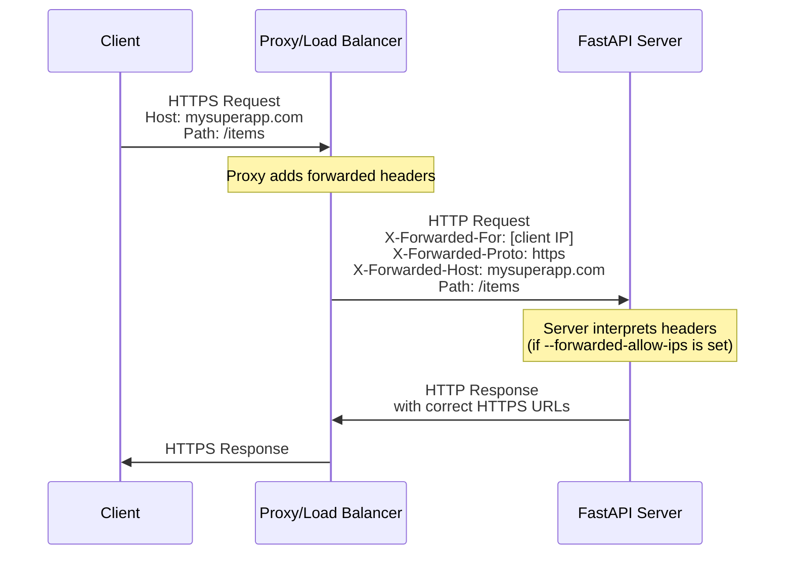
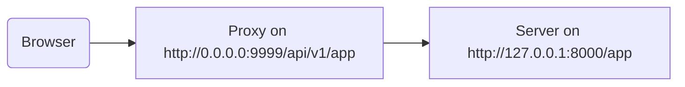

# Behind a Proxy { #behind-a-proxy }

In many situations, you would use a **proxy** like Traefik or Nginx in front of your FastAPI app.

These proxies could handle HTTPS certificates and other things.

## Proxy Forwarded Headers { #proxy-forwarded-headers }

A **proxy** in front of your application would normally set some headers on the fly before sending the requests to your **server** to let the server know that the request was **forwarded** by the proxy, letting it know the original (public) URL, including the domain, that it is using HTTPS, etc.

The **server** program (for example **Uvicorn** via **FastAPI CLI**) is capable of interpreting these headers, and then passing that information to your application.

But for security, as the server doesn't know it is behind a trusted proxy, it won't interpret those headers.

/// note | Technical Details

The proxy headers are:

* <a href="https://developer.mozilla.org/en-US/docs/Web/HTTP/Reference/Headers/X-Forwarded-For" class="external-link" target="_blank">X-Forwarded-For</a>
* <a href="https://developer.mozilla.org/en-US/docs/Web/HTTP/Reference/Headers/X-Forwarded-Proto" class="external-link" target="_blank">X-Forwarded-Proto</a>
* <a href="https://developer.mozilla.org/en-US/docs/Web/HTTP/Reference/Headers/X-Forwarded-Host" class="external-link" target="_blank">X-Forwarded-Host</a>

///

### Enable Proxy Forwarded Headers { #enable-proxy-forwarded-headers }

You can start FastAPI CLI with the *CLI Option* `--forwarded-allow-ips` and pass the IP addresses that should be trusted to read those forwarded headers.

If you set it to `--forwarded-allow-ips="*"` it would trust all the incoming IPs.

If your **server** is behind a trusted **proxy** and only the proxy talks to it, this would make it accept whatever is the IP of that **proxy**.

<div class="termy">

```console
$ fastapi run --forwarded-allow-ips="*"

<span style="color: green;">INFO</span>:     Uvicorn running on http://127.0.0.1:8000 (Press CTRL+C to quit)
```

</div>

### Redirects with HTTPS { #redirects-with-https }

For example, let's say you define a *path operation* `/items/`:

{* ../../docs_src/behind_a_proxy/tutorial001_01.py hl[6] *}

If the client tries to go to `/items`, by default, it would be redirected to `/items/`.

But before setting the *CLI Option* `--forwarded-allow-ips` it could redirect to `http://localhost:8000/items/`.

But maybe your application is hosted at `https://mysuperapp.com`, and the redirection should be to `https://mysuperapp.com/items/`.

By setting `--proxy-headers` now FastAPI would be able to redirect to the right location. 😎

```
https://mysuperapp.com/items/
```

/// tip

If you want to learn more about HTTPS, check the guide [About HTTPS](../deployment/https.md){.internal-link target=_blank}.

///

### How Proxy Forwarded Headers Work { #how-proxy-forwarded-headers-work }

Here's a visual representation of how the **proxy** adds forwarded headers between the client and the **application server**:



The **proxy** intercepts the original client request and adds the special *forwarded* headers (`X-Forwarded-*`) before passing the request to the **application server**.

These headers preserve information about the original request that would otherwise be lost:

* **X-Forwarded-For**: The original client's IP address
* **X-Forwarded-Proto**: The original protocol (`https`)
* **X-Forwarded-Host**: The original host (`mysuperapp.com`)

When **FastAPI CLI** is configured with `--forwarded-allow-ips`, it trusts these headers and uses them, for example to generate the correct URLs in redirects.

## Proxy with a stripped path prefix { #proxy-with-a-stripped-path-prefix }

You could have a proxy that adds a path prefix to your application.

In these cases you can use `root_path` to configure your application.

The `root_path` is a mechanism provided by the ASGI specification (that FastAPI is built on, through Starlette).

The `root_path` is used to handle these specific cases.

And it's also used internally when mounting sub-applications.

Having a proxy with a stripped path prefix, in this case, means that you could declare a path at `/app` in your code, but then, you add a layer on top (the proxy) that would put your **FastAPI** application under a path like `/api/v1`.

In this case, the original path `/app` would actually be served at `/api/v1/app`.

Even though all your code is written assuming there's just `/app`.

{* ../../docs_src/behind_a_proxy/tutorial001.py hl[6] *}

And the proxy would be **"stripping"** the **path prefix** on the fly before transmitting the request to the app server (probably Uvicorn via FastAPI CLI), keeping your application convinced that it is being served at `/app`, so that you don't have to update all your code to include the prefix `/api/v1`.

Up to here, everything would work as normally.

But then, when you open the integrated docs UI (the frontend), it would expect to get the OpenAPI schema at `/openapi.json`, instead of `/api/v1/openapi.json`.

So, the frontend (that runs in the browser) would try to reach `/openapi.json` and wouldn't be able to get the OpenAPI schema.

Because we have a proxy with a path prefix of `/api/v1` for our app, the frontend needs to fetch the OpenAPI schema at `/api/v1/openapi.json`.



/// tip

The IP `0.0.0.0` is commonly used to mean that the program listens on all the IPs available in that machine/server.

///

The docs UI would also need the OpenAPI schema to declare that this API `server` is located at `/api/v1` (behind the proxy). For example:

```JSON hl_lines="4-8"
{
    "openapi": "3.1.0",
    // More stuff here
    "servers": [
        {
            "url": "/api/v1"
        }
    ],
    "paths": {
            // More stuff here
    }
}
```

In this example, the "Proxy" could be something like **Traefik**. And the server would be something like FastAPI CLI with **Uvicorn**, running your FastAPI application.

### Providing the `root_path` { #providing-the-root-path }

To achieve this, you can use the command line option `--root-path` like:

<div class="termy">

```console
$ fastapi run main.py --forwarded-allow-ips="*" --root-path /api/v1

<span style="color: green;">INFO</span>:     Uvicorn running on http://127.0.0.1:8000 (Press CTRL+C to quit)
```

</div>

If you use Hypercorn, it also has the option `--root-path`.

/// note | Technical Details

The ASGI specification defines a `root_path` for this use case.

And the `--root-path` command line option provides that `root_path`.

///

### Checking the current `root_path` { #checking-the-current-root-path }

You can get the current `root_path` used by your application for each request, it is part of the `scope` dictionary (that's part of the ASGI spec).

Here we are including it in the message just for demonstration purposes.

{* ../../docs_src/behind_a_proxy/tutorial001.py hl[8] *}

Then, if you start Uvicorn with:

<div class="termy">

```console
$ fastapi run main.py --forwarded-allow-ips="*" --root-path /api/v1

<span style="color: green;">INFO</span>:     Uvicorn running on http://127.0.0.1:8000 (Press CTRL+C to quit)
```

</div>

The response would be something like:

```JSON
{
    "message": "Hello World",
    "root_path": "/api/v1"
}
```

### Setting the `root_path` in the FastAPI app { #setting-the-root-path-in-the-fastapi-app }

Alternatively, if you don't have a way to provide a command line option like `--root-path` or equivalent, you can set the `root_path` parameter when creating your FastAPI app:

{* ../../docs_src/behind_a_proxy/tutorial002.py hl[3] *}

Passing the `root_path` to `FastAPI` would be the equivalent of passing the `--root-path` command line option to Uvicorn or Hypercorn.

### About `root_path` { #about-root-path }

Keep in mind that the server (Uvicorn) won't use that `root_path` for anything else than passing it to the app.

But if you go with your browser to <a href="http://127.0.0.1:8000/app" class="external-link" target="_blank">http://127.0.0.1:8000/app</a> you will see the normal response:

```JSON
{
    "message": "Hello World",
    "root_path": "/api/v1"
}
```

So, it won't expect to be accessed at `http://127.0.0.1:8000/api/v1/app`.

Uvicorn will expect the proxy to access Uvicorn at `http://127.0.0.1:8000/app`, and then it would be the proxy's responsibility to add the extra `/api/v1` prefix on top.

## About proxies with a stripped path prefix { #about-proxies-with-a-stripped-path-prefix }

Keep in mind that a proxy with stripped path prefix is only one of the ways to configure it.

Probably in many cases the default will be that the proxy doesn't have a stripped path prefix.

In a case like that (without a stripped path prefix), the proxy would listen on something like `https://myawesomeapp.com`, and then if the browser goes to `https://myawesomeapp.com/api/v1/app` and your server (e.g. Uvicorn) listens on `http://127.0.0.1:8000` the proxy (without a stripped path prefix) would access Uvicorn at the same path: `http://127.0.0.1:8000/api/v1/app`.

## Testing locally with Traefik { #testing-locally-with-traefik }

You can easily run the experiment locally with a stripped path prefix using <a href="https://docs.traefik.io/" class="external-link" target="_blank">Traefik</a>.

<a href="https://github.com/containous/traefik/releases" class="external-link" target="_blank">Download Traefik</a>, it's a single binary, you can extract the compressed file and run it directly from the terminal.

Then create a file `traefik.toml` with:

```TOML hl_lines="3"
[entryPoints]
  [entryPoints.http]
    address = ":9999"

[providers]
  [providers.file]
    filename = "routes.toml"
```

This tells Traefik to listen on port 9999 and to use another file `routes.toml`.

/// tip

We are using port 9999 instead of the standard HTTP port 80 so that you don't have to run it with admin (`sudo`) privileges.

///

Now create that other file `routes.toml`:

```TOML hl_lines="5  12  20"
[http]
  [http.middlewares]

    [http.middlewares.api-stripprefix.stripPrefix]
      prefixes = ["/api/v1"]

  [http.routers]

    [http.routers.app-http]
      entryPoints = ["http"]
      service = "app"
      rule = "PathPrefix(`/api/v1`)"
      middlewares = ["api-stripprefix"]

  [http.services]

    [http.services.app]
      [http.services.app.loadBalancer]
        [[http.services.app.loadBalancer.servers]]
          url = "http://127.0.0.1:8000"
```

This file configures Traefik to use the path prefix `/api/v1`.

And then Traefik will redirect its requests to your Uvicorn running on `http://127.0.0.1:8000`.

Now start Traefik:

<div class="termy">

```console
$ ./traefik --configFile=traefik.toml

INFO[0000] Configuration loaded from file: /home/user/awesomeapi/traefik.toml
```

</div>

And now start your app, using the `--root-path` option:

<div class="termy">

```console
$ fastapi run main.py --forwarded-allow-ips="*" --root-path /api/v1

<span style="color: green;">INFO</span>:     Uvicorn running on http://127.0.0.1:8000 (Press CTRL+C to quit)
```

</div>

### Check the responses { #check-the-responses }

Now, if you go to the URL with the port for Uvicorn: <a href="http://127.0.0.1:8000/app" class="external-link" target="_blank">http://127.0.0.1:8000/app</a>, you will see the normal response:

```JSON
{
    "message": "Hello World",
    "root_path": "/api/v1"
}
```

/// tip

Notice that even though you are accessing it at `http://127.0.0.1:8000/app` it shows the `root_path` of `/api/v1`, taken from the option `--root-path`.

///

And now open the URL with the port for Traefik, including the path prefix: <a href="http://127.0.0.1:9999/api/v1/app" class="external-link" target="_blank">http://127.0.0.1:9999/api/v1/app</a>.

We get the same response:

```JSON
{
    "message": "Hello World",
    "root_path": "/api/v1"
}
```

but this time at the URL with the prefix path provided by the proxy: `/api/v1`.

Of course, the idea here is that everyone would access the app through the proxy, so the version with the path prefix `/api/v1` is the "correct" one.

And the version without the path prefix (`http://127.0.0.1:8000/app`), provided by Uvicorn directly, would be exclusively for the _proxy_ (Traefik) to access it.

That demonstrates how the Proxy (Traefik) uses the path prefix and how the server (Uvicorn) uses the `root_path` from the option `--root-path`.

### Check the docs UI { #check-the-docs-ui }

But here's the fun part. ✨

The "official" way to access the app would be through the proxy with the path prefix that we defined. So, as we would expect, if you try the docs UI served by Uvicorn directly, without the path prefix in the URL, it won't work, because it expects to be accessed through the proxy.

You can check it at <a href="http://127.0.0.1:8000/docs" class="external-link" target="_blank">http://127.0.0.1:8000/docs</a>:


But if we access the docs UI at the "official" URL using the proxy with port `9999`, at `/api/v1/docs`, it works correctly! 🎉

You can check it at <a href="http://127.0.0.1:9999/api/v1/docs" class="external-link" target="_blank">http://127.0.0.1:9999/api/v1/docs</a>:


Right as we wanted it. ✔️

This is because FastAPI uses this `root_path` to create the default `server` in OpenAPI with the URL provided by `root_path`.

## Additional servers { #additional-servers }

/// warning

This is a more advanced use case. Feel free to skip it.

///

By default, **FastAPI** will create a `server` in the OpenAPI schema with the URL for the `root_path`.

But you can also provide other alternative `servers`, for example if you want *the same* docs UI to interact with both a staging and a production environment.

If you pass a custom list of `servers` and there's a `root_path` (because your API lives behind a proxy), **FastAPI** will insert a "server" with this `root_path` at the beginning of the list.

For example:

{* ../../docs_src/behind_a_proxy/tutorial003.py hl[4:7] *}

Will generate an OpenAPI schema like:

```JSON hl_lines="5-7"
{
    "openapi": "3.1.0",
    // More stuff here
    "servers": [
        {
            "url": "/api/v1"
        },
        {
            "url": "https://stag.example.com",
            "description": "Staging environment"
        },
        {
            "url": "https://prod.example.com",
            "description": "Production environment"
        }
    ],
    "paths": {
            // More stuff here
    }
}
```

/// tip

Notice the auto-generated server with a `url` value of `/api/v1`, taken from the `root_path`.

///

In the docs UI at <a href="http://127.0.0.1:9999/api/v1/docs" class="external-link" target="_blank">http://127.0.0.1:9999/api/v1/docs</a> it would look like:


/// tip

The docs UI will interact with the server that you select.

///

/// note | Technical Details

The `servers` property in the OpenAPI specification is optional.

If you don't specify the `servers` parameter and `root_path` is equal to `/`, the `servers` property in the generated OpenAPI schema will be omitted entirely by default, which is the equivalent of a single server with a `url` value of `/`.

///

### Disable automatic server from `root_path` { #disable-automatic-server-from-root-path }

If you don't want **FastAPI** to include an automatic server using the `root_path`, you can use the parameter `root_path_in_servers=False`:

{* ../../docs_src/behind_a_proxy/tutorial004.py hl[9] *}

and then it won't include it in the OpenAPI schema.

## Mounting a sub-application { #mounting-a-sub-application }

If you need to mount a sub-application (as described in [Sub Applications - Mounts](sub-applications.md){.internal-link target=_blank}) while also using a proxy with `root_path`, you can do it normally, as you would expect.

FastAPI will internally use the `root_path` smartly, so it will just work. ✨
