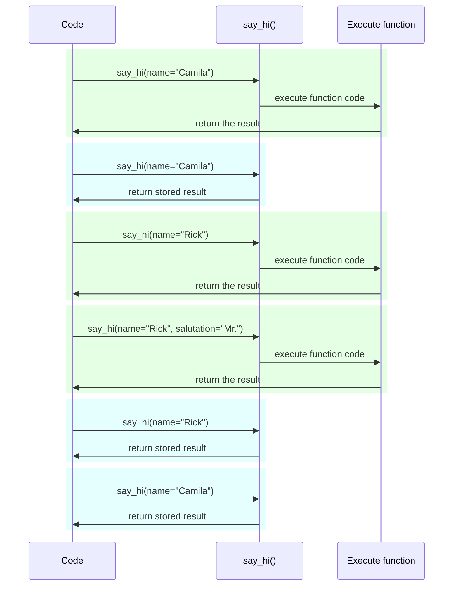

# Settings and Environment Variables

In many cases your application could need some external settings or configurations, for example secret keys, database credentials, credentials for email services, etc.

Most of these settings are variable (can change), like database URLs. And many could be sensitive, like secrets.

For this reason it's common to provide them in environment variables that are read by the application.

## Environment Variables

!!! tip
    If you already know what "environment variables" are and how to use them, feel free to skip to the next section below.

An <a href="https://en.wikipedia.org/wiki/Environment_variable" class="external-link" target="_blank">environment variable</a> (also known as "env var") is a variable that lives outside of the Python code, in the operating system, and could be read by your Python code (or by other programs as well).

You can create and use environment variables in the shell, without needing Python:

=== "Linux, macOS, Windows Bash"

    <div class="termy">

    ```console
    // You could create an env var MY_NAME with
    $ export MY_NAME="Wade Wilson"

    // Then you could use it with other programs, like
    $ echo "Hello $MY_NAME"

    Hello Wade Wilson
    ```

    </div>

=== "Windows PowerShell"

    <div class="termy">

    ```console
    // Create an env var MY_NAME
    $ $Env:MY_NAME = "Wade Wilson"

    // Use it with other programs, like
    $ echo "Hello $Env:MY_NAME"

    Hello Wade Wilson
    ```

    </div>

### Read env vars in Python

You could also create environment variables outside of Python, in the terminal (or with any other method), and then read them in Python.

For example you could have a file `main.py` with:

```Python hl_lines="3"
import os

name = os.getenv("MY_NAME", "World")
print(f"Hello {name} from Python")
```

!!! tip
    The second argument to <a href="https://docs.python.org/3.8/library/os.html#os.getenv" class="external-link" target="_blank">`os.getenv()`</a> is the default value to return.

    If not provided, it's `None` by default, here we provide `"World"` as the default value to use.

Then you could call that Python program:

<div class="termy">

```console
// Here we don't set the env var yet
$ python main.py

// As we didn't set the env var, we get the default value

Hello World from Python

// But if we create an environment variable first
$ export MY_NAME="Wade Wilson"

// And then call the program again
$ python main.py

// Now it can read the environment variable

Hello Wade Wilson from Python
```

</div>

As environment variables can be set outside of the code, but can be read by the code, and don't have to be stored (committed to `git`) with the rest of the files, it's common to use them for configurations or settings.

You can also create an environment variable only for a specific program invocation, that is only available to that program, and only for its duration.

To do that, create it right before the program itself, on the same line:

<div class="termy">

```console
// Create an env var MY_NAME in line for this program call
$ MY_NAME="Wade Wilson" python main.py

// Now it can read the environment variable

Hello Wade Wilson from Python

// The env var no longer exists afterwards
$ python main.py

Hello World from Python
```

</div>

!!! tip
    You can read more about it at <a href="https://12factor.net/config" class="external-link" target="_blank">The Twelve-Factor App: Config</a>.

### Types and validation

These environment variables can only handle text strings, as they are external to Python and have to be compatible with other programs and the rest of the system (and even with different operating systems, as Linux, Windows, macOS).

That means that any value read in Python from an environment variable will be a `str`, and any conversion to a different type or validation has to be done in code.

## Pydantic `Settings`

Fortunately, Pydantic provides a great utility to handle these settings coming from environment variables with <a href="https://pydantic-docs.helpmanual.io/usage/settings/" class="external-link" target="_blank">Pydantic: Settings management</a>.

### Create the `Settings` object

Import `BaseSettings` from Pydantic and create a sub-class, very much like with a Pydantic model.

The same way as with Pydantic models, you declare class attributes with type annotations, and possibly default values.

You can use all the same validation features and tools you use for Pydantic models, like different data types and additional validations with `Field()`.

```Python hl_lines="2  5-8  11"
{!../../../docs_src/settings/tutorial001.py!}
```

!!! tip
    If you want something quick to copy and paste, don't use this example, use the last one below.

Then, when you create an instance of that `Settings` class (in this case, in the `settings` object), Pydantic will read the environment variables in a case-insensitive way, so, an upper-case variable `APP_NAME` will still be read for the attribute `app_name`.

Next it will convert and validate the data. So, when you use that `settings` object, you will have data of the types you declared (e.g. `items_per_user` will be an `int`).

### Use the `settings`

Then you can use the new `settings` object in your application:

```Python hl_lines="18-20"
{!../../../docs_src/settings/tutorial001.py!}
```

### Run the server

Next, you would run the server passing the configurations as environment variables, for example you could set an `ADMIN_EMAIL` and `APP_NAME` with:

<div class="termy">

```console
$ ADMIN_EMAIL="deadpool@example.com" APP_NAME="ChimichangApp" uvicorn main:app

<span style="color: green;">INFO</span>:     Uvicorn running on http://127.0.0.1:8000 (Press CTRL+C to quit)
```

</div>

!!! tip
    To set multiple env vars for a single command just separate them with a space, and put them all before the command.

And then the `admin_email` setting would be set to `"deadpool@example.com"`.

The `app_name` would be `"ChimichangApp"`.

And the `items_per_user` would keep its default value of `50`.

## Settings in another module

You could put those settings in another module file as you saw in [Bigger Applications - Multiple Files](../tutorial/bigger-applications.md){.internal-link target=_blank}.

For example, you could have a file `config.py` with:

```Python
{!../../../docs_src/settings/app01/config.py!}
```

And then use it in a file `main.py`:

```Python hl_lines="3  11-13"
{!../../../docs_src/settings/app01/main.py!}
```

!!! tip
    You would also need a file `__init__.py` as you saw on [Bigger Applications - Multiple Files](../tutorial/bigger-applications.md){.internal-link target=_blank}.

## Settings in a dependency

In some occasions it might be useful to provide the settings from a dependency, instead of having a global object with `settings` that is used everywhere.

This could be especially useful during testing, as it's very easy to override a dependency with your own custom settings.

### The config file

Coming from the previous example, your `config.py` file could look like:

```Python hl_lines="10"
{!../../../docs_src/settings/app02/config.py!}
```

Notice that now we don't create a default instance `settings = Settings()`.

### The main app file

Now we create a dependency that returns a new `config.Settings()`.

```Python hl_lines="5  11-12"
{!../../../docs_src/settings/app02/main.py!}
```

!!! tip
    We'll discuss the `@lru_cache()` in a bit.

    For now you can assume `get_settings()` is a normal function.

And then we can require it from the *path operation function* as a dependency and use it anywhere we need it.

```Python hl_lines="16  18-20"
{!../../../docs_src/settings/app02/main.py!}
```

### Settings and testing

Then it would be very easy to provide a different settings object during testing by creating a dependency override for `get_settings`:

```Python hl_lines="8-9  12  21"
{!../../../docs_src/settings/app02/test_main.py!}
```

In the dependency override we set a new value for the `admin_email` when creating the new `Settings` object, and then we return that new object.

Then we can test that it is used.

## Reading a `.env` file

If you have many settings that possibly change a lot, maybe in different environments, it might be useful to put them on a file and then read them from it as if they were environment variables.

This practice is common enough that it has a name, these environment variables are commonly placed in a file `.env`, and the file is called a "dotenv".

!!! tip
    A file starting with a dot (`.`) is a hidden file in Unix-like systems, like Linux and macOS.

    But a dotenv file doesn't really have to have that exact filename.

Pydantic has support for reading from these types of files using an external library. You can read more at <a href="https://pydantic-docs.helpmanual.io/usage/settings/#dotenv-env-support" class="external-link" target="_blank">Pydantic Settings: Dotenv (.env) support</a>.

!!! tip
    For this to work, you need to `pip install python-dotenv`.

### The `.env` file

You could have a `.env` file with:

```bash
ADMIN_EMAIL="deadpool@example.com"
APP_NAME="ChimichangApp"
```

### Read settings from `.env`

And then update your `config.py` with:

```Python hl_lines="9-10"
{!../../../docs_src/settings/app03/config.py!}
```

Here we create a class `Config` inside of your Pydantic `Settings` class, and set the `env_file` to the filename with the dotenv file we want to use.

!!! tip
    The `Config` class is used just for Pydantic configuration. You can read more at <a href="https://pydantic-docs.helpmanual.io/usage/model_config/" class="external-link" target="_blank">Pydantic Model Config</a>

### Creating the `Settings` only once with `lru_cache`

Reading a file from disk is normally a costly (slow) operation, so you probably want to do it only once and then re-use the same settings object, instead of reading it for each request.

But every time we do:

```Python
config.Settings()
```

a new `Settings` object would be created, and at creation it would read the `.env` file again.

If the dependency function was just like:

```Python
def get_settings():
    return config.Settings()
```

we would create that object for each request, and we would be reading the `.env` file for each request. ⚠️

But as we are using the `@lru_cache()` decorator on top, the `Settings` object will be created only once, the first time it's called. ✔️

```Python hl_lines="1  10"
{!../../../docs_src/settings/app03/main.py!}
```

Then for any subsequent calls of `get_settings()` in the dependencies for the next requests, instead of executing the internal code of `get_settings()` and creating a new `Settings` object, it will return the same object that was returned on the first call, again and again.

#### `lru_cache` Technical Details

`@lru_cache()` modifies the function it decorates to return the same value that was returned the first time, instead of computing it again, executing the code of the function every time.

So, the function below it will be executed once for each combination of arguments. And then the values returned by each of those combinations of arguments will be used again and again whenever the function is called with exactly the same combination of arguments.

For example, if you have a function:

```Python
@lru_cache()
def say_hi(name: str, salutation: str = "Ms."):
    return f"Hello {salutation} {name}"
```

your program could execute like this:



In the case of our dependency `get_settings()`, the function doesn't even take any arguments, so it always returns the same value.

That way, it behaves almost as if it was just a global variable. But as it uses a dependency function, then we can override it easily for testing.

`@lru_cache()` is part of `functools` which is part of Python's standard library, you can read more about it in the <a href="https://docs.python.org/3/library/functools.html#functools.lru_cache" class="external-link" target="_blank">Python docs for `@lru_cache()`</a>.

## Recap

You can use Pydantic Settings to handle the settings or configurations for your application, with all the power of Pydantic models.

* By using a dependency you can simplify testing.
* You can use `.env` files with it.
* Using `@lru_cache()` lets you avoid reading the dotenv file again and again for each request, while allowing you to override it during testing.
