# Migrate from Pydantic v1 to Pydantic v2 { #migrate-from-pydantic-v1-to-pydantic-v2 }

If you have an old FastAPI app, you might be using Pydantic version 1.

FastAPI has had support for either Pydantic v1 or v2 since version 0.100.0.

If you had installed Pydantic v2, it would use it. If instead you had Pydantic v1, it would use that.

Pydantic v1 is now deprecated and support for it will be removed in the next versions of FastAPI, you should **migrate to Pydantic v2**. This way you will get the latest features, improvements, and fixes.

/// warning

Also, the Pydantic team stopped support for Pydantic v1 for the latest versions of Python, starting with **Python 3.14**.

If you want to use the latest features of Python, you will need to make sure you use Pydantic v2.

///

If you have an old FastAPI app with Pydantic v1, here I'll show you how to migrate it to Pydantic v2, and the **new features in FastAPI 0.119.0** to help you with a gradual migration.

## Official Guide { #official-guide }

Pydantic has an official <a href="https://docs.pydantic.dev/latest/migration/" class="external-link" target="_blank">Migration Guide</a> from v1 to v2.

It also includes what has changed, how validations are now more correct and strict, possible caveats, etc.

You can read it to understand better what has changed.

## Tests { #tests }

Make sure you have [tests](../tutorial/testing.md){.internal-link target=_blank} for your app and you run them on continuous integration (CI).

This way, you can do the upgrade and make sure everything is still working as expected.

## `bump-pydantic` { #bump-pydantic }

In many cases, when you use regular Pydantic models without customizations, you will be able to automate most of the process of migrating from Pydantic v1 to Pydantic v2.

You can use <a href="https://github.com/pydantic/bump-pydantic" class="external-link" target="_blank">`bump-pydantic`</a> from the same Pydantic team.

This tool will help you to automatically change most of the code that needs to be changed.

After this, you can run the tests and check if everything works. If it does, you are done. 😎

## Pydantic v1 in v2 { #pydantic-v1-in-v2 }

Pydantic v2 includes everything from Pydantic v1 as a submodule `pydantic.v1`.

This means that you can install the latest version of Pydantic v2 and import and use the old Pydantic v1 components from this submodule, as if you had the old Pydantic v1 installed.

{* ../../docs_src/pydantic_v1_in_v2/tutorial001_an_py310.py hl[1,4] *}

### FastAPI support for Pydantic v1 in v2 { #fastapi-support-for-pydantic-v1-in-v2 }

Since FastAPI 0.119.0, there's also partial support for Pydantic v1 from inside of Pydantic v2, to facilitate the migration to v2.

So, you could upgrade Pydantic to the latest version 2, and change the imports to use the `pydantic.v1` submodule, and in many cases it would just work.

{* ../../docs_src/pydantic_v1_in_v2/tutorial002_an_py310.py hl[2,5,15] *}

/// warning

Have in mind that as the Pydantic team no longer supports Pydantic v1 in recent versions of Python, starting from Python 3.14, using `pydantic.v1` is also not supported in Python 3.14 and above.

///

### Pydantic v1 and v2 on the same app { #pydantic-v1-and-v2-on-the-same-app }

It's **not supported** by Pydantic to have a model of Pydantic v2 with its own fields defined as Pydantic v1 models or vice versa.

```mermaid
graph TB
    subgraph "❌ Not Supported"
        direction TB
        subgraph V2["Pydantic v2 Model"]
            V1Field["Pydantic v1 Model"]
        end
        subgraph V1["Pydantic v1 Model"]
            V2Field["Pydantic v2 Model"]
        end
    end

    style V2 fill:#f9fff3
    style V1 fill:#fff6f0
    style V1Field fill:#fff6f0
    style V2Field fill:#f9fff3
```

...but, you can have separated models using Pydantic v1 and v2 in the same app.

```mermaid
graph TB
    subgraph "✅ Supported"
        direction TB
        subgraph V2["Pydantic v2 Model"]
            V2Field["Pydantic v2 Model"]
        end
        subgraph V1["Pydantic v1 Model"]
            V1Field["Pydantic v1 Model"]
        end
    end

    style V2 fill:#f9fff3
    style V1 fill:#fff6f0
    style V1Field fill:#fff6f0
    style V2Field fill:#f9fff3
```

In some cases, it's even possible to have both Pydantic v1 and v2 models in the same **path operation** in your FastAPI app:

{* ../../docs_src/pydantic_v1_in_v2/tutorial003_an_py310.py hl[2:3,6,12,21:22] *}

In this example above, the input model is a Pydantic v1 model, and the output model (defined in `response_model=ItemV2`) is a Pydantic v2 model.

### Pydantic v1 parameters { #pydantic-v1-parameters }

If you need to use some of the FastAPI-specific tools for parameters like `Body`, `Query`, `Form`, etc. with Pydantic v1 models, you can import them from `fastapi.temp_pydantic_v1_params` while you finish the migration to Pydantic v2:

{* ../../docs_src/pydantic_v1_in_v2/tutorial004_an_py310.py hl[4,18] *}

### Migrate in steps { #migrate-in-steps }

/// tip

First try with `bump-pydantic`, if your tests pass and that works, then you're done in one command. ✨

///

If `bump-pydantic` doesn't work for your use case, you can use the support for both Pydantic v1 and v2 models in the same app to do the migration to Pydantic v2 gradually.

You could fist upgrade Pydantic to use the latest version 2, and change the imports to use `pydantic.v1` for all your models.

Then, you can start migrating your models from Pydantic v1 to v2 in groups, in gradual steps. 🚶
