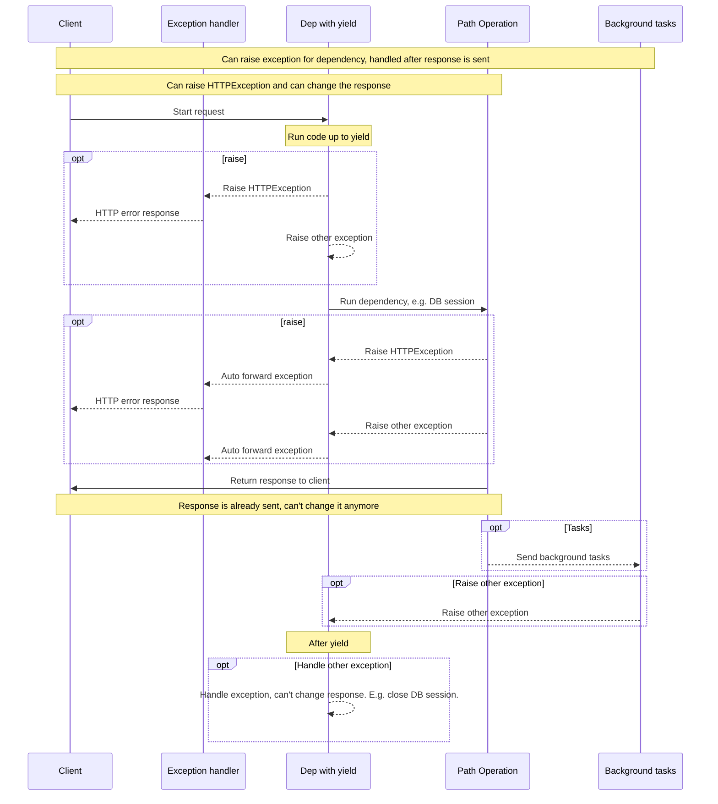

---
hide:
  - navigation
---

# Release Notes

## Latest Changes

## 0.123.4

### Fixes

* 🐛 Fix OpenAPI schema support for computed fields when using `separate_input_output_schemas=False`. PR [#13207](https://github.com/fastapi/fastapi/pull/13207) by [@vgrafe](https://github.com/vgrafe).

### Docs

* 📝 Fix docstring of `servers` parameter. PR [#14405](https://github.com/fastapi/fastapi/pull/14405) by [@YuriiMotov](https://github.com/YuriiMotov).

## 0.123.3

### Fixes

* 🐛 Fix Query\Header\Cookie parameter model alias. PR [#14360](https://github.com/fastapi/fastapi/pull/14360) by [@YuriiMotov](https://github.com/YuriiMotov).
* 🐛 Fix optional sequence handling in `serialize sequence value` with Pydantic V2. PR [#14297](https://github.com/fastapi/fastapi/pull/14297) by [@YuriiMotov](https://github.com/YuriiMotov).

## 0.123.2

### Fixes

* 🐛 Fix unformatted `{type_}` in FastAPIError. PR [#14416](https://github.com/fastapi/fastapi/pull/14416) by [@Just-Helpful](https://github.com/Just-Helpful).
* 🐛 Fix parsing extra non-body parameter list. PR [#14356](https://github.com/fastapi/fastapi/pull/14356) by [@YuriiMotov](https://github.com/YuriiMotov).
* 🐛 Fix parsing extra `Form` parameter list. PR [#14303](https://github.com/fastapi/fastapi/pull/14303) by [@YuriiMotov](https://github.com/YuriiMotov).
* 🐛 Fix support for form values with empty strings interpreted as missing (`None` if that's the default), for compatibility with HTML forms. PR [#13537](https://github.com/fastapi/fastapi/pull/13537) by [@MarinPostma](https://github.com/MarinPostma).

### Docs

* 📝 Add tip on how to install `pip` in case of `No module named pip` error in `virtual-environments.md`. PR [#14211](https://github.com/fastapi/fastapi/pull/14211) by [@zadevhub](https://github.com/zadevhub).
* 📝 Update Primary Key notes for the SQL databases tutorial to avoid confusion. PR [#14120](https://github.com/fastapi/fastapi/pull/14120) by [@FlaviusRaducu](https://github.com/FlaviusRaducu).
* 📝 Clarify estimation note in documentation. PR [#14070](https://github.com/fastapi/fastapi/pull/14070) by [@SaisakthiM](https://github.com/SaisakthiM).

## 0.123.1

### Fixes

* 🐛 Avoid accessing non-existing "$ref" key for Pydantic v2 compat remapping. PR [#14361](https://github.com/fastapi/fastapi/pull/14361) by [@svlandeg](https://github.com/svlandeg).
* 🐛 Fix `TypeError` when encoding a decimal with a `NaN` or `Infinity` value. PR [#12935](https://github.com/fastapi/fastapi/pull/12935) by [@kentwelcome](https://github.com/kentwelcome).

### Internal

* 🐛 Fix Windows UnicodeEncodeError in CLI test. PR [#14295](https://github.com/fastapi/fastapi/pull/14295) by [@hemanth-thirthahalli](https://github.com/hemanth-thirthahalli).
* 🔧 Update sponsors: add Greptile. PR [#14429](https://github.com/fastapi/fastapi/pull/14429) by [@tiangolo](https://github.com/tiangolo).
* 👥 Update FastAPI GitHub topic repositories. PR [#14426](https://github.com/fastapi/fastapi/pull/14426) by [@tiangolo](https://github.com/tiangolo).
* ⬆ Bump markdown-include-variants from 0.0.6 to 0.0.7. PR [#14423](https://github.com/fastapi/fastapi/pull/14423) by [@YuriiMotov](https://github.com/YuriiMotov).
* 👥 Update FastAPI People - Sponsors. PR [#14422](https://github.com/fastapi/fastapi/pull/14422) by [@tiangolo](https://github.com/tiangolo).
* 👥 Update FastAPI People - Contributors and Translators. PR [#14420](https://github.com/fastapi/fastapi/pull/14420) by [@tiangolo](https://github.com/tiangolo).

## 0.123.0

### Fixes

* 🐛 Cache dependencies that don't use scopes and don't have sub-dependencies with scopes. PR [#14419](https://github.com/fastapi/fastapi/pull/14419) by [@tiangolo](https://github.com/tiangolo).

## 0.122.1

### Fixes

* 🐛 Fix hierarchical security scope propagation. PR [#5624](https://github.com/fastapi/fastapi/pull/5624) by [@kristjanvalur](https://github.com/kristjanvalur).

### Docs

* 💅 Update CSS to explicitly use emoji font. PR [#14415](https://github.com/fastapi/fastapi/pull/14415) by [@tiangolo](https://github.com/tiangolo).

### Internal

* ⬆ Bump markdown-include-variants from 0.0.5 to 0.0.6. PR [#14418](https://github.com/fastapi/fastapi/pull/14418) by [@YuriiMotov](https://github.com/YuriiMotov).

## 0.122.0

### Fixes

* 🐛 Use `401` status code in security classes when credentials are missing. PR [#13786](https://github.com/fastapi/fastapi/pull/13786) by [@YuriiMotov](https://github.com/YuriiMotov).
    * If your code depended on these classes raising the old (less correct) `403` status code, check the new docs about how to override the classes, to use the same old behavior: [Use Old 403 Authentication Error Status Codes](https://fastapi.tiangolo.com/how-to/authentication-error-status-code/).

### Internal

* 🔧 Configure labeler to exclude files that start from underscore for `lang-all` label. PR [#14213](https://github.com/fastapi/fastapi/pull/14213) by [@YuriiMotov](https://github.com/YuriiMotov).
* 👷 Add pre-commit config with local script for permalinks. PR [#14398](https://github.com/fastapi/fastapi/pull/14398) by [@tiangolo](https://github.com/tiangolo).
* 💄 Use font Fira Code to fix display of Rich panels in docs in Windows. PR [#14387](https://github.com/fastapi/fastapi/pull/14387) by [@tiangolo](https://github.com/tiangolo).
* 👷 Add custom pre-commit CI. PR [#14397](https://github.com/fastapi/fastapi/pull/14397) by [@tiangolo](https://github.com/tiangolo).
* ⬆ Bump actions/checkout from 5 to 6. PR [#14381](https://github.com/fastapi/fastapi/pull/14381) by [@dependabot[bot]](https://github.com/apps/dependabot).
* 👷 Upgrade `latest-changes` GitHub Action and pin `actions/checkout@v5`. PR [#14403](https://github.com/fastapi/fastapi/pull/14403) by [@svlandeg](https://github.com/svlandeg).
* 🛠️ Add `add-permalinks` and `add-permalinks-page` to `scripts/docs.py`. PR [#14033](https://github.com/fastapi/fastapi/pull/14033) by [@YuriiMotov](https://github.com/YuriiMotov).
* 🔧 Upgrade Material for MkDocs and remove insiders. PR [#14375](https://github.com/fastapi/fastapi/pull/14375) by [@tiangolo](https://github.com/tiangolo).

## 0.121.3

### Refactors

* ♻️ Make the result of `Depends()` and `Security()` hashable, as a workaround for other tools interacting with these internal parts. PR [#14372](https://github.com/fastapi/fastapi/pull/14372) by [@tiangolo](https://github.com/tiangolo).

### Upgrades

* ⬆️ Bump Starlette to <`0.51.0`. PR [#14282](https://github.com/fastapi/fastapi/pull/14282) by [@musicinmybrain](https://github.com/musicinmybrain).

### Docs

* 📝 Add missing hash part. PR [#14369](https://github.com/fastapi/fastapi/pull/14369) by [@nilslindemann](https://github.com/nilslindemann).
* 📝 Fix typos in code comments. PR [#14364](https://github.com/fastapi/fastapi/pull/14364) by [@Edge-Seven](https://github.com/Edge-Seven).
* 📝 Add docs for using FastAPI Cloud. PR [#14359](https://github.com/fastapi/fastapi/pull/14359) by [@tiangolo](https://github.com/tiangolo).

## 0.121.2

### Fixes

* 🐛 Fix handling of JSON Schema attributes named "$ref". PR [#14349](https://github.com/fastapi/fastapi/pull/14349) by [@tiangolo](https://github.com/tiangolo).

### Docs

* 📝 Add EuroPython talk & podcast episode with Sebastián Ramírez. PR [#14260](https://github.com/fastapi/fastapi/pull/14260) by [@clytaemnestra](https://github.com/clytaemnestra).
* ✏️ Fix links and add missing permalink in docs. PR [#14217](https://github.com/fastapi/fastapi/pull/14217) by [@YuriiMotov](https://github.com/YuriiMotov).

### Translations

* 🌐 Update Portuguese translations with LLM prompt. PR [#14228](https://github.com/fastapi/fastapi/pull/14228) by [@ceb10n](https://github.com/ceb10n).
* 🔨 Add Portuguese translations LLM prompt. PR [#14208](https://github.com/fastapi/fastapi/pull/14208) by [@ceb10n](https://github.com/ceb10n).
* 🌐 Sync Russian docs. PR [#14331](https://github.com/fastapi/fastapi/pull/14331) by [@YuriiMotov](https://github.com/YuriiMotov).
* 🌐 Sync German docs. PR [#14317](https://github.com/fastapi/fastapi/pull/14317) by [@nilslindemann](https://github.com/nilslindemann).

## 0.121.1

### Fixes

* 🐛 Fix `Depends(func, scope='function')` for top level (parameterless) dependencies. PR [#14301](https://github.com/fastapi/fastapi/pull/14301) by [@luzzodev](https://github.com/luzzodev).

### Docs

* 📝 Upate docs for advanced dependencies with `yield`, noting the changes in 0.121.0, adding `scope`. PR [#14287](https://github.com/fastapi/fastapi/pull/14287) by [@tiangolo](https://github.com/tiangolo).

### Internal

* ⬆ Bump ruff from 0.13.2 to 0.14.3. PR [#14276](https://github.com/fastapi/fastapi/pull/14276) by [@dependabot[bot]](https://github.com/apps/dependabot).
* ⬆ [pre-commit.ci] pre-commit autoupdate. PR [#14289](https://github.com/fastapi/fastapi/pull/14289) by [@pre-commit-ci[bot]](https://github.com/apps/pre-commit-ci).

## 0.121.0

### Features

* ✨ Add support for dependencies with scopes, support `scope="request"` for dependencies with `yield` that exit before the response is sent. PR [#14262](https://github.com/fastapi/fastapi/pull/14262) by [@tiangolo](https://github.com/tiangolo).
    * New docs: [Dependencies with `yield` - Early exit and `scope`](https://fastapi.tiangolo.com/tutorial/dependencies/dependencies-with-yield/#early-exit-and-scope).

### Internal

* 👥 Update FastAPI People - Contributors and Translators. PR [#14273](https://github.com/fastapi/fastapi/pull/14273) by [@tiangolo](https://github.com/tiangolo).
* 👥 Update FastAPI People - Sponsors. PR [#14274](https://github.com/fastapi/fastapi/pull/14274) by [@tiangolo](https://github.com/tiangolo).
* 👥 Update FastAPI GitHub topic repositories. PR [#14280](https://github.com/fastapi/fastapi/pull/14280) by [@tiangolo](https://github.com/tiangolo).
* ⬆ Bump mkdocs-macros-plugin from 1.4.0 to 1.4.1. PR [#14277](https://github.com/fastapi/fastapi/pull/14277) by [@dependabot[bot]](https://github.com/apps/dependabot).
* ⬆ Bump mkdocstrings[python] from 0.26.1 to 0.30.1. PR [#14279](https://github.com/fastapi/fastapi/pull/14279) by [@dependabot[bot]](https://github.com/apps/dependabot).

## 0.120.4

### Fixes

* 🐛 Fix security schemes in OpenAPI when added at the top level app. PR [#14266](https://github.com/fastapi/fastapi/pull/14266) by [@YuriiMotov](https://github.com/YuriiMotov).

## 0.120.3

### Refactors

* ♻️ Reduce internal cyclic recursion in dependencies, from 2 functions calling each other to 1 calling itself. PR [#14256](https://github.com/fastapi/fastapi/pull/14256) by [@tiangolo](https://github.com/tiangolo).
* ♻️ Refactor internals of dependencies, simplify code and remove `get_param_sub_dependant`. PR [#14255](https://github.com/fastapi/fastapi/pull/14255) by [@tiangolo](https://github.com/tiangolo).
* ♻️ Refactor internals of dependencies, simplify using dataclasses. PR [#14254](https://github.com/fastapi/fastapi/pull/14254) by [@tiangolo](https://github.com/tiangolo).

### Docs

* 📝 Update note for untranslated pages. PR [#14257](https://github.com/fastapi/fastapi/pull/14257) by [@YuriiMotov](https://github.com/YuriiMotov).

## 0.120.2

### Fixes

* 🐛 Fix separation of schemas with nested models introduced in 0.119.0. PR [#14246](https://github.com/fastapi/fastapi/pull/14246) by [@tiangolo](https://github.com/tiangolo).

### Internal

* 🔧 Add sponsor: SerpApi. PR [#14248](https://github.com/fastapi/fastapi/pull/14248) by [@tiangolo](https://github.com/tiangolo).
* ⬆ Bump actions/download-artifact from 5 to 6. PR [#14236](https://github.com/fastapi/fastapi/pull/14236) by [@dependabot[bot]](https://github.com/apps/dependabot).
* ⬆ [pre-commit.ci] pre-commit autoupdate. PR [#14237](https://github.com/fastapi/fastapi/pull/14237) by [@pre-commit-ci[bot]](https://github.com/apps/pre-commit-ci).
* ⬆ Bump actions/upload-artifact from 4 to 5. PR [#14235](https://github.com/fastapi/fastapi/pull/14235) by [@dependabot[bot]](https://github.com/apps/dependabot).

## 0.120.1

### Upgrades

* ⬆️ Bump Starlette to <`0.50.0`. PR [#14234](https://github.com/fastapi/fastapi/pull/14234) by [@YuriiMotov](https://github.com/YuriiMotov).

### Internal

* 🔧 Add `license` and `license-files` to `pyproject.toml`, remove `License` from `classifiers`. PR [#14230](https://github.com/fastapi/fastapi/pull/14230) by [@YuriiMotov](https://github.com/YuriiMotov).

## 0.120.0

There are no major nor breaking changes in this release. ☕️

The internal reference documentation now uses `annotated_doc.Doc` instead of `typing_extensions.Doc`, this adds a new (very small) dependency on [`annotated-doc`](https://github.com/fastapi/annotated-doc), a package made just to provide that `Doc` documentation utility class.

I would expect `typing_extensions.Doc` to be deprecated and then removed at some point from `typing_extensions`, for that reason there's the new `annotated-doc` micro-package. If you are curious about this, you can read more in the repo for [`annotated-doc`](https://github.com/fastapi/annotated-doc).

This new version `0.120.0` only contains that transition to the new home package for that utility class `Doc`.

### Translations

* 🌐 Sync German docs. PR [#14188](https://github.com/fastapi/fastapi/pull/14188) by [@nilslindemann](https://github.com/nilslindemann).

### Internal

* ➕ Migrate internal reference documentation from `typing_extensions.Doc` to `annotated_doc.Doc`. PR [#14222](https://github.com/fastapi/fastapi/pull/14222) by [@tiangolo](https://github.com/tiangolo).
* 🛠️ Update German LLM prompt and test file. PR [#14189](https://github.com/fastapi/fastapi/pull/14189) by [@nilslindemann](https://github.com/nilslindemann).
* ⬆ [pre-commit.ci] pre-commit autoupdate. PR [#14181](https://github.com/fastapi/fastapi/pull/14181) by [@pre-commit-ci[bot]](https://github.com/apps/pre-commit-ci).

## 0.119.1

### Fixes

* 🐛 Fix internal Pydantic v1 compatibility (warnings) for Python 3.14 and Pydantic 2.12.1. PR [#14186](https://github.com/fastapi/fastapi/pull/14186) by [@svlandeg](https://github.com/svlandeg).

### Docs

* 📝 Replace `starlette.io` by `starlette.dev` and `uvicorn.org` by `uvicorn.dev`. PR [#14176](https://github.com/fastapi/fastapi/pull/14176) by [@Kludex](https://github.com/Kludex).

### Internal

* 🔧 Add sponsor Requestly. PR [#14205](https://github.com/fastapi/fastapi/pull/14205) by [@tiangolo](https://github.com/tiangolo).
* 🔧 Configure reminder for `waiting` label in `issue-manager`. PR [#14156](https://github.com/fastapi/fastapi/pull/14156) by [@YuriiMotov](https://github.com/YuriiMotov).

## 0.119.0

FastAPI now (temporarily) supports both Pydantic v2 models and `pydantic.v1` models at the same time in the same app, to make it easier for any FastAPI apps still using Pydantic v1 to gradually but quickly **migrate to Pydantic v2**.

```Python
from fastapi import FastAPI
from pydantic import BaseModel as BaseModelV2
from pydantic.v1 import BaseModel


class Item(BaseModel):
    name: str
    description: str | None = None


class ItemV2(BaseModelV2):
    title: str
    summary: str | None = None


app = FastAPI()


@app.post("/items/", response_model=ItemV2)
def create_item(item: Item):
    return {"title": item.name, "summary": item.description}
```

Adding this feature was a big effort with the main objective of making it easier for the few applications still stuck in Pydantic v1 to migrate to Pydantic v2.

And with this, support for **Pydantic v1 is now deprecated** and will be **removed** from FastAPI in a future version soon.

**Note**: have in mind that the Pydantic team already stopped supporting Pydantic v1 for recent versions of Python, starting with Python 3.14.

You can read in the docs more about how to [Migrate from Pydantic v1 to Pydantic v2](https://fastapi.tiangolo.com/how-to/migrate-from-pydantic-v1-to-pydantic-v2/).

### Features

* ✨ Add support for `from pydantic.v1 import BaseModel`, mixed Pydantic v1 and v2 models in the same app. PR [#14168](https://github.com/fastapi/fastapi/pull/14168) by [@tiangolo](https://github.com/tiangolo).

## 0.118.3

### Upgrades

* ⬆️ Add support for Python 3.14. PR [#14165](https://github.com/fastapi/fastapi/pull/14165) by [@svlandeg](https://github.com/svlandeg).

## 0.118.2

### Fixes

* 🐛 Fix tagged discriminated union not recognized as body field. PR [#12942](https://github.com/fastapi/fastapi/pull/12942) by [@frankie567](https://github.com/frankie567).

### Internal

* ⬆ Bump astral-sh/setup-uv from 6 to 7. PR [#14167](https://github.com/fastapi/fastapi/pull/14167) by [@dependabot[bot]](https://github.com/apps/dependabot).

## 0.118.1

### Upgrades

* 👽️ Ensure compatibility with Pydantic 2.12.0. PR [#14036](https://github.com/fastapi/fastapi/pull/14036) by [@cjwatson](https://github.com/cjwatson).

### Docs

* 📝 Add External Link: Getting started with logging in FastAPI. PR [#14152](https://github.com/fastapi/fastapi/pull/14152) by [@itssimon](https://github.com/itssimon).

### Translations

* 🔨 Add Russian translations LLM prompt. PR [#13936](https://github.com/fastapi/fastapi/pull/13936) by [@tiangolo](https://github.com/tiangolo).
* 🌐 Sync German docs. PR [#14149](https://github.com/fastapi/fastapi/pull/14149) by [@nilslindemann](https://github.com/nilslindemann).
* 🌐 Add Russian translations for missing pages (LLM-generated). PR [#14135](https://github.com/fastapi/fastapi/pull/14135) by [@YuriiMotov](https://github.com/YuriiMotov).
* 🌐 Update Russian translations for existing pages (LLM-generated). PR [#14123](https://github.com/fastapi/fastapi/pull/14123) by [@YuriiMotov](https://github.com/YuriiMotov).
* 🌐 Remove configuration files for inactive translations. PR [#14130](https://github.com/fastapi/fastapi/pull/14130) by [@tiangolo](https://github.com/tiangolo).

### Internal

* 🔨 Move local coverage logic to its own script. PR [#14166](https://github.com/fastapi/fastapi/pull/14166) by [@tiangolo](https://github.com/tiangolo).
* ⬆ [pre-commit.ci] pre-commit autoupdate. PR [#14161](https://github.com/fastapi/fastapi/pull/14161) by [@pre-commit-ci[bot]](https://github.com/apps/pre-commit-ci).
* ⬆ Bump griffe-typingdoc from 0.2.8 to 0.2.9. PR [#14144](https://github.com/fastapi/fastapi/pull/14144) by [@dependabot[bot]](https://github.com/apps/dependabot).
* ⬆ Bump mkdocs-macros-plugin from 1.3.9 to 1.4.0. PR [#14145](https://github.com/fastapi/fastapi/pull/14145) by [@dependabot[bot]](https://github.com/apps/dependabot).
* ⬆ Bump markdown-include-variants from 0.0.4 to 0.0.5. PR [#14146](https://github.com/fastapi/fastapi/pull/14146) by [@dependabot[bot]](https://github.com/apps/dependabot).
* ⬆ [pre-commit.ci] pre-commit autoupdate. PR [#14126](https://github.com/fastapi/fastapi/pull/14126) by [@pre-commit-ci[bot]](https://github.com/apps/pre-commit-ci).
* 👥 Update FastAPI GitHub topic repositories. PR [#14150](https://github.com/fastapi/fastapi/pull/14150) by [@tiangolo](https://github.com/tiangolo).
* 👥 Update FastAPI People - Sponsors. PR [#14139](https://github.com/fastapi/fastapi/pull/14139) by [@tiangolo](https://github.com/tiangolo).
* 👥 Update FastAPI People - Contributors and Translators. PR [#14138](https://github.com/fastapi/fastapi/pull/14138) by [@tiangolo](https://github.com/tiangolo).
* ⬆ Bump ruff from 0.12.7 to 0.13.2. PR [#14147](https://github.com/fastapi/fastapi/pull/14147) by [@dependabot[bot]](https://github.com/apps/dependabot).
* ⬆ Bump sqlmodel from 0.0.24 to 0.0.25. PR [#14143](https://github.com/fastapi/fastapi/pull/14143) by [@dependabot[bot]](https://github.com/apps/dependabot).
* ⬆ Bump tiangolo/issue-manager from 0.5.1 to 0.6.0. PR [#14148](https://github.com/fastapi/fastapi/pull/14148) by [@dependabot[bot]](https://github.com/apps/dependabot).
* 👷 Update docs previews comment, single comment, add failure status. PR [#14129](https://github.com/fastapi/fastapi/pull/14129) by [@tiangolo](https://github.com/tiangolo).
* 🔨 Modify `mkdocs_hooks.py` to add `title` to page's metadata (remove permalinks in social cards). PR [#14125](https://github.com/fastapi/fastapi/pull/14125) by [@YuriiMotov](https://github.com/YuriiMotov).

## 0.118.0

### Fixes

* 🐛 Fix support for `StreamingResponse`s with dependencies with `yield` or `UploadFile`s, close after the response is done. PR [#14099](https://github.com/fastapi/fastapi/pull/14099) by [@tiangolo](https://github.com/tiangolo).

Before FastAPI 0.118.0, if you used a dependency with `yield`, it would run the exit code after the *path operation function* returned but right before sending the response.

This change also meant that if you returned a `StreamingResponse`, the exit code of the dependency with `yield` would have been already run.

For example, if you had a database session in a dependency with `yield`, the `StreamingResponse` would not be able to use that session while streaming data because the session would have already been closed in the exit code after `yield`.

This behavior was reverted in 0.118.0, to make the exit code after `yield` be executed after the response is sent.

You can read more about it in the docs for [Advanced Dependencies - Dependencies with `yield`, `HTTPException`, `except` and Background Tasks](https://fastapi.tiangolo.com/advanced/advanced-dependencies#dependencies-with-yield-httpexception-except-and-background-tasks). Including what you could do if you wanted to close a database session earlier, before returning the response to the client.

### Docs

* 📝 Update `tutorial/security/oauth2-jwt/` to use `pwdlib` with Argon2 instead of `passlib`. PR [#13917](https://github.com/fastapi/fastapi/pull/13917) by [@Neizvestnyj](https://github.com/Neizvestnyj).
* ✏️ Fix typos in OAuth2 password request forms. PR [#14112](https://github.com/fastapi/fastapi/pull/14112) by [@alv2017](https://github.com/alv2017).
* 📝 Update contributing guidelines for installing requirements. PR [#14095](https://github.com/fastapi/fastapi/pull/14095) by [@alejsdev](https://github.com/alejsdev).

### Translations

* 🌐 Sync German docs. PR [#14098](https://github.com/fastapi/fastapi/pull/14098) by [@nilslindemann](https://github.com/nilslindemann).

### Internal

* ⬆ [pre-commit.ci] pre-commit autoupdate. PR [#14103](https://github.com/fastapi/fastapi/pull/14103) by [@pre-commit-ci[bot]](https://github.com/apps/pre-commit-ci).
* ♻️ Refactor sponsor image handling. PR [#14102](https://github.com/fastapi/fastapi/pull/14102) by [@alejsdev](https://github.com/alejsdev).
* 🐛 Fix sponsor display issue by hiding element on image error. PR [#14097](https://github.com/fastapi/fastapi/pull/14097) by [@alejsdev](https://github.com/alejsdev).
* 🐛 Hide sponsor badge when sponsor image is not displayed. PR [#14096](https://github.com/fastapi/fastapi/pull/14096) by [@alejsdev](https://github.com/alejsdev).

## 0.117.1

### Fixes

* 🐛 Fix validation error when `File` is declared after `Form` parameter. PR [#11194](https://github.com/fastapi/fastapi/pull/11194) by [@thomasleveil](https://github.com/thomasleveil).

## 0.117.0

### Features

* ✨  Allow `None` as return type for bodiless responses. PR [#9425](https://github.com/fastapi/fastapi/pull/9425) by [@hofrob](https://github.com/hofrob).
* ✨ Allow array values for OpenAPI schema `type` field. PR [#13639](https://github.com/fastapi/fastapi/pull/13639) by [@sammasak](https://github.com/sammasak).
* ✨ Add OpenAPI `external_docs` parameter to `FastAPI`. PR [#13713](https://github.com/fastapi/fastapi/pull/13713) by [@cmtoro](https://github.com/cmtoro).

### Fixes

* ⚡️ Fix `default_factory` for response model field with Pydantic V1. PR [#9704](https://github.com/fastapi/fastapi/pull/9704) by [@vvanglro](https://github.com/vvanglro).
* 🐛 Fix inconsistent processing of model docstring formfeed char with Pydantic V1. PR [#6039](https://github.com/fastapi/fastapi/pull/6039) by [@MaxwellPayne](https://github.com/MaxwellPayne).
* 🐛 Fix `jsonable_encoder` alters `json_encoders` of Pydantic v1 objects. PR [#4972](https://github.com/fastapi/fastapi/pull/4972) by [@aboubacs](https://github.com/aboubacs).
* 🐛 Reenable `allow_arbitrary_types` when only 1 argument is used on the API endpoint. PR [#13694](https://github.com/fastapi/fastapi/pull/13694) by [@rmawatson](https://github.com/rmawatson).
* 🐛 Fix `inspect.getcoroutinefunction()` can break testing with `unittest.mock.patch()`. PR [#14022](https://github.com/fastapi/fastapi/pull/14022) by [@secrett2633](https://github.com/secrett2633).

### Refactors

* ♻️ Create `dependency-cache` dict in `solve_dependencies` only if `None` (don't re-create if empty). PR [#13689](https://github.com/fastapi/fastapi/pull/13689) by [@bokshitsky](https://github.com/bokshitsky).
* ✅ Enable test case for duplicated headers in `test_tutorial/test_header_params/test_tutorial003.py`. PR [#13864](https://github.com/fastapi/fastapi/pull/13864) by [@Amogha-ark](https://github.com/Amogha-ark).
* 📌 Pin `httpx` to `>=0.23.0,<1.0.0`. PR [#14086](https://github.com/fastapi/fastapi/pull/14086) by [@YuriiMotov](https://github.com/YuriiMotov).

### Docs

* 📝 Add note about Cookies and JavaScript on `tutorial/cookie-params.md`. PR [#13510](https://github.com/fastapi/fastapi/pull/13510) by [@Kludex](https://github.com/Kludex).
* 📝 Remove outdated formatting from `path-params-numeric-validations.md` for languages `en`, `es` and `uk`.. PR [#14059](https://github.com/fastapi/fastapi/pull/14059) by [@svlandeg](https://github.com/svlandeg).
* 📝 Fix and Improve English Documentation. PR [#14048](https://github.com/fastapi/fastapi/pull/14048) by [@nilslindemann](https://github.com/nilslindemann).

### Translations

* 📝 Update prompts and German translation. PR [#14015](https://github.com/fastapi/fastapi/pull/14015) by [@nilslindemann](https://github.com/nilslindemann).

### Internal

* ✅ Simplify tests for response_model. PR [#14062](https://github.com/fastapi/fastapi/pull/14062) by [@dynamicy](https://github.com/dynamicy).
* 🚨 Install pydantic.mypy plugin. PR [#14081](https://github.com/fastapi/fastapi/pull/14081) by [@svlandeg](https://github.com/svlandeg).
* ✅ Add LLM test file. PR [#14049](https://github.com/fastapi/fastapi/pull/14049) by [@nilslindemann](https://github.com/nilslindemann).
* 🔨 Update translations script. PR [#13968](https://github.com/fastapi/fastapi/pull/13968) by [@YuriiMotov](https://github.com/YuriiMotov).
* 🛠️ Update `docs.py generate-readme` command to remove permalinks from headers. PR [#14055](https://github.com/fastapi/fastapi/pull/14055) by [@YuriiMotov](https://github.com/YuriiMotov).
* ⬆️ Update mypy to 1.14.1. PR [#12970](https://github.com/fastapi/fastapi/pull/12970) by [@tamird](https://github.com/tamird).

## 0.116.2

### Upgrades

* ⬆️ Upgrade Starlette supported version range to >=0.40.0,<0.49.0. PR [#14077](https://github.com/fastapi/fastapi/pull/14077) by [@musicinmybrain](https://github.com/musicinmybrain).

### Docs

* 📝 Add documentation for Behind a Proxy - Proxy Forwarded Headers, using `--forwarded-allow-ips="*"`. PR [#14028](https://github.com/fastapi/fastapi/pull/14028) by [@tiangolo](https://github.com/tiangolo).
* 📝 Add deprecation info block about `dict()` in `docs/tutorial/body.md`. PR [#13906](https://github.com/fastapi/fastapi/pull/13906) by [@jomkv](https://github.com/jomkv).
* 📝 Fix Twitter to be X (Twitter) everywhere in documentation. PR [#13809](https://github.com/fastapi/fastapi/pull/13809) by [@valentinDruzhinin](https://github.com/valentinDruzhinin).
* 🐛 Prevent scroll-to-top on restart/fast buttons in `termynal.js`. PR [#13714](https://github.com/fastapi/fastapi/pull/13714) by [@Ashish-Pandey62](https://github.com/Ashish-Pandey62).
* 📝 Update testing events documentation. PR [#13259](https://github.com/fastapi/fastapi/pull/13259) by [@z0z0r4](https://github.com/z0z0r4).
* 📝 Remove obsolete `url` field in error responses in docs. PR [#13655](https://github.com/fastapi/fastapi/pull/13655) by [@Taoup](https://github.com/Taoup).
* 📝 Bring the `scope` claim in line with the standard in `docs_src/security/tutorial005.py`. PR [#11189](https://github.com/fastapi/fastapi/pull/11189) by [@DurandA](https://github.com/DurandA).
* 📝 Update TrustedHostMiddleware Documentation. PR [#11441](https://github.com/fastapi/fastapi/pull/11441) by [@soulee-dev](https://github.com/soulee-dev).
* 📝 Remove links to site callbackhell.com that doesn't exist anymore. PR [#14006](https://github.com/fastapi/fastapi/pull/14006) by [@dennybiasiolli](https://github.com/dennybiasiolli).
* 📝 Add permalinks to headers in English docs. PR [#13993](https://github.com/fastapi/fastapi/pull/13993) by [@YuriiMotov](https://github.com/YuriiMotov).
* 📝 Update `docs/en/docs/advanced/generate-clients.md`. PR [#13793](https://github.com/fastapi/fastapi/pull/13793) by [@mrlubos](https://github.com/mrlubos).
* 📝 Add discussion template for new language translation requests. PR [#13535](https://github.com/fastapi/fastapi/pull/13535) by [@alejsdev](https://github.com/alejsdev).

### Translations

* 📝 Fix code include for Pydantic models example in `docs/zh/docs/python-types.md`. PR [#13997](https://github.com/fastapi/fastapi/pull/13997) by [@anfreshman](https://github.com/anfreshman).
*  🌐 Update Portuguese Translation for `docs/pt/docs/async.md`. PR [#13863](https://github.com/fastapi/fastapi/pull/13863) by [@EdmilsonRodrigues](https://github.com/EdmilsonRodrigues).
* 📝 Fix highlight line in `docs/ja/docs/tutorial/body.md`. PR [#13927](https://github.com/fastapi/fastapi/pull/13927) by [@KoyoMiyazaki](https://github.com/KoyoMiyazaki).
* 🌐 Add Persian translation for `docs/fa/docs/environment-variables.md`. PR [#13923](https://github.com/fastapi/fastapi/pull/13923) by [@Mohammad222PR](https://github.com/Mohammad222PR).
* 🌐 Add Persian translation for `docs/fa/docs/python-types.md`. PR [#13524](https://github.com/fastapi/fastapi/pull/13524) by [@Mohammad222PR](https://github.com/Mohammad222PR).
* 🌐 Update Portuguese Translation for `docs/pt/docs/project-generation.md`. PR [#13875](https://github.com/fastapi/fastapi/pull/13875) by [@EdmilsonRodrigues](https://github.com/EdmilsonRodrigues).
* 🌐 Add Persian translation for `docs/fa/docs/async.md`. PR [#13541](https://github.com/fastapi/fastapi/pull/13541) by [@Mohammad222PR](https://github.com/Mohammad222PR).
* 🌐 Add Bangali translation for `docs/bn/about/index.md`. PR [#13882](https://github.com/fastapi/fastapi/pull/13882) by [@sajjadrahman56](https://github.com/sajjadrahman56).

### Internal

* ⬆ Bump pyjwt from 2.8.0 to 2.9.0. PR [#13960](https://github.com/fastapi/fastapi/pull/13960) by [@dependabot[bot]](https://github.com/apps/dependabot).
* ⬆ [pre-commit.ci] pre-commit autoupdate. PR [#14080](https://github.com/fastapi/fastapi/pull/14080) by [@pre-commit-ci[bot]](https://github.com/apps/pre-commit-ci).
* ⬆ Bump actions/setup-python from 5 to 6. PR [#14042](https://github.com/fastapi/fastapi/pull/14042) by [@dependabot[bot]](https://github.com/apps/dependabot).
* ⬆ Bump actions/labeler from 5 to 6. PR [#14046](https://github.com/fastapi/fastapi/pull/14046) by [@dependabot[bot]](https://github.com/apps/dependabot).
* ⬆ [pre-commit.ci] pre-commit autoupdate. PR [#14056](https://github.com/fastapi/fastapi/pull/14056) by [@pre-commit-ci[bot]](https://github.com/apps/pre-commit-ci).
* ⬆ [pre-commit.ci] pre-commit autoupdate. PR [#14035](https://github.com/fastapi/fastapi/pull/14035) by [@pre-commit-ci[bot]](https://github.com/apps/pre-commit-ci).
* ⬆ Bump pypa/gh-action-pypi-publish from 1.12.4 to 1.13.0. PR [#14041](https://github.com/fastapi/fastapi/pull/14041) by [@dependabot[bot]](https://github.com/apps/dependabot).
* 👥 Update FastAPI People - Contributors and Translators. PR [#14029](https://github.com/fastapi/fastapi/pull/14029) by [@tiangolo](https://github.com/tiangolo).
* 👥 Update FastAPI People - Sponsors. PR [#14030](https://github.com/fastapi/fastapi/pull/14030) by [@tiangolo](https://github.com/tiangolo).
* 👥 Update FastAPI GitHub topic repositories. PR [#14031](https://github.com/fastapi/fastapi/pull/14031) by [@tiangolo](https://github.com/tiangolo).
* 👥 Update FastAPI People - Experts. PR [#14034](https://github.com/fastapi/fastapi/pull/14034) by [@tiangolo](https://github.com/tiangolo).
* 👷 Detect and label merge conflicts on PRs automatically. PR [#14045](https://github.com/fastapi/fastapi/pull/14045) by [@svlandeg](https://github.com/svlandeg).
* 🔧 Update sponsors: remove Platform.sh. PR [#14027](https://github.com/fastapi/fastapi/pull/14027) by [@tiangolo](https://github.com/tiangolo).
* 🔧 Update sponsors: remove Mobb. PR [#14026](https://github.com/fastapi/fastapi/pull/14026) by [@tiangolo](https://github.com/tiangolo).
* 🛠️ Update `mkdocs_hooks` to handle headers with permalinks when building docs. PR [#14025](https://github.com/fastapi/fastapi/pull/14025) by [@tiangolo](https://github.com/tiangolo).
* ⬆ [pre-commit.ci] pre-commit autoupdate. PR [#14016](https://github.com/fastapi/fastapi/pull/14016) by [@pre-commit-ci[bot]](https://github.com/apps/pre-commit-ci).
* ⬆ Bump `mkdocs-macros-plugin` from 1.3.7 to 1.3.9. PR [#14003](https://github.com/fastapi/fastapi/pull/14003) by [@YuriiMotov](https://github.com/YuriiMotov).
* ⬆ [pre-commit.ci] pre-commit autoupdate. PR [#13999](https://github.com/fastapi/fastapi/pull/13999) by [@pre-commit-ci[bot]](https://github.com/apps/pre-commit-ci).
* ⬆ [pre-commit.ci] pre-commit autoupdate. PR [#13983](https://github.com/fastapi/fastapi/pull/13983) by [@pre-commit-ci[bot]](https://github.com/apps/pre-commit-ci).
* ⬆ Bump actions/checkout from 4 to 5. PR [#13986](https://github.com/fastapi/fastapi/pull/13986) by [@dependabot[bot]](https://github.com/apps/dependabot).
* 🔧 Update Speakeasy sponsor graphic. PR [#13971](https://github.com/fastapi/fastapi/pull/13971) by [@chailandau](https://github.com/chailandau).
* ⬆ [pre-commit.ci] pre-commit autoupdate. PR [#13969](https://github.com/fastapi/fastapi/pull/13969) by [@pre-commit-ci[bot]](https://github.com/apps/pre-commit-ci).
* ⬆ Bump actions/download-artifact from 4 to 5. PR [#13975](https://github.com/fastapi/fastapi/pull/13975) by [@dependabot[bot]](https://github.com/apps/dependabot).
* 👥 Update FastAPI People - Experts. PR [#13963](https://github.com/fastapi/fastapi/pull/13963) by [@tiangolo](https://github.com/tiangolo).
* ⬆ Bump ruff from 0.11.2 to 0.12.7. PR [#13957](https://github.com/fastapi/fastapi/pull/13957) by [@dependabot[bot]](https://github.com/apps/dependabot).
* ⬆ Bump cairosvg from 2.7.1 to 2.8.2. PR [#13959](https://github.com/fastapi/fastapi/pull/13959) by [@dependabot[bot]](https://github.com/apps/dependabot).
* ⬆ Bump pydantic-ai from 0.0.30 to 0.4.10. PR [#13958](https://github.com/fastapi/fastapi/pull/13958) by [@dependabot[bot]](https://github.com/apps/dependabot).
* 👥 Update FastAPI GitHub topic repositories. PR [#13962](https://github.com/fastapi/fastapi/pull/13962) by [@tiangolo](https://github.com/tiangolo).
* ⬆ Bump mkdocs-material from 9.6.15 to 9.6.16. PR [#13961](https://github.com/fastapi/fastapi/pull/13961) by [@dependabot[bot]](https://github.com/apps/dependabot).
* ⬆ Bump tiangolo/latest-changes from 0.3.2 to 0.4.0. PR [#13952](https://github.com/fastapi/fastapi/pull/13952) by [@dependabot[bot]](https://github.com/apps/dependabot).
* 👥 Update FastAPI People - Sponsors. PR [#13956](https://github.com/fastapi/fastapi/pull/13956) by [@tiangolo](https://github.com/tiangolo).
* 👥 Update FastAPI People - Contributors and Translators. PR [#13955](https://github.com/fastapi/fastapi/pull/13955) by [@tiangolo](https://github.com/tiangolo).
* 🔧 Update sponsors: Databento link and sponsors_badge data. PR [#13954](https://github.com/fastapi/fastapi/pull/13954) by [@tiangolo](https://github.com/tiangolo).
* 🔧 Update sponsors: Add Railway. PR [#13953](https://github.com/fastapi/fastapi/pull/13953) by [@tiangolo](https://github.com/tiangolo).
* ⚒️ Update translate script, update prompt to minimize generated diff. PR [#13947](https://github.com/fastapi/fastapi/pull/13947) by [@YuriiMotov](https://github.com/YuriiMotov).
* ⬆ [pre-commit.ci] pre-commit autoupdate. PR [#13943](https://github.com/fastapi/fastapi/pull/13943) by [@pre-commit-ci[bot]](https://github.com/apps/pre-commit-ci).
* ⚒️ Tweak translate script and CI. PR [#13939](https://github.com/fastapi/fastapi/pull/13939) by [@tiangolo](https://github.com/tiangolo).
* 👷 Add CI to translate with LLMs. PR [#13937](https://github.com/fastapi/fastapi/pull/13937) by [@tiangolo](https://github.com/tiangolo).
* ⚒️ Update translate script, show and update outdated translations. PR [#13933](https://github.com/fastapi/fastapi/pull/13933) by [@tiangolo](https://github.com/tiangolo).
* 🔨 Refactor translate script with extra feedback (prints). PR [#13932](https://github.com/fastapi/fastapi/pull/13932) by [@tiangolo](https://github.com/tiangolo).
* 🔨 Update translations script to remove old (removed) files. PR [#13928](https://github.com/fastapi/fastapi/pull/13928) by [@tiangolo](https://github.com/tiangolo).
* ⬆ [pre-commit.ci] pre-commit autoupdate. PR [#13894](https://github.com/fastapi/fastapi/pull/13894) by [@pre-commit-ci[bot]](https://github.com/apps/pre-commit-ci).
* ⬆ Update httpx requirement to >=0.23.0,<0.29.0. PR [#13114](https://github.com/fastapi/fastapi/pull/13114) by [@yan12125](https://github.com/yan12125).
* 🔧 Update sponsors: Add Mobb. PR [#13916](https://github.com/fastapi/fastapi/pull/13916) by [@tiangolo](https://github.com/tiangolo).
* 👥 Update FastAPI People - Experts. PR [#13889](https://github.com/fastapi/fastapi/pull/13889) by [@tiangolo](https://github.com/tiangolo).
* 🔨 Update FastAPI People sleep interval, use external settings. PR [#13888](https://github.com/fastapi/fastapi/pull/13888) by [@tiangolo](https://github.com/tiangolo).

## 0.116.1

### Upgrades

* ⬆️ Upgrade Starlette supported version range to `>=0.40.0,<0.48.0`. PR [#13884](https://github.com/fastapi/fastapi/pull/13884) by [@tiangolo](https://github.com/tiangolo).

### Docs

* 📝 Add notification about impending changes in Translations to `docs/en/docs/contributing.md`. PR [#13886](https://github.com/fastapi/fastapi/pull/13886) by [@YuriiMotov](https://github.com/YuriiMotov).

### Internal

* ⬆ [pre-commit.ci] pre-commit autoupdate. PR [#13871](https://github.com/fastapi/fastapi/pull/13871) by [@pre-commit-ci[bot]](https://github.com/apps/pre-commit-ci).

## 0.116.0

### Features

* ✨ Add support for deploying to FastAPI Cloud with `fastapi deploy`. PR [#13870](https://github.com/fastapi/fastapi/pull/13870) by [@tiangolo](https://github.com/tiangolo).

Installing `fastapi[standard]` now includes `fastapi-cloud-cli`.

This will allow you to deploy to [FastAPI Cloud](https://fastapicloud.com) with the `fastapi deploy` command.

If you want to install `fastapi` with the standard dependencies but without `fastapi-cloud-cli`, you can install instead `fastapi[standard-no-fastapi-cloud-cli]`.

### Translations

* 🌐 Add Russian translation for `docs/ru/docs/advanced/response-directly.md`. PR [#13801](https://github.com/fastapi/fastapi/pull/13801) by [@NavesSapnis](https://github.com/NavesSapnis).
* 🌐 Add Russian translation for `docs/ru/docs/advanced/additional-status-codes.md`. PR [#13799](https://github.com/fastapi/fastapi/pull/13799) by [@NavesSapnis](https://github.com/NavesSapnis).
* 🌐 Add Ukrainian translation for `docs/uk/docs/tutorial/body-updates.md`. PR [#13804](https://github.com/fastapi/fastapi/pull/13804) by [@valentinDruzhinin](https://github.com/valentinDruzhinin).

### Internal

* ⬆ Bump pillow from 11.1.0 to 11.3.0. PR [#13852](https://github.com/fastapi/fastapi/pull/13852) by [@dependabot[bot]](https://github.com/apps/dependabot).
* 👥 Update FastAPI People - Sponsors. PR [#13846](https://github.com/fastapi/fastapi/pull/13846) by [@tiangolo](https://github.com/tiangolo).
* 👥 Update FastAPI GitHub topic repositories. PR [#13848](https://github.com/fastapi/fastapi/pull/13848) by [@tiangolo](https://github.com/tiangolo).
* ⬆ Bump mkdocs-material from 9.6.1 to 9.6.15. PR [#13849](https://github.com/fastapi/fastapi/pull/13849) by [@dependabot[bot]](https://github.com/apps/dependabot).
* ⬆ [pre-commit.ci] pre-commit autoupdate. PR [#13843](https://github.com/fastapi/fastapi/pull/13843) by [@pre-commit-ci[bot]](https://github.com/apps/pre-commit-ci).
* 👥 Update FastAPI People - Contributors and Translators. PR [#13845](https://github.com/fastapi/fastapi/pull/13845) by [@tiangolo](https://github.com/tiangolo).

## 0.115.14

### Fixes

* 🐛 Fix support for unions when using `Form`. PR [#13827](https://github.com/fastapi/fastapi/pull/13827) by [@patrick91](https://github.com/patrick91).

### Docs

* ✏️ Fix grammar mistake in `docs/en/docs/advanced/response-directly.md`. PR [#13800](https://github.com/fastapi/fastapi/pull/13800) by [@NavesSapnis](https://github.com/NavesSapnis).
* 📝 Update Speakeasy URL to Speakeasy Sandbox. PR [#13697](https://github.com/fastapi/fastapi/pull/13697) by [@ndimares](https://github.com/ndimares).

### Translations

* 🌐 Add Ukrainian translation for `docs/uk/docs/tutorial/response-model.md`. PR [#13792](https://github.com/fastapi/fastapi/pull/13792) by [@valentinDruzhinin](https://github.com/valentinDruzhinin).
* 🌐 Add Ukrainian translation for `docs/uk/docs/tutorial/security/index.md`. PR [#13805](https://github.com/fastapi/fastapi/pull/13805) by [@valentinDruzhinin](https://github.com/valentinDruzhinin).
* ✏️ Fix typo in `docs/ja/docs/tutorial/encoder.md`. PR [#13815](https://github.com/fastapi/fastapi/pull/13815) by [@ruzia](https://github.com/ruzia).
* ✏️ Fix typo in `docs/ja/docs/tutorial/handling-errors.md`. PR [#13814](https://github.com/fastapi/fastapi/pull/13814) by [@ruzia](https://github.com/ruzia).
* ✏️ Fix typo in `docs/ja/docs/tutorial/body-fields.md`. PR [#13802](https://github.com/fastapi/fastapi/pull/13802) by [@ruzia](https://github.com/ruzia).
* 🌐 Add Russian translation for `docs/ru/docs/advanced/index.md`. PR [#13797](https://github.com/fastapi/fastapi/pull/13797) by [@NavesSapnis](https://github.com/NavesSapnis).

### Internal

* ⬆ [pre-commit.ci] pre-commit autoupdate. PR [#13823](https://github.com/fastapi/fastapi/pull/13823) by [@pre-commit-ci[bot]](https://github.com/apps/pre-commit-ci).

## 0.115.13

### Fixes

* 🐛 Fix truncating the model's description with form feed (`\f`) character for Pydantic V2. PR [#13698](https://github.com/fastapi/fastapi/pull/13698) by [@YuriiMotov](https://github.com/YuriiMotov).

### Refactors

* ✨ Add `refreshUrl` parameter in `OAuth2PasswordBearer`. PR [#11460](https://github.com/fastapi/fastapi/pull/11460) by [@snosratiershad](https://github.com/snosratiershad).
* 🚸 Set format to password for fields `password` and `client_secret` in `OAuth2PasswordRequestForm`, make docs show password fields for passwords. PR [#11032](https://github.com/fastapi/fastapi/pull/11032) by [@Thodoris1999](https://github.com/Thodoris1999).
* ✅ Simplify tests for `settings`. PR [#13505](https://github.com/fastapi/fastapi/pull/13505) by [@valentinDruzhinin](https://github.com/valentinDruzhinin).
* ✅ Simplify tests for `validate_response_recursive`. PR [#13507](https://github.com/fastapi/fastapi/pull/13507) by [@valentinDruzhinin](https://github.com/valentinDruzhinin).

### Upgrades

* ⬆️ Update ReDoc to version 2.x. PR [#9700](https://github.com/fastapi/fastapi/pull/9700) by [@joakimnordling](https://github.com/joakimnordling).

### Docs

* 📝 Add annotations to HTTP middleware example. PR [#11530](https://github.com/fastapi/fastapi/pull/11530) by [@Kilo59](https://github.com/Kilo59).
* 📝 Clarify in CORS docs that wildcards and credentials are mutually exclusive. PR [#9829](https://github.com/fastapi/fastapi/pull/9829) by [@dfioravanti](https://github.com/dfioravanti).
* ✏️ Fix typo in docstring. PR [#13532](https://github.com/fastapi/fastapi/pull/13532) by [@comp64](https://github.com/comp64).
* 📝 Clarify guidance on using `async def` without `await`. PR [#13642](https://github.com/fastapi/fastapi/pull/13642) by [@swastikpradhan1999](https://github.com/swastikpradhan1999).
* 📝 Update exclude-parameters-from-openapi documentation links. PR [#13600](https://github.com/fastapi/fastapi/pull/13600) by [@timonrieger](https://github.com/timonrieger).
* 📝 Clarify the middleware execution order in docs. PR [#13699](https://github.com/fastapi/fastapi/pull/13699) by [@YuriiMotov](https://github.com/YuriiMotov).
* 🍱 Update Drawio diagrams SVGs, single file per diagram, sans-serif font. PR [#13706](https://github.com/fastapi/fastapi/pull/13706) by [@tiangolo](https://github.com/tiangolo).
* 📝 Update docs for "Help FastAPI", simplify and reduce "sponsor" section. PR [#13670](https://github.com/fastapi/fastapi/pull/13670) by [@tiangolo](https://github.com/tiangolo).
* 📝 Remove unnecessary bullet from docs. PR [#13641](https://github.com/fastapi/fastapi/pull/13641) by [@Adamowoc](https://github.com/Adamowoc).
* ✏️ Fix syntax error in `docs/en/docs/tutorial/handling-errors.md`. PR [#13623](https://github.com/fastapi/fastapi/pull/13623) by [@gsheni](https://github.com/gsheni).
* 📝 Fix typo in documentation. PR [#13599](https://github.com/fastapi/fastapi/pull/13599) by [@Taoup](https://github.com/Taoup).
* 📝 Fix liblab client generation doc link. PR [#13571](https://github.com/fastapi/fastapi/pull/13571) by [@EFord36](https://github.com/EFord36).
* ✏️ Fix talk information typo. PR [#13544](https://github.com/fastapi/fastapi/pull/13544) by [@blueswen](https://github.com/blueswen).
* 📝 Add External Link: Taiwanese talk on FastAPI with observability . PR [#13527](https://github.com/fastapi/fastapi/pull/13527) by [@blueswen](https://github.com/blueswen).

### Translations

* 🌐 Add Russian Translation for `docs/ru/docs/advanced/response-change-status-code.md`. PR [#13791](https://github.com/fastapi/fastapi/pull/13791) by [@NavesSapnis](https://github.com/NavesSapnis).
* 🌐 Add Persian translation for `docs/fa/docs/learn/index.md`. PR [#13518](https://github.com/fastapi/fastapi/pull/13518) by [@Mohammad222PR](https://github.com/Mohammad222PR).
* 🌐 Add Korean translation for `docs/ko/docs/advanced/sub-applications.md`. PR [#4543](https://github.com/fastapi/fastapi/pull/4543) by [@NinaHwang](https://github.com/NinaHwang).
* 🌐 Add Ukrainian translation for `docs/uk/docs/tutorial/schema-extra-example.md`. PR [#13769](https://github.com/fastapi/fastapi/pull/13769) by [@valentinDruzhinin](https://github.com/valentinDruzhinin).
* ✏️ Remove redundant words in docs/zh/docs/python-types.md. PR [#13774](https://github.com/fastapi/fastapi/pull/13774) by [@CharleeWa](https://github.com/CharleeWa).
* 🌐 Add Ukrainian translation for `docs/uk/docs/tutorial/query-param-models.md`. PR [#13748](https://github.com/fastapi/fastapi/pull/13748) by [@valentinDruzhinin](https://github.com/valentinDruzhinin).
* 🌐 Add Bengali translation for `docs/bn/docs/environment-variables.md`. PR [#13629](https://github.com/fastapi/fastapi/pull/13629) by [@SakibSibly](https://github.com/SakibSibly).
* 🌐 Add Ukrainian translation for `docs/uk/docs/tutorial/query-params-str-validations.md` page. PR [#13546](https://github.com/fastapi/fastapi/pull/13546) by [@valentinDruzhinin](https://github.com/valentinDruzhinin).
* 🌐 Add Russian translation for `docs/ru/docs/tutorial/cookie-param-models.md`. PR [#13616](https://github.com/fastapi/fastapi/pull/13616) by [@EgorOnishchuk](https://github.com/EgorOnishchuk).
* 🌐 Add Korean translation for `docs/ko/docs/tutorial/extra-models.md`. PR [#13063](https://github.com/fastapi/fastapi/pull/13063) by [@timothy-jeong](https://github.com/timothy-jeong).
* 🌐 Add Ukrainian translation for `docs/uk/docs/tutorial/path-params-numeric-validations.md` page. PR [#13548](https://github.com/fastapi/fastapi/pull/13548) by [@valentinDruzhinin](https://github.com/valentinDruzhinin).
* 🌐 Add Ukrainian translation for `docs/uk/docs/tutorial/middleware.md` page. PR [#13520](https://github.com/fastapi/fastapi/pull/13520) by [@valentinDruzhinin](https://github.com/valentinDruzhinin).
* 🌐 Add Ukrainian translation for `docs/uk/docs/tutorial/background-tasks.md` page. PR [#13502](https://github.com/fastapi/fastapi/pull/13502) by [@valentinDruzhinin](https://github.com/valentinDruzhinin).
* 🌐 Add Ukrainian translation for `docs/uk/docs/tutorial/cors.md` page. PR [#13519](https://github.com/fastapi/fastapi/pull/13519) by [@valentinDruzhinin](https://github.com/valentinDruzhinin).
* 🌐 Update Korean translation for `docs/ko/docs/advanced/events.md`. PR [#13487](https://github.com/fastapi/fastapi/pull/13487) by [@bom1215](https://github.com/bom1215).
* 🌐 Add Ukrainian translation for `docs/uk/docs/tutorial/handling-errors.md` page. PR [#13420](https://github.com/fastapi/fastapi/pull/13420) by [@valentinDruzhinin](https://github.com/valentinDruzhinin).
* 🌐 Add Russian translation for `docs/ru/docs/tutorial/request-form-models.md`. PR [#13552](https://github.com/fastapi/fastapi/pull/13552) by [@EgorOnishchuk](https://github.com/EgorOnishchuk).
* 📝 Fix internal anchor link in Spanish deployment docs. PR [#13737](https://github.com/fastapi/fastapi/pull/13737) by [@fabianfalon](https://github.com/fabianfalon).
* 🌐 Update Korean translation for `docs/ko/docs/virtual-environments.md`. PR [#13630](https://github.com/fastapi/fastapi/pull/13630) by [@sungchan1](https://github.com/sungchan1).
* 🌐 Add Russian translation for `docs/ru/docs/tutorial/header-param-models.md`. PR [#13526](https://github.com/fastapi/fastapi/pull/13526) by [@minaton-ru](https://github.com/minaton-ru).
* 🌐 Update Chinese translation for `docs/zh/docs/tutorial/index.md`. PR [#13374](https://github.com/fastapi/fastapi/pull/13374) by [@Zhongheng-Cheng](https://github.com/Zhongheng-Cheng).
* 🌐 Update Chinese translation for `docs/zh/docs/deployment/manually.md`. PR [#13324](https://github.com/fastapi/fastapi/pull/13324) by [@Zhongheng-Cheng](https://github.com/Zhongheng-Cheng).
* 🌐 Update Chinese translation for `docs/zh/docs/deployment/server-workers.md`. PR [#13292](https://github.com/fastapi/fastapi/pull/13292) by [@Zhongheng-Cheng](https://github.com/Zhongheng-Cheng).
* 🌐 Update Chinese translation for `docs/zh/docs/tutorial/first-steps.md`. PR [#13348](https://github.com/fastapi/fastapi/pull/13348) by [@Zhongheng-Cheng](https://github.com/Zhongheng-Cheng).

### Internal

* 🔨 Resolve Pydantic deprecation warnings in internal script. PR [#13696](https://github.com/fastapi/fastapi/pull/13696) by [@emmanuel-ferdman](https://github.com/emmanuel-ferdman).
* 🔧 Update sponsors: remove Porter. PR [#13783](https://github.com/fastapi/fastapi/pull/13783) by [@tiangolo](https://github.com/tiangolo).
* ⬆ [pre-commit.ci] pre-commit autoupdate. PR [#13781](https://github.com/fastapi/fastapi/pull/13781) by [@pre-commit-ci[bot]](https://github.com/apps/pre-commit-ci).
* ⬆ [pre-commit.ci] pre-commit autoupdate. PR [#13757](https://github.com/fastapi/fastapi/pull/13757) by [@pre-commit-ci[bot]](https://github.com/apps/pre-commit-ci).
* ⬆ Bump griffe-typingdoc from 0.2.7 to 0.2.8. PR [#13751](https://github.com/fastapi/fastapi/pull/13751) by [@dependabot[bot]](https://github.com/apps/dependabot).
* 🍱 Update sponsors: Dribia badge size. PR [#13773](https://github.com/fastapi/fastapi/pull/13773) by [@tiangolo](https://github.com/tiangolo).
* 🔧 Update sponsors: add Dribia. PR [#13771](https://github.com/fastapi/fastapi/pull/13771) by [@tiangolo](https://github.com/tiangolo).
* ⬆ Bump typer from 0.15.3 to 0.16.0. PR [#13752](https://github.com/fastapi/fastapi/pull/13752) by [@dependabot[bot]](https://github.com/apps/dependabot).
* 👥 Update FastAPI GitHub topic repositories. PR [#13754](https://github.com/fastapi/fastapi/pull/13754) by [@tiangolo](https://github.com/tiangolo).
* 👥 Update FastAPI People - Sponsors. PR [#13750](https://github.com/fastapi/fastapi/pull/13750) by [@tiangolo](https://github.com/tiangolo).
* 👥 Update FastAPI People - Contributors and Translators. PR [#13749](https://github.com/fastapi/fastapi/pull/13749) by [@tiangolo](https://github.com/tiangolo).
* ⬆ [pre-commit.ci] pre-commit autoupdate. PR [#13736](https://github.com/fastapi/fastapi/pull/13736) by [@pre-commit-ci[bot]](https://github.com/apps/pre-commit-ci).
* 🔧 Update sponsors: Add InterviewPal. PR [#13728](https://github.com/fastapi/fastapi/pull/13728) by [@tiangolo](https://github.com/tiangolo).
* 🔧 Remove Google Analytics. PR [#13727](https://github.com/fastapi/fastapi/pull/13727) by [@tiangolo](https://github.com/tiangolo).
* 🔧 Update sponsors: remove MongoDB. PR [#13725](https://github.com/fastapi/fastapi/pull/13725) by [@tiangolo](https://github.com/tiangolo).
* ⬆ [pre-commit.ci] pre-commit autoupdate. PR [#13711](https://github.com/fastapi/fastapi/pull/13711) by [@pre-commit-ci[bot]](https://github.com/apps/pre-commit-ci).
* 🔧 Update sponsors: add Subtotal. PR [#13701](https://github.com/fastapi/fastapi/pull/13701) by [@tiangolo](https://github.com/tiangolo).
* 🔧 Update sponsors: remove deepset / Haystack. PR [#13700](https://github.com/fastapi/fastapi/pull/13700) by [@tiangolo](https://github.com/tiangolo).
* ⬆ [pre-commit.ci] pre-commit autoupdate. PR [#13688](https://github.com/fastapi/fastapi/pull/13688) by [@pre-commit-ci[bot]](https://github.com/apps/pre-commit-ci).
* 👥 Update FastAPI People - Experts. PR [#13671](https://github.com/fastapi/fastapi/pull/13671) by [@tiangolo](https://github.com/tiangolo).
* ⬆ Bump typer from 0.12.5 to 0.15.3. PR [#13666](https://github.com/fastapi/fastapi/pull/13666) by [@dependabot[bot]](https://github.com/apps/dependabot).
* ⬆ Bump sqlmodel from 0.0.23 to 0.0.24. PR [#13665](https://github.com/fastapi/fastapi/pull/13665) by [@dependabot[bot]](https://github.com/apps/dependabot).
* 🔧 Update Sponsors: Zuplo logo and alt text. PR [#13645](https://github.com/fastapi/fastapi/pull/13645) by [@martyndavies](https://github.com/martyndavies).
* 👥 Update FastAPI GitHub topic repositories. PR [#13667](https://github.com/fastapi/fastapi/pull/13667) by [@tiangolo](https://github.com/tiangolo).
* 🔧 Update links for LinkedIn and bottom. PR [#13669](https://github.com/fastapi/fastapi/pull/13669) by [@tiangolo](https://github.com/tiangolo).
* 🔧 Update sponsors: remove Bump.sh and Coherence. PR [#13668](https://github.com/fastapi/fastapi/pull/13668) by [@tiangolo](https://github.com/tiangolo).
* 👥 Update FastAPI People - Sponsors. PR [#13664](https://github.com/fastapi/fastapi/pull/13664) by [@tiangolo](https://github.com/tiangolo).
* 👥 Update FastAPI People - Contributors and Translators. PR [#13662](https://github.com/fastapi/fastapi/pull/13662) by [@tiangolo](https://github.com/tiangolo).
* ⬆ [pre-commit.ci] pre-commit autoupdate. PR [#13656](https://github.com/fastapi/fastapi/pull/13656) by [@pre-commit-ci[bot]](https://github.com/apps/pre-commit-ci).
* ✅ Use `inline-snapshot` to support different Pydantic versions in the test suite. PR [#12534](https://github.com/fastapi/fastapi/pull/12534) by [@15r10nk](https://github.com/15r10nk).
* ⬆ Bump astral-sh/setup-uv from 5 to 6. PR [#13648](https://github.com/fastapi/fastapi/pull/13648) by [@dependabot[bot]](https://github.com/apps/dependabot).
* ⬆ [pre-commit.ci] pre-commit autoupdate. PR [#13634](https://github.com/fastapi/fastapi/pull/13634) by [@pre-commit-ci[bot]](https://github.com/apps/pre-commit-ci).
* ⬆ [pre-commit.ci] pre-commit autoupdate. PR [#13619](https://github.com/fastapi/fastapi/pull/13619) by [@pre-commit-ci[bot]](https://github.com/apps/pre-commit-ci).
* ⬆ [pre-commit.ci] pre-commit autoupdate. PR [#13594](https://github.com/fastapi/fastapi/pull/13594) by [@pre-commit-ci[bot]](https://github.com/apps/pre-commit-ci).
* 👥 Update FastAPI People - Experts. PR [#13568](https://github.com/fastapi/fastapi/pull/13568) by [@tiangolo](https://github.com/tiangolo).
* 👥 Update FastAPI GitHub topic repositories. PR [#13565](https://github.com/fastapi/fastapi/pull/13565) by [@tiangolo](https://github.com/tiangolo).
* 👥 Update FastAPI People - Sponsors. PR [#13559](https://github.com/fastapi/fastapi/pull/13559) by [@tiangolo](https://github.com/tiangolo).
* 👥 Update FastAPI People - Contributors and Translators. PR [#13558](https://github.com/fastapi/fastapi/pull/13558) by [@tiangolo](https://github.com/tiangolo).
* ⬆ Bump dirty-equals from 0.8.0 to 0.9.0. PR [#13561](https://github.com/fastapi/fastapi/pull/13561) by [@dependabot[bot]](https://github.com/apps/dependabot).
* 🔧 Clean up `docs/en/mkdocs.yml` configuration file. PR [#13542](https://github.com/fastapi/fastapi/pull/13542) by [@svlandeg](https://github.com/svlandeg).
* ⬆ [pre-commit.ci] pre-commit autoupdate. PR [#12986](https://github.com/fastapi/fastapi/pull/12986) by [@pre-commit-ci[bot]](https://github.com/apps/pre-commit-ci).

## 0.115.12

### Fixes

* 🐛 Fix `convert_underscores=False` for header Pydantic models. PR [#13515](https://github.com/fastapi/fastapi/pull/13515) by [@tiangolo](https://github.com/tiangolo).

### Docs

* 📝 Update `docs/en/docs/tutorial/middleware.md`. PR [#13444](https://github.com/fastapi/fastapi/pull/13444) by [@Rishat-F](https://github.com/Rishat-F).
* 👥 Update FastAPI People - Experts. PR [#13493](https://github.com/fastapi/fastapi/pull/13493) by [@tiangolo](https://github.com/tiangolo).

### Translations

* 🌐 Add Ukrainian translation for `docs/uk/docs/tutorial/metadata.md` page. PR [#13459](https://github.com/fastapi/fastapi/pull/13459) by [@valentinDruzhinin](https://github.com/valentinDruzhinin).
* 🌐 Add Ukrainian translation for `docs/uk/docs/tutorial/response-status-code.md` page. PR [#13462](https://github.com/fastapi/fastapi/pull/13462) by [@valentinDruzhinin](https://github.com/valentinDruzhinin).
* 🌐 Add Ukrainian translation for `docs/uk/docs/tutorial/cookie-param-models.md` page. PR [#13460](https://github.com/fastapi/fastapi/pull/13460) by [@valentinDruzhinin](https://github.com/valentinDruzhinin).
* 🌐 Add Ukrainian translation for `docs/uk/docs/tutorial/header-param-models.md` page. PR [#13461](https://github.com/fastapi/fastapi/pull/13461) by [@valentinDruzhinin](https://github.com/valentinDruzhinin).
* 🌐 Add Japanese translation for `docs/ja/docs/virtual-environments.md`. PR [#13304](https://github.com/fastapi/fastapi/pull/13304) by [@k94-ishi](https://github.com/k94-ishi).
* 🌐 Add Korean translation for `docs/ko/docs/tutorial/security/oauth2-jwt.md`. PR [#13333](https://github.com/fastapi/fastapi/pull/13333) by [@yes0ng](https://github.com/yes0ng).
* 🌐 Add Vietnamese translation for `docs/vi/docs/deployment/cloud.md`. PR [#13407](https://github.com/fastapi/fastapi/pull/13407) by [@ptt3199](https://github.com/ptt3199).

### Internal

* ⬆ Bump pydantic-ai from 0.0.15 to 0.0.30. PR [#13438](https://github.com/fastapi/fastapi/pull/13438) by [@dependabot[bot]](https://github.com/apps/dependabot).
* ⬆ Bump sqlmodel from 0.0.22 to 0.0.23. PR [#13437](https://github.com/fastapi/fastapi/pull/13437) by [@dependabot[bot]](https://github.com/apps/dependabot).
* ⬆ Bump black from 24.10.0 to 25.1.0. PR [#13436](https://github.com/fastapi/fastapi/pull/13436) by [@dependabot[bot]](https://github.com/apps/dependabot).
* ⬆ Bump ruff to 0.9.4. PR [#13299](https://github.com/fastapi/fastapi/pull/13299) by [@dependabot[bot]](https://github.com/apps/dependabot).
* 🔧 Update sponsors: pause TestDriven. PR [#13446](https://github.com/fastapi/fastapi/pull/13446) by [@tiangolo](https://github.com/tiangolo).

## 0.115.11

### Fixes

* 🐛 Add docs examples and tests (support) for `Annotated` custom validations, like `AfterValidator`, revert [#13440](https://github.com/fastapi/fastapi/pull/13440). PR [#13442](https://github.com/fastapi/fastapi/pull/13442) by [@tiangolo](https://github.com/tiangolo).
    * New docs: [Query Parameters and String Validations - Custom Validation](https://fastapi.tiangolo.com/tutorial/query-params-str-validations/#custom-validation).

### Translations

* 🌐 Add Russian translation for  `docs/ru/docs/tutorial/middleware.md`. PR [#13412](https://github.com/fastapi/fastapi/pull/13412) by [@alv2017](https://github.com/alv2017).

### Internal

* 👥 Update FastAPI GitHub topic repositories. PR [#13439](https://github.com/fastapi/fastapi/pull/13439) by [@tiangolo](https://github.com/tiangolo).
* 👥 Update FastAPI People - Contributors and Translators. PR [#13432](https://github.com/fastapi/fastapi/pull/13432) by [@tiangolo](https://github.com/tiangolo).
* 👥 Update FastAPI People - Sponsors. PR [#13433](https://github.com/fastapi/fastapi/pull/13433) by [@tiangolo](https://github.com/tiangolo).

## 0.115.10

### Fixes

* ♻️ Update internal annotation usage for compatibility with Pydantic 2.11. PR [#13314](https://github.com/fastapi/fastapi/pull/13314) by [@Viicos](https://github.com/Viicos).

### Upgrades

* ⬆️ Bump Starlette to allow up to 0.46.0: `>=0.40.0,<0.47.0`. PR [#13426](https://github.com/fastapi/fastapi/pull/13426) by [@musicinmybrain](https://github.com/musicinmybrain).

### Translations

* 🌐 Add Ukrainian translation for `docs/uk/docs/tutorial/debugging.md`. PR [#13370](https://github.com/fastapi/fastapi/pull/13370) by [@valentinDruzhinin](https://github.com/valentinDruzhinin).
* 🌐 Add Ukrainian translation for `docs/uk/docs/tutorial/query-params.md`. PR [#13362](https://github.com/fastapi/fastapi/pull/13362) by [@valentinDruzhinin](https://github.com/valentinDruzhinin).
* 🌐 Add Ukrainian translation for `docs/uk/docs/tutorial/path-params.md`. PR [#13354](https://github.com/fastapi/fastapi/pull/13354) by [@valentinDruzhinin](https://github.com/valentinDruzhinin).
* 🌐 Add Japanese translation for `docs/ja/docs/tutorial/cookie-param-models.md`. PR [#13330](https://github.com/fastapi/fastapi/pull/13330) by [@k94-ishi](https://github.com/k94-ishi).
* 🌐 Add Ukrainian translation for `docs/uk/docs/tutorial/body-multiple-params.md`. PR [#13408](https://github.com/fastapi/fastapi/pull/13408) by [@valentinDruzhinin](https://github.com/valentinDruzhinin).
* 🌐 Add Japanese translation for `docs/ja/docs/tutorial/query-param-models.md`. PR [#13323](https://github.com/fastapi/fastapi/pull/13323) by [@k94-ishi](https://github.com/k94-ishi).
* 🌐 Add Ukrainian translation for `docs/uk/docs/tutorial/body-nested-models.md`. PR [#13409](https://github.com/fastapi/fastapi/pull/13409) by [@valentinDruzhinin](https://github.com/valentinDruzhinin).
* 🌐 Add Vietnamese translation for `docs/vi/docs/deployment/versions.md`. PR [#13406](https://github.com/fastapi/fastapi/pull/13406) by [@ptt3199](https://github.com/ptt3199).
* 🌐 Add Vietnamese translation for `docs/vi/docs/deployment/index.md`. PR [#13405](https://github.com/fastapi/fastapi/pull/13405) by [@ptt3199](https://github.com/ptt3199).
* 🌐 Add Ukrainian translation for `docs/uk/docs/tutorial/request-forms.md`. PR [#13383](https://github.com/fastapi/fastapi/pull/13383) by [@valentinDruzhinin](https://github.com/valentinDruzhinin).
* 🌐 Add Ukrainian translation for `docs/uk/docs/tutorial/testing.md`. PR [#13371](https://github.com/fastapi/fastapi/pull/13371) by [@valentinDruzhinin](https://github.com/valentinDruzhinin).

## 0.115.9

### Fixes

* 🐛 Ensure that `HTTPDigest` only raises an exception when `auto_error is True`. PR [#2939](https://github.com/fastapi/fastapi/pull/2939) by [@arthurio](https://github.com/arthurio).

### Refactors

* ✅ Simplify tests for `query_params_str_validations`. PR [#13218](https://github.com/fastapi/fastapi/pull/13218) by [@alv2017](https://github.com/alv2017).
* ✅ Simplify tests for `app_testing`. PR [#13220](https://github.com/fastapi/fastapi/pull/13220) by [@alv2017](https://github.com/alv2017).
* ✅ Simplify tests for `dependency_testing`. PR [#13223](https://github.com/fastapi/fastapi/pull/13223) by [@alv2017](https://github.com/alv2017).

### Docs

* 🍱 Update sponsors: CodeRabbit logo. PR [#13424](https://github.com/fastapi/fastapi/pull/13424) by [@tiangolo](https://github.com/tiangolo).
* 🩺 Unify the badges across all tutorial translations. PR [#13329](https://github.com/fastapi/fastapi/pull/13329) by [@svlandeg](https://github.com/svlandeg).
* 📝 Fix typos in virtual environments documentation. PR [#13396](https://github.com/fastapi/fastapi/pull/13396) by [@bullet-ant](https://github.com/bullet-ant).
* 🐛 Fix issue with Swagger theme change example in the official tutorial. PR [#13289](https://github.com/fastapi/fastapi/pull/13289) by [@Zerohertz](https://github.com/Zerohertz).
* 📝 Add more precise description of HTTP status code range in docs. PR [#13347](https://github.com/fastapi/fastapi/pull/13347) by [@DanielYang59](https://github.com/DanielYang59).
* 🔥 Remove manual type annotations in JWT tutorial to avoid typing expectations (JWT doesn't provide more types). PR [#13378](https://github.com/fastapi/fastapi/pull/13378) by [@tiangolo](https://github.com/tiangolo).
* 📝 Update docs for Query Params and String Validations, remove obsolete Ellipsis docs (`...`). PR [#13377](https://github.com/fastapi/fastapi/pull/13377) by [@tiangolo](https://github.com/tiangolo).
* ✏️ Remove duplicate title in docs `body-multiple-params`. PR [#13345](https://github.com/fastapi/fastapi/pull/13345) by [@DanielYang59](https://github.com/DanielYang59).
* 📝 Fix test badge. PR [#13313](https://github.com/fastapi/fastapi/pull/13313) by [@esadek](https://github.com/esadek).

### Translations

* 🌐 Add Ukrainian translation for `docs/uk/docs/tutorial/header-params.md`. PR [#13381](https://github.com/fastapi/fastapi/pull/13381) by [@valentinDruzhinin](https://github.com/valentinDruzhinin).
* 🌐 Add Ukrainian translation for `docs/uk/docs/tutorial/request-files.md`. PR [#13395](https://github.com/fastapi/fastapi/pull/13395) by [@valentinDruzhinin](https://github.com/valentinDruzhinin).
* 🌐 Add Ukrainian translation for `docs/uk/docs/tutorial/request-form-models.md`. PR [#13384](https://github.com/fastapi/fastapi/pull/13384) by [@valentinDruzhinin](https://github.com/valentinDruzhinin).
* 🌐 Add Ukrainian translation for `docs/uk/docs/tutorial/request-forms-and-files.md`. PR [#13386](https://github.com/fastapi/fastapi/pull/13386) by [@valentinDruzhinin](https://github.com/valentinDruzhinin).
* 🌐 Update Korean translation for `docs/ko/docs/help-fastapi.md`. PR [#13262](https://github.com/fastapi/fastapi/pull/13262) by [@Zerohertz](https://github.com/Zerohertz).
* 🌐 Add Korean translation for `docs/ko/docs/advanced/custom-response.md`. PR [#13265](https://github.com/fastapi/fastapi/pull/13265) by [@11kkw](https://github.com/11kkw).
* 🌐 Update Korean translation for `docs/ko/docs/tutorial/security/simple-oauth2.md`. PR [#13335](https://github.com/fastapi/fastapi/pull/13335) by [@yes0ng](https://github.com/yes0ng).
* 🌐 Add Russian translation for `docs/ru/docs/advanced/response-cookies.md`. PR [#13327](https://github.com/fastapi/fastapi/pull/13327) by [@Stepakinoyan](https://github.com/Stepakinoyan).
* 🌐  Add Vietnamese translation for `docs/vi/docs/tutorial/static-files.md`. PR [#11291](https://github.com/fastapi/fastapi/pull/11291) by [@ptt3199](https://github.com/ptt3199).
* 🌐 Add Korean translation for `docs/ko/docs/tutorial/dependencies/dependencies-with-yield.md`. PR [#13257](https://github.com/fastapi/fastapi/pull/13257) by [@11kkw](https://github.com/11kkw).
* 🌐 Add Vietnamese translation for `docs/vi/docs/virtual-environments.md`. PR [#13282](https://github.com/fastapi/fastapi/pull/13282) by [@ptt3199](https://github.com/ptt3199).
* 🌐 Add Ukrainian translation for `docs/uk/docs/tutorial/static-files.md`. PR [#13285](https://github.com/fastapi/fastapi/pull/13285) by [@valentinDruzhinin](https://github.com/valentinDruzhinin).
* 🌐 Add Vietnamese translation for `docs/vi/docs/environment-variables.md`. PR [#13287](https://github.com/fastapi/fastapi/pull/13287) by [@ptt3199](https://github.com/ptt3199).
* 🌐 Add Vietnamese translation for `docs/vi/docs/fastapi-cli.md`. PR [#13294](https://github.com/fastapi/fastapi/pull/13294) by [@ptt3199](https://github.com/ptt3199).
* 🌐 Add Ukrainian translation for `docs/uk/docs/features.md`. PR [#13308](https://github.com/fastapi/fastapi/pull/13308) by [@valentinDruzhinin](https://github.com/valentinDruzhinin).
* 🌐 Add Ukrainian translation for `docs/uk/docs/learn/index.md`. PR [#13306](https://github.com/fastapi/fastapi/pull/13306) by [@valentinDruzhinin](https://github.com/valentinDruzhinin).
* 🌐 Update Portuguese Translation for `docs/pt/docs/deployment/https.md`. PR [#13317](https://github.com/fastapi/fastapi/pull/13317) by [@Joao-Pedro-P-Holanda](https://github.com/Joao-Pedro-P-Holanda).
* 🌐 Update Portuguese Translation for `docs/pt/docs/index.md`. PR [#13328](https://github.com/fastapi/fastapi/pull/13328) by [@ceb10n](https://github.com/ceb10n).
* 🌐 Add Russian translation for `docs/ru/docs/advanced/websockets.md`. PR [#13279](https://github.com/fastapi/fastapi/pull/13279) by [@Rishat-F](https://github.com/Rishat-F).

### Internal

* ✅ Fix a minor bug in the test `tests/test_modules_same_name_body/test_main.py`. PR [#13411](https://github.com/fastapi/fastapi/pull/13411) by [@alv2017](https://github.com/alv2017).
* 👷 Use `wrangler-action` v3. PR [#13415](https://github.com/fastapi/fastapi/pull/13415) by [@joakimnordling](https://github.com/joakimnordling).
* 🔧 Update sponsors: add CodeRabbit. PR [#13402](https://github.com/fastapi/fastapi/pull/13402) by [@tiangolo](https://github.com/tiangolo).
* 🔧 Update team: Add Ludovico. PR [#13390](https://github.com/fastapi/fastapi/pull/13390) by [@tiangolo](https://github.com/tiangolo).
* 🔧 Update sponsors: Add LambdaTest. PR [#13389](https://github.com/fastapi/fastapi/pull/13389) by [@tiangolo](https://github.com/tiangolo).
* ⬆ Bump cloudflare/wrangler-action from 3.13 to 3.14. PR [#13350](https://github.com/fastapi/fastapi/pull/13350) by [@dependabot[bot]](https://github.com/apps/dependabot).
* ⬆ Bump mkdocs-material from 9.5.18 to 9.6.1. PR [#13301](https://github.com/fastapi/fastapi/pull/13301) by [@dependabot[bot]](https://github.com/apps/dependabot).
* ⬆ Bump pillow from 11.0.0 to 11.1.0. PR [#13300](https://github.com/fastapi/fastapi/pull/13300) by [@dependabot[bot]](https://github.com/apps/dependabot).
* 👥 Update FastAPI People - Sponsors. PR [#13295](https://github.com/fastapi/fastapi/pull/13295) by [@tiangolo](https://github.com/tiangolo).
* 👥 Update FastAPI People - Experts. PR [#13303](https://github.com/fastapi/fastapi/pull/13303) by [@tiangolo](https://github.com/tiangolo).
* 👥 Update FastAPI GitHub topic repositories. PR [#13302](https://github.com/fastapi/fastapi/pull/13302) by [@tiangolo](https://github.com/tiangolo).
* 👥 Update FastAPI People - Contributors and Translators. PR [#13293](https://github.com/fastapi/fastapi/pull/13293) by [@tiangolo](https://github.com/tiangolo).
* ⬆ Bump inline-snapshot from 0.18.1 to 0.19.3. PR [#13298](https://github.com/fastapi/fastapi/pull/13298) by [@dependabot[bot]](https://github.com/apps/dependabot).
* 🔧 Update sponsors, add Permit. PR [#13288](https://github.com/fastapi/fastapi/pull/13288) by [@tiangolo](https://github.com/tiangolo).

## 0.115.8

### Fixes

* 🐛 Fix `OAuth2PasswordRequestForm` and `OAuth2PasswordRequestFormStrict` fixed `grant_type` "password" RegEx. PR [#9783](https://github.com/fastapi/fastapi/pull/9783) by [@skarfie123](https://github.com/skarfie123).

### Refactors

* ✅ Simplify tests for body_multiple_params . PR [#13237](https://github.com/fastapi/fastapi/pull/13237) by [@alejsdev](https://github.com/alejsdev).
* ♻️ Move duplicated code portion to a static method in the `APIKeyBase` super class. PR [#3142](https://github.com/fastapi/fastapi/pull/3142) by [@ShahriyarR](https://github.com/ShahriyarR).
* ✅ Simplify tests for request_files. PR [#13182](https://github.com/fastapi/fastapi/pull/13182) by [@alejsdev](https://github.com/alejsdev).

### Docs

* 📝 Change the word "unwrap" to "unpack" in `docs/en/docs/tutorial/extra-models.md`. PR [#13061](https://github.com/fastapi/fastapi/pull/13061) by [@timothy-jeong](https://github.com/timothy-jeong).
* 📝 Update Request Body's `tutorial002` to deal with `tax=0` case. PR [#13230](https://github.com/fastapi/fastapi/pull/13230) by [@togogh](https://github.com/togogh).
* 👥 Update FastAPI People - Experts. PR [#13269](https://github.com/fastapi/fastapi/pull/13269) by [@tiangolo](https://github.com/tiangolo).

### Translations

* 🌐 Add Japanese translation for `docs/ja/docs/environment-variables.md`. PR [#13226](https://github.com/fastapi/fastapi/pull/13226) by [@k94-ishi](https://github.com/k94-ishi).
* 🌐 Add Russian translation for `docs/ru/docs/advanced/async-tests.md`. PR [#13227](https://github.com/fastapi/fastapi/pull/13227) by [@Rishat-F](https://github.com/Rishat-F).
* 🌐 Update Russian translation for `docs/ru/docs/tutorial/dependencies/dependencies-in-path-operation-decorators.md`. PR [#13252](https://github.com/fastapi/fastapi/pull/13252) by [@Rishat-F](https://github.com/Rishat-F).
* 🌐 Add Russian translation for `docs/ru/docs/tutorial/bigger-applications.md`. PR [#13154](https://github.com/fastapi/fastapi/pull/13154) by [@alv2017](https://github.com/alv2017).

### Internal

* ⬆️ Add support for Python 3.13. PR [#13274](https://github.com/fastapi/fastapi/pull/13274) by [@tiangolo](https://github.com/tiangolo).
* ⬆️ Upgrade AnyIO max version for tests, new range: `>=3.2.1,<5.0.0`. PR [#13273](https://github.com/fastapi/fastapi/pull/13273) by [@tiangolo](https://github.com/tiangolo).
* 🔧 Update Sponsors badges. PR [#13271](https://github.com/fastapi/fastapi/pull/13271) by [@tiangolo](https://github.com/tiangolo).
* ♻️ Fix `notify_translations.py` empty env var handling for PR label events vs workflow_dispatch. PR [#13272](https://github.com/fastapi/fastapi/pull/13272) by [@tiangolo](https://github.com/tiangolo).
* ♻️ Refactor and move `scripts/notify_translations.py`, no need for a custom GitHub Action. PR [#13270](https://github.com/fastapi/fastapi/pull/13270) by [@tiangolo](https://github.com/tiangolo).
* 🔨 Update FastAPI People Experts script, refactor and optimize data fetching to handle rate limits. PR [#13267](https://github.com/fastapi/fastapi/pull/13267) by [@tiangolo](https://github.com/tiangolo).
* ⬆ Bump pypa/gh-action-pypi-publish from 1.12.3 to 1.12.4. PR [#13251](https://github.com/fastapi/fastapi/pull/13251) by [@dependabot[bot]](https://github.com/apps/dependabot).

## 0.115.7

### Upgrades

* ⬆️ Upgrade `python-multipart` to >=0.0.18. PR [#13219](https://github.com/fastapi/fastapi/pull/13219) by [@DanielKusyDev](https://github.com/DanielKusyDev).
* ⬆️ Bump Starlette to allow up to 0.45.0: `>=0.40.0,<0.46.0`. PR [#13117](https://github.com/fastapi/fastapi/pull/13117) by [@Kludex](https://github.com/Kludex).
* ⬆️ Upgrade `jinja2` to >=3.1.5. PR [#13194](https://github.com/fastapi/fastapi/pull/13194) by [@DanielKusyDev](https://github.com/DanielKusyDev).

### Refactors

* ✅ Simplify tests for websockets. PR [#13202](https://github.com/fastapi/fastapi/pull/13202) by [@alejsdev](https://github.com/alejsdev).
* ✅ Simplify tests for request_form_models . PR [#13183](https://github.com/fastapi/fastapi/pull/13183) by [@alejsdev](https://github.com/alejsdev).
* ✅ Simplify tests for separate_openapi_schemas. PR [#13201](https://github.com/fastapi/fastapi/pull/13201) by [@alejsdev](https://github.com/alejsdev).
* ✅ Simplify tests for security. PR [#13200](https://github.com/fastapi/fastapi/pull/13200) by [@alejsdev](https://github.com/alejsdev).
* ✅ Simplify tests for schema_extra_example. PR [#13197](https://github.com/fastapi/fastapi/pull/13197) by [@alejsdev](https://github.com/alejsdev).
* ✅ Simplify tests for request_model. PR [#13195](https://github.com/fastapi/fastapi/pull/13195) by [@alejsdev](https://github.com/alejsdev).
* ✅ Simplify tests for request_forms_and_files. PR [#13185](https://github.com/fastapi/fastapi/pull/13185) by [@alejsdev](https://github.com/alejsdev).
* ✅ Simplify tests for request_forms. PR [#13184](https://github.com/fastapi/fastapi/pull/13184) by [@alejsdev](https://github.com/alejsdev).
* ✅ Simplify tests for path_query_params. PR [#13181](https://github.com/fastapi/fastapi/pull/13181) by [@alejsdev](https://github.com/alejsdev).
* ✅ Simplify tests for path_operation_configurations. PR [#13180](https://github.com/fastapi/fastapi/pull/13180) by [@alejsdev](https://github.com/alejsdev).
* ✅ Simplify tests for header_params. PR [#13179](https://github.com/fastapi/fastapi/pull/13179) by [@alejsdev](https://github.com/alejsdev).
* ✅ Simplify tests for extra_models. PR [#13178](https://github.com/fastapi/fastapi/pull/13178) by [@alejsdev](https://github.com/alejsdev).
* ✅ Simplify tests for extra_data_types. PR [#13177](https://github.com/fastapi/fastapi/pull/13177) by [@alejsdev](https://github.com/alejsdev).
* ✅ Simplify tests for cookie_params. PR [#13176](https://github.com/fastapi/fastapi/pull/13176) by [@alejsdev](https://github.com/alejsdev).
* ✅ Simplify tests for dependencies. PR [#13174](https://github.com/fastapi/fastapi/pull/13174) by [@alejsdev](https://github.com/alejsdev).
* ✅ Simplify tests for body_updates. PR [#13172](https://github.com/fastapi/fastapi/pull/13172) by [@alejsdev](https://github.com/alejsdev).
* ✅ Simplify tests for body_nested_models. PR [#13171](https://github.com/fastapi/fastapi/pull/13171) by [@alejsdev](https://github.com/alejsdev).
* ✅ Simplify tests for body_multiple_params. PR [#13170](https://github.com/fastapi/fastapi/pull/13170) by [@alejsdev](https://github.com/alejsdev).
* ✅ Simplify tests for body_fields. PR [#13169](https://github.com/fastapi/fastapi/pull/13169) by [@alejsdev](https://github.com/alejsdev).
* ✅ Simplify tests for body. PR [#13168](https://github.com/fastapi/fastapi/pull/13168) by [@alejsdev](https://github.com/alejsdev).
* ✅ Simplify tests for bigger_applications. PR [#13167](https://github.com/fastapi/fastapi/pull/13167) by [@alejsdev](https://github.com/alejsdev).
* ✅ Simplify tests for background_tasks. PR [#13166](https://github.com/fastapi/fastapi/pull/13166) by [@alejsdev](https://github.com/alejsdev).
* ✅ Simplify tests for additional_status_codes. PR [#13149](https://github.com/fastapi/fastapi/pull/13149) by [@tiangolo](https://github.com/tiangolo).

### Docs

* ✏️ Update Strawberry integration docs. PR [#13155](https://github.com/fastapi/fastapi/pull/13155) by [@kinuax](https://github.com/kinuax).
* 🔥 Remove unused Peewee tutorial files. PR [#13158](https://github.com/fastapi/fastapi/pull/13158) by [@alejsdev](https://github.com/alejsdev).
* 📝 Update image in body-nested-model docs. PR [#11063](https://github.com/fastapi/fastapi/pull/11063) by [@untilhamza](https://github.com/untilhamza).
* 📝 Update `fastapi-cli` UI examples in docs. PR [#13107](https://github.com/fastapi/fastapi/pull/13107) by [@Zhongheng-Cheng](https://github.com/Zhongheng-Cheng).
* 👷 Add new GitHub Action to update contributors, translators, and translation reviewers. PR [#13136](https://github.com/fastapi/fastapi/pull/13136) by [@tiangolo](https://github.com/tiangolo).
* ✏️ Fix typo in `docs/en/docs/virtual-environments.md`. PR [#13124](https://github.com/fastapi/fastapi/pull/13124) by [@tiangolo](https://github.com/tiangolo).
* ✏️ Fix error in `docs/en/docs/contributing.md`. PR [#12899](https://github.com/fastapi/fastapi/pull/12899) by [@kingsubin](https://github.com/kingsubin).
* 📝 Minor corrections in `docs/en/docs/tutorial/sql-databases.md`. PR [#13081](https://github.com/fastapi/fastapi/pull/13081) by [@alv2017](https://github.com/alv2017).
* 📝 Update includes in `docs/ru/docs/tutorial/query-param-models.md`. PR [#12994](https://github.com/fastapi/fastapi/pull/12994) by [@alejsdev](https://github.com/alejsdev).
* ✏️ Fix typo in README installation instructions. PR [#13011](https://github.com/fastapi/fastapi/pull/13011) by [@dave-hay](https://github.com/dave-hay).
* 📝 Update docs for `fastapi-cli`. PR [#13031](https://github.com/fastapi/fastapi/pull/13031) by [@tiangolo](https://github.com/tiangolo).

### Translations

* 🌐 Update Portuguese Translation for `docs/pt/docs/tutorial/request-forms.md`. PR [#13216](https://github.com/fastapi/fastapi/pull/13216) by [@Joao-Pedro-P-Holanda](https://github.com/Joao-Pedro-P-Holanda).
* 🌐 Update Portuguese translation for `docs/pt/docs/advanced/settings.md`. PR [#13209](https://github.com/fastapi/fastapi/pull/13209) by [@ceb10n](https://github.com/ceb10n).
* 🌐 Add Portuguese translation for `docs/pt/docs/tutorial/security/oauth2-jwt.md`. PR [#13205](https://github.com/fastapi/fastapi/pull/13205) by [@ceb10n](https://github.com/ceb10n).
* 🌐 Add Indonesian translation for `docs/id/docs/index.md`. PR [#13191](https://github.com/fastapi/fastapi/pull/13191) by [@gerry-sabar](https://github.com/gerry-sabar).
* 🌐 Add Indonesian translation for `docs/id/docs/tutorial/static-files.md`. PR [#13092](https://github.com/fastapi/fastapi/pull/13092) by [@guspan-tanadi](https://github.com/guspan-tanadi).
* 🌐 Add Portuguese translation for `docs/pt/docs/tutorial/security/get-current-user.md`. PR [#13188](https://github.com/fastapi/fastapi/pull/13188) by [@ceb10n](https://github.com/ceb10n).
* 🌐 Remove Wrong Portuguese translations location for `docs/pt/docs/advanced/benchmarks.md`. PR [#13187](https://github.com/fastapi/fastapi/pull/13187) by [@ceb10n](https://github.com/ceb10n).
* 🌐 Update Portuguese translations. PR [#13156](https://github.com/fastapi/fastapi/pull/13156) by [@nillvitor](https://github.com/nillvitor).
* 🌐 Update Russian translation for `docs/ru/docs/tutorial/security/first-steps.md`. PR [#13159](https://github.com/fastapi/fastapi/pull/13159) by [@Yarous](https://github.com/Yarous).
* ✏️ Delete unnecessary backspace in `docs/ja/docs/tutorial/path-params-numeric-validations.md`. PR [#12238](https://github.com/fastapi/fastapi/pull/12238) by [@FakeDocument](https://github.com/FakeDocument).
* 🌐 Update Chinese translation for `docs/zh/docs/fastapi-cli.md`. PR [#13102](https://github.com/fastapi/fastapi/pull/13102) by [@Zhongheng-Cheng](https://github.com/Zhongheng-Cheng).
* 🌐 Add new Spanish translations for all docs with new LLM-assisted system using PydanticAI. PR [#13122](https://github.com/fastapi/fastapi/pull/13122) by [@tiangolo](https://github.com/tiangolo).
* 🌐 Update existing Spanish translations using the new LLM-assisted system using PydanticAI. PR [#13118](https://github.com/fastapi/fastapi/pull/13118) by [@tiangolo](https://github.com/tiangolo).
* 🌐 Update Chinese translation for `docs/zh/docs/advanced/security/oauth2-scopes.md`. PR [#13110](https://github.com/fastapi/fastapi/pull/13110) by [@ChenPu2002](https://github.com/ChenPu2002).
* 🌐 Add Indonesian translation for `docs/id/docs/tutorial/path-params.md`. PR [#13086](https://github.com/fastapi/fastapi/pull/13086) by [@gerry-sabar](https://github.com/gerry-sabar).
* 🌐 Add Korean translation for `docs/ko/docs/tutorial/sql-databases.md`. PR [#13093](https://github.com/fastapi/fastapi/pull/13093) by [@GeumBinLee](https://github.com/GeumBinLee).
* 🌐 Update Chinese translation for `docs/zh/docs/async.md`. PR [#13095](https://github.com/fastapi/fastapi/pull/13095) by [@Zhongheng-Cheng](https://github.com/Zhongheng-Cheng).
* 🌐 Add Chinese translation for `docs/zh/docs/advanced/openapi-webhooks.md`. PR [#13091](https://github.com/fastapi/fastapi/pull/13091) by [@Zhongheng-Cheng](https://github.com/Zhongheng-Cheng).
* 🌐 Add Chinese translation for `docs/zh/docs/advanced/async-tests.md`. PR [#13074](https://github.com/fastapi/fastapi/pull/13074) by [@Zhongheng-Cheng](https://github.com/Zhongheng-Cheng).
* 🌐 Add Ukrainian translation for `docs/uk/docs/fastapi-cli.md`. PR [#13020](https://github.com/fastapi/fastapi/pull/13020) by [@ykertytsky](https://github.com/ykertytsky).
* 🌐 Add Chinese translation for `docs/zh/docs/advanced/events.md`. PR [#12512](https://github.com/fastapi/fastapi/pull/12512) by [@ZhibangYue](https://github.com/ZhibangYue).
* 🌐 Add Russian translation for `/docs/ru/docs/tutorial/sql-databases.md`. PR [#13079](https://github.com/fastapi/fastapi/pull/13079) by [@alv2017](https://github.com/alv2017).
* 🌐 Update Chinese translation for `docs/zh/docs/advanced/testing-dependencies.md`. PR [#13066](https://github.com/fastapi/fastapi/pull/13066) by [@Zhongheng-Cheng](https://github.com/Zhongheng-Cheng).
* 🌐 Update Traditional Chinese translation for `docs/zh-hant/docs/tutorial/index.md`. PR [#13075](https://github.com/fastapi/fastapi/pull/13075) by [@codingjenny](https://github.com/codingjenny).
* 🌐 Add Chinese translation for `docs/zh/docs/tutorial/sql-databases.md`. PR [#13051](https://github.com/fastapi/fastapi/pull/13051) by [@Zhongheng-Cheng](https://github.com/Zhongheng-Cheng).
* 🌐 Update Chinese translation for `docs/zh/docs/tutorial/query-params-str-validations.md`. PR [#12928](https://github.com/fastapi/fastapi/pull/12928) by [@Vincy1230](https://github.com/Vincy1230).
* 🌐 Add Chinese translation for `docs/zh/docs/tutorial/header-param-models.md`. PR [#13040](https://github.com/fastapi/fastapi/pull/13040) by [@Zhongheng-Cheng](https://github.com/Zhongheng-Cheng).
* 🌐 Update Chinese translation for `docs/zh/docs/tutorial/path-params.md`. PR [#12926](https://github.com/fastapi/fastapi/pull/12926) by [@Vincy1230](https://github.com/Vincy1230).
* 🌐 Update Chinese translation for `docs/zh/docs/tutorial/first-steps.md`. PR [#12923](https://github.com/fastapi/fastapi/pull/12923) by [@Vincy1230](https://github.com/Vincy1230).
* 🌐 Update Russian translation for `docs/ru/docs/deployment/docker.md`. PR [#13048](https://github.com/fastapi/fastapi/pull/13048) by [@anklav24](https://github.com/anklav24).
* 🌐 Add Portuguese translation for `docs/pt/docs/advanced/generate-clients.md`. PR [#13030](https://github.com/fastapi/fastapi/pull/13030) by [@vitumenezes](https://github.com/vitumenezes).
* 🌐 Add Indonesian translation for `docs/id/docs/tutorial/first-steps.md`. PR [#13042](https://github.com/fastapi/fastapi/pull/13042) by [@gerry-sabar](https://github.com/gerry-sabar).
* 🌐 Add Chinese translation for `docs/zh/docs/tutorial/cookie-param-models.md`. PR [#13038](https://github.com/fastapi/fastapi/pull/13038) by [@Zhongheng-Cheng](https://github.com/Zhongheng-Cheng).
* 🌐 Add Chinese translation for `docs/zh/docs/tutorial/request-form-models.md`. PR [#13045](https://github.com/fastapi/fastapi/pull/13045) by [@Zhongheng-Cheng](https://github.com/Zhongheng-Cheng).
* 🌐 Add Russian translation for `docs/ru/docs/virtual-environments.md`. PR [#13026](https://github.com/fastapi/fastapi/pull/13026) by [@alv2017](https://github.com/alv2017).
* 🌐 Add Korean translation for `docs/ko/docs/tutorial/testing.md`. PR [#12968](https://github.com/fastapi/fastapi/pull/12968) by [@jts8257](https://github.com/jts8257).
* 🌐 Add Korean translation for `docs/ko/docs/advanced/async-test.md`. PR [#12918](https://github.com/fastapi/fastapi/pull/12918) by [@icehongssii](https://github.com/icehongssii).
* 🌐 Add Russian translation for `docs/ru/docs/tutorial/security/oauth2-jwt.md`. PR [#10601](https://github.com/fastapi/fastapi/pull/10601) by [@AlertRED](https://github.com/AlertRED).
* 🌐 Add Russian translation for `docs/ru/docs/tutorial/security/simple-oauth2.md`. PR [#10599](https://github.com/fastapi/fastapi/pull/10599) by [@AlertRED](https://github.com/AlertRED).
* 🌐 Add Russian translation for `docs/ru/docs/tutorial/security/get-current-user.md`. PR [#10594](https://github.com/fastapi/fastapi/pull/10594) by [@AlertRED](https://github.com/AlertRED).
* 🌐 Add Traditional Chinese translation for `docs/zh-hant/docs/features.md`. PR [#12441](https://github.com/fastapi/fastapi/pull/12441) by [@codingjenny](https://github.com/codingjenny).
* 🌐 Add Traditional Chinese translation for `docs/zh-hant/docs/virtual-environments.md`. PR [#12791](https://github.com/fastapi/fastapi/pull/12791) by [@Vincy1230](https://github.com/Vincy1230).
* 🌐 Add Korean translation for `docs/ko/docs/advanced/templates.md`. PR [#12726](https://github.com/fastapi/fastapi/pull/12726) by [@Heumhub](https://github.com/Heumhub).
* 🌐 Add Russian translation for `docs/ru/docs/fastapi-cli.md`. PR [#13041](https://github.com/fastapi/fastapi/pull/13041) by [@alv2017](https://github.com/alv2017).
* 🌐 Add Korean translation for `docs/ko/docs/tutorial/cookie-param-models.md`. PR [#13000](https://github.com/fastapi/fastapi/pull/13000) by [@hard-coders](https://github.com/hard-coders).
* 🌐 Add Korean translation for `docs/ko/docs/tutorial/header-param-models.md`. PR [#13001](https://github.com/fastapi/fastapi/pull/13001) by [@hard-coders](https://github.com/hard-coders).
* 🌐 Add Korean translation for `docs/ko/docs/tutorial/request-form-models.md`. PR [#13002](https://github.com/fastapi/fastapi/pull/13002) by [@hard-coders](https://github.com/hard-coders).
* 🌐 Add Korean translation for `docs/ko/docs/tutorial/request-forms.md`. PR [#13003](https://github.com/fastapi/fastapi/pull/13003) by [@hard-coders](https://github.com/hard-coders).
* 🌐 Add Korean translation for `docs/ko/docs/resources/index.md`. PR [#13004](https://github.com/fastapi/fastapi/pull/13004) by [@hard-coders](https://github.com/hard-coders).
* 🌐 Add Korean translation for `docs/ko/docs/how-to/configure-swagger-ui.md`. PR [#12898](https://github.com/fastapi/fastapi/pull/12898) by [@nahyunkeem](https://github.com/nahyunkeem).
* 🌐 Add Korean translation to `docs/ko/docs/advanced/additional-status-codes.md`. PR [#12715](https://github.com/fastapi/fastapi/pull/12715) by [@nahyunkeem](https://github.com/nahyunkeem).
* 🌐 Add Traditional Chinese translation for `docs/zh-hant/docs/tutorial/first-steps.md`. PR [#12467](https://github.com/fastapi/fastapi/pull/12467) by [@codingjenny](https://github.com/codingjenny).

### Internal

* 🔧 Add Pydantic 2 trove classifier. PR [#13199](https://github.com/fastapi/fastapi/pull/13199) by [@johnthagen](https://github.com/johnthagen).
* 👥 Update FastAPI People - Sponsors. PR [#13231](https://github.com/fastapi/fastapi/pull/13231) by [@tiangolo](https://github.com/tiangolo).
* 👷 Refactor FastAPI People Sponsors to use 2 tokens. PR [#13228](https://github.com/fastapi/fastapi/pull/13228) by [@tiangolo](https://github.com/tiangolo).
* 👷 Update token for FastAPI People - Sponsors. PR [#13225](https://github.com/fastapi/fastapi/pull/13225) by [@tiangolo](https://github.com/tiangolo).
* 👷 Add independent CI automation for FastAPI People - Sponsors. PR [#13221](https://github.com/fastapi/fastapi/pull/13221) by [@tiangolo](https://github.com/tiangolo).
* 👷 Add retries to Smokeshow. PR [#13151](https://github.com/fastapi/fastapi/pull/13151) by [@tiangolo](https://github.com/tiangolo).
* 🔧 Update Speakeasy sponsor graphic. PR [#13147](https://github.com/fastapi/fastapi/pull/13147) by [@chailandau](https://github.com/chailandau).
* 👥 Update FastAPI GitHub topic repositories. PR [#13146](https://github.com/fastapi/fastapi/pull/13146) by [@tiangolo](https://github.com/tiangolo).
* 👷‍♀️ Add script for GitHub Topic Repositories and update External Links. PR [#13135](https://github.com/fastapi/fastapi/pull/13135) by [@alejsdev](https://github.com/alejsdev).
* 👥 Update FastAPI People - Contributors and Translators. PR [#13145](https://github.com/fastapi/fastapi/pull/13145) by [@tiangolo](https://github.com/tiangolo).
* ⬆ Bump markdown-include-variants from 0.0.3 to 0.0.4. PR [#13129](https://github.com/fastapi/fastapi/pull/13129) by [@dependabot[bot]](https://github.com/apps/dependabot).
* ⬆ Bump inline-snapshot from 0.14.0 to 0.18.1. PR [#13132](https://github.com/fastapi/fastapi/pull/13132) by [@dependabot[bot]](https://github.com/apps/dependabot).
* ⬆ Bump mkdocs-macros-plugin from 1.0.5 to 1.3.7. PR [#13133](https://github.com/fastapi/fastapi/pull/13133) by [@dependabot[bot]](https://github.com/apps/dependabot).
* 🔨 Add internal scripts to generate language translations with PydanticAI, include Spanish prompt. PR [#13123](https://github.com/fastapi/fastapi/pull/13123) by [@tiangolo](https://github.com/tiangolo).
* ⬆ Bump astral-sh/setup-uv from 4 to 5. PR [#13096](https://github.com/fastapi/fastapi/pull/13096) by [@dependabot[bot]](https://github.com/apps/dependabot).
* 🔧 Update sponsors: rename CryptAPI to BlockBee. PR [#13078](https://github.com/fastapi/fastapi/pull/13078) by [@tiangolo](https://github.com/tiangolo).
* ⬆ Bump pypa/gh-action-pypi-publish from 1.12.2 to 1.12.3. PR [#13055](https://github.com/fastapi/fastapi/pull/13055) by [@dependabot[bot]](https://github.com/apps/dependabot).
* ⬆ Bump types-ujson from 5.7.0.1 to 5.10.0.20240515. PR [#13018](https://github.com/fastapi/fastapi/pull/13018) by [@dependabot[bot]](https://github.com/apps/dependabot).
* ⬆ Bump black from 24.3.0 to 24.10.0. PR [#13014](https://github.com/fastapi/fastapi/pull/13014) by [@dependabot[bot]](https://github.com/apps/dependabot).
* ⬆ Bump inline-snapshot from 0.13.0 to 0.14.0. PR [#13017](https://github.com/fastapi/fastapi/pull/13017) by [@dependabot[bot]](https://github.com/apps/dependabot).
* ⬆ Bump dirty-equals from 0.6.0 to 0.8.0. PR [#13015](https://github.com/fastapi/fastapi/pull/13015) by [@dependabot[bot]](https://github.com/apps/dependabot).
* ⬆ Bump cloudflare/wrangler-action from 3.12 to 3.13. PR [#12996](https://github.com/fastapi/fastapi/pull/12996) by [@dependabot[bot]](https://github.com/apps/dependabot).
* ⬆ Bump astral-sh/setup-uv from 3 to 4. PR [#12982](https://github.com/fastapi/fastapi/pull/12982) by [@dependabot[bot]](https://github.com/apps/dependabot).
* 🔧 Remove duplicate actions/checkout in `notify-translations.yml`. PR [#12915](https://github.com/fastapi/fastapi/pull/12915) by [@tinyboxvk](https://github.com/tinyboxvk).
* 🔧 Update team members. PR [#13033](https://github.com/fastapi/fastapi/pull/13033) by [@tiangolo](https://github.com/tiangolo).
* 📝 Update sponsors: remove Codacy. PR [#13032](https://github.com/fastapi/fastapi/pull/13032) by [@tiangolo](https://github.com/tiangolo).

## 0.115.6

### Fixes

* 🐛 Preserve traceback when an exception is raised in sync dependency with `yield`. PR [#5823](https://github.com/fastapi/fastapi/pull/5823) by [@sombek](https://github.com/sombek).

### Refactors

* ♻️ Update tests and internals for compatibility with Pydantic >=2.10. PR [#12971](https://github.com/fastapi/fastapi/pull/12971) by [@tamird](https://github.com/tamird).

### Docs

* 📝 Update includes format in docs with an automated script. PR [#12950](https://github.com/fastapi/fastapi/pull/12950) by [@tiangolo](https://github.com/tiangolo).
* 📝 Update includes for `docs/de/docs/advanced/using-request-directly.md`. PR [#12685](https://github.com/fastapi/fastapi/pull/12685) by [@alissadb](https://github.com/alissadb).
* 📝 Update includes for `docs/de/docs/how-to/conditional-openapi.md`. PR [#12689](https://github.com/fastapi/fastapi/pull/12689) by [@alissadb](https://github.com/alissadb).

### Translations

* 🌐 Add Traditional Chinese translation for `docs/zh-hant/docs/async.md`. PR [#12990](https://github.com/fastapi/fastapi/pull/12990) by [@ILoveSorasakiHina](https://github.com/ILoveSorasakiHina).
* 🌐 Add Traditional Chinese translation for `docs/zh-hant/docs/tutorial/query-param-models.md`. PR [#12932](https://github.com/fastapi/fastapi/pull/12932) by [@Vincy1230](https://github.com/Vincy1230).
* 🌐 Add Korean translation for `docs/ko/docs/advanced/testing-dependencies.md`. PR [#12992](https://github.com/fastapi/fastapi/pull/12992) by [@Limsunoh](https://github.com/Limsunoh).
* 🌐 Add Korean translation for `docs/ko/docs/advanced/websockets.md`. PR [#12991](https://github.com/fastapi/fastapi/pull/12991) by [@kwang1215](https://github.com/kwang1215).
* 🌐 Add Portuguese translation for `docs/pt/docs/tutorial/response-model.md`. PR [#12933](https://github.com/fastapi/fastapi/pull/12933) by [@AndreBBM](https://github.com/AndreBBM).
* 🌐 Add Korean translation for `docs/ko/docs/advanced/middlewares.md`. PR [#12753](https://github.com/fastapi/fastapi/pull/12753) by [@nahyunkeem](https://github.com/nahyunkeem).
* 🌐 Add Korean translation for `docs/ko/docs/advanced/openapi-webhooks.md`. PR [#12752](https://github.com/fastapi/fastapi/pull/12752) by [@saeye](https://github.com/saeye).
* 🌐 Add Chinese translation for `docs/zh/docs/tutorial/query-param-models.md`. PR [#12931](https://github.com/fastapi/fastapi/pull/12931) by [@Vincy1230](https://github.com/Vincy1230).
* 🌐 Add Russian translation for `docs/ru/docs/tutorial/query-param-models.md`. PR [#12445](https://github.com/fastapi/fastapi/pull/12445) by [@gitgernit](https://github.com/gitgernit).
* 🌐 Add Korean translation for `docs/ko/docs/tutorial/query-param-models.md`. PR [#12940](https://github.com/fastapi/fastapi/pull/12940) by [@jts8257](https://github.com/jts8257).
* 🔥 Remove obsolete tutorial translation to Chinese for `docs/zh/docs/tutorial/sql-databases.md`, it references files that are no longer on the repo. PR [#12949](https://github.com/fastapi/fastapi/pull/12949) by [@tiangolo](https://github.com/tiangolo).

### Internal

* ⬆ [pre-commit.ci] pre-commit autoupdate. PR [#12954](https://github.com/fastapi/fastapi/pull/12954) by [@pre-commit-ci[bot]](https://github.com/apps/pre-commit-ci).

## 0.115.5

### Refactors

* ♻️ Update internal checks to support Pydantic 2.10. PR [#12914](https://github.com/fastapi/fastapi/pull/12914) by [@tiangolo](https://github.com/tiangolo).

### Docs

* 📝 Update includes for `docs/en/docs/tutorial/body.md`. PR [#12757](https://github.com/fastapi/fastapi/pull/12757) by [@gsheni](https://github.com/gsheni).
* 📝 Update includes in `docs/en/docs/advanced/testing-dependencies.md`. PR [#12647](https://github.com/fastapi/fastapi/pull/12647) by [@AyushSinghal1794](https://github.com/AyushSinghal1794).
* 📝 Update includes for `docs/en/docs/tutorial/metadata.md`. PR [#12773](https://github.com/fastapi/fastapi/pull/12773) by [@Nimitha-jagadeesha](https://github.com/Nimitha-jagadeesha).
* 📝 Update `docs/en/docs/tutorial/dependencies/dependencies-with-yield.md`. PR [#12045](https://github.com/fastapi/fastapi/pull/12045) by [@xuvjso](https://github.com/xuvjso).
* 📝 Update includes for `docs/en/docs/tutorial/dependencies/global-dependencies.md`. PR [#12653](https://github.com/fastapi/fastapi/pull/12653) by [@vishnuvskvkl](https://github.com/vishnuvskvkl).
* 📝 Update includes for `docs/en/docs/tutorial/body-updates.md`. PR [#12712](https://github.com/fastapi/fastapi/pull/12712) by [@davioc](https://github.com/davioc).
* 📝 Remove mention of Celery in the project generators. PR [#12742](https://github.com/fastapi/fastapi/pull/12742) by [@david-caro](https://github.com/david-caro).
* 📝 Update includes in `docs/en/docs/tutorial/header-param-models.md`. PR [#12814](https://github.com/fastapi/fastapi/pull/12814) by [@zhaohan-dong](https://github.com/zhaohan-dong).
* 📝 Update `contributing.md` docs, include note to not translate this page. PR [#12841](https://github.com/fastapi/fastapi/pull/12841) by [@tiangolo](https://github.com/tiangolo).
* 📝 Update includes in `docs/en/docs/tutorial/request-forms.md`. PR [#12648](https://github.com/fastapi/fastapi/pull/12648) by [@vishnuvskvkl](https://github.com/vishnuvskvkl).
* 📝 Update includes in `docs/en/docs/tutorial/request-form-models.md`. PR [#12649](https://github.com/fastapi/fastapi/pull/12649) by [@vishnuvskvkl](https://github.com/vishnuvskvkl).
* 📝 Update includes in `docs/en/docs/tutorial/security/oauth2-jwt.md`. PR [#12650](https://github.com/fastapi/fastapi/pull/12650) by [@OCE1960](https://github.com/OCE1960).
* 📝 Update includes in `docs/vi/docs/tutorial/first-steps.md`. PR [#12754](https://github.com/fastapi/fastapi/pull/12754) by [@MxPy](https://github.com/MxPy).
* 📝 Update includes for `docs/pt/docs/advanced/wsgi.md`. PR [#12769](https://github.com/fastapi/fastapi/pull/12769) by [@Nimitha-jagadeesha](https://github.com/Nimitha-jagadeesha).
* 📝 Update includes for `docs/en/docs/tutorial/dependencies/dependencies-in-path-operation-decorators.md`. PR [#12815](https://github.com/fastapi/fastapi/pull/12815) by [@handabaldeep](https://github.com/handabaldeep).
* 📝 Update includes for `docs/en/docs/tutorial/dependencies/classes-as-dependencies.md`. PR [#12813](https://github.com/fastapi/fastapi/pull/12813) by [@handabaldeep](https://github.com/handabaldeep).
* ✏️ Fix error in `docs/en/docs/tutorial/middleware.md`. PR [#12819](https://github.com/fastapi/fastapi/pull/12819) by [@alejsdev](https://github.com/alejsdev).
* 📝 Update includes for `docs/en/docs/tutorial/security/get-current-user.md`. PR [#12645](https://github.com/fastapi/fastapi/pull/12645) by [@OCE1960](https://github.com/OCE1960).
* 📝 Update includes for `docs/en/docs/tutorial/security/first-steps.md`. PR [#12643](https://github.com/fastapi/fastapi/pull/12643) by [@OCE1960](https://github.com/OCE1960).
* 📝 Update includes in `docs/de/docs/advanced/additional-responses.md`. PR [#12821](https://github.com/fastapi/fastapi/pull/12821) by [@zhaohan-dong](https://github.com/zhaohan-dong).
* 📝 Update includes in `docs/en/docs/advanced/generate-clients.md`. PR [#12642](https://github.com/fastapi/fastapi/pull/12642) by [@AyushSinghal1794](https://github.com/AyushSinghal1794).
* 📝 Fix admonition double quotes with new syntax. PR [#12835](https://github.com/fastapi/fastapi/pull/12835) by [@tiangolo](https://github.com/tiangolo).
* 📝 Update includes in `docs/zh/docs/advanced/additional-responses.md`. PR [#12828](https://github.com/fastapi/fastapi/pull/12828) by [@zhaohan-dong](https://github.com/zhaohan-dong).
* 📝 Update includes in `docs/en/docs/tutorial/path-params-numeric-validations.md`. PR [#12825](https://github.com/fastapi/fastapi/pull/12825) by [@zhaohan-dong](https://github.com/zhaohan-dong).
* 📝 Update includes for `docs/en/docs/advanced/testing-websockets.md`. PR [#12761](https://github.com/fastapi/fastapi/pull/12761) by [@hamidrasti](https://github.com/hamidrasti).
* 📝 Update includes for `docs/en/docs/advanced/using-request-directly.md`. PR [#12760](https://github.com/fastapi/fastapi/pull/12760) by [@hamidrasti](https://github.com/hamidrasti).
* 📝 Update includes for `docs/advanced/wsgi.md`. PR [#12758](https://github.com/fastapi/fastapi/pull/12758) by [@hamidrasti](https://github.com/hamidrasti).
* 📝 Update includes in `docs/de/docs/tutorial/middleware.md`. PR [#12729](https://github.com/fastapi/fastapi/pull/12729) by [@paintdog](https://github.com/paintdog).
* 📝 Update includes for `docs/en/docs/tutorial/schema-extra-example.md`. PR [#12822](https://github.com/fastapi/fastapi/pull/12822) by [@tiangolo](https://github.com/tiangolo).
* 📝 Update includes in `docs/fr/docs/advanced/additional-responses.md`. PR [#12634](https://github.com/fastapi/fastapi/pull/12634) by [@fegmorte](https://github.com/fegmorte).
* 📝 Update includes in `docs/fr/docs/advanced/path-operation-advanced-configuration.md`. PR [#12633](https://github.com/fastapi/fastapi/pull/12633) by [@kantandane](https://github.com/kantandane).
* 📝 Update includes in `docs/fr/docs/advanced/response-directly.md`. PR [#12632](https://github.com/fastapi/fastapi/pull/12632) by [@kantandane](https://github.com/kantandane).
* 📝 Update includes for `docs/en/docs/tutorial/header-params.md`. PR [#12640](https://github.com/fastapi/fastapi/pull/12640) by [@vishnuvskvkl](https://github.com/vishnuvskvkl).
* 📝 Update includes in `docs/en/docs/tutorial/cookie-param-models.md`. PR [#12639](https://github.com/fastapi/fastapi/pull/12639) by [@vishnuvskvkl](https://github.com/vishnuvskvkl).
* 📝 Update includes for `docs/en/docs/tutorial/extra-models.md`. PR [#12638](https://github.com/fastapi/fastapi/pull/12638) by [@vishnuvskvkl](https://github.com/vishnuvskvkl).
* 📝 Update includes for `docs/en/docs/tutorial/cors.md`. PR [#12637](https://github.com/fastapi/fastapi/pull/12637) by [@vishnuvskvkl](https://github.com/vishnuvskvkl).
* 📝 Update includes for `docs/en/docs/tutorial/dependencies/sub-dependencies.md`. PR [#12810](https://github.com/fastapi/fastapi/pull/12810) by [@handabaldeep](https://github.com/handabaldeep).
* 📝 Update includes in `docs/en/docs/tutorial/body-nested-models.md`. PR [#12812](https://github.com/fastapi/fastapi/pull/12812) by [@zhaohan-dong](https://github.com/zhaohan-dong).
* 📝 Update includes in `docs/en/docs/tutorial/path-operation-configuration.md`. PR [#12809](https://github.com/fastapi/fastapi/pull/12809) by [@AlexWendland](https://github.com/AlexWendland).
* 📝 Update includes in `docs/en/docs/tutorial/request-files.md`. PR [#12818](https://github.com/fastapi/fastapi/pull/12818) by [@zhaohan-dong](https://github.com/zhaohan-dong).
* 📝 Update includes for `docs/en/docs/tutorial/query-param-models.md`. PR [#12817](https://github.com/fastapi/fastapi/pull/12817) by [@handabaldeep](https://github.com/handabaldeep).
* 📝 Update includes in `docs/en/docs/tutorial/path-params.md`. PR [#12811](https://github.com/fastapi/fastapi/pull/12811) by [@AlexWendland](https://github.com/AlexWendland).
* 📝 Update includes in `docs/en/docs/tutorial/response-model.md`. PR [#12621](https://github.com/fastapi/fastapi/pull/12621) by [@kantandane](https://github.com/kantandane).
* 📝 Update includes in `docs/en/docs/advanced/websockets.md`. PR [#12606](https://github.com/fastapi/fastapi/pull/12606) by [@vishnuvskvkl](https://github.com/vishnuvskvkl).
* 📝 Updates include for `docs/en/docs/tutorial/cookie-params.md`. PR [#12808](https://github.com/fastapi/fastapi/pull/12808) by [@handabaldeep](https://github.com/handabaldeep).
* 📝 Update includes in `docs/en/docs/tutorial/middleware.md`. PR [#12807](https://github.com/fastapi/fastapi/pull/12807) by [@AlexWendland](https://github.com/AlexWendland).
* 📝 Update includes in `docs/en/docs/advanced/sub-applications.md`. PR [#12806](https://github.com/fastapi/fastapi/pull/12806) by [@zhaohan-dong](https://github.com/zhaohan-dong).
* 📝 Update includes in `docs/en/docs/advanced/response-headers.md`. PR [#12805](https://github.com/fastapi/fastapi/pull/12805) by [@zhaohan-dong](https://github.com/zhaohan-dong).
* 📝 Update includes in `docs/fr/docs/tutorial/first-steps.md`. PR [#12594](https://github.com/fastapi/fastapi/pull/12594) by [@kantandane](https://github.com/kantandane).
* 📝 Update includes in `docs/en/docs/advanced/response-cookies.md`. PR [#12804](https://github.com/fastapi/fastapi/pull/12804) by [@zhaohan-dong](https://github.com/zhaohan-dong).
* 📝 Update includes in `docs/en/docs/advanced/path-operation-advanced-configuration.md`. PR [#12802](https://github.com/fastapi/fastapi/pull/12802) by [@zhaohan-dong](https://github.com/zhaohan-dong).
* 📝 Update includes for `docs/en/docs/advanced/response-directly.md`. PR [#12803](https://github.com/fastapi/fastapi/pull/12803) by [@handabaldeep](https://github.com/handabaldeep).
* 📝 Update includes in `docs/zh/docs/tutorial/background-tasks.md`. PR [#12798](https://github.com/fastapi/fastapi/pull/12798) by [@zhaohan-dong](https://github.com/zhaohan-dong).
* 📝 Update includes for `docs/de/docs/tutorial/body-multiple-params.md`. PR [#12699](https://github.com/fastapi/fastapi/pull/12699) by [@alissadb](https://github.com/alissadb).
* 📝 Update includes in `docs/em/docs/tutorial/body-updates.md`. PR [#12799](https://github.com/fastapi/fastapi/pull/12799) by [@AlexWendland](https://github.com/AlexWendland).
* 📝 Update includes `docs/en/docs/advanced/response-change-status-code.md`. PR [#12801](https://github.com/fastapi/fastapi/pull/12801) by [@handabaldeep](https://github.com/handabaldeep).
* 📝 Update includes `docs/en/docs/advanced/openapi-callbacks.md`. PR [#12800](https://github.com/fastapi/fastapi/pull/12800) by [@handabaldeep](https://github.com/handabaldeep).
* 📝  Update includes in `docs/fr/docs/tutorial/body-multiple-params.md`. PR [#12598](https://github.com/fastapi/fastapi/pull/12598) by [@kantandane](https://github.com/kantandane).
* 📝 Update includes in `docs/en/docs/tutorial/body-multiple-params.md`. PR [#12593](https://github.com/fastapi/fastapi/pull/12593) by [@Tashanam-Shahbaz](https://github.com/Tashanam-Shahbaz).
* 📝 Update includes in `docs/pt/docs/tutorial/background-tasks.md`. PR [#12736](https://github.com/fastapi/fastapi/pull/12736) by [@bhunao](https://github.com/bhunao).
* 📝 Update includes for `docs/en/docs/advanced/custom-response.md`. PR [#12797](https://github.com/fastapi/fastapi/pull/12797) by [@handabaldeep](https://github.com/handabaldeep).
* 📝 Update includes for `docs/pt/docs/python-types.md`. PR [#12671](https://github.com/fastapi/fastapi/pull/12671) by [@ceb10n](https://github.com/ceb10n).
* 📝 Update includes for `docs/de/docs/python-types.md`. PR [#12660](https://github.com/fastapi/fastapi/pull/12660) by [@alissadb](https://github.com/alissadb).
* 📝 Update includes for `docs/de/docs/advanced/dataclasses.md`. PR [#12658](https://github.com/fastapi/fastapi/pull/12658) by [@alissadb](https://github.com/alissadb).
* 📝 Update includes in `docs/fr/docs/tutorial/path-params.md`. PR [#12592](https://github.com/fastapi/fastapi/pull/12592) by [@kantandane](https://github.com/kantandane).
* 📝 Update includes for `docs/de/docs/how-to/configure-swagger-ui.md`. PR [#12690](https://github.com/fastapi/fastapi/pull/12690) by [@alissadb](https://github.com/alissadb).
* 📝 Update includes in `docs/en/docs/advanced/security/oauth2-scopes.md`. PR [#12572](https://github.com/fastapi/fastapi/pull/12572) by [@krishnamadhavan](https://github.com/krishnamadhavan).
* 📝 Update includes for `docs/en/docs/how-to/conditional-openapi.md`. PR [#12624](https://github.com/fastapi/fastapi/pull/12624) by [@rabinlamadong](https://github.com/rabinlamadong).
* 📝 Update includes in `docs/en/docs/tutorial/dependencies/index.md`. PR [#12615](https://github.com/fastapi/fastapi/pull/12615) by [@bharara](https://github.com/bharara).
* 📝 Update includes in `docs/en/docs/tutorial/response-status-code.md`. PR [#12620](https://github.com/fastapi/fastapi/pull/12620) by [@kantandane](https://github.com/kantandane).
* 📝 Update includes in `docs/en/docs/how-to/custom-docs-ui-assets.md`. PR [#12623](https://github.com/fastapi/fastapi/pull/12623) by [@rabinlamadong](https://github.com/rabinlamadong).
* 📝 Update includes in `docs/en/docs/advanced/openapi-webhooks.md`. PR [#12605](https://github.com/fastapi/fastapi/pull/12605) by [@salmantec](https://github.com/salmantec).
* 📝 Update includes in `docs/en/docs/advanced/events.md`. PR [#12604](https://github.com/fastapi/fastapi/pull/12604) by [@salmantec](https://github.com/salmantec).
* 📝 Update includes in `docs/en/docs/advanced/dataclasses.md`. PR [#12603](https://github.com/fastapi/fastapi/pull/12603) by [@salmantec](https://github.com/salmantec).
* 📝 Update includes in `docs/es/docs/tutorial/cookie-params.md`. PR [#12602](https://github.com/fastapi/fastapi/pull/12602) by [@antonyare93](https://github.com/antonyare93).
* 📝 Update includes in `docs/fr/docs/tutorial/path-params-numeric-validations.md`. PR [#12601](https://github.com/fastapi/fastapi/pull/12601) by [@kantandane](https://github.com/kantandane).
* 📝 Update includes in `docs/fr/docs/tutorial/background-tasks.md`. PR [#12600](https://github.com/fastapi/fastapi/pull/12600) by [@kantandane](https://github.com/kantandane).
* 📝 Update includes in `docs/en/docs/tutorial/encoder.md`. PR [#12597](https://github.com/fastapi/fastapi/pull/12597) by [@tonyjly](https://github.com/tonyjly).
* 📝 Update includes in `docs/en/docs/how-to/custom-docs-ui-assets.md`. PR [#12557](https://github.com/fastapi/fastapi/pull/12557) by [@philipokiokio](https://github.com/philipokiokio).
* 🎨 Adjust spacing. PR [#12635](https://github.com/fastapi/fastapi/pull/12635) by [@alejsdev](https://github.com/alejsdev).
* 📝 Update includes in `docs/en/docs/how-to/custom-request-and-route.md`. PR [#12560](https://github.com/fastapi/fastapi/pull/12560) by [@philipokiokio](https://github.com/philipokiokio).

### Translations

* 🌐 Add Korean translation for `docs/ko/docs/advanced/testing-websockets.md`. PR [#12739](https://github.com/fastapi/fastapi/pull/12739) by [@Limsunoh](https://github.com/Limsunoh).
* 🌐 Add Traditional Chinese translation for `docs/zh-hant/docs/environment-variables.md`. PR [#12785](https://github.com/fastapi/fastapi/pull/12785) by [@Vincy1230](https://github.com/Vincy1230).
* 🌐 Add Chinese translation for `docs/zh/docs/environment-variables.md`. PR [#12784](https://github.com/fastapi/fastapi/pull/12784) by [@Vincy1230](https://github.com/Vincy1230).
* 🌐 Add Korean translation for `ko/docs/advanced/response-headers.md`. PR [#12740](https://github.com/fastapi/fastapi/pull/12740) by [@kwang1215](https://github.com/kwang1215).
* 🌐 Add Chinese translation for `docs/zh/docs/virtual-environments.md`. PR [#12790](https://github.com/fastapi/fastapi/pull/12790) by [@Vincy1230](https://github.com/Vincy1230).
* 🌐 Add Korean translation for `/docs/ko/docs/environment-variables.md`. PR [#12526](https://github.com/fastapi/fastapi/pull/12526) by [@Tolerblanc](https://github.com/Tolerblanc).
* 🌐 Add Korean translation for `docs/ko/docs/history-design-future.md`. PR [#12646](https://github.com/fastapi/fastapi/pull/12646) by [@saeye](https://github.com/saeye).
* 🌐 Add Korean translation for `docs/ko/docs/advanced/advanced-dependencies.md`. PR [#12675](https://github.com/fastapi/fastapi/pull/12675) by [@kim-sangah](https://github.com/kim-sangah).
* 🌐 Add Korean translation for `docs/ko/docs/how-to/conditional-openapi.md`. PR [#12731](https://github.com/fastapi/fastapi/pull/12731) by [@sptcnl](https://github.com/sptcnl).
* 🌐 Add Korean translation for `docs/ko/docs/advanced/using_request_directly.md`. PR [#12738](https://github.com/fastapi/fastapi/pull/12738) by [@kwang1215](https://github.com/kwang1215).
* 🌐 Add Korean translation for `docs/ko/docs/advanced/testing-events.md`. PR [#12741](https://github.com/fastapi/fastapi/pull/12741) by [@9zimin9](https://github.com/9zimin9).
* 🌐 Add Korean translation for `docs/ko/docs/security/index.md`. PR [#12743](https://github.com/fastapi/fastapi/pull/12743) by [@kim-sangah](https://github.com/kim-sangah).
* 🌐 Add Portuguese translation for `docs/pt/docs/advanced/path-operation-advanced-configuration.md`. PR [#12762](https://github.com/fastapi/fastapi/pull/12762) by [@Joao-Pedro-P-Holanda](https://github.com/Joao-Pedro-P-Holanda).
* 🌐 Add Korean translation for `docs/ko/docs/advanced/wsgi.md`. PR [#12659](https://github.com/fastapi/fastapi/pull/12659) by [@Limsunoh](https://github.com/Limsunoh).
* 🌐 Add Portuguese translation for `docs/pt/docs/advanced/websockets.md`. PR [#12703](https://github.com/fastapi/fastapi/pull/12703) by [@devfernandoa](https://github.com/devfernandoa).
* 🌐 Add Portuguese translation for `docs/pt/docs/tutorial/security/simple-oauth2.md`. PR [#12520](https://github.com/fastapi/fastapi/pull/12520) by [@LidiaDomingos](https://github.com/LidiaDomingos).
* 🌐 Add Korean translation for `docs/ko/docs/advanced/response-directly.md`. PR [#12674](https://github.com/fastapi/fastapi/pull/12674) by [@9zimin9](https://github.com/9zimin9).
* 🌐 Add Portuguese translation for `docs/pt/docs/advanced/middleware.md`. PR [#12704](https://github.com/fastapi/fastapi/pull/12704) by [@devluisrodrigues](https://github.com/devluisrodrigues).
* 🌐 Add Portuguese translation for `docs/pt/docs/advanced/openapi-callbacks.md`. PR [#12705](https://github.com/fastapi/fastapi/pull/12705) by [@devfernandoa](https://github.com/devfernandoa).
* 🌐 Add Portuguese translation for `docs/pt/docs/tutorial/request-files.md`. PR [#12706](https://github.com/fastapi/fastapi/pull/12706) by [@devluisrodrigues](https://github.com/devluisrodrigues).
* 🌐 Add Portuguese Translation for `docs/pt/docs/advanced/custom-response.md`. PR [#12631](https://github.com/fastapi/fastapi/pull/12631) by [@Joao-Pedro-P-Holanda](https://github.com/Joao-Pedro-P-Holanda).
* 🌐 Add Portuguese translation for `docs/pt/docs/tutorial/metadata.md`. PR [#12538](https://github.com/fastapi/fastapi/pull/12538) by [@LinkolnR](https://github.com/LinkolnR).
* 🌐 Add Korean translation for `docs/ko/docs/tutorial/metadata.md`. PR [#12541](https://github.com/fastapi/fastapi/pull/12541) by [@kwang1215](https://github.com/kwang1215).
* 🌐 Add Korean Translation for `docs/ko/docs/advanced/response-cookies.md`. PR [#12546](https://github.com/fastapi/fastapi/pull/12546) by [@kim-sangah](https://github.com/kim-sangah).
* 🌐 Add Korean translation for `docs/ko/docs/fastapi-cli.md`. PR [#12515](https://github.com/fastapi/fastapi/pull/12515) by [@dhdld](https://github.com/dhdld).
* 🌐 Add Korean Translation for `docs/ko/docs/advanced/response-change-status-code.md`. PR [#12547](https://github.com/fastapi/fastapi/pull/12547) by [@9zimin9](https://github.com/9zimin9).

### Internal

* ⬆ [pre-commit.ci] pre-commit autoupdate. PR [#12907](https://github.com/fastapi/fastapi/pull/12907) by [@pre-commit-ci[bot]](https://github.com/apps/pre-commit-ci).
* 🔨 Update docs preview script to show previous version and English version. PR [#12856](https://github.com/fastapi/fastapi/pull/12856) by [@tiangolo](https://github.com/tiangolo).
* ⬆ Bump tiangolo/latest-changes from 0.3.1 to 0.3.2. PR [#12794](https://github.com/fastapi/fastapi/pull/12794) by [@dependabot[bot]](https://github.com/apps/dependabot).
* ⬆ Bump pypa/gh-action-pypi-publish from 1.12.0 to 1.12.2. PR [#12788](https://github.com/fastapi/fastapi/pull/12788) by [@dependabot[bot]](https://github.com/apps/dependabot).
* ⬆ Bump pypa/gh-action-pypi-publish from 1.11.0 to 1.12.0. PR [#12781](https://github.com/fastapi/fastapi/pull/12781) by [@dependabot[bot]](https://github.com/apps/dependabot).
* ⬆ Bump cloudflare/wrangler-action from 3.11 to 3.12. PR [#12777](https://github.com/fastapi/fastapi/pull/12777) by [@dependabot[bot]](https://github.com/apps/dependabot).
* ⬆ [pre-commit.ci] pre-commit autoupdate. PR [#12766](https://github.com/fastapi/fastapi/pull/12766) by [@pre-commit-ci[bot]](https://github.com/apps/pre-commit-ci).
* ⬆ Bump pypa/gh-action-pypi-publish from 1.10.3 to 1.11.0. PR [#12721](https://github.com/fastapi/fastapi/pull/12721) by [@dependabot[bot]](https://github.com/apps/dependabot).
* ⬆ Update pre-commit requirement from <4.0.0,>=2.17.0 to >=2.17.0,<5.0.0. PR [#12749](https://github.com/fastapi/fastapi/pull/12749) by [@dependabot[bot]](https://github.com/apps/dependabot).
* ⬆ Bump typer from 0.12.3 to 0.12.5. PR [#12748](https://github.com/fastapi/fastapi/pull/12748) by [@dependabot[bot]](https://github.com/apps/dependabot).
* ⬆ Update flask requirement from <3.0.0,>=1.1.2 to >=1.1.2,<4.0.0. PR [#12747](https://github.com/fastapi/fastapi/pull/12747) by [@dependabot[bot]](https://github.com/apps/dependabot).
* ⬆ Bump pillow from 10.4.0 to 11.0.0. PR [#12746](https://github.com/fastapi/fastapi/pull/12746) by [@dependabot[bot]](https://github.com/apps/dependabot).
* ⬆ Update pytest requirement from <8.0.0,>=7.1.3 to >=7.1.3,<9.0.0. PR [#12745](https://github.com/fastapi/fastapi/pull/12745) by [@dependabot[bot]](https://github.com/apps/dependabot).
* 🔧 Update sponsors: add Render. PR [#12733](https://github.com/fastapi/fastapi/pull/12733) by [@tiangolo](https://github.com/tiangolo).
* ⬆ [pre-commit.ci] pre-commit autoupdate. PR [#12707](https://github.com/fastapi/fastapi/pull/12707) by [@pre-commit-ci[bot]](https://github.com/apps/pre-commit-ci).

## 0.115.4

### Refactors

* ♻️ Update logic to import and check `python-multipart` for compatibility with newer version. PR [#12627](https://github.com/fastapi/fastapi/pull/12627) by [@tiangolo](https://github.com/tiangolo).

### Docs

* 📝  Update includes in `docs/fr/docs/tutorial/body.md`. PR [#12596](https://github.com/fastapi/fastapi/pull/12596) by [@kantandane](https://github.com/kantandane).
* 📝 Update includes in `docs/fr/docs/tutorial/debugging.md`. PR [#12595](https://github.com/fastapi/fastapi/pull/12595) by [@kantandane](https://github.com/kantandane).
* 📝 Update includes in `docs/fr/docs/tutorial/query-params-str-validations.md`. PR [#12591](https://github.com/fastapi/fastapi/pull/12591) by [@kantandane](https://github.com/kantandane).
* 📝 Update includes in `docs/fr/docs/tutorial/query-params.md`. PR [#12589](https://github.com/fastapi/fastapi/pull/12589) by [@kantandane](https://github.com/kantandane).
* 📝 Update includes in `docs/en/tutorial/body-fields.md`. PR [#12588](https://github.com/fastapi/fastapi/pull/12588) by [@lucaromagnoli](https://github.com/lucaromagnoli).
* 📝 Update includes in `docs/de/docs/tutorial/response-status-code.md`. PR [#12585](https://github.com/fastapi/fastapi/pull/12585) by [@abejaranoh](https://github.com/abejaranoh).
* 📝 Update includes in `docs/en/docs/tutorial/body.md`. PR [#12586](https://github.com/fastapi/fastapi/pull/12586) by [@lucaromagnoli](https://github.com/lucaromagnoli).
* 📝 Update includes in `docs/en/docs/advanced/behind-a-proxy.md`. PR [#12583](https://github.com/fastapi/fastapi/pull/12583) by [@imjuanleonard](https://github.com/imjuanleonard).
* 📝 Update includes syntax for `docs/pl/docs/tutorial/first-steps.md`. PR [#12584](https://github.com/fastapi/fastapi/pull/12584) by [@sebkozlo](https://github.com/sebkozlo).
* 📝 Update includes in `docs/en/docs/advanced/middleware.md`. PR [#12582](https://github.com/fastapi/fastapi/pull/12582) by [@montanarograziano](https://github.com/montanarograziano).
* 📝 Update includes in `docs/en/docs/advanced/additional-status-codes.md`. PR [#12577](https://github.com/fastapi/fastapi/pull/12577) by [@krishnamadhavan](https://github.com/krishnamadhavan).
* 📝 Update includes in `docs/en/docs/advanced/advanced-dependencies.md`. PR [#12578](https://github.com/fastapi/fastapi/pull/12578) by [@krishnamadhavan](https://github.com/krishnamadhavan).
* 📝 Update includes in `docs/en/docs/advanced/additional-responses.md`. PR [#12576](https://github.com/fastapi/fastapi/pull/12576) by [@krishnamadhavan](https://github.com/krishnamadhavan).
* 📝 Update includes in `docs/en/docs/tutorial/static-files.md`. PR [#12575](https://github.com/fastapi/fastapi/pull/12575) by [@lucaromagnoli](https://github.com/lucaromagnoli).
* 📝 Update includes in `docs/en/docs/advanced/async-tests.md`. PR [#12568](https://github.com/fastapi/fastapi/pull/12568) by [@krishnamadhavan](https://github.com/krishnamadhavan).
* 📝 Update includes in `docs/pt/docs/advanced/behind-a-proxy.md`. PR [#12563](https://github.com/fastapi/fastapi/pull/12563) by [@asmioglou](https://github.com/asmioglou).
* 📝 Update includes in `docs/de/docs/advanced/security/http-basic-auth.md`. PR [#12561](https://github.com/fastapi/fastapi/pull/12561) by [@Nimitha-jagadeesha](https://github.com/Nimitha-jagadeesha).
* 📝 Update includes in `docs/en/docs/tutorial/background-tasks.md`. PR [#12559](https://github.com/fastapi/fastapi/pull/12559) by [@FarhanAliRaza](https://github.com/FarhanAliRaza).
* 📝 Update includes in `docs/fr/docs/python-types.md`. PR [#12558](https://github.com/fastapi/fastapi/pull/12558) by [@Ismailtlem](https://github.com/Ismailtlem).
* 📝 Update includes in `docs/en/docs/how-to/graphql.md`. PR [#12564](https://github.com/fastapi/fastapi/pull/12564) by [@philipokiokio](https://github.com/philipokiokio).
* 📝 Update includes in `docs/en/docs/how-to/extending-openapi.md`. PR [#12562](https://github.com/fastapi/fastapi/pull/12562) by [@philipokiokio](https://github.com/philipokiokio).
* 📝 Update includes for `docs/en/docs/how-to/configure-swagger-ui.md`. PR [#12556](https://github.com/fastapi/fastapi/pull/12556) by [@tiangolo](https://github.com/tiangolo).
* 📝 Update includes for `docs/en/docs/how-to/separate-openapi-schemas.md`. PR [#12555](https://github.com/fastapi/fastapi/pull/12555) by [@tiangolo](https://github.com/tiangolo).
* 📝 Update includes for `docs/en/docs/advanced/security/http-basic-auth.md`. PR [#12553](https://github.com/fastapi/fastapi/pull/12553) by [@tiangolo](https://github.com/tiangolo).
* 📝 Update includes in `docs/en/docs/tutorial/first-steps.md`. PR [#12552](https://github.com/fastapi/fastapi/pull/12552) by [@tiangolo](https://github.com/tiangolo).
* 📝 Update includes in `docs/en/docs/python-types.md`. PR [#12551](https://github.com/fastapi/fastapi/pull/12551) by [@tiangolo](https://github.com/tiangolo).
* 📝 Fix link in OAuth2 docs. PR [#12550](https://github.com/fastapi/fastapi/pull/12550) by [@tiangolo](https://github.com/tiangolo).
* 📝 Add External Link: FastAPI do Zero. PR [#12533](https://github.com/fastapi/fastapi/pull/12533) by [@rennerocha](https://github.com/rennerocha).
* 📝 Fix minor typos. PR [#12516](https://github.com/fastapi/fastapi/pull/12516) by [@kkirsche](https://github.com/kkirsche).
* 🌐 Fix rendering issue in translations. PR [#12509](https://github.com/fastapi/fastapi/pull/12509) by [@alejsdev](https://github.com/alejsdev).

### Translations

* 📝 Update includes in `docs/de/docs/advanced/async-tests.md`. PR [#12567](https://github.com/fastapi/fastapi/pull/12567) by [@imjuanleonard](https://github.com/imjuanleonard).
* 🌐 Add Portuguese translation for `docs/pt/docs/tutorial/sql-databases.md`. PR [#12530](https://github.com/fastapi/fastapi/pull/12530) by [@ilacftemp](https://github.com/ilacftemp).
* 🌐 Add Korean translation for `docs/ko/docs/benchmarks.md`. PR [#12540](https://github.com/fastapi/fastapi/pull/12540) by [@Limsunoh](https://github.com/Limsunoh).
* 🌐 Add Portuguese translation for `docs/pt/docs/how-to/separate-openapi-schemas.md`. PR [#12518](https://github.com/fastapi/fastapi/pull/12518) by [@ilacftemp](https://github.com/ilacftemp).
* 🌐 Update Traditional Chinese translation for `docs/zh-hant/docs/deployment/index.md`. PR [#12521](https://github.com/fastapi/fastapi/pull/12521) by [@codingjenny](https://github.com/codingjenny).
* 🌐 Update Traditional Chinese translation for `docs/zh-hant/docs/deployment/cloud.md`. PR [#12522](https://github.com/fastapi/fastapi/pull/12522) by [@codingjenny](https://github.com/codingjenny).
* 🌐 Update Traditional Chinese translation for `docs/zh-hant/docs/how-to/index.md`. PR [#12523](https://github.com/fastapi/fastapi/pull/12523) by [@codingjenny](https://github.com/codingjenny).
* 🌐 Update Traditional Chinese translation for `docs/zh-hant/docs/tutorial/index.md`. PR [#12524](https://github.com/fastapi/fastapi/pull/12524) by [@codingjenny](https://github.com/codingjenny).
* 🌐 Add Traditional Chinese translation for `docs/zh-hant/docs/how-to/index.md`. PR [#12468](https://github.com/fastapi/fastapi/pull/12468) by [@codingjenny](https://github.com/codingjenny).
* 🌐 Add Traditional Chinese translation for `docs/zh-hant/docs/tutorial/index.md`. PR [#12466](https://github.com/fastapi/fastapi/pull/12466) by [@codingjenny](https://github.com/codingjenny).
* 🌐 Add Portuguese translation for `docs/pt/docs/tutorial/header-param-models.md`. PR [#12437](https://github.com/fastapi/fastapi/pull/12437) by [@Joao-Pedro-P-Holanda](https://github.com/Joao-Pedro-P-Holanda).
* 🌐 Add Portuguese translation for `docs/pt/docs/how-to/extending-openapi.md`. PR [#12470](https://github.com/fastapi/fastapi/pull/12470) by [@ilacftemp](https://github.com/ilacftemp).
* 🌐 Add Portuguese translation for `docs/pt/docs/advanced/dataclasses.md`. PR [#12475](https://github.com/fastapi/fastapi/pull/12475) by [@leoscarlato](https://github.com/leoscarlato).
* 🌐 Add Portuguese translation for `docs/pt/docs/how-to/custom-request-and-route.md`. PR [#12483](https://github.com/fastapi/fastapi/pull/12483) by [@devfernandoa](https://github.com/devfernandoa).

### Internal

* ⬆ Bump cloudflare/wrangler-action from 3.9 to 3.11. PR [#12544](https://github.com/fastapi/fastapi/pull/12544) by [@dependabot[bot]](https://github.com/apps/dependabot).
* 👷 Update GitHub Action to deploy docs previews to handle missing deploy comments. PR [#12527](https://github.com/fastapi/fastapi/pull/12527) by [@tiangolo](https://github.com/tiangolo).
* ⬆ [pre-commit.ci] pre-commit autoupdate. PR [#12505](https://github.com/fastapi/fastapi/pull/12505) by [@pre-commit-ci[bot]](https://github.com/apps/pre-commit-ci).

## 0.115.3

### Upgrades

* ⬆️ Upgrade Starlette to `>=0.40.0,<0.42.0`. PR [#12469](https://github.com/fastapi/fastapi/pull/12469) by [@defnull](https://github.com/defnull).

### Docs

* 📝 Fix broken link in docs. PR [#12495](https://github.com/fastapi/fastapi/pull/12495) by [@eltonjncorreia](https://github.com/eltonjncorreia).

### Translations

* 🌐 Add Traditional Chinese translation for `docs/zh-hant/docs/fastapi-cli.md`. PR [#12444](https://github.com/fastapi/fastapi/pull/12444) by [@codingjenny](https://github.com/codingjenny).
* 🌐 Add Traditional Chinese translation for `docs/zh-hant/docs/deployment/index.md`. PR [#12439](https://github.com/fastapi/fastapi/pull/12439) by [@codingjenny](https://github.com/codingjenny).
* 🌐 Add Portuguese translation for `docs/pt/docs/how-to/testing-database.md`. PR [#12472](https://github.com/fastapi/fastapi/pull/12472) by [@GuilhermeRameh](https://github.com/GuilhermeRameh).
* 🌐 Add Portuguese translation for `docs/pt/docs/how-to/custom-docs-ui-assets.md`. PR [#12473](https://github.com/fastapi/fastapi/pull/12473) by [@devluisrodrigues](https://github.com/devluisrodrigues).
* 🌐 Add Portuguese translation for `docs/pt/docs/advanced/response-headers.md`. PR [#12458](https://github.com/fastapi/fastapi/pull/12458) by [@leonardopaloschi](https://github.com/leonardopaloschi).
* 🌐 Add Traditional Chinese translation for `docs/zh-hant/docs/deployment/cloud.md`. PR [#12440](https://github.com/fastapi/fastapi/pull/12440) by [@codingjenny](https://github.com/codingjenny).
* 🌐 Update Portuguese translation for `docs/pt/docs/python-types.md`. PR [#12428](https://github.com/fastapi/fastapi/pull/12428) by [@ceb10n](https://github.com/ceb10n).
* 🌐 Add Russian translation for `docs/ru/docs/environment-variables.md`. PR [#12436](https://github.com/fastapi/fastapi/pull/12436) by [@wisderfin](https://github.com/wisderfin).
* 🌐 Add Traditional Chinese translation for `docs/zh-hant/docs/resources/index.md`. PR [#12443](https://github.com/fastapi/fastapi/pull/12443) by [@codingjenny](https://github.com/codingjenny).
* 🌐 Add Traditional Chinese translation for `docs/zh-hant/docs/about/index.md`. PR [#12438](https://github.com/fastapi/fastapi/pull/12438) by [@codingjenny](https://github.com/codingjenny).
* 🌐 Add Portuguese translation for `docs/pt/docs/tutorial/query-param-models.md`. PR [#12414](https://github.com/fastapi/fastapi/pull/12414) by [@ceb10n](https://github.com/ceb10n).
* 🌐 Remove Portuguese translation for `docs/pt/docs/deployment.md`. PR [#12427](https://github.com/fastapi/fastapi/pull/12427) by [@ceb10n](https://github.com/ceb10n).
*  🌐 Add Portuguese translation for `docs/pt/docs/tutorial/body-updates.md`. PR [#12381](https://github.com/fastapi/fastapi/pull/12381) by [@andersonrocha0](https://github.com/andersonrocha0).
* 🌐 Add Portuguese translation for `docs/pt/docs/advanced/response-cookies.md`. PR [#12417](https://github.com/fastapi/fastapi/pull/12417) by [@Paulofalcao2002](https://github.com/Paulofalcao2002).

### Internal

* 👷 Update issue manager workflow . PR [#12457](https://github.com/fastapi/fastapi/pull/12457) by [@alejsdev](https://github.com/alejsdev).
* 🔧 Update team, include YuriiMotov 🚀. PR [#12453](https://github.com/fastapi/fastapi/pull/12453) by [@tiangolo](https://github.com/tiangolo).
* 👷 Refactor label-approved, make it an internal script instead of an external GitHub Action. PR [#12280](https://github.com/fastapi/fastapi/pull/12280) by [@tiangolo](https://github.com/tiangolo).
* 👷 Fix smokeshow, checkout files on CI. PR [#12434](https://github.com/fastapi/fastapi/pull/12434) by [@tiangolo](https://github.com/tiangolo).
* 👷 Use uv in CI. PR [#12281](https://github.com/fastapi/fastapi/pull/12281) by [@tiangolo](https://github.com/tiangolo).
* ⬆ Update httpx requirement from <0.25.0,>=0.23.0 to >=0.23.0,<0.28.0. PR [#11509](https://github.com/fastapi/fastapi/pull/11509) by [@dependabot[bot]](https://github.com/apps/dependabot).

## 0.115.2

### Upgrades

* ⬆️ Upgrade Starlette to `>=0.37.2,<0.41.0`. PR [#12431](https://github.com/fastapi/fastapi/pull/12431) by [@tiangolo](https://github.com/tiangolo).

## 0.115.1

### Fixes

* 🐛 Fix openapi generation with responses kwarg. PR [#10895](https://github.com/fastapi/fastapi/pull/10895) by [@flxdot](https://github.com/flxdot).
* 🐛 Remove `Required` shadowing from fastapi using Pydantic v2. PR [#12197](https://github.com/fastapi/fastapi/pull/12197) by [@pachewise](https://github.com/pachewise).

### Refactors

* ♻️ Update type annotations for improved `python-multipart`. PR [#12407](https://github.com/fastapi/fastapi/pull/12407) by [@tiangolo](https://github.com/tiangolo).

### Docs

* ✨ Add new tutorial for SQL databases with SQLModel. PR [#12285](https://github.com/fastapi/fastapi/pull/12285) by [@tiangolo](https://github.com/tiangolo).
* 📝 Add External Link: How to profile a FastAPI asynchronous request. PR [#12389](https://github.com/fastapi/fastapi/pull/12389) by [@brouberol](https://github.com/brouberol).
* 🔧 Remove `base_path` for `mdx_include` Markdown extension in MkDocs. PR [#12391](https://github.com/fastapi/fastapi/pull/12391) by [@tiangolo](https://github.com/tiangolo).
* 📝 Update link to Swagger UI configuration docs. PR [#12264](https://github.com/fastapi/fastapi/pull/12264) by [@makisukurisu](https://github.com/makisukurisu).
* 📝 Adding links for Playwright and Vite in `docs/project-generation.md`. PR [#12274](https://github.com/fastapi/fastapi/pull/12274) by [@kayqueGovetri](https://github.com/kayqueGovetri).
* 📝 Fix small typos in the documentation. PR [#12213](https://github.com/fastapi/fastapi/pull/12213) by [@svlandeg](https://github.com/svlandeg).

### Translations

* 🌐 Add Portuguese translation for `docs/pt/docs/tutorial/cookie-param-models.md`. PR [#12298](https://github.com/fastapi/fastapi/pull/12298) by [@ceb10n](https://github.com/ceb10n).
* 🌐 Add Portuguese translation for `docs/pt/docs/how-to/graphql.md`. PR [#12215](https://github.com/fastapi/fastapi/pull/12215) by [@AnandaCampelo](https://github.com/AnandaCampelo).
* 🌐 Add Portuguese translation for `docs/pt/docs/advanced/security/oauth2-scopes.md`. PR [#12263](https://github.com/fastapi/fastapi/pull/12263) by [@ceb10n](https://github.com/ceb10n).
* 🌐 Add Portuguese translation for `docs/pt/docs/deployment/concepts.md`. PR [#12219](https://github.com/fastapi/fastapi/pull/12219) by [@marcelomarkus](https://github.com/marcelomarkus).
* 🌐 Add Portuguese translation for `docs/pt/docs/how-to/conditional-openapi.md`. PR [#12221](https://github.com/fastapi/fastapi/pull/12221) by [@marcelomarkus](https://github.com/marcelomarkus).
* 🌐 Add Portuguese translation for `docs/pt/docs/advanced/response-directly.md`. PR [#12266](https://github.com/fastapi/fastapi/pull/12266) by [@Joao-Pedro-P-Holanda](https://github.com/Joao-Pedro-P-Holanda).
* 🌐 Update Portuguese translation for `docs/pt/docs/tutorial/cookie-params.md`. PR [#12297](https://github.com/fastapi/fastapi/pull/12297) by [@ceb10n](https://github.com/ceb10n).
* 🌐 Fix Korean translation for `docs/ko/docs/tutorial/index.md`. PR [#12278](https://github.com/fastapi/fastapi/pull/12278) by [@kkotipy](https://github.com/kkotipy).
*  🌐 Update Portuguese translation for `docs/pt/docs/advanced/security/http-basic-auth.md`. PR [#12275](https://github.com/fastapi/fastapi/pull/12275) by [@andersonrocha0](https://github.com/andersonrocha0).
* 🌐 Add Portuguese translation for `docs/pt/docs/deployment/cloud.md`. PR [#12217](https://github.com/fastapi/fastapi/pull/12217) by [@marcelomarkus](https://github.com/marcelomarkus).
* ✏️ Fix typo in `docs/es/docs/python-types.md`. PR [#12235](https://github.com/fastapi/fastapi/pull/12235) by [@JavierSanchezCastro](https://github.com/JavierSanchezCastro).
* 🌐 Add Dutch translation for `docs/nl/docs/environment-variables.md`. PR [#12200](https://github.com/fastapi/fastapi/pull/12200) by [@maxscheijen](https://github.com/maxscheijen).
* 🌐 Add Portuguese translation for `docs/pt/docs/deployment/manually.md`. PR [#12210](https://github.com/fastapi/fastapi/pull/12210) by [@JoaoGustavoRogel](https://github.com/JoaoGustavoRogel).
* 🌐 Add Portuguese translation for `docs/pt/docs/deployment/server-workers.md`. PR [#12220](https://github.com/fastapi/fastapi/pull/12220) by [@marcelomarkus](https://github.com/marcelomarkus).
* 🌐 Add Portuguese translation for `docs/pt/docs/how-to/configure-swagger-ui.md`. PR [#12222](https://github.com/fastapi/fastapi/pull/12222) by [@marcelomarkus](https://github.com/marcelomarkus).

### Internal

* ⬆ [pre-commit.ci] pre-commit autoupdate. PR [#12396](https://github.com/fastapi/fastapi/pull/12396) by [@pre-commit-ci[bot]](https://github.com/apps/pre-commit-ci).
* 🔨 Add script to generate variants of files. PR [#12405](https://github.com/fastapi/fastapi/pull/12405) by [@tiangolo](https://github.com/tiangolo).
* 🔧 Add speakeasy-api to `sponsors_badge.yml`. PR [#12404](https://github.com/fastapi/fastapi/pull/12404) by [@tiangolo](https://github.com/tiangolo).
* ➕ Add docs dependency: markdown-include-variants. PR [#12399](https://github.com/fastapi/fastapi/pull/12399) by [@tiangolo](https://github.com/tiangolo).
* 📝 Fix extra mdx-base-path paths. PR [#12397](https://github.com/fastapi/fastapi/pull/12397) by [@tiangolo](https://github.com/tiangolo).
* 👷 Tweak labeler to not override custom labels. PR [#12398](https://github.com/fastapi/fastapi/pull/12398) by [@tiangolo](https://github.com/tiangolo).
* 👷 Update worfkow deploy-docs-notify URL. PR [#12392](https://github.com/fastapi/fastapi/pull/12392) by [@tiangolo](https://github.com/tiangolo).
* 👷 Update Cloudflare GitHub Action. PR [#12387](https://github.com/fastapi/fastapi/pull/12387) by [@tiangolo](https://github.com/tiangolo).
* ⬆ Bump pypa/gh-action-pypi-publish from 1.10.1 to 1.10.3. PR [#12386](https://github.com/fastapi/fastapi/pull/12386) by [@dependabot[bot]](https://github.com/apps/dependabot).
* ⬆ Bump mkdocstrings[python] from 0.25.1 to 0.26.1. PR [#12371](https://github.com/fastapi/fastapi/pull/12371) by [@dependabot[bot]](https://github.com/apps/dependabot).
* ⬆ Bump griffe-typingdoc from 0.2.6 to 0.2.7. PR [#12370](https://github.com/fastapi/fastapi/pull/12370) by [@dependabot[bot]](https://github.com/apps/dependabot).
* ⬆ [pre-commit.ci] pre-commit autoupdate. PR [#12331](https://github.com/fastapi/fastapi/pull/12331) by [@pre-commit-ci[bot]](https://github.com/apps/pre-commit-ci).
* 🔧 Update sponsors, remove Fine.dev. PR [#12271](https://github.com/fastapi/fastapi/pull/12271) by [@tiangolo](https://github.com/tiangolo).
* ⬆ [pre-commit.ci] pre-commit autoupdate. PR [#12253](https://github.com/fastapi/fastapi/pull/12253) by [@pre-commit-ci[bot]](https://github.com/apps/pre-commit-ci).
* ✏️ Fix docstring typos in http security. PR [#12223](https://github.com/fastapi/fastapi/pull/12223) by [@albertvillanova](https://github.com/albertvillanova).

## 0.115.0

### Highlights

Now you can declare `Query`, `Header`, and `Cookie` parameters with Pydantic models. 🎉

#### `Query` Parameter Models

Use Pydantic models for `Query` parameters:

```python
from typing import Annotated, Literal

from fastapi import FastAPI, Query
from pydantic import BaseModel, Field

app = FastAPI()


class FilterParams(BaseModel):
    limit: int = Field(100, gt=0, le=100)
    offset: int = Field(0, ge=0)
    order_by: Literal["created_at", "updated_at"] = "created_at"
    tags: list[str] = []


@app.get("/items/")
async def read_items(filter_query: Annotated[FilterParams, Query()]):
    return filter_query
```

Read the new docs: [Query Parameter Models](https://fastapi.tiangolo.com/tutorial/query-param-models/).

#### `Header` Parameter Models

Use Pydantic models for `Header` parameters:

```python
from typing import Annotated

from fastapi import FastAPI, Header
from pydantic import BaseModel

app = FastAPI()


class CommonHeaders(BaseModel):
    host: str
    save_data: bool
    if_modified_since: str | None = None
    traceparent: str | None = None
    x_tag: list[str] = []


@app.get("/items/")
async def read_items(headers: Annotated[CommonHeaders, Header()]):
    return headers
```

Read the new docs: [Header Parameter Models](https://fastapi.tiangolo.com/tutorial/header-param-models/).

#### `Cookie` Parameter Models

Use Pydantic models for `Cookie` parameters:

```python
from typing import Annotated

from fastapi import Cookie, FastAPI
from pydantic import BaseModel

app = FastAPI()


class Cookies(BaseModel):
    session_id: str
    fatebook_tracker: str | None = None
    googall_tracker: str | None = None


@app.get("/items/")
async def read_items(cookies: Annotated[Cookies, Cookie()]):
    return cookies
```

Read the new docs: [Cookie Parameter Models](https://fastapi.tiangolo.com/tutorial/cookie-param-models/).

#### Forbid Extra Query (Cookie, Header) Parameters

Use Pydantic models to restrict extra values for `Query` parameters (also applies to `Header` and `Cookie` parameters).

To achieve it, use Pydantic's `model_config = {"extra": "forbid"}`:

```python
from typing import Annotated, Literal

from fastapi import FastAPI, Query
from pydantic import BaseModel, Field

app = FastAPI()


class FilterParams(BaseModel):
    model_config = {"extra": "forbid"}

    limit: int = Field(100, gt=0, le=100)
    offset: int = Field(0, ge=0)
    order_by: Literal["created_at", "updated_at"] = "created_at"
    tags: list[str] = []


@app.get("/items/")
async def read_items(filter_query: Annotated[FilterParams, Query()]):
    return filter_query
```

This applies to `Query`, `Header`, and `Cookie` parameters, read the new docs:

* [Forbid Extra Query Parameters](https://fastapi.tiangolo.com/tutorial/query-param-models/#forbid-extra-query-parameters)
* [Forbid Extra Headers](https://fastapi.tiangolo.com/tutorial/header-param-models/#forbid-extra-headers)
* [Forbid Extra Cookies](https://fastapi.tiangolo.com/tutorial/cookie-param-models/#forbid-extra-cookies)

### Features

* ✨ Add support for Pydantic models for parameters using `Query`, `Cookie`, `Header`. PR [#12199](https://github.com/fastapi/fastapi/pull/12199) by [@tiangolo](https://github.com/tiangolo).

### Translations

* 🌐 Add Portuguese translation for `docs/pt/docs/advanced/security/http-basic-auth.md`. PR [#12195](https://github.com/fastapi/fastapi/pull/12195) by [@ceb10n](https://github.com/ceb10n).

### Internal

* ⬆ [pre-commit.ci] pre-commit autoupdate. PR [#12204](https://github.com/fastapi/fastapi/pull/12204) by [@pre-commit-ci[bot]](https://github.com/apps/pre-commit-ci).

## 0.114.2

### Fixes

* 🐛 Fix form field regression with `alias`. PR [#12194](https://github.com/fastapi/fastapi/pull/12194) by [@Wurstnase](https://github.com/Wurstnase).

### Translations

* 🌐 Add Portuguese translation for `docs/pt/docs/tutorial/request-form-models.md`. PR [#12175](https://github.com/fastapi/fastapi/pull/12175) by [@ceb10n](https://github.com/ceb10n).
* 🌐 Add Chinese translation for `docs/zh/docs/project-generation.md`. PR [#12170](https://github.com/fastapi/fastapi/pull/12170) by [@waketzheng](https://github.com/waketzheng).
* 🌐 Add Dutch translation for `docs/nl/docs/python-types.md`. PR [#12158](https://github.com/fastapi/fastapi/pull/12158) by [@maxscheijen](https://github.com/maxscheijen).

### Internal

* 💡 Add comments with instructions for Playwright screenshot scripts. PR [#12193](https://github.com/fastapi/fastapi/pull/12193) by [@tiangolo](https://github.com/tiangolo).
* ➕ Add inline-snapshot for tests. PR [#12189](https://github.com/fastapi/fastapi/pull/12189) by [@tiangolo](https://github.com/tiangolo).

## 0.114.1

### Refactors

* ⚡️ Improve performance in request body parsing with a cache for internal model fields. PR [#12184](https://github.com/fastapi/fastapi/pull/12184) by [@tiangolo](https://github.com/tiangolo).

### Docs

* 📝 Remove duplicate line in docs for `docs/en/docs/environment-variables.md`. PR [#12169](https://github.com/fastapi/fastapi/pull/12169) by [@prometek](https://github.com/prometek).

### Translations

* 🌐 Add Portuguese translation for `docs/pt/docs/virtual-environments.md`. PR [#12163](https://github.com/fastapi/fastapi/pull/12163) by [@marcelomarkus](https://github.com/marcelomarkus).
* 🌐 Add Portuguese translation for `docs/pt/docs/environment-variables.md`. PR [#12162](https://github.com/fastapi/fastapi/pull/12162) by [@marcelomarkus](https://github.com/marcelomarkus).
* 🌐 Add Portuguese translation for `docs/pt/docs/tutorial/testing.md`. PR [#12164](https://github.com/fastapi/fastapi/pull/12164) by [@marcelomarkus](https://github.com/marcelomarkus).
* 🌐 Add Portuguese translation for `docs/pt/docs/tutorial/debugging.md`. PR [#12165](https://github.com/fastapi/fastapi/pull/12165) by [@marcelomarkus](https://github.com/marcelomarkus).
* 🌐 Add Korean translation for `docs/ko/docs/project-generation.md`. PR [#12157](https://github.com/fastapi/fastapi/pull/12157) by [@BORA040126](https://github.com/BORA040126).

### Internal

* ⬆ Bump tiangolo/issue-manager from 0.5.0 to 0.5.1. PR [#12173](https://github.com/fastapi/fastapi/pull/12173) by [@dependabot[bot]](https://github.com/apps/dependabot).
* ⬆ [pre-commit.ci] pre-commit autoupdate. PR [#12176](https://github.com/fastapi/fastapi/pull/12176) by [@pre-commit-ci[bot]](https://github.com/apps/pre-commit-ci).
* 👷 Update `issue-manager.yml`. PR [#12159](https://github.com/fastapi/fastapi/pull/12159) by [@tiangolo](https://github.com/tiangolo).
* ✏️ Fix typo in `fastapi/params.py`. PR [#12143](https://github.com/fastapi/fastapi/pull/12143) by [@surreal30](https://github.com/surreal30).

## 0.114.0

You can restrict form fields to only include those declared in a Pydantic model and forbid any extra field sent in the request using Pydantic's `model_config = {"extra": "forbid"}`:

```python
from typing import Annotated

from fastapi import FastAPI, Form
from pydantic import BaseModel

app = FastAPI()


class FormData(BaseModel):
    username: str
    password: str
    model_config = {"extra": "forbid"}


@app.post("/login/")
async def login(data: Annotated[FormData, Form()]):
    return data
```

Read the new docs: [Form Models - Forbid Extra Form Fields](https://fastapi.tiangolo.com/tutorial/request-form-models/#forbid-extra-form-fields).

### Features

* ✨ Add support for forbidding extra form fields with Pydantic models. PR [#12134](https://github.com/fastapi/fastapi/pull/12134) by [@tiangolo](https://github.com/tiangolo).

### Docs

* 📝 Update docs, Form Models section title, to match config name. PR [#12152](https://github.com/fastapi/fastapi/pull/12152) by [@tiangolo](https://github.com/tiangolo).

### Internal

* ✅ Update internal tests for latest Pydantic, including CI tweaks to install the latest Pydantic. PR [#12147](https://github.com/fastapi/fastapi/pull/12147) by [@tiangolo](https://github.com/tiangolo).

## 0.113.0

Now you can declare form fields with Pydantic models:

```python
from typing import Annotated

from fastapi import FastAPI, Form
from pydantic import BaseModel

app = FastAPI()


class FormData(BaseModel):
    username: str
    password: str


@app.post("/login/")
async def login(data: Annotated[FormData, Form()]):
    return data
```

Read the new docs: [Form Models](https://fastapi.tiangolo.com/tutorial/request-form-models/).

### Features

* ✨ Add support for Pydantic models in `Form` parameters. PR [#12129](https://github.com/fastapi/fastapi/pull/12129) by [@tiangolo](https://github.com/tiangolo).

### Internal

* 🔧 Update sponsors: Coherence link. PR [#12130](https://github.com/fastapi/fastapi/pull/12130) by [@tiangolo](https://github.com/tiangolo).

## 0.112.4

This release is mainly a big internal refactor to enable adding support for Pydantic models for `Form` fields, but that feature comes in the next release.

This release shouldn't affect apps using FastAPI in any way. You don't even have to upgrade to this version yet. It's just a checkpoint. 🤓

### Refactors

* ♻️ Refactor deciding if `embed` body fields, do not overwrite fields, compute once per router, refactor internals in preparation for Pydantic models in `Form`, `Query` and others. PR [#12117](https://github.com/fastapi/fastapi/pull/12117) by [@tiangolo](https://github.com/tiangolo).

### Internal

* ⏪️ Temporarily revert "✨ Add support for Pydantic models in `Form` parameters" to make a checkpoint release. PR [#12128](https://github.com/fastapi/fastapi/pull/12128) by [@tiangolo](https://github.com/tiangolo). Restored by PR [#12129](https://github.com/fastapi/fastapi/pull/12129).
* ✨ Add support for Pydantic models in `Form` parameters. PR [#12127](https://github.com/fastapi/fastapi/pull/12127) by [@tiangolo](https://github.com/tiangolo). Reverted by PR [#12128](https://github.com/fastapi/fastapi/pull/12128) to make a checkpoint release with only refactors. Restored by PR [#12129](https://github.com/fastapi/fastapi/pull/12129).

## 0.112.3

This release is mainly internal refactors, it shouldn't affect apps using FastAPI in any way. You don't even have to upgrade to this version yet. There are a few bigger releases coming right after. 🚀

### Refactors

* ♻️ Refactor internal `check_file_field()`, rename to `ensure_multipart_is_installed()` to clarify its purpose. PR [#12106](https://github.com/fastapi/fastapi/pull/12106) by [@tiangolo](https://github.com/tiangolo).
* ♻️ Rename internal `create_response_field()` to `create_model_field()` as it's used for more than response models. PR [#12103](https://github.com/fastapi/fastapi/pull/12103) by [@tiangolo](https://github.com/tiangolo).
* ♻️ Refactor and simplify internal data from `solve_dependencies()` using dataclasses. PR [#12100](https://github.com/fastapi/fastapi/pull/12100) by [@tiangolo](https://github.com/tiangolo).
* ♻️ Refactor and simplify internal `analyze_param()` to structure data with dataclasses instead of tuple. PR [#12099](https://github.com/fastapi/fastapi/pull/12099) by [@tiangolo](https://github.com/tiangolo).
* ♻️ Refactor and simplify dependencies data structures with dataclasses. PR [#12098](https://github.com/fastapi/fastapi/pull/12098) by [@tiangolo](https://github.com/tiangolo).

### Docs

* 📝 Add External Link: Techniques and applications of SQLAlchemy global filters in FastAPI. PR [#12109](https://github.com/fastapi/fastapi/pull/12109) by [@TheShubhendra](https://github.com/TheShubhendra).
* 📝 Add note about `time.perf_counter()` in middlewares. PR [#12095](https://github.com/fastapi/fastapi/pull/12095) by [@tiangolo](https://github.com/tiangolo).
* 📝 Tweak middleware code sample `time.time()` to `time.perf_counter()`. PR [#11957](https://github.com/fastapi/fastapi/pull/11957) by [@domdent](https://github.com/domdent).
* 🔧 Update sponsors: Coherence. PR [#12093](https://github.com/fastapi/fastapi/pull/12093) by [@tiangolo](https://github.com/tiangolo).
* 📝 Fix async test example not to trigger DeprecationWarning. PR [#12084](https://github.com/fastapi/fastapi/pull/12084) by [@marcinsulikowski](https://github.com/marcinsulikowski).
* 📝 Update `docs_src/path_params_numeric_validations/tutorial006.py`. PR [#11478](https://github.com/fastapi/fastapi/pull/11478) by [@MuhammadAshiqAmeer](https://github.com/MuhammadAshiqAmeer).
* 📝 Update comma in `docs/en/docs/async.md`. PR [#12062](https://github.com/fastapi/fastapi/pull/12062) by [@Alec-Gillis](https://github.com/Alec-Gillis).
* 📝 Update docs about serving FastAPI: ASGI servers, Docker containers, etc.. PR [#12069](https://github.com/fastapi/fastapi/pull/12069) by [@tiangolo](https://github.com/tiangolo).
* 📝 Clarify `response_class` parameter, validations, and returning a response directly. PR [#12067](https://github.com/fastapi/fastapi/pull/12067) by [@tiangolo](https://github.com/tiangolo).
* 📝 Fix minor typos and issues in the documentation. PR [#12063](https://github.com/fastapi/fastapi/pull/12063) by [@svlandeg](https://github.com/svlandeg).
* 📝 Add note in Docker docs about ensuring graceful shutdowns and lifespan events with `CMD` exec form. PR [#11960](https://github.com/fastapi/fastapi/pull/11960) by [@GPla](https://github.com/GPla).

### Translations

* 🌐  Add Dutch translation for `docs/nl/docs/features.md`. PR [#12101](https://github.com/fastapi/fastapi/pull/12101) by [@maxscheijen](https://github.com/maxscheijen).
* 🌐 Add Portuguese translation for `docs/pt/docs/advanced/testing-events.md`. PR [#12108](https://github.com/fastapi/fastapi/pull/12108) by [@ceb10n](https://github.com/ceb10n).
* 🌐 Add Portuguese translation for `docs/pt/docs/advanced/security/index.md`. PR [#12114](https://github.com/fastapi/fastapi/pull/12114) by [@ceb10n](https://github.com/ceb10n).
* 🌐 Add Dutch translation for `docs/nl/docs/index.md`. PR [#12042](https://github.com/fastapi/fastapi/pull/12042) by [@svlandeg](https://github.com/svlandeg).
* 🌐 Update Chinese translation for `docs/zh/docs/how-to/index.md`. PR [#12070](https://github.com/fastapi/fastapi/pull/12070) by [@synthpop123](https://github.com/synthpop123).

### Internal

* ⬆ [pre-commit.ci] pre-commit autoupdate. PR [#12115](https://github.com/fastapi/fastapi/pull/12115) by [@pre-commit-ci[bot]](https://github.com/apps/pre-commit-ci).
* ⬆ Bump pypa/gh-action-pypi-publish from 1.10.0 to 1.10.1. PR [#12120](https://github.com/fastapi/fastapi/pull/12120) by [@dependabot[bot]](https://github.com/apps/dependabot).
* ⬆ Bump pillow from 10.3.0 to 10.4.0. PR [#12105](https://github.com/fastapi/fastapi/pull/12105) by [@dependabot[bot]](https://github.com/apps/dependabot).
* 💚 Set `include-hidden-files` to `True` when using the `upload-artifact` GH action. PR [#12118](https://github.com/fastapi/fastapi/pull/12118) by [@svlandeg](https://github.com/svlandeg).
* ⬆ Bump pypa/gh-action-pypi-publish from 1.9.0 to 1.10.0. PR [#12112](https://github.com/fastapi/fastapi/pull/12112) by [@dependabot[bot]](https://github.com/apps/dependabot).
* 🔧 Update sponsors link: Coherence. PR [#12097](https://github.com/fastapi/fastapi/pull/12097) by [@tiangolo](https://github.com/tiangolo).
* 🔧 Update labeler config to handle sponsorships data. PR [#12096](https://github.com/fastapi/fastapi/pull/12096) by [@tiangolo](https://github.com/tiangolo).
* 🔧 Update sponsors, remove Kong. PR [#12085](https://github.com/fastapi/fastapi/pull/12085) by [@tiangolo](https://github.com/tiangolo).
* ⬆ [pre-commit.ci] pre-commit autoupdate. PR [#12076](https://github.com/fastapi/fastapi/pull/12076) by [@pre-commit-ci[bot]](https://github.com/apps/pre-commit-ci).
* 👷 Update `latest-changes` GitHub Action. PR [#12073](https://github.com/fastapi/fastapi/pull/12073) by [@tiangolo](https://github.com/tiangolo).

## 0.112.2

### Fixes

* 🐛 Fix `allow_inf_nan` option for Param and Body classes. PR [#11867](https://github.com/fastapi/fastapi/pull/11867) by [@giunio-prc](https://github.com/giunio-prc).
* 🐛 Ensure that `app.include_router` merges nested lifespans. PR [#9630](https://github.com/fastapi/fastapi/pull/9630) by [@Lancetnik](https://github.com/Lancetnik).

### Refactors

* 🎨 Fix typing annotation for semi-internal `FastAPI.add_api_route()`. PR [#10240](https://github.com/fastapi/fastapi/pull/10240) by [@ordinary-jamie](https://github.com/ordinary-jamie).
* ⬆️ Upgrade version of Ruff and reformat. PR [#12032](https://github.com/fastapi/fastapi/pull/12032) by [@tiangolo](https://github.com/tiangolo).

### Docs

* 📝 Fix a typo in `docs/en/docs/virtual-environments.md`. PR [#12064](https://github.com/fastapi/fastapi/pull/12064) by [@aymenkrifa](https://github.com/aymenkrifa).
* 📝 Add docs about Environment Variables and Virtual Environments. PR [#12054](https://github.com/fastapi/fastapi/pull/12054) by [@tiangolo](https://github.com/tiangolo).
* 📝 Add Asyncer mention in async docs. PR [#12037](https://github.com/fastapi/fastapi/pull/12037) by [@tiangolo](https://github.com/tiangolo).
* 📝 Move the Features docs to the top level to improve the main page menu. PR [#12036](https://github.com/fastapi/fastapi/pull/12036) by [@tiangolo](https://github.com/tiangolo).
* ✏️ Fix import typo in reference example for `Security`. PR [#11168](https://github.com/fastapi/fastapi/pull/11168) by [@0shah0](https://github.com/0shah0).
* 📝 Highlight correct line in tutorial `docs/en/docs/tutorial/body-multiple-params.md`. PR [#11978](https://github.com/fastapi/fastapi/pull/11978) by [@svlandeg](https://github.com/svlandeg).
* 🔥 Remove Sentry link from Advanced Middleware docs. PR [#12031](https://github.com/fastapi/fastapi/pull/12031) by [@alejsdev](https://github.com/alejsdev).
* 📝 Clarify management tasks for translations, multiples files in one PR. PR [#12030](https://github.com/fastapi/fastapi/pull/12030) by [@tiangolo](https://github.com/tiangolo).
* 📝 Edit the link to the OpenAPI "Responses Object" and "Response Object" sections in the "Additional Responses in OpenAPI" section. PR [#11996](https://github.com/fastapi/fastapi/pull/11996) by [@VaitoSoi](https://github.com/VaitoSoi).
* 🔨 Specify `email-validator` dependency with dash. PR [#11515](https://github.com/fastapi/fastapi/pull/11515) by [@jirikuncar](https://github.com/jirikuncar).
* 🌐 Add Spanish translation for `docs/es/docs/project-generation.md`. PR [#11947](https://github.com/fastapi/fastapi/pull/11947) by [@alejsdev](https://github.com/alejsdev).
* 📝 Fix minor typo. PR [#12026](https://github.com/fastapi/fastapi/pull/12026) by [@MicaelJarniac](https://github.com/MicaelJarniac).
* 📝 Several docs improvements, tweaks, and clarifications. PR [#11390](https://github.com/fastapi/fastapi/pull/11390) by [@nilslindemann](https://github.com/nilslindemann).
* 📝 Add missing `compresslevel` parameter on docs for `GZipMiddleware`. PR [#11350](https://github.com/fastapi/fastapi/pull/11350) by [@junah201](https://github.com/junah201).
* 📝 Fix inconsistent response code when item already exists in docs for testing. PR [#11818](https://github.com/fastapi/fastapi/pull/11818) by [@lokomilo](https://github.com/lokomilo).
* 📝 Update `docs/en/docs/tutorial/body.md` with Python 3.10 union type example. PR [#11415](https://github.com/fastapi/fastapi/pull/11415) by [@rangzen](https://github.com/rangzen).

### Translations

* 🌐 Add Portuguese translation for `docs/pt/docs/tutorial/request_file.md`. PR [#12018](https://github.com/fastapi/fastapi/pull/12018) by [@Joao-Pedro-P-Holanda](https://github.com/Joao-Pedro-P-Holanda).
* 🌐 Add Japanese translation for `docs/ja/docs/learn/index.md`. PR [#11592](https://github.com/fastapi/fastapi/pull/11592) by [@ukwhatn](https://github.com/ukwhatn).
* 📝 Update Spanish translation docs for consistency. PR [#12044](https://github.com/fastapi/fastapi/pull/12044) by [@alejsdev](https://github.com/alejsdev).
* 🌐 Update Chinese translation for `docs/zh/docs/tutorial/dependencies/dependencies-with-yield.md`. PR [#12028](https://github.com/fastapi/fastapi/pull/12028) by [@xuvjso](https://github.com/xuvjso).
* 📝 Update FastAPI People, do not translate to have the most recent info. PR [#12034](https://github.com/fastapi/fastapi/pull/12034) by [@tiangolo](https://github.com/tiangolo).
* 🌐 Update Urdu translation for `docs/ur/docs/benchmarks.md`. PR [#10046](https://github.com/fastapi/fastapi/pull/10046) by [@AhsanSheraz](https://github.com/AhsanSheraz).

### Internal

* ⬆ [pre-commit.ci] pre-commit autoupdate. PR [#12046](https://github.com/fastapi/fastapi/pull/12046) by [@pre-commit-ci[bot]](https://github.com/apps/pre-commit-ci).
* 🔧 Update coverage config files. PR [#12035](https://github.com/fastapi/fastapi/pull/12035) by [@tiangolo](https://github.com/tiangolo).
* 🔨 Standardize shebang across shell scripts. PR [#11942](https://github.com/fastapi/fastapi/pull/11942) by [@gitworkflows](https://github.com/gitworkflows).
* ⬆ Update sqlalchemy requirement from <1.4.43,>=1.3.18 to >=1.3.18,<2.0.33. PR [#11979](https://github.com/fastapi/fastapi/pull/11979) by [@dependabot[bot]](https://github.com/apps/dependabot).
* 🔊 Remove old ignore warnings. PR [#11950](https://github.com/fastapi/fastapi/pull/11950) by [@tiangolo](https://github.com/tiangolo).
* ⬆️ Upgrade griffe-typingdoc for the docs. PR [#12029](https://github.com/fastapi/fastapi/pull/12029) by [@tiangolo](https://github.com/tiangolo).
* 🙈 Add .coverage* to `.gitignore`. PR [#11940](https://github.com/fastapi/fastapi/pull/11940) by [@gitworkflows](https://github.com/gitworkflows).
* ⚙️ Record and show test coverage contexts (what test covers which line). PR [#11518](https://github.com/fastapi/fastapi/pull/11518) by [@slafs](https://github.com/slafs).

## 0.112.1

### Upgrades

* ⬆️ Allow Starlette 0.38.x, update the pin to `>=0.37.2,<0.39.0`. PR [#11876](https://github.com/fastapi/fastapi/pull/11876) by [@musicinmybrain](https://github.com/musicinmybrain).

### Docs

* 📝 Update docs section about "Don't Translate these Pages". PR [#12022](https://github.com/fastapi/fastapi/pull/12022) by [@tiangolo](https://github.com/tiangolo).
* 📝 Add documentation for non-translated pages and scripts to verify them. PR [#12020](https://github.com/fastapi/fastapi/pull/12020) by [@tiangolo](https://github.com/tiangolo).
* 📝 Update docs about discussions questions. PR [#11985](https://github.com/fastapi/fastapi/pull/11985) by [@tiangolo](https://github.com/tiangolo).

### Translations

* 🌐 Add Portuguese translation for `docs/pt/docs/tutorial/bigger-applications.md`. PR [#11971](https://github.com/fastapi/fastapi/pull/11971) by [@marcelomarkus](https://github.com/marcelomarkus).
* 🌐 Add Portuguese translation for `docs/pt/docs/advanced/testing-websockets.md`. PR [#11994](https://github.com/fastapi/fastapi/pull/11994) by [@ceb10n](https://github.com/ceb10n).
* 🌐 Add Portuguese translation for `docs/pt/docs/advanced/testing-dependencies.md`. PR [#11995](https://github.com/fastapi/fastapi/pull/11995) by [@ceb10n](https://github.com/ceb10n).
* 🌐 Add Portuguese translation for `docs/pt/docs/advanced/using-request-directly.md`. PR [#11956](https://github.com/fastapi/fastapi/pull/11956) by [@ceb10n](https://github.com/ceb10n).
* 🌐 Add French translation for `docs/fr/docs/tutorial/body-multiple-params.md`. PR [#11796](https://github.com/fastapi/fastapi/pull/11796) by [@pe-brian](https://github.com/pe-brian).
* 🌐 Update Chinese translation for `docs/zh/docs/tutorial/query-params.md`. PR [#11557](https://github.com/fastapi/fastapi/pull/11557) by [@caomingpei](https://github.com/caomingpei).
* 🌐 Update typo in Chinese translation for `docs/zh/docs/advanced/testing-dependencies.md`. PR [#11944](https://github.com/fastapi/fastapi/pull/11944) by [@bestony](https://github.com/bestony).
* 🌐 Add Portuguese translation for `docs/pt/docs/advanced/sub-applications.md` and `docs/pt/docs/advanced/behind-a-proxy.md`. PR [#11856](https://github.com/fastapi/fastapi/pull/11856) by [@marcelomarkus](https://github.com/marcelomarkus).
* 🌐 Add Portuguese translation for `docs/pt/docs/tutorial/cors.md` and `docs/pt/docs/tutorial/middleware.md`. PR [#11916](https://github.com/fastapi/fastapi/pull/11916) by [@wesinalves](https://github.com/wesinalves).
* 🌐 Add French translation for `docs/fr/docs/tutorial/path-params-numeric-validations.md`. PR [#11788](https://github.com/fastapi/fastapi/pull/11788) by [@pe-brian](https://github.com/pe-brian).

### Internal

* ⬆ Bump pypa/gh-action-pypi-publish from 1.8.14 to 1.9.0. PR [#11727](https://github.com/fastapi/fastapi/pull/11727) by [@dependabot[bot]](https://github.com/apps/dependabot).
* 🔧 Add changelog URL to `pyproject.toml`, shows in PyPI. PR [#11152](https://github.com/fastapi/fastapi/pull/11152) by [@Pierre-VF](https://github.com/Pierre-VF).
* 👷 Do not sync labels as it overrides manually added labels. PR [#12024](https://github.com/fastapi/fastapi/pull/12024) by [@tiangolo](https://github.com/tiangolo).
* 👷🏻 Update Labeler GitHub Actions. PR [#12019](https://github.com/fastapi/fastapi/pull/12019) by [@tiangolo](https://github.com/tiangolo).
* 🔧 Update configs for MkDocs for languages and social cards. PR [#12016](https://github.com/fastapi/fastapi/pull/12016) by [@tiangolo](https://github.com/tiangolo).
* 👷 Update permissions and config for labeler GitHub Action. PR [#12008](https://github.com/fastapi/fastapi/pull/12008) by [@tiangolo](https://github.com/tiangolo).
* 👷🏻 Add GitHub Action label-checker. PR [#12005](https://github.com/fastapi/fastapi/pull/12005) by [@tiangolo](https://github.com/tiangolo).
* 👷 Add label checker GitHub Action. PR [#12004](https://github.com/fastapi/fastapi/pull/12004) by [@tiangolo](https://github.com/tiangolo).
* 👷 Update GitHub Action add-to-project. PR [#12002](https://github.com/fastapi/fastapi/pull/12002) by [@tiangolo](https://github.com/tiangolo).
* 🔧 Update labeler GitHub Action. PR [#12001](https://github.com/fastapi/fastapi/pull/12001) by [@tiangolo](https://github.com/tiangolo).
* 👷 Add GitHub Action labeler. PR [#12000](https://github.com/fastapi/fastapi/pull/12000) by [@tiangolo](https://github.com/tiangolo).
* 👷 Add GitHub Action add-to-project. PR [#11999](https://github.com/fastapi/fastapi/pull/11999) by [@tiangolo](https://github.com/tiangolo).
* 📝 Update admonitions in docs missing. PR [#11998](https://github.com/fastapi/fastapi/pull/11998) by [@tiangolo](https://github.com/tiangolo).
* 🔨 Update docs.py script to enable dirty reload conditionally. PR [#11986](https://github.com/fastapi/fastapi/pull/11986) by [@tiangolo](https://github.com/tiangolo).
* 🔧 Update MkDocs instant previews. PR [#11982](https://github.com/fastapi/fastapi/pull/11982) by [@tiangolo](https://github.com/tiangolo).
* 🐛 Fix deploy docs previews script to handle mkdocs.yml files. PR [#11984](https://github.com/fastapi/fastapi/pull/11984) by [@tiangolo](https://github.com/tiangolo).
* 💡 Add comment about custom Termynal line-height. PR [#11976](https://github.com/fastapi/fastapi/pull/11976) by [@tiangolo](https://github.com/tiangolo).
* 👷 Add alls-green for test-redistribute. PR [#11974](https://github.com/fastapi/fastapi/pull/11974) by [@tiangolo](https://github.com/tiangolo).
* 👷 Update docs-previews to handle no docs changes. PR [#11975](https://github.com/fastapi/fastapi/pull/11975) by [@tiangolo](https://github.com/tiangolo).
* 🔨 Refactor script `deploy_docs_status.py` to account for deploy URLs with or without trailing slash. PR [#11965](https://github.com/fastapi/fastapi/pull/11965) by [@tiangolo](https://github.com/tiangolo).
* 🔒️ Update permissions for deploy-docs action. PR [#11964](https://github.com/fastapi/fastapi/pull/11964) by [@tiangolo](https://github.com/tiangolo).
* 👷🏻 Add deploy docs status and preview links to PRs. PR [#11961](https://github.com/fastapi/fastapi/pull/11961) by [@tiangolo](https://github.com/tiangolo).
* 🔧 Update docs setup with latest configs and plugins. PR [#11953](https://github.com/fastapi/fastapi/pull/11953) by [@tiangolo](https://github.com/tiangolo).
* 🔇 Ignore warning from attrs in Trio. PR [#11949](https://github.com/fastapi/fastapi/pull/11949) by [@tiangolo](https://github.com/tiangolo).

## 0.112.0

### Breaking Changes

* ♻️ Add support for `pip install "fastapi[standard]"` with standard dependencies and `python -m fastapi`. PR [#11935](https://github.com/fastapi/fastapi/pull/11935) by [@tiangolo](https://github.com/tiangolo).

#### Summary

Install with:

```bash
pip install "fastapi[standard]"
```

#### Other Changes

* This adds support for calling the CLI as:

```bash
python -m fastapi
```

* And it upgrades `fastapi-cli[standard] >=0.0.5`.

#### Technical Details

Before this, `fastapi` would include the standard dependencies, with Uvicorn and the `fastapi-cli`, etc.

And `fastapi-slim` would not include those standard dependencies.

Now `fastapi` doesn't include those standard dependencies unless you install with `pip install "fastapi[standard]"`.

Before, you would install `pip install fastapi`, now you should include the `standard` optional dependencies (unless you want to exclude one of those): `pip install "fastapi[standard]"`.

This change is because having the standard optional dependencies installed by default was being inconvenient to several users, and having to install instead `fastapi-slim` was not being a feasible solution.

Discussed here: [#11522](https://github.com/fastapi/fastapi/pull/11522) and here: [#11525](https://github.com/fastapi/fastapi/discussions/11525)

### Docs

* ✏️ Fix typos in docs. PR [#11926](https://github.com/fastapi/fastapi/pull/11926) by [@jianghuyiyuan](https://github.com/jianghuyiyuan).
* 📝 Tweak management docs. PR [#11918](https://github.com/fastapi/fastapi/pull/11918) by [@tiangolo](https://github.com/tiangolo).
* 🚚 Rename GitHub links from tiangolo/fastapi to fastapi/fastapi. PR [#11913](https://github.com/fastapi/fastapi/pull/11913) by [@tiangolo](https://github.com/tiangolo).
* 📝 Add docs about FastAPI team and project management. PR [#11908](https://github.com/tiangolo/fastapi/pull/11908) by [@tiangolo](https://github.com/tiangolo).
* 📝 Re-structure docs main menu. PR [#11904](https://github.com/tiangolo/fastapi/pull/11904) by [@tiangolo](https://github.com/tiangolo).
* 📝 Update Speakeasy URL. PR [#11871](https://github.com/tiangolo/fastapi/pull/11871) by [@ndimares](https://github.com/ndimares).

### Translations

* 🌐 Update Portuguese translation for `docs/pt/docs/alternatives.md`. PR [#11931](https://github.com/fastapi/fastapi/pull/11931) by [@ceb10n](https://github.com/ceb10n).
* 🌐 Add Russian translation for `docs/ru/docs/tutorial/dependencies/sub-dependencies.md`. PR [#10515](https://github.com/tiangolo/fastapi/pull/10515) by [@AlertRED](https://github.com/AlertRED).
* 🌐 Add Portuguese translation for `docs/pt/docs/advanced/response-change-status-code.md`. PR [#11863](https://github.com/tiangolo/fastapi/pull/11863) by [@ceb10n](https://github.com/ceb10n).
* 🌐 Add Portuguese translation for `docs/pt/docs/reference/background.md`. PR [#11849](https://github.com/tiangolo/fastapi/pull/11849) by [@lucasbalieiro](https://github.com/lucasbalieiro).
* 🌐 Add Portuguese translation for `docs/pt/docs/tutorial/dependencies/dependencies-with-yield.md`. PR [#11848](https://github.com/tiangolo/fastapi/pull/11848) by [@Joao-Pedro-P-Holanda](https://github.com/Joao-Pedro-P-Holanda).
* 🌐 Add Portuguese translation for `docs/pt/docs/reference/apirouter.md`. PR [#11843](https://github.com/tiangolo/fastapi/pull/11843) by [@lucasbalieiro](https://github.com/lucasbalieiro).

### Internal

* 🔧 Update sponsors: add liblab. PR [#11934](https://github.com/fastapi/fastapi/pull/11934) by [@tiangolo](https://github.com/tiangolo).
* 👷 Update GitHub Action label-approved permissions. PR [#11933](https://github.com/fastapi/fastapi/pull/11933) by [@tiangolo](https://github.com/tiangolo).
* 👷 Refactor GitHub Action to comment docs deployment URLs and update token. PR [#11925](https://github.com/fastapi/fastapi/pull/11925) by [@tiangolo](https://github.com/tiangolo).
* 👷 Update tokens for GitHub Actions. PR [#11924](https://github.com/fastapi/fastapi/pull/11924) by [@tiangolo](https://github.com/tiangolo).
* 👷 Update token permissions to comment deployment URL in docs. PR [#11917](https://github.com/fastapi/fastapi/pull/11917) by [@tiangolo](https://github.com/tiangolo).
* 👷 Update token permissions for GitHub Actions. PR [#11915](https://github.com/fastapi/fastapi/pull/11915) by [@tiangolo](https://github.com/tiangolo).
* 👷 Update GitHub Actions token usage. PR [#11914](https://github.com/fastapi/fastapi/pull/11914) by [@tiangolo](https://github.com/tiangolo).
* 👷 Update GitHub Action to notify translations with label `approved-1`. PR [#11907](https://github.com/tiangolo/fastapi/pull/11907) by [@tiangolo](https://github.com/tiangolo).
* 🔧 Update sponsors, remove Reflex. PR [#11875](https://github.com/tiangolo/fastapi/pull/11875) by [@tiangolo](https://github.com/tiangolo).
* 🔧 Update sponsors: remove TalkPython. PR [#11861](https://github.com/tiangolo/fastapi/pull/11861) by [@tiangolo](https://github.com/tiangolo).
* 🔨 Update docs Termynal scripts to not include line nums for local dev. PR [#11854](https://github.com/tiangolo/fastapi/pull/11854) by [@tiangolo](https://github.com/tiangolo).

## 0.111.1

### Upgrades

* ➖ Remove `orjson` and `ujson` from default dependencies. PR [#11842](https://github.com/tiangolo/fastapi/pull/11842) by [@tiangolo](https://github.com/tiangolo).
    * These dependencies are still installed when you install with `pip install "fastapi[all]"`. But they are not included in `pip install fastapi`.
* 📝 Restored Swagger-UI links to use the latest version possible. PR [#11459](https://github.com/tiangolo/fastapi/pull/11459) by [@UltimateLobster](https://github.com/UltimateLobster).

### Docs

* ✏️ Rewording in `docs/en/docs/fastapi-cli.md`. PR [#11716](https://github.com/tiangolo/fastapi/pull/11716) by [@alejsdev](https://github.com/alejsdev).
* 📝 Update Hypercorn links in all the docs. PR [#11744](https://github.com/tiangolo/fastapi/pull/11744) by [@kittydoor](https://github.com/kittydoor).
* 📝  Update docs with Ariadne reference from Starlette to FastAPI. PR [#11797](https://github.com/tiangolo/fastapi/pull/11797) by [@DamianCzajkowski](https://github.com/DamianCzajkowski).
* 📝 Update fastapi instrumentation external link. PR [#11317](https://github.com/tiangolo/fastapi/pull/11317) by [@softwarebloat](https://github.com/softwarebloat).
* ✏️ Fix links to alembic example repo in docs. PR [#11628](https://github.com/tiangolo/fastapi/pull/11628) by [@augiwan](https://github.com/augiwan).
* ✏️ Update `docs/en/docs/fastapi-cli.md`. PR [#11715](https://github.com/tiangolo/fastapi/pull/11715) by [@alejsdev](https://github.com/alejsdev).
* 📝 Update External Links . PR [#11500](https://github.com/tiangolo/fastapi/pull/11500) by [@devon2018](https://github.com/devon2018).
* 📝 Add External Link: Tutorial de FastAPI, ¿el mejor framework de Python?. PR [#11618](https://github.com/tiangolo/fastapi/pull/11618) by [@EduardoZepeda](https://github.com/EduardoZepeda).
* 📝 Fix typo in `docs/en/docs/tutorial/body-multiple-params.md`. PR [#11698](https://github.com/tiangolo/fastapi/pull/11698) by [@mwb-u](https://github.com/mwb-u).
* 📝 Add External Link: Deploy a Serverless FastAPI App with Neon Postgres and AWS App Runner at any scale. PR [#11633](https://github.com/tiangolo/fastapi/pull/11633) by [@ananis25](https://github.com/ananis25).
* 📝 Update `security/first-steps.md`. PR [#11674](https://github.com/tiangolo/fastapi/pull/11674) by [@alejsdev](https://github.com/alejsdev).
* 📝 Update `security/first-steps.md`. PR [#11673](https://github.com/tiangolo/fastapi/pull/11673) by [@alejsdev](https://github.com/alejsdev).
* 📝 Update note in `path-params-numeric-validations.md`. PR [#11672](https://github.com/tiangolo/fastapi/pull/11672) by [@alejsdev](https://github.com/alejsdev).
* 📝 Tweak intro docs about `Annotated` and `Query()` params. PR [#11664](https://github.com/tiangolo/fastapi/pull/11664) by [@tiangolo](https://github.com/tiangolo).
* 📝 Update JWT auth documentation to use PyJWT instead of pyhon-jose. PR [#11589](https://github.com/tiangolo/fastapi/pull/11589) by [@estebanx64](https://github.com/estebanx64).
* 📝 Update docs. PR [#11603](https://github.com/tiangolo/fastapi/pull/11603) by [@alejsdev](https://github.com/alejsdev).
* ✏️ Fix typo: convert every 're-use' to 'reuse'.. PR [#11598](https://github.com/tiangolo/fastapi/pull/11598) by [@hasansezertasan](https://github.com/hasansezertasan).
* ✏️ Fix typo in `fastapi/applications.py`. PR [#11593](https://github.com/tiangolo/fastapi/pull/11593) by [@petarmaric](https://github.com/petarmaric).
* ✏️ Fix link in `fastapi-cli.md`. PR [#11524](https://github.com/tiangolo/fastapi/pull/11524) by [@svlandeg](https://github.com/svlandeg).

### Translations

* 🌐 Add Spanish translation for `docs/es/docs/how-to/graphql.md`. PR [#11697](https://github.com/tiangolo/fastapi/pull/11697) by [@camigomezdev](https://github.com/camigomezdev).
* 🌐 Add Portuguese translation for `docs/pt/docs/reference/index.md`. PR [#11840](https://github.com/tiangolo/fastapi/pull/11840) by [@lucasbalieiro](https://github.com/lucasbalieiro).
* 🌐 Fix link in German translation. PR [#11836](https://github.com/tiangolo/fastapi/pull/11836) by [@anitahammer](https://github.com/anitahammer).
* 🌐 Add Portuguese translation for `docs/pt/docs/tutorial/dependencies/sub-dependencies.md`. PR [#11792](https://github.com/tiangolo/fastapi/pull/11792) by [@Joao-Pedro-P-Holanda](https://github.com/Joao-Pedro-P-Holanda).
* 🌐 Add Turkish translation for `docs/tr/docs/tutorial/request-forms.md`. PR [#11553](https://github.com/tiangolo/fastapi/pull/11553) by [@hasansezertasan](https://github.com/hasansezertasan).
* 🌐 Add Portuguese translation for `docs/pt/docs/reference/exceptions.md`. PR [#11834](https://github.com/tiangolo/fastapi/pull/11834) by [@lucasbalieiro](https://github.com/lucasbalieiro).
* 🌐 Add Portuguese translation for `docs/pt/docs/tutorial/dependencies/global-dependencies.md`. PR [#11826](https://github.com/tiangolo/fastapi/pull/11826) by [@Joao-Pedro-P-Holanda](https://github.com/Joao-Pedro-P-Holanda).
* 🌐 Add Portuguese translation for `docs/pt/docs/how-to/general.md`. PR [#11825](https://github.com/tiangolo/fastapi/pull/11825) by [@lucasbalieiro](https://github.com/lucasbalieiro).
* 🌐 Add Portuguese translation for `docs/pt/docs/advanced/async-tests.md`. PR [#11808](https://github.com/tiangolo/fastapi/pull/11808) by [@ceb10n](https://github.com/ceb10n).
* 🌐 Add Ukrainian translation for `docs/uk/docs/tutorial/first-steps.md`. PR [#11809](https://github.com/tiangolo/fastapi/pull/11809) by [@vkhoroshchak](https://github.com/vkhoroshchak).
* 🌐 Add Portuguese translation for `docs/pt/docs/tutorial/dependencies/dependencies-in-path-operation-operators.md`. PR [#11804](https://github.com/tiangolo/fastapi/pull/11804) by [@Joao-Pedro-P-Holanda](https://github.com/Joao-Pedro-P-Holanda).
* 🌐 Add Chinese translation for `docs/zh/docs/fastapi-cli.md`. PR [#11786](https://github.com/tiangolo/fastapi/pull/11786) by [@logan2d5](https://github.com/logan2d5).
* 🌐 Add Portuguese translation for `docs/pt/docs/advanced/openapi-webhooks.md`. PR [#11791](https://github.com/tiangolo/fastapi/pull/11791) by [@ceb10n](https://github.com/ceb10n).
* 🌐 Update Chinese translation for `docs/tutorial/security/oauth2-jwt.md`. PR [#11781](https://github.com/tiangolo/fastapi/pull/11781) by [@logan2d5](https://github.com/logan2d5).
* 📝 Fix image missing in French translation for `docs/fr/docs/async.md` . PR [#11787](https://github.com/tiangolo/fastapi/pull/11787) by [@pe-brian](https://github.com/pe-brian).
* 🌐 Add Portuguese translation for `docs/pt/docs/advanced/advanced-dependencies.md`. PR [#11775](https://github.com/tiangolo/fastapi/pull/11775) by [@ceb10n](https://github.com/ceb10n).
* 🌐 Add Portuguese translation for `docs/pt/docs/tutorial/dependencies/classes-as-dependencies.md`. PR [#11768](https://github.com/tiangolo/fastapi/pull/11768) by [@Joao-Pedro-P-Holanda](https://github.com/Joao-Pedro-P-Holanda).
* 🌐  Add Portuguese translation for `docs/pt/docs/advanced/additional-status-codes.md`. PR [#11753](https://github.com/tiangolo/fastapi/pull/11753) by [@ceb10n](https://github.com/ceb10n).
* 🌐 Add Portuguese translation for `docs/pt/docs/tutorial/dependencies/index.md`. PR [#11757](https://github.com/tiangolo/fastapi/pull/11757) by [@Joao-Pedro-P-Holanda](https://github.com/Joao-Pedro-P-Holanda).
* 🌐 Add Portuguese translation for `docs/pt/docs/advanced/settings.md`. PR [#11739](https://github.com/tiangolo/fastapi/pull/11739) by [@Joao-Pedro-P-Holanda](https://github.com/Joao-Pedro-P-Holanda).
* 🌐 Add French translation for `docs/fr/docs/learn/index.md`. PR [#11712](https://github.com/tiangolo/fastapi/pull/11712) by [@benjaminvandammeholberton](https://github.com/benjaminvandammeholberton).
* 🌐 Add Portuguese translation for `docs/pt/docs/how-to/index.md`. PR [#11731](https://github.com/tiangolo/fastapi/pull/11731) by [@vhsenna](https://github.com/vhsenna).
* 🌐 Add Portuguese translation for `docs/pt/docs/advanced/additional-responses.md`. PR [#11736](https://github.com/tiangolo/fastapi/pull/11736) by [@ceb10n](https://github.com/ceb10n).
* 🌐 Add Portuguese translation for `docs/pt/docs/advanced/benchmarks.md`. PR [#11713](https://github.com/tiangolo/fastapi/pull/11713) by [@ceb10n](https://github.com/ceb10n).
* 🌐 Fix Korean translation for `docs/ko/docs/tutorial/response-status-code.md`. PR [#11718](https://github.com/tiangolo/fastapi/pull/11718) by [@nayeonkinn](https://github.com/nayeonkinn).
* 🌐 Add Korean translation for `docs/ko/docs/tutorial/extra-data-types.md`. PR [#11711](https://github.com/tiangolo/fastapi/pull/11711) by [@nayeonkinn](https://github.com/nayeonkinn).
* 🌐 Fix Korean translation for `docs/ko/docs/tutorial/body-nested-models.md`. PR [#11710](https://github.com/tiangolo/fastapi/pull/11710) by [@nayeonkinn](https://github.com/nayeonkinn).
* 🌐 Add Portuguese translation for `docs/pt/docs/advanced/fastapi-cli.md`. PR [#11641](https://github.com/tiangolo/fastapi/pull/11641) by [@ayr-ton](https://github.com/ayr-ton).
* 🌐 Add Traditional Chinese translation for `docs/zh-hant/docs/fastapi-people.md`. PR [#11639](https://github.com/tiangolo/fastapi/pull/11639) by [@hsuanchi](https://github.com/hsuanchi).
* 🌐 Add Turkish translation for `docs/tr/docs/advanced/index.md`. PR [#11606](https://github.com/tiangolo/fastapi/pull/11606) by [@hasansezertasan](https://github.com/hasansezertasan).
* 🌐 Add Turkish translation for `docs/tr/docs/deployment/cloud.md`. PR [#11610](https://github.com/tiangolo/fastapi/pull/11610) by [@hasansezertasan](https://github.com/hasansezertasan).
* 🌐 Add Turkish translation for `docs/tr/docs/advanced/security/index.md`. PR [#11609](https://github.com/tiangolo/fastapi/pull/11609) by [@hasansezertasan](https://github.com/hasansezertasan).
* 🌐 Add Turkish translation for `docs/tr/docs/advanced/testing-websockets.md`. PR [#11608](https://github.com/tiangolo/fastapi/pull/11608) by [@hasansezertasan](https://github.com/hasansezertasan).
* 🌐 Add Turkish translation for `docs/tr/docs/how-to/general.md`. PR [#11607](https://github.com/tiangolo/fastapi/pull/11607) by [@hasansezertasan](https://github.com/hasansezertasan).
* 🌐 Update Chinese translation for `docs/zh/docs/advanced/templates.md`. PR [#11620](https://github.com/tiangolo/fastapi/pull/11620) by [@chaoless](https://github.com/chaoless).
* 🌐 Add Turkish translation for `docs/tr/docs/deployment/index.md`. PR [#11605](https://github.com/tiangolo/fastapi/pull/11605) by [@hasansezertasan](https://github.com/hasansezertasan).
* 🌐 Add Turkish translation for `docs/tr/docs/tutorial/static-files.md`. PR [#11599](https://github.com/tiangolo/fastapi/pull/11599) by [@hasansezertasan](https://github.com/hasansezertasan).
* 🌐 Polish translation for `docs/pl/docs/fastapi-people.md`. PR [#10196](https://github.com/tiangolo/fastapi/pull/10196) by [@isulim](https://github.com/isulim).
* 🌐 Add Turkish translation for `docs/tr/docs/advanced/wsgi.md`. PR [#11575](https://github.com/tiangolo/fastapi/pull/11575) by [@hasansezertasan](https://github.com/hasansezertasan).
* 🌐 Add Turkish translation for `docs/tr/docs/tutorial/cookie-params.md`. PR [#11561](https://github.com/tiangolo/fastapi/pull/11561) by [@hasansezertasan](https://github.com/hasansezertasan).
* 🌐 Add Russian translation for `docs/ru/docs/about/index.md`. PR [#10961](https://github.com/tiangolo/fastapi/pull/10961) by [@s111d](https://github.com/s111d).
* 🌐 Update Chinese translation for `docs/zh/docs/tutorial/sql-databases.md`. PR [#11539](https://github.com/tiangolo/fastapi/pull/11539) by [@chaoless](https://github.com/chaoless).
* 🌐 Add Chinese translation for `docs/zh/docs/how-to/configure-swagger-ui.md`. PR [#11501](https://github.com/tiangolo/fastapi/pull/11501) by [@Lucas-lyh](https://github.com/Lucas-lyh).
* 🌐 Update Chinese translation for `/docs/advanced/security/http-basic-auth.md`. PR [#11512](https://github.com/tiangolo/fastapi/pull/11512) by [@nick-cjyx9](https://github.com/nick-cjyx9).

### Internal

* ♻️ Simplify internal docs script. PR [#11777](https://github.com/tiangolo/fastapi/pull/11777) by [@gitworkflows](https://github.com/gitworkflows).
* 🔧 Update sponsors: add Fine. PR [#11784](https://github.com/tiangolo/fastapi/pull/11784) by [@tiangolo](https://github.com/tiangolo).
* 🔧 Tweak sponsors: Kong URL. PR [#11765](https://github.com/tiangolo/fastapi/pull/11765) by [@tiangolo](https://github.com/tiangolo).
* 🔧 Tweak sponsors: Kong URL. PR [#11764](https://github.com/tiangolo/fastapi/pull/11764) by [@tiangolo](https://github.com/tiangolo).
* 🔧 Update sponsors, add Stainless. PR [#11763](https://github.com/tiangolo/fastapi/pull/11763) by [@tiangolo](https://github.com/tiangolo).
* 🔧 Update sponsors, add Zuplo. PR [#11729](https://github.com/tiangolo/fastapi/pull/11729) by [@tiangolo](https://github.com/tiangolo).
* 🔧 Update Sponsor link: Coherence. PR [#11730](https://github.com/tiangolo/fastapi/pull/11730) by [@tiangolo](https://github.com/tiangolo).
* 👥 Update FastAPI People. PR [#11669](https://github.com/tiangolo/fastapi/pull/11669) by [@tiangolo](https://github.com/tiangolo).
* 🔧 Add sponsor Kong. PR [#11662](https://github.com/tiangolo/fastapi/pull/11662) by [@tiangolo](https://github.com/tiangolo).
* 👷 Update Smokeshow, fix sync download artifact and smokeshow configs. PR [#11563](https://github.com/tiangolo/fastapi/pull/11563) by [@tiangolo](https://github.com/tiangolo).
* 👷 Update Smokeshow download artifact GitHub Action. PR [#11562](https://github.com/tiangolo/fastapi/pull/11562) by [@tiangolo](https://github.com/tiangolo).
* 👷 Update GitHub actions to download and upload artifacts to v4, for docs and coverage. PR [#11550](https://github.com/tiangolo/fastapi/pull/11550) by [@tamird](https://github.com/tamird).
* 👷 Tweak CI for test-redistribute, add needed env vars for slim. PR [#11549](https://github.com/tiangolo/fastapi/pull/11549) by [@tiangolo](https://github.com/tiangolo).
* 👥 Update FastAPI People. PR [#11511](https://github.com/tiangolo/fastapi/pull/11511) by [@tiangolo](https://github.com/tiangolo).

## 0.111.0

### Features

* ✨ Add FastAPI CLI, the new `fastapi` command. PR [#11522](https://github.com/tiangolo/fastapi/pull/11522) by [@tiangolo](https://github.com/tiangolo).
    * New docs: [FastAPI CLI](https://fastapi.tiangolo.com/fastapi-cli/).

Try it out with:

```console
$ pip install --upgrade fastapi

$ fastapi dev main.py


 ╭────────── FastAPI CLI - Development mode ───────────╮
 │                                                     │
 │  Serving at: http://127.0.0.1:8000                  │
 │                                                     │
 │  API docs: http://127.0.0.1:8000/docs               │
 │                                                     │
 │  Running in development mode, for production use:   │
 │                                                     │
 │  fastapi run                                        │
 │                                                     │
 ╰─────────────────────────────────────────────────────╯

INFO:     Will watch for changes in these directories: ['/home/user/code/awesomeapp']
INFO:     Uvicorn running on http://127.0.0.1:8000 (Press CTRL+C to quit)
INFO:     Started reloader process [2248755] using WatchFiles
INFO:     Started server process [2248757]
INFO:     Waiting for application startup.
INFO:     Application startup complete.
```

### Refactors

* 🔧 Add configs and setup for `fastapi-slim` including optional extras `fastapi-slim[standard]`, and `fastapi` including by default the same `standard` extras. PR [#11503](https://github.com/tiangolo/fastapi/pull/11503) by [@tiangolo](https://github.com/tiangolo).

## 0.110.3

### Docs

* 📝 Update references to Python version, FastAPI supports all the current versions, no need to make the version explicit. PR [#11496](https://github.com/tiangolo/fastapi/pull/11496) by [@tiangolo](https://github.com/tiangolo).
* ✏️ Fix typo in `fastapi/security/api_key.py`. PR [#11481](https://github.com/tiangolo/fastapi/pull/11481) by [@ch33zer](https://github.com/ch33zer).
* ✏️ Fix typo in `security/http.py`. PR [#11455](https://github.com/tiangolo/fastapi/pull/11455) by [@omarmoo5](https://github.com/omarmoo5).

### Translations

* 🌐 Add Traditional Chinese translation for `docs/zh-hant/benchmarks.md`. PR [#11484](https://github.com/tiangolo/fastapi/pull/11484) by [@KNChiu](https://github.com/KNChiu).
* 🌐 Update Chinese translation for `docs/zh/docs/fastapi-people.md`. PR [#11476](https://github.com/tiangolo/fastapi/pull/11476) by [@billzhong](https://github.com/billzhong).
* 🌐 Add Chinese translation for `docs/zh/docs/how-to/index.md` and `docs/zh/docs/how-to/general.md`. PR [#11443](https://github.com/tiangolo/fastapi/pull/11443) by [@billzhong](https://github.com/billzhong).
* 🌐 Add Spanish translation for cookie-params `docs/es/docs/tutorial/cookie-params.md`. PR [#11410](https://github.com/tiangolo/fastapi/pull/11410) by [@fabianfalon](https://github.com/fabianfalon).

### Internal

* ⬆ Bump mkdocstrings[python] from 0.23.0 to 0.24.3. PR [#11469](https://github.com/tiangolo/fastapi/pull/11469) by [@dependabot[bot]](https://github.com/apps/dependabot).
* 🔨 Update internal scripts and remove unused ones. PR [#11499](https://github.com/tiangolo/fastapi/pull/11499) by [@tiangolo](https://github.com/tiangolo).
* 🔧 Migrate from Hatch to PDM for the internal build. PR [#11498](https://github.com/tiangolo/fastapi/pull/11498) by [@tiangolo](https://github.com/tiangolo).
* ⬆️ Upgrade MkDocs Material and re-enable cards. PR [#11466](https://github.com/tiangolo/fastapi/pull/11466) by [@tiangolo](https://github.com/tiangolo).
* ⬆ Bump pillow from 10.2.0 to 10.3.0. PR [#11403](https://github.com/tiangolo/fastapi/pull/11403) by [@dependabot[bot]](https://github.com/apps/dependabot).
* 🔧 Ungroup dependabot updates. PR [#11465](https://github.com/tiangolo/fastapi/pull/11465) by [@tiangolo](https://github.com/tiangolo).

## 0.110.2

### Fixes

* 🐛 Fix support for query parameters with list types, handle JSON encoding Pydantic `UndefinedType`. PR [#9929](https://github.com/tiangolo/fastapi/pull/9929) by [@arjwilliams](https://github.com/arjwilliams).

### Refactors

* ♻️ Simplify Pydantic configs in OpenAPI models in `fastapi/openapi/models.py`. PR [#10886](https://github.com/tiangolo/fastapi/pull/10886) by [@JoeTanto2](https://github.com/JoeTanto2).
* ✨ Add support for Pydantic's 2.7 new deprecated Field parameter, remove URL from validation errors response. PR [#11461](https://github.com/tiangolo/fastapi/pull/11461) by [@tiangolo](https://github.com/tiangolo).

### Docs

* 📝 Fix types in examples under `docs_src/extra_data_types`. PR [#10535](https://github.com/tiangolo/fastapi/pull/10535) by [@nilslindemann](https://github.com/nilslindemann).
* 📝 Update references to UJSON. PR [#11464](https://github.com/tiangolo/fastapi/pull/11464) by [@tiangolo](https://github.com/tiangolo).
* 📝 Tweak docs and translations links, typos, format. PR [#11389](https://github.com/tiangolo/fastapi/pull/11389) by [@nilslindemann](https://github.com/nilslindemann).
* 📝 Fix typo in `docs/es/docs/async.md`. PR [#11400](https://github.com/tiangolo/fastapi/pull/11400) by [@fabianfalon](https://github.com/fabianfalon).
* 📝 Update OpenAPI client generation docs to use `@hey-api/openapi-ts`. PR [#11339](https://github.com/tiangolo/fastapi/pull/11339) by [@jordanshatford](https://github.com/jordanshatford).

### Translations

* 🌐 Update Chinese translation for `docs/zh/docs/index.html`. PR [#11430](https://github.com/tiangolo/fastapi/pull/11430) by [@waketzheng](https://github.com/waketzheng).
* 🌐 Add Russian translation for `docs/ru/docs/tutorial/dependencies/dependencies-in-path-operation-decorators.md`. PR [#11411](https://github.com/tiangolo/fastapi/pull/11411) by [@anton2yakovlev](https://github.com/anton2yakovlev).
* 🌐 Add Portuguese translations for `learn/index.md` `resources/index.md` `help/index.md` `about/index.md`. PR [#10807](https://github.com/tiangolo/fastapi/pull/10807) by [@nazarepiedady](https://github.com/nazarepiedady).
* 🌐 Update Russian translations for deployments docs. PR [#11271](https://github.com/tiangolo/fastapi/pull/11271) by [@Lufa1u](https://github.com/Lufa1u).
* 🌐 Add Bengali translations for `docs/bn/docs/python-types.md`. PR [#11376](https://github.com/tiangolo/fastapi/pull/11376) by [@imtiaz101325](https://github.com/imtiaz101325).
* 🌐 Add Korean translation for `docs/ko/docs/tutorial/security/simple-oauth2.md`. PR [#5744](https://github.com/tiangolo/fastapi/pull/5744) by [@KdHyeon0661](https://github.com/KdHyeon0661).
* 🌐 Add Korean translation for `docs/ko/docs/help-fastapi.md`. PR [#4139](https://github.com/tiangolo/fastapi/pull/4139) by [@kty4119](https://github.com/kty4119).
* 🌐 Add Korean translation for `docs/ko/docs/advanced/events.md`. PR [#5087](https://github.com/tiangolo/fastapi/pull/5087) by [@pers0n4](https://github.com/pers0n4).
* 🌐 Add Japanese translation for `docs/ja/docs/tutorial/path-operation-configuration.md`. PR [#1954](https://github.com/tiangolo/fastapi/pull/1954) by [@SwftAlpc](https://github.com/SwftAlpc).
* 🌐 Add Japanese translation for `docs/ja/docs/tutorial/request-forms-and-files.md`. PR [#1946](https://github.com/tiangolo/fastapi/pull/1946) by [@SwftAlpc](https://github.com/SwftAlpc).
* 🌐 Add Russian translation for `docs/ru/docs/tutorial/dependencies/dependencies-with-yield.md`. PR [#10532](https://github.com/tiangolo/fastapi/pull/10532) by [@AlertRED](https://github.com/AlertRED).
* 🌐 Add Korean translation for `docs/ko/docs/tutorial/debugging.md`. PR [#5695](https://github.com/tiangolo/fastapi/pull/5695) by [@JungWooGeon](https://github.com/JungWooGeon).

### Internal

* ⬆️ Upgrade version of typer for docs. PR [#11393](https://github.com/tiangolo/fastapi/pull/11393) by [@tiangolo](https://github.com/tiangolo).

## 0.110.1

### Fixes

* 🐛 Fix parameterless `Depends()` with generics. PR [#9479](https://github.com/tiangolo/fastapi/pull/9479) by [@nzig](https://github.com/nzig).

### Refactors

* ♻️ Update mypy. PR [#11049](https://github.com/tiangolo/fastapi/pull/11049) by [@k0t3n](https://github.com/k0t3n).
* ♻️ Simplify string format with f-strings in `fastapi/applications.py`. PR [#11335](https://github.com/tiangolo/fastapi/pull/11335) by [@igeni](https://github.com/igeni).

### Upgrades

* ⬆️ Upgrade Starlette to >=0.37.2,<0.38.0, remove Starlette filterwarning for internal tests. PR [#11266](https://github.com/tiangolo/fastapi/pull/11266) by [@nothielf](https://github.com/nothielf).

### Docs

* 📝 Tweak docs and translations links and remove old docs translations. PR [#11381](https://github.com/tiangolo/fastapi/pull/11381) by [@tiangolo](https://github.com/tiangolo).
* ✏️ Fix typo in `fastapi/security/oauth2.py`. PR [#11368](https://github.com/tiangolo/fastapi/pull/11368) by [@shandongbinzhou](https://github.com/shandongbinzhou).
* 📝 Update links to Pydantic docs to point to new website. PR [#11328](https://github.com/tiangolo/fastapi/pull/11328) by [@alejsdev](https://github.com/alejsdev).
* ✏️ Fix typo in `docs/en/docs/tutorial/extra-models.md`. PR [#11329](https://github.com/tiangolo/fastapi/pull/11329) by [@alejsdev](https://github.com/alejsdev).
* 📝 Update `project-generation.md`. PR [#11326](https://github.com/tiangolo/fastapi/pull/11326) by [@alejsdev](https://github.com/alejsdev).
* 📝 Update External Links. PR [#11327](https://github.com/tiangolo/fastapi/pull/11327) by [@alejsdev](https://github.com/alejsdev).
* 🔥 Remove link to Pydantic's benchmark, on other i18n pages.. PR [#11224](https://github.com/tiangolo/fastapi/pull/11224) by [@hirotoKirimaru](https://github.com/hirotoKirimaru).
* ✏️ Fix typos in docstrings. PR [#11295](https://github.com/tiangolo/fastapi/pull/11295) by [@davidhuser](https://github.com/davidhuser).
* 🛠️ Improve Node.js script in docs to generate TypeScript clients. PR [#11293](https://github.com/tiangolo/fastapi/pull/11293) by [@alejsdev](https://github.com/alejsdev).
* 📝 Update examples for tests to replace "inexistent" for "nonexistent". PR [#11220](https://github.com/tiangolo/fastapi/pull/11220) by [@Homesteady](https://github.com/Homesteady).
* 📝 Update `python-multipart` GitHub link in all docs from `https://andrew-d.github.io/python-multipart/` to `https://github.com/Kludex/python-multipart`. PR [#11239](https://github.com/tiangolo/fastapi/pull/11239) by [@joshjhans](https://github.com/joshjhans).

### Translations

* 🌐 Add German translation for `docs/de/docs/tutorial/response-status-code.md`. PR [#10357](https://github.com/tiangolo/fastapi/pull/10357) by [@nilslindemann](https://github.com/nilslindemann).
* 🌐 Update Chinese translation for `docs/zh/docs/tutorial/query-params.md`. PR [#3480](https://github.com/tiangolo/fastapi/pull/3480) by [@jaystone776](https://github.com/jaystone776).
* 🌐 Update Chinese translation for `docs/zh/docs/tutorial/body.md`. PR [#3481](https://github.com/tiangolo/fastapi/pull/3481) by [@jaystone776](https://github.com/jaystone776).
* 🌐 Update Chinese translation for `docs/zh/docs/tutorial/path-params.md`. PR [#3479](https://github.com/tiangolo/fastapi/pull/3479) by [@jaystone776](https://github.com/jaystone776).
* 🌐 Update Chinese translation for `docs/tutorial/body-fields.md`. PR [#3496](https://github.com/tiangolo/fastapi/pull/3496) by [@jaystone776](https://github.com/jaystone776).
* 🌐 Update Chinese translation for `docs/tutorial/extra-models.md`. PR [#3497](https://github.com/tiangolo/fastapi/pull/3497) by [@jaystone776](https://github.com/jaystone776).
* 🌐 Add Japanese translation for `docs/ja/docs/tutorial/metadata.md`. PR [#2667](https://github.com/tiangolo/fastapi/pull/2667) by [@tokusumi](https://github.com/tokusumi).
* 🌐 Add German translation for `docs/de/docs/contributing.md`. PR [#10487](https://github.com/tiangolo/fastapi/pull/10487) by [@nilslindemann](https://github.com/nilslindemann).
* 🌐 Update Japanese translation of `docs/ja/docs/tutorial/query-params.md`. PR [#10808](https://github.com/tiangolo/fastapi/pull/10808) by [@urushio](https://github.com/urushio).
* 🌐 Update Chinese translation for `docs/zh/docs/tutorial/security/get-current-user.md`. PR [#3842](https://github.com/tiangolo/fastapi/pull/3842) by [@jaystone776](https://github.com/jaystone776).
* 🌐 Add Chinese translation for `docs/zh/docs/advanced/openapi-callbacks.md`. PR [#3825](https://github.com/tiangolo/fastapi/pull/3825) by [@jaystone776](https://github.com/jaystone776).
* 🌐 Add Chinese translation for `docs/zh/docs/advanced/extending-openapi.md`. PR [#3823](https://github.com/tiangolo/fastapi/pull/3823) by [@jaystone776](https://github.com/jaystone776).
* 🌐 Add Chinese translation for `docs/zh/docs/advanced/testing-dependencies.md`. PR [#3819](https://github.com/tiangolo/fastapi/pull/3819) by [@jaystone776](https://github.com/jaystone776).
* 🌐 Add Chinese translation for `docs/zh/docs/advanced/custom-request-and-route.md`. PR [#3816](https://github.com/tiangolo/fastapi/pull/3816) by [@jaystone776](https://github.com/jaystone776).
* 🌐 Add Chinese translation for `docs/zh/docs/external-links.md`. PR [#3833](https://github.com/tiangolo/fastapi/pull/3833) by [@jaystone776](https://github.com/jaystone776).
* 🌐 Add Chinese translation for `docs/zh/docs/advanced/templates.md`. PR [#3812](https://github.com/tiangolo/fastapi/pull/3812) by [@jaystone776](https://github.com/jaystone776).
* 🌐 Add Chinese translation for `docs/zh/docs/advanced/sub-applications.md`. PR [#3811](https://github.com/tiangolo/fastapi/pull/3811) by [@jaystone776](https://github.com/jaystone776).
* 🌐 Add Chinese translation for `docs/zh/docs/advanced/async-sql-databases.md`. PR [#3805](https://github.com/tiangolo/fastapi/pull/3805) by [@jaystone776](https://github.com/jaystone776).
* 🌐 Add Chinese translation for `docs/zh/docs/advanced/middleware.md`. PR [#3804](https://github.com/tiangolo/fastapi/pull/3804) by [@jaystone776](https://github.com/jaystone776).
* 🌐 Add Chinese translation for `docs/zh/docs/advanced/dataclasses.md`. PR [#3803](https://github.com/tiangolo/fastapi/pull/3803) by [@jaystone776](https://github.com/jaystone776).
* 🌐 Add Chinese translation for `docs/zh/docs/advanced/using-request-directly.md`. PR [#3802](https://github.com/tiangolo/fastapi/pull/3802) by [@jaystone776](https://github.com/jaystone776).
* 🌐 Add Chinese translation for `docs/zh/docs/advanced/security/http-basic-auth.md`. PR [#3801](https://github.com/tiangolo/fastapi/pull/3801) by [@jaystone776](https://github.com/jaystone776).
* 🌐 Add Chinese translation for `docs/zh/docs/advanced/security/oauth2-scopes.md`. PR [#3800](https://github.com/tiangolo/fastapi/pull/3800) by [@jaystone776](https://github.com/jaystone776).
* 🌐 Update Chinese translation for `docs/zh/docs/tutorial/cookie-params.md`. PR [#3486](https://github.com/tiangolo/fastapi/pull/3486) by [@jaystone776](https://github.com/jaystone776).
* 🌐 Update Chinese translation for `docs/zh/docs/tutorial/header-params.md`. PR [#3487](https://github.com/tiangolo/fastapi/pull/3487) by [@jaystone776](https://github.com/jaystone776).
* 🌐 Update Chinese translation for `docs/tutorial/response-status-code.md`. PR [#3498](https://github.com/tiangolo/fastapi/pull/3498) by [@jaystone776](https://github.com/jaystone776).
* 🌐 Add German translation for `docs/de/docs/tutorial/security/first-steps.md`. PR [#10432](https://github.com/tiangolo/fastapi/pull/10432) by [@nilslindemann](https://github.com/nilslindemann).
* 🌐 Add German translation for `docs/de/docs/advanced/events.md`. PR [#10693](https://github.com/tiangolo/fastapi/pull/10693) by [@nilslindemann](https://github.com/nilslindemann).
* 🌐 Add German translation for `docs/de/docs/deployment/cloud.md`. PR [#10746](https://github.com/tiangolo/fastapi/pull/10746) by [@nilslindemann](https://github.com/nilslindemann).
* 🌐 Add German translation for `docs/de/docs/advanced/behind-a-proxy.md`. PR [#10675](https://github.com/tiangolo/fastapi/pull/10675) by [@nilslindemann](https://github.com/nilslindemann).
* 🌐 Add German translation for `docs/de/docs/help-fastapi.md`. PR [#10455](https://github.com/tiangolo/fastapi/pull/10455) by [@nilslindemann](https://github.com/nilslindemann).
* 🌐 Update German translation for `docs/de/docs/python-types.md`. PR [#10287](https://github.com/tiangolo/fastapi/pull/10287) by [@nilslindemann](https://github.com/nilslindemann).
* 🌐 Add German translation for `docs/de/docs/tutorial/path-params.md`. PR [#10290](https://github.com/tiangolo/fastapi/pull/10290) by [@nilslindemann](https://github.com/nilslindemann).
* 🌐 Add German translation for `docs/de/docs/tutorial/handling-errors.md`. PR [#10379](https://github.com/tiangolo/fastapi/pull/10379) by [@nilslindemann](https://github.com/nilslindemann).
* 🌐 Update German translation for `docs/de/docs/index.md`. PR [#10283](https://github.com/tiangolo/fastapi/pull/10283) by [@nilslindemann](https://github.com/nilslindemann).
* 🌐 Add German translation for `docs/de/docs/advanced/security/http-basic-auth.md`. PR [#10651](https://github.com/tiangolo/fastapi/pull/10651) by [@nilslindemann](https://github.com/nilslindemann).
* 🌐 Add German translation for `docs/de/docs/tutorial/bigger-applications.md`. PR [#10554](https://github.com/tiangolo/fastapi/pull/10554) by [@nilslindemann](https://github.com/nilslindemann).
* 🌐 Add German translation for `docs/de/docs/advanced/path-operation-advanced-configuration.md`. PR [#10612](https://github.com/tiangolo/fastapi/pull/10612) by [@nilslindemann](https://github.com/nilslindemann).
* 🌐 Add German translation for `docs/de/docs/tutorial/static-files.md`. PR [#10584](https://github.com/tiangolo/fastapi/pull/10584) by [@nilslindemann](https://github.com/nilslindemann).
* 🌐 Add German translation for `docs/de/docs/tutorial/security/oauth2-jwt.md`. PR [#10522](https://github.com/tiangolo/fastapi/pull/10522) by [@nilslindemann](https://github.com/nilslindemann).
* 🌐 Add German translation for `docs/de/docs/tutorial/response-model.md`. PR [#10345](https://github.com/tiangolo/fastapi/pull/10345) by [@nilslindemann](https://github.com/nilslindemann).
* 🌐 Add German translation for `docs/de/docs/tutorial/extra-models.md`. PR [#10351](https://github.com/tiangolo/fastapi/pull/10351) by [@nilslindemann](https://github.com/nilslindemann).
* 🌐 Add German translation for `docs/de/docs/tutorial/body-updates.md`. PR [#10396](https://github.com/tiangolo/fastapi/pull/10396) by [@nilslindemann](https://github.com/nilslindemann).
* 🌐 Add German translation for `docs/de/docs/alternatives.md`. PR [#10855](https://github.com/tiangolo/fastapi/pull/10855) by [@nilslindemann](https://github.com/nilslindemann).
* 🌐 Add German translation for `docs/de/docs/advanced/templates.md`. PR [#10678](https://github.com/tiangolo/fastapi/pull/10678) by [@nilslindemann](https://github.com/nilslindemann).
* 🌐 Add German translation for `docs/de/docs/advanced/security/oauth2-scopes.md`. PR [#10643](https://github.com/tiangolo/fastapi/pull/10643) by [@nilslindemann](https://github.com/nilslindemann).
* 🌐 Add German translation for `docs/de/docs/advanced/async-tests.md`. PR [#10708](https://github.com/tiangolo/fastapi/pull/10708) by [@nilslindemann](https://github.com/nilslindemann).
* 🌐 Add German translation for `docs/de/docs/tutorial/metadata.md`. PR [#10581](https://github.com/tiangolo/fastapi/pull/10581) by [@nilslindemann](https://github.com/nilslindemann).
* 🌐 Add German translation for `docs/de/docs/tutorial/testing.md`. PR [#10586](https://github.com/tiangolo/fastapi/pull/10586) by [@nilslindemann](https://github.com/nilslindemann).
* 🌐 Add German translation for `docs/de/docs/tutorial/schema-extra-example.md`. PR [#10597](https://github.com/tiangolo/fastapi/pull/10597) by [@nilslindemann](https://github.com/nilslindemann).
* 🌐 Add German translation for `docs/de/docs/advanced/index.md`. PR [#10611](https://github.com/tiangolo/fastapi/pull/10611) by [@nilslindemann](https://github.com/nilslindemann).
* 🌐 Add German translation for `docs/de/docs/advanced/response-directly.md`. PR [#10618](https://github.com/tiangolo/fastapi/pull/10618) by [@nilslindemann](https://github.com/nilslindemann).
* 🌐 Add German translation for `docs/de/docs/advanced/additional-responses.md`. PR [#10626](https://github.com/tiangolo/fastapi/pull/10626) by [@nilslindemann](https://github.com/nilslindemann).
* 🌐 Add German translation for `docs/de/docs/advanced/response-cookies.md`. PR [#10627](https://github.com/tiangolo/fastapi/pull/10627) by [@nilslindemann](https://github.com/nilslindemann).
* 🌐 Add German translation for `docs/de/docs/advanced/response-headers.md`. PR [#10628](https://github.com/tiangolo/fastapi/pull/10628) by [@nilslindemann](https://github.com/nilslindemann).
* 🌐 Add German translation for `docs/de/docs/advanced/response-change-status-code.md`. PR [#10632](https://github.com/tiangolo/fastapi/pull/10632) by [@nilslindemann](https://github.com/nilslindemann).
* 🌐 Add German translation for `docs/de/docs/advanced/advanced-dependencies.md`. PR [#10633](https://github.com/tiangolo/fastapi/pull/10633) by [@nilslindemann](https://github.com/nilslindemann).
* 🌐 Add German translation for `docs/de/docs/advanced/security/index.md`. PR [#10635](https://github.com/tiangolo/fastapi/pull/10635) by [@nilslindemann](https://github.com/nilslindemann).
* 🌐 Add German translation for `docs/de/docs/advanced/using-request-directly.md`. PR [#10653](https://github.com/tiangolo/fastapi/pull/10653) by [@nilslindemann](https://github.com/nilslindemann).
* 🌐 Add German translation for `docs/de/docs/advanced/dataclasses.md`. PR [#10667](https://github.com/tiangolo/fastapi/pull/10667) by [@nilslindemann](https://github.com/nilslindemann).
* 🌐 Add German translation for `docs/de/docs/advanced/middleware.md`. PR [#10668](https://github.com/tiangolo/fastapi/pull/10668) by [@nilslindemann](https://github.com/nilslindemann).
* 🌐 Add German translation for `docs/de/docs/advanced/sub-applications.md`. PR [#10671](https://github.com/tiangolo/fastapi/pull/10671) by [@nilslindemann](https://github.com/nilslindemann).
* 🌐 Add German translation for `docs/de/docs/advanced/websockets.md`. PR [#10687](https://github.com/tiangolo/fastapi/pull/10687) by [@nilslindemann](https://github.com/nilslindemann).
* 🌐 Add German translation for `docs/de/docs/advanced/testing-websockets.md`. PR [#10703](https://github.com/tiangolo/fastapi/pull/10703) by [@nilslindemann](https://github.com/nilslindemann).
* 🌐 Add German translation for `docs/de/docs/advanced/testing-events.md`. PR [#10704](https://github.com/tiangolo/fastapi/pull/10704) by [@nilslindemann](https://github.com/nilslindemann).
* 🌐 Add German translation for `docs/de/docs/advanced/testing-dependencies.md`. PR [#10706](https://github.com/tiangolo/fastapi/pull/10706) by [@nilslindemann](https://github.com/nilslindemann).
* 🌐 Add German translation for `docs/de/docs/advanced/openapi-callbacks.md`. PR [#10710](https://github.com/tiangolo/fastapi/pull/10710) by [@nilslindemann](https://github.com/nilslindemann).
* 🌐 Add German translation for `docs/de/docs/advanced/settings.md`. PR [#10709](https://github.com/tiangolo/fastapi/pull/10709) by [@nilslindemann](https://github.com/nilslindemann).
* 🌐 Add German translation for `docs/de/docs/advanced/wsgi.md`. PR [#10713](https://github.com/tiangolo/fastapi/pull/10713) by [@nilslindemann](https://github.com/nilslindemann).
* 🌐 Add German translation for `docs/de/docs/deployment/index.md`. PR [#10733](https://github.com/tiangolo/fastapi/pull/10733) by [@nilslindemann](https://github.com/nilslindemann).
* 🌐 Add German translation for `docs/de/docs/deployment/https.md`. PR [#10737](https://github.com/tiangolo/fastapi/pull/10737) by [@nilslindemann](https://github.com/nilslindemann).
* 🌐 Add German translation for `docs/de/docs/deployment/manually.md`. PR [#10738](https://github.com/tiangolo/fastapi/pull/10738) by [@nilslindemann](https://github.com/nilslindemann).
* 🌐 Add German translation for `docs/de/docs/deployment/concepts.md`. PR [#10744](https://github.com/tiangolo/fastapi/pull/10744) by [@nilslindemann](https://github.com/nilslindemann).
* 🌐 Update German translation for `docs/de/docs/features.md`. PR [#10284](https://github.com/tiangolo/fastapi/pull/10284) by [@nilslindemann](https://github.com/nilslindemann).
* 🌐 Add German translation for `docs/de/docs/deployment/server-workers.md`. PR [#10747](https://github.com/tiangolo/fastapi/pull/10747) by [@nilslindemann](https://github.com/nilslindemann).
* 🌐 Add German translation for `docs/de/docs/deployment/docker.md`. PR [#10759](https://github.com/tiangolo/fastapi/pull/10759) by [@nilslindemann](https://github.com/nilslindemann).
* 🌐 Add German translation for `docs/de/docs/how-to/index.md`. PR [#10769](https://github.com/tiangolo/fastapi/pull/10769) by [@nilslindemann](https://github.com/nilslindemann).
* 🌐 Add German translation for `docs/de/docs/how-to/general.md`. PR [#10770](https://github.com/tiangolo/fastapi/pull/10770) by [@nilslindemann](https://github.com/nilslindemann).
* 🌐 Add German translation for `docs/de/docs/how-to/graphql.md`. PR [#10788](https://github.com/tiangolo/fastapi/pull/10788) by [@nilslindemann](https://github.com/nilslindemann).
* 🌐 Add German translation for `docs/de/docs/how-to/custom-request-and-route.md`. PR [#10789](https://github.com/tiangolo/fastapi/pull/10789) by [@nilslindemann](https://github.com/nilslindemann).
* 🌐 Add German translation for `docs/de/docs/how-to/conditional-openapi.md`. PR [#10790](https://github.com/tiangolo/fastapi/pull/10790) by [@nilslindemann](https://github.com/nilslindemann).
* 🌐 Add German translation for `docs/de/docs/how-to/separate-openapi-schemas.md`. PR [#10796](https://github.com/tiangolo/fastapi/pull/10796) by [@nilslindemann](https://github.com/nilslindemann).
* 🌐 Add German translation for `docs/de/docs/how-to/configure-swagger-ui.md`. PR [#10804](https://github.com/tiangolo/fastapi/pull/10804) by [@nilslindemann](https://github.com/nilslindemann).
* 🌐 Add German translation for `docs/de/docs/how-to/custom-docs-ui-assets.md`. PR [#10803](https://github.com/tiangolo/fastapi/pull/10803) by [@nilslindemann](https://github.com/nilslindemann).
* 🌐 Add German translation for `docs/de/docs/reference/parameters.md`. PR [#10814](https://github.com/tiangolo/fastapi/pull/10814) by [@nilslindemann](https://github.com/nilslindemann).
* 🌐 Add German translation for `docs/de/docs/reference/status.md`. PR [#10815](https://github.com/tiangolo/fastapi/pull/10815) by [@nilslindemann](https://github.com/nilslindemann).
* 🌐 Add German translation for `docs/de/docs/reference/uploadfile.md`. PR [#10816](https://github.com/tiangolo/fastapi/pull/10816) by [@nilslindemann](https://github.com/nilslindemann).
* 🌐 Add German translation for `docs/de/docs/reference/exceptions.md`. PR [#10817](https://github.com/tiangolo/fastapi/pull/10817) by [@nilslindemann](https://github.com/nilslindemann).
* 🌐 Add German translation for `docs/de/docs/reference/dependencies.md`. PR [#10818](https://github.com/tiangolo/fastapi/pull/10818) by [@nilslindemann](https://github.com/nilslindemann).
* 🌐 Add German translation for `docs/de/docs/reference/apirouter.md`. PR [#10819](https://github.com/tiangolo/fastapi/pull/10819) by [@nilslindemann](https://github.com/nilslindemann).
* 🌐 Add German translation for `docs/de/docs/reference/websockets.md`. PR [#10822](https://github.com/tiangolo/fastapi/pull/10822) by [@nilslindemann](https://github.com/nilslindemann).
* 🌐 Add German translation for `docs/de/docs/reference/httpconnection.md`. PR [#10823](https://github.com/tiangolo/fastapi/pull/10823) by [@nilslindemann](https://github.com/nilslindemann).
* 🌐 Add German translation for `docs/de/docs/reference/response.md`. PR [#10824](https://github.com/tiangolo/fastapi/pull/10824) by [@nilslindemann](https://github.com/nilslindemann).
* 🌐 Add German translation for `docs/de/docs/reference/middleware.md`. PR [#10837](https://github.com/tiangolo/fastapi/pull/10837) by [@nilslindemann](https://github.com/nilslindemann).
* 🌐 Add German translation for `docs/de/docs/reference/openapi/*.md`. PR [#10838](https://github.com/tiangolo/fastapi/pull/10838) by [@nilslindemann](https://github.com/nilslindemann).
* 🌐 Add German translation for `docs/de/docs/reference/security/index.md`. PR [#10839](https://github.com/tiangolo/fastapi/pull/10839) by [@nilslindemann](https://github.com/nilslindemann).
* 🌐 Add German translation for `docs/de/docs/reference/staticfiles.md`. PR [#10841](https://github.com/tiangolo/fastapi/pull/10841) by [@nilslindemann](https://github.com/nilslindemann).
* 🌐 Add German translation for `docs/de/docs/reference/testclient.md`. PR [#10843](https://github.com/tiangolo/fastapi/pull/10843) by [@nilslindemann](https://github.com/nilslindemann).
* 🌐 Add German translation for `docs/de/docs/project-generation.md`. PR [#10851](https://github.com/tiangolo/fastapi/pull/10851) by [@nilslindemann](https://github.com/nilslindemann).
* 🌐 Add German translation for `docs/de/docs/history-design-future.md`. PR [#10865](https://github.com/tiangolo/fastapi/pull/10865) by [@nilslindemann](https://github.com/nilslindemann).
* 🌐 Add German translation for `docs/de/docs/tutorial/dependencies/dependencies-with-yield.md`. PR [#10422](https://github.com/tiangolo/fastapi/pull/10422) by [@nilslindemann](https://github.com/nilslindemann).
* 🌐 Add German translation for `docs/de/docs/tutorial/dependencies/global-dependencies.md`. PR [#10420](https://github.com/tiangolo/fastapi/pull/10420) by [@nilslindemann](https://github.com/nilslindemann).
* 🌐 Update German translation for `docs/de/docs/fastapi-people.md`. PR [#10285](https://github.com/tiangolo/fastapi/pull/10285) by [@nilslindemann](https://github.com/nilslindemann).
* 🌐 Add German translation for `docs/de/docs/tutorial/dependencies/sub-dependencies.md`. PR [#10409](https://github.com/tiangolo/fastapi/pull/10409) by [@nilslindemann](https://github.com/nilslindemann).
* 🌐 Add German translation for `docs/de/docs/tutorial/security/index.md`. PR [#10429](https://github.com/tiangolo/fastapi/pull/10429) by [@nilslindemann](https://github.com/nilslindemann).
* 🌐 Add German translation for `docs/de/docs/tutorial/dependencies/dependencies-in-path-operation-decorators.md`. PR [#10411](https://github.com/tiangolo/fastapi/pull/10411) by [@nilslindemann](https://github.com/nilslindemann).
* 🌐 Add German translation for `docs/de/docs/tutorial/extra-data-types.md`. PR [#10534](https://github.com/tiangolo/fastapi/pull/10534) by [@nilslindemann](https://github.com/nilslindemann).
* 🌐 Add German translation for `docs/de/docs/tutorial/security/simple-oauth2.md`. PR [#10504](https://github.com/tiangolo/fastapi/pull/10504) by [@nilslindemann](https://github.com/nilslindemann).
* 🌐 Add German translation for `docs/de/docs/tutorial/security/get-current-user.md`. PR [#10439](https://github.com/tiangolo/fastapi/pull/10439) by [@nilslindemann](https://github.com/nilslindemann).
* 🌐 Add German translation for `docs/de/docs/tutorial/request-forms-and-files.md`. PR [#10368](https://github.com/tiangolo/fastapi/pull/10368) by [@nilslindemann](https://github.com/nilslindemann).
* 🌐 Add German translation for `docs/de/docs/tutorial/encoder.md`. PR [#10385](https://github.com/tiangolo/fastapi/pull/10385) by [@nilslindemann](https://github.com/nilslindemann).
* 🌐 Add German translation for `docs/de/docs/tutorial/request-forms.md`. PR [#10361](https://github.com/tiangolo/fastapi/pull/10361) by [@nilslindemann](https://github.com/nilslindemann).
* 🌐 Add German translation for `docs/de/docs/deployment/versions.md`. PR [#10491](https://github.com/tiangolo/fastapi/pull/10491) by [@nilslindemann](https://github.com/nilslindemann).
* 🌐 Add German translation for `docs/de/docs/async.md`. PR [#10449](https://github.com/tiangolo/fastapi/pull/10449) by [@nilslindemann](https://github.com/nilslindemann).
* 🌐 Add German translation for `docs/de/docs/tutorial/cookie-params.md`. PR [#10323](https://github.com/tiangolo/fastapi/pull/10323) by [@nilslindemann](https://github.com/nilslindemann).
* 🌐 Add German translation for `docs/de/docs/tutorial/dependencies/classes-as-dependencies.md`. PR [#10407](https://github.com/tiangolo/fastapi/pull/10407) by [@nilslindemann](https://github.com/nilslindemann).
* 🌐 Add German translation for `docs/de/docs/tutorial/dependencies/index.md`. PR [#10399](https://github.com/tiangolo/fastapi/pull/10399) by [@nilslindemann](https://github.com/nilslindemann).
* 🌐 Add German translation for `docs/de/docs/tutorial/header-params.md`. PR [#10326](https://github.com/tiangolo/fastapi/pull/10326) by [@nilslindemann](https://github.com/nilslindemann).
* 🌐 Add German translation for `docs/de/docs/tutorial/path-params-numeric-validations.md`. PR [#10307](https://github.com/tiangolo/fastapi/pull/10307) by [@nilslindemann](https://github.com/nilslindemann).
* 🌐 Add German translation for `docs/de/docs/tutorial/query-params-str-validations.md`. PR [#10304](https://github.com/tiangolo/fastapi/pull/10304) by [@nilslindemann](https://github.com/nilslindemann).
* 🌐 Add German translation for `docs/de/docs/tutorial/request-files.md`. PR [#10364](https://github.com/tiangolo/fastapi/pull/10364) by [@nilslindemann](https://github.com/nilslindemann).
* :globe_with_meridians: Add Portuguese translation for `docs/pt/docs/advanced/templates.md`. PR [#11338](https://github.com/tiangolo/fastapi/pull/11338) by [@SamuelBFavarin](https://github.com/SamuelBFavarin).
* 🌐 Add Bengali translations for `docs/bn/docs/learn/index.md`. PR [#11337](https://github.com/tiangolo/fastapi/pull/11337) by [@imtiaz101325](https://github.com/imtiaz101325).
* 🌐 Fix Korean translation for `docs/ko/docs/index.md`. PR [#11296](https://github.com/tiangolo/fastapi/pull/11296) by [@choi-haram](https://github.com/choi-haram).
* 🌐 Add Korean translation for `docs/ko/docs/about/index.md`. PR [#11299](https://github.com/tiangolo/fastapi/pull/11299) by [@choi-haram](https://github.com/choi-haram).
* 🌐 Add Korean translation for `docs/ko/docs/advanced/index.md`. PR [#9613](https://github.com/tiangolo/fastapi/pull/9613) by [@ElliottLarsen](https://github.com/ElliottLarsen).
* 🌐 Add German translation for `docs/de/docs/how-to/extending-openapi.md`. PR [#10794](https://github.com/tiangolo/fastapi/pull/10794) by [@nilslindemann](https://github.com/nilslindemann).
* 🌐 Update Chinese translation for `docs/zh/docs/tutorial/metadata.md`. PR [#11286](https://github.com/tiangolo/fastapi/pull/11286) by [@jackleeio](https://github.com/jackleeio).
* 🌐 Update Chinese translation for `docs/zh/docs/contributing.md`. PR [#10887](https://github.com/tiangolo/fastapi/pull/10887) by [@Aruelius](https://github.com/Aruelius).
* 🌐 Add Azerbaijani translation for `docs/az/docs/fastapi-people.md`. PR [#11195](https://github.com/tiangolo/fastapi/pull/11195) by [@vusallyv](https://github.com/vusallyv).
* 🌐 Add Russian translation for `docs/ru/docs/tutorial/dependencies/index.md`. PR [#11223](https://github.com/tiangolo/fastapi/pull/11223) by [@kohiry](https://github.com/kohiry).
* 🌐 Update Chinese translation for `docs/zh/docs/tutorial/query-params.md`. PR [#11242](https://github.com/tiangolo/fastapi/pull/11242) by [@jackleeio](https://github.com/jackleeio).
* 🌐 Add Azerbaijani translation for `docs/az/learn/index.md`. PR [#11192](https://github.com/tiangolo/fastapi/pull/11192) by [@vusallyv](https://github.com/vusallyv).

### Internal

* 👥 Update FastAPI People. PR [#11387](https://github.com/tiangolo/fastapi/pull/11387) by [@tiangolo](https://github.com/tiangolo).
* ⬆ Bump actions/cache from 3 to 4. PR [#10988](https://github.com/tiangolo/fastapi/pull/10988) by [@dependabot[bot]](https://github.com/apps/dependabot).
* ⬆ Bump pypa/gh-action-pypi-publish from 1.8.11 to 1.8.14. PR [#11318](https://github.com/tiangolo/fastapi/pull/11318) by [@dependabot[bot]](https://github.com/apps/dependabot).
* ⬆ Bump pillow from 10.1.0 to 10.2.0. PR [#11011](https://github.com/tiangolo/fastapi/pull/11011) by [@dependabot[bot]](https://github.com/apps/dependabot).
* ⬆ Bump black from 23.3.0 to 24.3.0. PR [#11325](https://github.com/tiangolo/fastapi/pull/11325) by [@dependabot[bot]](https://github.com/apps/dependabot).
* 👷 Add cron to run test once a week on monday. PR [#11377](https://github.com/tiangolo/fastapi/pull/11377) by [@estebanx64](https://github.com/estebanx64).
* ➕ Replace mkdocs-markdownextradata-plugin with mkdocs-macros-plugin. PR [#11383](https://github.com/tiangolo/fastapi/pull/11383) by [@tiangolo](https://github.com/tiangolo).
* 👷 Disable MkDocs insiders social plugin while an issue in MkDocs Material is handled. PR [#11373](https://github.com/tiangolo/fastapi/pull/11373) by [@tiangolo](https://github.com/tiangolo).
* 👷 Fix logic for when to install and use MkDocs Insiders. PR [#11372](https://github.com/tiangolo/fastapi/pull/11372) by [@tiangolo](https://github.com/tiangolo).
* 👷 Do not use Python packages cache for publish. PR [#11366](https://github.com/tiangolo/fastapi/pull/11366) by [@tiangolo](https://github.com/tiangolo).
* 👷 Add CI to test sdists for redistribution (e.g. Linux distros). PR [#11365](https://github.com/tiangolo/fastapi/pull/11365) by [@tiangolo](https://github.com/tiangolo).
* 👷 Update build-docs GitHub Action path filter. PR [#11354](https://github.com/tiangolo/fastapi/pull/11354) by [@tiangolo](https://github.com/tiangolo).
* 🔧 Update Ruff config, add extra ignore rule from SQLModel. PR [#11353](https://github.com/tiangolo/fastapi/pull/11353) by [@tiangolo](https://github.com/tiangolo).
* ⬆️ Upgrade configuration for Ruff v0.2.0. PR [#11075](https://github.com/tiangolo/fastapi/pull/11075) by [@charliermarsh](https://github.com/charliermarsh).
* 🔧 Update sponsors, add MongoDB. PR [#11346](https://github.com/tiangolo/fastapi/pull/11346) by [@tiangolo](https://github.com/tiangolo).
* ⬆ Bump dorny/paths-filter from 2 to 3. PR [#11028](https://github.com/tiangolo/fastapi/pull/11028) by [@dependabot[bot]](https://github.com/apps/dependabot).
* ⬆ Bump dawidd6/action-download-artifact from 3.0.0 to 3.1.4. PR [#11310](https://github.com/tiangolo/fastapi/pull/11310) by [@dependabot[bot]](https://github.com/apps/dependabot).
* ♻️ Refactor computing FastAPI People, include 3 months, 6 months, 1 year, based on comment date, not discussion date. PR [#11304](https://github.com/tiangolo/fastapi/pull/11304) by [@tiangolo](https://github.com/tiangolo).
* 👥 Update FastAPI People. PR [#11228](https://github.com/tiangolo/fastapi/pull/11228) by [@tiangolo](https://github.com/tiangolo).
* 🔥 Remove Jina AI QA Bot from the docs. PR [#11268](https://github.com/tiangolo/fastapi/pull/11268) by [@nan-wang](https://github.com/nan-wang).
* 🔧 Update sponsors, remove Jina, remove Powens, move TestDriven.io. PR [#11213](https://github.com/tiangolo/fastapi/pull/11213) by [@tiangolo](https://github.com/tiangolo).

## 0.110.0

### Breaking Changes

* 🐛 Fix unhandled growing memory for internal server errors, refactor dependencies with `yield` and `except` to require raising again as in regular Python. PR [#11191](https://github.com/tiangolo/fastapi/pull/11191) by [@tiangolo](https://github.com/tiangolo).
    * This is a breaking change (and only slightly) if you used dependencies with `yield`, used `except` in those dependencies, and didn't raise again.
    * This was reported internally by [@rushilsrivastava](https://github.com/rushilsrivastava) as a memory leak when the server had unhandled exceptions that would produce internal server errors, the memory allocated before that point would not be released.
    * Read the new docs: [Dependencies with `yield` and `except`](https://fastapi.tiangolo.com/tutorial/dependencies/dependencies-with-yield/#dependencies-with-yield-and-except).

In short, if you had dependencies that looked like:

```Python
def my_dep():
    try:
        yield
    except SomeException:
        pass
```

Now you need to make sure you raise again after `except`, just as you would in regular Python:

```Python
def my_dep():
    try:
        yield
    except SomeException:
        raise
```

### Docs

* ✏️ Fix minor typos in `docs/ko/docs/`. PR [#11126](https://github.com/tiangolo/fastapi/pull/11126) by [@KaniKim](https://github.com/KaniKim).
* ✏️ Fix minor typo in `fastapi/applications.py`. PR [#11099](https://github.com/tiangolo/fastapi/pull/11099) by [@JacobHayes](https://github.com/JacobHayes).

### Translations

* 🌐 Add German translation for `docs/de/docs/reference/background.md`. PR [#10820](https://github.com/tiangolo/fastapi/pull/10820) by [@nilslindemann](https://github.com/nilslindemann).
* 🌐 Add German translation for `docs/de/docs/reference/templating.md`. PR [#10842](https://github.com/tiangolo/fastapi/pull/10842) by [@nilslindemann](https://github.com/nilslindemann).
* 🌐 Add German translation for `docs/de/docs/external-links.md`. PR [#10852](https://github.com/tiangolo/fastapi/pull/10852) by [@nilslindemann](https://github.com/nilslindemann).
* 🌐 Update Turkish translation for `docs/tr/docs/tutorial/query-params.md`. PR [#11162](https://github.com/tiangolo/fastapi/pull/11162) by [@hasansezertasan](https://github.com/hasansezertasan).
* 🌐 Add German translation for `docs/de/docs/reference/encoders.md`. PR [#10840](https://github.com/tiangolo/fastapi/pull/10840) by [@nilslindemann](https://github.com/nilslindemann).
* 🌐 Add German translation for `docs/de/docs/reference/responses.md`. PR [#10825](https://github.com/tiangolo/fastapi/pull/10825) by [@nilslindemann](https://github.com/nilslindemann).
* 🌐 Add German translation for `docs/de/docs/reference/request.md`. PR [#10821](https://github.com/tiangolo/fastapi/pull/10821) by [@nilslindemann](https://github.com/nilslindemann).
* 🌐 Add Turkish translation for `docs/tr/docs/tutorial/query-params.md`. PR [#11078](https://github.com/tiangolo/fastapi/pull/11078) by [@emrhnsyts](https://github.com/emrhnsyts).
* 🌐 Add German translation for `docs/de/docs/reference/fastapi.md`. PR [#10813](https://github.com/tiangolo/fastapi/pull/10813) by [@nilslindemann](https://github.com/nilslindemann).
* 🌐 Add German translation for `docs/de/docs/newsletter.md`. PR [#10853](https://github.com/tiangolo/fastapi/pull/10853) by [@nilslindemann](https://github.com/nilslindemann).
* 🌐 Add Traditional Chinese translation for `docs/zh-hant/docs/learn/index.md`. PR [#11142](https://github.com/tiangolo/fastapi/pull/11142) by [@hsuanchi](https://github.com/hsuanchi).
* 🌐 Add Korean translation for `/docs/ko/docs/tutorial/dependencies/global-dependencies.md`. PR [#11123](https://github.com/tiangolo/fastapi/pull/11123) by [@riroan](https://github.com/riroan).
* 🌐 Add Korean translation for `/docs/ko/docs/tutorial/dependencies/dependencies-in-path-operation-decorators.md`. PR [#11124](https://github.com/tiangolo/fastapi/pull/11124) by [@riroan](https://github.com/riroan).
* 🌐 Add Korean translation for `/docs/ko/docs/tutorial/schema-extra-example.md`. PR [#11121](https://github.com/tiangolo/fastapi/pull/11121) by [@KaniKim](https://github.com/KaniKim).
* 🌐 Add Korean translation for `/docs/ko/docs/tutorial/body-fields.md`. PR [#11112](https://github.com/tiangolo/fastapi/pull/11112) by [@KaniKim](https://github.com/KaniKim).
* 🌐 Add Korean translation for `/docs/ko/docs/tutorial/cookie-params.md`. PR [#11118](https://github.com/tiangolo/fastapi/pull/11118) by [@riroan](https://github.com/riroan).
* 🌐 Update Korean translation for `/docs/ko/docs/dependencies/index.md`. PR [#11114](https://github.com/tiangolo/fastapi/pull/11114) by [@KaniKim](https://github.com/KaniKim).
* 🌐 Update Korean translation for `/docs/ko/docs/deployment/docker.md`. PR [#11113](https://github.com/tiangolo/fastapi/pull/11113) by [@KaniKim](https://github.com/KaniKim).
* 🌐 Update Turkish translation for `docs/tr/docs/tutorial/first-steps.md`. PR [#11094](https://github.com/tiangolo/fastapi/pull/11094) by [@hasansezertasan](https://github.com/hasansezertasan).
* 🌐 Add Spanish translation for `docs/es/docs/advanced/security/index.md`. PR [#2278](https://github.com/tiangolo/fastapi/pull/2278) by [@Xaraxx](https://github.com/Xaraxx).
* 🌐 Add Spanish translation for `docs/es/docs/advanced/response-headers.md`. PR [#2276](https://github.com/tiangolo/fastapi/pull/2276) by [@Xaraxx](https://github.com/Xaraxx).
* 🌐 Add Spanish translation for `docs/es/docs/deployment/index.md` and `~/deployment/versions.md`. PR [#9669](https://github.com/tiangolo/fastapi/pull/9669) by [@pabloperezmoya](https://github.com/pabloperezmoya).
* 🌐 Add Spanish translation for `docs/es/docs/benchmarks.md`. PR [#10928](https://github.com/tiangolo/fastapi/pull/10928) by [@pablocm83](https://github.com/pablocm83).
* 🌐 Add Spanish translation for `docs/es/docs/advanced/response-change-status-code.md`. PR [#11100](https://github.com/tiangolo/fastapi/pull/11100) by [@alejsdev](https://github.com/alejsdev).

## 0.109.2

### Upgrades

* ⬆️ Upgrade version of Starlette to `>= 0.36.3`. PR [#11086](https://github.com/tiangolo/fastapi/pull/11086) by [@tiangolo](https://github.com/tiangolo).

### Translations

* 🌐 Update Turkish translation for `docs/tr/docs/fastapi-people.md`. PR [#10547](https://github.com/tiangolo/fastapi/pull/10547) by [@alperiox](https://github.com/alperiox).

### Internal

* 🍱 Add new FastAPI logo. PR [#11090](https://github.com/tiangolo/fastapi/pull/11090) by [@tiangolo](https://github.com/tiangolo).

## 0.109.1

### Security fixes

* ⬆️ Upgrade minimum version of `python-multipart` to `>=0.0.7` to fix a vulnerability when using form data with a ReDos attack. You can also simply upgrade `python-multipart`.

Read more in the [advisory: Content-Type Header ReDoS](https://github.com/tiangolo/fastapi/security/advisories/GHSA-qf9m-vfgh-m389).

### Features

* ✨  Include HTTP 205 in status codes with no body. PR [#10969](https://github.com/tiangolo/fastapi/pull/10969) by [@tiangolo](https://github.com/tiangolo).

### Refactors

* ✅ Refactor tests for duplicate operation ID generation for compatibility with other tools running the FastAPI test suite. PR [#10876](https://github.com/tiangolo/fastapi/pull/10876) by [@emmettbutler](https://github.com/emmettbutler).
* ♻️ Simplify string format with f-strings in `fastapi/utils.py`. PR [#10576](https://github.com/tiangolo/fastapi/pull/10576) by [@eukub](https://github.com/eukub).
* 🔧 Fix Ruff configuration unintentionally enabling and re-disabling mccabe complexity check. PR [#10893](https://github.com/tiangolo/fastapi/pull/10893) by [@jiridanek](https://github.com/jiridanek).
* ✅ Re-enable test in `tests/test_tutorial/test_header_params/test_tutorial003.py` after fix in Starlette. PR [#10904](https://github.com/tiangolo/fastapi/pull/10904) by [@ooknimm](https://github.com/ooknimm).

### Docs

* 📝 Tweak wording in `help-fastapi.md`. PR [#11040](https://github.com/tiangolo/fastapi/pull/11040) by [@tiangolo](https://github.com/tiangolo).
* 📝 Tweak docs for Behind a Proxy. PR [#11038](https://github.com/tiangolo/fastapi/pull/11038) by [@tiangolo](https://github.com/tiangolo).
* 📝 Add External Link: 10 Tips for adding SQLAlchemy to FastAPI. PR [#11036](https://github.com/tiangolo/fastapi/pull/11036) by [@Donnype](https://github.com/Donnype).
* 📝 Add External Link: Tips on migrating from Flask to FastAPI and vice-versa. PR [#11029](https://github.com/tiangolo/fastapi/pull/11029) by [@jtemporal](https://github.com/jtemporal).
* 📝 Deprecate old tutorials: Peewee, Couchbase, encode/databases. PR [#10979](https://github.com/tiangolo/fastapi/pull/10979) by [@tiangolo](https://github.com/tiangolo).
* ✏️ Fix typo in `fastapi/security/oauth2.py`. PR [#10972](https://github.com/tiangolo/fastapi/pull/10972) by [@RafalSkolasinski](https://github.com/RafalSkolasinski).
* 📝 Update `HTTPException` details in `docs/en/docs/tutorial/handling-errors.md`. PR [#5418](https://github.com/tiangolo/fastapi/pull/5418) by [@papb](https://github.com/papb).
* ✏️ A few tweaks in `docs/de/docs/tutorial/first-steps.md`. PR [#10959](https://github.com/tiangolo/fastapi/pull/10959) by [@nilslindemann](https://github.com/nilslindemann).
* ✏️ Fix link in `docs/en/docs/advanced/async-tests.md`. PR [#10960](https://github.com/tiangolo/fastapi/pull/10960) by [@nilslindemann](https://github.com/nilslindemann).
* ✏️ Fix typos for Spanish documentation. PR [#10957](https://github.com/tiangolo/fastapi/pull/10957) by [@jlopezlira](https://github.com/jlopezlira).
* 📝 Add warning about lifespan functions and backwards compatibility with events. PR [#10734](https://github.com/tiangolo/fastapi/pull/10734) by [@jacob-indigo](https://github.com/jacob-indigo).
* ✏️ Fix broken link in `docs/tutorial/sql-databases.md` in several languages. PR [#10716](https://github.com/tiangolo/fastapi/pull/10716) by [@theoohoho](https://github.com/theoohoho).
* ✏️ Remove broken links from `external_links.yml`. PR [#10943](https://github.com/tiangolo/fastapi/pull/10943) by [@Torabek](https://github.com/Torabek).
* 📝 Update template docs with more info about `url_for`. PR [#5937](https://github.com/tiangolo/fastapi/pull/5937) by [@EzzEddin](https://github.com/EzzEddin).
* 📝 Update usage of Token model in security docs. PR [#9313](https://github.com/tiangolo/fastapi/pull/9313) by [@piotrszacilowski](https://github.com/piotrszacilowski).
* ✏️ Update highlighted line in `docs/en/docs/tutorial/bigger-applications.md`. PR [#5490](https://github.com/tiangolo/fastapi/pull/5490) by [@papb](https://github.com/papb).
* 📝 Add External Link: Explore How to Effectively Use JWT With FastAPI. PR [#10212](https://github.com/tiangolo/fastapi/pull/10212) by [@aanchlia](https://github.com/aanchlia).
* 📝 Add hyperlink to `docs/en/docs/tutorial/static-files.md`. PR [#10243](https://github.com/tiangolo/fastapi/pull/10243) by [@hungtsetse](https://github.com/hungtsetse).
* 📝 Add External Link: Instrument a FastAPI service adding tracing with OpenTelemetry and send/show traces in Grafana Tempo. PR [#9440](https://github.com/tiangolo/fastapi/pull/9440) by [@softwarebloat](https://github.com/softwarebloat).
* 📝 Review and rewording of `en/docs/contributing.md`. PR [#10480](https://github.com/tiangolo/fastapi/pull/10480) by [@nilslindemann](https://github.com/nilslindemann).
* 📝 Add External Link: ML serving and monitoring with FastAPI and Evidently. PR [#9701](https://github.com/tiangolo/fastapi/pull/9701) by [@mnrozhkov](https://github.com/mnrozhkov).
* 📝 Reword in docs, from "have in mind" to "keep in mind". PR [#10376](https://github.com/tiangolo/fastapi/pull/10376) by [@malicious](https://github.com/malicious).
* 📝 Add External Link: Talk by Jeny Sadadia. PR [#10265](https://github.com/tiangolo/fastapi/pull/10265) by [@JenySadadia](https://github.com/JenySadadia).
* 📝 Add location info to `tutorial/bigger-applications.md`. PR [#10552](https://github.com/tiangolo/fastapi/pull/10552) by [@nilslindemann](https://github.com/nilslindemann).
* ✏️ Fix Pydantic method name in `docs/en/docs/advanced/path-operation-advanced-configuration.md`. PR [#10826](https://github.com/tiangolo/fastapi/pull/10826) by [@ahmedabdou14](https://github.com/ahmedabdou14).

### Translations

* 🌐 Add Spanish translation for `docs/es/docs/external-links.md`. PR [#10933](https://github.com/tiangolo/fastapi/pull/10933) by [@pablocm83](https://github.com/pablocm83).
* 🌐 Update Korean translation for `docs/ko/docs/tutorial/first-steps.md`, `docs/ko/docs/tutorial/index.md`, `docs/ko/docs/tutorial/path-params.md`, and `docs/ko/docs/tutorial/query-params.md`. PR [#4218](https://github.com/tiangolo/fastapi/pull/4218) by [@SnowSuno](https://github.com/SnowSuno).
* 🌐 Add Chinese translation for `docs/zh/docs/tutorial/dependencies/dependencies-with-yield.md`. PR [#10870](https://github.com/tiangolo/fastapi/pull/10870) by [@zhiquanchi](https://github.com/zhiquanchi).
* 🌐 Add Chinese translation for `docs/zh/docs/deployment/concepts.md`. PR [#10282](https://github.com/tiangolo/fastapi/pull/10282) by [@xzmeng](https://github.com/xzmeng).
* 🌐 Add Azerbaijani translation for `docs/az/docs/index.md`. PR [#11047](https://github.com/tiangolo/fastapi/pull/11047) by [@aykhans](https://github.com/aykhans).
* 🌐 Add Korean translation for `docs/ko/docs/tutorial/middleware.md`. PR [#2829](https://github.com/tiangolo/fastapi/pull/2829) by [@JeongHyeongKim](https://github.com/JeongHyeongKim).
* 🌐 Add German translation for `docs/de/docs/tutorial/body-nested-models.md`. PR [#10313](https://github.com/tiangolo/fastapi/pull/10313) by [@nilslindemann](https://github.com/nilslindemann).
* 🌐 Add Persian translation for `docs/fa/docs/tutorial/middleware.md`. PR [#9695](https://github.com/tiangolo/fastapi/pull/9695) by [@mojtabapaso](https://github.com/mojtabapaso).
* 🌐 Update Farsi translation for `docs/fa/docs/index.md`. PR [#10216](https://github.com/tiangolo/fastapi/pull/10216) by [@theonlykingpin](https://github.com/theonlykingpin).
* 🌐 Add German translation for `docs/de/docs/tutorial/body-fields.md`. PR [#10310](https://github.com/tiangolo/fastapi/pull/10310) by [@nilslindemann](https://github.com/nilslindemann).
* 🌐 Add German translation for `docs/de/docs/tutorial/body.md`. PR [#10295](https://github.com/tiangolo/fastapi/pull/10295) by [@nilslindemann](https://github.com/nilslindemann).
* 🌐 Add German translation for `docs/de/docs/tutorial/body-multiple-params.md`. PR [#10308](https://github.com/tiangolo/fastapi/pull/10308) by [@nilslindemann](https://github.com/nilslindemann).
* 🌐 Add Japanese translation for `docs/ja/docs/tutorial/security/get-current-user.md`. PR [#2681](https://github.com/tiangolo/fastapi/pull/2681) by [@sh0nk](https://github.com/sh0nk).
* 🌐 Add Chinese translation for `docs/zh/docs/advanced/advanced-dependencies.md`. PR [#3798](https://github.com/tiangolo/fastapi/pull/3798) by [@jaystone776](https://github.com/jaystone776).
* 🌐 Add Chinese translation for `docs/zh/docs/advanced/events.md`. PR [#3815](https://github.com/tiangolo/fastapi/pull/3815) by [@jaystone776](https://github.com/jaystone776).
* 🌐 Add Chinese translation for `docs/zh/docs/advanced/behind-a-proxy.md`. PR [#3820](https://github.com/tiangolo/fastapi/pull/3820) by [@jaystone776](https://github.com/jaystone776).
* 🌐 Add Chinese translation for `docs/zh/docs/advanced/testing-events.md`. PR [#3818](https://github.com/tiangolo/fastapi/pull/3818) by [@jaystone776](https://github.com/jaystone776).
* 🌐 Add Chinese translation for `docs/zh/docs/advanced/testing-websockets.md`. PR [#3817](https://github.com/tiangolo/fastapi/pull/3817) by [@jaystone776](https://github.com/jaystone776).
* 🌐 Add Chinese translation for `docs/zh/docs/advanced/testing-database.md`. PR [#3821](https://github.com/tiangolo/fastapi/pull/3821) by [@jaystone776](https://github.com/jaystone776).
* 🌐 Add Chinese translation for `docs/zh/docs/deployment/deta.md`. PR [#3837](https://github.com/tiangolo/fastapi/pull/3837) by [@jaystone776](https://github.com/jaystone776).
* 🌐 Add Chinese translation for `docs/zh/docs/history-design-future.md`. PR [#3832](https://github.com/tiangolo/fastapi/pull/3832) by [@jaystone776](https://github.com/jaystone776).
* 🌐 Add Chinese translation for `docs/zh/docs/project-generation.md`. PR [#3831](https://github.com/tiangolo/fastapi/pull/3831) by [@jaystone776](https://github.com/jaystone776).
* 🌐 Add Chinese translation for `docs/zh/docs/deployment/docker.md`. PR [#10296](https://github.com/tiangolo/fastapi/pull/10296) by [@xzmeng](https://github.com/xzmeng).
* 🌐 Update Spanish translation for `docs/es/docs/features.md`. PR [#10884](https://github.com/tiangolo/fastapi/pull/10884) by [@pablocm83](https://github.com/pablocm83).
* 🌐 Add Spanish translation for `docs/es/docs/newsletter.md`. PR [#10922](https://github.com/tiangolo/fastapi/pull/10922) by [@pablocm83](https://github.com/pablocm83).
* 🌐 Add Korean translation for `docs/ko/docs/tutorial/background-tasks.md`. PR [#5910](https://github.com/tiangolo/fastapi/pull/5910) by [@junah201](https://github.com/junah201).
* :globe_with_meridians: Add Turkish translation for `docs/tr/docs/alternatives.md`. PR [#10502](https://github.com/tiangolo/fastapi/pull/10502) by [@alperiox](https://github.com/alperiox).
* 🌐 Add Korean translation for `docs/ko/docs/tutorial/dependencies/index.md`. PR [#10989](https://github.com/tiangolo/fastapi/pull/10989) by [@KaniKim](https://github.com/KaniKim).
* 🌐 Add Korean translation for `/docs/ko/docs/tutorial/body.md`. PR [#11000](https://github.com/tiangolo/fastapi/pull/11000) by [@KaniKim](https://github.com/KaniKim).
* 🌐 Add Portuguese translation for `docs/pt/docs/tutorial/schema-extra-example.md`. PR [#4065](https://github.com/tiangolo/fastapi/pull/4065) by [@luccasmmg](https://github.com/luccasmmg).
* 🌐 Add Turkish translation for `docs/tr/docs/history-design-future.md`. PR [#11012](https://github.com/tiangolo/fastapi/pull/11012) by [@hasansezertasan](https://github.com/hasansezertasan).
* 🌐 Add Turkish translation for `docs/tr/docs/resources/index.md`. PR [#11020](https://github.com/tiangolo/fastapi/pull/11020) by [@hasansezertasan](https://github.com/hasansezertasan).
* 🌐 Add Turkish translation for `docs/tr/docs/how-to/index.md`. PR [#11021](https://github.com/tiangolo/fastapi/pull/11021) by [@hasansezertasan](https://github.com/hasansezertasan).
* 🌐 Add German translation for `docs/de/docs/tutorial/query-params.md`. PR [#10293](https://github.com/tiangolo/fastapi/pull/10293) by [@nilslindemann](https://github.com/nilslindemann).
* 🌐 Add German translation for `docs/de/docs/benchmarks.md`. PR [#10866](https://github.com/tiangolo/fastapi/pull/10866) by [@nilslindemann](https://github.com/nilslindemann).
* 🌐 Add Turkish translation for `docs/tr/docs/learn/index.md`. PR [#11014](https://github.com/tiangolo/fastapi/pull/11014) by [@hasansezertasan](https://github.com/hasansezertasan).
* 🌐 Add Persian translation for `docs/fa/docs/tutorial/security/index.md`. PR [#9945](https://github.com/tiangolo/fastapi/pull/9945) by [@mojtabapaso](https://github.com/mojtabapaso).
* 🌐 Add Turkish translation for `docs/tr/docs/help/index.md`. PR [#11013](https://github.com/tiangolo/fastapi/pull/11013) by [@hasansezertasan](https://github.com/hasansezertasan).
* 🌐 Add Turkish translation for `docs/tr/docs/about/index.md`. PR [#11006](https://github.com/tiangolo/fastapi/pull/11006) by [@hasansezertasan](https://github.com/hasansezertasan).
* 🌐 Update Turkish translation for `docs/tr/docs/benchmarks.md`. PR [#11005](https://github.com/tiangolo/fastapi/pull/11005) by [@hasansezertasan](https://github.com/hasansezertasan).
* 🌐 Add Italian translation for `docs/it/docs/index.md`. PR [#5233](https://github.com/tiangolo/fastapi/pull/5233) by [@matteospanio](https://github.com/matteospanio).
* 🌐 Add Korean translation for `docs/ko/docs/help/index.md`. PR [#10983](https://github.com/tiangolo/fastapi/pull/10983) by [@KaniKim](https://github.com/KaniKim).
* 🌐 Add Korean translation for `docs/ko/docs/features.md`. PR [#10976](https://github.com/tiangolo/fastapi/pull/10976) by [@KaniKim](https://github.com/KaniKim).
* 🌐 Add Korean translation for `docs/ko/docs/tutorial/security/get-current-user.md`. PR [#5737](https://github.com/tiangolo/fastapi/pull/5737) by [@KdHyeon0661](https://github.com/KdHyeon0661).
* 🌐 Add Russian translation for `docs/ru/docs/tutorial/security/first-steps.md`. PR [#10541](https://github.com/tiangolo/fastapi/pull/10541) by [@AlertRED](https://github.com/AlertRED).
* 🌐 Add Russian translation for `docs/ru/docs/tutorial/handling-errors.md`. PR [#10375](https://github.com/tiangolo/fastapi/pull/10375) by [@AlertRED](https://github.com/AlertRED).
* 🌐 Add Russian translation for `docs/ru/docs/tutorial/encoder.md`. PR [#10374](https://github.com/tiangolo/fastapi/pull/10374) by [@AlertRED](https://github.com/AlertRED).
* 🌐 Add Russian translation for `docs/ru/docs/tutorial/body-updates.md`. PR [#10373](https://github.com/tiangolo/fastapi/pull/10373) by [@AlertRED](https://github.com/AlertRED).
* 🌐 Russian translation: updated `fastapi-people.md`.. PR [#10255](https://github.com/tiangolo/fastapi/pull/10255) by [@NiKuma0](https://github.com/NiKuma0).
* 🌐 Add Japanese translation for `docs/ja/docs/tutorial/security/index.md`. PR [#5798](https://github.com/tiangolo/fastapi/pull/5798) by [@3w36zj6](https://github.com/3w36zj6).
* 🌐 Add German translation for `docs/de/docs/advanced/generate-clients.md`. PR [#10725](https://github.com/tiangolo/fastapi/pull/10725) by [@nilslindemann](https://github.com/nilslindemann).
* 🌐 Add German translation for `docs/de/docs/advanced/openapi-webhooks.md`. PR [#10712](https://github.com/tiangolo/fastapi/pull/10712) by [@nilslindemann](https://github.com/nilslindemann).
* 🌐 Add German translation for `docs/de/docs/advanced/custom-response.md`. PR [#10624](https://github.com/tiangolo/fastapi/pull/10624) by [@nilslindemann](https://github.com/nilslindemann).
* 🌐 Add German translation for `docs/de/docs/advanced/additional-status-codes.md`. PR [#10617](https://github.com/tiangolo/fastapi/pull/10617) by [@nilslindemann](https://github.com/nilslindemann).
* 🌐 Add German translation for `docs/de/docs/tutorial/middleware.md`. PR [#10391](https://github.com/tiangolo/fastapi/pull/10391) by [@JohannesJungbluth](https://github.com/JohannesJungbluth).
* 🌐 Add German translation for introduction documents. PR [#10497](https://github.com/tiangolo/fastapi/pull/10497) by [@nilslindemann](https://github.com/nilslindemann).
* 🌐 Add Japanese translation for `docs/ja/docs/tutorial/encoder.md`. PR [#1955](https://github.com/tiangolo/fastapi/pull/1955) by [@SwftAlpc](https://github.com/SwftAlpc).
* 🌐 Add Japanese translation for `docs/ja/docs/tutorial/extra-data-types.md`. PR [#1932](https://github.com/tiangolo/fastapi/pull/1932) by [@SwftAlpc](https://github.com/SwftAlpc).
* 🌐 Add Turkish translation for `docs/tr/docs/async.md`. PR [#5191](https://github.com/tiangolo/fastapi/pull/5191) by [@BilalAlpaslan](https://github.com/BilalAlpaslan).
* 🌐 Add Turkish translation for `docs/tr/docs/project-generation.md`. PR [#5192](https://github.com/tiangolo/fastapi/pull/5192) by [@BilalAlpaslan](https://github.com/BilalAlpaslan).
* 🌐 Add Korean translation for `docs/ko/docs/deployment/docker.md`. PR [#5657](https://github.com/tiangolo/fastapi/pull/5657) by [@nearnear](https://github.com/nearnear).
* 🌐 Add Korean translation for `docs/ko/docs/deployment/server-workers.md`. PR [#4935](https://github.com/tiangolo/fastapi/pull/4935) by [@jujumilk3](https://github.com/jujumilk3).
* 🌐 Add Korean translation for `docs/ko/docs/deployment/index.md`. PR [#4561](https://github.com/tiangolo/fastapi/pull/4561) by [@jujumilk3](https://github.com/jujumilk3).
* 🌐 Add Korean translation for `docs/ko/docs/tutorial/path-operation-configuration.md`. PR [#3639](https://github.com/tiangolo/fastapi/pull/3639) by [@jungsu-kwon](https://github.com/jungsu-kwon).
* 🌐 Modify the description of `zh` - Traditional Chinese. PR [#10889](https://github.com/tiangolo/fastapi/pull/10889) by [@cherinyy](https://github.com/cherinyy).
* 🌐 Add Korean translation for `docs/ko/docs/tutorial/static-files.md`. PR [#2957](https://github.com/tiangolo/fastapi/pull/2957) by [@jeesang7](https://github.com/jeesang7).
* 🌐 Add Korean translation for `docs/ko/docs/tutorial/response-model.md`. PR [#2766](https://github.com/tiangolo/fastapi/pull/2766) by [@hard-coders](https://github.com/hard-coders).
* 🌐 Add Korean translation for `docs/ko/docs/tutorial/body-multiple-params.md`. PR [#2461](https://github.com/tiangolo/fastapi/pull/2461) by [@PandaHun](https://github.com/PandaHun).
* 🌐 Add Korean translation for `docs/ko/docs/tutorial/query-params-str-validations.md`. PR [#2415](https://github.com/tiangolo/fastapi/pull/2415) by [@hard-coders](https://github.com/hard-coders).
* 🌐 Add Korean translation for `docs/ko/docs/python-types.md`. PR [#2267](https://github.com/tiangolo/fastapi/pull/2267) by [@jrim](https://github.com/jrim).
* 🌐 Add Korean translation for `docs/ko/docs/tutorial/body-nested-models.md`. PR [#2506](https://github.com/tiangolo/fastapi/pull/2506) by [@hard-coders](https://github.com/hard-coders).
* 🌐 Add Korean translation for `docs/ko/docs/learn/index.md`. PR [#10977](https://github.com/tiangolo/fastapi/pull/10977) by [@KaniKim](https://github.com/KaniKim).
* 🌐 Initialize translations for Traditional Chinese. PR [#10505](https://github.com/tiangolo/fastapi/pull/10505) by [@hsuanchi](https://github.com/hsuanchi).
* ✏️ Tweak the german translation of `docs/de/docs/tutorial/index.md`. PR [#10962](https://github.com/tiangolo/fastapi/pull/10962) by [@nilslindemann](https://github.com/nilslindemann).
* ✏️ Fix typo error in `docs/ko/docs/tutorial/path-params.md`. PR [#10758](https://github.com/tiangolo/fastapi/pull/10758) by [@2chanhaeng](https://github.com/2chanhaeng).
* 🌐 Add Japanese translation for `docs/ja/docs/tutorial/dependencies/dependencies-with-yield.md`. PR [#1961](https://github.com/tiangolo/fastapi/pull/1961) by [@SwftAlpc](https://github.com/SwftAlpc).
* 🌐 Add Japanese translation for `docs/ja/docs/tutorial/dependencies/dependencies-in-path-operation-decorators.md`. PR [#1960](https://github.com/tiangolo/fastapi/pull/1960) by [@SwftAlpc](https://github.com/SwftAlpc).
* 🌐 Add Japanese translation for `docs/ja/docs/tutorial/dependencies/sub-dependencies.md`. PR [#1959](https://github.com/tiangolo/fastapi/pull/1959) by [@SwftAlpc](https://github.com/SwftAlpc).
* 🌐 Add Japanese translation for `docs/ja/docs/tutorial/background-tasks.md`. PR [#2668](https://github.com/tiangolo/fastapi/pull/2668) by [@tokusumi](https://github.com/tokusumi).
* 🌐 Add Japanese translation for `docs/ja/docs/tutorial/dependencies/index.md` and `docs/ja/docs/tutorial/dependencies/classes-as-dependencies.md`. PR [#1958](https://github.com/tiangolo/fastapi/pull/1958) by [@SwftAlpc](https://github.com/SwftAlpc).
* 🌐 Add Japanese translation for `docs/ja/docs/tutorial/response-model.md`. PR [#1938](https://github.com/tiangolo/fastapi/pull/1938) by [@SwftAlpc](https://github.com/SwftAlpc).
* 🌐 Add Japanese translation for `docs/ja/docs/tutorial/body-multiple-params.md`. PR [#1903](https://github.com/tiangolo/fastapi/pull/1903) by [@SwftAlpc](https://github.com/SwftAlpc).
* 🌐 Add Japanese translation for `docs/ja/docs/tutorial/path-params-numeric-validations.md`. PR [#1902](https://github.com/tiangolo/fastapi/pull/1902) by [@SwftAlpc](https://github.com/SwftAlpc).
* 🌐 Add Japanese translation for `docs/ja/docs/python-types.md`. PR [#1899](https://github.com/tiangolo/fastapi/pull/1899) by [@SwftAlpc](https://github.com/SwftAlpc).
* 🌐 Add Japanese translation for `docs/ja/docs/tutorial/handling-errors.md`. PR [#1953](https://github.com/tiangolo/fastapi/pull/1953) by [@SwftAlpc](https://github.com/SwftAlpc).
* 🌐 Add Japanese translation for `docs/ja/docs/tutorial/response-status-code.md`. PR [#1942](https://github.com/tiangolo/fastapi/pull/1942) by [@SwftAlpc](https://github.com/SwftAlpc).
* 🌐 Add Japanese translation for `docs/ja/docs/tutorial/extra-models.md`. PR [#1941](https://github.com/tiangolo/fastapi/pull/1941) by [@SwftAlpc](https://github.com/SwftAlpc).
* 🌐 Add Japanese tranlsation for `docs/ja/docs/tutorial/schema-extra-example.md`. PR [#1931](https://github.com/tiangolo/fastapi/pull/1931) by [@SwftAlpc](https://github.com/SwftAlpc).
* 🌐 Add Japanese translation for `docs/ja/docs/tutorial/body-nested-models.md`. PR [#1930](https://github.com/tiangolo/fastapi/pull/1930) by [@SwftAlpc](https://github.com/SwftAlpc).
* 🌐 Add Japanese translation for `docs/ja/docs/tutorial/body-fields.md`. PR [#1923](https://github.com/tiangolo/fastapi/pull/1923) by [@SwftAlpc](https://github.com/SwftAlpc).
* 🌐 Add German translation for `docs/de/docs/tutorial/index.md`. PR [#9502](https://github.com/tiangolo/fastapi/pull/9502) by [@fhabers21](https://github.com/fhabers21).
* 🌐 Add German translation for `docs/de/docs/tutorial/background-tasks.md`. PR [#10566](https://github.com/tiangolo/fastapi/pull/10566) by [@nilslindemann](https://github.com/nilslindemann).
* ✏️ Fix typo in `docs/ru/docs/index.md`. PR [#10672](https://github.com/tiangolo/fastapi/pull/10672) by [@Delitel-WEB](https://github.com/Delitel-WEB).
* ✏️ Fix typos in `docs/zh/docs/tutorial/extra-data-types.md`. PR [#10727](https://github.com/tiangolo/fastapi/pull/10727) by [@HiemalBeryl](https://github.com/HiemalBeryl).
* 🌐 Add Russian translation for `docs/ru/docs/tutorial/dependencies/classes-as-dependencies.md`. PR [#10410](https://github.com/tiangolo/fastapi/pull/10410) by [@AlertRED](https://github.com/AlertRED).

### Internal

* 👥 Update FastAPI People. PR [#11074](https://github.com/tiangolo/fastapi/pull/11074) by [@tiangolo](https://github.com/tiangolo).
* 🔧 Update sponsors: add Coherence. PR [#11066](https://github.com/tiangolo/fastapi/pull/11066) by [@tiangolo](https://github.com/tiangolo).
* 👷 Upgrade GitHub Action issue-manager. PR [#11056](https://github.com/tiangolo/fastapi/pull/11056) by [@tiangolo](https://github.com/tiangolo).
* 🍱 Update sponsors: TalkPython badge. PR [#11052](https://github.com/tiangolo/fastapi/pull/11052) by [@tiangolo](https://github.com/tiangolo).
* 🔧 Update sponsors: TalkPython badge image. PR [#11048](https://github.com/tiangolo/fastapi/pull/11048) by [@tiangolo](https://github.com/tiangolo).
* 🔧 Update sponsors, remove Deta. PR [#11041](https://github.com/tiangolo/fastapi/pull/11041) by [@tiangolo](https://github.com/tiangolo).
* 💄 Fix CSS breaking RTL languages (erroneously introduced by a previous RTL PR). PR [#11039](https://github.com/tiangolo/fastapi/pull/11039) by [@tiangolo](https://github.com/tiangolo).
* 🔧 Add Italian to `mkdocs.yml`. PR [#11016](https://github.com/tiangolo/fastapi/pull/11016) by [@alejsdev](https://github.com/alejsdev).
* 🔨 Verify `mkdocs.yml` languages in CI, update `docs.py`. PR [#11009](https://github.com/tiangolo/fastapi/pull/11009) by [@tiangolo](https://github.com/tiangolo).
* 🔧 Update config in `label-approved.yml` to accept translations with 1 reviewer. PR [#11007](https://github.com/tiangolo/fastapi/pull/11007) by [@alejsdev](https://github.com/alejsdev).
* 👷 Add changes-requested handling in GitHub Action issue manager. PR [#10971](https://github.com/tiangolo/fastapi/pull/10971) by [@tiangolo](https://github.com/tiangolo).
* 🔧  Group dependencies on dependabot updates. PR [#10952](https://github.com/tiangolo/fastapi/pull/10952) by [@Kludex](https://github.com/Kludex).
* ⬆ Bump actions/setup-python from 4 to 5. PR [#10764](https://github.com/tiangolo/fastapi/pull/10764) by [@dependabot[bot]](https://github.com/apps/dependabot).
* ⬆ Bump pypa/gh-action-pypi-publish from 1.8.10 to 1.8.11. PR [#10731](https://github.com/tiangolo/fastapi/pull/10731) by [@dependabot[bot]](https://github.com/apps/dependabot).
* ⬆ Bump dawidd6/action-download-artifact from 2.28.0 to 3.0.0. PR [#10777](https://github.com/tiangolo/fastapi/pull/10777) by [@dependabot[bot]](https://github.com/apps/dependabot).
* 🔧  Add support for translations to languages with a longer code name, like `zh-hant`. PR [#10950](https://github.com/tiangolo/fastapi/pull/10950) by [@tiangolo](https://github.com/tiangolo).

## 0.109.0

### Features

* ✨ Add support for Python 3.12. PR [#10666](https://github.com/tiangolo/fastapi/pull/10666) by [@Jamim](https://github.com/Jamim).

### Upgrades

* ⬆️ Upgrade Starlette to >=0.35.0,<0.36.0. PR [#10938](https://github.com/tiangolo/fastapi/pull/10938) by [@tiangolo](https://github.com/tiangolo).

### Docs

* ✏️ Fix typo in `docs/en/docs/alternatives.md`. PR [#10931](https://github.com/tiangolo/fastapi/pull/10931) by [@s111d](https://github.com/s111d).
* 📝 Replace `email` with `username` in `docs_src/security/tutorial007` code examples. PR [#10649](https://github.com/tiangolo/fastapi/pull/10649) by [@nilslindemann](https://github.com/nilslindemann).
* 📝 Add VS Code tutorial link. PR [#10592](https://github.com/tiangolo/fastapi/pull/10592) by [@nilslindemann](https://github.com/nilslindemann).
* 📝 Add notes about Pydantic v2's new `.model_dump()`. PR [#10929](https://github.com/tiangolo/fastapi/pull/10929) by [@tiangolo](https://github.com/tiangolo).
* 📝 Fix broken link in `docs/en/docs/tutorial/sql-databases.md`. PR [#10765](https://github.com/tiangolo/fastapi/pull/10765) by [@HurSungYun](https://github.com/HurSungYun).
* 📝 Add External Link: FastAPI application monitoring made easy. PR [#10917](https://github.com/tiangolo/fastapi/pull/10917) by [@tiangolo](https://github.com/tiangolo).
* ✨ Generate automatic language names for docs translations. PR [#5354](https://github.com/tiangolo/fastapi/pull/5354) by [@jakul](https://github.com/jakul).
* ✏️ Fix typos in `docs/en/docs/alternatives.md` and `docs/en/docs/tutorial/dependencies/index.md`. PR [#10906](https://github.com/tiangolo/fastapi/pull/10906) by [@s111d](https://github.com/s111d).
* ✏️ Fix typos in `docs/en/docs/tutorial/dependencies/dependencies-with-yield.md`. PR [#10834](https://github.com/tiangolo/fastapi/pull/10834) by [@Molkree](https://github.com/Molkree).
* 📝 Add article: "Building a RESTful API with FastAPI: Secure Signup and Login Functionality Included". PR [#9733](https://github.com/tiangolo/fastapi/pull/9733) by [@dxphilo](https://github.com/dxphilo).
* 📝 Add warning about lifecycle events with `AsyncClient`. PR [#4167](https://github.com/tiangolo/fastapi/pull/4167) by [@andrew-chang-dewitt](https://github.com/andrew-chang-dewitt).
* ✏️ Fix typos in `/docs/reference/exceptions.md` and `/en/docs/reference/status.md`. PR [#10809](https://github.com/tiangolo/fastapi/pull/10809) by [@clarencepenz](https://github.com/clarencepenz).
* ✏️ Fix typo in `openapi-callbacks.md`. PR [#10673](https://github.com/tiangolo/fastapi/pull/10673) by [@kayjan](https://github.com/kayjan).
* ✏️ Fix typo in `fastapi/routing.py` . PR [#10520](https://github.com/tiangolo/fastapi/pull/10520) by [@sepsh](https://github.com/sepsh).
* 📝 Replace HTTP code returned in case of existing user error in docs for testing. PR [#4482](https://github.com/tiangolo/fastapi/pull/4482) by [@TristanMarion](https://github.com/TristanMarion).
* 📝 Add blog for FastAPI & Supabase. PR [#6018](https://github.com/tiangolo/fastapi/pull/6018) by [@theinfosecguy](https://github.com/theinfosecguy).
* 📝 Update example source files for SQL databases with SQLAlchemy. PR [#9508](https://github.com/tiangolo/fastapi/pull/9508) by [@s-mustafa](https://github.com/s-mustafa).
* 📝 Update code examples in docs for body, replace name `create_item` with `update_item` when appropriate. PR [#5913](https://github.com/tiangolo/fastapi/pull/5913) by [@OttoAndrey](https://github.com/OttoAndrey).
* ✏️ Fix typo in dependencies with yield source examples. PR [#10847](https://github.com/tiangolo/fastapi/pull/10847) by [@tiangolo](https://github.com/tiangolo).

### Translations

* 🌐 Add Bengali translation for `docs/bn/docs/index.md`. PR [#9177](https://github.com/tiangolo/fastapi/pull/9177) by [@Fahad-Md-Kamal](https://github.com/Fahad-Md-Kamal).
* ✏️ Update Python version in `index.md` in several languages. PR [#10711](https://github.com/tiangolo/fastapi/pull/10711) by [@tamago3keran](https://github.com/tamago3keran).
* 🌐 Add Russian translation for `docs/ru/docs/tutorial/request-forms-and-files.md`. PR [#10347](https://github.com/tiangolo/fastapi/pull/10347) by [@AlertRED](https://github.com/AlertRED).
* 🌐 Add Ukrainian translation for `docs/uk/docs/index.md`. PR [#10362](https://github.com/tiangolo/fastapi/pull/10362) by [@rostik1410](https://github.com/rostik1410).
* ✏️  Update Python version in `docs/ko/docs/index.md`. PR [#10680](https://github.com/tiangolo/fastapi/pull/10680) by [@Eeap](https://github.com/Eeap).
* 🌐 Add Persian translation for `docs/fa/docs/features.md`. PR [#5887](https://github.com/tiangolo/fastapi/pull/5887) by [@amirilf](https://github.com/amirilf).
* 🌐 Add Chinese translation for `docs/zh/docs/advanced/additional-responses.md`. PR [#10325](https://github.com/tiangolo/fastapi/pull/10325) by [@ShuibeiC](https://github.com/ShuibeiC).
* 🌐 Fix typos in Russian translations for `docs/ru/docs/tutorial/background-tasks.md`, `docs/ru/docs/tutorial/body-nested-models.md`, `docs/ru/docs/tutorial/debugging.md`, `docs/ru/docs/tutorial/testing.md`. PR [#10311](https://github.com/tiangolo/fastapi/pull/10311) by [@AlertRED](https://github.com/AlertRED).
* 🌐 Add Russian translation for `docs/ru/docs/tutorial/request-files.md`. PR [#10332](https://github.com/tiangolo/fastapi/pull/10332) by [@AlertRED](https://github.com/AlertRED).
* 🌐 Add Chinese translation for `docs/zh/docs/deployment/server-workers.md`. PR [#10292](https://github.com/tiangolo/fastapi/pull/10292) by [@xzmeng](https://github.com/xzmeng).
* 🌐 Add Chinese translation for `docs/zh/docs/deployment/cloud.md`. PR [#10291](https://github.com/tiangolo/fastapi/pull/10291) by [@xzmeng](https://github.com/xzmeng).
* 🌐 Add Chinese translation for `docs/zh/docs/deployment/manually.md`. PR [#10279](https://github.com/tiangolo/fastapi/pull/10279) by [@xzmeng](https://github.com/xzmeng).
* 🌐 Add Chinese translation for `docs/zh/docs/deployment/https.md`. PR [#10277](https://github.com/tiangolo/fastapi/pull/10277) by [@xzmeng](https://github.com/xzmeng).
* 🌐 Add Chinese translation for `docs/zh/docs/deployment/index.md`. PR [#10275](https://github.com/tiangolo/fastapi/pull/10275) by [@xzmeng](https://github.com/xzmeng).
* 🌐 Add German translation for `docs/de/docs/tutorial/first-steps.md`. PR [#9530](https://github.com/tiangolo/fastapi/pull/9530) by [@fhabers21](https://github.com/fhabers21).
* 🌐 Update Turkish translation for `docs/tr/docs/index.md`. PR [#10444](https://github.com/tiangolo/fastapi/pull/10444) by [@hasansezertasan](https://github.com/hasansezertasan).
* 🌐 Add Chinese translation for `docs/zh/docs/learn/index.md`. PR [#10479](https://github.com/tiangolo/fastapi/pull/10479) by [@KAZAMA-DREAM](https://github.com/KAZAMA-DREAM).
* 🌐 Add Russian translation for `docs/ru/docs/learn/index.md`. PR [#10539](https://github.com/tiangolo/fastapi/pull/10539) by [@AlertRED](https://github.com/AlertRED).
* 🌐 Update SQLAlchemy instruction in Chinese translation `docs/zh/docs/tutorial/sql-databases.md`. PR [#9712](https://github.com/tiangolo/fastapi/pull/9712) by [@Royc30ne](https://github.com/Royc30ne).
* 🌐 Add Turkish translation for `docs/tr/docs/external-links.md`. PR [#10549](https://github.com/tiangolo/fastapi/pull/10549) by [@hasansezertasan](https://github.com/hasansezertasan).
* 🌐 Add Spanish translation for `docs/es/docs/learn/index.md`. PR [#10885](https://github.com/tiangolo/fastapi/pull/10885) by [@pablocm83](https://github.com/pablocm83).
* 🌐 Add Ukrainian translation for `docs/uk/docs/tutorial/body-fields.md`. PR [#10670](https://github.com/tiangolo/fastapi/pull/10670) by [@ArtemKhymenko](https://github.com/ArtemKhymenko).
* 🌐 Add Hungarian translation for `/docs/hu/docs/index.md`. PR [#10812](https://github.com/tiangolo/fastapi/pull/10812) by [@takacs](https://github.com/takacs).
* 🌐 Add Turkish translation for `docs/tr/docs/newsletter.md`. PR [#10550](https://github.com/tiangolo/fastapi/pull/10550) by [@hasansezertasan](https://github.com/hasansezertasan).
* 🌐 Add Spanish translation for `docs/es/docs/help/index.md`. PR [#10907](https://github.com/tiangolo/fastapi/pull/10907) by [@pablocm83](https://github.com/pablocm83).
* 🌐 Add Spanish translation for `docs/es/docs/about/index.md`. PR [#10908](https://github.com/tiangolo/fastapi/pull/10908) by [@pablocm83](https://github.com/pablocm83).
* 🌐 Add Spanish translation for `docs/es/docs/resources/index.md`. PR [#10909](https://github.com/tiangolo/fastapi/pull/10909) by [@pablocm83](https://github.com/pablocm83).

### Internal

* 👥 Update FastAPI People. PR [#10871](https://github.com/tiangolo/fastapi/pull/10871) by [@tiangolo](https://github.com/tiangolo).
* 👷 Upgrade custom GitHub Action comment-docs-preview-in-pr. PR [#10916](https://github.com/tiangolo/fastapi/pull/10916) by [@tiangolo](https://github.com/tiangolo).
* ⬆️ Upgrade GitHub Action latest-changes. PR [#10915](https://github.com/tiangolo/fastapi/pull/10915) by [@tiangolo](https://github.com/tiangolo).
* 👷 Upgrade GitHub Action label-approved. PR [#10913](https://github.com/tiangolo/fastapi/pull/10913) by [@tiangolo](https://github.com/tiangolo).
* ⬆️ Upgrade GitHub Action label-approved. PR [#10905](https://github.com/tiangolo/fastapi/pull/10905) by [@tiangolo](https://github.com/tiangolo).

## 0.108.0

### Upgrades

* ⬆️ Upgrade Starlette to `>=0.29.0,<0.33.0`, update docs and usage of templates with new Starlette arguments. Remove pin of AnyIO `>=3.7.1,<4.0.0`, add support for AnyIO 4.x.x. PR [#10846](https://github.com/tiangolo/fastapi/pull/10846) by [@tiangolo](https://github.com/tiangolo).

## 0.107.0

### Upgrades

* ⬆️ Upgrade Starlette to 0.28.0. PR [#9636](https://github.com/tiangolo/fastapi/pull/9636) by [@adriangb](https://github.com/adriangb).

### Docs

* 📝 Add docs: Node.js script alternative to update OpenAPI for generated clients. PR [#10845](https://github.com/tiangolo/fastapi/pull/10845) by [@alejsdev](https://github.com/alejsdev).
* 📝 Restructure Docs section in Contributing page. PR [#10844](https://github.com/tiangolo/fastapi/pull/10844) by [@alejsdev](https://github.com/alejsdev).

## 0.106.0

### Breaking Changes

Using resources from dependencies with `yield` in background tasks is no longer supported.

This change is what supports the new features, read below. 🤓

### Dependencies with `yield`, `HTTPException` and Background Tasks

Dependencies with `yield` now can raise `HTTPException` and other exceptions after `yield`. 🎉

Read the new docs here: [Dependencies with `yield` and `HTTPException`](https://fastapi.tiangolo.com/tutorial/dependencies/dependencies-with-yield/#dependencies-with-yield-and-httpexception).

```Python
from fastapi import Depends, FastAPI, HTTPException
from typing_extensions import Annotated

app = FastAPI()


data = {
    "plumbus": {"description": "Freshly pickled plumbus", "owner": "Morty"},
    "portal-gun": {"description": "Gun to create portals", "owner": "Rick"},
}


class OwnerError(Exception):
    pass


def get_username():
    try:
        yield "Rick"
    except OwnerError as e:
        raise HTTPException(status_code=400, detail=f"Owner error: {e}")


@app.get("/items/{item_id}")
def get_item(item_id: str, username: Annotated[str, Depends(get_username)]):
    if item_id not in data:
        raise HTTPException(status_code=404, detail="Item not found")
    item = data[item_id]
    if item["owner"] != username:
        raise OwnerError(username)
    return item
```

---

Before FastAPI 0.106.0, raising exceptions after `yield` was not possible, the exit code in dependencies with `yield` was executed *after* the response was sent, so [Exception Handlers](https://fastapi.tiangolo.com/tutorial/handling-errors/#install-custom-exception-handlers) would have already run.

This was designed this way mainly to allow using the same objects "yielded" by dependencies inside of background tasks, because the exit code would be executed after the background tasks were finished.

Nevertheless, as this would mean waiting for the response to travel through the network while unnecessarily holding a resource in a dependency with yield (for example a database connection), this was changed in FastAPI 0.106.0.

Additionally, a background task is normally an independent set of logic that should be handled separately, with its own resources (e.g. its own database connection).

If you used to rely on this behavior, now you should create the resources for background tasks inside the background task itself, and use internally only data that doesn't depend on the resources of dependencies with `yield`.

For example, instead of using the same database session, you would create a new database session inside of the background task, and you would obtain the objects from the database using this new session. And then instead of passing the object from the database as a parameter to the background task function, you would pass the ID of that object and then obtain the object again inside the background task function.

The sequence of execution before FastAPI 0.106.0 was like this diagram:

Time flows from top to bottom. And each column is one of the parts interacting or executing code.



The new execution flow can be found in the docs: [Execution of dependencies with `yield`](https://fastapi.tiangolo.com/tutorial/dependencies/dependencies-with-yield/#execution-of-dependencies-with-yield).

### Features

* ✨ Add support for raising exceptions (including `HTTPException`) in dependencies with `yield` in the exit code, do not support them in background tasks. PR [#10831](https://github.com/tiangolo/fastapi/pull/10831) by [@tiangolo](https://github.com/tiangolo).

### Internal

* 👥 Update FastAPI People. PR [#10567](https://github.com/tiangolo/fastapi/pull/10567) by [@tiangolo](https://github.com/tiangolo).

## 0.105.0

### Features

* ✨ Add support for multiple Annotated annotations, e.g. `Annotated[str, Field(), Query()]`. PR [#10773](https://github.com/tiangolo/fastapi/pull/10773) by [@tiangolo](https://github.com/tiangolo).

### Refactors

* 🔥 Remove unused NoneType. PR [#10774](https://github.com/tiangolo/fastapi/pull/10774) by [@tiangolo](https://github.com/tiangolo).

### Docs

* 📝 Tweak default suggested configs for generating clients. PR [#10736](https://github.com/tiangolo/fastapi/pull/10736) by [@tiangolo](https://github.com/tiangolo).

### Internal

* 🔧 Update sponsors, add Scalar. PR [#10728](https://github.com/tiangolo/fastapi/pull/10728) by [@tiangolo](https://github.com/tiangolo).
* 🔧 Update sponsors, add PropelAuth. PR [#10760](https://github.com/tiangolo/fastapi/pull/10760) by [@tiangolo](https://github.com/tiangolo).
* 👷 Update build docs, verify README on CI. PR [#10750](https://github.com/tiangolo/fastapi/pull/10750) by [@tiangolo](https://github.com/tiangolo).
* 🔧 Update sponsors, remove Fern. PR [#10729](https://github.com/tiangolo/fastapi/pull/10729) by [@tiangolo](https://github.com/tiangolo).
* 🔧 Update sponsors, add Codacy. PR [#10677](https://github.com/tiangolo/fastapi/pull/10677) by [@tiangolo](https://github.com/tiangolo).
* 🔧 Update sponsors, add Reflex. PR [#10676](https://github.com/tiangolo/fastapi/pull/10676) by [@tiangolo](https://github.com/tiangolo).
* 📝 Update release notes, move and check latest-changes. PR [#10588](https://github.com/tiangolo/fastapi/pull/10588) by [@tiangolo](https://github.com/tiangolo).
* 👷 Upgrade latest-changes GitHub Action. PR [#10587](https://github.com/tiangolo/fastapi/pull/10587) by [@tiangolo](https://github.com/tiangolo).

## 0.104.1

### Fixes

* 📌 Pin Swagger UI version to 5.9.0 temporarily to handle a bug crashing it in 5.9.1. PR [#10529](https://github.com/tiangolo/fastapi/pull/10529) by [@alejandraklachquin](https://github.com/alejandraklachquin).
    * This is not really a bug in FastAPI but in Swagger UI, nevertheless pinning the version will work while a solution is found on the [Swagger UI side](https://github.com/swagger-api/swagger-ui/issues/9337).

### Docs

* 📝 Update data structure and render for external-links. PR [#10495](https://github.com/tiangolo/fastapi/pull/10495) by [@tiangolo](https://github.com/tiangolo).
* ✏️ Fix link to SPDX license identifier in `docs/en/docs/tutorial/metadata.md`. PR [#10433](https://github.com/tiangolo/fastapi/pull/10433) by [@worldworm](https://github.com/worldworm).
* 📝 Update example validation error from Pydantic v1 to match Pydantic v2 in `docs/en/docs/tutorial/path-params.md`. PR [#10043](https://github.com/tiangolo/fastapi/pull/10043) by [@giuliowaitforitdavide](https://github.com/giuliowaitforitdavide).
* ✏️ Fix typos in emoji docs and in some source examples. PR [#10438](https://github.com/tiangolo/fastapi/pull/10438) by [@afuetterer](https://github.com/afuetterer).
* ✏️ Fix typo in `docs/en/docs/reference/dependencies.md`. PR [#10465](https://github.com/tiangolo/fastapi/pull/10465) by [@suravshresth](https://github.com/suravshresth).
* ✏️ Fix typos and rewordings in `docs/en/docs/tutorial/body-nested-models.md`. PR [#10468](https://github.com/tiangolo/fastapi/pull/10468) by [@yogabonito](https://github.com/yogabonito).
* 📝 Update docs, remove references to removed `pydantic.Required` in `docs/en/docs/tutorial/query-params-str-validations.md`. PR [#10469](https://github.com/tiangolo/fastapi/pull/10469) by [@yogabonito](https://github.com/yogabonito).
* ✏️ Fix typo in `docs/en/docs/reference/index.md`. PR [#10467](https://github.com/tiangolo/fastapi/pull/10467) by [@tarsil](https://github.com/tarsil).
* 🔥 Remove unnecessary duplicated docstrings. PR [#10484](https://github.com/tiangolo/fastapi/pull/10484) by [@tiangolo](https://github.com/tiangolo).

### Internal

* ✏️ Update Pydantic links to dotenv support. PR [#10511](https://github.com/tiangolo/fastapi/pull/10511) by [@White-Mask](https://github.com/White-Mask).
* ✏️ Update links in `docs/en/docs/async.md` and `docs/zh/docs/async.md` to make them relative. PR [#10498](https://github.com/tiangolo/fastapi/pull/10498) by [@hasnatsajid](https://github.com/hasnatsajid).
* ✏️ Fix links in `docs/em/docs/async.md`. PR [#10507](https://github.com/tiangolo/fastapi/pull/10507) by [@hasnatsajid](https://github.com/hasnatsajid).
* ✏️ Fix typo in `docs/em/docs/index.md`, Python 3.8. PR [#10521](https://github.com/tiangolo/fastapi/pull/10521) by [@kerriop](https://github.com/kerriop).
* ⬆ Bump pillow from 9.5.0 to 10.1.0. PR [#10446](https://github.com/tiangolo/fastapi/pull/10446) by [@dependabot[bot]](https://github.com/apps/dependabot).
* ⬆ Update mkdocs-material requirement from <9.0.0,>=8.1.4 to >=8.1.4,<10.0.0. PR [#5862](https://github.com/tiangolo/fastapi/pull/5862) by [@dependabot[bot]](https://github.com/apps/dependabot).
* ⬆ Bump mkdocs-material from 9.1.21 to 9.4.7. PR [#10545](https://github.com/tiangolo/fastapi/pull/10545) by [@dependabot[bot]](https://github.com/apps/dependabot).
* 👷 Install MkDocs Material Insiders only when secrets are available, for Dependabot. PR [#10544](https://github.com/tiangolo/fastapi/pull/10544) by [@tiangolo](https://github.com/tiangolo).
* 🔧 Update sponsors badges, Databento. PR [#10519](https://github.com/tiangolo/fastapi/pull/10519) by [@tiangolo](https://github.com/tiangolo).
* 👷 Adopt Ruff format. PR [#10517](https://github.com/tiangolo/fastapi/pull/10517) by [@tiangolo](https://github.com/tiangolo).
* 🔧 Add `CITATION.cff` file for academic citations. PR [#10496](https://github.com/tiangolo/fastapi/pull/10496) by [@tiangolo](https://github.com/tiangolo).
* 🐛 Fix overriding MKDocs theme lang in hook. PR [#10490](https://github.com/tiangolo/fastapi/pull/10490) by [@tiangolo](https://github.com/tiangolo).
* 🔥 Drop/close Gitter chat. Questions should go to GitHub Discussions, free conversations to Discord.. PR [#10485](https://github.com/tiangolo/fastapi/pull/10485) by [@tiangolo](https://github.com/tiangolo).

## 0.104.0

## Features

* ✨ Add reference (code API) docs with PEP 727, add subclass with custom docstrings for `BackgroundTasks`, refactor docs structure. PR [#10392](https://github.com/tiangolo/fastapi/pull/10392) by [@tiangolo](https://github.com/tiangolo). New docs at [FastAPI Reference - Code API](https://fastapi.tiangolo.com/reference/).

## Upgrades

* ⬆️ Drop support for Python 3.7, require Python 3.8 or above. PR [#10442](https://github.com/tiangolo/fastapi/pull/10442) by [@tiangolo](https://github.com/tiangolo).

### Internal

* ⬆ Bump dawidd6/action-download-artifact from 2.27.0 to 2.28.0. PR [#10268](https://github.com/tiangolo/fastapi/pull/10268) by [@dependabot[bot]](https://github.com/apps/dependabot).
* ⬆ Bump actions/checkout from 3 to 4. PR [#10208](https://github.com/tiangolo/fastapi/pull/10208) by [@dependabot[bot]](https://github.com/apps/dependabot).
* ⬆ Bump pypa/gh-action-pypi-publish from 1.8.6 to 1.8.10. PR [#10061](https://github.com/tiangolo/fastapi/pull/10061) by [@dependabot[bot]](https://github.com/apps/dependabot).
* 🔧 Update sponsors, Bump.sh images. PR [#10381](https://github.com/tiangolo/fastapi/pull/10381) by [@tiangolo](https://github.com/tiangolo).
* 👥 Update FastAPI People. PR [#10363](https://github.com/tiangolo/fastapi/pull/10363) by [@tiangolo](https://github.com/tiangolo).

## 0.103.2

### Refactors

* ⬆️ Upgrade compatibility with Pydantic v2.4, new renamed functions and JSON Schema input/output models with default values. PR [#10344](https://github.com/tiangolo/fastapi/pull/10344) by [@tiangolo](https://github.com/tiangolo).

### Translations

* 🌐 Add Ukrainian translation for `docs/uk/docs/tutorial/extra-data-types.md`. PR [#10132](https://github.com/tiangolo/fastapi/pull/10132) by [@ArtemKhymenko](https://github.com/ArtemKhymenko).
* 🌐 Fix typos in French translations for `docs/fr/docs/advanced/path-operation-advanced-configuration.md`, `docs/fr/docs/alternatives.md`, `docs/fr/docs/async.md`, `docs/fr/docs/features.md`, `docs/fr/docs/help-fastapi.md`, `docs/fr/docs/index.md`, `docs/fr/docs/python-types.md`, `docs/fr/docs/tutorial/body.md`, `docs/fr/docs/tutorial/first-steps.md`, `docs/fr/docs/tutorial/query-params.md`. PR [#10154](https://github.com/tiangolo/fastapi/pull/10154) by [@s-rigaud](https://github.com/s-rigaud).
* 🌐 Add Chinese translation for `docs/zh/docs/async.md`. PR [#5591](https://github.com/tiangolo/fastapi/pull/5591) by [@mkdir700](https://github.com/mkdir700).
* 🌐 Update Chinese translation for `docs/tutorial/security/simple-oauth2.md`. PR [#3844](https://github.com/tiangolo/fastapi/pull/3844) by [@jaystone776](https://github.com/jaystone776).
* 🌐 Add Korean translation for `docs/ko/docs/deployment/cloud.md`. PR [#10191](https://github.com/tiangolo/fastapi/pull/10191) by [@Sion99](https://github.com/Sion99).
* 🌐 Add Japanese translation for `docs/ja/docs/deployment/https.md`. PR [#10298](https://github.com/tiangolo/fastapi/pull/10298) by [@tamtam-fitness](https://github.com/tamtam-fitness).
* 🌐 Fix typo in Russian translation for `docs/ru/docs/tutorial/body-fields.md`. PR [#10224](https://github.com/tiangolo/fastapi/pull/10224) by [@AlertRED](https://github.com/AlertRED).
* 🌐 Add Polish translation for `docs/pl/docs/help-fastapi.md`. PR [#10121](https://github.com/tiangolo/fastapi/pull/10121) by [@romabozhanovgithub](https://github.com/romabozhanovgithub).
* 🌐 Add Russian translation for `docs/ru/docs/tutorial/header-params.md`. PR [#10226](https://github.com/tiangolo/fastapi/pull/10226) by [@AlertRED](https://github.com/AlertRED).
* 🌐 Add Chinese translation for `docs/zh/docs/deployment/versions.md`. PR [#10276](https://github.com/tiangolo/fastapi/pull/10276) by [@xzmeng](https://github.com/xzmeng).

### Internal

* 🔧 Update sponsors, remove Flint. PR [#10349](https://github.com/tiangolo/fastapi/pull/10349) by [@tiangolo](https://github.com/tiangolo).
* 🔧 Rename label "awaiting review" to "awaiting-review" to simplify search queries. PR [#10343](https://github.com/tiangolo/fastapi/pull/10343) by [@tiangolo](https://github.com/tiangolo).
* 🔧 Update sponsors, enable Svix (revert #10228). PR [#10253](https://github.com/tiangolo/fastapi/pull/10253) by [@tiangolo](https://github.com/tiangolo).
* 🔧 Update sponsors, remove Svix. PR [#10228](https://github.com/tiangolo/fastapi/pull/10228) by [@tiangolo](https://github.com/tiangolo).
* 🔧 Update sponsors, add Bump.sh. PR [#10227](https://github.com/tiangolo/fastapi/pull/10227) by [@tiangolo](https://github.com/tiangolo).

## 0.103.1

### Fixes

* 📌 Pin AnyIO to < 4.0.0 to handle an incompatibility while upgrading to Starlette 0.31.1. PR [#10194](https://github.com/tiangolo/fastapi/pull/10194) by [@tiangolo](https://github.com/tiangolo).

### Docs

* ✏️ Fix validation parameter name in docs, from `regex` to `pattern`. PR [#10085](https://github.com/tiangolo/fastapi/pull/10085) by [@pablodorrio](https://github.com/pablodorrio).
* ✏️ Fix indent format in `docs/en/docs/deployment/server-workers.md`. PR [#10066](https://github.com/tiangolo/fastapi/pull/10066) by [@tamtam-fitness](https://github.com/tamtam-fitness).
* ✏️ Fix Pydantic examples in tutorial for Python types. PR [#9961](https://github.com/tiangolo/fastapi/pull/9961) by [@rahulsalgare](https://github.com/rahulsalgare).
* ✏️ Fix link to Pydantic docs in `docs/en/docs/tutorial/extra-data-types.md`. PR [#10155](https://github.com/tiangolo/fastapi/pull/10155) by [@hasnatsajid](https://github.com/hasnatsajid).
* ✏️ Fix typo in `docs/en/docs/tutorial/handling-errors.md`. PR [#10170](https://github.com/tiangolo/fastapi/pull/10170) by [@poupapaa](https://github.com/poupapaa).
* ✏️ Fix typo in `docs/en/docs/tutorial/dependencies/dependencies-in-path-operation-decorators.md`. PR [#10172](https://github.com/tiangolo/fastapi/pull/10172) by [@ragul-kachiappan](https://github.com/ragul-kachiappan).

### Translations

* 🌐 Remove duplicate line in translation for `docs/pt/docs/tutorial/path-params.md`. PR [#10126](https://github.com/tiangolo/fastapi/pull/10126) by [@LecoOliveira](https://github.com/LecoOliveira).
* 🌐 Add Yoruba translation for `docs/yo/docs/index.md`. PR [#10033](https://github.com/tiangolo/fastapi/pull/10033) by [@AfolabiOlaoluwa](https://github.com/AfolabiOlaoluwa).
* 🌐 Add Ukrainian translation for `docs/uk/docs/python-types.md`. PR [#10080](https://github.com/tiangolo/fastapi/pull/10080) by [@rostik1410](https://github.com/rostik1410).
* 🌐 Add Vietnamese translations for `docs/vi/docs/tutorial/first-steps.md` and `docs/vi/docs/tutorial/index.md`. PR [#10088](https://github.com/tiangolo/fastapi/pull/10088) by [@magiskboy](https://github.com/magiskboy).
* 🌐 Add Ukrainian translation for `docs/uk/docs/alternatives.md`. PR [#10060](https://github.com/tiangolo/fastapi/pull/10060) by [@whysage](https://github.com/whysage).
* 🌐 Add Ukrainian translation for `docs/uk/docs/tutorial/index.md`. PR [#10079](https://github.com/tiangolo/fastapi/pull/10079) by [@rostik1410](https://github.com/rostik1410).
* ✏️ Fix typos in `docs/en/docs/how-to/separate-openapi-schemas.md` and `docs/en/docs/tutorial/schema-extra-example.md`. PR [#10189](https://github.com/tiangolo/fastapi/pull/10189) by [@xzmeng](https://github.com/xzmeng).
* 🌐 Add Chinese translation for `docs/zh/docs/advanced/generate-clients.md`. PR [#9883](https://github.com/tiangolo/fastapi/pull/9883) by [@funny-cat-happy](https://github.com/funny-cat-happy).

### Refactors

* ✏️ Fix typos in comment in `fastapi/applications.py`. PR [#10045](https://github.com/tiangolo/fastapi/pull/10045) by [@AhsanSheraz](https://github.com/AhsanSheraz).
* ✅ Add missing test for OpenAPI examples, it was missing in coverage. PR [#10188](https://github.com/tiangolo/fastapi/pull/10188) by [@tiangolo](https://github.com/tiangolo).

### Internal

* 👥 Update FastAPI People. PR [#10186](https://github.com/tiangolo/fastapi/pull/10186) by [@tiangolo](https://github.com/tiangolo).

## 0.103.0

### Features

* ✨ Add support for `openapi_examples` in all FastAPI parameters. PR [#10152](https://github.com/tiangolo/fastapi/pull/10152) by [@tiangolo](https://github.com/tiangolo).
    * New docs: [OpenAPI-specific examples](https://fastapi.tiangolo.com/tutorial/schema-extra-example/#openapi-specific-examples).

### Docs

* 📝 Add note to docs about Separate Input and Output Schemas with FastAPI version. PR [#10150](https://github.com/tiangolo/fastapi/pull/10150) by [@tiangolo](https://github.com/tiangolo).

## 0.102.0

### Features

* ✨ Add support for disabling the separation of input and output JSON Schemas in OpenAPI with Pydantic v2 with `separate_input_output_schemas=False`. PR [#10145](https://github.com/tiangolo/fastapi/pull/10145) by [@tiangolo](https://github.com/tiangolo).
    * New docs [Separate OpenAPI Schemas for Input and Output or Not](https://fastapi.tiangolo.com/how-to/separate-openapi-schemas/).
    * This PR also includes a new setup (internal tools) for generating screenshots for the docs.

### Refactors

* ♻️ Refactor tests for new Pydantic 2.2.1. PR [#10115](https://github.com/tiangolo/fastapi/pull/10115) by [@tiangolo](https://github.com/tiangolo).

### Docs

* 📝 Add new docs section, How To - Recipes, move docs that don't have to be read by everyone to How To. PR [#10114](https://github.com/tiangolo/fastapi/pull/10114) by [@tiangolo](https://github.com/tiangolo).
* 📝 Update Advanced docs, add links to sponsor courses. PR [#10113](https://github.com/tiangolo/fastapi/pull/10113) by [@tiangolo](https://github.com/tiangolo).
* 📝 Update docs for generating clients. PR [#10112](https://github.com/tiangolo/fastapi/pull/10112) by [@tiangolo](https://github.com/tiangolo).
* 📝 Tweak MkDocs and add redirects. PR [#10111](https://github.com/tiangolo/fastapi/pull/10111) by [@tiangolo](https://github.com/tiangolo).
* 📝 Restructure docs for cloud providers, include links to sponsors. PR [#10110](https://github.com/tiangolo/fastapi/pull/10110) by [@tiangolo](https://github.com/tiangolo).

### Internal

* 🔧 Update sponsors, add Speakeasy. PR [#10098](https://github.com/tiangolo/fastapi/pull/10098) by [@tiangolo](https://github.com/tiangolo).

## 0.101.1

### Fixes

* ✨ Add `ResponseValidationError` printable details, to show up in server error logs. PR [#10078](https://github.com/tiangolo/fastapi/pull/10078) by [@tiangolo](https://github.com/tiangolo).

### Refactors

* ✏️ Fix typo in deprecation warnings in `fastapi/params.py`. PR [#9854](https://github.com/tiangolo/fastapi/pull/9854) by [@russbiggs](https://github.com/russbiggs).
* ✏️ Fix typos in comments on internal code in `fastapi/concurrency.py` and `fastapi/routing.py`. PR [#9590](https://github.com/tiangolo/fastapi/pull/9590) by [@ElliottLarsen](https://github.com/ElliottLarsen).

### Docs

* ✏️ Fix typo in release notes. PR [#9835](https://github.com/tiangolo/fastapi/pull/9835) by [@francisbergin](https://github.com/francisbergin).
* 📝 Add external article: Build an SMS Spam Classifier Serverless Database with FaunaDB and FastAPI. PR [#9847](https://github.com/tiangolo/fastapi/pull/9847) by [@adejumoridwan](https://github.com/adejumoridwan).
* 📝 Fix typo in `docs/en/docs/contributing.md`. PR [#9878](https://github.com/tiangolo/fastapi/pull/9878) by [@VicenteMerino](https://github.com/VicenteMerino).
* 📝 Fix code highlighting in `docs/en/docs/tutorial/bigger-applications.md`. PR [#9806](https://github.com/tiangolo/fastapi/pull/9806) by [@theonlykingpin](https://github.com/theonlykingpin).

### Translations

* 🌐 Add Japanese translation for `docs/ja/docs/deployment/concepts.md`. PR [#10062](https://github.com/tiangolo/fastapi/pull/10062) by [@tamtam-fitness](https://github.com/tamtam-fitness).
* 🌐 Add Japanese translation for `docs/ja/docs/deployment/server-workers.md`. PR [#10064](https://github.com/tiangolo/fastapi/pull/10064) by [@tamtam-fitness](https://github.com/tamtam-fitness).
* 🌐 Update Japanese translation for `docs/ja/docs/deployment/docker.md`. PR [#10073](https://github.com/tiangolo/fastapi/pull/10073) by [@tamtam-fitness](https://github.com/tamtam-fitness).
* 🌐 Add Ukrainian translation for `docs/uk/docs/fastapi-people.md`. PR [#10059](https://github.com/tiangolo/fastapi/pull/10059) by [@rostik1410](https://github.com/rostik1410).
* 🌐 Add Ukrainian translation for `docs/uk/docs/tutorial/cookie-params.md`. PR [#10032](https://github.com/tiangolo/fastapi/pull/10032) by [@rostik1410](https://github.com/rostik1410).
* 🌐 Add Russian translation for `docs/ru/docs/deployment/docker.md`. PR [#9971](https://github.com/tiangolo/fastapi/pull/9971) by [@Xewus](https://github.com/Xewus).
* 🌐 Add Vietnamese translation for `docs/vi/docs/python-types.md`. PR [#10047](https://github.com/tiangolo/fastapi/pull/10047) by [@magiskboy](https://github.com/magiskboy).
* 🌐 Add Russian translation for `docs/ru/docs/tutorial/dependencies/global-dependencies.md`. PR [#9970](https://github.com/tiangolo/fastapi/pull/9970) by [@dudyaosuplayer](https://github.com/dudyaosuplayer).
* 🌐 Add Urdu translation for `docs/ur/docs/benchmarks.md`. PR [#9974](https://github.com/tiangolo/fastapi/pull/9974) by [@AhsanSheraz](https://github.com/AhsanSheraz).

### Internal

* 🔧 Add sponsor Porter. PR [#10051](https://github.com/tiangolo/fastapi/pull/10051) by [@tiangolo](https://github.com/tiangolo).
* 🔧 Update sponsors, add Jina back as bronze sponsor. PR [#10050](https://github.com/tiangolo/fastapi/pull/10050) by [@tiangolo](https://github.com/tiangolo).
* ⬆ Bump mypy from 1.4.0 to 1.4.1. PR [#9756](https://github.com/tiangolo/fastapi/pull/9756) by [@dependabot[bot]](https://github.com/apps/dependabot).
* ⬆ Bump mkdocs-material from 9.1.17 to 9.1.21. PR [#9960](https://github.com/tiangolo/fastapi/pull/9960) by [@dependabot[bot]](https://github.com/apps/dependabot).

## 0.101.0

### Features

* ✨ Enable Pydantic's serialization mode for responses, add support for Pydantic's `computed_field`, better OpenAPI for response models, proper required attributes, better generated clients. PR [#10011](https://github.com/tiangolo/fastapi/pull/10011) by [@tiangolo](https://github.com/tiangolo).

### Refactors

* ✅ Fix tests for compatibility with pydantic 2.1.1. PR [#9943](https://github.com/tiangolo/fastapi/pull/9943) by [@dmontagu](https://github.com/dmontagu).
* ✅ Fix test error in Windows for `jsonable_encoder`. PR [#9840](https://github.com/tiangolo/fastapi/pull/9840) by [@iudeen](https://github.com/iudeen).

### Upgrades

* 📌 Do not allow Pydantic 2.1.0 that breaks (require 2.1.1). PR [#10012](https://github.com/tiangolo/fastapi/pull/10012) by [@tiangolo](https://github.com/tiangolo).

### Translations

* 🌐 Add Russian translation for `docs/ru/docs/tutorial/security/index.md`. PR [#9963](https://github.com/tiangolo/fastapi/pull/9963) by [@eVery1337](https://github.com/eVery1337).
* 🌐 Remove Vietnamese note about missing translation. PR [#9957](https://github.com/tiangolo/fastapi/pull/9957) by [@tiangolo](https://github.com/tiangolo).

### Internal

* 👷 Add GitHub Actions step dump context to debug external failures. PR [#10008](https://github.com/tiangolo/fastapi/pull/10008) by [@tiangolo](https://github.com/tiangolo).
* 🔧 Restore MkDocs Material pin after the fix. PR [#10001](https://github.com/tiangolo/fastapi/pull/10001) by [@tiangolo](https://github.com/tiangolo).
* 🔧 Update the Question template to ask for the Pydantic version. PR [#10000](https://github.com/tiangolo/fastapi/pull/10000) by [@tiangolo](https://github.com/tiangolo).
* 📍 Update MkDocs Material dependencies. PR [#9986](https://github.com/tiangolo/fastapi/pull/9986) by [@tiangolo](https://github.com/tiangolo).
* 👥 Update FastAPI People. PR [#9999](https://github.com/tiangolo/fastapi/pull/9999) by [@tiangolo](https://github.com/tiangolo).
* 🐳 Update Dockerfile with compatibility versions, to upgrade later. PR [#9998](https://github.com/tiangolo/fastapi/pull/9998) by [@tiangolo](https://github.com/tiangolo).
* ➕ Add pydantic-settings to FastAPI People dependencies. PR [#9988](https://github.com/tiangolo/fastapi/pull/9988) by [@tiangolo](https://github.com/tiangolo).
* ♻️ Update FastAPI People logic with new Pydantic. PR [#9985](https://github.com/tiangolo/fastapi/pull/9985) by [@tiangolo](https://github.com/tiangolo).
* 🍱 Update sponsors, Fern badge. PR [#9982](https://github.com/tiangolo/fastapi/pull/9982) by [@tiangolo](https://github.com/tiangolo).
* 👷 Deploy docs to Cloudflare Pages. PR [#9978](https://github.com/tiangolo/fastapi/pull/9978) by [@tiangolo](https://github.com/tiangolo).
* 🔧 Update sponsor Fern. PR [#9979](https://github.com/tiangolo/fastapi/pull/9979) by [@tiangolo](https://github.com/tiangolo).
* 👷 Update CI debug mode with Tmate. PR [#9977](https://github.com/tiangolo/fastapi/pull/9977) by [@tiangolo](https://github.com/tiangolo).

## 0.100.1

### Fixes

* 🐛 Replace `MultHostUrl` to `AnyUrl` for compatibility with older versions of Pydantic v1. PR [#9852](https://github.com/tiangolo/fastapi/pull/9852) by [@Kludex](https://github.com/Kludex).

### Docs

* 📝 Update links for self-hosted Swagger UI, point to v5, for OpenAPI 31.0. PR [#9834](https://github.com/tiangolo/fastapi/pull/9834) by [@tiangolo](https://github.com/tiangolo).

### Translations

* 🌐 Add Ukrainian translation for `docs/uk/docs/tutorial/body.md`. PR [#4574](https://github.com/tiangolo/fastapi/pull/4574) by [@ss-o-furda](https://github.com/ss-o-furda).
* 🌐 Add Vietnamese translation for `docs/vi/docs/features.md` and `docs/vi/docs/index.md`. PR [#3006](https://github.com/tiangolo/fastapi/pull/3006) by [@magiskboy](https://github.com/magiskboy).
* 🌐 Add Korean translation for `docs/ko/docs/async.md`. PR [#4179](https://github.com/tiangolo/fastapi/pull/4179) by [@NinaHwang](https://github.com/NinaHwang).
* 🌐 Add Chinese translation for `docs/zh/docs/tutorial/background-tasks.md`. PR [#9812](https://github.com/tiangolo/fastapi/pull/9812) by [@wdh99](https://github.com/wdh99).
* 🌐 Add French translation for `docs/fr/docs/tutorial/query-params-str-validations.md`. PR [#4075](https://github.com/tiangolo/fastapi/pull/4075) by [@Smlep](https://github.com/Smlep).
* 🌐 Add French translation for `docs/fr/docs/tutorial/index.md`. PR [#2234](https://github.com/tiangolo/fastapi/pull/2234) by [@JulianMaurin](https://github.com/JulianMaurin).
* 🌐 Add French translation for `docs/fr/docs/contributing.md`. PR [#2132](https://github.com/tiangolo/fastapi/pull/2132) by [@JulianMaurin](https://github.com/JulianMaurin).
* 🌐 Add French translation for `docs/fr/docs/benchmarks.md`. PR [#2155](https://github.com/tiangolo/fastapi/pull/2155) by [@clemsau](https://github.com/clemsau).
* 🌐 Update Chinese translations with new source files. PR [#9738](https://github.com/tiangolo/fastapi/pull/9738) by [@mahone3297](https://github.com/mahone3297).
* 🌐 Add Russian translation for `docs/ru/docs/tutorial/request-forms.md`. PR [#9841](https://github.com/tiangolo/fastapi/pull/9841) by [@dedkot01](https://github.com/dedkot01).
* 🌐 Update Chinese translation for `docs/zh/docs/tutorial/handling-errors.md`. PR [#9485](https://github.com/tiangolo/fastapi/pull/9485) by [@Creat55](https://github.com/Creat55).

### Internal

* 🔧 Update sponsors, add Fern. PR [#9956](https://github.com/tiangolo/fastapi/pull/9956) by [@tiangolo](https://github.com/tiangolo).
* 👷 Update FastAPI People token. PR [#9844](https://github.com/tiangolo/fastapi/pull/9844) by [@tiangolo](https://github.com/tiangolo).
* 👥 Update FastAPI People. PR [#9775](https://github.com/tiangolo/fastapi/pull/9775) by [@tiangolo](https://github.com/tiangolo).
* 👷 Update MkDocs Material token. PR [#9843](https://github.com/tiangolo/fastapi/pull/9843) by [@tiangolo](https://github.com/tiangolo).
* 👷 Update token for latest changes. PR [#9842](https://github.com/tiangolo/fastapi/pull/9842) by [@tiangolo](https://github.com/tiangolo).

## 0.100.0

✨ Support for **Pydantic v2** ✨

Pydantic version 2 has the **core** re-written in **Rust** and includes a lot of improvements and features, for example:

* Improved **correctness** in corner cases.
* **Safer** types.
* Better **performance** and **less energy** consumption.
* Better **extensibility**.
* etc.

...all this while keeping the **same Python API**. In most of the cases, for simple models, you can simply upgrade the Pydantic version and get all the benefits. 🚀

In some cases, for pure data validation and processing, you can get performance improvements of **20x** or more. This means 2,000% or more. 🤯

When you use **FastAPI**, there's a lot more going on, processing the request and response, handling dependencies, executing **your own code**, and particularly, **waiting for the network**. But you will probably still get some nice performance improvements just from the upgrade.

The focus of this release is **compatibility** with Pydantic v1 and v2, to make sure your current apps keep working. Later there will be more focus on refactors, correctness, code improvements, and then **performance** improvements. Some third-party early beta testers that ran benchmarks on the beta releases of FastAPI reported improvements of **2x - 3x**. Which is not bad for just doing `pip install --upgrade fastapi pydantic`. This was not an official benchmark and I didn't check it myself, but it's a good sign.

### Migration

Check out the [Pydantic migration guide](https://docs.pydantic.dev/2.0/migration/).

For the things that need changes in your Pydantic models, the Pydantic team built [`bump-pydantic`](https://github.com/pydantic/bump-pydantic).

A command line tool that will **process your code** and update most of the things **automatically** for you. Make sure you have your code in git first, and review each of the changes to make sure everything is correct before committing the changes.

### Pydantic v1

**This version of FastAPI still supports Pydantic v1**. And although Pydantic v1 will be deprecated at some point, it will still be supported for a while.

This means that you can install the new Pydantic v2, and if something fails, you can install Pydantic v1 while you fix any problems you might have, but having the latest FastAPI.

There are **tests for both Pydantic v1 and v2**, and test **coverage** is kept at **100%**.

### Changes

* There are **new parameter** fields supported by Pydantic `Field()` for:

    * `Path()`
    * `Query()`
    * `Header()`
    * `Cookie()`
    * `Body()`
    * `Form()`
    * `File()`

* The new parameter fields are:

    * `default_factory`
    * `alias_priority`
    * `validation_alias`
    * `serialization_alias`
    * `discriminator`
    * `strict`
    * `multiple_of`
    * `allow_inf_nan`
    * `max_digits`
    * `decimal_places`
    * `json_schema_extra`

...you can read about them in the Pydantic docs.

* The parameter `regex` has been deprecated and replaced by `pattern`.
    * You can read more about it in the docs for [Query Parameters and String Validations: Add regular expressions](https://fastapi.tiangolo.com/tutorial/query-params-str-validations/#add-regular-expressions).
* New Pydantic models use an improved and simplified attribute `model_config` that takes a simple dict instead of an internal class `Config` for their configuration.
    * You can read more about it in the docs for [Declare Request Example Data](https://fastapi.tiangolo.com/tutorial/schema-extra-example/).
* The attribute `schema_extra` for the internal class `Config` has been replaced by the key `json_schema_extra` in the new `model_config` dict.
    * You can read more about it in the docs for [Declare Request Example Data](https://fastapi.tiangolo.com/tutorial/schema-extra-example/).
* When you install `"fastapi[all]"` it now also includes:
    * <a href="https://docs.pydantic.dev/latest/usage/pydantic_settings/" target="_blank"><code>pydantic-settings</code></a> - for settings management.
    * <a href="https://docs.pydantic.dev/latest/usage/types/extra_types/extra_types/" target="_blank"><code>pydantic-extra-types</code></a> - for extra types to be used with Pydantic.
* Now Pydantic Settings is an additional optional package (included in `"fastapi[all]"`). To use settings you should now import `from pydantic_settings import BaseSettings` instead of importing from `pydantic` directly.
    * You can read more about it in the docs for [Settings and Environment Variables](https://fastapi.tiangolo.com/advanced/settings/).

* PR [#9816](https://github.com/tiangolo/fastapi/pull/9816) by [@tiangolo](https://github.com/tiangolo), included all the work done (in multiple PRs) on the beta branch (`main-pv2`).

## 0.99.1

### Fixes

* 🐛 Fix JSON Schema accepting bools as valid JSON Schemas, e.g. `additionalProperties: false`. PR [#9781](https://github.com/tiangolo/fastapi/pull/9781) by [@tiangolo](https://github.com/tiangolo).

### Docs

* 📝 Update source examples to use new JSON Schema examples field. PR [#9776](https://github.com/tiangolo/fastapi/pull/9776) by [@tiangolo](https://github.com/tiangolo).

## 0.99.0

### Features

* ✨ Add support for OpenAPI 3.1.0. PR [#9770](https://github.com/tiangolo/fastapi/pull/9770) by [@tiangolo](https://github.com/tiangolo).
    * New support for documenting **webhooks**, read the new docs here: <a href="https://fastapi.tiangolo.com/advanced/openapi-webhooks/" class="external-link" target="_blank">Advanced User Guide: OpenAPI Webhooks</a>.
    * Upgrade OpenAPI 3.1.0, this uses JSON Schema 2020-12.
    * Upgrade Swagger UI to version 5.x.x, that supports OpenAPI 3.1.0.
    * Updated `examples` field in `Query()`, `Cookie()`, `Body()`, etc. based on the latest JSON Schema and OpenAPI. Now it takes a list of examples and they are included directly in the JSON Schema, not outside. Read more about it (including the historical technical details) in the updated docs: <a href="https://fastapi.tiangolo.com/tutorial/schema-extra-example/" class="external-link" target="_blank">Tutorial: Declare Request Example Data</a>.

* ✨ Add support for `deque` objects and children in `jsonable_encoder`. PR [#9433](https://github.com/tiangolo/fastapi/pull/9433) by [@cranium](https://github.com/cranium).

### Docs

* 📝 Fix form for the FastAPI and friends newsletter. PR [#9749](https://github.com/tiangolo/fastapi/pull/9749) by [@tiangolo](https://github.com/tiangolo).

### Translations

* 🌐 Add Persian translation for `docs/fa/docs/advanced/sub-applications.md`. PR [#9692](https://github.com/tiangolo/fastapi/pull/9692) by [@mojtabapaso](https://github.com/mojtabapaso).
* 🌐 Add Russian translation for `docs/ru/docs/tutorial/response-model.md`. PR [#9675](https://github.com/tiangolo/fastapi/pull/9675) by [@glsglsgls](https://github.com/glsglsgls).

### Internal

* 🔨 Enable linenums in MkDocs Material during local live development to simplify highlighting code. PR [#9769](https://github.com/tiangolo/fastapi/pull/9769) by [@tiangolo](https://github.com/tiangolo).
* ⬆ Update httpx requirement from <0.24.0,>=0.23.0 to >=0.23.0,<0.25.0. PR [#9724](https://github.com/tiangolo/fastapi/pull/9724) by [@dependabot[bot]](https://github.com/apps/dependabot).
* ⬆ Bump mkdocs-material from 9.1.16 to 9.1.17. PR [#9746](https://github.com/tiangolo/fastapi/pull/9746) by [@dependabot[bot]](https://github.com/apps/dependabot).
* 🔥 Remove missing translation dummy pages, no longer necessary. PR [#9751](https://github.com/tiangolo/fastapi/pull/9751) by [@tiangolo](https://github.com/tiangolo).
* ⬆ [pre-commit.ci] pre-commit autoupdate. PR [#9259](https://github.com/tiangolo/fastapi/pull/9259) by [@pre-commit-ci[bot]](https://github.com/apps/pre-commit-ci).
* ✨ Add Material for MkDocs Insiders features and cards. PR [#9748](https://github.com/tiangolo/fastapi/pull/9748) by [@tiangolo](https://github.com/tiangolo).
* 🔥 Remove languages without translations. PR [#9743](https://github.com/tiangolo/fastapi/pull/9743) by [@tiangolo](https://github.com/tiangolo).
* ✨ Refactor docs for building scripts, use MkDocs hooks, simplify (remove) configs for languages. PR [#9742](https://github.com/tiangolo/fastapi/pull/9742) by [@tiangolo](https://github.com/tiangolo).
* 🔨 Add MkDocs hook that renames sections based on the first index file. PR [#9737](https://github.com/tiangolo/fastapi/pull/9737) by [@tiangolo](https://github.com/tiangolo).
* 👷 Make cron jobs run only on main repo, not on forks, to avoid error notifications from missing tokens. PR [#9735](https://github.com/tiangolo/fastapi/pull/9735) by [@tiangolo](https://github.com/tiangolo).
* 🔧 Update MkDocs for other languages. PR [#9734](https://github.com/tiangolo/fastapi/pull/9734) by [@tiangolo](https://github.com/tiangolo).
* 👷 Refactor Docs CI, run in multiple workers with a dynamic matrix to optimize speed. PR [#9732](https://github.com/tiangolo/fastapi/pull/9732) by [@tiangolo](https://github.com/tiangolo).
* 🔥 Remove old internal GitHub Action watch-previews that is no longer needed. PR [#9730](https://github.com/tiangolo/fastapi/pull/9730) by [@tiangolo](https://github.com/tiangolo).
* ⬆️ Upgrade MkDocs and MkDocs Material. PR [#9729](https://github.com/tiangolo/fastapi/pull/9729) by [@tiangolo](https://github.com/tiangolo).
* 👷 Build and deploy docs only on docs changes. PR [#9728](https://github.com/tiangolo/fastapi/pull/9728) by [@tiangolo](https://github.com/tiangolo).

## 0.98.0

### Features

* ✨ Allow disabling `redirect_slashes` at the FastAPI app level. PR [#3432](https://github.com/tiangolo/fastapi/pull/3432) by [@cyberlis](https://github.com/cyberlis).

### Docs

* 📝 Update docs on Pydantic using ujson internally. PR [#5804](https://github.com/tiangolo/fastapi/pull/5804) by [@mvasilkov](https://github.com/mvasilkov).
* ✏ Rewording in `docs/en/docs/tutorial/debugging.md`. PR [#9581](https://github.com/tiangolo/fastapi/pull/9581) by [@ivan-abc](https://github.com/ivan-abc).
* 📝 Add german blog post (Domain-driven Design mit Python und FastAPI). PR [#9261](https://github.com/tiangolo/fastapi/pull/9261) by [@msander](https://github.com/msander).
* ✏️ Tweak wording in `docs/en/docs/tutorial/security/index.md`. PR [#9561](https://github.com/tiangolo/fastapi/pull/9561) by [@jyothish-mohan](https://github.com/jyothish-mohan).
* 📝 Update `Annotated` notes in `docs/en/docs/tutorial/schema-extra-example.md`. PR [#9620](https://github.com/tiangolo/fastapi/pull/9620) by [@Alexandrhub](https://github.com/Alexandrhub).
* ✏️ Fix typo `Annotation` -> `Annotated` in `docs/en/docs/tutorial/query-params-str-validations.md`. PR [#9625](https://github.com/tiangolo/fastapi/pull/9625) by [@mccricardo](https://github.com/mccricardo).
* 📝 Use in memory database for testing SQL in docs. PR [#1223](https://github.com/tiangolo/fastapi/pull/1223) by [@HarshaLaxman](https://github.com/HarshaLaxman).

### Translations

* 🌐 Add Russian translation for `docs/ru/docs/tutorial/metadata.md`. PR [#9681](https://github.com/tiangolo/fastapi/pull/9681) by [@TabarakoAkula](https://github.com/TabarakoAkula).
* 🌐 Fix typo in Spanish translation for `docs/es/docs/tutorial/first-steps.md`. PR [#9571](https://github.com/tiangolo/fastapi/pull/9571) by [@lilidl-nft](https://github.com/lilidl-nft).
* 🌐 Add Russian translation for `docs/tutorial/path-operation-configuration.md`. PR [#9696](https://github.com/tiangolo/fastapi/pull/9696) by [@TabarakoAkula](https://github.com/TabarakoAkula).
* 🌐 Add Chinese translation for `docs/zh/docs/advanced/security/index.md`. PR [#9666](https://github.com/tiangolo/fastapi/pull/9666) by [@lordqyxz](https://github.com/lordqyxz).
* 🌐 Add Chinese translations for `docs/zh/docs/advanced/settings.md`. PR [#9652](https://github.com/tiangolo/fastapi/pull/9652) by [@ChoyeonChern](https://github.com/ChoyeonChern).
* 🌐 Add Chinese translations for `docs/zh/docs/advanced/websockets.md`. PR [#9651](https://github.com/tiangolo/fastapi/pull/9651) by [@ChoyeonChern](https://github.com/ChoyeonChern).
* 🌐 Add Chinese translation for `docs/zh/docs/tutorial/testing.md`. PR [#9641](https://github.com/tiangolo/fastapi/pull/9641) by [@wdh99](https://github.com/wdh99).
* 🌐 Add Russian translation for `docs/tutorial/extra-models.md`. PR [#9619](https://github.com/tiangolo/fastapi/pull/9619) by [@ivan-abc](https://github.com/ivan-abc).
* 🌐 Add Russian translation for `docs/tutorial/cors.md`. PR [#9608](https://github.com/tiangolo/fastapi/pull/9608) by [@ivan-abc](https://github.com/ivan-abc).
* 🌐 Add Polish translation for `docs/pl/docs/features.md`. PR [#5348](https://github.com/tiangolo/fastapi/pull/5348) by [@mbroton](https://github.com/mbroton).
* 🌐 Add Russian translation for `docs/ru/docs/tutorial/body-nested-models.md`. PR [#9605](https://github.com/tiangolo/fastapi/pull/9605) by [@Alexandrhub](https://github.com/Alexandrhub).

### Internal

* ⬆ Bump ruff from 0.0.272 to 0.0.275. PR [#9721](https://github.com/tiangolo/fastapi/pull/9721) by [@dependabot[bot]](https://github.com/apps/dependabot).
* ⬆ Update uvicorn[standard] requirement from <0.21.0,>=0.12.0 to >=0.12.0,<0.23.0. PR [#9463](https://github.com/tiangolo/fastapi/pull/9463) by [@dependabot[bot]](https://github.com/apps/dependabot).
* ⬆ Bump mypy from 1.3.0 to 1.4.0. PR [#9719](https://github.com/tiangolo/fastapi/pull/9719) by [@dependabot[bot]](https://github.com/apps/dependabot).
* ⬆ Update pre-commit requirement from <3.0.0,>=2.17.0 to >=2.17.0,<4.0.0. PR [#9251](https://github.com/tiangolo/fastapi/pull/9251) by [@dependabot[bot]](https://github.com/apps/dependabot).
* ⬆ Bump pypa/gh-action-pypi-publish from 1.8.5 to 1.8.6. PR [#9482](https://github.com/tiangolo/fastapi/pull/9482) by [@dependabot[bot]](https://github.com/apps/dependabot).
* ✏️ Fix tooltips for light/dark theme toggler in docs. PR [#9588](https://github.com/tiangolo/fastapi/pull/9588) by [@pankaj1707k](https://github.com/pankaj1707k).
* 🔧 Set minimal hatchling version needed to build the package. PR [#9240](https://github.com/tiangolo/fastapi/pull/9240) by [@mgorny](https://github.com/mgorny).
* 📝 Add repo link to PyPI. PR [#9559](https://github.com/tiangolo/fastapi/pull/9559) by [@JacobCoffee](https://github.com/JacobCoffee).
* ✏️ Fix typos in data for tests. PR [#4958](https://github.com/tiangolo/fastapi/pull/4958) by [@ryanrussell](https://github.com/ryanrussell).
* 🔧 Update sponsors, add Flint. PR [#9699](https://github.com/tiangolo/fastapi/pull/9699) by [@tiangolo](https://github.com/tiangolo).
* 👷 Lint in CI only once, only with one version of Python, run tests with all of them. PR [#9686](https://github.com/tiangolo/fastapi/pull/9686) by [@tiangolo](https://github.com/tiangolo).

## 0.97.0

### Features

* ✨ Add support for `dependencies` in WebSocket routes. PR [#4534](https://github.com/tiangolo/fastapi/pull/4534) by [@paulo-raca](https://github.com/paulo-raca).
* ✨ Add exception handler for `WebSocketRequestValidationError` (which also allows to override it). PR [#6030](https://github.com/tiangolo/fastapi/pull/6030) by [@kristjanvalur](https://github.com/kristjanvalur).

### Refactors

* ⬆️ Upgrade and fully migrate to Ruff, remove isort, includes a couple of tweaks suggested by the new version of Ruff. PR [#9660](https://github.com/tiangolo/fastapi/pull/9660) by [@tiangolo](https://github.com/tiangolo).
* ♻️ Update internal type annotations and upgrade mypy. PR [#9658](https://github.com/tiangolo/fastapi/pull/9658) by [@tiangolo](https://github.com/tiangolo).
* ♻️ Simplify `AsyncExitStackMiddleware` as without Python 3.6 `AsyncExitStack` is always available. PR [#9657](https://github.com/tiangolo/fastapi/pull/9657) by [@tiangolo](https://github.com/tiangolo).

### Upgrades

* ⬆️ Upgrade Black. PR [#9661](https://github.com/tiangolo/fastapi/pull/9661) by [@tiangolo](https://github.com/tiangolo).

### Internal

* 💚 Update CI cache to fix installs when dependencies change. PR [#9659](https://github.com/tiangolo/fastapi/pull/9659) by [@tiangolo](https://github.com/tiangolo).
* ⬇️ Separate requirements for development into their own requirements.txt files, they shouldn't be extras. PR [#9655](https://github.com/tiangolo/fastapi/pull/9655) by [@tiangolo](https://github.com/tiangolo).

## 0.96.1

### Fixes

* 🐛 Fix `HTTPException` header type annotations. PR [#9648](https://github.com/tiangolo/fastapi/pull/9648) by [@tiangolo](https://github.com/tiangolo).
* 🐛 Fix OpenAPI model fields int validations, `gte` to `ge`. PR [#9635](https://github.com/tiangolo/fastapi/pull/9635) by [@tiangolo](https://github.com/tiangolo).

### Upgrades

* 📌 Update minimum version of Pydantic to >=1.7.4. This fixes an issue when trying to use an old version of Pydantic. PR [#9567](https://github.com/tiangolo/fastapi/pull/9567) by [@Kludex](https://github.com/Kludex).

### Refactors

* ♻ Remove `media_type` from `ORJSONResponse` as it's inherited from the parent class. PR [#5805](https://github.com/tiangolo/fastapi/pull/5805) by [@Kludex](https://github.com/Kludex).
* ♻ Instantiate `HTTPException` only when needed, optimization refactor. PR [#5356](https://github.com/tiangolo/fastapi/pull/5356) by [@pawamoy](https://github.com/pawamoy).

### Docs

* 🔥 Remove link to Pydantic's benchmark, as it was removed there. PR [#5811](https://github.com/tiangolo/fastapi/pull/5811) by [@Kludex](https://github.com/Kludex).

### Translations

* 🌐 Fix spelling in Indonesian translation of `docs/id/docs/tutorial/index.md`. PR [#5635](https://github.com/tiangolo/fastapi/pull/5635) by [@purwowd](https://github.com/purwowd).
* 🌐 Add Russian translation for `docs/ru/docs/tutorial/index.md`. PR [#5896](https://github.com/tiangolo/fastapi/pull/5896) by [@Wilidon](https://github.com/Wilidon).
* 🌐 Add Chinese translations for `docs/zh/docs/advanced/response-change-status-code.md` and `docs/zh/docs/advanced/response-headers.md`. PR [#9544](https://github.com/tiangolo/fastapi/pull/9544) by [@ChoyeonChern](https://github.com/ChoyeonChern).
* 🌐 Add Russian translation for `docs/ru/docs/tutorial/schema-extra-example.md`. PR [#9621](https://github.com/tiangolo/fastapi/pull/9621) by [@Alexandrhub](https://github.com/Alexandrhub).

### Internal

* 🔧 Add sponsor Platform.sh. PR [#9650](https://github.com/tiangolo/fastapi/pull/9650) by [@tiangolo](https://github.com/tiangolo).
* 👷 Add custom token to Smokeshow and Preview Docs for download-artifact, to prevent API rate limits. PR [#9646](https://github.com/tiangolo/fastapi/pull/9646) by [@tiangolo](https://github.com/tiangolo).
* 👷 Add custom tokens for GitHub Actions to avoid rate limits. PR [#9647](https://github.com/tiangolo/fastapi/pull/9647) by [@tiangolo](https://github.com/tiangolo).

## 0.96.0

### Features

* ⚡ Update `create_cloned_field` to use a global cache and improve startup performance. PR [#4645](https://github.com/tiangolo/fastapi/pull/4645) by [@madkinsz](https://github.com/madkinsz) and previous original PR by [@huonw](https://github.com/huonw).

### Docs

* 📝 Update Deta deployment tutorial for compatibility with Deta Space. PR [#6004](https://github.com/tiangolo/fastapi/pull/6004) by [@mikBighne98](https://github.com/mikBighne98).
* ✏️ Fix typo in Deta deployment tutorial. PR [#9501](https://github.com/tiangolo/fastapi/pull/9501) by [@lemonyte](https://github.com/lemonyte).

### Translations

* 🌐 Add Russian translation for `docs/tutorial/body.md`. PR [#3885](https://github.com/tiangolo/fastapi/pull/3885) by [@solomein-sv](https://github.com/solomein-sv).
* 🌐 Add Russian translation for `docs/ru/docs/tutorial/static-files.md`. PR [#9580](https://github.com/tiangolo/fastapi/pull/9580) by [@Alexandrhub](https://github.com/Alexandrhub).
* 🌐 Add Russian translation for `docs/ru/docs/tutorial/query-params.md`. PR [#9584](https://github.com/tiangolo/fastapi/pull/9584) by [@Alexandrhub](https://github.com/Alexandrhub).
* 🌐 Add Russian translation for `docs/ru/docs/tutorial/first-steps.md`. PR [#9471](https://github.com/tiangolo/fastapi/pull/9471) by [@AGolicyn](https://github.com/AGolicyn).
* 🌐 Add Russian translation for `docs/ru/docs/tutorial/debugging.md`. PR [#9579](https://github.com/tiangolo/fastapi/pull/9579) by [@Alexandrhub](https://github.com/Alexandrhub).
* 🌐 Add Russian translation for `docs/ru/docs/tutorial/path-params.md`. PR [#9519](https://github.com/tiangolo/fastapi/pull/9519) by [@AGolicyn](https://github.com/AGolicyn).
* 🌐 Add Chinese translation for `docs/zh/docs/tutorial/static-files.md`. PR [#9436](https://github.com/tiangolo/fastapi/pull/9436) by [@wdh99](https://github.com/wdh99).
* 🌐 Update Spanish translation including new illustrations in `docs/es/docs/async.md`. PR [#9483](https://github.com/tiangolo/fastapi/pull/9483) by [@andresbermeoq](https://github.com/andresbermeoq).
* 🌐 Add Russian translation for `docs/ru/docs/tutorial/path-params-numeric-validations.md`. PR [#9563](https://github.com/tiangolo/fastapi/pull/9563) by [@ivan-abc](https://github.com/ivan-abc).
* 🌐 Add Russian translation for `docs/ru/docs/deployment/concepts.md`. PR [#9577](https://github.com/tiangolo/fastapi/pull/9577) by [@Xewus](https://github.com/Xewus).
* 🌐 Add Russian translation for `docs/ru/docs/tutorial/body-multiple-params.md`. PR [#9586](https://github.com/tiangolo/fastapi/pull/9586) by [@Alexandrhub](https://github.com/Alexandrhub).

### Internal

* 👥 Update FastAPI People. PR [#9602](https://github.com/tiangolo/fastapi/pull/9602) by [@github-actions[bot]](https://github.com/apps/github-actions).
* 🔧 Update sponsors, remove InvestSuite. PR [#9612](https://github.com/tiangolo/fastapi/pull/9612) by [@tiangolo](https://github.com/tiangolo).

## 0.95.2

* ⬆️ Upgrade Starlette version to `>=0.27.0` for a security release. PR [#9541](https://github.com/tiangolo/fastapi/pull/9541) by [@tiangolo](https://github.com/tiangolo). Details on [Starlette's security advisory](https://github.com/encode/starlette/security/advisories/GHSA-v5gw-mw7f-84px).

### Translations

* 🌐 Add Portuguese translation for `docs/pt/docs/advanced/events.md`. PR [#9326](https://github.com/tiangolo/fastapi/pull/9326) by [@oandersonmagalhaes](https://github.com/oandersonmagalhaes).
* 🌐 Add Russian translation for `docs/ru/docs/deployment/manually.md`. PR [#9417](https://github.com/tiangolo/fastapi/pull/9417) by [@Xewus](https://github.com/Xewus).
* 🌐 Add setup for translations to Lao. PR [#9396](https://github.com/tiangolo/fastapi/pull/9396) by [@TheBrown](https://github.com/TheBrown).
* 🌐 Add Russian translation for `docs/ru/docs/tutorial/testing.md`. PR [#9403](https://github.com/tiangolo/fastapi/pull/9403) by [@Xewus](https://github.com/Xewus).
* 🌐 Add Russian translation for `docs/ru/docs/deployment/https.md`. PR [#9428](https://github.com/tiangolo/fastapi/pull/9428) by [@Xewus](https://github.com/Xewus).
* ✏ Fix command to install requirements in Windows. PR [#9445](https://github.com/tiangolo/fastapi/pull/9445) by [@MariiaRomanuik](https://github.com/MariiaRomanuik).
* 🌐 Add French translation for `docs/fr/docs/advanced/response-directly.md`. PR [#9415](https://github.com/tiangolo/fastapi/pull/9415) by [@axel584](https://github.com/axel584).
* 🌐 Initiate Czech translation setup. PR [#9288](https://github.com/tiangolo/fastapi/pull/9288) by [@3p1463k](https://github.com/3p1463k).
* ✏ Fix typo in Portuguese docs for `docs/pt/docs/index.md`. PR [#9337](https://github.com/tiangolo/fastapi/pull/9337) by [@lucasbalieiro](https://github.com/lucasbalieiro).
* 🌐 Add Russian translation for `docs/ru/docs/tutorial/response-status-code.md`. PR [#9370](https://github.com/tiangolo/fastapi/pull/9370) by [@nadia3373](https://github.com/nadia3373).

### Internal

* 🐛 Fix `flask.escape` warning for internal tests. PR [#9468](https://github.com/tiangolo/fastapi/pull/9468) by [@samuelcolvin](https://github.com/samuelcolvin).
* ✅ Refactor 2 tests, for consistency and simplification. PR [#9504](https://github.com/tiangolo/fastapi/pull/9504) by [@tiangolo](https://github.com/tiangolo).
* ✅ Refactor OpenAPI tests, prepare for Pydantic v2. PR [#9503](https://github.com/tiangolo/fastapi/pull/9503) by [@tiangolo](https://github.com/tiangolo).
* ⬆ Bump dawidd6/action-download-artifact from 2.26.0 to 2.27.0. PR [#9394](https://github.com/tiangolo/fastapi/pull/9394) by [@dependabot[bot]](https://github.com/apps/dependabot).
* 💚 Disable setup-python pip cache in CI. PR [#9438](https://github.com/tiangolo/fastapi/pull/9438) by [@tiangolo](https://github.com/tiangolo).
* ⬆ Bump pypa/gh-action-pypi-publish from 1.6.4 to 1.8.5. PR [#9346](https://github.com/tiangolo/fastapi/pull/9346) by [@dependabot[bot]](https://github.com/apps/dependabot).

## 0.95.1

### Fixes

* 🐛 Fix using `Annotated` in routers or path operations decorated multiple times. PR [#9315](https://github.com/tiangolo/fastapi/pull/9315) by [@sharonyogev](https://github.com/sharonyogev).

### Docs

* 🌐 🔠 📄 🐢 Translate docs to Emoji 🥳 🎉 💥 🤯 🤯. PR [#5385](https://github.com/tiangolo/fastapi/pull/5385) by [@LeeeeT](https://github.com/LeeeeT).
* 📝 Add notification message warning about old versions of FastAPI not supporting `Annotated`. PR [#9298](https://github.com/tiangolo/fastapi/pull/9298) by [@grdworkin](https://github.com/grdworkin).
* 📝 Fix typo in `docs/en/docs/advanced/behind-a-proxy.md`. PR [#5681](https://github.com/tiangolo/fastapi/pull/5681) by [@Leommjr](https://github.com/Leommjr).
* ✏ Fix wrong import from typing module in Persian translations for `docs/fa/docs/index.md`. PR [#6083](https://github.com/tiangolo/fastapi/pull/6083) by [@Kimiaattaei](https://github.com/Kimiaattaei).
* ✏️ Fix format, remove unnecessary asterisks in `docs/en/docs/help-fastapi.md`. PR [#9249](https://github.com/tiangolo/fastapi/pull/9249) by [@armgabrielyan](https://github.com/armgabrielyan).
* ✏ Fix typo in `docs/en/docs/tutorial/query-params-str-validations.md`. PR [#9272](https://github.com/tiangolo/fastapi/pull/9272) by [@nicornk](https://github.com/nicornk).
* ✏ Fix typo/bug in inline code example in `docs/en/docs/tutorial/query-params-str-validations.md`. PR [#9273](https://github.com/tiangolo/fastapi/pull/9273) by [@tim-habitat](https://github.com/tim-habitat).
* ✏ Fix typo in `docs/en/docs/tutorial/path-params-numeric-validations.md`. PR [#9282](https://github.com/tiangolo/fastapi/pull/9282) by [@aadarsh977](https://github.com/aadarsh977).
* ✏ Fix typo: 'wll' to 'will' in `docs/en/docs/tutorial/query-params-str-validations.md`. PR [#9380](https://github.com/tiangolo/fastapi/pull/9380) by [@dasstyxx](https://github.com/dasstyxx).

### Translations

* 🌐 Add French translation for `docs/fr/docs/advanced/index.md`. PR [#5673](https://github.com/tiangolo/fastapi/pull/5673) by [@axel584](https://github.com/axel584).
* 🌐 Add Portuguese translation for `docs/pt/docs/tutorial/body-nested-models.md`. PR [#4053](https://github.com/tiangolo/fastapi/pull/4053) by [@luccasmmg](https://github.com/luccasmmg).
* 🌐 Add Russian translation for `docs/ru/docs/alternatives.md`. PR [#5994](https://github.com/tiangolo/fastapi/pull/5994) by [@Xewus](https://github.com/Xewus).
* 🌐 Add Portuguese translation for `docs/pt/docs/tutorial/extra-models.md`. PR [#5912](https://github.com/tiangolo/fastapi/pull/5912) by [@LorhanSohaky](https://github.com/LorhanSohaky).
* 🌐 Add Portuguese translation for `docs/pt/docs/tutorial/path-operation-configuration.md`. PR [#5936](https://github.com/tiangolo/fastapi/pull/5936) by [@LorhanSohaky](https://github.com/LorhanSohaky).
* 🌐 Add Russian translation for `docs/ru/docs/contributing.md`. PR [#6002](https://github.com/tiangolo/fastapi/pull/6002) by [@stigsanek](https://github.com/stigsanek).
* 🌐 Add Korean translation for `docs/tutorial/dependencies/classes-as-dependencies.md`. PR [#9176](https://github.com/tiangolo/fastapi/pull/9176) by [@sehwan505](https://github.com/sehwan505).
* 🌐 Add Russian translation for `docs/ru/docs/project-generation.md`. PR [#9243](https://github.com/tiangolo/fastapi/pull/9243) by [@Xewus](https://github.com/Xewus).
* 🌐 Add French translation for `docs/fr/docs/index.md`. PR [#9265](https://github.com/tiangolo/fastapi/pull/9265) by [@frabc](https://github.com/frabc).
* 🌐 Add Russian translation for `docs/ru/docs/tutorial/query-params-str-validations.md`. PR [#9267](https://github.com/tiangolo/fastapi/pull/9267) by [@dedkot01](https://github.com/dedkot01).
* 🌐 Add Russian translation for `docs/ru/docs/benchmarks.md`. PR [#9271](https://github.com/tiangolo/fastapi/pull/9271) by [@Xewus](https://github.com/Xewus).

### Internal

* 🔧 Update sponsors: remove Jina. PR [#9388](https://github.com/tiangolo/fastapi/pull/9388) by [@tiangolo](https://github.com/tiangolo).
* 🔧 Update sponsors, add databento, remove Ines's course and StriveWorks. PR [#9351](https://github.com/tiangolo/fastapi/pull/9351) by [@tiangolo](https://github.com/tiangolo).

## 0.95.0

### Highlights

This release adds support for dependencies and parameters using `Annotated` and recommends its usage. ✨

This has **several benefits**, one of the main ones is that now the parameters of your functions with `Annotated` would **not be affected** at all.

If you call those functions in **other places in your code**, the actual **default values** will be kept, your editor will help you notice missing **required arguments**, Python will require you to pass required arguments at **runtime**, you will be able to **use the same functions** for different things and with different libraries (e.g. **Typer** will soon support `Annotated` too, then you could use the same function for an API and a CLI), etc.

Because `Annotated` is **standard Python**, you still get all the **benefits** from editors and tools, like **autocompletion**, **inline errors**, etc.

One of the **biggest benefits** is that now you can create `Annotated` dependencies that are then shared by multiple *path operation functions*, this will allow you to **reduce** a lot of **code duplication** in your codebase, while keeping all the support from editors and tools.

For example, you could have code like this:

```Python
def get_current_user(token: str):
    # authenticate user
    return User()


@app.get("/items/")
def read_items(user: User = Depends(get_current_user)):
    ...


@app.post("/items/")
def create_item(*, user: User = Depends(get_current_user), item: Item):
    ...


@app.get("/items/{item_id}")
def read_item(*, user: User = Depends(get_current_user), item_id: int):
    ...


@app.delete("/items/{item_id}")
def delete_item(*, user: User = Depends(get_current_user), item_id: int):
    ...
```

There's a bit of code duplication for the dependency:

```Python
user: User = Depends(get_current_user)
```

...the bigger the codebase, the more noticeable it is.

Now you can create an annotated dependency once, like this:

```Python
CurrentUser = Annotated[User, Depends(get_current_user)]
```

And then you can reuse this `Annotated` dependency:

```Python
CurrentUser = Annotated[User, Depends(get_current_user)]


@app.get("/items/")
def read_items(user: CurrentUser):
    ...


@app.post("/items/")
def create_item(user: CurrentUser, item: Item):
    ...


@app.get("/items/{item_id}")
def read_item(user: CurrentUser, item_id: int):
    ...


@app.delete("/items/{item_id}")
def delete_item(user: CurrentUser, item_id: int):
    ...
```

...and `CurrentUser` has all the typing information as `User`, so your editor will work as expected (autocompletion and everything), and **FastAPI** will be able to understand the dependency defined in `Annotated`. 😎

Roughly **all the docs** have been rewritten to use `Annotated` as the main way to declare **parameters** and **dependencies**. All the **examples** in the docs now include a version with `Annotated` and a version without it, for each of the specific Python versions (when there are small differences/improvements in more recent versions). There were around 23K new lines added between docs, examples, and tests. 🚀

The key updated docs are:

* Python Types Intro:
    * [Type Hints with Metadata Annotations](https://fastapi.tiangolo.com/python-types/#type-hints-with-metadata-annotations).
* Tutorial:
    * [Query Parameters and String Validations - Additional validation](https://fastapi.tiangolo.com/tutorial/query-params-str-validations/#additional-validation)
        * [Advantages of `Annotated`](https://fastapi.tiangolo.com/tutorial/query-params-str-validations/#advantages-of-annotated)
    * [Path Parameters and Numeric Validations - Order the parameters as you need, tricks](https://fastapi.tiangolo.com/tutorial/path-params-numeric-validations/#order-the-parameters-as-you-need-tricks)
        * [Better with `Annotated`](https://fastapi.tiangolo.com/tutorial/path-params-numeric-validations/#better-with-annotated)
    * [Dependencies - First Steps - Share `Annotated` dependencies](https://fastapi.tiangolo.com/tutorial/dependencies/#share-annotated-dependencies)

Special thanks to [@nzig](https://github.com/nzig) for the core implementation and to [@adriangb](https://github.com/adriangb) for the inspiration and idea with [Xpresso](https://github.com/adriangb/xpresso)! 🚀

### Features

* ✨Add support for PEP-593 `Annotated` for specifying dependencies and parameters. PR [#4871](https://github.com/tiangolo/fastapi/pull/4871) by [@nzig](https://github.com/nzig).

### Docs

* 📝 Tweak tip recommending `Annotated` in docs. PR [#9270](https://github.com/tiangolo/fastapi/pull/9270) by [@tiangolo](https://github.com/tiangolo).
* 📝 Update order of examples, latest Python version first, and simplify version tab names. PR [#9269](https://github.com/tiangolo/fastapi/pull/9269) by [@tiangolo](https://github.com/tiangolo).
* 📝 Update all docs to use `Annotated` as the main recommendation, with new examples and tests. PR [#9268](https://github.com/tiangolo/fastapi/pull/9268) by [@tiangolo](https://github.com/tiangolo).

## 0.94.1

### Fixes

* 🎨 Fix types for lifespan, upgrade Starlette to 0.26.1. PR [#9245](https://github.com/tiangolo/fastapi/pull/9245) by [@tiangolo](https://github.com/tiangolo).

## 0.94.0

### Upgrades

* ⬆ Upgrade python-multipart to support 0.0.6. PR [#9212](https://github.com/tiangolo/fastapi/pull/9212) by [@musicinmybrain](https://github.com/musicinmybrain).
* ⬆️ Upgrade Starlette version, support new `lifespan` with state. PR [#9239](https://github.com/tiangolo/fastapi/pull/9239) by [@tiangolo](https://github.com/tiangolo).

### Docs

* 📝 Update Sentry link in docs. PR [#9218](https://github.com/tiangolo/fastapi/pull/9218) by [@smeubank](https://github.com/smeubank).

### Translations

* 🌐 Add Russian translation for `docs/ru/docs/history-design-future.md`. PR [#5986](https://github.com/tiangolo/fastapi/pull/5986) by [@Xewus](https://github.com/Xewus).

### Internal

* ➕ Add `pydantic` to PyPI classifiers. PR [#5914](https://github.com/tiangolo/fastapi/pull/5914) by [@yezz123](https://github.com/yezz123).
* ⬆ Bump black from 22.10.0 to 23.1.0. PR [#5953](https://github.com/tiangolo/fastapi/pull/5953) by [@dependabot[bot]](https://github.com/apps/dependabot).
* ⬆ Bump types-ujson from 5.6.0.0 to 5.7.0.1. PR [#6027](https://github.com/tiangolo/fastapi/pull/6027) by [@dependabot[bot]](https://github.com/apps/dependabot).
* ⬆ Bump dawidd6/action-download-artifact from 2.24.3 to 2.26.0. PR [#6034](https://github.com/tiangolo/fastapi/pull/6034) by [@dependabot[bot]](https://github.com/apps/dependabot).
* ⬆ [pre-commit.ci] pre-commit autoupdate. PR [#5709](https://github.com/tiangolo/fastapi/pull/5709) by [@pre-commit-ci[bot]](https://github.com/apps/pre-commit-ci).

## 0.93.0

### Features

* ✨ Add support for `lifespan` async context managers (superseding `startup` and `shutdown` events). Initial PR [#2944](https://github.com/tiangolo/fastapi/pull/2944) by [@uSpike](https://github.com/uSpike).

Now, instead of using independent `startup` and `shutdown` events, you can define that logic in a single function with `yield` decorated with `@asynccontextmanager` (an async context manager).

For example:

```Python
from contextlib import asynccontextmanager

from fastapi import FastAPI


def fake_answer_to_everything_ml_model(x: float):
    return x * 42


ml_models = {}


@asynccontextmanager
async def lifespan(app: FastAPI):
    # Load the ML model
    ml_models["answer_to_everything"] = fake_answer_to_everything_ml_model
    yield
    # Clean up the ML models and release the resources
    ml_models.clear()


app = FastAPI(lifespan=lifespan)


@app.get("/predict")
async def predict(x: float):
    result = ml_models["answer_to_everything"](x)
    return {"result": result}
```

**Note**: This is the recommended way going forward, instead of using `startup` and `shutdown` events.

Read more about it in the new docs: [Advanced User Guide: Lifespan Events](https://fastapi.tiangolo.com/advanced/events/).

### Docs

* ✏ Fix formatting in `docs/en/docs/tutorial/metadata.md` for `ReDoc`. PR [#6005](https://github.com/tiangolo/fastapi/pull/6005) by [@eykamp](https://github.com/eykamp).

### Translations

* 🌐 Tamil translations - initial setup. PR [#5564](https://github.com/tiangolo/fastapi/pull/5564) by [@gusty1g](https://github.com/gusty1g).
* 🌐 Add French translation for `docs/fr/docs/advanced/path-operation-advanced-configuration.md`. PR [#9221](https://github.com/tiangolo/fastapi/pull/9221) by [@axel584](https://github.com/axel584).
* 🌐 Add French translation for `docs/tutorial/debugging.md`. PR [#9175](https://github.com/tiangolo/fastapi/pull/9175) by [@frabc](https://github.com/frabc).
* 🌐 Initiate Armenian translation setup. PR [#5844](https://github.com/tiangolo/fastapi/pull/5844) by [@har8](https://github.com/har8).
* 🌐 Add French translation for `deployment/manually.md`. PR [#3693](https://github.com/tiangolo/fastapi/pull/3693) by [@rjNemo](https://github.com/rjNemo).

### Internal

* 👷 Update translation bot messages. PR [#9206](https://github.com/tiangolo/fastapi/pull/9206) by [@tiangolo](https://github.com/tiangolo).
* 👷 Update translations bot to use Discussions, and notify when a PR is done. PR [#9183](https://github.com/tiangolo/fastapi/pull/9183) by [@tiangolo](https://github.com/tiangolo).
* 🔧 Update sponsors-badges. PR [#9182](https://github.com/tiangolo/fastapi/pull/9182) by [@tiangolo](https://github.com/tiangolo).
* 👥 Update FastAPI People. PR [#9181](https://github.com/tiangolo/fastapi/pull/9181) by [@github-actions[bot]](https://github.com/apps/github-actions).
* 🔊 Log GraphQL errors in FastAPI People, because it returns 200, with a payload with an error. PR [#9171](https://github.com/tiangolo/fastapi/pull/9171) by [@tiangolo](https://github.com/tiangolo).
* 💚 Fix/workaround GitHub Actions in Docker with git for FastAPI People. PR [#9169](https://github.com/tiangolo/fastapi/pull/9169) by [@tiangolo](https://github.com/tiangolo).
* ♻️ Refactor FastAPI Experts to use only discussions now that questions are migrated. PR [#9165](https://github.com/tiangolo/fastapi/pull/9165) by [@tiangolo](https://github.com/tiangolo).
* ⬆️ Upgrade analytics. PR [#6025](https://github.com/tiangolo/fastapi/pull/6025) by [@tiangolo](https://github.com/tiangolo).
* ⬆️ Upgrade and re-enable installing Typer-CLI. PR [#6008](https://github.com/tiangolo/fastapi/pull/6008) by [@tiangolo](https://github.com/tiangolo).

## 0.92.0

🚨 This is a security fix. Please upgrade as soon as possible.

### Upgrades

* ⬆️ Upgrade Starlette to 0.25.0. PR [#5996](https://github.com/tiangolo/fastapi/pull/5996) by [@tiangolo](https://github.com/tiangolo).
    * This solves a vulnerability that could allow denial of service attacks by using many small multipart fields/files (parts), consuming high CPU and memory.
    * Only applications using forms (e.g. file uploads) could be affected.
    * For most cases, upgrading won't have any breaking changes.

## 0.91.0

### Upgrades

* ⬆️ Upgrade Starlette version to `0.24.0` and refactor internals for compatibility. PR [#5985](https://github.com/tiangolo/fastapi/pull/5985) by [@tiangolo](https://github.com/tiangolo).
    * This can solve nuanced errors when using middlewares. Before Starlette `0.24.0`, a new instance of each middleware class would be created when a new middleware was added. That normally was not a problem, unless the middleware class expected to be created only once, with only one instance, that happened in some cases. This upgrade would solve those cases (thanks [@adriangb](https://github.com/adriangb)! Starlette PR [#2017](https://github.com/encode/starlette/pull/2017)). Now the middleware class instances are created once, right before the first request (the first time the app is called).
    * If you depended on that previous behavior, you might need to update your code. As always, make sure your tests pass before merging the upgrade.

## 0.90.1

### Upgrades

* ⬆️ Upgrade Starlette range to allow 0.23.1. PR [#5980](https://github.com/tiangolo/fastapi/pull/5980) by [@tiangolo](https://github.com/tiangolo).

### Docs

* ✏ Tweak wording to clarify `docs/en/docs/project-generation.md`. PR [#5930](https://github.com/tiangolo/fastapi/pull/5930) by [@chandra-deb](https://github.com/chandra-deb).
* ✏ Update Pydantic GitHub URLs. PR [#5952](https://github.com/tiangolo/fastapi/pull/5952) by [@yezz123](https://github.com/yezz123).
* 📝 Add opinion from Cisco. PR [#5981](https://github.com/tiangolo/fastapi/pull/5981) by [@tiangolo](https://github.com/tiangolo).

### Translations

* 🌐 Add Russian translation for `docs/ru/docs/tutorial/cookie-params.md`. PR [#5890](https://github.com/tiangolo/fastapi/pull/5890) by [@bnzone](https://github.com/bnzone).

### Internal

* ✏ Update `zip-docs.sh` internal script, remove extra space. PR [#5931](https://github.com/tiangolo/fastapi/pull/5931) by [@JuanPerdomo00](https://github.com/JuanPerdomo00).

## 0.90.0

### Upgrades

* ⬆️ Bump Starlette from 0.22.0 to 0.23.0. Initial PR [#5739](https://github.com/tiangolo/fastapi/pull/5739) by [@Kludex](https://github.com/Kludex).

### Docs

* 📝 Add article "Tortoise ORM / FastAPI 整合快速筆記" to External Links. PR [#5496](https://github.com/tiangolo/fastapi/pull/5496) by [@Leon0824](https://github.com/Leon0824).
* 👥 Update FastAPI People. PR [#5954](https://github.com/tiangolo/fastapi/pull/5954) by [@github-actions[bot]](https://github.com/apps/github-actions).
* 📝 Micro-tweak help docs. PR [#5960](https://github.com/tiangolo/fastapi/pull/5960) by [@tiangolo](https://github.com/tiangolo).
* 🔧 Update new issue chooser to direct to GitHub Discussions. PR [#5948](https://github.com/tiangolo/fastapi/pull/5948) by [@tiangolo](https://github.com/tiangolo).
* 📝 Recommend GitHub Discussions for questions. PR [#5944](https://github.com/tiangolo/fastapi/pull/5944) by [@tiangolo](https://github.com/tiangolo).

### Translations

* 🌐 Add Russian translation for `docs/ru/docs/tutorial/body-fields.md`. PR [#5898](https://github.com/tiangolo/fastapi/pull/5898) by [@simatheone](https://github.com/simatheone).
* 🌐 Add Russian translation for `docs/ru/docs/help-fastapi.md`. PR [#5970](https://github.com/tiangolo/fastapi/pull/5970) by [@tiangolo](https://github.com/tiangolo).
* 🌐 Add Portuguese translation for `docs/pt/docs/tutorial/static-files.md`. PR [#5858](https://github.com/tiangolo/fastapi/pull/5858) by [@batlopes](https://github.com/batlopes).
* 🌐 Add Portuguese translation for `docs/pt/docs/tutorial/encoder.md`. PR [#5525](https://github.com/tiangolo/fastapi/pull/5525) by [@felipebpl](https://github.com/felipebpl).
* 🌐 Add Russian translation for `docs/ru/docs/contributing.md`. PR [#5870](https://github.com/tiangolo/fastapi/pull/5870) by [@Xewus](https://github.com/Xewus).

### Internal

* ⬆️ Upgrade Ubuntu version for docs workflow. PR [#5971](https://github.com/tiangolo/fastapi/pull/5971) by [@tiangolo](https://github.com/tiangolo).
* 🔧 Update sponsors badges. PR [#5943](https://github.com/tiangolo/fastapi/pull/5943) by [@tiangolo](https://github.com/tiangolo).
* ✨ Compute FastAPI Experts including GitHub Discussions. PR [#5941](https://github.com/tiangolo/fastapi/pull/5941) by [@tiangolo](https://github.com/tiangolo).
* ⬆️ Upgrade isort and update pre-commit. PR [#5940](https://github.com/tiangolo/fastapi/pull/5940) by [@tiangolo](https://github.com/tiangolo).
* 🔧 Add template for questions in Discussions. PR [#5920](https://github.com/tiangolo/fastapi/pull/5920) by [@tiangolo](https://github.com/tiangolo).
* 🔧 Update Sponsor Budget Insight to Powens. PR [#5916](https://github.com/tiangolo/fastapi/pull/5916) by [@tiangolo](https://github.com/tiangolo).
* 🔧 Update GitHub Sponsors badge data. PR [#5915](https://github.com/tiangolo/fastapi/pull/5915) by [@tiangolo](https://github.com/tiangolo).

## 0.89.1

### Fixes

* 🐛 Ignore Response classes on return annotation. PR [#5855](https://github.com/tiangolo/fastapi/pull/5855) by [@Kludex](https://github.com/Kludex). See the new docs in the PR below.

### Docs

* 📝 Update docs and examples for Response Model with Return Type Annotations, and update runtime error. PR [#5873](https://github.com/tiangolo/fastapi/pull/5873) by [@tiangolo](https://github.com/tiangolo). New docs at [Response Model - Return Type: Other Return Type Annotations](https://fastapi.tiangolo.com/tutorial/response-model/#other-return-type-annotations).
* 📝 Add External Link: FastAPI lambda container: serverless simplified. PR [#5784](https://github.com/tiangolo/fastapi/pull/5784) by [@rafrasenberg](https://github.com/rafrasenberg).

### Translations

* 🌐 Add Turkish translation for `docs/tr/docs/tutorial/first_steps.md`. PR [#5691](https://github.com/tiangolo/fastapi/pull/5691) by [@Kadermiyanyedi](https://github.com/Kadermiyanyedi).

## 0.89.0

### Features

* ✨ Add support for function return type annotations to declare the `response_model`. Initial PR [#1436](https://github.com/tiangolo/fastapi/pull/1436) by [@uriyyo](https://github.com/uriyyo).

Now you can declare the return type / `response_model` in the function return type annotation:

```python
from fastapi import FastAPI
from pydantic import BaseModel

app = FastAPI()


class Item(BaseModel):
    name: str
    price: float


@app.get("/items/")
async def read_items() -> list[Item]:
    return [
        Item(name="Portal Gun", price=42.0),
        Item(name="Plumbus", price=32.0),
    ]
```

FastAPI will use the return type annotation to perform:

* Data validation
* Automatic documentation
    * It could power automatic client generators
* **Data filtering**

Before this version it was only supported via the `response_model` parameter.

Read more about it in the new docs: [Response Model - Return Type](https://fastapi.tiangolo.com/tutorial/response-model/).

### Docs

* 📝 Add External Link: Authorization on FastAPI with Casbin. PR [#5712](https://github.com/tiangolo/fastapi/pull/5712) by [@Xhy-5000](https://github.com/Xhy-5000).
* ✏ Fix typo in `docs/en/docs/async.md`. PR [#5785](https://github.com/tiangolo/fastapi/pull/5785) by [@Kingdageek](https://github.com/Kingdageek).
* ✏ Fix typo in `docs/en/docs/deployment/concepts.md`. PR [#5824](https://github.com/tiangolo/fastapi/pull/5824) by [@kelbyfaessler](https://github.com/kelbyfaessler).

### Translations

* 🌐 Add Russian translation for `docs/ru/docs/fastapi-people.md`. PR [#5577](https://github.com/tiangolo/fastapi/pull/5577) by [@Xewus](https://github.com/Xewus).
* 🌐 Fix typo in Chinese translation for `docs/zh/docs/benchmarks.md`. PR [#4269](https://github.com/tiangolo/fastapi/pull/4269) by [@15027668g](https://github.com/15027668g).
* 🌐 Add Korean translation for `docs/tutorial/cors.md`. PR [#3764](https://github.com/tiangolo/fastapi/pull/3764) by [@NinaHwang](https://github.com/NinaHwang).

### Internal

* ⬆ Update coverage[toml] requirement from <7.0,>=6.5.0 to >=6.5.0,<8.0. PR [#5801](https://github.com/tiangolo/fastapi/pull/5801) by [@dependabot[bot]](https://github.com/apps/dependabot).
* ⬆ Update uvicorn[standard] requirement from <0.19.0,>=0.12.0 to >=0.12.0,<0.21.0 for development. PR [#5795](https://github.com/tiangolo/fastapi/pull/5795) by [@dependabot[bot]](https://github.com/apps/dependabot).
* ⬆ Bump dawidd6/action-download-artifact from 2.24.2 to 2.24.3. PR [#5842](https://github.com/tiangolo/fastapi/pull/5842) by [@dependabot[bot]](https://github.com/apps/dependabot).
* 👥 Update FastAPI People. PR [#5825](https://github.com/tiangolo/fastapi/pull/5825) by [@github-actions[bot]](https://github.com/apps/github-actions).
* ⬆ Bump types-ujson from 5.5.0 to 5.6.0.0. PR [#5735](https://github.com/tiangolo/fastapi/pull/5735) by [@dependabot[bot]](https://github.com/apps/dependabot).
* ⬆ Bump pypa/gh-action-pypi-publish from 1.5.2 to 1.6.4. PR [#5750](https://github.com/tiangolo/fastapi/pull/5750) by [@dependabot[bot]](https://github.com/apps/dependabot).
* 👷 Add GitHub Action gate/check. PR [#5492](https://github.com/tiangolo/fastapi/pull/5492) by [@webknjaz](https://github.com/webknjaz).
* 🔧 Update sponsors, add Svix. PR [#5848](https://github.com/tiangolo/fastapi/pull/5848) by [@tiangolo](https://github.com/tiangolo).
* 🔧 Remove Doist sponsor. PR [#5847](https://github.com/tiangolo/fastapi/pull/5847) by [@tiangolo](https://github.com/tiangolo).
* ⬆ Update sqlalchemy requirement from <=1.4.41,>=1.3.18 to >=1.3.18,<1.4.43. PR [#5540](https://github.com/tiangolo/fastapi/pull/5540) by [@dependabot[bot]](https://github.com/apps/dependabot).
* ⬆ Bump nwtgck/actions-netlify from 1.2.4 to 2.0.0. PR [#5757](https://github.com/tiangolo/fastapi/pull/5757) by [@dependabot[bot]](https://github.com/apps/dependabot).
* 👷 Refactor CI artifact upload/download for docs previews. PR [#5793](https://github.com/tiangolo/fastapi/pull/5793) by [@tiangolo](https://github.com/tiangolo).
* ⬆ Bump pypa/gh-action-pypi-publish from 1.5.1 to 1.5.2. PR [#5714](https://github.com/tiangolo/fastapi/pull/5714) by [@dependabot[bot]](https://github.com/apps/dependabot).
* 👥 Update FastAPI People. PR [#5722](https://github.com/tiangolo/fastapi/pull/5722) by [@github-actions[bot]](https://github.com/apps/github-actions).
* 🔧 Update sponsors, disable course bundle. PR [#5713](https://github.com/tiangolo/fastapi/pull/5713) by [@tiangolo](https://github.com/tiangolo).
* ⬆ Update typer[all] requirement from <0.7.0,>=0.6.1 to >=0.6.1,<0.8.0. PR [#5639](https://github.com/tiangolo/fastapi/pull/5639) by [@dependabot[bot]](https://github.com/apps/dependabot).

## 0.88.0

### Upgrades

* ⬆ Bump Starlette to version `0.22.0` to fix bad encoding for query parameters in new `TestClient`. PR [#5659](https://github.com/tiangolo/fastapi/pull/5659) by [@azogue](https://github.com/azogue).

### Docs

* ✏️ Fix typo in docs for `docs/en/docs/advanced/middleware.md`. PR [#5376](https://github.com/tiangolo/fastapi/pull/5376) by [@rifatrakib](https://github.com/rifatrakib).

### Translations

* 🌐 Add Portuguese translation for `docs/pt/docs/deployment/docker.md`. PR [#5663](https://github.com/tiangolo/fastapi/pull/5663) by [@ayr-ton](https://github.com/ayr-ton).

### Internal

* 👷 Tweak build-docs to improve CI performance. PR [#5699](https://github.com/tiangolo/fastapi/pull/5699) by [@tiangolo](https://github.com/tiangolo).
* ⬆ [pre-commit.ci] pre-commit autoupdate. PR [#5566](https://github.com/tiangolo/fastapi/pull/5566) by [@pre-commit-ci[bot]](https://github.com/apps/pre-commit-ci).
* ⬆️ Upgrade Ruff. PR [#5698](https://github.com/tiangolo/fastapi/pull/5698) by [@tiangolo](https://github.com/tiangolo).
* 👷 Remove pip cache for Smokeshow as it depends on a requirements.txt. PR [#5700](https://github.com/tiangolo/fastapi/pull/5700) by [@tiangolo](https://github.com/tiangolo).
* 💚 Fix pip cache for Smokeshow. PR [#5697](https://github.com/tiangolo/fastapi/pull/5697) by [@tiangolo](https://github.com/tiangolo).
* 👷 Fix and tweak CI cache handling. PR [#5696](https://github.com/tiangolo/fastapi/pull/5696) by [@tiangolo](https://github.com/tiangolo).
* 👷 Update `setup-python` action in tests to use new caching feature. PR [#5680](https://github.com/tiangolo/fastapi/pull/5680) by [@madkinsz](https://github.com/madkinsz).
* ⬆ Bump black from 22.8.0 to 22.10.0. PR [#5569](https://github.com/tiangolo/fastapi/pull/5569) by [@dependabot[bot]](https://github.com/apps/dependabot).

## 0.87.0

Highlights of this release:

* [Upgraded Starlette](https://github.com/encode/starlette/releases/tag/0.21.0)
    * Now the `TestClient` is based on HTTPX instead of Requests. 🚀
    * There are some possible **breaking changes** in the `TestClient` usage, but [@Kludex](https://github.com/Kludex) built [bump-testclient](https://github.com/Kludex/bump-testclient) to help you automatize migrating your tests. Make sure you are using Git and that you can undo any unnecessary changes (false positive changes, etc) before using `bump-testclient`.
* New [WebSocketException (and docs)](https://fastapi.tiangolo.com/advanced/websockets/#using-depends-and-others), re-exported from Starlette.
* Upgraded and relaxed dependencies for package extras `all` (including new Uvicorn version), when you install `"fastapi[all]"`.
* New docs about how to [**Help Maintain FastAPI**](https://fastapi.tiangolo.com/help-fastapi/#help-maintain-fastapi).

### Features

* ⬆️ Upgrade and relax dependencies for extras "all". PR [#5634](https://github.com/tiangolo/fastapi/pull/5634) by [@tiangolo](https://github.com/tiangolo).
* ✨ Re-export Starlette's `WebSocketException` and add it to docs. PR [#5629](https://github.com/tiangolo/fastapi/pull/5629) by [@tiangolo](https://github.com/tiangolo).
* 📝 Update references to Requests for tests to HTTPX, and add HTTPX to extras. PR [#5628](https://github.com/tiangolo/fastapi/pull/5628) by [@tiangolo](https://github.com/tiangolo).
* ⬆ Upgrade Starlette to `0.21.0`, including the new [`TestClient` based on HTTPX](https://github.com/encode/starlette/releases/tag/0.21.0). PR [#5471](https://github.com/tiangolo/fastapi/pull/5471) by [@pawelrubin](https://github.com/pawelrubin).

### Docs

* ✏️ Tweak Help FastAPI from PR review after merging. PR [#5633](https://github.com/tiangolo/fastapi/pull/5633) by [@tiangolo](https://github.com/tiangolo).
* ✏️  Clarify docs on CORS. PR [#5627](https://github.com/tiangolo/fastapi/pull/5627) by [@paxcodes](https://github.com/paxcodes).
* 📝 Update Help FastAPI: Help Maintain FastAPI. PR [#5632](https://github.com/tiangolo/fastapi/pull/5632) by [@tiangolo](https://github.com/tiangolo).

### Translations

* 🌐 Fix highlight lines for Japanese translation for `docs/tutorial/query-params.md`. PR [#2969](https://github.com/tiangolo/fastapi/pull/2969) by [@ftnext](https://github.com/ftnext).
* 🌐 Add French translation for `docs/fr/docs/advanced/additional-status-code.md`. PR [#5477](https://github.com/tiangolo/fastapi/pull/5477) by [@axel584](https://github.com/axel584).
* 🌐 Add Portuguese translation for `docs/pt/docs/tutorial/request-forms-and-files.md`. PR [#5579](https://github.com/tiangolo/fastapi/pull/5579) by [@batlopes](https://github.com/batlopes).
* 🌐 Add Japanese translation for `docs/ja/docs/advanced/websockets.md`. PR [#4983](https://github.com/tiangolo/fastapi/pull/4983) by [@xryuseix](https://github.com/xryuseix).

### Internal

* ✨ Use Ruff for linting. PR [#5630](https://github.com/tiangolo/fastapi/pull/5630) by [@tiangolo](https://github.com/tiangolo).
* 🛠 Add Arabic issue number to Notify Translations GitHub Action. PR [#5610](https://github.com/tiangolo/fastapi/pull/5610) by [@tiangolo](https://github.com/tiangolo).
* ⬆ Bump dawidd6/action-download-artifact from 2.24.1 to 2.24.2. PR [#5609](https://github.com/tiangolo/fastapi/pull/5609) by [@dependabot[bot]](https://github.com/apps/dependabot).
* ⬆ Bump dawidd6/action-download-artifact from 2.24.0 to 2.24.1. PR [#5603](https://github.com/tiangolo/fastapi/pull/5603) by [@dependabot[bot]](https://github.com/apps/dependabot).
* 📝 Update coverage badge to use Samuel Colvin's Smokeshow. PR [#5585](https://github.com/tiangolo/fastapi/pull/5585) by [@tiangolo](https://github.com/tiangolo).

## 0.86.0

### Features

* ⬆ Add Python 3.11 to the officially supported versions. PR [#5587](https://github.com/tiangolo/fastapi/pull/5587) by [@tiangolo](https://github.com/tiangolo).
* ✅ Enable tests for Python 3.11. PR [#4881](https://github.com/tiangolo/fastapi/pull/4881) by [@tiangolo](https://github.com/tiangolo).

### Fixes

* 🐛 Close FormData (uploaded files) after the request is done. PR [#5465](https://github.com/tiangolo/fastapi/pull/5465) by [@adriangb](https://github.com/adriangb).

### Docs

* ✏ Fix typo in `docs/en/docs/tutorial/security/oauth2-jwt.md`. PR [#5584](https://github.com/tiangolo/fastapi/pull/5584) by [@vivekashok1221](https://github.com/vivekashok1221).

### Translations

* 🌐 Update wording in Chinese translation for `docs/zh/docs/python-types.md`. PR [#5416](https://github.com/tiangolo/fastapi/pull/5416) by [@supercaizehua](https://github.com/supercaizehua).
* 🌐 Add Russian translation for `docs/ru/docs/deployment/index.md`. PR [#5336](https://github.com/tiangolo/fastapi/pull/5336) by [@Xewus](https://github.com/Xewus).
* 🌐 Update Chinese translation for `docs/tutorial/security/oauth2-jwt.md`. PR [#3846](https://github.com/tiangolo/fastapi/pull/3846) by [@jaystone776](https://github.com/jaystone776).

### Internal

* 👷 Update FastAPI People to exclude bots: pre-commit-ci, dependabot. PR [#5586](https://github.com/tiangolo/fastapi/pull/5586) by [@tiangolo](https://github.com/tiangolo).
* 🎨 Format OpenAPI JSON in `test_starlette_exception.py`. PR [#5379](https://github.com/tiangolo/fastapi/pull/5379) by [@iudeen](https://github.com/iudeen).
* 👷 Switch from Codecov to Smokeshow plus pytest-cov to pure coverage for internal tests. PR [#5583](https://github.com/tiangolo/fastapi/pull/5583) by [@tiangolo](https://github.com/tiangolo).
* 👥 Update FastAPI People. PR [#5571](https://github.com/tiangolo/fastapi/pull/5571) by [@github-actions[bot]](https://github.com/apps/github-actions).

## 0.85.2

### Docs

* ✏ Fix grammar and add helpful links to dependencies in `docs/en/docs/async.md`. PR [#5432](https://github.com/tiangolo/fastapi/pull/5432) by [@pamelafox](https://github.com/pamelafox).
* ✏ Fix broken link in `alternatives.md`. PR [#5455](https://github.com/tiangolo/fastapi/pull/5455) by [@su-shubham](https://github.com/su-shubham).
* ✏ Fix typo in docs about contributing, for compatibility with `pip` in Zsh. PR [#5523](https://github.com/tiangolo/fastapi/pull/5523) by [@zhangbo2012](https://github.com/zhangbo2012).
* 📝 Fix typo in docs with examples for Python 3.10 instead of 3.9. PR [#5545](https://github.com/tiangolo/fastapi/pull/5545) by [@feliciss](https://github.com/feliciss).

### Translations

* 🌐 Add Portuguese translation for `docs/pt/docs/tutorial/request-forms.md`. PR [#4934](https://github.com/tiangolo/fastapi/pull/4934) by [@batlopes](https://github.com/batlopes).
* 🌐 Add Chinese translation for `docs/zh/docs/tutorial/dependencies/classes-as-dependencies.md`. PR [#4971](https://github.com/tiangolo/fastapi/pull/4971) by [@Zssaer](https://github.com/Zssaer).
* 🌐 Add French translation for `deployment/deta.md`. PR [#3692](https://github.com/tiangolo/fastapi/pull/3692) by [@rjNemo](https://github.com/rjNemo).
* 🌐 Update Chinese translation for `docs/zh/docs/tutorial/query-params-str-validations.md`. PR [#5255](https://github.com/tiangolo/fastapi/pull/5255) by [@hjlarry](https://github.com/hjlarry).
* 🌐 Add Chinese translation for `docs/zh/docs/tutorial/sql-databases.md`. PR [#4999](https://github.com/tiangolo/fastapi/pull/4999) by [@Zssaer](https://github.com/Zssaer).
* 🌐 Add Chinese translation for `docs/zh/docs/advanced/wsgi.md`. PR [#4505](https://github.com/tiangolo/fastapi/pull/4505) by [@ASpathfinder](https://github.com/ASpathfinder).
* 🌐 Add Portuguese translation for `docs/pt/docs/tutorial/body-multiple-params.md`. PR [#4111](https://github.com/tiangolo/fastapi/pull/4111) by [@lbmendes](https://github.com/lbmendes).
* 🌐 Add Portuguese translation for `docs/pt/docs/tutorial/path-params-numeric-validations.md`. PR [#4099](https://github.com/tiangolo/fastapi/pull/4099) by [@lbmendes](https://github.com/lbmendes).
* 🌐 Add French translation for `deployment/versions.md`. PR [#3690](https://github.com/tiangolo/fastapi/pull/3690) by [@rjNemo](https://github.com/rjNemo).
* 🌐 Add French translation for `docs/fr/docs/help-fastapi.md`. PR [#2233](https://github.com/tiangolo/fastapi/pull/2233) by [@JulianMaurin](https://github.com/JulianMaurin).
* 🌐 Fix typo in Chinese translation for `docs/zh/docs/tutorial/security/first-steps.md`. PR [#5530](https://github.com/tiangolo/fastapi/pull/5530) by [@yuki1sntSnow](https://github.com/yuki1sntSnow).
* 🌐 Add Portuguese translation for `docs/pt/docs/tutorial/response-status-code.md`. PR [#4922](https://github.com/tiangolo/fastapi/pull/4922) by [@batlopes](https://github.com/batlopes).
* 🔧 Add config for Tamil translations. PR [#5563](https://github.com/tiangolo/fastapi/pull/5563) by [@tiangolo](https://github.com/tiangolo).

### Internal

* ⬆ Bump internal dependency mypy from 0.971 to 0.982. PR [#5541](https://github.com/tiangolo/fastapi/pull/5541) by [@dependabot[bot]](https://github.com/apps/dependabot).
* ⬆ Bump nwtgck/actions-netlify from 1.2.3 to 1.2.4. PR [#5507](https://github.com/tiangolo/fastapi/pull/5507) by [@dependabot[bot]](https://github.com/apps/dependabot).
* ⬆ Bump internal dependency types-ujson from 5.4.0 to 5.5.0. PR [#5537](https://github.com/tiangolo/fastapi/pull/5537) by [@dependabot[bot]](https://github.com/apps/dependabot).
* ⬆ Bump dawidd6/action-download-artifact from 2.23.0 to 2.24.0. PR [#5508](https://github.com/tiangolo/fastapi/pull/5508) by [@dependabot[bot]](https://github.com/apps/dependabot).
* ⬆ Update internal dependency pytest-cov requirement from <4.0.0,>=2.12.0 to >=2.12.0,<5.0.0. PR [#5539](https://github.com/tiangolo/fastapi/pull/5539) by [@dependabot[bot]](https://github.com/apps/dependabot).
* ⬆ [pre-commit.ci] pre-commit autoupdate. PR [#5536](https://github.com/tiangolo/fastapi/pull/5536) by [@pre-commit-ci[bot]](https://github.com/apps/pre-commit-ci).
* 🐛 Fix internal Trio test warnings. PR [#5547](https://github.com/tiangolo/fastapi/pull/5547) by [@samuelcolvin](https://github.com/samuelcolvin).
* ⬆ [pre-commit.ci] pre-commit autoupdate. PR [#5408](https://github.com/tiangolo/fastapi/pull/5408) by [@pre-commit-ci[bot]](https://github.com/apps/pre-commit-ci).
* ⬆️ Upgrade Typer to include Rich in scripts for docs. PR [#5502](https://github.com/tiangolo/fastapi/pull/5502) by [@tiangolo](https://github.com/tiangolo).
* 🐛 Fix calling `mkdocs` for languages as a subprocess to fix/enable MkDocs Material search plugin. PR [#5501](https://github.com/tiangolo/fastapi/pull/5501) by [@tiangolo](https://github.com/tiangolo).

## 0.85.1

### Fixes

* 🐛 Fix support for strings in OpenAPI status codes: `default`, `1XX`, `2XX`, `3XX`, `4XX`, `5XX`. PR [#5187](https://github.com/tiangolo/fastapi/pull/5187) by [@JarroVGIT](https://github.com/JarroVGIT).

### Docs

* 📝 Add WayScript x FastAPI Tutorial to External Links section. PR [#5407](https://github.com/tiangolo/fastapi/pull/5407) by [@moneeka](https://github.com/moneeka).

### Internal

* 👥 Update FastAPI People. PR [#5447](https://github.com/tiangolo/fastapi/pull/5447) by [@github-actions[bot]](https://github.com/apps/github-actions).
* 🔧 Disable Material for MkDocs search plugin. PR [#5495](https://github.com/tiangolo/fastapi/pull/5495) by [@tiangolo](https://github.com/tiangolo).
* 🔇 Ignore Trio warning in tests for CI. PR [#5483](https://github.com/tiangolo/fastapi/pull/5483) by [@samuelcolvin](https://github.com/samuelcolvin).

## 0.85.0

### Features

* ⬆ Upgrade version required of Starlette from `0.19.1` to `0.20.4`. Initial PR [#4820](https://github.com/tiangolo/fastapi/pull/4820) by [@Kludex](https://github.com/Kludex).
    * This includes several bug fixes in Starlette.
* ⬆️ Upgrade Uvicorn max version in public extras: all. From `>=0.12.0,<0.18.0` to `>=0.12.0,<0.19.0`. PR [#5401](https://github.com/tiangolo/fastapi/pull/5401) by [@tiangolo](https://github.com/tiangolo).

### Internal

* ⬆️ Upgrade dependencies for doc and dev internal extras: Typer, Uvicorn. PR [#5400](https://github.com/tiangolo/fastapi/pull/5400) by [@tiangolo](https://github.com/tiangolo).
* ⬆️ Upgrade test dependencies: Black, HTTPX, databases, types-ujson. PR [#5399](https://github.com/tiangolo/fastapi/pull/5399) by [@tiangolo](https://github.com/tiangolo).
* ⬆️ Upgrade mypy and tweak internal type annotations. PR [#5398](https://github.com/tiangolo/fastapi/pull/5398) by [@tiangolo](https://github.com/tiangolo).
* 🔧 Update test dependencies, upgrade Pytest, move dependencies from dev to test. PR [#5396](https://github.com/tiangolo/fastapi/pull/5396) by [@tiangolo](https://github.com/tiangolo).

## 0.84.0

### Breaking Changes

This version of FastAPI drops support for Python 3.6. 🔥 Please upgrade to a supported version of Python (3.7 or above), Python 3.6 reached the end-of-life a long time ago. 😅☠

* 🔧 Update package metadata, drop support for Python 3.6, move build internals from Flit to Hatch. PR [#5240](https://github.com/tiangolo/fastapi/pull/5240) by [@ofek](https://github.com/ofek).

## 0.83.0

🚨 This is probably the last release (or one of the last releases) to support Python 3.6. 🔥

Python 3.6 reached the [end-of-life and is no longer supported by Python](https://www.python.org/downloads/release/python-3615/) since around a year ago.

You hopefully updated to a supported version of Python a while ago. If you haven't, you really should.

### Features

* ✨ Add support in `jsonable_encoder` for include and exclude with dataclasses. PR [#4923](https://github.com/tiangolo/fastapi/pull/4923) by [@DCsunset](https://github.com/DCsunset).

### Fixes

* 🐛 Fix `RuntimeError` raised when `HTTPException` has a status code with no content. PR [#5365](https://github.com/tiangolo/fastapi/pull/5365) by [@iudeen](https://github.com/iudeen).
* 🐛 Fix empty reponse body when default `status_code` is empty but the a `Response` parameter with `response.status_code` is set. PR [#5360](https://github.com/tiangolo/fastapi/pull/5360) by [@tmeckel](https://github.com/tmeckel).

### Docs

* 📝 Update `SECURITY.md`. PR [#5377](https://github.com/tiangolo/fastapi/pull/5377) by [@Kludex](https://github.com/Kludex).

### Internal

* ⬆ [pre-commit.ci] pre-commit autoupdate. PR [#5352](https://github.com/tiangolo/fastapi/pull/5352) by [@pre-commit-ci[bot]](https://github.com/apps/pre-commit-ci).

## 0.82.0

🚨 This is probably the last release (or one of the last releases) to support Python 3.6. 🔥

Python 3.6 reached the [end-of-life and is no longer supported by Python](https://www.python.org/downloads/release/python-3615/) since around a year ago.

You hopefully updated to a supported version of Python a while ago. If you haven't, you really should.

### Features

* ✨ Export `WebSocketState` in `fastapi.websockets`. PR [#4376](https://github.com/tiangolo/fastapi/pull/4376) by [@matiuszka](https://github.com/matiuszka).
* ✨ Support Python internal description on Pydantic model's docstring. PR [#3032](https://github.com/tiangolo/fastapi/pull/3032) by [@Kludex](https://github.com/Kludex).
* ✨ Update `ORJSONResponse` to support non `str` keys and serializing Numpy arrays. PR [#3892](https://github.com/tiangolo/fastapi/pull/3892) by [@baby5](https://github.com/baby5).

### Fixes

* 🐛 Allow exit code for dependencies with `yield` to always execute, by removing capacity limiter for them, to e.g. allow closing DB connections without deadlocks. PR [#5122](https://github.com/tiangolo/fastapi/pull/5122) by [@adriangb](https://github.com/adriangb).
* 🐛 Fix FastAPI People GitHub Action: set HTTPX timeout for GraphQL query request. PR [#5222](https://github.com/tiangolo/fastapi/pull/5222) by [@iudeen](https://github.com/iudeen).
* 🐛 Make sure a parameter defined as required is kept required in OpenAPI even if defined as optional in another dependency. PR [#4319](https://github.com/tiangolo/fastapi/pull/4319) by [@cd17822](https://github.com/cd17822).
* 🐛 Fix support for path parameters in WebSockets. PR [#3879](https://github.com/tiangolo/fastapi/pull/3879) by [@davidbrochart](https://github.com/davidbrochart).

### Docs

* ✏ Update Hypercorn link, now pointing to GitHub. PR [#5346](https://github.com/tiangolo/fastapi/pull/5346) by [@baconfield](https://github.com/baconfield).
* ✏ Tweak wording in `docs/en/docs/advanced/dataclasses.md`. PR [#3698](https://github.com/tiangolo/fastapi/pull/3698) by [@pfackeldey](https://github.com/pfackeldey).
* 📝 Add note about Python 3.10 `X | Y` operator in explanation about Response Models. PR [#5307](https://github.com/tiangolo/fastapi/pull/5307) by [@MendyLanda](https://github.com/MendyLanda).
* 📝 Add link to New Relic article: "How to monitor FastAPI application performance using Python agent". PR [#5260](https://github.com/tiangolo/fastapi/pull/5260) by [@sjyothi54](https://github.com/sjyothi54).
* 📝 Update docs for `ORJSONResponse` with details about improving performance. PR [#2615](https://github.com/tiangolo/fastapi/pull/2615) by [@falkben](https://github.com/falkben).
* 📝 Add docs for creating a custom Response class. PR [#5331](https://github.com/tiangolo/fastapi/pull/5331) by [@tiangolo](https://github.com/tiangolo).
* 📝 Add tip about using alias for form data fields. PR [#5329](https://github.com/tiangolo/fastapi/pull/5329) by [@tiangolo](https://github.com/tiangolo).

### Translations

* 🌐 Add Russian translation for `docs/ru/docs/features.md`. PR [#5315](https://github.com/tiangolo/fastapi/pull/5315) by [@Xewus](https://github.com/Xewus).
* 🌐 Update Chinese translation for `docs/zh/docs/tutorial/request-files.md`. PR [#4529](https://github.com/tiangolo/fastapi/pull/4529) by [@ASpathfinder](https://github.com/ASpathfinder).
* 🌐 Add Chinese translation for `docs/zh/docs/tutorial/encoder.md`. PR [#4969](https://github.com/tiangolo/fastapi/pull/4969) by [@Zssaer](https://github.com/Zssaer).
* 🌐 Fix MkDocs file line for Portuguese translation of `background-task.md`. PR [#5242](https://github.com/tiangolo/fastapi/pull/5242) by [@ComicShrimp](https://github.com/ComicShrimp).

### Internal

* 👥 Update FastAPI People. PR [#5347](https://github.com/tiangolo/fastapi/pull/5347) by [@github-actions[bot]](https://github.com/apps/github-actions).
* ⬆ Bump dawidd6/action-download-artifact from 2.22.0 to 2.23.0. PR [#5321](https://github.com/tiangolo/fastapi/pull/5321) by [@dependabot[bot]](https://github.com/apps/dependabot).
* ⬆ [pre-commit.ci] pre-commit autoupdate. PR [#5318](https://github.com/tiangolo/fastapi/pull/5318) by [@pre-commit-ci[bot]](https://github.com/apps/pre-commit-ci).
* ✏ Fix a small code highlight line error. PR [#5256](https://github.com/tiangolo/fastapi/pull/5256) by [@hjlarry](https://github.com/hjlarry).
* ♻ Internal small refactor, move `operation_id` parameter position in delete method for consistency with the code. PR [#4474](https://github.com/tiangolo/fastapi/pull/4474) by [@hiel](https://github.com/hiel).
* 🔧 Update sponsors, disable ImgWhale. PR [#5338](https://github.com/tiangolo/fastapi/pull/5338) by [@tiangolo](https://github.com/tiangolo).

## 0.81.0

### Features

* ✨ Add ReDoc `<noscript>` warning when JS is disabled. PR [#5074](https://github.com/tiangolo/fastapi/pull/5074) by [@evroon](https://github.com/evroon).
* ✨ Add support for `FrozenSet` in parameters (e.g. query). PR [#2938](https://github.com/tiangolo/fastapi/pull/2938) by [@juntatalor](https://github.com/juntatalor).
* ✨ Allow custom middlewares to raise `HTTPException`s and propagate them. PR [#2036](https://github.com/tiangolo/fastapi/pull/2036) by [@ghandic](https://github.com/ghandic).
* ✨ Preserve `json.JSONDecodeError` information when handling invalid JSON in request body, to support custom exception handlers that use its information. PR [#4057](https://github.com/tiangolo/fastapi/pull/4057) by [@UKnowWhoIm](https://github.com/UKnowWhoIm).

### Fixes

* 🐛 Fix `jsonable_encoder` for dataclasses with pydantic-compatible fields. PR [#3607](https://github.com/tiangolo/fastapi/pull/3607) by [@himbeles](https://github.com/himbeles).
* 🐛 Fix support for extending `openapi_extras` with parameter lists. PR [#4267](https://github.com/tiangolo/fastapi/pull/4267) by [@orilevari](https://github.com/orilevari).

### Docs

* ✏ Fix a simple typo in `docs/en/docs/python-types.md`. PR [#5193](https://github.com/tiangolo/fastapi/pull/5193) by [@GlitchingCore](https://github.com/GlitchingCore).
* ✏ Fix typos in `tests/test_schema_extra_examples.py`. PR [#5126](https://github.com/tiangolo/fastapi/pull/5126) by [@supraaxdd](https://github.com/supraaxdd).
* ✏ Fix typos in `docs/en/docs/tutorial/path-params-numeric-validations.md`. PR [#5142](https://github.com/tiangolo/fastapi/pull/5142) by [@invisibleroads](https://github.com/invisibleroads).
* 📝 Add step about upgrading pip in the venv to avoid errors when installing dependencies `docs/en/docs/contributing.md`. PR [#5181](https://github.com/tiangolo/fastapi/pull/5181) by [@edisnake](https://github.com/edisnake).
* ✏ Reword and clarify text in tutorial `docs/en/docs/tutorial/body-nested-models.md`. PR [#5169](https://github.com/tiangolo/fastapi/pull/5169) by [@papb](https://github.com/papb).
* ✏ Fix minor typo in `docs/en/docs/features.md`. PR [#5206](https://github.com/tiangolo/fastapi/pull/5206) by [@OtherBarry](https://github.com/OtherBarry).
* ✏ Fix minor typos in `docs/en/docs/async.md`. PR [#5125](https://github.com/tiangolo/fastapi/pull/5125) by [@Ksenofanex](https://github.com/Ksenofanex).
* 📝 Add external link to docs: "Fastapi, Docker(Docker compose) and Postgres". PR [#5033](https://github.com/tiangolo/fastapi/pull/5033) by [@krishnardt](https://github.com/krishnardt).
* 📝 Simplify example for docs for Additional Responses, remove unnecessary `else`. PR [#4693](https://github.com/tiangolo/fastapi/pull/4693) by [@adriangb](https://github.com/adriangb).
* 📝 Update docs, compare enums with identity instead of equality. PR [#4905](https://github.com/tiangolo/fastapi/pull/4905) by [@MicaelJarniac](https://github.com/MicaelJarniac).
* ✏ Fix typo in `docs/en/docs/python-types.md`. PR [#4886](https://github.com/tiangolo/fastapi/pull/4886) by [@MicaelJarniac](https://github.com/MicaelJarniac).
* 🎨 Fix syntax highlighting in docs for OpenAPI Callbacks. PR [#4368](https://github.com/tiangolo/fastapi/pull/4368) by [@xncbf](https://github.com/xncbf).
* ✏ Reword confusing sentence in docs file `typo-fix-path-params-numeric-validations.md`. PR [#3219](https://github.com/tiangolo/fastapi/pull/3219) by [@ccrenfroe](https://github.com/ccrenfroe).
* 📝 Update docs for handling HTTP Basic Auth with `secrets.compare_digest()` to account for non-ASCII characters. PR [#3536](https://github.com/tiangolo/fastapi/pull/3536) by [@lewoudar](https://github.com/lewoudar).
* 📝 Update docs for testing, fix examples with relative imports. PR [#5302](https://github.com/tiangolo/fastapi/pull/5302) by [@tiangolo](https://github.com/tiangolo).

### Translations

* 🌐 Add Russian translation for `docs/ru/docs/index.md`. PR [#5289](https://github.com/tiangolo/fastapi/pull/5289) by [@impocode](https://github.com/impocode).
* 🌐 Add Russian translation for `docs/ru/docs/deployment/versions.md`. PR [#4985](https://github.com/tiangolo/fastapi/pull/4985) by [@emp7yhead](https://github.com/emp7yhead).
* 🌐 Add Portuguese translation for `docs/pt/docs/tutorial/header-params.md`. PR [#4921](https://github.com/tiangolo/fastapi/pull/4921) by [@batlopes](https://github.com/batlopes).
* 🌐 Update `ko/mkdocs.yml` for a missing link. PR [#5020](https://github.com/tiangolo/fastapi/pull/5020) by [@dalinaum](https://github.com/dalinaum).

### Internal

* ⬆ Bump dawidd6/action-download-artifact from 2.21.1 to 2.22.0. PR [#5258](https://github.com/tiangolo/fastapi/pull/5258) by [@dependabot[bot]](https://github.com/apps/dependabot).
* ⬆ [pre-commit.ci] pre-commit autoupdate. PR [#5196](https://github.com/tiangolo/fastapi/pull/5196) by [@pre-commit-ci[bot]](https://github.com/apps/pre-commit-ci).
* 🔥 Delete duplicated tests in `tests/test_tutorial/test_sql_databases/test_sql_databases.py`. PR [#5040](https://github.com/tiangolo/fastapi/pull/5040) by [@raccoonyy](https://github.com/raccoonyy).
* ♻ Simplify internal RegEx in `fastapi/utils.py`. PR [#5057](https://github.com/tiangolo/fastapi/pull/5057) by [@pylounge](https://github.com/pylounge).
* 🔧 Fix Type hint of `auto_error` which does not need to be `Optional[bool]`. PR [#4933](https://github.com/tiangolo/fastapi/pull/4933) by [@DavidKimDY](https://github.com/DavidKimDY).
* 🔧 Update mypy config, use `strict = true` instead of manual configs. PR [#4605](https://github.com/tiangolo/fastapi/pull/4605) by [@michaeloliverx](https://github.com/michaeloliverx).
* ♻ Change a `dict()` for `{}` in `fastapi/utils.py`. PR [#3138](https://github.com/tiangolo/fastapi/pull/3138) by [@ShahriyarR](https://github.com/ShahriyarR).
* ♻ Move internal variable for errors in `jsonable_encoder` to put related code closer. PR [#4560](https://github.com/tiangolo/fastapi/pull/4560) by [@GuilleQP](https://github.com/GuilleQP).
* ♻ Simplify conditional assignment in `fastapi/dependencies/utils.py`. PR [#4597](https://github.com/tiangolo/fastapi/pull/4597) by [@cikay](https://github.com/cikay).
* ⬆ Upgrade version pin accepted for Flake8, for internal code, to `flake8 >=3.8.3,<6.0.0`. PR [#4097](https://github.com/tiangolo/fastapi/pull/4097) by [@jamescurtin](https://github.com/jamescurtin).
* 🍱 Update Jina banner, fix typo. PR [#5301](https://github.com/tiangolo/fastapi/pull/5301) by [@tiangolo](https://github.com/tiangolo).

## 0.80.0

### Breaking Changes - Fixes

* 🐛 Fix `response_model` not invalidating `None`. PR [#2725](https://github.com/tiangolo/fastapi/pull/2725) by [@hukkin](https://github.com/hukkin).

If you are using `response_model` with some type that doesn't include `None` but the function is returning `None`, it will now raise an internal server error, because you are returning invalid data that violates the contract in `response_model`. Before this release it would allow breaking that contract returning `None`.

For example, if you have an app like this:

```Python
from fastapi import FastAPI
from pydantic import BaseModel

class Item(BaseModel):
    name: str
    price: Optional[float] = None
    owner_ids: Optional[List[int]] = None

app = FastAPI()

@app.get("/items/invalidnone", response_model=Item)
def get_invalid_none():
    return None
```

...calling the path `/items/invalidnone` will raise an error, because `None` is not a valid type for the `response_model` declared with `Item`.

You could also be implicitly returning `None` without realizing, for example:

```Python
from fastapi import FastAPI
from pydantic import BaseModel

class Item(BaseModel):
    name: str
    price: Optional[float] = None
    owner_ids: Optional[List[int]] = None

app = FastAPI()

@app.get("/items/invalidnone", response_model=Item)
def get_invalid_none():
    if flag:
        return {"name": "foo"}
    # if flag is False, at this point the function will implicitly return None
```

If you have *path operations* using `response_model` that need to be allowed to return `None`, make it explicit in `response_model` using `Union[Something, None]`:

```Python
from typing import Union

from fastapi import FastAPI
from pydantic import BaseModel

class Item(BaseModel):
    name: str
    price: Optional[float] = None
    owner_ids: Optional[List[int]] = None

app = FastAPI()

@app.get("/items/invalidnone", response_model=Union[Item, None])
def get_invalid_none():
    return None
```

This way the data will be correctly validated, you won't have an internal server error, and the documentation will also reflect that this *path operation* could return `None` (or `null` in JSON).

### Fixes

* ⬆ Upgrade Swagger UI copy of `oauth2-redirect.html` to include fixes for flavors of authorization code flows in Swagger UI. PR [#3439](https://github.com/tiangolo/fastapi/pull/3439) initial PR by [@koonpeng](https://github.com/koonpeng).
* ♻ Strip empty whitespace from description extracted from docstrings. PR [#2821](https://github.com/tiangolo/fastapi/pull/2821) by [@and-semakin](https://github.com/and-semakin).
* 🐛 Fix cached dependencies when using a dependency in `Security()` and other places (e.g. `Depends()`) with different OAuth2 scopes. PR [#2945](https://github.com/tiangolo/fastapi/pull/2945) by [@laggardkernel](https://github.com/laggardkernel).
* 🎨 Update type annotations for `response_model`, allow things like `Union[str, None]`. PR [#5294](https://github.com/tiangolo/fastapi/pull/5294) by [@tiangolo](https://github.com/tiangolo).

### Translations

* 🌐 Fix typos in German translation for `docs/de/docs/features.md`. PR [#4533](https://github.com/tiangolo/fastapi/pull/4533) by [@0xflotus](https://github.com/0xflotus).
* 🌐 Add missing navigator for `encoder.md` in Korean translation. PR [#5238](https://github.com/tiangolo/fastapi/pull/5238) by [@joonas-yoon](https://github.com/joonas-yoon).
* (Empty PR merge by accident) [#4913](https://github.com/tiangolo/fastapi/pull/4913).

## 0.79.1

### Fixes

* 🐛 Fix `jsonable_encoder` using `include` and `exclude` parameters for non-Pydantic objects. PR [#2606](https://github.com/tiangolo/fastapi/pull/2606) by [@xaviml](https://github.com/xaviml).
* 🐛 Fix edge case with repeated aliases names not shown in OpenAPI. PR [#2351](https://github.com/tiangolo/fastapi/pull/2351) by [@klaa97](https://github.com/klaa97).
* 📝 Add misc dependency installs to tutorial docs. PR [#2126](https://github.com/tiangolo/fastapi/pull/2126) by [@TeoZosa](https://github.com/TeoZosa).

### Docs

* 📝 Add note giving credit for illustrations to [Ketrina Thompson](https://www.instagram.com/ketrinadrawsalot/). PR [#5284](https://github.com/tiangolo/fastapi/pull/5284) by [@tiangolo](https://github.com/tiangolo).
* ✏ Fix typo in `python-types.md`. PR [#5116](https://github.com/tiangolo/fastapi/pull/5116) by [@Kludex](https://github.com/Kludex).
* ✏ Fix typo in `docs/en/docs/python-types.md`. PR [#5007](https://github.com/tiangolo/fastapi/pull/5007) by [@atiabbz](https://github.com/atiabbz).
* 📝 Remove unneeded Django/Flask references from async topic intro. PR [#5280](https://github.com/tiangolo/fastapi/pull/5280) by [@carltongibson](https://github.com/carltongibson).
* ✨ Add illustrations for Concurrent burgers and Parallel burgers. PR [#5277](https://github.com/tiangolo/fastapi/pull/5277) by [@tiangolo](https://github.com/tiangolo). Updated docs at: [Concurrency and Burgers](https://fastapi.tiangolo.com/async/#concurrency-and-burgers).

### Translations

* 🌐 Add Portuguese translation for `docs/pt/docs/tutorial/query-params.md`. PR [#4775](https://github.com/tiangolo/fastapi/pull/4775) by [@batlopes](https://github.com/batlopes).
* 🌐 Add Portuguese translation for `docs/pt/docs/tutorial/security/first-steps.md`. PR [#4954](https://github.com/tiangolo/fastapi/pull/4954) by [@FLAIR7](https://github.com/FLAIR7).
* 🌐 Add translation for `docs/zh/docs/advanced/response-cookies.md`. PR [#4638](https://github.com/tiangolo/fastapi/pull/4638) by [@zhangbo2012](https://github.com/zhangbo2012).
* 🌐  Add French translation for `docs/fr/docs/deployment/index.md`. PR [#3689](https://github.com/tiangolo/fastapi/pull/3689) by [@rjNemo](https://github.com/rjNemo).
* 🌐 Add Portuguese translation for `tutorial/handling-errors.md`. PR [#4769](https://github.com/tiangolo/fastapi/pull/4769) by [@frnsimoes](https://github.com/frnsimoes).
* 🌐 Add French translation for `docs/fr/docs/history-design-future.md`. PR [#3451](https://github.com/tiangolo/fastapi/pull/3451) by [@rjNemo](https://github.com/rjNemo).
* 🌐 Add Russian translation for `docs/ru/docs/tutorial/background-tasks.md`. PR [#4854](https://github.com/tiangolo/fastapi/pull/4854) by [@AdmiralDesu](https://github.com/AdmiralDesu).
* 🌐 Add Chinese translation for `docs/tutorial/security/first-steps.md`. PR [#3841](https://github.com/tiangolo/fastapi/pull/3841) by [@jaystone776](https://github.com/jaystone776).
* 🌐 Add Japanese translation for `docs/ja/docs/advanced/nosql-databases.md`. PR [#4205](https://github.com/tiangolo/fastapi/pull/4205) by [@sUeharaE4](https://github.com/sUeharaE4).
* 🌐 Add Indonesian translation for `docs/id/docs/tutorial/index.md`. PR [#4705](https://github.com/tiangolo/fastapi/pull/4705) by [@bas-baskara](https://github.com/bas-baskara).
* 🌐 Add Persian translation for `docs/fa/docs/index.md` and tweak right-to-left CSS. PR [#2395](https://github.com/tiangolo/fastapi/pull/2395) by [@mohsen-mahmoodi](https://github.com/mohsen-mahmoodi).

### Internal

* 🔧 Update Jina sponsorship. PR [#5283](https://github.com/tiangolo/fastapi/pull/5283) by [@tiangolo](https://github.com/tiangolo).
* 🔧 Update Jina sponsorship. PR [#5272](https://github.com/tiangolo/fastapi/pull/5272) by [@tiangolo](https://github.com/tiangolo).
* 🔧 Update sponsors, Striveworks badge. PR [#5179](https://github.com/tiangolo/fastapi/pull/5179) by [@tiangolo](https://github.com/tiangolo).

## 0.79.0

### Fixes - Breaking Changes

* 🐛 Fix removing body from status codes that do not support it. PR [#5145](https://github.com/tiangolo/fastapi/pull/5145) by [@tiangolo](https://github.com/tiangolo).
    * Setting `status_code` to `204`, `304`, or any code below `200` (1xx) will remove the body from the response.
    * This fixes an error in Uvicorn that otherwise would be thrown: `RuntimeError: Response content longer than Content-Length`.
    * This removes `fastapi.openapi.constants.STATUS_CODES_WITH_NO_BODY`, it is replaced by a function in utils.

### Translations

* 🌐 Start of Hebrew translation. PR [#5050](https://github.com/tiangolo/fastapi/pull/5050) by [@itay-raveh](https://github.com/itay-raveh).
* 🔧 Add config for Swedish translations notification. PR [#5147](https://github.com/tiangolo/fastapi/pull/5147) by [@tiangolo](https://github.com/tiangolo).
* 🌐 Start of Swedish translation. PR [#5062](https://github.com/tiangolo/fastapi/pull/5062) by [@MrRawbin](https://github.com/MrRawbin).
* 🌐 Add Japanese translation for `docs/ja/docs/advanced/index.md`. PR [#5043](https://github.com/tiangolo/fastapi/pull/5043) by [@wakabame](https://github.com/wakabame).
* 🌐🇵🇱 Add Polish translation for `docs/pl/docs/tutorial/first-steps.md`. PR [#5024](https://github.com/tiangolo/fastapi/pull/5024) by [@Valaraucoo](https://github.com/Valaraucoo).

### Internal

* 🔧 Update translations notification for Hebrew. PR [#5158](https://github.com/tiangolo/fastapi/pull/5158) by [@tiangolo](https://github.com/tiangolo).
* 🔧 Update Dependabot commit message. PR [#5156](https://github.com/tiangolo/fastapi/pull/5156) by [@tiangolo](https://github.com/tiangolo).
* ⬆ Bump actions/upload-artifact from 2 to 3. PR [#5148](https://github.com/tiangolo/fastapi/pull/5148) by [@dependabot[bot]](https://github.com/apps/dependabot).
* ⬆ Bump actions/cache from 2 to 3. PR [#5149](https://github.com/tiangolo/fastapi/pull/5149) by [@dependabot[bot]](https://github.com/apps/dependabot).
* 🔧 Update sponsors badge configs. PR [#5155](https://github.com/tiangolo/fastapi/pull/5155) by [@tiangolo](https://github.com/tiangolo).
* 👥 Update FastAPI People. PR [#5154](https://github.com/tiangolo/fastapi/pull/5154) by [@tiangolo](https://github.com/tiangolo).
* 🔧 Update Jina sponsor badges. PR [#5151](https://github.com/tiangolo/fastapi/pull/5151) by [@tiangolo](https://github.com/tiangolo).
* ⬆ Bump actions/checkout from 2 to 3. PR [#5133](https://github.com/tiangolo/fastapi/pull/5133) by [@dependabot[bot]](https://github.com/apps/dependabot).
* ⬆ [pre-commit.ci] pre-commit autoupdate. PR [#5030](https://github.com/tiangolo/fastapi/pull/5030) by [@pre-commit-ci[bot]](https://github.com/apps/pre-commit-ci).
* ⬆ Bump nwtgck/actions-netlify from 1.1.5 to 1.2.3. PR [#5132](https://github.com/tiangolo/fastapi/pull/5132) by [@dependabot[bot]](https://github.com/apps/dependabot).
* ⬆ Bump codecov/codecov-action from 2 to 3. PR [#5131](https://github.com/tiangolo/fastapi/pull/5131) by [@dependabot[bot]](https://github.com/apps/dependabot).
* ⬆ Bump dawidd6/action-download-artifact from 2.9.0 to 2.21.1. PR [#5130](https://github.com/tiangolo/fastapi/pull/5130) by [@dependabot[bot]](https://github.com/apps/dependabot).
* ⬆ Bump actions/setup-python from 2 to 4. PR [#5129](https://github.com/tiangolo/fastapi/pull/5129) by [@dependabot[bot]](https://github.com/apps/dependabot).
* 👷 Add Dependabot. PR [#5128](https://github.com/tiangolo/fastapi/pull/5128) by [@tiangolo](https://github.com/tiangolo).
* ♻️ Move from `Optional[X]` to `Union[X, None]` for internal utils. PR [#5124](https://github.com/tiangolo/fastapi/pull/5124) by [@tiangolo](https://github.com/tiangolo).
* 🔧 Update sponsors, remove Dropbase, add Doist. PR [#5096](https://github.com/tiangolo/fastapi/pull/5096) by [@tiangolo](https://github.com/tiangolo).
* 🔧 Update sponsors, remove Classiq, add ImgWhale. PR [#5079](https://github.com/tiangolo/fastapi/pull/5079) by [@tiangolo](https://github.com/tiangolo).

## 0.78.0

### Features

* ✨ Add support for omitting `...` as default value when declaring required parameters with:

* `Path()`
* `Query()`
* `Header()`
* `Cookie()`
* `Body()`
* `Form()`
* `File()`

New docs at [Tutorial - Query Parameters and String Validations - Make it required](https://fastapi.tiangolo.com/tutorial/query-params-str-validations/#make-it-required). PR [#4906](https://github.com/tiangolo/fastapi/pull/4906) by [@tiangolo](https://github.com/tiangolo).

Up to now, declaring a required parameter while adding additional validation or metadata needed using `...` (Ellipsis).

For example:

```Python
from fastapi import Cookie, FastAPI, Header, Path, Query

app = FastAPI()


@app.get("/items/{item_id}")
def main(
    item_id: int = Path(default=..., gt=0),
    query: str = Query(default=..., max_length=10),
    session: str = Cookie(default=..., min_length=3),
    x_trace: str = Header(default=..., title="Tracing header"),
):
    return {"message": "Hello World"}
```

...all these parameters are required because the default value is `...` (Ellipsis).

But now it's possible and supported to just omit the default value, as would be done with Pydantic fields, and the parameters would still be required.

✨ For example, this is now supported:

```Python
from fastapi import Cookie, FastAPI, Header, Path, Query

app = FastAPI()


@app.get("/items/{item_id}")
def main(
    item_id: int = Path(gt=0),
    query: str = Query(max_length=10),
    session: str = Cookie(min_length=3),
    x_trace: str = Header(title="Tracing header"),
):
    return {"message": "Hello World"}
```

To declare parameters as optional (not required), you can set a default value as always, for example using `None`:

```Python
from typing import Union
from fastapi import Cookie, FastAPI, Header, Path, Query

app = FastAPI()


@app.get("/items/{item_id}")
def main(
    item_id: int = Path(gt=0),
    query: Union[str, None] = Query(default=None, max_length=10),
    session: Union[str, None] = Cookie(default=None, min_length=3),
    x_trace: Union[str, None] = Header(default=None, title="Tracing header"),
):
    return {"message": "Hello World"}
```

### Docs

* 📝 Add docs recommending `Union` over `Optional` and migrate source examples. New docs at [Python Types Intro - Using `Union` or `Optional`](https://fastapi.tiangolo.com/python-types/#using-union-or-optional). PR [#4908](https://github.com/tiangolo/fastapi/pull/4908) by [@tiangolo](https://github.com/tiangolo).
* 🎨 Fix default value as set in tutorial for Path Operations Advanced Configurations. PR [#4899](https://github.com/tiangolo/fastapi/pull/4899) by [@tiangolo](https://github.com/tiangolo).
* 📝 Add documentation for redefined path operations. PR [#4864](https://github.com/tiangolo/fastapi/pull/4864) by [@madkinsz](https://github.com/madkinsz).
* 📝 Updates links for Celery documentation. PR [#4736](https://github.com/tiangolo/fastapi/pull/4736) by [@sammyzord](https://github.com/sammyzord).
* ✏ Fix example code with sets in tutorial for body nested models. PR [#3030](https://github.com/tiangolo/fastapi/pull/3030) by [@hitrust](https://github.com/hitrust).
* ✏ Fix links to Pydantic docs. PR [#4670](https://github.com/tiangolo/fastapi/pull/4670) by [@kinuax](https://github.com/kinuax).
* 📝 Update docs about Swagger UI self-hosting with newer source links. PR [#4813](https://github.com/tiangolo/fastapi/pull/4813) by [@Kastakin](https://github.com/Kastakin).
* 📝 Add link to external article: Building the Poll App From Django Tutorial With FastAPI And React. PR [#4778](https://github.com/tiangolo/fastapi/pull/4778) by [@jbrocher](https://github.com/jbrocher).
* 📝 Add OpenAPI warning to "Body - Fields" docs with extra schema extensions. PR [#4846](https://github.com/tiangolo/fastapi/pull/4846) by [@ml-evs](https://github.com/ml-evs).

### Translations

* 🌐 Fix code examples in Japanese translation for `docs/ja/docs/tutorial/testing.md`. PR [#4623](https://github.com/tiangolo/fastapi/pull/4623) by [@hirotoKirimaru](https://github.com/hirotoKirimaru).

### Internal

* ♻ Refactor dict value extraction to minimize key lookups `fastapi/utils.py`. PR [#3139](https://github.com/tiangolo/fastapi/pull/3139) by [@ShahriyarR](https://github.com/ShahriyarR).
* ✅ Add tests for required nonable parameters and body fields. PR [#4907](https://github.com/tiangolo/fastapi/pull/4907) by [@tiangolo](https://github.com/tiangolo).
* 👷 Fix installing Material for MkDocs Insiders in CI. PR [#4897](https://github.com/tiangolo/fastapi/pull/4897) by [@tiangolo](https://github.com/tiangolo).
* 👷 Add pre-commit CI instead of custom GitHub Action. PR [#4896](https://github.com/tiangolo/fastapi/pull/4896) by [@tiangolo](https://github.com/tiangolo).
* 👷 Add pre-commit GitHub Action workflow. PR [#4895](https://github.com/tiangolo/fastapi/pull/4895) by [@tiangolo](https://github.com/tiangolo).
* 📝 Add dark mode auto switch to docs based on OS preference. PR [#4869](https://github.com/tiangolo/fastapi/pull/4869) by [@ComicShrimp](https://github.com/ComicShrimp).
* 🔥 Remove un-used old pending tests, already covered in other places. PR [#4891](https://github.com/tiangolo/fastapi/pull/4891) by [@tiangolo](https://github.com/tiangolo).
* 🔧 Add Python formatting hooks to pre-commit. PR [#4890](https://github.com/tiangolo/fastapi/pull/4890) by [@tiangolo](https://github.com/tiangolo).
* 🔧 Add pre-commit with first config and first formatting pass. PR [#4888](https://github.com/tiangolo/fastapi/pull/4888) by [@tiangolo](https://github.com/tiangolo).
* 👷 Disable CI installing Material for MkDocs in forks. PR [#4410](https://github.com/tiangolo/fastapi/pull/4410) by [@dolfinus](https://github.com/dolfinus).

## 0.77.1

### Upgrades

* ⬆ Upgrade Starlette from 0.19.0 to 0.19.1. PR [#4819](https://github.com/tiangolo/fastapi/pull/4819) by [@Kludex](https://github.com/Kludex).

### Docs

* 📝 Add link to german article: REST-API Programmieren mittels Python und dem FastAPI Modul. PR [#4624](https://github.com/tiangolo/fastapi/pull/4624) by [@fschuermeyer](https://github.com/fschuermeyer).
* 📝 Add external link: PyCharm Guide to FastAPI. PR [#4512](https://github.com/tiangolo/fastapi/pull/4512) by [@mukulmantosh](https://github.com/mukulmantosh).
* 📝 Add external link to article: Building an API with FastAPI and Supabase and Deploying on Deta. PR [#4440](https://github.com/tiangolo/fastapi/pull/4440) by [@aUnicornDev](https://github.com/aUnicornDev).
* ✏ Fix small typo in `docs/en/docs/tutorial/security/first-steps.md`. PR [#4515](https://github.com/tiangolo/fastapi/pull/4515) by [@KikoIlievski](https://github.com/KikoIlievski).

### Translations

* 🌐 Add Polish translation for `docs/pl/docs/tutorial/index.md`. PR [#4516](https://github.com/tiangolo/fastapi/pull/4516) by [@MKaczkow](https://github.com/MKaczkow).
* ✏ Fix typo in deployment. PR [#4629](https://github.com/tiangolo/fastapi/pull/4629) by [@raisulislam541](https://github.com/raisulislam541).
* 🌐 Add Portuguese translation for `docs/pt/docs/help-fastapi.md`. PR [#4583](https://github.com/tiangolo/fastapi/pull/4583) by [@mateusjs](https://github.com/mateusjs).

### Internal

* 🔧 Add notifications in issue for Uzbek translations. PR [#4884](https://github.com/tiangolo/fastapi/pull/4884) by [@tiangolo](https://github.com/tiangolo).

## 0.77.0

### Upgrades

* ⬆ Upgrade Starlette from 0.18.0 to 0.19.0. PR [#4488](https://github.com/tiangolo/fastapi/pull/4488) by [@Kludex](https://github.com/Kludex).
    * When creating an explicit `JSONResponse` the `content` argument is now required.

### Docs

* 📝 Add external link to article: Seamless FastAPI Configuration with ConfZ. PR [#4414](https://github.com/tiangolo/fastapi/pull/4414) by [@silvanmelchior](https://github.com/silvanmelchior).
* 📝 Add external link to article: 5 Advanced Features of FastAPI You Should Try. PR [#4436](https://github.com/tiangolo/fastapi/pull/4436) by [@kaustubhgupta](https://github.com/kaustubhgupta).
* ✏ Reword to improve legibility of docs about `TestClient`. PR [#4389](https://github.com/tiangolo/fastapi/pull/4389) by [@rgilton](https://github.com/rgilton).
* 📝 Add external link to blog post about Kafka, FastAPI, and Ably. PR [#4044](https://github.com/tiangolo/fastapi/pull/4044) by [@Ugbot](https://github.com/Ugbot).
* ✏ Fix typo in `docs/en/docs/tutorial/sql-databases.md`. PR [#4875](https://github.com/tiangolo/fastapi/pull/4875) by [@wpyoga](https://github.com/wpyoga).
* ✏ Fix typo in `docs/en/docs/async.md`. PR [#4726](https://github.com/tiangolo/fastapi/pull/4726) by [@Prezu](https://github.com/Prezu).

### Translations

* 🌐 Update source example highlights for `docs/zh/docs/tutorial/query-params-str-validations.md`. PR [#4237](https://github.com/tiangolo/fastapi/pull/4237) by [@caimaoy](https://github.com/caimaoy).
* 🌐 Remove translation docs references to aiofiles as it's no longer needed since AnyIO. PR [#3594](https://github.com/tiangolo/fastapi/pull/3594) by [@alonme](https://github.com/alonme).
* ✏ 🌐 Fix typo in Portuguese translation for `docs/pt/docs/tutorial/path-params.md`. PR [#4722](https://github.com/tiangolo/fastapi/pull/4722) by [@CleoMenezesJr](https://github.com/CleoMenezesJr).
* 🌐 Fix live docs server for translations for some languages. PR [#4729](https://github.com/tiangolo/fastapi/pull/4729) by [@wakabame](https://github.com/wakabame).
* 🌐 Add Portuguese translation for `docs/pt/docs/tutorial/cookie-params.md`. PR [#4112](https://github.com/tiangolo/fastapi/pull/4112) by [@lbmendes](https://github.com/lbmendes).
* 🌐 Fix French translation for `docs/tutorial/body.md`. PR [#4332](https://github.com/tiangolo/fastapi/pull/4332) by [@Smlep](https://github.com/Smlep).
* 🌐 Add Japanese translation for `docs/ja/docs/advanced/conditional-openapi.md`. PR [#2631](https://github.com/tiangolo/fastapi/pull/2631) by [@sh0nk](https://github.com/sh0nk).
* 🌐 Fix Japanese translation of `docs/ja/docs/tutorial/body.md`. PR [#3062](https://github.com/tiangolo/fastapi/pull/3062) by [@a-takahashi223](https://github.com/a-takahashi223).
* 🌐 Add Portuguese translation for `docs/pt/docs/tutorial/background-tasks.md`. PR [#2170](https://github.com/tiangolo/fastapi/pull/2170) by [@izaguerreiro](https://github.com/izaguerreiro).
* 🌐 Add Portuguese translation for `docs/deployment/deta.md`. PR [#4442](https://github.com/tiangolo/fastapi/pull/4442) by [@lsglucas](https://github.com/lsglucas).
* 🌐 Add Russian translation for `docs/async.md`. PR [#4036](https://github.com/tiangolo/fastapi/pull/4036) by [@Winand](https://github.com/Winand).
* 🌐 Add Portuguese translation for `docs/tutorial/body.md`. PR [#3960](https://github.com/tiangolo/fastapi/pull/3960) by [@leandrodesouzadev](https://github.com/leandrodesouzadev).
* 🌐 Add Portuguese translation of `tutorial/extra-data-types.md`. PR [#4077](https://github.com/tiangolo/fastapi/pull/4077) by [@luccasmmg](https://github.com/luccasmmg).
* 🌐 Update German translation for `docs/features.md`. PR [#3905](https://github.com/tiangolo/fastapi/pull/3905) by [@jomue](https://github.com/jomue).

## 0.76.0

### Upgrades

* ⬆ Upgrade Starlette from 0.17.1 to 0.18.0. PR [#4483](https://github.com/tiangolo/fastapi/pull/4483) by [@Kludex](https://github.com/Kludex).

### Internal

* 👥 Update FastAPI People. PR [#4847](https://github.com/tiangolo/fastapi/pull/4847) by [@github-actions[bot]](https://github.com/apps/github-actions).
* 🔧 Add Budget Insight sponsor. PR [#4824](https://github.com/tiangolo/fastapi/pull/4824) by [@tiangolo](https://github.com/tiangolo).
* 🍱 Update sponsor, ExoFlare badge. PR [#4822](https://github.com/tiangolo/fastapi/pull/4822) by [@tiangolo](https://github.com/tiangolo).
* 🔧 Update sponsors, enable Dropbase again, update TalkPython link. PR [#4821](https://github.com/tiangolo/fastapi/pull/4821) by [@tiangolo](https://github.com/tiangolo).

## 0.75.2

This release includes upgrades to third-party packages that handle security issues. Although there's a chance these issues don't affect you in particular, please upgrade as soon as possible.

### Fixes

* ✅ Fix new/recent tests with new fixed `ValidationError` JSON Schema. PR [#4806](https://github.com/tiangolo/fastapi/pull/4806) by [@tiangolo](https://github.com/tiangolo).
* 🐛 Fix JSON Schema for `ValidationError` at field `loc`. PR [#3810](https://github.com/tiangolo/fastapi/pull/3810) by [@dconathan](https://github.com/dconathan).
* 🐛 Fix support for prefix on APIRouter WebSockets. PR [#2640](https://github.com/tiangolo/fastapi/pull/2640) by [@Kludex](https://github.com/Kludex).

### Upgrades

* ⬆️ Update ujson ranges for CVE-2021-45958. PR [#4804](https://github.com/tiangolo/fastapi/pull/4804) by [@tiangolo](https://github.com/tiangolo).
* ⬆️ Upgrade dependencies upper range for extras "all". PR [#4803](https://github.com/tiangolo/fastapi/pull/4803) by [@tiangolo](https://github.com/tiangolo).
* ⬆ Upgrade Swagger UI - swagger-ui-dist@4. This handles a security issue in Swagger UI itself where it could be possible to inject HTML into Swagger UI. Please upgrade as soon as you can, in particular if you expose your Swagger UI (`/docs`) publicly to non-expert users. PR [#4347](https://github.com/tiangolo/fastapi/pull/4347) by [@RAlanWright](https://github.com/RAlanWright).

### Internal

* 🔧 Update sponsors, add: ExoFlare, Ines Course; remove: Dropbase, Vim.so, Calmcode; update: Striveworks, TalkPython and TestDriven.io. PR [#4805](https://github.com/tiangolo/fastapi/pull/4805) by [@tiangolo](https://github.com/tiangolo).
* ⬆️ Upgrade Codecov GitHub Action. PR [#4801](https://github.com/tiangolo/fastapi/pull/4801) by [@tiangolo](https://github.com/tiangolo).

## 0.75.1

### Translations

* 🌐 Start Dutch translations. PR [#4703](https://github.com/tiangolo/fastapi/pull/4703) by [@tiangolo](https://github.com/tiangolo).
* 🌐 Start Persian/Farsi translations. PR [#4243](https://github.com/tiangolo/fastapi/pull/4243) by [@aminalaee](https://github.com/aminalaee).
* ✏ Reword sentence about handling errors. PR [#1993](https://github.com/tiangolo/fastapi/pull/1993) by [@khuhroproeza](https://github.com/khuhroproeza).

### Internal

* 👥 Update FastAPI People. PR [#4752](https://github.com/tiangolo/fastapi/pull/4752) by [@github-actions[bot]](https://github.com/apps/github-actions).
* ➖ Temporarily remove typer-cli from dependencies and upgrade Black to unblock Pydantic CI. PR [#4754](https://github.com/tiangolo/fastapi/pull/4754) by [@tiangolo](https://github.com/tiangolo).
* 🔧 Add configuration to notify Dutch translations. PR [#4702](https://github.com/tiangolo/fastapi/pull/4702) by [@tiangolo](https://github.com/tiangolo).
* 👥 Update FastAPI People. PR [#4699](https://github.com/tiangolo/fastapi/pull/4699) by [@github-actions[bot]](https://github.com/apps/github-actions).
* 🐛 Fix FastAPI People generation to include missing file in commit. PR [#4695](https://github.com/tiangolo/fastapi/pull/4695) by [@tiangolo](https://github.com/tiangolo).
* 🔧 Update Classiq sponsor links. PR [#4688](https://github.com/tiangolo/fastapi/pull/4688) by [@tiangolo](https://github.com/tiangolo).
* 🔧 Add Classiq sponsor. PR [#4671](https://github.com/tiangolo/fastapi/pull/4671) by [@tiangolo](https://github.com/tiangolo).
* 📝 Add Jina's QA Bot to the docs to help people that want to ask quick questions. PR [#4655](https://github.com/tiangolo/fastapi/pull/4655) by [@tiangolo](https://github.com/tiangolo) based on original PR [#4626](https://github.com/tiangolo/fastapi/pull/4626) by [@hanxiao](https://github.com/hanxiao).

## 0.75.0

### Features

* ✨ Add support for custom `generate_unique_id_function` and docs for generating clients. New docs: [Advanced - Generate Clients](https://fastapi.tiangolo.com/advanced/generate-clients/). PR [#4650](https://github.com/tiangolo/fastapi/pull/4650) by [@tiangolo](https://github.com/tiangolo).

## 0.74.1

### Features

* ✨ Include route in scope to allow middleware and other tools to extract its information. PR [#4603](https://github.com/tiangolo/fastapi/pull/4603) by [@tiangolo](https://github.com/tiangolo).

## 0.74.0

### Breaking Changes

* ✨ Update internal `AsyncExitStack` to fix context for dependencies with `yield`. PR [#4575](https://github.com/tiangolo/fastapi/pull/4575) by [@tiangolo](https://github.com/tiangolo).

Dependencies with `yield` can now catch `HTTPException` and custom exceptions. For example:

```Python
async def get_database():
    with Session() as session:
        try:
            yield session
        except HTTPException:
            session.rollback()
            raise
        finally:
            session.close()
```

After the dependency with `yield` handles the exception (or not) the exception is raised again. So that any exception handlers can catch it, or ultimately the default internal `ServerErrorMiddleware`.

If you depended on exceptions not being received by dependencies with `yield`, and receiving an exception breaks the code after `yield`, you can use a block with `try` and `finally`:

```Python
async def do_something():
    try:
        yield something
    finally:
        some_cleanup()
```

...that way the `finally` block is run regardless of any exception that might happen.

### Features

* The same PR [#4575](https://github.com/tiangolo/fastapi/pull/4575) from above also fixes the `contextvars` context for the code before and after `yield`. This was the main objective of that PR.

This means that now, if you set a value in a context variable before `yield`, the value would still be available after `yield` (as you would intuitively expect). And it also means that you can reset the context variable with a token afterwards.

For example, this works correctly now:

```Python
from contextvars import ContextVar
from typing import Any, Dict, Optional


legacy_request_state_context_var: ContextVar[Optional[Dict[str, Any]]] = ContextVar(
    "legacy_request_state_context_var", default=None
)

async def set_up_request_state_dependency():
    request_state = {"user": "deadpond"}
    contextvar_token = legacy_request_state_context_var.set(request_state)
    yield request_state
    legacy_request_state_context_var.reset(contextvar_token)
```

...before this change it would raise an error when resetting the context variable, because the `contextvars` context was different, because of the way it was implemented.

**Note**: You probably don't need `contextvars`, and you should probably avoid using them. But they are powerful and useful in some advanced scenarios, for example, migrating from code that used Flask's `g` semi-global variable.

**Technical Details**: If you want to know more of the technical details you can check out the PR description [#4575](https://github.com/tiangolo/fastapi/pull/4575).

### Internal

* 🔧 Add Striveworks sponsor. PR [#4596](https://github.com/tiangolo/fastapi/pull/4596) by [@tiangolo](https://github.com/tiangolo).
* 💚 Only build docs on push when on master to avoid duplicate runs from PRs. PR [#4564](https://github.com/tiangolo/fastapi/pull/4564) by [@tiangolo](https://github.com/tiangolo).
* 👥 Update FastAPI People. PR [#4502](https://github.com/tiangolo/fastapi/pull/4502) by [@github-actions[bot]](https://github.com/apps/github-actions).

## 0.73.0

### Features

* ✨ Add support for declaring `UploadFile` parameters without explicit `File()`. PR [#4469](https://github.com/tiangolo/fastapi/pull/4469) by [@tiangolo](https://github.com/tiangolo). New docs: [Request Files - File Parameters with UploadFile](https://fastapi.tiangolo.com/tutorial/request-files/#file-parameters-with-uploadfile).
* ✨ Add support for tags with Enums. PR [#4468](https://github.com/tiangolo/fastapi/pull/4468) by [@tiangolo](https://github.com/tiangolo). New docs: [Path Operation Configuration - Tags with Enums](https://fastapi.tiangolo.com/tutorial/path-operation-configuration/#tags-with-enums).
* ✨ Allow hiding from OpenAPI (and Swagger UI) `Query`, `Cookie`, `Header`, and `Path` parameters. PR [#3144](https://github.com/tiangolo/fastapi/pull/3144) by [@astraldawn](https://github.com/astraldawn). New docs: [Query Parameters and String Validations - Exclude from OpenAPI](https://fastapi.tiangolo.com/tutorial/query-params-str-validations/#exclude-from-openapi).

### Docs

* 📝 Tweak and improve docs for Request Files. PR [#4470](https://github.com/tiangolo/fastapi/pull/4470) by [@tiangolo](https://github.com/tiangolo).

### Fixes

* 🐛 Fix bug preventing to use OpenAPI when using tuples. PR [#3874](https://github.com/tiangolo/fastapi/pull/3874) by [@victorbenichoux](https://github.com/victorbenichoux).
* 🐛 Prefer custom encoder over defaults if specified in `jsonable_encoder`. PR [#2061](https://github.com/tiangolo/fastapi/pull/2061) by [@viveksunder](https://github.com/viveksunder).
    * 💚 Duplicate PR to trigger CI. PR [#4467](https://github.com/tiangolo/fastapi/pull/4467) by [@tiangolo](https://github.com/tiangolo).

### Internal

* 🐛 Fix docs dependencies cache, to get the latest Material for MkDocs. PR [#4466](https://github.com/tiangolo/fastapi/pull/4466) by [@tiangolo](https://github.com/tiangolo).
* 🔧 Add sponsor Dropbase. PR [#4465](https://github.com/tiangolo/fastapi/pull/4465) by [@tiangolo](https://github.com/tiangolo).

## 0.72.0

### Features

* ✨ Enable configuring Swagger UI parameters. Original PR [#2568](https://github.com/tiangolo/fastapi/pull/2568) by [@jmriebold](https://github.com/jmriebold). Here are the new docs: [Configuring Swagger UI](https://fastapi.tiangolo.com/advanced/extending-openapi/#configuring-swagger-ui).

### Docs

* 📝 Update Python Types docs, add missing 3.6 / 3.9 example. PR [#4434](https://github.com/tiangolo/fastapi/pull/4434) by [@tiangolo](https://github.com/tiangolo).

### Translations

* 🌐 Update Chinese translation for `docs/help-fastapi.md`. PR [#3847](https://github.com/tiangolo/fastapi/pull/3847) by [@jaystone776](https://github.com/jaystone776).
* 🌐 Fix Korean translation for `docs/ko/docs/index.md`. PR [#4195](https://github.com/tiangolo/fastapi/pull/4195) by [@kty4119](https://github.com/kty4119).
* 🌐 Add Polish translation for `docs/pl/docs/index.md`. PR [#4245](https://github.com/tiangolo/fastapi/pull/4245) by [@MicroPanda123](https://github.com/MicroPanda123).
* 🌐 Add Chinese translation for `docs\tutorial\path-operation-configuration.md`. PR [#3312](https://github.com/tiangolo/fastapi/pull/3312) by [@jaystone776](https://github.com/jaystone776).

### Internal

* 🔧 Enable MkDocs Material Insiders' `content.tabs.link`. PR [#4399](https://github.com/tiangolo/fastapi/pull/4399) by [@tiangolo](https://github.com/tiangolo).

## 0.71.0

### Features

* ✨ Add docs and tests for Python 3.9 and Python 3.10. PR [#3712](https://github.com/tiangolo/fastapi/pull/3712) by [@tiangolo](https://github.com/tiangolo).
    * You can start with [Python Types Intro](https://fastapi.tiangolo.com/python-types/), it explains what changes between different Python versions, in Python 3.9 and in Python 3.10.
    * All the FastAPI docs are updated. Each code example in the docs that could use different syntax in Python 3.9 or Python 3.10 now has all the alternatives in tabs.
* ⬆️ Upgrade Starlette to 0.17.1. PR [#4145](https://github.com/tiangolo/fastapi/pull/4145) by [@simondale00](https://github.com/simondale00).

### Internal

* 👥 Update FastAPI People. PR [#4354](https://github.com/tiangolo/fastapi/pull/4354) by [@github-actions[bot]](https://github.com/apps/github-actions).
* 🔧 Add FastAPI Trove Classifier for PyPI as now there's one 🤷😁. PR [#4386](https://github.com/tiangolo/fastapi/pull/4386) by [@tiangolo](https://github.com/tiangolo).
* ⬆ Upgrade MkDocs Material and configs. PR [#4385](https://github.com/tiangolo/fastapi/pull/4385) by [@tiangolo](https://github.com/tiangolo).

## 0.70.1

There's nothing interesting in this particular FastAPI release. It is mainly to enable/unblock the release of the next version of Pydantic that comes packed with features and improvements. 🤩

### Fixes

* 🐛 Fix JSON Schema for dataclasses, supporting the fixes in Pydantic 1.9. PR [#4272](https://github.com/tiangolo/fastapi/pull/4272) by [@PrettyWood](https://github.com/PrettyWood).

### Translations

* 🌐 Add Korean translation for `docs/tutorial/request-forms-and-files.md`. PR [#3744](https://github.com/tiangolo/fastapi/pull/3744) by [@NinaHwang](https://github.com/NinaHwang).
* 🌐 Add Korean translation for `docs/tutorial/request-files.md`. PR [#3743](https://github.com/tiangolo/fastapi/pull/3743) by [@NinaHwang](https://github.com/NinaHwang).
* 🌐 Add portuguese translation for `docs/tutorial/query-params-str-validations.md`. PR [#3965](https://github.com/tiangolo/fastapi/pull/3965) by [@leandrodesouzadev](https://github.com/leandrodesouzadev).
* 🌐 Add Korean translation for `docs/tutorial/response-status-code.md`. PR [#3742](https://github.com/tiangolo/fastapi/pull/3742) by [@NinaHwang](https://github.com/NinaHwang).
* 🌐 Add Korean translation for Tutorial - JSON Compatible Encoder. PR [#3152](https://github.com/tiangolo/fastapi/pull/3152) by [@NEONKID](https://github.com/NEONKID).
* 🌐 Add Korean translation for Tutorial - Path Parameters and Numeric Validations. PR [#2432](https://github.com/tiangolo/fastapi/pull/2432) by [@hard-coders](https://github.com/hard-coders).
* 🌐 Add Korean translation for `docs/ko/docs/deployment/versions.md`. PR [#4121](https://github.com/tiangolo/fastapi/pull/4121) by [@DevDae](https://github.com/DevDae).
* 🌐 Fix Korean translation for `docs/ko/docs/tutorial/index.md`. PR [#4193](https://github.com/tiangolo/fastapi/pull/4193) by [@kimjaeyoonn](https://github.com/kimjaeyoonn).
* 🔧 Add CryptAPI sponsor. PR [#4264](https://github.com/tiangolo/fastapi/pull/4264) by [@tiangolo](https://github.com/tiangolo).
* 📝 Update `docs/tutorial/dependencies/classes-as-dependencies`: Add type of query parameters in a description of `Classes as dependencies`. PR [#4015](https://github.com/tiangolo/fastapi/pull/4015) by [@0417taehyun](https://github.com/0417taehyun).
* 🌐 Add French translation for Tutorial - First steps. PR [#3455](https://github.com/tiangolo/fastapi/pull/3455) by [@Smlep](https://github.com/Smlep).
* 🌐 Add French translation for `docs/tutorial/path-params.md`. PR [#3548](https://github.com/tiangolo/fastapi/pull/3548) by [@Smlep](https://github.com/Smlep).
* 🌐 Add French translation for `docs/tutorial/query-params.md`. PR [#3556](https://github.com/tiangolo/fastapi/pull/3556) by [@Smlep](https://github.com/Smlep).
* 🌐 Add Turkish translation for `docs/python-types.md`. PR [#3926](https://github.com/tiangolo/fastapi/pull/3926) by [@BilalAlpaslan](https://github.com/BilalAlpaslan).

### Internal

* 👥 Update FastAPI People. PR [#4274](https://github.com/tiangolo/fastapi/pull/4274) by [@github-actions[bot]](https://github.com/apps/github-actions).

## 0.70.0

This release just upgrades Starlette to the latest version, `0.16.0`, which includes several bug fixes and some small breaking changes.

These last **three consecutive releases** are independent so that you can **migrate gradually**:

* First to FastAPI `0.68.2`, with no breaking changes, but upgrading all the sub-dependencies.
* Next to FastAPI `0.69.0`, which upgrades Starlette to `0.15.0`, with AnyIO support, and a higher chance of having breaking changes in your code.
* Finally to FastAPI `0.70.0`, just upgrading Starlette to the latest version `0.16.0` with additional bug fixes.

This way, in case there was a breaking change for your code in one of the releases, you can still benefit from the previous upgrades. ✨

### Breaking Changes - Upgrade

* ⬆️ Upgrade Starlette to 0.16.0. PR [#4016](https://github.com/tiangolo/fastapi/pull/4016) by [@tiangolo](https://github.com/tiangolo).

Also upgrades the ranges of optional dependencies:

* `"jinja2 >=2.11.2,<4.0.0"`
* `"itsdangerous >=1.1.0,<3.0.0"`

## 0.69.0

### Breaking Changes - Upgrade

This release adds support for [Trio](https://trio.readthedocs.io/en/stable/). ✨

It upgrades the version of Starlette to `0.15.0`, now based on [AnyIO](https://anyio.readthedocs.io/en/stable/), and the internal async components in **FastAPI** are now based on AnyIO as well, making it compatible with both **asyncio** and **Trio**.

You can read the docs about running [FastAPI with Trio using Hypercorn](https://fastapi.tiangolo.com/deployment/manually/#hypercorn-with-trio).

This release also removes `graphene` as an optional dependency for GraphQL. If you need to work with GraphQL, the recommended library now is [Strawberry](https://strawberry.rocks/). You can read the new [FastAPI with GraphQL docs](https://fastapi.tiangolo.com/advanced/graphql/).

### Features

* ✨ Add support for Trio via AnyIO, upgrading Starlette to `0.15.0`. PR [#3372](https://github.com/tiangolo/fastapi/pull/3372) by [@graingert](https://github.com/graingert).
* ➖ Remove `graphene` as an optional dependency. PR [#4007](https://github.com/tiangolo/fastapi/pull/4007) by [@tiangolo](https://github.com/tiangolo).

### Docs

* 📝 Add docs for using Trio with Hypercorn. PR [#4014](https://github.com/tiangolo/fastapi/pull/4014) by [@tiangolo](https://github.com/tiangolo).
* ✏ Fix typos in Deployment Guide. PR [#3975](https://github.com/tiangolo/fastapi/pull/3975) by [@ghandic](https://github.com/ghandic).
* 📝 Update docs with pip install calls when using extras with brackets, use quotes for compatibility with Zsh. PR [#3131](https://github.com/tiangolo/fastapi/pull/3131) by [@tomwei7](https://github.com/tomwei7).
* 📝 Add external link to article: Deploying ML Models as API Using FastAPI and Heroku. PR [#3904](https://github.com/tiangolo/fastapi/pull/3904) by [@kaustubhgupta](https://github.com/kaustubhgupta).
* ✏ Fix typo in file paths in `docs/en/docs/contributing.md`. PR [#3752](https://github.com/tiangolo/fastapi/pull/3752) by [@NinaHwang](https://github.com/NinaHwang).
* ✏ Fix a typo in `docs/en/docs/advanced/path-operation-advanced-configuration.md` and `docs/en/docs/release-notes.md`. PR [#3750](https://github.com/tiangolo/fastapi/pull/3750) by [@saintmalik](https://github.com/saintmalik).
* ✏️ Add a missing comma in the security tutorial. PR [#3564](https://github.com/tiangolo/fastapi/pull/3564) by [@jalvaradosegura](https://github.com/jalvaradosegura).
* ✏ Fix typo in `docs/en/docs/help-fastapi.md`. PR [#3760](https://github.com/tiangolo/fastapi/pull/3760) by [@jaystone776](https://github.com/jaystone776).
* ✏ Fix typo about file path in `docs/en/docs/tutorial/bigger-applications.md`. PR [#3285](https://github.com/tiangolo/fastapi/pull/3285) by [@HolyDorus](https://github.com/HolyDorus).
* ✏ Re-word to clarify test client in `docs/en/docs/tutorial/testing.md`. PR [#3382](https://github.com/tiangolo/fastapi/pull/3382) by [@Bharat123rox](https://github.com/Bharat123rox).
* 📝  Fix incorrect highlighted code. PR [#3325](https://github.com/tiangolo/fastapi/pull/3325) by [@paxcodes](https://github.com/paxcodes).
* 📝 Add external link to article: How-to deploy FastAPI app to Heroku. PR [#3241](https://github.com/tiangolo/fastapi/pull/3241) by [@Jarmos-san](https://github.com/Jarmos-san).
* ✏ Fix typo (mistranslation) in `docs/en/docs/advanced/templates.md`. PR [#3211](https://github.com/tiangolo/fastapi/pull/3211) by [@oerpli](https://github.com/oerpli).
* 📝 Remove note about (now supported) feature from Swagger UI in `docs/en/docs/tutorial/request-files.md`. PR [#2803](https://github.com/tiangolo/fastapi/pull/2803) by [@gsganden](https://github.com/gsganden).
* ✏ Fix typo re-word in `docs/tutorial/handling-errors.md`. PR [#2700](https://github.com/tiangolo/fastapi/pull/2700) by [@graue70](https://github.com/graue70).

### Translations

* 🌐 Initialize Azerbaijani translations. PR [#3941](https://github.com/tiangolo/fastapi/pull/3941) by [@madatbay](https://github.com/madatbay).
* 🌐 Add Turkish translation for `docs/fastapi-people.md`. PR [#3848](https://github.com/tiangolo/fastapi/pull/3848) by [@BilalAlpaslan](https://github.com/BilalAlpaslan).

### Internal

* 📝 Add supported Python versions badge. PR [#2794](https://github.com/tiangolo/fastapi/pull/2794) by [@hramezani](https://github.com/hramezani).
* ✏ Fix link in Japanese docs for `docs/ja/docs/deployment/docker.md`. PR [#3245](https://github.com/tiangolo/fastapi/pull/3245) by [@utamori](https://github.com/utamori).
* 🔧 Correct DeprecationWarning config and comment in pytest settings. PR [#4008](https://github.com/tiangolo/fastapi/pull/4008) by [@graingert](https://github.com/graingert).
* 🔧 Swap light/dark theme button icon. PR [#3246](https://github.com/tiangolo/fastapi/pull/3246) by [@eddsalkield](https://github.com/eddsalkield).
* 🔧 Lint only in Python 3.7 and above. PR [#4006](https://github.com/tiangolo/fastapi/pull/4006) by [@tiangolo](https://github.com/tiangolo).
* 🔧 Add GitHub Action notify-translations config for Azerbaijani. PR [#3995](https://github.com/tiangolo/fastapi/pull/3995) by [@tiangolo](https://github.com/tiangolo).

## 0.68.2

This release has **no breaking changes**. 🎉

It upgrades the version ranges of sub-dependencies to allow applications using FastAPI to easily upgrade them.

Soon there will be a new FastAPI release upgrading Starlette to take advantage of recent improvements, but as that has a higher chance of having breaking changes, it will be in a separate release.

### Features

* ⬆Increase supported version of aiofiles to suppress warnings. PR [#2899](https://github.com/tiangolo/fastapi/pull/2899) by [@SnkSynthesis](https://github.com/SnkSynthesis).
* ➖ Do not require backports in Python >= 3.7. PR [#1880](https://github.com/tiangolo/fastapi/pull/1880) by [@FFY00](https://github.com/FFY00).
* ⬆ Upgrade required Python version to >= 3.6.1, needed by typing.Deque, used by Pydantic. PR [#2733](https://github.com/tiangolo/fastapi/pull/2733) by [@hukkin](https://github.com/hukkin).
* ⬆️ Bump Uvicorn max range to 0.15.0. PR [#3345](https://github.com/tiangolo/fastapi/pull/3345) by [@Kludex](https://github.com/Kludex).

### Docs

* 📝 Update GraphQL docs, recommend Strawberry. PR [#3981](https://github.com/tiangolo/fastapi/pull/3981) by [@tiangolo](https://github.com/tiangolo).
* 📝 Re-write and extend Deployment guide: Concepts, Uvicorn, Gunicorn, Docker, Containers, Kubernetes. PR [#3974](https://github.com/tiangolo/fastapi/pull/3974) by [@tiangolo](https://github.com/tiangolo).
* 📝 Upgrade HTTPS guide with more explanations and diagrams. PR [#3950](https://github.com/tiangolo/fastapi/pull/3950) by [@tiangolo](https://github.com/tiangolo).

### Translations

* 🌐 Add Turkish translation for `docs/features.md`. PR [#1950](https://github.com/tiangolo/fastapi/pull/1950) by [@ycd](https://github.com/ycd).
* 🌐 Add Turkish translation for `docs/benchmarks.md`. PR [#2729](https://github.com/tiangolo/fastapi/pull/2729) by [@Telomeraz](https://github.com/Telomeraz).
* 🌐 Add Turkish translation for `docs/index.md`. PR [#1908](https://github.com/tiangolo/fastapi/pull/1908) by [@ycd](https://github.com/ycd).
* 🌐 Add French translation for `docs/tutorial/body.md`. PR [#3671](https://github.com/tiangolo/fastapi/pull/3671) by [@Smlep](https://github.com/Smlep).
* 🌐 Add French translation for `deployment/docker.md`. PR [#3694](https://github.com/tiangolo/fastapi/pull/3694) by [@rjNemo](https://github.com/rjNemo).
* 🌐 Add Portuguese translation for `docs/tutorial/path-params.md`. PR [#3664](https://github.com/tiangolo/fastapi/pull/3664) by [@FelipeSilva93](https://github.com/FelipeSilva93).
* 🌐 Add Portuguese translation for `docs/deployment/https.md`. PR [#3754](https://github.com/tiangolo/fastapi/pull/3754) by [@lsglucas](https://github.com/lsglucas).
* 🌐 Add German translation for `docs/features.md`. PR [#3699](https://github.com/tiangolo/fastapi/pull/3699) by [@mawassk](https://github.com/mawassk).

### Internal

* ✨ Update GitHub Action: notify-translations, to avoid a race conditions. PR [#3989](https://github.com/tiangolo/fastapi/pull/3989) by [@tiangolo](https://github.com/tiangolo).
* ⬆️ Upgrade development `autoflake`, supporting multi-line imports. PR [#3988](https://github.com/tiangolo/fastapi/pull/3988) by [@tiangolo](https://github.com/tiangolo).
* ⬆️ Increase dependency ranges for tests and docs: pytest-cov, pytest-asyncio, black, httpx, sqlalchemy, databases, mkdocs-markdownextradata-plugin. PR [#3987](https://github.com/tiangolo/fastapi/pull/3987) by [@tiangolo](https://github.com/tiangolo).
* 👥 Update FastAPI People. PR [#3986](https://github.com/tiangolo/fastapi/pull/3986) by [@github-actions[bot]](https://github.com/apps/github-actions).
* 💚 Fix badges in README and main page. PR [#3979](https://github.com/tiangolo/fastapi/pull/3979) by [@ghandic](https://github.com/ghandic).
* ⬆ Upgrade internal testing dependencies: mypy to version 0.910, add newly needed type packages. PR [#3350](https://github.com/tiangolo/fastapi/pull/3350) by [@ArcLightSlavik](https://github.com/ArcLightSlavik).
* ✨ Add Deepset Sponsorship. PR [#3976](https://github.com/tiangolo/fastapi/pull/3976) by [@tiangolo](https://github.com/tiangolo).
* 🎨 Tweak CSS styles for shell animations. PR [#3888](https://github.com/tiangolo/fastapi/pull/3888) by [@tiangolo](https://github.com/tiangolo).
* 🔧 Add new Sponsor Calmcode.io. PR [#3777](https://github.com/tiangolo/fastapi/pull/3777) by [@tiangolo](https://github.com/tiangolo).

## 0.68.1

* ✨ Add support for `read_with_orm_mode`, to support [SQLModel](https://sqlmodel.tiangolo.com/) relationship attributes. PR [#3757](https://github.com/tiangolo/fastapi/pull/3757) by [@tiangolo](https://github.com/tiangolo).

### Translations

* 🌐 Add Portuguese translation of `docs/fastapi-people.md`. PR [#3461](https://github.com/tiangolo/fastapi/pull/3461) by [@ComicShrimp](https://github.com/ComicShrimp).
* 🌐 Add Chinese translation for `docs/tutorial/dependencies/dependencies-in-path-operation-decorators.md`. PR [#3492](https://github.com/tiangolo/fastapi/pull/3492) by [@jaystone776](https://github.com/jaystone776).
* 🔧 Add new Translation tracking issues for German and Indonesian. PR [#3718](https://github.com/tiangolo/fastapi/pull/3718) by [@tiangolo](https://github.com/tiangolo).
* 🌐 Add Chinese translation for `docs/tutorial/dependencies/sub-dependencies.md`. PR [#3491](https://github.com/tiangolo/fastapi/pull/3491) by [@jaystone776](https://github.com/jaystone776).
* 🌐 Add Portuguese translation for `docs/advanced/index.md`. PR [#3460](https://github.com/tiangolo/fastapi/pull/3460) by [@ComicShrimp](https://github.com/ComicShrimp).
* 🌐 Portuguese translation of `docs/async.md`. PR [#1330](https://github.com/tiangolo/fastapi/pull/1330) by [@Serrones](https://github.com/Serrones).
* 🌐 Add French translation for `docs/async.md`. PR [#3416](https://github.com/tiangolo/fastapi/pull/3416) by [@Smlep](https://github.com/Smlep).

### Internal

* ✨ Add GitHub Action: Notify Translations. PR [#3715](https://github.com/tiangolo/fastapi/pull/3715) by [@tiangolo](https://github.com/tiangolo).
* ✨ Update computation of FastAPI People and sponsors. PR [#3714](https://github.com/tiangolo/fastapi/pull/3714) by [@tiangolo](https://github.com/tiangolo).
* ✨ Enable recent Material for MkDocs Insiders features. PR [#3710](https://github.com/tiangolo/fastapi/pull/3710) by [@tiangolo](https://github.com/tiangolo).
* 🔥 Remove/clean extra imports from examples in docs for features. PR [#3709](https://github.com/tiangolo/fastapi/pull/3709) by [@tiangolo](https://github.com/tiangolo).
* ➕ Update docs library to include sources in Markdown. PR [#3648](https://github.com/tiangolo/fastapi/pull/3648) by [@tiangolo](https://github.com/tiangolo).
* ⬆ Enable tests for Python 3.9. PR [#2298](https://github.com/tiangolo/fastapi/pull/2298) by [@Kludex](https://github.com/Kludex).
* 👥 Update FastAPI People. PR [#3642](https://github.com/tiangolo/fastapi/pull/3642) by [@github-actions[bot]](https://github.com/apps/github-actions).

## 0.68.0

### Features

* ✨ Add support for extensions and updates to the OpenAPI schema in each *path operation*. New docs: [FastAPI Path Operation Advanced Configuration - OpenAPI Extra](https://fastapi.tiangolo.com/advanced/path-operation-advanced-configuration/#openapi-extra). Initial PR [#1922](https://github.com/tiangolo/fastapi/pull/1922) by [@edouardlp](https://github.com/edouardlp).
* ✨ Add additional OpenAPI metadata parameters to `FastAPI` class, shown on the automatic API docs UI. New docs: [Metadata and Docs URLs](https://fastapi.tiangolo.com/tutorial/metadata/). Initial PR [#1812](https://github.com/tiangolo/fastapi/pull/1812) by [@dkreeft](https://github.com/dkreeft).
* ✨ Add `description` parameter to all the security scheme classes, e.g. `APIKeyQuery(name="key", description="A very cool API key")`. PR [#1757](https://github.com/tiangolo/fastapi/pull/1757) by [@hylkepostma](https://github.com/hylkepostma).
* ✨ Update OpenAPI models, supporting recursive models and extensions. PR [#3628](https://github.com/tiangolo/fastapi/pull/3628) by [@tiangolo](https://github.com/tiangolo).
* ✨ Import and re-export data structures from Starlette, used by Request properties, on `fastapi.datastructures`. Initial PR [#1872](https://github.com/tiangolo/fastapi/pull/1872) by [@jamescurtin](https://github.com/jamescurtin).

### Docs

* 📝 Update docs about async and response-model with more gender neutral language. PR [#1869](https://github.com/tiangolo/fastapi/pull/1869) by [@Edward-Knight](https://github.com/Edward-Knight).

### Translations

* 🌐 Add Russian translation for `docs/python-types.md`. PR [#3039](https://github.com/tiangolo/fastapi/pull/3039) by [@dukkee](https://github.com/dukkee).
* 🌐 Add Chinese translation for `docs/tutorial/dependencies/index.md`. PR [#3489](https://github.com/tiangolo/fastapi/pull/3489) by [@jaystone776](https://github.com/jaystone776).
* 🌐 Add Russian translation for `docs/external-links.md`. PR [#3036](https://github.com/tiangolo/fastapi/pull/3036) by [@dukkee](https://github.com/dukkee).
* 🌐 Add Chinese translation for `docs/tutorial/dependencies/global-dependencies.md`. PR [#3493](https://github.com/tiangolo/fastapi/pull/3493) by [@jaystone776](https://github.com/jaystone776).
* 🌐 Add Portuguese translation for `docs/deployment/versions.md`. PR [#3618](https://github.com/tiangolo/fastapi/pull/3618) by [@lsglucas](https://github.com/lsglucas).
* 🌐 Add Japanese translation for `docs/tutorial/security/oauth2-jwt.md`. PR [#3526](https://github.com/tiangolo/fastapi/pull/3526) by [@sattosan](https://github.com/sattosan).

### Internal

* ✅ Add  the `docs_src` directory to test coverage and update tests. Initial PR [#1904](https://github.com/tiangolo/fastapi/pull/1904) by [@Kludex](https://github.com/Kludex).
* 🔧 Add new GitHub templates with forms for new issues. PR [#3612](https://github.com/tiangolo/fastapi/pull/3612) by [@tiangolo](https://github.com/tiangolo).
* 📝 Add official FastAPI Twitter to docs: [@fastapi](https://x.com/fastapi). PR [#3578](https://github.com/tiangolo/fastapi/pull/3578) by [@tiangolo](https://github.com/tiangolo).

## 0.67.0

### Features

* ✨ Add support for `dataclasses` in request bodies and `response_model`. New documentation: [Advanced User Guide - Using Dataclasses](https://fastapi.tiangolo.com/advanced/dataclasses/). PR [#3577](https://github.com/tiangolo/fastapi/pull/3577) by [@tiangolo](https://github.com/tiangolo).
* ✨ Support `dataclasses` in responses. PR [#3576](https://github.com/tiangolo/fastapi/pull/3576) by [@tiangolo](https://github.com/tiangolo), continuation from initial PR [#2722](https://github.com/tiangolo/fastapi/pull/2722) by [@amitlissack](https://github.com/amitlissack).

### Docs

* 📝 Add external link: How to Create A Fake Certificate Authority And Generate TLS Certs for FastAPI. PR [#2839](https://github.com/tiangolo/fastapi/pull/2839) by [@aitoehigie](https://github.com/aitoehigie).
* ✏ Fix code highlighted line in: `body-nested-models.md`. PR [#3463](https://github.com/tiangolo/fastapi/pull/3463) by [@jaystone776](https://github.com/jaystone776).
* ✏ Fix typo in `body-nested-models.md`. PR [#3462](https://github.com/tiangolo/fastapi/pull/3462) by [@jaystone776](https://github.com/jaystone776).
* ✏ Fix typo "might me" -> "might be" in `docs/en/docs/tutorial/schema-extra-example.md`. PR [#3362](https://github.com/tiangolo/fastapi/pull/3362) by [@dbrakman](https://github.com/dbrakman).
* 📝 Add external link: Building simple E-Commerce with NuxtJS and FastAPI. PR [#3271](https://github.com/tiangolo/fastapi/pull/3271) by [@ShahriyarR](https://github.com/ShahriyarR).
* 📝 Add external link: Serve a machine learning model using Sklearn, FastAPI and Docker. PR [#2974](https://github.com/tiangolo/fastapi/pull/2974) by [@rodrigo-arenas](https://github.com/rodrigo-arenas).
* ✏️ Fix typo on docstring in datastructures file. PR [#2887](https://github.com/tiangolo/fastapi/pull/2887) by [@Kludex](https://github.com/Kludex).
* 📝 Add External Link: Deploy FastAPI on Ubuntu and Serve using Caddy 2 Web Server. PR [#3572](https://github.com/tiangolo/fastapi/pull/3572) by [@tiangolo](https://github.com/tiangolo).
* 📝 Add External Link, replaces #1898. PR [#3571](https://github.com/tiangolo/fastapi/pull/3571) by [@tiangolo](https://github.com/tiangolo).

### Internal

* 🎨 Improve style for sponsors, add radius border. PR [#2388](https://github.com/tiangolo/fastapi/pull/2388) by [@Kludex](https://github.com/Kludex).
* 👷 Update GitHub Action latest-changes. PR [#3574](https://github.com/tiangolo/fastapi/pull/3574) by [@tiangolo](https://github.com/tiangolo).
* 👷 Update GitHub Action latest-changes. PR [#3573](https://github.com/tiangolo/fastapi/pull/3573) by [@tiangolo](https://github.com/tiangolo).
* 👷 Rename and clarify CI workflow job names. PR [#3570](https://github.com/tiangolo/fastapi/pull/3570) by [@tiangolo](https://github.com/tiangolo).
* 👷 Update GitHub Action latest-changes, strike 2 ⚾. PR [#3575](https://github.com/tiangolo/fastapi/pull/3575) by [@tiangolo](https://github.com/tiangolo).
* 🔧 Sort external links in docs to have the most recent at the top. PR [#3568](https://github.com/tiangolo/fastapi/pull/3568) by [@tiangolo](https://github.com/tiangolo).

## 0.66.1

### Translations

* 🌐 Add basic setup for German translations. PR [#3522](https://github.com/tiangolo/fastapi/pull/3522) by [@0x4Dark](https://github.com/0x4Dark).
* 🌐 Add Portuguese translation for `docs/tutorial/security/index.md`. PR [#3507](https://github.com/tiangolo/fastapi/pull/3507) by [@oandersonmagalhaes](https://github.com/oandersonmagalhaes).
* 🌐 Add Portuguese translation for `docs/deployment/index.md`. PR [#3337](https://github.com/tiangolo/fastapi/pull/3337) by [@lsglucas](https://github.com/lsglucas).

### Internal

* 🔧 Configure strict pytest options and update/refactor tests. Upgrade pytest to `>=6.2.4,<7.0.0` and pytest-cov to `>=2.12.0,<3.0.0`. Initial PR [#2790](https://github.com/tiangolo/fastapi/pull/2790) by [@graingert](https://github.com/graingert).
* ⬆️ Upgrade python-jose dependency to `>=3.3.0,<4.0.0` for tests. PR [#3468](https://github.com/tiangolo/fastapi/pull/3468) by [@tiangolo](https://github.com/tiangolo).

## 0.66.0

### Features

* ✨ Allow setting the `response_class` to `RedirectResponse` or `FileResponse` and returning the URL from the function. New and updated docs are in the tutorial section **Custom Response - HTML, Stream, File, others**, in [RedirectResponse](https://fastapi.tiangolo.com/advanced/custom-response/#redirectresponse) and in [FileResponse](https://fastapi.tiangolo.com/advanced/custom-response/#fileresponse). PR [#3457](https://github.com/tiangolo/fastapi/pull/3457) by [@tiangolo](https://github.com/tiangolo).

### Fixes

* 🐛 Fix include/exclude for dicts in `jsonable_encoder`. PR [#2016](https://github.com/tiangolo/fastapi/pull/2016) by [@Rubikoid](https://github.com/Rubikoid).
* 🐛 Support custom OpenAPI / JSON Schema fields in the generated output OpenAPI. PR [#1429](https://github.com/tiangolo/fastapi/pull/1429) by [@jmagnusson](https://github.com/jmagnusson).

### Translations

* 🌐 Add Spanish translation for `tutorial/query-params.md`. PR [#2243](https://github.com/tiangolo/fastapi/pull/2243) by [@mariacamilagl](https://github.com/mariacamilagl).
* 🌐 Add Spanish translation for `advanced/response-directly.md`. PR [#1253](https://github.com/tiangolo/fastapi/pull/1253) by [@jfunez](https://github.com/jfunez).
* 🌐 Add Spanish translation for `advanced/additional-status-codes.md`. PR [#1252](https://github.com/tiangolo/fastapi/pull/1252) by [@jfunez](https://github.com/jfunez).
* 🌐 Add Spanish translation for `advanced/path-operation-advanced-configuration.md`. PR [#1251](https://github.com/tiangolo/fastapi/pull/1251) by [@jfunez](https://github.com/jfunez).

## 0.65.3

### Fixes

* ♻ Assume request bodies contain JSON when no Content-Type header is provided. This fixes a breaking change introduced by [0.65.2 with PR #2118](https://github.com/tiangolo/fastapi/pull/2118). It should allow upgrading FastAPI applications with clients that send JSON data without a `Content-Type` header. And there's still protection against CSRFs. PR [#3456](https://github.com/tiangolo/fastapi/pull/3456) by [@tiangolo](https://github.com/tiangolo).

### Translations

* 🌐 Initialize Indonesian translations. PR [#3014](https://github.com/tiangolo/fastapi/pull/3014) by [@pace-noge](https://github.com/pace-noge).
* 🌐 Add Spanish translation of Tutorial - Path Parameters. PR [#2219](https://github.com/tiangolo/fastapi/pull/2219) by [@mariacamilagl](https://github.com/mariacamilagl).
* 🌐 Add Spanish translation of Tutorial - First Steps. PR [#2208](https://github.com/tiangolo/fastapi/pull/2208) by [@mariacamilagl](https://github.com/mariacamilagl).
* 🌐 Portuguese translation of Tutorial - Body - Fields. PR [#3420](https://github.com/tiangolo/fastapi/pull/3420) by [@ComicShrimp](https://github.com/ComicShrimp).
* 🌐 Add Chinese translation for Tutorial - Request - Forms - and - Files. PR [#3249](https://github.com/tiangolo/fastapi/pull/3249) by [@jaystone776](https://github.com/jaystone776).
* 🌐 Add Chinese translation for Tutorial - Handling - Errors. PR [#3299](https://github.com/tiangolo/fastapi/pull/3299) by [@jaystone776](https://github.com/jaystone776).
* 🌐 Add Chinese translation for Tutorial - Form - Data. PR [#3248](https://github.com/tiangolo/fastapi/pull/3248) by [@jaystone776](https://github.com/jaystone776).
* 🌐 Add Chinese translation for Tutorial - Body - Updates. PR [#3237](https://github.com/tiangolo/fastapi/pull/3237) by [@jaystone776](https://github.com/jaystone776).
* 🌐 Add Chinese translation for FastAPI People. PR [#3112](https://github.com/tiangolo/fastapi/pull/3112) by [@hareru](https://github.com/hareru).
* 🌐 Add French translation for Project Generation. PR [#3197](https://github.com/tiangolo/fastapi/pull/3197) by [@Smlep](https://github.com/Smlep).
* 🌐 Add French translation for Python Types Intro. PR [#3185](https://github.com/tiangolo/fastapi/pull/3185) by [@Smlep](https://github.com/Smlep).
* 🌐 Add French translation for External Links. PR [#3103](https://github.com/tiangolo/fastapi/pull/3103) by [@Smlep](https://github.com/Smlep).
* 🌐 Add French translation for Alternatives, Inspiration and Comparisons. PR [#3020](https://github.com/tiangolo/fastapi/pull/3020) by [@rjNemo](https://github.com/rjNemo).
* 🌐 Fix Chinese translation code snippet mismatch in Tutorial - Python Types Intro. PR [#2573](https://github.com/tiangolo/fastapi/pull/2573) by [@BoYanZh](https://github.com/BoYanZh).
* 🌐 Add Portuguese translation for Development Contributing. PR [#1364](https://github.com/tiangolo/fastapi/pull/1364) by [@Serrones](https://github.com/Serrones).
* 🌐 Add Chinese translation for Tutorial - Request - Files. PR [#3244](https://github.com/tiangolo/fastapi/pull/3244) by [@jaystone776](https://github.com/jaystone776).

### Internal

* 👥 Update FastAPI People. PR [#3450](https://github.com/tiangolo/fastapi/pull/3450) by [@github-actions[bot]](https://github.com/apps/github-actions).
* 👥 Update FastAPI People. PR [#3319](https://github.com/tiangolo/fastapi/pull/3319) by [@github-actions[bot]](https://github.com/apps/github-actions).
* ⬆ Upgrade docs development dependency on `typer-cli` to >=0.0.12 to fix conflicts. PR [#3429](https://github.com/tiangolo/fastapi/pull/3429) by [@tiangolo](https://github.com/tiangolo).

## 0.65.2

### Security fixes

* 🔒 Check Content-Type request header before assuming JSON. Initial PR [#2118](https://github.com/tiangolo/fastapi/pull/2118) by [@patrickkwang](https://github.com/patrickkwang).

This change fixes a [CSRF](https://en.wikipedia.org/wiki/Cross-site_request_forgery) security vulnerability when using cookies for authentication in path operations with JSON payloads sent by browsers.

In versions lower than `0.65.2`, FastAPI would try to read the request payload as JSON even if the `content-type` header sent was not set to `application/json` or a compatible JSON media type (e.g. `application/geo+json`).

So, a request with a content type of `text/plain` containing JSON data would be accepted and the JSON data would be extracted.

But requests with content type `text/plain` are exempt from [CORS](https://developer.mozilla.org/en-US/docs/Web/HTTP/CORS) preflights, for being considered [Simple requests](https://developer.mozilla.org/en-US/docs/Web/HTTP/CORS#simple_requests). So, the browser would execute them right away including cookies, and the text content could be a JSON string that would be parsed and accepted by the FastAPI application.

See [CVE-2021-32677](https://github.com/tiangolo/fastapi/security/advisories/GHSA-8h2j-cgx8-6xv7) for more details.

Thanks to [Dima Boger](https://x.com/b0g3r) for the security report! 🙇🔒

### Internal

* 🔧 Update sponsors badge, course bundle. PR [#3340](https://github.com/tiangolo/fastapi/pull/3340) by [@tiangolo](https://github.com/tiangolo).
* 🔧 Add new gold sponsor Jina 🎉. PR [#3291](https://github.com/tiangolo/fastapi/pull/3291) by [@tiangolo](https://github.com/tiangolo).
* 🔧 Add new banner sponsor badge for FastAPI courses bundle. PR [#3288](https://github.com/tiangolo/fastapi/pull/3288) by [@tiangolo](https://github.com/tiangolo).
* 👷 Upgrade Issue Manager GitHub Action. PR [#3236](https://github.com/tiangolo/fastapi/pull/3236) by [@tiangolo](https://github.com/tiangolo).

## 0.65.1

### Security fixes

* 📌 Upgrade pydantic pin, to handle security vulnerability [CVE-2021-29510](https://github.com/pydantic/pydantic/security/advisories/GHSA-5jqp-qgf6-3pvh). PR [#3213](https://github.com/tiangolo/fastapi/pull/3213) by [@tiangolo](https://github.com/tiangolo).

## 0.65.0

### Breaking Changes - Upgrade

* ⬆️  Upgrade Starlette to `0.14.2`, including internal `UJSONResponse` migrated from Starlette. This includes several bug fixes and features from Starlette. PR [#2335](https://github.com/tiangolo/fastapi/pull/2335) by [@hanneskuettner](https://github.com/hanneskuettner).

### Translations

* 🌐 Initialize new language Polish for translations. PR [#3170](https://github.com/tiangolo/fastapi/pull/3170) by [@neternefer](https://github.com/neternefer).

### Internal

* 👷 Add GitHub Action cache to speed up CI installs. PR [#3204](https://github.com/tiangolo/fastapi/pull/3204) by [@tiangolo](https://github.com/tiangolo).
* ⬆️ Upgrade setup-python GitHub Action to v2. PR [#3203](https://github.com/tiangolo/fastapi/pull/3203) by [@tiangolo](https://github.com/tiangolo).
* 🐛 Fix docs script to generate a new translation language with `overrides` boilerplate. PR [#3202](https://github.com/tiangolo/fastapi/pull/3202) by [@tiangolo](https://github.com/tiangolo).
* ✨ Add new Deta banner badge with new sponsorship tier 🙇. PR [#3194](https://github.com/tiangolo/fastapi/pull/3194) by [@tiangolo](https://github.com/tiangolo).
* 👥 Update FastAPI People. PR [#3189](https://github.com/tiangolo/fastapi/pull/3189) by [@github-actions[bot]](https://github.com/apps/github-actions).
* 🔊 Update FastAPI People to allow better debugging. PR [#3188](https://github.com/tiangolo/fastapi/pull/3188) by [@tiangolo](https://github.com/tiangolo).

## 0.64.0

### Features

* ✨ Add support for adding multiple `examples` in request bodies and path, query, cookie, and header params. New docs: [Declare Request Example Data](https://fastapi.tiangolo.com/tutorial/schema-extra-example/#body-with-multiple-examples). Initial PR [#1267](https://github.com/tiangolo/fastapi/pull/1267) by [@austinorr](https://github.com/austinorr).

### Fixes

* 📌 Pin SQLAlchemy range for tests, as it doesn't use SemVer. PR [#3001](https://github.com/tiangolo/fastapi/pull/3001) by [@tiangolo](https://github.com/tiangolo).
* 🎨 Add newly required type annotations for mypy. PR [#2882](https://github.com/tiangolo/fastapi/pull/2882) by [@tiangolo](https://github.com/tiangolo).
* 🎨 Remove internal "type: ignore", now unnecessary. PR [#2424](https://github.com/tiangolo/fastapi/pull/2424) by [@AsakuraMizu](https://github.com/AsakuraMizu).

### Docs

* 📝 Add link to article in Russian "FastAPI: знакомимся с фреймворком". PR [#2564](https://github.com/tiangolo/fastapi/pull/2564) by [@trkohler](https://github.com/trkohler).
* 📝 Add external link to blog post "Authenticate Your FastAPI App with Auth0". PR [#2172](https://github.com/tiangolo/fastapi/pull/2172) by [@dompatmore](https://github.com/dompatmore).
* 📝 Fix broken link to article: Machine learning model serving in Python using FastAPI and Streamlit. PR [#2557](https://github.com/tiangolo/fastapi/pull/2557) by [@davidefiocco](https://github.com/davidefiocco).
* 📝 Add FastAPI Medium Article: Deploy a dockerized FastAPI application to AWS. PR [#2515](https://github.com/tiangolo/fastapi/pull/2515) by [@vjanz](https://github.com/vjanz).
* ✏ Fix typo in Tutorial - Handling Errors. PR [#2486](https://github.com/tiangolo/fastapi/pull/2486) by [@johnthagen](https://github.com/johnthagen).
* ✏ Fix typo in Security OAuth2 scopes. PR [#2407](https://github.com/tiangolo/fastapi/pull/2407) by [@jugmac00](https://github.com/jugmac00).
* ✏ Fix typo/clarify docs for SQL (Relational) Databases. PR [#2393](https://github.com/tiangolo/fastapi/pull/2393) by [@kangni](https://github.com/kangni).
* 📝 Add external link to "FastAPI for Flask Users". PR [#2280](https://github.com/tiangolo/fastapi/pull/2280) by [@amitness](https://github.com/amitness).

### Translations

* 🌐 Fix Chinese translation of Tutorial - Query Parameters, remove obsolete content. PR [#3051](https://github.com/tiangolo/fastapi/pull/3051) by [@louis70109](https://github.com/louis70109).
* 🌐 Add French translation for Tutorial - Background Tasks. PR [#3098](https://github.com/tiangolo/fastapi/pull/3098) by [@Smlep](https://github.com/Smlep).
* 🌐 Fix Korean translation for docs/ko/docs/index.md. PR [#3159](https://github.com/tiangolo/fastapi/pull/3159) by [@SueNaEunYang](https://github.com/SueNaEunYang).
* 🌐 Add Korean translation for Tutorial - Query Parameters. PR [#2390](https://github.com/tiangolo/fastapi/pull/2390) by [@hard-coders](https://github.com/hard-coders).
* 🌐 Add French translation for FastAPI People. PR [#2232](https://github.com/tiangolo/fastapi/pull/2232) by [@JulianMaurin](https://github.com/JulianMaurin).
* 🌐 Add Korean translation for Tutorial - Path Parameters. PR [#2355](https://github.com/tiangolo/fastapi/pull/2355) by [@hard-coders](https://github.com/hard-coders).
* 🌐 Add French translation for Features. PR [#2157](https://github.com/tiangolo/fastapi/pull/2157) by [@Jefidev](https://github.com/Jefidev).
* 👥 Update FastAPI People. PR [#3031](https://github.com/tiangolo/fastapi/pull/3031) by [@github-actions[bot]](https://github.com/apps/github-actions).
* 🌐 Add Chinese translation for Tutorial - Debugging. PR [#2737](https://github.com/tiangolo/fastapi/pull/2737) by [@blt232018](https://github.com/blt232018).
* 🌐 Add Chinese translation for Tutorial - Security - OAuth2 with Password (and hashing), Bearer with JWT tokens. PR [#2642](https://github.com/tiangolo/fastapi/pull/2642) by [@waynerv](https://github.com/waynerv).
* 🌐 Add Korean translation for Tutorial - Header Parameters. PR [#2589](https://github.com/tiangolo/fastapi/pull/2589) by [@mode9](https://github.com/mode9).
* 🌐 Add Chinese translation for Tutorial - Metadata and Docs URLs. PR [#2559](https://github.com/tiangolo/fastapi/pull/2559) by [@blt232018](https://github.com/blt232018).
* 🌐 Add Korean translation for Tutorial - First Steps. PR [#2323](https://github.com/tiangolo/fastapi/pull/2323) by [@hard-coders](https://github.com/hard-coders).
* 🌐 Add Chinese translation for Tutorial - CORS (Cross-Origin Resource Sharing). PR [#2540](https://github.com/tiangolo/fastapi/pull/2540) by [@blt232018](https://github.com/blt232018).
* 🌐 Add Chinese translation for Tutorial - Middleware. PR [#2334](https://github.com/tiangolo/fastapi/pull/2334) by [@lpdswing](https://github.com/lpdswing).
* 🌐 Add Korean translation for Tutorial - Intro. PR [#2317](https://github.com/tiangolo/fastapi/pull/2317) by [@hard-coders](https://github.com/hard-coders).
* 🌐 Add Chinese translation for Tutorial - Bigger Applications - Multiple Files. PR [#2453](https://github.com/tiangolo/fastapi/pull/2453) by [@waynerv](https://github.com/waynerv).
* 🌐 Add Chinese translation for Tutorial - Security - Security Intro. PR [#2443](https://github.com/tiangolo/fastapi/pull/2443) by [@waynerv](https://github.com/waynerv).
* 🌐 Add Chinese translation for Tutorial - Header Parameters. PR [#2412](https://github.com/tiangolo/fastapi/pull/2412) by [@maoyibo](https://github.com/maoyibo).
* 🌐 Add Chinese translation for Tutorial - Extra Data Types. PR [#2410](https://github.com/tiangolo/fastapi/pull/2410) by [@maoyibo](https://github.com/maoyibo).
* 🌐 Add Japanese translation for Deployment - Docker. PR [#2312](https://github.com/tiangolo/fastapi/pull/2312) by [@tokusumi](https://github.com/tokusumi).
* 🌐 Add Japanese translation for Deployment - Versions. PR [#2310](https://github.com/tiangolo/fastapi/pull/2310) by [@tokusumi](https://github.com/tokusumi).
* 🌐 Add Chinese translation for Tutorial - Cookie Parameters. PR [#2261](https://github.com/tiangolo/fastapi/pull/2261) by [@alicrazy1947](https://github.com/alicrazy1947).
* 🌐 Add Japanese translation for Tutorial - Static files. PR [#2260](https://github.com/tiangolo/fastapi/pull/2260) by [@tokusumi](https://github.com/tokusumi).
* 🌐 Add Japanese translation for Tutorial - Testing. PR [#2259](https://github.com/tiangolo/fastapi/pull/2259) by [@tokusumi](https://github.com/tokusumi).
* 🌐 Add Japanese translation for Tutorial - Debugging. PR [#2256](https://github.com/tiangolo/fastapi/pull/2256) by [@tokusumi](https://github.com/tokusumi).
* 🌐 Add Japanese translation for Tutorial - Middleware. PR [#2255](https://github.com/tiangolo/fastapi/pull/2255) by [@tokusumi](https://github.com/tokusumi).
* 🌐 Add Japanese translation for Concurrency and async / await. PR [#2058](https://github.com/tiangolo/fastapi/pull/2058) by [@tokusumi](https://github.com/tokusumi).
* 🌐 Add Chinese translation for Tutorial - Security - Simple OAuth2 with Password and Bearer. PR [#2514](https://github.com/tiangolo/fastapi/pull/2514) by [@waynerv](https://github.com/waynerv).
* 🌐 Add Japanese translation for Deployment - Deta. PR [#2314](https://github.com/tiangolo/fastapi/pull/2314) by [@tokusumi](https://github.com/tokusumi).
* 🌐 Add Chinese translation for Tutorial - Security - Get Current User. PR [#2474](https://github.com/tiangolo/fastapi/pull/2474) by [@waynerv](https://github.com/waynerv).
* 🌐 Add Japanese translation for Deployment - Manually. PR [#2313](https://github.com/tiangolo/fastapi/pull/2313) by [@tokusumi](https://github.com/tokusumi).
* 🌐 Add Japanese translation for Deployment - Intro. PR [#2309](https://github.com/tiangolo/fastapi/pull/2309) by [@tokusumi](https://github.com/tokusumi).
* 🌐 Add Japanese translation for FastAPI People. PR [#2254](https://github.com/tiangolo/fastapi/pull/2254) by [@tokusumi](https://github.com/tokusumi).
* 🌐 Add Japanese translation for Advanced - Path Operation Advanced Configuration. PR [#2124](https://github.com/tiangolo/fastapi/pull/2124) by [@Attsun1031](https://github.com/Attsun1031).
* 🌐 Add Japanese translation for External Links. PR [#2070](https://github.com/tiangolo/fastapi/pull/2070) by [@tokusumi](https://github.com/tokusumi).
* 🌐 Add Japanese translation for Tutorial - Body - Updates. PR [#1956](https://github.com/tiangolo/fastapi/pull/1956) by [@SwftAlpc](https://github.com/SwftAlpc).
* 🌐 Add Japanese translation for Tutorial - Form Data. PR [#1943](https://github.com/tiangolo/fastapi/pull/1943) by [@SwftAlpc](https://github.com/SwftAlpc).
* 🌐 Add Japanese translation for Tutorial - Cookie Parameters. PR [#1933](https://github.com/tiangolo/fastapi/pull/1933) by [@SwftAlpc](https://github.com/SwftAlpc).

### Internal

* 🔧 Update top banner, point to newsletter. PR [#3003](https://github.com/tiangolo/fastapi/pull/3003) by [@tiangolo](https://github.com/tiangolo).
* 🔧 Disable sponsor WeTransfer. PR [#3002](https://github.com/tiangolo/fastapi/pull/3002) by [@tiangolo](https://github.com/tiangolo).
* 👥 Update FastAPI People. PR [#2880](https://github.com/tiangolo/fastapi/pull/2880) by [@github-actions[bot]](https://github.com/apps/github-actions).
* 👥 Update FastAPI People. PR [#2739](https://github.com/tiangolo/fastapi/pull/2739) by [@github-actions[bot]](https://github.com/apps/github-actions).
* 🔧 Add new Gold Sponsor Talk Python 🎉. PR [#2673](https://github.com/tiangolo/fastapi/pull/2673) by [@tiangolo](https://github.com/tiangolo).
* 🔧 Add new Gold Sponsor vim.so 🎉. PR [#2669](https://github.com/tiangolo/fastapi/pull/2669) by [@tiangolo](https://github.com/tiangolo).
* 🔧 Add FastAPI user survey banner. PR [#2623](https://github.com/tiangolo/fastapi/pull/2623) by [@tiangolo](https://github.com/tiangolo).
* 🔧 Add new Bronze Sponsor(s) 🥉🎉. PR [#2622](https://github.com/tiangolo/fastapi/pull/2622) by [@tiangolo](https://github.com/tiangolo).
* 📝 Update social links: add Discord, fix GitHub. PR [#2621](https://github.com/tiangolo/fastapi/pull/2621) by [@tiangolo](https://github.com/tiangolo).
* 🔧 Update FastAPI People GitHub Sponsors order. PR [#2620](https://github.com/tiangolo/fastapi/pull/2620) by [@tiangolo](https://github.com/tiangolo).
* 🔧 Update InvestSuite sponsor data. PR [#2608](https://github.com/tiangolo/fastapi/pull/2608) by [@tiangolo](https://github.com/tiangolo).
* 👥 Update FastAPI People. PR [#2590](https://github.com/tiangolo/fastapi/pull/2590) by [@github-actions[bot]](https://github.com/apps/github-actions).

## 0.63.0

### Features

* ✨ Improve type annotations, add support for mypy --strict, internally and for external packages. PR [#2547](https://github.com/tiangolo/fastapi/pull/2547) by [@tiangolo](https://github.com/tiangolo).

### Breaking changes

* ⬆️ Upgrade Uvicorn when installing `fastapi[all]` to the latest version including `uvloop`, the new range is `uvicorn[standard] >=0.12.0,<0.14.0`. PR [#2548](https://github.com/tiangolo/fastapi/pull/2548) by [@tiangolo](https://github.com/tiangolo).

### Fixes

* 🐛 PR [#2547](https://github.com/tiangolo/fastapi/pull/2547) (read above) also fixes some false-positive mypy errors with `callbacks` parameters and when using the `OAuth2` class.

### Docs

* 📝 Update Uvicorn installation instructions to use uvicorn[standard] (includes uvloop). PR [#2543](https://github.com/tiangolo/fastapi/pull/2543) by [@tiangolo](https://github.com/tiangolo).
* 📝 Update title for Deta tutorial. PR [#2466](https://github.com/tiangolo/fastapi/pull/2466) by [@tiangolo](https://github.com/tiangolo).
* 👥 Update FastAPI People. PR [#2454](https://github.com/tiangolo/fastapi/pull/2454) by [@github-actions[bot]](https://github.com/apps/github-actions).

### Translations

* 🌐 Add docs lang selector widget. PR [#2542](https://github.com/tiangolo/fastapi/pull/2542) by [@tiangolo](https://github.com/tiangolo).
* 🌐 Add Chinese translation for Tutorial - Response Status Code. PR [#2442](https://github.com/tiangolo/fastapi/pull/2442) by [@waynerv](https://github.com/waynerv).
* 🌐 Start translation of the documentation for the Albanian language. PR [#2516](https://github.com/tiangolo/fastapi/pull/2516) by [@vjanz](https://github.com/vjanz).
* 🌐 Add Chinese translation for Tutorial - Extra Models. PR [#2416](https://github.com/tiangolo/fastapi/pull/2416) by [@waynerv](https://github.com/waynerv).
* 🌐 Add Chinese translation for Tutorial - Response Model. PR [#2414](https://github.com/tiangolo/fastapi/pull/2414) by [@waynerv](https://github.com/waynerv).
* 🌐 Add Chinese translation for Tutorial - Schema Extra Example. PR [#2411](https://github.com/tiangolo/fastapi/pull/2411) by [@maoyibo](https://github.com/maoyibo).
* 🌐 Add Korean translation for Index. PR [#2192](https://github.com/tiangolo/fastapi/pull/2192) by [@hard-coders](https://github.com/hard-coders).
* 🌐 Add Japanese translation for Advanced User Guide - Additional Status Codes. PR [#2145](https://github.com/tiangolo/fastapi/pull/2145) by [@Attsun1031](https://github.com/Attsun1031).

### Internal

* 🐛 Fix docs overrides directory for translations. PR [#2541](https://github.com/tiangolo/fastapi/pull/2541) by [@tiangolo](https://github.com/tiangolo).
* ➖ Remove Typer as a docs building dependency (covered by typer-cli) to fix pip resolver conflicts. PR [#2539](https://github.com/tiangolo/fastapi/pull/2539) by [@tiangolo](https://github.com/tiangolo).
* ✨ Add newsletter: FastAPI and friends. PR [#2509](https://github.com/tiangolo/fastapi/pull/2509) by [@tiangolo](https://github.com/tiangolo).
* ✨ Add new Gold Sponsor: InvestSuite 🎉. PR [#2508](https://github.com/tiangolo/fastapi/pull/2508) by [@tiangolo](https://github.com/tiangolo).
* 🔧 Add issue template configs. PR [#2476](https://github.com/tiangolo/fastapi/pull/2476) by [@tiangolo](https://github.com/tiangolo).

## 0.62.0

### Features

* ✨ Add support for shared/top-level parameters (dependencies, tags, etc). PR [#2434](https://github.com/tiangolo/fastapi/pull/2434) by [@tiangolo](https://github.com/tiangolo).

Up to now, for several options, the only way to apply them to a group of *path operations* was in `include_router`. That works well, but the call to `app.include_router()` or `router.include_router()` is normally done in another file.

That means that, for example, to apply authentication to all the *path operations* in a router it would end up being done in a different file, instead of keeping related logic together.

Setting options in `include_router` still makes sense in some cases, for example, to override or increase configurations from a third party router included in an app. But in a router that is part of a bigger application, it would probably make more sense to add those settings when creating the `APIRouter`.

**In `FastAPI`**

This allows setting the (mostly new) parameters (additionally to the already existing parameters):

* `default_response_class`: updated to handle defaults in `APIRouter` and `include_router`.
* `dependencies`: to include ✨ top-level dependencies ✨ that apply to the whole application. E.g. to add global authentication.
* `callbacks`: OpenAPI callbacks that apply to all the *path operations*.
* `deprecated`: to mark all the *path operations* as deprecated. 🤷
* `include_in_schema`: to allow excluding all the *path operations* from the OpenAPI schema.
* `responses`: OpenAPI responses that apply to all the *path operations*.

For example:

```Python
from fastapi import FastAPI, Depends


async def some_dependency():
    return


app = FastAPI(dependencies=[Depends(some_dependency)])
```

**In `APIRouter`**

This allows setting the (mostly new) parameters (additionally to the already existing parameters):

* `default_response_class`: updated to handle defaults in `APIRouter` and `include_router`. For example, it's not needed to set it explicitly when [creating callbacks](https://fastapi.tiangolo.com/advanced/openapi-callbacks/).
* `dependencies`: to include ✨ router-level dependencies ✨ that apply to all the *path operations* in a router. Up to now, this was only possible with `include_router`.
* `callbacks`: OpenAPI callbacks that apply to all the *path operations* in this router.
* `deprecated`: to mark all the *path operations* in a router as deprecated.
* `include_in_schema`: to allow excluding all the *path operations* in a router from the OpenAPI schema.
* `responses`: OpenAPI responses that apply to all the *path operations* in a router.
* `prefix`: to set the path prefix for a router. Up to now, this was only possible when calling `include_router`.
* `tags`: OpenAPI tags to apply to all the *path operations* in this router.

For example:

```Python
from fastapi import APIRouter, Depends


async def some_dependency():
    return


router = APIRouter(prefix="/users", dependencies=[Depends(some_dependency)])
```

**In `include_router`**

Most of these settings are now supported in `APIRouter`, which normally lives closer to the related code, so it is recommended to use `APIRouter` when possible.

But `include_router` is still useful to, for example, adding options (like `dependencies`, `prefix`, and `tags`) when including a third party router, or a generic router that is shared between several projects.

This PR allows setting the (mostly new) parameters (additionally to the already existing parameters):

* `default_response_class`: updated to handle defaults in `APIRouter` and `FastAPI`.
* `deprecated`: to mark all the *path operations* in a router as deprecated in OpenAPI.
* `include_in_schema`: to allow disabling all the *path operations* from showing in the OpenAPI schema.
* `callbacks`: OpenAPI callbacks that apply to all the *path operations* in this router.

Note: all the previous parameters are still there, so it's still possible to declare `dependencies` in `include_router`.

### Breaking Changes

* PR [#2434](https://github.com/tiangolo/fastapi/pull/2434) includes several improvements that shouldn't affect normal use cases, but could affect in advanced scenarios:
    * If you are testing the generated OpenAPI (you shouldn't, FastAPI already tests it extensively for you): the order for `tags` in `include_router` and *path operations* was updated for consistency, but it's a simple order change.
    * If you have advanced custom logic to access each route's `route.response_class`, or the `router.default_response_class`, or the `app.default_response_class`: the default value for `response_class` in `APIRoute` and for `default_response_class` in `APIRouter` and `FastAPI` is now a `DefaultPlaceholder` used internally to handle and solve default values and overrides. The actual response class inside the `DefaultPlaceholder` is available at `route.response_class.value`.

### Docs

* PR [#2434](https://github.com/tiangolo/fastapi/pull/2434) (above) includes new or updated docs:
    * <a href="https://fastapi.tiangolo.com/advanced/openapi-callbacks/" class="external-link" target="_blank">Advanced User Guide - OpenAPI Callbacks</a>.
    * <a href="https://fastapi.tiangolo.com/tutorial/bigger-applications/" class="external-link" target="_blank">Tutorial - Bigger Applications</a>.
    * <a href="https://fastapi.tiangolo.com/tutorial/dependencies/dependencies-in-path-operation-decorators/" class="external-link" target="_blank">Tutorial - Dependencies - Dependencies in path operation decorators</a>.
    * <a href="https://fastapi.tiangolo.com/tutorial/dependencies/global-dependencies/" class="external-link" target="_blank">Tutorial - Dependencies - Global Dependencies</a>.

* 📝 Add FastAPI monitoring blog post to External Links. PR [#2324](https://github.com/tiangolo/fastapi/pull/2324) by [@louisguitton](https://github.com/louisguitton).
* ✏️ Fix typo in Deta tutorial. PR [#2320](https://github.com/tiangolo/fastapi/pull/2320) by [@tiangolo](https://github.com/tiangolo).
* ✨ Add Discord chat. PR [#2322](https://github.com/tiangolo/fastapi/pull/2322) by [@tiangolo](https://github.com/tiangolo).
* 📝 Fix image links for sponsors. PR [#2304](https://github.com/tiangolo/fastapi/pull/2304) by [@tiangolo](https://github.com/tiangolo).

### Translations

* 🌐 Add Japanese translation for Advanced - Custom Response. PR [#2193](https://github.com/tiangolo/fastapi/pull/2193) by [@Attsun1031](https://github.com/Attsun1031).
* 🌐 Add Chinese translation for Benchmarks. PR [#2119](https://github.com/tiangolo/fastapi/pull/2119) by [@spaceack](https://github.com/spaceack).
* 🌐 Add Chinese translation for Tutorial - Body - Nested Models. PR [#1609](https://github.com/tiangolo/fastapi/pull/1609) by [@waynerv](https://github.com/waynerv).
* 🌐 Add Chinese translation for Advanced - Custom Response. PR [#1459](https://github.com/tiangolo/fastapi/pull/1459) by [@RunningIkkyu](https://github.com/RunningIkkyu).
* 🌐 Add Chinese translation for Advanced - Return a Response Directly. PR [#1452](https://github.com/tiangolo/fastapi/pull/1452) by [@RunningIkkyu](https://github.com/RunningIkkyu).
* 🌐 Add Chinese translation for Advanced - Additional Status Codes. PR [#1451](https://github.com/tiangolo/fastapi/pull/1451) by [@RunningIkkyu](https://github.com/RunningIkkyu).
* 🌐 Add Chinese translation for Advanced - Path Operation Advanced Configuration. PR [#1447](https://github.com/tiangolo/fastapi/pull/1447) by [@RunningIkkyu](https://github.com/RunningIkkyu).
* 🌐 Add Chinese translation for Advanced User Guide - Intro. PR [#1445](https://github.com/tiangolo/fastapi/pull/1445) by [@RunningIkkyu](https://github.com/RunningIkkyu).

### Internal

* 🔧 Update TestDriven link to course in sponsors section. PR [#2435](https://github.com/tiangolo/fastapi/pull/2435) by [@tiangolo](https://github.com/tiangolo).
* 🍱 Update sponsor logos. PR [#2418](https://github.com/tiangolo/fastapi/pull/2418) by [@tiangolo](https://github.com/tiangolo).
* 💚 Fix disabling install of Material for MkDocs Insiders in forks, strike 1 ⚾. PR [#2340](https://github.com/tiangolo/fastapi/pull/2340) by [@tiangolo](https://github.com/tiangolo).
* 🐛 Fix disabling Material for MkDocs Insiders install in forks. PR [#2339](https://github.com/tiangolo/fastapi/pull/2339) by [@tiangolo](https://github.com/tiangolo).
* ✨ Add silver sponsor WeTransfer. PR [#2338](https://github.com/tiangolo/fastapi/pull/2338) by [@tiangolo](https://github.com/tiangolo).
* ✨ Set up and enable Material for MkDocs Insiders for the docs. PR [#2325](https://github.com/tiangolo/fastapi/pull/2325) by [@tiangolo](https://github.com/tiangolo).

## 0.61.2

### Fixes

* 📌 Relax Swagger UI version pin. PR [#2089](https://github.com/tiangolo/fastapi/pull/2089) by [@jmriebold](https://github.com/jmriebold).
* 🐛 Fix bug overriding custom HTTPException and RequestValidationError from exception_handlers. PR [#1924](https://github.com/tiangolo/fastapi/pull/1924) by [@uriyyo](https://github.com/uriyyo).
* ✏️ Fix typo on dependencies utils and cleanup unused variable. PR [#1912](https://github.com/tiangolo/fastapi/pull/1912) by [@Kludex](https://github.com/Kludex).

### Docs

* ✏️  Fix typo in Tutorial - Path Parameters. PR [#2231](https://github.com/tiangolo/fastapi/pull/2231) by [@mariacamilagl](https://github.com/mariacamilagl).
* ✏ Fix a stylistic error in docs. PR [#2206](https://github.com/tiangolo/fastapi/pull/2206) by [@ddobrinskiy](https://github.com/ddobrinskiy).
* ✏ Fix capitalizaiton typo in docs. PR [#2204](https://github.com/tiangolo/fastapi/pull/2204) by [@imba-tjd](https://github.com/imba-tjd).
* ✏ Fix typo in docs. PR [#2179](https://github.com/tiangolo/fastapi/pull/2179) by [@ammarasmro](https://github.com/ammarasmro).
* 📝 Update/fix links in docs to use HTTPS. PR [#2165](https://github.com/tiangolo/fastapi/pull/2165) by [@imba-tjd](https://github.com/imba-tjd).
* ✏ Fix typos and add rewording in docs. PR [#2159](https://github.com/tiangolo/fastapi/pull/2159) by [@nukopy](https://github.com/nukopy).
* 📝 Fix code consistency in examples for Tutorial - User Guide - Path Parameters. PR [#2158](https://github.com/tiangolo/fastapi/pull/2158) by [@nukopy](https://github.com/nukopy).
* 📝 Fix renamed parameter `content_type` typo. PR [#2135](https://github.com/tiangolo/fastapi/pull/2135) by [@TeoZosa](https://github.com/TeoZosa).
* ✏ Fix minor typos in docs. PR [#2122](https://github.com/tiangolo/fastapi/pull/2122) by [@TeoZosa](https://github.com/TeoZosa).
* ✏ Fix typos in docs and source examples. PR [#2102](https://github.com/tiangolo/fastapi/pull/2102) by [@AdrianDeAnda](https://github.com/AdrianDeAnda).
* ✏ Fix incorrect Celery URLs in docs. PR [#2100](https://github.com/tiangolo/fastapi/pull/2100) by [@CircleOnCircles](https://github.com/CircleOnCircles).
* 📝 Simplify intro to Python Types, all currently supported Python versions include type hints 🎉. PR [#2085](https://github.com/tiangolo/fastapi/pull/2085) by [@ninjaaron](https://github.com/ninjaaron).
* 📝 Fix example code with sets in Tutorial - Body - Nested Models 3. PR [#2054](https://github.com/tiangolo/fastapi/pull/2054) by [@hitrust](https://github.com/hitrust).
* 📝 Fix example code with sets in Tutorial - Body - Nested Models 2. PR [#2053](https://github.com/tiangolo/fastapi/pull/2053) by [@hitrust](https://github.com/hitrust).
* 📝 Fix example code with sets in Tutorial - Body - Nested Models. PR [#2052](https://github.com/tiangolo/fastapi/pull/2052) by [@hitrust](https://github.com/hitrust).
* ✏ Fix typo in Benchmarks. PR [#1995](https://github.com/tiangolo/fastapi/pull/1995) by [@AlejoAsd](https://github.com/AlejoAsd).
* 📝 Add note in CORS tutorial about allow_origins with ["*"] and allow_credentials. PR [#1895](https://github.com/tiangolo/fastapi/pull/1895) by [@dsmurrell](https://github.com/dsmurrell).
* 📝 Add deployment to Deta, the first gold sponsor 🎉. PR [#2303](https://github.com/tiangolo/fastapi/pull/2303) by [@tiangolo](https://github.com/tiangolo).
* 👥 Update FastAPI People. PR [#2282](https://github.com/tiangolo/fastapi/pull/2282) by [@github-actions[bot]](https://github.com/apps/github-actions).
* ✏️ Fix uppercase in Tutorial - Query parameters. PR [#2245](https://github.com/tiangolo/fastapi/pull/2245) by [@mariacamilagl](https://github.com/mariacamilagl).
* 📝 Add articles to External Links. PR [#2247](https://github.com/tiangolo/fastapi/pull/2247) by [@tiangolo](https://github.com/tiangolo).
* ✏ Fix typo in Spanish tutorial index. PR [#2020](https://github.com/tiangolo/fastapi/pull/2020) by [@aviloncho](https://github.com/aviloncho).

### Translations

* 🌐 Add Japanese translation for Advanced Tutorial - Response Directly. PR [#2191](https://github.com/tiangolo/fastapi/pull/2191) by [@Attsun1031](https://github.com/Attsun1031).
* 📝 Add Japanese translation for Tutorial - Security - First Steps. PR [#2153](https://github.com/tiangolo/fastapi/pull/2153) by [@komtaki](https://github.com/komtaki).
* 🌐 Add Japanese translation for Tutorial - Query Parameters and String Validations. PR [#1901](https://github.com/tiangolo/fastapi/pull/1901) by [@SwftAlpc](https://github.com/SwftAlpc).
* 🌐 Add Portuguese translation for External Links. PR [#1443](https://github.com/tiangolo/fastapi/pull/1443) by [@Serrones](https://github.com/Serrones).
* 🌐 Add Japanese translation for Tutorial - CORS. PR [#2125](https://github.com/tiangolo/fastapi/pull/2125) by [@tokusumi](https://github.com/tokusumi).
* 🌐 Add Japanese translation for Contributing. PR [#2067](https://github.com/tiangolo/fastapi/pull/2067) by [@komtaki](https://github.com/komtaki).
* 🌐 Add Japanese translation for Project Generation. PR [#2050](https://github.com/tiangolo/fastapi/pull/2050) by [@tokusumi](https://github.com/tokusumi).
* 🌐 Add Japanese translation for Alternatives. PR [#2043](https://github.com/tiangolo/fastapi/pull/2043) by [@Attsun1031](https://github.com/Attsun1031).
* 🌐 Add Japanese translation for History Design and Future. PR [#2002](https://github.com/tiangolo/fastapi/pull/2002) by [@komtaki](https://github.com/komtaki).
* 🌐 Add Japanese translation for Benchmarks. PR [#1992](https://github.com/tiangolo/fastapi/pull/1992) by [@komtaki](https://github.com/komtaki).
* 🌐 Add Japanese translation for Tutorial - Header Parameters. PR [#1935](https://github.com/tiangolo/fastapi/pull/1935) by [@SwftAlpc](https://github.com/SwftAlpc).
* 🌐 Add Portuguese translation for Tutorial - First Steps. PR [#1861](https://github.com/tiangolo/fastapi/pull/1861) by [@jessicapaz](https://github.com/jessicapaz).
* 🌐 Add Portuguese translation for Python Types. PR [#1796](https://github.com/tiangolo/fastapi/pull/1796) by [@izaguerreiro](https://github.com/izaguerreiro).
* 🌐 Add Japanese translation for Help FastAPI. PR [#1692](https://github.com/tiangolo/fastapi/pull/1692) by [@tokusumi](https://github.com/tokusumi).
* 🌐 Add Japanese translation for Tutorial - Body. PR [#1683](https://github.com/tiangolo/fastapi/pull/1683) by [@tokusumi](https://github.com/tokusumi).
* 🌐 Add Japanese translation for Tutorial - Query Params. PR [#1674](https://github.com/tiangolo/fastapi/pull/1674) by [@tokusumi](https://github.com/tokusumi).
* 🌐 Add Japanese translation for tutorial/path-params.md. PR [#1671](https://github.com/tiangolo/fastapi/pull/1671) by [@tokusumi](https://github.com/tokusumi).
* 🌐 Add Japanese translation for tutorial/first-steps.md. PR [#1658](https://github.com/tiangolo/fastapi/pull/1658) by [@tokusumi](https://github.com/tokusumi).
* 🌐 Add Japanese translation for tutorial/index.md. PR [#1656](https://github.com/tiangolo/fastapi/pull/1656) by [@tokusumi](https://github.com/tokusumi).
* 🌐 Add translation to Portuguese for Project Generation. PR [#1602](https://github.com/tiangolo/fastapi/pull/1602) by [@Serrones](https://github.com/Serrones).
* 🌐 Add Japanese translation for Features. PR [#1625](https://github.com/tiangolo/fastapi/pull/1625) by [@tokusumi](https://github.com/tokusumi).
* 🌐 Initialize new language Korean for translations. PR [#2018](https://github.com/tiangolo/fastapi/pull/2018) by [@hard-coders](https://github.com/hard-coders).
* 🌐 Add Portuguese translation of Deployment. PR [#1374](https://github.com/tiangolo/fastapi/pull/1374) by [@Serrones](https://github.com/Serrones).

### Internal

* 🔥 Cleanup after upgrade for Docs Previews GitHub Action. PR [#2248](https://github.com/tiangolo/fastapi/pull/2248) by [@tiangolo](https://github.com/tiangolo).
* 🐛 Fix CI docs preview, unzip docs. PR [#2246](https://github.com/tiangolo/fastapi/pull/2246) by [@tiangolo](https://github.com/tiangolo).
* ✨ Add instant docs deploy previews for PRs from forks. PR [#2244](https://github.com/tiangolo/fastapi/pull/2244) by [@tiangolo](https://github.com/tiangolo).
* ⚡️ Build docs for languages in parallel in subprocesses to speed up CI. PR [#2242](https://github.com/tiangolo/fastapi/pull/2242) by [@tiangolo](https://github.com/tiangolo).
* 🐛 Fix docs order generation for partial translations. PR [#2238](https://github.com/tiangolo/fastapi/pull/2238) by [@tiangolo](https://github.com/tiangolo).
* 👥 Update FastAPI People. PR [#2202](https://github.com/tiangolo/fastapi/pull/2202) by [@github-actions[bot]](https://github.com/apps/github-actions).
* ♻️ Update FastAPI People GitHub Action to send the PR as github-actions. PR [#2201](https://github.com/tiangolo/fastapi/pull/2201) by [@tiangolo](https://github.com/tiangolo).
* 🔧 Update FastAPI People GitHub Action config, run monthly. PR [#2199](https://github.com/tiangolo/fastapi/pull/2199) by [@tiangolo](https://github.com/tiangolo).
* 🐛 Fix FastAPI People GitHub Action Docker dependency, strike 1 ⚾. PR [#2198](https://github.com/tiangolo/fastapi/pull/2198) by [@tiangolo](https://github.com/tiangolo).
* 🐛 Fix FastAPI People GitHub Action Docker dependencies. PR [#2197](https://github.com/tiangolo/fastapi/pull/2197) by [@tiangolo](https://github.com/tiangolo).
* 🐛 Fix FastAPI People GitHub Action when there's nothing to change. PR [#2196](https://github.com/tiangolo/fastapi/pull/2196) by [@tiangolo](https://github.com/tiangolo).
* 👥 Add new section FastAPI People. PR [#2195](https://github.com/tiangolo/fastapi/pull/2195) by [@tiangolo](https://github.com/tiangolo).
* ⬆️ Upgrade GitHub Action Latest Changes. PR [#2190](https://github.com/tiangolo/fastapi/pull/2190) by [@tiangolo](https://github.com/tiangolo).
* ⬆️ Upgrade GitHub Action Label Approved. PR [#2189](https://github.com/tiangolo/fastapi/pull/2189) by [@tiangolo](https://github.com/tiangolo).
* 🔧 Update GitHub Action Label Approved, run at 12:00. PR [#2185](https://github.com/tiangolo/fastapi/pull/2185) by [@tiangolo](https://github.com/tiangolo).
* 👷 Upgrade GitHub Action Latest Changes. PR [#2184](https://github.com/tiangolo/fastapi/pull/2184) by [@tiangolo](https://github.com/tiangolo).
* 👷 Set GitHub Action Label Approved to run daily, not every minute. PR [#2163](https://github.com/tiangolo/fastapi/pull/2163) by [@tiangolo](https://github.com/tiangolo).
* 🔥 Remove pr-approvals GitHub Action as it's not compatible with forks. Use the new one. PR [#2162](https://github.com/tiangolo/fastapi/pull/2162) by [@tiangolo](https://github.com/tiangolo).
* 👷 Add GitHub Action Latest Changes. PR [#2160](https://github.com/tiangolo/fastapi/pull/2160).
* 👷 Add GitHub Action Label Approved. PR [#2161](https://github.com/tiangolo/fastapi/pull/2161).

## 0.61.1

### Fixes

* Fix issues using `jsonable_encoder` with SQLAlchemy models directly. PR [#1987](https://github.com/tiangolo/fastapi/pull/1987).

### Docs

* Fix typo in NoSQL docs. PR [#1980](https://github.com/tiangolo/fastapi/pull/1980) by [@facundojmaero](https://github.com/facundojmaero).

### Translations

* Add translation for [main page to Japanese](https://fastapi.tiangolo.com/ja/) PR [#1571](https://github.com/tiangolo/fastapi/pull/1571) by [@ryuckel](https://github.com/ryuckel).
* Initialize French translations. PR [#1975](https://github.com/tiangolo/fastapi/pull/1975) by [@JulianMaurin-BM](https://github.com/JulianMaurin-BM).
* Initialize Turkish translations. PR [#1905](https://github.com/tiangolo/fastapi/pull/1905) by [@ycd](https://github.com/ycd).

### Internal

* Improve docs maintainability by updating `hl_lines` syntax to use ranges. PR [#1863](https://github.com/tiangolo/fastapi/pull/1863) by [@la-mar](https://github.com/la-mar).

## 0.61.0

### Features

* Add support for injecting `HTTPConnection` (as `Request` and `WebSocket`). Useful for sharing app state in dependencies. PR [#1827](https://github.com/tiangolo/fastapi/pull/1827) by [@nsidnev](https://github.com/nsidnev).
* Export `WebSocketDisconnect` and add example handling WebSocket disconnections to docs. PR [#1822](https://github.com/tiangolo/fastapi/pull/1822) by [@rkbeatss](https://github.com/rkbeatss).

### Breaking Changes

* Require Pydantic > `1.0.0`.
    * Remove support for deprecated Pydantic `0.32.2`. This improves maintainability and allows new features.
    * In `FastAPI` and `APIRouter`:
        * Remove *path operation decorators* related/deprecated parameter `response_model_skip_defaults` (use `response_model_exclude_unset` instead).
        * Change *path operation decorators* parameter default for `response_model_exclude` from `set()` to `None` (as is in Pydantic).
    * In `encoders.jsonable_encoder`:
        * Remove deprecated `skip_defaults`, use instead `exclude_unset`.
        * Set default of `exclude` from `set()` to `None` (as is in Pydantic).
    * PR [#1862](https://github.com/tiangolo/fastapi/pull/1862).
* In `encoders.jsonable_encoder` remove parameter `sqlalchemy_safe`.
    * It was an early hack to allow returning SQLAlchemy models, but it was never documented, and the recommended way is using Pydantic's `orm_mode` as described in the tutorial: [SQL (Relational) Databases](https://fastapi.tiangolo.com/tutorial/sql-databases/).
    * PR [#1864](https://github.com/tiangolo/fastapi/pull/1864).

### Docs

* Add link to the course by TestDriven.io: [Test-Driven Development with FastAPI and Docker](https://testdriven.io/courses/tdd-fastapi/). PR [#1860](https://github.com/tiangolo/fastapi/pull/1860).
* Fix empty log message in docs example about handling errors. PR [#1815](https://github.com/tiangolo/fastapi/pull/1815) by [@manlix](https://github.com/manlix).
* Reword text to reduce ambiguity while not being gender-specific. PR [#1824](https://github.com/tiangolo/fastapi/pull/1824) by [@Mause](https://github.com/Mause).

### Internal

* Add Flake8 linting. Original PR [#1774](https://github.com/tiangolo/fastapi/pull/1774) by [@MashhadiNima](https://github.com/MashhadiNima).
* Disable Gitter bot, as it's currently broken, and Gitter's response doesn't show the problem. PR [#1853](https://github.com/tiangolo/fastapi/pull/1853).

## 0.60.2

* Fix typo in docs for query parameters. PR [#1832](https://github.com/tiangolo/fastapi/pull/1832) by [@ycd](https://github.com/ycd).
* Add docs about [Async Tests](https://fastapi.tiangolo.com/advanced/async-tests/). PR [#1619](https://github.com/tiangolo/fastapi/pull/1619) by [@empicano](https://github.com/empicano).
* Raise an exception when using form data (`Form`, `File`) without having `python-multipart` installed.
    * Up to now the application would run, and raise an exception only when receiving a request with form data, the new behavior, raising early, will prevent from deploying applications with broken dependencies.
    * It also detects if the correct package `python-multipart` is installed instead of the incorrect `multipart` (both importable as `multipart`).
    * PR [#1851](https://github.com/tiangolo/fastapi/pull/1851) based on original PR [#1627](https://github.com/tiangolo/fastapi/pull/1627) by [@chrisngyn](https://github.com/chrisngyn), [@YKo20010](https://github.com/YKo20010), [@kx-chen](https://github.com/kx-chen).
* Re-enable Gitter releases bot. PR [#1831](https://github.com/tiangolo/fastapi/pull/1831).
* Add link to async SQL databases tutorial from main SQL tutorial. PR [#1813](https://github.com/tiangolo/fastapi/pull/1813) by [@short2strings](https://github.com/short2strings).
* Fix typo in tutorial about behind a proxy. PR [#1807](https://github.com/tiangolo/fastapi/pull/1807) by [@toidi](https://github.com/toidi).
* Fix typo in Portuguese docs. PR [#1795](https://github.com/tiangolo/fastapi/pull/1795) by [@izaguerreiro](https://github.com/izaguerreiro).
* Add translations setup for Ukrainian. PR [#1830](https://github.com/tiangolo/fastapi/pull/1830).
* Add external link [Build And Host Fast Data Science Applications Using FastAPI](https://towardsdatascience.com/build-and-host-fast-data-science-applications-using-fastapi-823be8a1d6a0). PR [#1786](https://github.com/tiangolo/fastapi/pull/1786) by [@Kludex](https://github.com/Kludex).
* Fix encoding of Pydantic models that inherit from others models with custom `json_encoders`. PR [#1769](https://github.com/tiangolo/fastapi/pull/1769) by [@henrybetts](https://github.com/henrybetts).
* Simplify and improve `jsonable_encoder`. PR [#1754](https://github.com/tiangolo/fastapi/pull/1754) by [@MashhadiNima](https://github.com/MashhadiNima).
* Simplify internal code syntax in several points. PR [#1753](https://github.com/tiangolo/fastapi/pull/1753) by [@uriyyo](https://github.com/uriyyo).
* Improve internal typing, declare `Optional` parameters. PR [#1731](https://github.com/tiangolo/fastapi/pull/1731) by [@MashhadiNima](https://github.com/MashhadiNima).
* Add external link [Deploy FastAPI on Azure App Service](https://www.tutlinks.com/deploy-fastapi-on-azure/) to docs. PR [#1726](https://github.com/tiangolo/fastapi/pull/1726) by [@windson](https://github.com/windson).
* Add link to Starlette docs about WebSocket testing. PR [#1717](https://github.com/tiangolo/fastapi/pull/1717) by [@hellocoldworld](https://github.com/hellocoldworld).
* Refactor generating dependant, merge for loops. PR [#1714](https://github.com/tiangolo/fastapi/pull/1714) by [@Bloodielie](https://github.com/Bloodielie).
* Update example for templates with Jinja to include HTML media type. PR [#1690](https://github.com/tiangolo/fastapi/pull/1690) by [@frafra](https://github.com/frafra).
* Fix typos in docs for security. PR [#1678](https://github.com/tiangolo/fastapi/pull/1678) by [@nilslindemann](https://github.com/nilslindemann).
* Fix typos in docs for dependencies. PR [#1675](https://github.com/tiangolo/fastapi/pull/1675) by [@nilslindemann](https://github.com/nilslindemann).
* Fix type annotation for `**extra` parameters in `FastAPI`. PR [#1659](https://github.com/tiangolo/fastapi/pull/1659) by [@bharel](https://github.com/bharel).
* Bump MkDocs Material to fix docs in browsers with dark mode. PR [#1789](https://github.com/tiangolo/fastapi/pull/1789) by [@adriencaccia](https://github.com/adriencaccia).
* Remove docs preview comment from each commit. PR [#1826](https://github.com/tiangolo/fastapi/pull/1826).
* Update GitHub context extraction for Gitter notification bot. PR [#1766](https://github.com/tiangolo/fastapi/pull/1766).

## 0.60.1

* Add debugging logs for GitHub actions to introspect GitHub hidden context. PR [#1764](https://github.com/tiangolo/fastapi/pull/1764).
* Use OS preference theme for online docs. PR [#1760](https://github.com/tiangolo/fastapi/pull/1760) by [@adriencaccia](https://github.com/adriencaccia).
* Upgrade Starlette to version `0.13.6` to handle a vulnerability when using static files in Windows. PR [#1759](https://github.com/tiangolo/fastapi/pull/1759) by [@jamesag26](https://github.com/jamesag26).
* Pin Swagger UI temporarily, waiting for a fix for [swagger-api/swagger-ui#6249](https://github.com/swagger-api/swagger-ui/issues/6249). PR [#1763](https://github.com/tiangolo/fastapi/pull/1763).
* Update GitHub Actions, use commit from PR for docs preview, not commit from pre-merge. PR [#1761](https://github.com/tiangolo/fastapi/pull/1761).
* Update GitHub Actions, refactor Gitter bot. PR [#1746](https://github.com/tiangolo/fastapi/pull/1746).

## 0.60.0

* Add GitHub Action to watch for missing preview docs and trigger a preview deploy. PR [#1740](https://github.com/tiangolo/fastapi/pull/1740).
* Add custom GitHub Action to get artifact with docs preview. PR [#1739](https://github.com/tiangolo/fastapi/pull/1739).
* Add new GitHub Actions to preview docs from PRs. PR [#1738](https://github.com/tiangolo/fastapi/pull/1738).
* Add XML test coverage to support GitHub Actions. PR [#1737](https://github.com/tiangolo/fastapi/pull/1737).
* Update badges and remove Travis now that GitHub Actions is the main CI. PR [#1736](https://github.com/tiangolo/fastapi/pull/1736).
* Add GitHub Actions for CI, move from Travis. PR [#1735](https://github.com/tiangolo/fastapi/pull/1735).
* Add support for adding OpenAPI schema for GET requests with a body. PR [#1626](https://github.com/tiangolo/fastapi/pull/1626) by [@victorphoenix3](https://github.com/victorphoenix3).

## 0.59.0

* Fix typo in docstring for OAuth2 utils. PR [#1621](https://github.com/tiangolo/fastapi/pull/1621) by [@tomarv2](https://github.com/tomarv2).
* Update JWT docs to use Python-jose instead of PyJWT. Initial PR [#1610](https://github.com/tiangolo/fastapi/pull/1610) by [@asheux](https://github.com/asheux).
* Fix/re-enable search bar in docs. PR [#1703](https://github.com/tiangolo/fastapi/pull/1703).
* Auto-generate a "server" in OpenAPI `servers` when there's a `root_path` instead of prefixing all the `paths`:
    * Add a new parameter for `FastAPI` classes: `root_path_in_servers` to disable the auto-generation of `servers`.
    * New docs about `root_path` and `servers` in [Additional Servers](https://fastapi.tiangolo.com/advanced/behind-a-proxy/#additional-servers).
    * Update OAuth2 examples to use a relative URL for `tokenUrl="token"` to make sure those examples keep working as-is even when behind a reverse proxy.
    * Initial PR [#1596](https://github.com/tiangolo/fastapi/pull/1596) by [@rkbeatss](https://github.com/rkbeatss).
* Fix typo/link in External Links. PR [#1702](https://github.com/tiangolo/fastapi/pull/1702).
* Update handling of [External Links](https://fastapi.tiangolo.com/external-links/) to use a data file and allow translating the headers without becoming obsolete quickly when new links are added. PR [#https://github.com/tiangolo/fastapi/pull/1701](https://github.com/tiangolo/fastapi/pull/1701).
* Add external link [Machine learning model serving in Python using FastAPI and Streamlit](https://davidefiocco.github.io/2020/06/27/streamlit-fastapi-ml-serving.html) to docs. PR [#1669](https://github.com/tiangolo/fastapi/pull/1669) by [@davidefiocco](https://github.com/davidefiocco).
* Add note in docs on order in Pydantic Unions. PR [#1591](https://github.com/tiangolo/fastapi/pull/1591) by [@kbanc](https://github.com/kbanc).
* Improve support for tests in editor. PR [#1699](https://github.com/tiangolo/fastapi/pull/1699).
* Pin dependencies. PR [#1697](https://github.com/tiangolo/fastapi/pull/1697).
* Update isort to version 5.x.x. PR [#1670](https://github.com/tiangolo/fastapi/pull/1670) by [@asheux](https://github.com/asheux).

## 0.58.1

* Add link in docs to Pydantic data types. PR [#1612](https://github.com/tiangolo/fastapi/pull/1612) by [@tayoogunbiyi](https://github.com/tayoogunbiyi).
* Fix link in warning logs for `openapi_prefix`. PR [#1611](https://github.com/tiangolo/fastapi/pull/1611) by [@bavaria95](https://github.com/bavaria95).
* Fix bad link in docs. PR [#1603](https://github.com/tiangolo/fastapi/pull/1603) by [@molto0504](https://github.com/molto0504).
* Add Vim temporary files to `.gitignore` for contributors using Vim. PR [#1590](https://github.com/tiangolo/fastapi/pull/1590) by [@asheux](https://github.com/asheux).
* Fix typo in docs for sub-applications. PR [#1578](https://github.com/tiangolo/fastapi/pull/1578) by [@schlpbch](https://github.com/schlpbch).
* Use `Optional` in all the examples in the docs. Original PR [#1574](https://github.com/tiangolo/fastapi/pull/1574) by [@chrisngyn](https://github.com/chrisngyn), [@kx-chen](https://github.com/kx-chen), [@YKo20010](https://github.com/YKo20010). Updated and merged PR [#1644](https://github.com/tiangolo/fastapi/pull/1644).
* Update tests and handling of `response_model_by_alias`. PR [#1642](https://github.com/tiangolo/fastapi/pull/1642).
* Add translation to Chinese for [Body - Fields - 请求体 - 字段](https://fastapi.tiangolo.com/zh/tutorial/body-fields/). PR [#1569](https://github.com/tiangolo/fastapi/pull/1569) by [@waynerv](https://github.com/waynerv).
* Update Chinese translation of main page. PR [#1564](https://github.com/tiangolo/fastapi/pull/1564) by [@waynerv](https://github.com/waynerv).
* Add translation to Chinese for [Body - Multiple Parameters - 请求体 - 多个参数](https://fastapi.tiangolo.com/zh/tutorial/body-multiple-params/). PR [#1532](https://github.com/tiangolo/fastapi/pull/1532) by [@waynerv](https://github.com/waynerv).
* Add translation to Chinese for [Path Parameters and Numeric Validations - 路径参数和数值校验](https://fastapi.tiangolo.com/zh/tutorial/path-params-numeric-validations/). PR [#1506](https://github.com/tiangolo/fastapi/pull/1506) by [@waynerv](https://github.com/waynerv).
* Add GitHub action to auto-label approved PRs (mainly for translations). PR [#1638](https://github.com/tiangolo/fastapi/pull/1638).

## 0.58.0

* Deep merge OpenAPI responses to preserve all the additional metadata. PR [#1577](https://github.com/tiangolo/fastapi/pull/1577).
* Mention in docs that only main app events are run (not sub-apps). PR [#1554](https://github.com/tiangolo/fastapi/pull/1554) by [@amacfie](https://github.com/amacfie).
* Fix body validation error response, do not include body variable when it is not embedded. PR [#1553](https://github.com/tiangolo/fastapi/pull/1553) by [@amacfie](https://github.com/amacfie).
* Fix testing OAuth2 security scopes when using dependency overrides. PR [#1549](https://github.com/tiangolo/fastapi/pull/1549) by [@amacfie](https://github.com/amacfie).
* Fix Model for JSON Schema keyword `not` as a JSON Schema instead of a list. PR [#1548](https://github.com/tiangolo/fastapi/pull/1548) by [@v-do](https://github.com/v-do).
* Add support for OpenAPI `servers`. PR [#1547](https://github.com/tiangolo/fastapi/pull/1547) by [@mikaello](https://github.com/mikaello).

## 0.57.0

* Remove broken link from "External Links". PR [#1565](https://github.com/tiangolo/fastapi/pull/1565) by [@victorphoenix3](https://github.com/victorphoenix3).
* Update/fix docs for [WebSockets with dependencies](https://fastapi.tiangolo.com/advanced/websockets/#using-depends-and-others). Original PR [#1540](https://github.com/tiangolo/fastapi/pull/1540) by [@ChihSeanHsu](https://github.com/ChihSeanHsu).
* Add support for Python's `http.HTTPStatus` in `status_code` parameters. PR [#1534](https://github.com/tiangolo/fastapi/pull/1534) by [@retnikt](https://github.com/retnikt).
* When using Pydantic models with `__root__`, use the internal value in `jsonable_encoder`. PR [#1524](https://github.com/tiangolo/fastapi/pull/1524) by [@patrickkwang](https://github.com/patrickkwang).
* Update docs for path parameters. PR [#1521](https://github.com/tiangolo/fastapi/pull/1521) by [@yankeexe](https://github.com/yankeexe).
* Update docs for first steps, links and rewording. PR [#1518](https://github.com/tiangolo/fastapi/pull/1518) by [@yankeexe](https://github.com/yankeexe).
* Enable `showCommonExtensions` in Swagger UI to show additional validations like `maxLength`, etc. PR [#1466](https://github.com/tiangolo/fastapi/pull/1466) by [@TiewKH](https://github.com/TiewKH).
* Make `OAuth2PasswordRequestFormStrict` importable directly from `fastapi.security`. PR [#1462](https://github.com/tiangolo/fastapi/pull/1462) by [@RichardHoekstra](https://github.com/RichardHoekstra).
* Add docs about [Default response class](https://fastapi.tiangolo.com/advanced/custom-response/#default-response-class). PR [#1455](https://github.com/tiangolo/fastapi/pull/1455) by [@TezRomacH](https://github.com/TezRomacH).
* Add note in docs about additional parameters `response_model_exclude_defaults` and `response_model_exclude_none` in [Response Model](https://fastapi.tiangolo.com/tutorial/response-model/#use-the-response_model_exclude_unset-parameter). PR [#1427](https://github.com/tiangolo/fastapi/pull/1427) by [@wshayes](https://github.com/wshayes).
* Add note about [PyCharm Pydantic plugin](https://github.com/koxudaxi/pydantic-pycharm-plugin) to docs. PR [#1420](https://github.com/tiangolo/fastapi/pull/1420) by [@koxudaxi](https://github.com/koxudaxi).
* Update and clarify testing function name. PR [#1395](https://github.com/tiangolo/fastapi/pull/1395) by [@chenl](https://github.com/chenl).
* Fix duplicated headers created by indirect dependencies that use the request directly. PR [#1386](https://github.com/tiangolo/fastapi/pull/1386) by [@obataku](https://github.com/obataku) from tests by [@scottsmith2gmail](https://github.com/scottsmith2gmail).
* Upgrade Starlette version to `0.13.4`. PR [#1361](https://github.com/tiangolo/fastapi/pull/1361) by [@rushton](https://github.com/rushton).
* Improve error handling and feedback for requests with invalid JSON. PR [#1354](https://github.com/tiangolo/fastapi/pull/1354) by [@aviramha](https://github.com/aviramha).
* Add support for declaring metadata for tags in OpenAPI. New docs at [Tutorial - Metadata and Docs URLs - Metadata for tags](https://fastapi.tiangolo.com/tutorial/metadata/#metadata-for-tags). PR [#1348](https://github.com/tiangolo/fastapi/pull/1348) by [@thomas-maschler](https://github.com/thomas-maschler).
* Add basic setup for Russian translations. PR [#1566](https://github.com/tiangolo/fastapi/pull/1566).
* Remove obsolete Chinese articles after adding official community translations. PR [#1510](https://github.com/tiangolo/fastapi/pull/1510) by [@waynerv](https://github.com/waynerv).
* Add `__repr__` for *path operation function* parameter helpers (like `Query`, `Depends`, etc) to simplify debugging. PR [#1560](https://github.com/tiangolo/fastapi/pull/1560) by [@rkbeatss](https://github.com/rkbeatss) and [@victorphoenix3](https://github.com/victorphoenix3).

## 0.56.1

* Add link to advanced docs from tutorial. PR [#1512](https://github.com/tiangolo/fastapi/pull/1512) by [@kx-chen](https://github.com/kx-chen).
* Remove internal unnecessary f-strings. PR [#1526](https://github.com/tiangolo/fastapi/pull/1526) by [@kotamatsuoka](https://github.com/kotamatsuoka).
* Add translation to Chinese for [Query Parameters and String Validations - 查询参数和字符串校验](https://fastapi.tiangolo.com/zh/tutorial/query-params-str-validations/). PR [#1500](https://github.com/tiangolo/fastapi/pull/1500) by [@waynerv](https://github.com/waynerv).
* Add translation to Chinese for [Request Body - 请求体](https://fastapi.tiangolo.com/zh/tutorial/body/). PR [#1492](https://github.com/tiangolo/fastapi/pull/1492) by [@waynerv](https://github.com/waynerv).
* Add translation to Chinese for [Help FastAPI - Get Help - 帮助 FastAPI - 获取帮助](https://fastapi.tiangolo.com/zh/help-fastapi/). PR [#1465](https://github.com/tiangolo/fastapi/pull/1465) by [@waynerv](https://github.com/waynerv).
* Add translation to Chinese for [Query Parameters - 查询参数](https://fastapi.tiangolo.com/zh/tutorial/query-params/). PR [#1454](https://github.com/tiangolo/fastapi/pull/1454) by [@waynerv](https://github.com/waynerv).
* Add translation to Chinese for [Contributing - 开发 - 贡献](https://fastapi.tiangolo.com/zh/contributing/). PR [#1460](https://github.com/tiangolo/fastapi/pull/1460) by [@waynerv](https://github.com/waynerv).
* Add translation to Chinese for [Path Parameters - 路径参数](https://fastapi.tiangolo.com/zh/tutorial/path-params/). PR [#1453](https://github.com/tiangolo/fastapi/pull/1453) by [@waynerv](https://github.com/waynerv).
* Add official Microsoft project generator for [serving spaCy with FastAPI and Azure Cognitive Skills](https://github.com/microsoft/cookiecutter-spacy-fastapi) to [Project Generators](https://fastapi.tiangolo.com/project-generation/). PR [#1390](https://github.com/tiangolo/fastapi/pull/1390) by [@kabirkhan](https://github.com/kabirkhan).
* Update docs in [Python Types Intro](https://fastapi.tiangolo.com/python-types/) to include info about `Optional`. Original PR [#1377](https://github.com/tiangolo/fastapi/pull/1377) by [@yaegassy](https://github.com/yaegassy).
* Fix support for callable class dependencies with `yield`. PR [#1365](https://github.com/tiangolo/fastapi/pull/1365) by [@mrosales](https://github.com/mrosales).
* Fix/remove incorrect error logging when a client sends invalid payloads. PR [#1351](https://github.com/tiangolo/fastapi/pull/1351) by [@dbanty](https://github.com/dbanty).
* Add translation to Chinese for [First Steps - 第一步](https://fastapi.tiangolo.com/zh/tutorial/first-steps/). PR [#1323](https://github.com/tiangolo/fastapi/pull/1323) by [@waynerv](https://github.com/waynerv).
* Fix generating OpenAPI for apps using callbacks with routers including Pydantic models. PR [#1322](https://github.com/tiangolo/fastapi/pull/1322) by [@nsidnev](https://github.com/nsidnev).
* Optimize internal regex performance in `get_path_param_names()`. PR [#1243](https://github.com/tiangolo/fastapi/pull/1243) by [@heckad](https://github.com/heckad).
* Remove `*,` from functions in docs where it's not needed. PR [#1239](https://github.com/tiangolo/fastapi/pull/1239) by [@pankaj-giri](https://github.com/pankaj-giri).
* Start translations for Italian. PR [#1557](https://github.com/tiangolo/fastapi/pull/1557) by [@csr](https://github.com/csr).

## 0.56.0

* Add support for ASGI `root_path`:
    * Use `root_path` internally for mounted applications, so that OpenAPI and the docs UI works automatically without extra configurations and parameters.
    * Add new `root_path` parameter for `FastAPI` applications to provide it in cases where it can be set with the command line (e.g. for Uvicorn and Hypercorn, with the parameter `--root-path`).
    * Deprecate `openapi_prefix` parameter in favor of the new `root_path` parameter.
    * Add new/updated docs for [Sub Applications - Mounts](https://fastapi.tiangolo.com/advanced/sub-applications/), without `openapi_prefix` (as it is now handled automatically).
    * Add new/updated docs for [Behind a Proxy](https://fastapi.tiangolo.com/advanced/behind-a-proxy/), including how to setup a local testing proxy with Traefik and using `root_path`.
    * Update docs for [Extending OpenAPI](https://fastapi.tiangolo.com/advanced/extending-openapi/) with the new `openapi_prefix` parameter passed (internally generated from `root_path`).
    * Original PR [#1199](https://github.com/tiangolo/fastapi/pull/1199) by [@iksteen](https://github.com/iksteen).
* Update new issue templates and docs: [Help FastAPI - Get Help](https://fastapi.tiangolo.com/help-fastapi/). PR [#1531](https://github.com/tiangolo/fastapi/pull/1531).
* Update GitHub action issue-manager. PR [#1520](https://github.com/tiangolo/fastapi/pull/1520).
* Add new links:
    * **English articles**:
        * [Real-time Notifications with Python and Postgres](https://wuilly.com/2019/10/real-time-notifications-with-python-and-postgres/) by [Guillermo Cruz](https://wuilly.com/).
        * [Microservice in Python using FastAPI](https://dev.to/paurakhsharma/microservice-in-python-using-fastapi-24cc)  by [Paurakh Sharma Humagain](https://x.com/PaurakhSharma).
        * [Build simple API service with Python FastAPI — Part 1](https://dev.to/cuongld2/build-simple-api-service-with-python-fastapi-part-1-581o) by [cuongld2](https://dev.to/cuongld2).
        * [FastAPI + Zeit.co = 🚀](https://paulsec.github.io/posts/fastapi_plus_zeit_serverless_fu/) by [Paul Sec](https://x.com/PaulWebSec).
        * [Build a web API from scratch with FastAPI - the workshop](https://dev.to/tiangolo/build-a-web-api-from-scratch-with-fastapi-the-workshop-2ehe) by [Sebastián Ramírez (tiangolo)](https://x.com/tiangolo).
        * [Build a Secure Twilio Webhook with Python and FastAPI](https://www.twilio.com/blog/build-secure-twilio-webhook-python-fastapi)  by [Twilio](https://www.twilio.com).
        * [Using FastAPI with Django](https://www.stavros.io/posts/fastapi-with-django/)  by [Stavros Korokithakis](https://x.com/Stavros).
        * [Introducing Dispatch](https://netflixtechblog.com/introducing-dispatch-da4b8a2a8072) by [Netflix](https://netflixtechblog.com/).
    * **Podcasts**:
        * [Build The Next Generation Of Python Web Applications With FastAPI - Episode 259 - interview to Sebastían Ramírez (tiangolo)](https://www.pythonpodcast.com/fastapi-web-application-framework-episode-259/) by [Podcast.`__init__`](https://www.pythonpodcast.com/).
    * **Talks**:
        * [PyConBY 2020: Serve ML models easily with FastAPI](https://www.youtube.com/watch?v=z9K5pwb0rt8) by [Sebastián Ramírez (tiangolo)](https://x.com/tiangolo).
        * [[VIRTUAL] Py.Amsterdam's flying Software Circus: Intro to FastAPI](https://www.youtube.com/watch?v=PnpTY1f4k2U) by [Sebastián Ramírez (tiangolo)](https://x.com/tiangolo).
    * PR [#1467](https://github.com/tiangolo/fastapi/pull/1467).
* Add translation to Chinese for [Python Types Intro - Python 类型提示简介](https://fastapi.tiangolo.com/zh/python-types/). PR [#1197](https://github.com/tiangolo/fastapi/pull/1197) by [@waynerv](https://github.com/waynerv).

## 0.55.1

* Fix handling of enums with their own schema in path parameters. To support [pydantic/pydantic#1432](https://github.com/pydantic/pydantic/pull/1432) in FastAPI. PR [#1463](https://github.com/tiangolo/fastapi/pull/1463).

## 0.55.0

* Allow enums to allow them to have their own schemas in OpenAPI. To support [pydantic/pydantic#1432](https://github.com/pydantic/pydantic/pull/1432) in FastAPI. PR [#1461](https://github.com/tiangolo/fastapi/pull/1461).
* Add links for funding through [GitHub sponsors](https://github.com/sponsors/tiangolo). PR [#1425](https://github.com/tiangolo/fastapi/pull/1425).
* Update issue template for for questions. PR [#1344](https://github.com/tiangolo/fastapi/pull/1344) by [@retnikt](https://github.com/retnikt).
* Update warning about storing passwords in docs. PR [#1336](https://github.com/tiangolo/fastapi/pull/1336) by [@skorokithakis](https://github.com/skorokithakis).
* Fix typo. PR [#1326](https://github.com/tiangolo/fastapi/pull/1326) by [@chenl](https://github.com/chenl).
* Add translation to Portuguese for [Alternatives, Inspiration and Comparisons - Alternativas, Inspiração e Comparações](https://fastapi.tiangolo.com/pt/alternatives/). PR [#1325](https://github.com/tiangolo/fastapi/pull/1325) by [@Serrones](https://github.com/Serrones).
* Fix 2 typos in docs. PR [#1324](https://github.com/tiangolo/fastapi/pull/1324) by [@waynerv](https://github.com/waynerv).
* Update CORS docs, fix correct default of `max_age=600`. PR [#1301](https://github.com/tiangolo/fastapi/pull/1301) by [@derekbekoe](https://github.com/derekbekoe).
* Add translation of [main page to Portuguese](https://fastapi.tiangolo.com/pt/). PR [#1300](https://github.com/tiangolo/fastapi/pull/1300) by [@Serrones](https://github.com/Serrones).
* Re-word and clarify docs for extra info in fields. PR [#1299](https://github.com/tiangolo/fastapi/pull/1299) by [@chris-allnutt](https://github.com/chris-allnutt).
* Make sure the `*` in short features in the docs is consistent (after `.`) in all languages. PR [#1424](https://github.com/tiangolo/fastapi/pull/1424).
* Update order of execution for `get_db` in SQLAlchemy tutorial. PR [#1293](https://github.com/tiangolo/fastapi/pull/1293) by [@bcb](https://github.com/bcb).
* Fix typos in Async docs. PR [#1423](https://github.com/tiangolo/fastapi/pull/1423).

## 0.54.2

* Add translation to Spanish for [Concurrency and async / await - Concurrencia y async / await](https://fastapi.tiangolo.com/es/async/). PR [#1290](https://github.com/tiangolo/fastapi/pull/1290) by [@alvaropernas](https://github.com/alvaropernas).
* Remove obsolete vote link. PR [#1289](https://github.com/tiangolo/fastapi/pull/1289) by [@donhui](https://github.com/donhui).
* Allow disabling docs UIs by just disabling OpenAPI with `openapi_url=None`. New example in docs: [Advanced: Conditional OpenAPI](https://fastapi.tiangolo.com/advanced/conditional-openapi/). PR [#1421](https://github.com/tiangolo/fastapi/pull/1421).
* Add translation to Portuguese for [Benchmarks - Comparações](https://fastapi.tiangolo.com/pt/benchmarks/). PR [#1274](https://github.com/tiangolo/fastapi/pull/1274) by [@Serrones](https://github.com/Serrones).
* Add translation to Portuguese for [Tutorial - User Guide - Intro - Tutorial - Guia de Usuário - Introdução](https://fastapi.tiangolo.com/pt/tutorial/). PR [#1259](https://github.com/tiangolo/fastapi/pull/1259) by [@marcosmmb](https://github.com/marcosmmb).
* Allow using Unicode in MkDocs for translations. PR [#1419](https://github.com/tiangolo/fastapi/pull/1419).
* Add translation to Spanish for [Advanced User Guide - Intro - Guía de Usuario Avanzada - Introducción](https://fastapi.tiangolo.com/es/advanced/). PR [#1250](https://github.com/tiangolo/fastapi/pull/1250) by [@jfunez](https://github.com/jfunez).
* Add translation to Portuguese for [History, Design and Future - História, Design e Futuro](https://fastapi.tiangolo.com/pt/history-design-future/). PR [#1249](https://github.com/tiangolo/fastapi/pull/1249) by [@marcosmmb](https://github.com/marcosmmb).
* Add translation to Portuguese for [Features - Recursos](https://fastapi.tiangolo.com/pt/features/). PR [#1248](https://github.com/tiangolo/fastapi/pull/1248) by [@marcosmmb](https://github.com/marcosmmb).
* Add translation to Spanish for [Tutorial - User Guide - Intro - Tutorial - Guía de Usuario - Introducción](https://fastapi.tiangolo.com/es/tutorial/). PR [#1244](https://github.com/tiangolo/fastapi/pull/1244) by [@MartinEliasQ](https://github.com/MartinEliasQ).
* Add translation to Chinese for [Deployment - 部署](https://fastapi.tiangolo.com/zh/deployment/). PR [#1203](https://github.com/tiangolo/fastapi/pull/1203) by [@RunningIkkyu](https://github.com/RunningIkkyu).
* Add translation to Chinese for [Tutorial - User Guide - Intro - 教程 - 用户指南 - 简介](https://fastapi.tiangolo.com/zh/tutorial/). PR [#1202](https://github.com/tiangolo/fastapi/pull/1202) by [@waynerv](https://github.com/waynerv).
* Add translation to Chinese for [Features - 特性](https://fastapi.tiangolo.com/zh/features/). PR [#1192](https://github.com/tiangolo/fastapi/pull/1192) by [@Dustyposa](https://github.com/Dustyposa).
* Add translation for [main page to Chinese](https://fastapi.tiangolo.com/zh/) PR [#1191](https://github.com/tiangolo/fastapi/pull/1191) by [@waynerv](https://github.com/waynerv).
* Update docs for project generation. PR [#1287](https://github.com/tiangolo/fastapi/pull/1287).
* Add Spanish translation for [Introducción a los Tipos de Python (Python Types Intro)](https://fastapi.tiangolo.com/es/python-types/). PR [#1237](https://github.com/tiangolo/fastapi/pull/1237) by [@mariacamilagl](https://github.com/mariacamilagl).
* Add Spanish translation for [Características (Features)](https://fastapi.tiangolo.com/es/features/). PR [#1220](https://github.com/tiangolo/fastapi/pull/1220) by [@mariacamilagl](https://github.com/mariacamilagl).

## 0.54.1

* Update database test setup. PR [#1226](https://github.com/tiangolo/fastapi/pull/1226).
* Improve test debugging by showing response text in failing tests. PR [#1222](https://github.com/tiangolo/fastapi/pull/1222) by [@samuelcolvin](https://github.com/samuelcolvin).

## 0.54.0

* Fix grammatical mistakes in async docs. PR [#1188](https://github.com/tiangolo/fastapi/pull/1188) by [@mickeypash](https://github.com/mickeypash).
* Add support for `response_model_exclude_defaults` and `response_model_exclude_none`:
    * Deprecate the parameter `include_none` in `jsonable_encoder` and add the inverted `exclude_none`, to keep in sync with Pydantic.
    * PR [#1166](https://github.com/tiangolo/fastapi/pull/1166) by [@voegtlel](https://github.com/voegtlel).
* Add example about [Testing a Database](https://fastapi.tiangolo.com/advanced/testing-database/). Initial PR [#1144](https://github.com/tiangolo/fastapi/pull/1144) by [@duganchen](https://github.com/duganchen).
* Update docs for [Development - Contributing: Translations](https://fastapi.tiangolo.com/contributing/#translations) including note about reviewing translation PRs. [#1215](https://github.com/tiangolo/fastapi/pull/1215).
* Update log style in README.md for GitHub Markdown compatibility. PR [#1200](https://github.com/tiangolo/fastapi/pull/1200) by [#geekgao](https://github.com/geekgao).
* Add Python venv `env` to `.gitignore`. PR [#1212](https://github.com/tiangolo/fastapi/pull/1212) by [@cassiobotaro](https://github.com/cassiobotaro).
* Start Portuguese translations. PR [#1210](https://github.com/tiangolo/fastapi/pull/1210) by [@cassiobotaro](https://github.com/cassiobotaro).
* Update docs for Pydantic's `Settings` using a dependency with `@lru_cache()`. PR [#1214](https://github.com/tiangolo/fastapi/pull/1214).
* Add first translation to Spanish [FastAPI](https://fastapi.tiangolo.com/es/). PR [#1201](https://github.com/tiangolo/fastapi/pull/1201) by [@mariacamilagl](https://github.com/mariacamilagl).
* Add docs about [Settings and Environment Variables](https://fastapi.tiangolo.com/advanced/settings/). Initial PR [1118](https://github.com/tiangolo/fastapi/pull/1118) by [@alexmitelman](https://github.com/alexmitelman).

## 0.53.2

* Fix automatic embedding of body fields for dependencies and sub-dependencies. Original PR [#1079](https://github.com/tiangolo/fastapi/pull/1079) by [@Toad2186](https://github.com/Toad2186).
* Fix dependency overrides in WebSocket testing. PR [#1122](https://github.com/tiangolo/fastapi/pull/1122) by [@amitlissack](https://github.com/amitlissack).
* Fix docs script to ensure languages are always sorted. PR [#1189](https://github.com/tiangolo/fastapi/pull/1189).
* Start translations for Chinese. PR [#1187](https://github.com/tiangolo/fastapi/pull/1187) by [@RunningIkkyu](https://github.com/RunningIkkyu).
* Add docs for [Schema Extra - Example](https://fastapi.tiangolo.com/tutorial/schema-extra-example/). PR [#1185](https://github.com/tiangolo/fastapi/pull/1185).

## 0.53.1

* Fix included example after translations refactor. PR [#1182](https://github.com/tiangolo/fastapi/pull/1182).
* Add docs example for `example` in `Field`. Docs at [Body - Fields: JSON Schema extras](https://fastapi.tiangolo.com/tutorial/body-fields/#json-schema-extras). PR [#1106](https://github.com/tiangolo/fastapi/pull/1106) by [@JohnPaton](https://github.com/JohnPaton).
* Fix using recursive models in `response_model`. PR [#1164](https://github.com/tiangolo/fastapi/pull/1164) by [@voegtlel](https://github.com/voegtlel).
* Add docs for [Pycharm Debugging](https://fastapi.tiangolo.com/tutorial/debugging/). PR [#1096](https://github.com/tiangolo/fastapi/pull/1096) by [@youngquan](https://github.com/youngquan).
* Fix typo in docs. PR [#1148](https://github.com/tiangolo/fastapi/pull/1148) by [@PLNech](https://github.com/PLNech).
* Update Windows development environment instructions. PR [#1179](https://github.com/tiangolo/fastapi/pull/1179).

## 0.53.0

* Update test coverage badge. PR [#1175](https://github.com/tiangolo/fastapi/pull/1175).
* Add `orjson` to `pip install fastapi[all]`. PR [#1161](https://github.com/tiangolo/fastapi/pull/1161) by [@michael0liver](https://github.com/michael0liver).
* Fix included example for `GZipMiddleware`. PR [#1138](https://github.com/tiangolo/fastapi/pull/1138) by [@arimbr](https://github.com/arimbr).
* Fix class name in docstring for `OAuth2PasswordRequestFormStrict`. PR [#1126](https://github.com/tiangolo/fastapi/pull/1126) by [@adg-mh](https://github.com/adg-mh).
* Clarify function name in example in docs. PR [#1121](https://github.com/tiangolo/fastapi/pull/1121) by [@tmsick](https://github.com/tmsick).
* Add external link [Apache Kafka producer and consumer with FastAPI and aiokafka](https://iwpnd.pw/articles/2020-03/apache-kafka-fastapi-geostream) to docs. PR [#1112](https://github.com/tiangolo/fastapi/pull/1112) by [@iwpnd](https://github.com/iwpnd).
* Fix serialization when using `by_alias` or `exclude_unset` and returning data with Pydantic models. PR [#1074](https://github.com/tiangolo/fastapi/pull/1074) by [@juhovh-aiven](https://github.com/juhovh-aiven).
* Add Gitter chat to docs. PR [#1061](https://github.com/tiangolo/fastapi/pull/1061) by [@aakashnand](https://github.com/aakashnand).
* Update and simplify translations docs. PR [#1171](https://github.com/tiangolo/fastapi/pull/1171).
* Update development of FastAPI docs, set address to `127.0.0.1` to improve Windows support. PR [#1169](https://github.com/tiangolo/fastapi/pull/1169) by [@mariacamilagl](https://github.com/mariacamilagl).
* Add support for docs translations. New docs: [Development - Contributing: Docs: Translations](https://fastapi.tiangolo.com/contributing/#translations). PR [#1168](https://github.com/tiangolo/fastapi/pull/1168).
* Update terminal styles in docs and add note about [**Typer**, the FastAPI of CLIs](https://typer.tiangolo.com/). PR [#1139](https://github.com/tiangolo/fastapi/pull/1139).

## 0.52.0

* Add new high-performance JSON response class using `orjson`. New docs: [Custom Response - HTML, Stream, File, others: `ORJSONResponse`](https://fastapi.tiangolo.com/advanced/custom-response/#use-orjsonresponse). PR [#1065](https://github.com/tiangolo/fastapi/pull/1065).

## 0.51.0

* Re-export utils from Starlette:
    * This allows using things like `from fastapi.responses import JSONResponse` instead of `from starlette.responses import JSONResponse`.
    * It's mainly syntax sugar, a convenience for developer experience.
    * Now `Request`, `Response`, `WebSocket`, `status` can be imported directly from `fastapi` as in `from fastapi import Response`. This is because those are frequently used, to use the request directly, to set headers and cookies, to get status codes, etc.
    * Documentation changes in many places, but new docs and noticeable improvements:
        * [Custom Response - HTML, Stream, File, others](https://fastapi.tiangolo.com/advanced/custom-response/).
        * [Advanced Middleware](https://fastapi.tiangolo.com/advanced/middleware/).
        * [Including WSGI - Flask, Django, others](https://fastapi.tiangolo.com/advanced/wsgi/).
    * PR [#1064](https://github.com/tiangolo/fastapi/pull/1064).

## 0.50.0

* Add link to Release Notes from docs about pinning versions for deployment. PR [#1058](https://github.com/tiangolo/fastapi/pull/1058).
* Upgrade code to use the latest version of Starlette, including:
    * Several bug fixes.
    * Optional redirects of slashes, with or without ending in `/`.
    * Events for routers, `"startup"`, and `"shutdown"`.
    * PR [#1057](https://github.com/tiangolo/fastapi/pull/1057).
* Add docs about pinning FastAPI versions for deployment: [Deployment: FastAPI versions](https://fastapi.tiangolo.com/deployment/#fastapi-versions). PR [#1056](https://github.com/tiangolo/fastapi/pull/1056).

## 0.49.2

* Fix links in release notes. PR [#1052](https://github.com/tiangolo/fastapi/pull/1052) by [@sattosan](https://github.com/sattosan).
* Fix typo in release notes. PR [#1051](https://github.com/tiangolo/fastapi/pull/1051) by [@sattosan](https://github.com/sattosan).
* Refactor/clarify `serialize_response` parameter name to avoid confusion. PR [#1031](https://github.com/tiangolo/fastapi/pull/1031) by [@patrickmckenna](https://github.com/patrickmckenna).
* Refactor calling each a path operation's handler function in an isolated function, to simplify profiling. PR [#1027](https://github.com/tiangolo/fastapi/pull/1027) by [@sm-Fifteen](https://github.com/sm-Fifteen).
* Add missing dependencies for testing. PR [#1026](https://github.com/tiangolo/fastapi/pull/1026) by [@sm-Fifteen](https://github.com/sm-Fifteen).
* Fix accepting valid types for response models, including Python types like `List[int]`. PR [#1017](https://github.com/tiangolo/fastapi/pull/1017) by [@patrickmckenna](https://github.com/patrickmckenna).
* Fix format in SQL tutorial. PR [#1015](https://github.com/tiangolo/fastapi/pull/1015) by [@vegarsti](https://github.com/vegarsti).

## 0.49.1

* Fix path operation duplicated parameters when used in dependencies and the path operation function. PR [#994](https://github.com/tiangolo/fastapi/pull/994) by [@merowinger92](https://github.com/merowinger92).
* Update Netlify previews deployment GitHub action as the fix is already merged and there's a new release. PR [#1047](https://github.com/tiangolo/fastapi/pull/1047).
* Move mypy configurations to config file. PR [#987](https://github.com/tiangolo/fastapi/pull/987) by [@hukkinj1](https://github.com/hukkinj1).
* Temporary fix to Netlify previews not deployable from PRs from forks. PR [#1046](https://github.com/tiangolo/fastapi/pull/1046) by [@mariacamilagl](https://github.com/mariacamilagl).

## 0.49.0

* Fix encoding of `pathlib` paths in `jsonable_encoder`. PR [#978](https://github.com/tiangolo/fastapi/pull/978) by [@patrickmckenna](https://github.com/patrickmckenna).
* Add articles to [External Links](https://fastapi.tiangolo.com/external-links/): [PythonのWeb frameworkのパフォーマンス比較 (Django, Flask, responder, FastAPI, japronto)](https://qiita.com/bee2/items/0ad260ab9835a2087dae) and [[FastAPI] Python製のASGI Web フレームワーク FastAPIに入門する](https://qiita.com/bee2/items/75d9c0d7ba20e7a4a0e9). PR [#974](https://github.com/tiangolo/fastapi/pull/974) by [@tokusumi](https://github.com/tokusumi).
* Fix broken links in docs. PR [#949](https://github.com/tiangolo/fastapi/pull/949) by [@tsotnikov](https://github.com/tsotnikov).
* Fix small typos. PR [#941](https://github.com/tiangolo/fastapi/pull/941) by [@NikitaKolesov](https://github.com/NikitaKolesov).
* Update and clarify docs for dependencies with `yield`. PR [#986](https://github.com/tiangolo/fastapi/pull/986).
* Add Mermaid JS support for diagrams in docs. Add first diagrams to [Dependencies: First Steps](https://fastapi.tiangolo.com/tutorial/dependencies/) and [Dependencies with `yield` and `HTTPException`](https://fastapi.tiangolo.com/tutorial/dependencies/dependencies-with-yield/#dependencies-with-yield-and-httpexception). PR [#985](https://github.com/tiangolo/fastapi/pull/985).
* Update CI to run docs deployment in GitHub actions. PR [#983](https://github.com/tiangolo/fastapi/pull/983).
* Allow `callable`s in *path operation functions*, like functions modified with `functools.partial`. PR [#977](https://github.com/tiangolo/fastapi/pull/977).

## 0.48.0

* Run linters first in tests to error out faster. PR [#948](https://github.com/tiangolo/fastapi/pull/948).
* Log warning about `email-validator` only when used. PR [#946](https://github.com/tiangolo/fastapi/pull/946).
* Simplify [Peewee docs](https://fastapi.tiangolo.com/advanced/sql-databases-peewee/) with double dependency with `yield`. PR [#947](https://github.com/tiangolo/fastapi/pull/947).
* Add article [External Links](https://fastapi.tiangolo.com/external-links/): [Create and Deploy FastAPI app to Heroku](https://www.tutlinks.com/create-and-deploy-fastapi-app-to-heroku/). PR [#942](https://github.com/tiangolo/fastapi/pull/942) by [@windson](https://github.com/windson).
* Update description of Sanic, as it is now ASGI too. PR [#932](https://github.com/tiangolo/fastapi/pull/932) by [@raphaelauv](https://github.com/raphaelauv).
* Fix typo in main page. PR [#920](https://github.com/tiangolo/fastapi/pull/920) by [@mMarzeta](https://github.com/mMarzeta).
* Fix parsing of possibly invalid bodies. PR [#918](https://github.com/tiangolo/fastapi/pull/918) by [@dmontagu](https://github.com/dmontagu).
* Fix typo [#916](https://github.com/tiangolo/fastapi/pull/916) by [@adursun](https://github.com/adursun).
* Allow `Any` type for enums in OpenAPI. PR [#906](https://github.com/tiangolo/fastapi/pull/906) by [@songzhi](https://github.com/songzhi).
* Add article to [External Links](https://fastapi.tiangolo.com/external-links/): [How to continuously deploy a FastAPI to AWS Lambda with AWS SAM](https://iwpnd.pw/articles/2020-01/deploy-fastapi-to-aws-lambda). PR [#901](https://github.com/tiangolo/fastapi/pull/901) by [@iwpnd](https://github.com/iwpnd).
* Add note about using Body parameters without Pydantic. PR [#900](https://github.com/tiangolo/fastapi/pull/900) by [@pawamoy](https://github.com/pawamoy).
* Fix Pydantic field clone logic. PR [#899](https://github.com/tiangolo/fastapi/pull/899) by [@deuce2367](https://github.com/deuce2367).
* Fix link in middleware docs. PR [#893](https://github.com/tiangolo/fastapi/pull/893) by [@linchiwei123](https://github.com/linchiwei123).
* Rename default API title from "Fast API" to "FastAPI" for consistency. PR [#890](https://github.com/tiangolo/fastapi/pull/890).

## 0.47.1

* Fix model filtering in `response_model`, cloning sub-models. PR [#889](https://github.com/tiangolo/fastapi/pull/889).
* Fix FastAPI serialization of Pydantic models using ORM mode blocking the event loop. PR [#888](https://github.com/tiangolo/fastapi/pull/888).

## 0.47.0

* Refactor documentation to make a simpler and shorter [Tutorial - User Guide](https://fastapi.tiangolo.com/tutorial/) and an additional [Advanced User Guide](https://fastapi.tiangolo.com/advanced/) with all the additional docs. PR [#887](https://github.com/tiangolo/fastapi/pull/887).
* Tweak external links, Markdown format, typos. PR [#881](https://github.com/tiangolo/fastapi/pull/881).
* Fix bug in tutorial handling HTTP Basic Auth `username` and `password`. PR [#865](https://github.com/tiangolo/fastapi/pull/865) by [@isaevpd](https://github.com/isaevpd).
* Fix handling form *path operation* parameters declared with pure classes like `list`, `tuple`, etc. PR [#856](https://github.com/tiangolo/fastapi/pull/856) by [@nsidnev](https://github.com/nsidnev).
* Add request `body` to `RequestValidationError`, new docs: [Use the `RequestValidationError` body](https://fastapi.tiangolo.com/tutorial/handling-errors/#use-the-requestvalidationerror-body). Initial PR [#853](https://github.com/tiangolo/fastapi/pull/853) by [@aviramha](https://github.com/aviramha).
* Update [External Links](https://fastapi.tiangolo.com/external-links/) with new links and dynamic GitHub projects with `fastapi` topic. PR [#850](https://github.com/tiangolo/fastapi/pull/850).
* Fix Peewee `contextvars` handling in docs: [SQL (Relational) Databases with Peewee](https://fastapi.tiangolo.com/advanced/sql-databases-peewee/). PR [#879](https://github.com/tiangolo/fastapi/pull/879).
* Setup development environment with Python's Venv and Flit, instead of requiring the extra Pipenv duplicating dependencies. Updated docs: [Development - Contributing](https://fastapi.tiangolo.com/contributing/). PR [#877](https://github.com/tiangolo/fastapi/pull/877).
* Update docs for [HTTP Basic Auth](https://fastapi.tiangolo.com/advanced/security/http-basic-auth/) to improve security against timing attacks. Initial PR [#807](https://github.com/tiangolo/fastapi/pull/807) by [@zwass](https://github.com/zwass).

## 0.46.0

* Fix typos and tweak configs. PR [#837](https://github.com/tiangolo/fastapi/pull/837).
* Add link to Chinese article in [External Links](https://fastapi.tiangolo.com/external-links/). PR [810](https://github.com/tiangolo/fastapi/pull/810) by [@wxq0309](https://github.com/wxq0309).
* Implement `OAuth2AuthorizationCodeBearer` class. PR [#797](https://github.com/tiangolo/fastapi/pull/797) by [@kuwv](https://github.com/kuwv).
* Update example upgrade in docs main page. PR [#795](https://github.com/tiangolo/fastapi/pull/795) by [@cdeil](https://github.com/cdeil).
* Fix callback handling for sub-routers. PR [#792](https://github.com/tiangolo/fastapi/pull/792) by [@jekirl](https://github.com/jekirl).
* Fix typos. PR [#784](https://github.com/tiangolo/fastapi/pull/784) by [@kkinder](https://github.com/kkinder).
* Add 4 Japanese articles to [External Links](https://fastapi.tiangolo.com/external-links/). PR [#783](https://github.com/tiangolo/fastapi/pull/783) by [@HymanZHAN](https://github.com/HymanZHAN).
* Add support for subtypes of main types in `jsonable_encoder`, e.g. asyncpg's UUIDs. PR [#756](https://github.com/tiangolo/fastapi/pull/756) by [@RmStorm](https://github.com/RmStorm).
* Fix usage of Pydantic's `HttpUrl` in docs. PR [#832](https://github.com/tiangolo/fastapi/pull/832) by [@Dustyposa](https://github.com/Dustyposa).
* Fix Twitter links in docs. PR [#813](https://github.com/tiangolo/fastapi/pull/813) by [@justindujardin](https://github.com/justindujardin).
* Add docs for correctly [using FastAPI with Peewee ORM](https://fastapi.tiangolo.com/advanced/sql-databases-peewee/). Including how to overwrite parts of Peewee to correctly handle async threads. PR [#789](https://github.com/tiangolo/fastapi/pull/789).

## 0.45.0

* Add support for OpenAPI Callbacks:
    * New docs: [OpenAPI Callbacks](https://fastapi.tiangolo.com/advanced/openapi-callbacks/).
    * Refactor generation of `operationId`s to be valid Python names (also valid variables in most languages).
    * Add `default_response_class` parameter to `APIRouter`.
    * Original PR [#722](https://github.com/tiangolo/fastapi/pull/722) by [@booooh](https://github.com/booooh).
* Refactor logging to use the same logger everywhere, update log strings and levels. PR [#781](https://github.com/tiangolo/fastapi/pull/781).
* Add article to [External Links](https://fastapi.tiangolo.com/external-links/): [Почему Вы должны попробовать FastAPI?](https://habr.com/ru/post/478620/). PR [#766](https://github.com/tiangolo/fastapi/pull/766) by [@prostomarkeloff](https://github.com/prostomarkeloff).
* Remove gender bias in docs for handling errors. PR [#780](https://github.com/tiangolo/fastapi/pull/780). Original idea in PR [#761](https://github.com/tiangolo/fastapi/pull/761) by [@classywhetten](https://github.com/classywhetten).
* Rename docs and references to `body-schema` to `body-fields` to keep in line with Pydantic. PR [#746](https://github.com/tiangolo/fastapi/pull/746) by [@prostomarkeloff](https://github.com/prostomarkeloff).

## 0.44.1

* Add GitHub social preview images to git. PR [#752](https://github.com/tiangolo/fastapi/pull/752).
* Update PyPI "trove classifiers". PR [#751](https://github.com/tiangolo/fastapi/pull/751).
* Add full support for Python 3.8. Enable Python 3.8 in full in Travis. PR [749](https://github.com/tiangolo/fastapi/pull/749).
* Update "new issue" templates. PR [#749](https://github.com/tiangolo/fastapi/pull/749).
* Fix serialization of errors for exotic Pydantic types. PR [#748](https://github.com/tiangolo/fastapi/pull/748) by [@dmontagu](https://github.com/dmontagu).

## 0.44.0

* Add GitHub action [Issue Manager](https://github.com/tiangolo/issue-manager). PR [#742](https://github.com/tiangolo/fastapi/pull/742).
* Fix typos in docs. PR [734](https://github.com/tiangolo/fastapi/pull/734) by [@bundabrg](https://github.com/bundabrg).
* Fix usage of `custom_encoder` in `jsonable_encoder`. PR [#715](https://github.com/tiangolo/fastapi/pull/715) by [@matrixise](https://github.com/matrixise).
* Fix invalid XML example. PR [710](https://github.com/tiangolo/fastapi/pull/710) by [@OcasoProtal](https://github.com/OcasoProtal).
* Fix typos and update wording in deployment docs. PR [#700](https://github.com/tiangolo/fastapi/pull/700) by [@marier-nico](https://github.com/tiangolo/fastapi/pull/700).
* Add note about dependencies in `APIRouter` docs. PR [#698](https://github.com/tiangolo/fastapi/pull/698) by [@marier-nico](https://github.com/marier-nico).
* Add support for async class methods as dependencies [#681](https://github.com/tiangolo/fastapi/pull/681) by [@frankie567](https://github.com/frankie567).
* Add FastAPI with Swagger UI cheatsheet to external links. PR [#671](https://github.com/tiangolo/fastapi/pull/671) by [@euri10](https://github.com/euri10).
* Fix typo in HTTP protocol in CORS example. PR [#647](https://github.com/tiangolo/fastapi/pull/647) by [@forestmonster](https://github.com/forestmonster).
* Add support for Pydantic versions `1.0.0` and above, with temporary (deprecated) backwards compatibility for Pydantic `0.32.2`. PR [#646](https://github.com/tiangolo/fastapi/pull/646) by [@dmontagu](https://github.com/dmontagu).

## 0.43.0

* Update docs to reduce gender bias. PR [#645](https://github.com/tiangolo/fastapi/pull/645) by [@ticosax](https://github.com/ticosax).
* Add docs about [overriding the `operationId` for all the *path operations*](https://fastapi.tiangolo.com/advanced/path-operation-advanced-configuration/#using-the-path-operation-function-name-as-the-operationid) based on their function name. PR [#642](https://github.com/tiangolo/fastapi/pull/642) by [@SKalt](https://github.com/SKalt).
* Fix validators in models generating an incorrect key order. PR [#637](https://github.com/tiangolo/fastapi/pull/637) by [@jaddison](https://github.com/jaddison).
* Generate correct OpenAPI docs for responses with no content. PR [#621](https://github.com/tiangolo/fastapi/pull/621) by [@brotskydotcom](https://github.com/brotskydotcom).
* Remove `$` from Bash code blocks in docs for consistency. PR [#613](https://github.com/tiangolo/fastapi/pull/613) by [@nstapelbroek](https://github.com/nstapelbroek).
* Add docs for [self-serving docs' (Swagger UI) static assets](https://fastapi.tiangolo.com/advanced/extending-openapi/#self-hosting-javascript-and-css-for-docs), e.g. to use the docs offline, or without Internet. Initial PR [#557](https://github.com/tiangolo/fastapi/pull/557) by [@svalouch](https://github.com/svalouch).
* Fix `black` linting after upgrade. PR [#682](https://github.com/tiangolo/fastapi/pull/682) by [@frankie567](https://github.com/frankie567).

## 0.42.0

* Add dependencies with `yield`, a.k.a. exit steps, context managers, cleanup, teardown, ...
    * This allows adding extra code after a dependency is done. It can be used, for example, to close database connections.
    * Dependencies with `yield` can be normal or `async`, **FastAPI** will run normal dependencies in a threadpool.
    * They can be combined with normal dependencies.
    * It's possible to have arbitrary trees/levels of dependencies with `yield` and exit steps are handled in the correct order automatically.
    * It works by default in Python 3.7 or above. For Python 3.6, it requires the extra backport dependencies:
        * `async-exit-stack`
        * `async-generator`
    * New docs at [Dependencies with `yield`](https://fastapi.tiangolo.com/tutorial/dependencies/dependencies-with-yield/).
    * Updated database docs [SQL (Relational) Databases: Main **FastAPI** app](https://fastapi.tiangolo.com/tutorial/sql-databases/#main-fastapi-app).
    * PR [#595](https://github.com/tiangolo/fastapi/pull/595).
* Fix `sitemap.xml` in website. PR [#598](https://github.com/tiangolo/fastapi/pull/598) by [@samuelcolvin](https://github.com/samuelcolvin).

## 0.41.0

* Upgrade required Starlette to `0.12.9`, the new range is `>=0.12.9,<=0.12.9`.
    * Add `State` to FastAPI apps at `app.state`.
    * PR [#593](https://github.com/tiangolo/fastapi/pull/593).
* Improve handling of custom classes for `Request`s and `APIRoute`s.
    * This helps to more easily solve use cases like:
        * Reading a body before and/or after a request (equivalent to a middleware).
        * Run middleware-like code only for a subset of *path operations*.
        * Process a request before passing it to a *path operation function*. E.g. decompressing, deserializing, etc.
        * Processing a response after being generated by *path operation functions* but before returning it. E.g. adding custom headers, logging, adding extra metadata.
    * New docs section: [Custom Request and APIRoute class](https://fastapi.tiangolo.com/advanced/custom-request-and-route/).
    * PR [#589](https://github.com/tiangolo/fastapi/pull/589) by [@dmontagu](https://github.com/dmontagu).
* Fix preserving custom route class in routers when including other sub-routers. PR [#538](https://github.com/tiangolo/fastapi/pull/538) by [@dmontagu](https://github.com/dmontagu).

## 0.40.0

* Add notes to docs about installing `python-multipart` when using forms. PR [#574](https://github.com/tiangolo/fastapi/pull/574) by [@sliptonic](https://github.com/sliptonic).
* Generate OpenAPI schemas in alphabetical order. PR [#554](https://github.com/tiangolo/fastapi/pull/554) by [@dmontagu](https://github.com/dmontagu).
* Add support for truncating docstrings from *path operation functions*.
    * New docs at [Advanced description from docstring](https://fastapi.tiangolo.com/advanced/path-operation-advanced-configuration/#advanced-description-from-docstring).
    * PR [#556](https://github.com/tiangolo/fastapi/pull/556) by [@svalouch](https://github.com/svalouch).
* Fix `DOCTYPE` in HTML files generated for Swagger UI and ReDoc. PR [#537](https://github.com/tiangolo/fastapi/pull/537) by [@Trim21](https://github.com/Trim21).
* Fix handling `4XX` responses overriding default `422` validation error responses. PR [#517](https://github.com/tiangolo/fastapi/pull/517) by [@tsouvarev](https://github.com/tsouvarev).
* Fix typo in documentation for [Simple HTTP Basic Auth](https://fastapi.tiangolo.com/advanced/security/http-basic-auth/#simple-http-basic-auth). PR [#514](https://github.com/tiangolo/fastapi/pull/514) by [@prostomarkeloff](https://github.com/prostomarkeloff).
* Fix incorrect documentation example in [first steps](https://fastapi.tiangolo.com/tutorial/first-steps/). PR [#511](https://github.com/tiangolo/fastapi/pull/511) by [@IgnatovFedor](https://github.com/IgnatovFedor).
* Add support for Swagger UI [initOauth](https://github.com/swagger-api/swagger-ui/blob/master/docs/usage/oauth2.md) settings with the parameter `swagger_ui_init_oauth`. PR [#499](https://github.com/tiangolo/fastapi/pull/499) by [@zamiramir](https://github.com/zamiramir).

## 0.39.0

* Allow path parameters to have default values (e.g. `None`) and discard them instead of raising an error.
    * This allows declaring a parameter like `user_id: str = None` that can be taken from a query parameter, but the same *path operation* can be included in a router with a path `/users/{user_id}`, in which case will be taken from the path and will be required.
    * PR [#464](https://github.com/tiangolo/fastapi/pull/464) by [@jonathanunderwood](https://github.com/jonathanunderwood).
* Add support for setting a `default_response_class` in the `FastAPI` instance or in `include_router`. Initial PR [#467](https://github.com/tiangolo/fastapi/pull/467) by [@toppk](https://github.com/toppk).
* Add support for type annotations using strings and `from __future__ import annotations`. PR [#451](https://github.com/tiangolo/fastapi/pull/451) by [@dmontagu](https://github.com/dmontagu).

## 0.38.1

* Fix incorrect `Request` class import. PR [#493](https://github.com/tiangolo/fastapi/pull/493) by [@kamalgill](https://github.com/kamalgill).

## 0.38.0

* Add recent articles to [External Links](https://fastapi.tiangolo.com/external-links/) and recent opinions. PR [#490](https://github.com/tiangolo/fastapi/pull/490).
* Upgrade support range for Starlette to include `0.12.8`. The new range is `>=0.11.1,<=0.12.8"`. PR [#477](https://github.com/tiangolo/fastapi/pull/477) by [@dmontagu](https://github.com/dmontagu).
* Upgrade support to Pydantic version 0.32.2 and update internal code to use it (breaking change). PR [#463](https://github.com/tiangolo/fastapi/pull/463) by [@dmontagu](https://github.com/dmontagu).

## 0.37.0

* Add support for custom route classes for advanced use cases. PR [#468](https://github.com/tiangolo/fastapi/pull/468) by [@dmontagu](https://github.com/dmontagu).
* Allow disabling Google fonts in ReDoc. PR [#481](https://github.com/tiangolo/fastapi/pull/481) by [@b1-luettje](https://github.com/b1-luettje).
* Fix security issue: when returning a sub-class of a response model and using `skip_defaults` it could leak information. PR [#485](https://github.com/tiangolo/fastapi/pull/485) by [@dmontagu](https://github.com/dmontagu).
* Enable tests for Python 3.8-dev. PR [#465](https://github.com/tiangolo/fastapi/pull/465) by [@Jamim](https://github.com/Jamim).
* Add support and tests for Pydantic dataclasses in `response_model`. PR [#454](https://github.com/tiangolo/fastapi/pull/454) by [@dconathan](https://github.com/dconathan).
* Fix typo in OAuth2 JWT tutorial. PR [#447](https://github.com/tiangolo/fastapi/pull/447) by [@pablogamboa](https://github.com/pablogamboa).
* Use the `media_type` parameter in `Body()` params to set the media type in OpenAPI for `requestBody`. PR [#439](https://github.com/tiangolo/fastapi/pull/439) by [@divums](https://github.com/divums).
* Add article [Deploying a scikit-learn model with ONNX and FastAPI](https://medium.com/@nico.axtmann95/deploying-a-scikit-learn-model-with-onnx-und-fastapi-1af398268915) by [Nico Axtmann](https://www.linkedin.com/in/nico-axtmann). PR [#438](https://github.com/tiangolo/fastapi/pull/438) by [@naxty](https://github.com/naxty).
* Allow setting custom `422` (validation error) response/schema in OpenAPI.
    * And use media type from response class instead of fixed `application/json` (the default).
    * PR [#437](https://github.com/tiangolo/fastapi/pull/437) by [@divums](https://github.com/divums).
* Fix using `"default"` extra response with status codes at the same time. PR [#489](https://github.com/tiangolo/fastapi/pull/489).
* Allow additional responses to use status code ranges (like `5XX` and `4XX`) and `"default"`. PR [#435](https://github.com/tiangolo/fastapi/pull/435) by [@divums](https://github.com/divums).

## 0.36.0

* Fix implementation for `skip_defaults` when returning a Pydantic model. PR [#422](https://github.com/tiangolo/fastapi/pull/422) by [@dmontagu](https://github.com/dmontagu).
* Fix OpenAPI generation when using the same dependency in multiple places for the same *path operation*. PR [#417](https://github.com/tiangolo/fastapi/pull/417) by [@dmontagu](https://github.com/dmontagu).
* Allow having empty paths in *path operations* used with `include_router` and a `prefix`.
    * This allows having a router for `/cats` and all its *path operations*, while having one of them for `/cats`.
    * Now it doesn't have to be only `/cats/` (with a trailing slash).
    * To use it, declare the path in the *path operation* as the empty string (`""`).
    * PR [#415](https://github.com/tiangolo/fastapi/pull/415) by [@vitalik](https://github.com/vitalik).
* Fix mypy error after merging PR #415. PR [#462](https://github.com/tiangolo/fastapi/pull/462).

## 0.35.0

* Fix typo in routing `assert`. PR [#419](https://github.com/tiangolo/fastapi/pull/419) by [@pablogamboa](https://github.com/pablogamboa).
* Fix typo in docs. PR [#411](https://github.com/tiangolo/fastapi/pull/411) by [@bronsen](https://github.com/bronsen).
* Fix parsing a body type declared with `Union`. PR [#400](https://github.com/tiangolo/fastapi/pull/400) by [@koxudaxi](https://github.com/koxudaxi).

## 0.34.0

* Upgrade Starlette supported range to include the latest `0.12.7`. The new range is `0.11.1,<=0.12.7`. PR [#367](https://github.com/tiangolo/fastapi/pull/367) by [@dedsm](https://github.com/dedsm).

* Add test for OpenAPI schema with duplicate models from PR [#333](https://github.com/tiangolo/fastapi/pull/333) by [@dmontagu](https://github.com/dmontagu). PR [#385](https://github.com/tiangolo/fastapi/pull/385).

## 0.33.0

* Upgrade Pydantic version to `0.30.0`. PR [#384](https://github.com/tiangolo/fastapi/pull/384) by [@jekirl](https://github.com/jekirl).

## 0.32.0

* Fix typo in docs for features. PR [#380](https://github.com/tiangolo/fastapi/pull/380) by [@MartinoMensio](https://github.com/MartinoMensio).

* Fix source code `limit` for example in [Query Parameters](https://fastapi.tiangolo.com/tutorial/query-params/). PR [#366](https://github.com/tiangolo/fastapi/pull/366) by [@Smashman](https://github.com/Smashman).

* Update wording in docs about [OAuth2 scopes](https://fastapi.tiangolo.com/advanced/security/oauth2-scopes/). PR [#371](https://github.com/tiangolo/fastapi/pull/371) by [@cjw296](https://github.com/cjw296).

* Update docs for `Enum`s to inherit from `str` and improve Swagger UI rendering. PR [#351](https://github.com/tiangolo/fastapi/pull/351).

* Fix regression, add Swagger UI deep linking again. PR [#350](https://github.com/tiangolo/fastapi/pull/350).

* Add test for having path templates in `prefix` of `.include_router`. PR [#349](https://github.com/tiangolo/fastapi/pull/349).

* Add note to docs: [Include the same router multiple times with different `prefix`](https://fastapi.tiangolo.com/tutorial/bigger-applications/#include-the-same-router-multiple-times-with-different-prefix). PR [#348](https://github.com/tiangolo/fastapi/pull/348).

* Fix OpenAPI/JSON Schema generation for two functions with the same name (in different modules) with the same composite bodies.
    * Composite bodies' IDs are now based on path, not only on route name, as the auto-generated name uses the function names, that can be duplicated in different modules.
    * The same new ID generation applies to response models.
    * This also changes the generated title for those models.
    * Only composite bodies and response models are affected because those are generated dynamically, they don't have a module (a Python file).
    * This also adds the possibility of using `.include_router()` with the same `APIRouter` *multiple*  times, with different prefixes, e.g. `/api/v2` and `/api/latest`, and it will now work correctly.
    * PR [#347](https://github.com/tiangolo/fastapi/pull/347).

## 0.31.0

* Upgrade Pydantic supported version to `0.29.0`.
    * New supported version range is `"pydantic >=0.28,<=0.29.0"`.
    * This adds support for Pydantic [Generic Models](https://docs.pydantic.dev/latest/#generic-models), kudos to [@dmontagu](https://github.com/dmontagu).
    * PR [#344](https://github.com/tiangolo/fastapi/pull/344).

## 0.30.1

* Add section in docs about [External Links and Articles](https://fastapi.tiangolo.com/external-links/). PR [#341](https://github.com/tiangolo/fastapi/pull/341).

* Remove `Pipfile.lock` from the repository as it is only used by FastAPI contributors (developers of FastAPI itself). See the PR for more details. PR [#340](https://github.com/tiangolo/fastapi/pull/340).

* Update section about [Help FastAPI - Get Help](https://fastapi.tiangolo.com/help-fastapi/). PR [#339](https://github.com/tiangolo/fastapi/pull/339).

* Refine internal type declarations to improve/remove Mypy errors in users' code. PR [#338](https://github.com/tiangolo/fastapi/pull/338).

* Update and clarify [SQL tutorial with SQLAlchemy](https://fastapi.tiangolo.com/tutorial/sql-databases/). PR [#331](https://github.com/tiangolo/fastapi/pull/331) by [@mariacamilagl](https://github.com/mariacamilagl).

* Add SQLite [online viewers to the docs](https://fastapi.tiangolo.com/tutorial/sql-databases/#interact-with-the-database-directly). PR [#330](https://github.com/tiangolo/fastapi/pull/330) by [@cyrilbois](https://github.com/cyrilbois).

## 0.30.0

* Add support for Pydantic's ORM mode:
    * Updated documentation about SQL with SQLAlchemy, using Pydantic models with ORM mode, SQLAlchemy models with relations, separation of files, simplification of code and other changes. New docs: [SQL (Relational) Databases](https://fastapi.tiangolo.com/tutorial/sql-databases/).
    * The new support for ORM mode fixes issues/adds features related to ORMs with lazy-loading, hybrid properties, dynamic/getters (using `@property` decorators) and several other use cases.
    * This applies to ORMs like SQLAlchemy, Peewee, Tortoise ORM, GINO ORM and virtually any other.
    * If your *path operations* return an arbitrary object with attributes (e.g. `my_item.name` instead of `my_item["name"]`) AND you use a `response_model`, make sure to update the Pydantic models with `orm_mode = True` as described in the docs (link above).
    * New documentation about receiving plain `dict`s as request bodies: [Bodies of arbitrary `dict`s](https://fastapi.tiangolo.com/tutorial/body-nested-models/#bodies-of-arbitrary-dicts).
    * New documentation about returning arbitrary `dict`s in responses: [Response with arbitrary `dict`](https://fastapi.tiangolo.com/tutorial/extra-models/#response-with-arbitrary-dict).
    * **Technical Details**:
        * When declaring a `response_model` it is used directly to generate the response content, from whatever was returned from the *path operation function*.
        * Before this, the return content was first passed through `jsonable_encoder` to ensure it was a "jsonable" object, like a `dict`, instead of an arbitrary object with attributes (like an ORM model). That's why you should make sure to update your Pydantic models for objects with attributes to use `orm_mode = True`.
        * If you don't have a `response_model`, the return object will still be passed through `jsonable_encoder` first.
        * When a `response_model` is declared, the same `response_model` type declaration won't be used as is, it will be "cloned" to create an new one (a cloned Pydantic `Field` with all the submodels cloned as well).
        * This avoids/fixes a potential security issue: as the returned object is passed directly to Pydantic, if the returned object was a subclass of the `response_model` (e.g. you return a `UserInDB` that inherits from `User` but contains extra fields, like `hashed_password`, and `User` is used in the `response_model`), it would still pass the validation (because `UserInDB` is a subclass of `User`) and the object would be returned as-is, including the `hashed_password`. To fix this, the declared `response_model` is cloned, if it is a Pydantic model class (or contains Pydantic model classes in it, e.g. in a `List[Item]`), the Pydantic model class(es) will be a different one (the "cloned" one). So, an object that is a subclass won't simply pass the validation and returned as-is, because it is no longer a sub-class of the cloned `response_model`. Instead, a new Pydantic model object will be created with the contents of the returned object. So, it will be a new object (made with the data from the returned one), and will be filtered by the cloned `response_model`, containing only the declared fields as normally.
    * PR [#322](https://github.com/tiangolo/fastapi/pull/322).

* Remove/clean unused RegEx code in routing. PR [#314](https://github.com/tiangolo/fastapi/pull/314) by [@dmontagu](https://github.com/dmontagu).

* Use default response status code descriptions for additional responses. PR [#313](https://github.com/tiangolo/fastapi/pull/313) by [@duxiaoyao](https://github.com/duxiaoyao).

* Upgrade Pydantic support to `0.28`. PR [#320](https://github.com/tiangolo/fastapi/pull/320) by [@jekirl](https://github.com/jekirl).

## 0.29.1

* Fix handling an empty-body request with a required body param. PR [#311](https://github.com/tiangolo/fastapi/pull/311).

* Fix broken link in docs: [Return a Response directly](https://fastapi.tiangolo.com/advanced/response-directly/). PR [#306](https://github.com/tiangolo/fastapi/pull/306) by [@dmontagu](https://github.com/dmontagu).

* Fix docs discrepancy in docs for [Response Model](https://fastapi.tiangolo.com/tutorial/response-model/). PR [#288](https://github.com/tiangolo/fastapi/pull/288) by [@awiddersheim](https://github.com/awiddersheim).

## 0.29.0

* Add support for declaring a `Response` parameter:
    * This allows declaring:
        * [Response Cookies](https://fastapi.tiangolo.com/advanced/response-cookies/).
        * [Response Headers](https://fastapi.tiangolo.com/advanced/response-headers/).
        * An HTTP Status Code different than the default: [Response - Change Status Code](https://fastapi.tiangolo.com/advanced/response-change-status-code/).
    * All of this while still being able to return arbitrary objects (`dict`, DB model, etc).
    * Update attribution to Hug, for inspiring the `response` parameter pattern.
    * PR [#294](https://github.com/tiangolo/fastapi/pull/294).

## 0.28.0

* Implement dependency cache per request.
    * This avoids calling each dependency multiple times for the same request.
    * This is useful while calling external services, performing costly computation, etc.
    * This also means that if a dependency was declared as a *path operation decorator* dependency, possibly at the router level (with `.include_router()`) and then it is declared again in a specific *path operation*, the dependency will be called only once.
    * The cache can be disabled per dependency declaration, using `use_cache=False` as in `Depends(your_dependency, use_cache=False)`.
    * Updated docs at: [Using the same dependency multiple times](https://fastapi.tiangolo.com/tutorial/dependencies/sub-dependencies/#using-the-same-dependency-multiple-times).
    * PR [#292](https://github.com/tiangolo/fastapi/pull/292).

* Implement dependency overrides for testing.
    * This allows using overrides/mocks of dependencies during tests.
    * New docs: [Testing Dependencies with Overrides](https://fastapi.tiangolo.com/advanced/testing-dependencies/).
    * PR [#291](https://github.com/tiangolo/fastapi/pull/291).

## 0.27.2

* Fix path and query parameters receiving `dict` as a valid type. It should be mapped to a body payload. PR [#287](https://github.com/tiangolo/fastapi/pull/287). Updated docs at: [Query parameter list / multiple values with defaults: Using `list`](https://fastapi.tiangolo.com/tutorial/query-params-str-validations/#using-list).

## 0.27.1

* Fix `auto_error=False` handling in `HTTPBearer` security scheme. Do not `raise` when there's an incorrect `Authorization` header if `auto_error=False`. PR [#282](https://github.com/tiangolo/fastapi/pull/282).

* Fix type declaration of `HTTPException`. PR [#279](https://github.com/tiangolo/fastapi/pull/279).

## 0.27.0

* Fix broken link in docs about OAuth 2.0 with scopes. PR [#275](https://github.com/tiangolo/fastapi/pull/275) by [@dmontagu](https://github.com/dmontagu).

* Refactor param extraction using Pydantic `Field`:
    * Large refactor, improvement, and simplification of param extraction from *path operations*.
    * Fix/add support for list *query parameters* with list defaults. New documentation: [Query parameter list / multiple values with defaults](https://fastapi.tiangolo.com/tutorial/query-params-str-validations/#query-parameter-list-multiple-values-with-defaults).
    * Add support for enumerations in *path operation* parameters. New documentation: [Path Parameters: Predefined values](https://fastapi.tiangolo.com/tutorial/path-params/#predefined-values).
    * Add support for type annotations using `Optional` as in `param: Optional[str] = None`. New documentation: [Optional type declarations](https://fastapi.tiangolo.com/tutorial/query-params/#optional-type-declarations).
    * PR [#278](https://github.com/tiangolo/fastapi/pull/278).

## 0.26.0

* Separate error handling for validation errors.
    * This will allow developers to customize the exception handlers.
    * Document better how to handle exceptions and use error handlers.
    * Include `RequestValidationError` and `WebSocketRequestValidationError` (this last one will be useful once [encode/starlette#527](https://github.com/encode/starlette/pull/527) or equivalent is merged).
    * New documentation about exceptions handlers:
        * [Install custom exception handlers](https://fastapi.tiangolo.com/tutorial/handling-errors/#install-custom-exception-handlers).
        * [Override the default exception handlers](https://fastapi.tiangolo.com/tutorial/handling-errors/#override-the-default-exception-handlers).
        * [Reuse **FastAPI's** exception handlers](https://fastapi.tiangolo.com/tutorial/handling-errors/#reuse-fastapis-exception-handlers).
    * PR [#273](https://github.com/tiangolo/fastapi/pull/273).

* Fix support for *paths* in *path parameters* without needing explicit `Path(...)`.
    * PR [#256](https://github.com/tiangolo/fastapi/pull/256).
    * Documented in PR [#272](https://github.com/tiangolo/fastapi/pull/272) by [@wshayes](https://github.com/wshayes).
    * New documentation at: [Path Parameters containing paths](https://fastapi.tiangolo.com/tutorial/path-params/#path-parameters-containing-paths).

* Update docs for testing FastAPI. Include using `POST`, sending JSON, testing headers, etc. New documentation: [Testing](https://fastapi.tiangolo.com/tutorial/testing/#testing-extended-example). PR [#271](https://github.com/tiangolo/fastapi/pull/271).

* Fix type declaration of `response_model` to allow generic Python types as `List[Model]`. Mainly to fix `mypy` for users. PR [#266](https://github.com/tiangolo/fastapi/pull/266).

## 0.25.0

* Add support for Pydantic's `include`, `exclude`, `by_alias`.
    * Update documentation: [Response Model](https://fastapi.tiangolo.com/tutorial/response-model/#response_model_include-and-response_model_exclude).
    * Add docs for: [Body - updates](https://fastapi.tiangolo.com/tutorial/body-updates/), using Pydantic's `skip_defaults`.
    * Add method consistency tests.
    * PR [#264](https://github.com/tiangolo/fastapi/pull/264).

* Add `CONTRIBUTING.md` file to GitHub, to help new contributors. PR [#255](https://github.com/tiangolo/fastapi/pull/255) by [@wshayes](https://github.com/wshayes).

* Add support for Pydantic's `skip_defaults`:
    * There's a new *path operation decorator* parameter `response_model_skip_defaults`.
        * The name of the parameter will most probably change in a future version to `response_skip_defaults`, `model_skip_defaults` or something similar.
    * New [documentation section about using `response_model_skip_defaults`](https://fastapi.tiangolo.com/tutorial/response-model/#response-model-encoding-parameters).
    * PR [#248](https://github.com/tiangolo/fastapi/pull/248) by [@wshayes](https://github.com/wshayes).

## 0.24.0

* Add support for WebSockets with dependencies and parameters.
    * Support included for:
        * `Depends`
        * `Security`
        * `Cookie`
        * `Header`
        * `Path`
        * `Query`
        * ...as these are compatible with the WebSockets protocol (e.g. `Body` is not).
    * [Updated documentation for WebSockets](https://fastapi.tiangolo.com/advanced/websockets/).
    * PR [#178](https://github.com/tiangolo/fastapi/pull/178) by [@jekirl](https://github.com/jekirl).

* Upgrade the compatible version of Pydantic to `0.26.0`.
    * This includes JSON Schema support for IP address and network objects, bug fixes, and other features.
    * PR [#247](https://github.com/tiangolo/fastapi/pull/247) by [@euri10](https://github.com/euri10).

## 0.23.0

* Upgrade the compatible version of Starlette to `0.12.0`.
    * This includes support for ASGI 3 (the latest version of the standard).
    * It's now possible to use [Starlette's `StreamingResponse`](https://www.starlette.dev/responses/#streamingresponse) with iterators, like [file-like](https://docs.python.org/3/glossary.html#term-file-like-object) objects (as those returned by `open()`).
    * It's now possible to use the low level utility `iterate_in_threadpool` from `starlette.concurrency` (for advanced scenarios).
    * PR [#243](https://github.com/tiangolo/fastapi/pull/243).

* Add OAuth2 redirect page for Swagger UI. This allows having delegated authentication in the Swagger UI docs. For this to work, you need to add `{your_origin}/docs/oauth2-redirect` to the allowed callbacks in your OAuth2 provider (in Auth0, Facebook, Google, etc).
    * For example, during development, it could be `http://localhost:8000/docs/oauth2-redirect`.
    * Keep in mind that this callback URL is independent of whichever one is used by your frontend. You might also have another callback at `https://yourdomain.com/login/callback`.
    * This is only to allow delegated authentication in the API docs with Swagger UI.
    * PR [#198](https://github.com/tiangolo/fastapi/pull/198) by [@steinitzu](https://github.com/steinitzu).

* Make Swagger UI and ReDoc route handlers (*path operations*) be `async` functions instead of lambdas to improve performance. PR [#241](https://github.com/tiangolo/fastapi/pull/241) by [@Trim21](https://github.com/Trim21).

* Make Swagger UI and ReDoc URLs parameterizable, allowing to host and serve local versions of them and have offline docs. PR [#112](https://github.com/tiangolo/fastapi/pull/112) by [@euri10](https://github.com/euri10).

## 0.22.0

* Add support for `dependencies` parameter:
    * A parameter in *path operation decorators*, for dependencies that should be executed but the return value is not important or not used in the *path operation function*.
    * A parameter in the `.include_router()` method of FastAPI applications and routers, to include dependencies that should be executed in each *path operation* in a router.
        * This is useful, for example, to require authentication or permissions in specific group of *path operations*.
        * Different `dependencies` can be applied to different routers.
    * These `dependencies` are run before the normal parameter dependencies. And normal dependencies are run too. They can be combined.
    * Dependencies declared in a router are executed first, then the ones defined in *path operation decorators*, and then the ones declared in normal parameters. They are all combined and executed.
    * All this also supports using `Security` with `scopes` in those `dependencies` parameters, for more advanced OAuth 2.0 security scenarios with scopes.
    * New documentation about [dependencies in *path operation decorators*](https://fastapi.tiangolo.com/tutorial/dependencies/dependencies-in-path-operation-decorators/).
    * New documentation about [dependencies in the `include_router()` method](https://fastapi.tiangolo.com/tutorial/bigger-applications/#include-an-apirouter-with-a-prefix-tags-responses-and-dependencies).
    * PR [#235](https://github.com/tiangolo/fastapi/pull/235).

* Fix OpenAPI documentation of Starlette URL convertors. Specially useful when using `path` convertors, to take a whole path as a parameter, like `/some/url/{p:path}`. PR [#234](https://github.com/tiangolo/fastapi/pull/234) by [@euri10](https://github.com/euri10).

* Make default parameter utilities exported from `fastapi` be functions instead of classes (the new functions return instances of those classes). To be able to override the return types and fix `mypy` errors in FastAPI's users' code. Applies to `Path`, `Query`, `Header`, `Cookie`, `Body`, `Form`, `File`, `Depends`, and `Security`. PR [#226](https://github.com/tiangolo/fastapi/pull/226) and PR [#231](https://github.com/tiangolo/fastapi/pull/231).

* Separate development scripts `test.sh`, `lint.sh`, and `format.sh`. PR [#232](https://github.com/tiangolo/fastapi/pull/232).

* Re-enable `black` formatting checks for Python 3.7. PR [#229](https://github.com/tiangolo/fastapi/pull/229) by [@zamiramir](https://github.com/zamiramir).

## 0.21.0

* On body parsing errors, raise `from` previous exception, to allow better introspection in logging code. PR [#192](https://github.com/tiangolo/fastapi/pull/195) by [@ricardomomm](https://github.com/ricardomomm).

* Use Python logger named "`fastapi`" instead of root logger. PR [#222](https://github.com/tiangolo/fastapi/pull/222) by [@euri10](https://github.com/euri10).

* Upgrade Pydantic to version 0.25. PR [#225](https://github.com/tiangolo/fastapi/pull/225) by [@euri10](https://github.com/euri10).

* Fix typo in routing. PR [#221](https://github.com/tiangolo/fastapi/pull/221) by [@djlambert](https://github.com/djlambert).

## 0.20.1

* Add typing information to package including file `py.typed`. PR [#209](https://github.com/tiangolo/fastapi/pull/209) by [@meadsteve](https://github.com/meadsteve).

* Add FastAPI bot for Gitter. To automatically announce new releases. PR [#189](https://github.com/tiangolo/fastapi/pull/189).

## 0.20.0

* Upgrade OAuth2:
    * Upgrade Password flow using Bearer tokens to use the correct HTTP status code 401 `UNAUTHORIZED`, with `WWW-Authenticate` headers.
    * Update, simplify, and improve all the [security docs](https://fastapi.tiangolo.com/advanced/security/).
    * Add new `scope_str` to `SecurityScopes` and update docs: [OAuth2 scopes](https://fastapi.tiangolo.com/advanced/security/oauth2-scopes/).
    * Update docs, images, tests.
    * PR [#188](https://github.com/tiangolo/fastapi/pull/188).

* Include [Hypercorn](https://gitlab.com/pgjones/hypercorn) as an alternative ASGI server in the docs. PR [#187](https://github.com/tiangolo/fastapi/pull/187).

* Add docs for [Static Files](https://fastapi.tiangolo.com/tutorial/static-files/) and [Templates](https://fastapi.tiangolo.com/advanced/templates/). PR [#186](https://github.com/tiangolo/fastapi/pull/186).

* Add docs for handling [Response Cookies](https://fastapi.tiangolo.com/advanced/response-cookies/) and [Response Headers](https://fastapi.tiangolo.com/advanced/response-headers/). PR [#185](https://github.com/tiangolo/fastapi/pull/185).

* Fix typos in docs. PR [#176](https://github.com/tiangolo/fastapi/pull/176) by [@chdsbd](https://github.com/chdsbd).

## 0.19.0

* Rename *path operation decorator* parameter `content_type` to `response_class`. PR [#183](https://github.com/tiangolo/fastapi/pull/183).

* Add docs:
    * How to use the `jsonable_encoder` in [JSON compatible encoder](https://fastapi.tiangolo.com/tutorial/encoder/).
    * How to [Return a Response directly](https://fastapi.tiangolo.com/advanced/response-directly/).
    * Update how to use a [Custom Response Class](https://fastapi.tiangolo.com/advanced/custom-response/).
    * PR [#184](https://github.com/tiangolo/fastapi/pull/184).

## 0.18.0

* Add docs for [HTTP Basic Auth](https://fastapi.tiangolo.com/advanced/custom-response/). PR [#177](https://github.com/tiangolo/fastapi/pull/177).

* Upgrade HTTP Basic Auth handling with automatic headers (automatic browser login prompt). PR [#175](https://github.com/tiangolo/fastapi/pull/175).

* Update dependencies for security. PR [#174](https://github.com/tiangolo/fastapi/pull/174).

* Add docs for [Middleware](https://fastapi.tiangolo.com/tutorial/middleware/). PR [#173](https://github.com/tiangolo/fastapi/pull/173).

## 0.17.0

* Make Flit publish from CI. PR [#170](https://github.com/tiangolo/fastapi/pull/170).

* Add documentation about handling [CORS (Cross-Origin Resource Sharing)](https://fastapi.tiangolo.com/tutorial/cors/). PR [#169](https://github.com/tiangolo/fastapi/pull/169).

* By default, encode by alias. This allows using Pydantic `alias` parameters working by default. PR [#168](https://github.com/tiangolo/fastapi/pull/168).

## 0.16.0

* Upgrade *path operation* `docstring` parsing to support proper Markdown descriptions. New documentation at [Path Operation Configuration](https://fastapi.tiangolo.com/tutorial/path-operation-configuration/#description-from-docstring). PR [#163](https://github.com/tiangolo/fastapi/pull/163).

* Refactor internal usage of Pydantic to use correct data types. PR [#164](https://github.com/tiangolo/fastapi/pull/164).

* Upgrade Pydantic to version `0.23`. PR [#160](https://github.com/tiangolo/fastapi/pull/160) by [@euri10](https://github.com/euri10).

* Fix typo in Tutorial about Extra Models. PR [#159](https://github.com/tiangolo/fastapi/pull/159) by [@danielmichaels](https://github.com/danielmichaels).

* Fix [Query Parameters](https://fastapi.tiangolo.com/tutorial/query-params/) URL examples in docs. PR [#157](https://github.com/tiangolo/fastapi/pull/157) by [@hayata-yamamoto](https://github.com/hayata-yamamoto).

## 0.15.0

* Add support for multiple file uploads (as a single form field). New docs at: [Multiple file uploads](https://fastapi.tiangolo.com/tutorial/request-files/#multiple-file-uploads). PR [#158](https://github.com/tiangolo/fastapi/pull/158).

* Add docs for: [Additional Status Codes](https://fastapi.tiangolo.com/advanced/additional-status-codes/). PR [#156](https://github.com/tiangolo/fastapi/pull/156).

## 0.14.0

* Improve automatically generated names of *path operations* in OpenAPI (in API docs). A function `read_items` instead of having a generated name "Read Items Get" will have "Read Items". PR [#155](https://github.com/tiangolo/fastapi/pull/155).

* Add docs for: [Testing **FastAPI**](https://fastapi.tiangolo.com/tutorial/testing/). PR [#151](https://github.com/tiangolo/fastapi/pull/151).

* Update `/docs` Swagger UI to enable deep linking. This allows sharing the URL pointing directly to the *path operation* documentation in the docs. PR [#148](https://github.com/tiangolo/fastapi/pull/148) by [@wshayes](https://github.com/wshayes).

* Update development dependencies, `Pipfile.lock`. PR [#150](https://github.com/tiangolo/fastapi/pull/150).

* Include Falcon and Hug in: [Alternatives, Inspiration and Comparisons](https://fastapi.tiangolo.com/alternatives/).

## 0.13.0

* Improve/upgrade OAuth2 scopes support with `SecurityScopes`:
    * `SecurityScopes` can be declared as a parameter like `Request`, to get the scopes of all super-dependencies/dependants.
    * Improve `Security` handling, merging scopes when declaring `SecurityScopes`.
    * Allow using `SecurityBase` (like `OAuth2`) classes with `Depends` and still document them. `Security` now is needed only to declare `scopes`.
    * Updated docs about: [OAuth2 with Password (and hashing), Bearer with JWT tokens](https://fastapi.tiangolo.com/tutorial/security/oauth2-jwt/).
    * New docs about: [OAuth2 scopes](https://fastapi.tiangolo.com/advanced/security/oauth2-scopes/).
    * PR [#141](https://github.com/tiangolo/fastapi/pull/141).

## 0.12.1

* Fix bug: handling additional `responses` in `APIRouter.include_router()`. PR [#140](https://github.com/tiangolo/fastapi/pull/140).

* Fix typo in SQL tutorial. PR [#138](https://github.com/tiangolo/fastapi/pull/138) by [@mostaphaRoudsari](https://github.com/mostaphaRoudsari).

* Fix typos in section about nested models and OAuth2 with JWT. PR [#127](https://github.com/tiangolo/fastapi/pull/127) by [@mmcloud](https://github.com/mmcloud).

## 0.12.0

* Add additional `responses` parameter to *path operation decorators* to extend responses in OpenAPI (and API docs).
    * It also allows extending existing responses generated from `response_model`, declare other media types (like images), etc.
    * The new documentation is here: [Additional Responses](https://fastapi.tiangolo.com/advanced/additional-responses/).
    * `responses` can also be added to `.include_router()`, the updated docs are here: [Bigger Applications](https://fastapi.tiangolo.com/tutorial/bigger-applications/#add-some-custom-tags-and-responses).
    * PR [#97](https://github.com/tiangolo/fastapi/pull/97) originally initiated by [@barsi](https://github.com/barsi).
* Update `scripts/test-cov-html.sh` to allow passing extra parameters like `-vv`, for development.

## 0.11.0

* Add `auto_error` parameter to security utility functions. Allowing them to be optional. Also allowing to have multiple alternative security schemes that are then checked in a single dependency instead of each one verifying and returning the error to the client automatically when not satisfied. PR [#134](https://github.com/tiangolo/fastapi/pull/134).

* Update [SQL Tutorial](https://fastapi.tiangolo.com/tutorial/sql-databases/#create-a-middleware-to-handle-sessions) to close database sessions even when there are exceptions. PR [#89](https://github.com/tiangolo/fastapi/pull/89) by [@alexiri](https://github.com/alexiri).

* Fix duplicate dependency in `pyproject.toml`. PR [#128](https://github.com/tiangolo/fastapi/pull/128) by [@zxalif](https://github.com/zxalif).

## 0.10.3

* Add Gitter chat, badge, links, etc. [https://gitter.im/tiangolo/fastapi](https://gitter.im/tiangolo/fastapi) . PR [#117](https://github.com/tiangolo/fastapi/pull/117).

* Add docs about [Extending OpenAPI](https://fastapi.tiangolo.com/advanced/extending-openapi/). PR [#126](https://github.com/tiangolo/fastapi/pull/126).

* Make Travis run Ubuntu Xenial (newer version) and Python 3.7 instead of Python 3.7-dev. PR [#92](https://github.com/tiangolo/fastapi/pull/92) by [@blueyed](https://github.com/blueyed).

* Fix duplicated param variable creation. PR [#123](https://github.com/tiangolo/fastapi/pull/123) by [@yihuang](https://github.com/yihuang).

* Add note in [Response Model docs](https://fastapi.tiangolo.com/tutorial/response-model/) about why using a function parameter instead of a function return type annotation. PR [#109](https://github.com/tiangolo/fastapi/pull/109) by [@JHSaunders](https://github.com/JHSaunders).

* Fix event docs (startup/shutdown) function name. PR [#105](https://github.com/tiangolo/fastapi/pull/105) by [@stratosgear](https://github.com/stratosgear).

## 0.10.2

* Fix OpenAPI (JSON Schema) for declarations of Python `Union` (JSON Schema `additionalProperties`). PR [#121](https://github.com/tiangolo/fastapi/pull/121).

* Update [Background Tasks](https://fastapi.tiangolo.com/tutorial/background-tasks/) with a note on Celery.

* Document response models using unions and lists, updated at: [Extra Models](https://fastapi.tiangolo.com/tutorial/extra-models/). PR [#108](https://github.com/tiangolo/fastapi/pull/108).

## 0.10.1

* Add docs and tests for [encode/databases](https://github.com/encode/databases). New docs at: [Async SQL (Relational) Databases](https://fastapi.tiangolo.com/advanced/async-sql-databases/). PR [#107](https://github.com/tiangolo/fastapi/pull/107).

## 0.10.0

* Add support for Background Tasks in *path operation functions* and dependencies. New documentation about [Background Tasks is here](https://fastapi.tiangolo.com/tutorial/background-tasks/). PR [#103](https://github.com/tiangolo/fastapi/pull/103).

* Add support for `.websocket_route()` in `APIRouter`. PR [#100](https://github.com/tiangolo/fastapi/pull/100) by [@euri10](https://github.com/euri10).

* New docs section about [Events: startup - shutdown](https://fastapi.tiangolo.com/advanced/events/). PR [#99](https://github.com/tiangolo/fastapi/pull/99).

## 0.9.1

* Document receiving [Multiple values with the same query parameter](https://fastapi.tiangolo.com/tutorial/query-params-str-validations/#query-parameter-list-multiple-values) and [Duplicate headers](https://fastapi.tiangolo.com/tutorial/header-params/#duplicate-headers). PR [#95](https://github.com/tiangolo/fastapi/pull/95).

## 0.9.0

* Upgrade compatible Pydantic version to `0.21.0`. PR [#90](https://github.com/tiangolo/fastapi/pull/90).

* Add documentation for: [Application Configuration](https://fastapi.tiangolo.com/tutorial/application-configuration/).

* Fix typo in docs. PR [#76](https://github.com/tiangolo/fastapi/pull/76) by [@matthewhegarty](https://github.com/matthewhegarty).

* Fix link in "Deployment" to "Bigger Applications".

## 0.8.0

* Make development scripts executable. PR [#76](https://github.com/tiangolo/fastapi/pull/76) by [@euri10](https://github.com/euri10).

* Add support for adding `tags` in `app.include_router()`. PR [#55](https://github.com/tiangolo/fastapi/pull/55) by [@euri10](https://github.com/euri10). Documentation updated in the section: [Bigger Applications](https://fastapi.tiangolo.com/tutorial/bigger-applications/).

* Update docs related to Uvicorn to use new `--reload` option from version `0.5.x`. PR [#74](https://github.com/tiangolo/fastapi/pull/74).

* Update `isort` imports and scripts to be compatible with newer versions. PR [#75](https://github.com/tiangolo/fastapi/pull/75).

## 0.7.1

* Update [technical details about `async def` handling](https://fastapi.tiangolo.com/async/#path-operation-functions) with respect to previous frameworks. PR [#64](https://github.com/tiangolo/fastapi/pull/64) by [@haizaar](https://github.com/haizaar).

* Add [deployment documentation for Docker in Raspberry Pi](https://fastapi.tiangolo.com/deployment/#raspberry-pi-and-other-architectures) and other architectures.

* Trigger Docker images build on Travis CI automatically. PR [#65](https://github.com/tiangolo/fastapi/pull/65).

## 0.7.0

* Add support for `UploadFile` in `File` parameter annotations.
    * This includes a file-like interface.
    * Here's the updated documentation for declaring [`File` parameters with `UploadFile`](https://fastapi.tiangolo.com/tutorial/request-files/#file-parameters-with-uploadfile).
    * And here's the updated documentation for using [`Form` parameters mixed with `File` parameters, supporting `bytes` and `UploadFile`](https://fastapi.tiangolo.com/tutorial/request-forms-and-files/) at the same time.
    * PR [#63](https://github.com/tiangolo/fastapi/pull/63).

## 0.6.4

* Add [technical details about `async def` handling to docs](https://fastapi.tiangolo.com/async/#very-technical-details). PR [#61](https://github.com/tiangolo/fastapi/pull/61).

* Add docs for [Debugging FastAPI applications in editors](https://fastapi.tiangolo.com/tutorial/debugging/).

* Clarify [Bigger Applications deployed with Docker](https://fastapi.tiangolo.com/deployment/#bigger-applications).

* Fix typos in docs.

* Add section about [History, Design and Future](https://fastapi.tiangolo.com/history-design-future/).

* Add docs for using [WebSockets with **FastAPI**](https://fastapi.tiangolo.com/advanced/websockets/). PR [#62](https://github.com/tiangolo/fastapi/pull/62).

## 0.6.3

* Add Favicons to docs. PR [#53](https://github.com/tiangolo/fastapi/pull/53).

## 0.6.2

* Introduce new project generator based on FastAPI and PostgreSQL: [https://github.com/tiangolo/full-stack-fastapi-postgresql](https://github.com/tiangolo/full-stack-fastapi-postgresql). PR [#52](https://github.com/tiangolo/fastapi/pull/52).

* Update [SQL tutorial with SQLAlchemy, using `Depends` to improve editor support and reduce code repetition](https://fastapi.tiangolo.com/tutorial/sql-databases/). PR [#52](https://github.com/tiangolo/fastapi/pull/52).

* Improve middleware naming in tutorial for SQL with SQLAlchemy [https://fastapi.tiangolo.com/tutorial/sql-databases/](https://fastapi.tiangolo.com/tutorial/sql-databases/).

## 0.6.1

* Add docs for GraphQL: [https://fastapi.tiangolo.com/advanced/graphql/](https://fastapi.tiangolo.com/advanced/graphql/). PR [#48](https://github.com/tiangolo/fastapi/pull/48).

## 0.6.0

* Update SQL with SQLAlchemy tutorial at [https://fastapi.tiangolo.com/tutorial/sql-databases/](https://fastapi.tiangolo.com/tutorial/sql-databases/) using the new official `request.state`. PR [#45](https://github.com/tiangolo/fastapi/pull/45).

* Upgrade Starlette to version `0.11.1` and add required compatibility changes. PR [#44](https://github.com/tiangolo/fastapi/pull/44).

## 0.5.1

* Add section about [helping and getting help with **FastAPI**](https://fastapi.tiangolo.com/help-fastapi/).

* Add note about [path operations order in docs](https://fastapi.tiangolo.com/tutorial/path-params/#order-matters).

* Update [section about error handling](https://fastapi.tiangolo.com/tutorial/handling-errors/) with more information and make relation with Starlette error handling utilities more explicit. PR [#41](https://github.com/tiangolo/fastapi/pull/41).

* Add <a href="" target="_blank">Development - Contributing section to the docs</a>. PR [#42](https://github.com/tiangolo/fastapi/pull/42).

## 0.5.0

* Add new `HTTPException` with support for custom headers. With new documentation for handling errors at: [https://fastapi.tiangolo.com/tutorial/handling-errors/](https://fastapi.tiangolo.com/tutorial/handling-errors/). PR [#35](https://github.com/tiangolo/fastapi/pull/35).

* Add [documentation to use Starlette `Request` object](https://fastapi.tiangolo.com/advanced/using-request-directly/) directly. Check [#25](https://github.com/tiangolo/fastapi/pull/25) by [@euri10](https://github.com/euri10).

* Add issue templates to simplify reporting bugs, getting help, etc: [#34](https://github.com/tiangolo/fastapi/pull/34).

* Update example for the SQLAlchemy tutorial at [https://fastapi.tiangolo.com/tutorial/sql-databases/](https://fastapi.tiangolo.com/tutorial/sql-databases/) using middleware and database session attached to request.

## 0.4.0

* Add `openapi_prefix`, support for reverse proxy and mounting sub-applications. See the docs at [https://fastapi.tiangolo.com/advanced/sub-applications-proxy/](https://fastapi.tiangolo.com/advanced/sub-applications-proxy/): [#26](https://github.com/tiangolo/fastapi/pull/26) by [@kabirkhan](https://github.com/kabirkhan).

* Update [docs/tutorial for SQLAlchemy](https://fastapi.tiangolo.com/tutorial/sql-databases/) including note about _DB Browser for SQLite_.

## 0.3.0

* Fix/add SQLAlchemy support, including ORM, and update [docs for SQLAlchemy](https://fastapi.tiangolo.com/tutorial/sql-databases/): [#30](https://github.com/tiangolo/fastapi/pull/30).

## 0.2.1

* Fix `jsonable_encoder` for Pydantic models with `Config` but without `json_encoders`: [#29](https://github.com/tiangolo/fastapi/pull/29).

## 0.2.0

* Fix typos in Security section: [#24](https://github.com/tiangolo/fastapi/pull/24) by [@kkinder](https://github.com/kkinder).

* Add support for Pydantic custom JSON encoders: [#21](https://github.com/tiangolo/fastapi/pull/21) by [@euri10](https://github.com/euri10).

## 0.1.19

* Upgrade Starlette version to the current latest `0.10.1`: [#17](https://github.com/tiangolo/fastapi/pull/17) by [@euri10](https://github.com/euri10).
