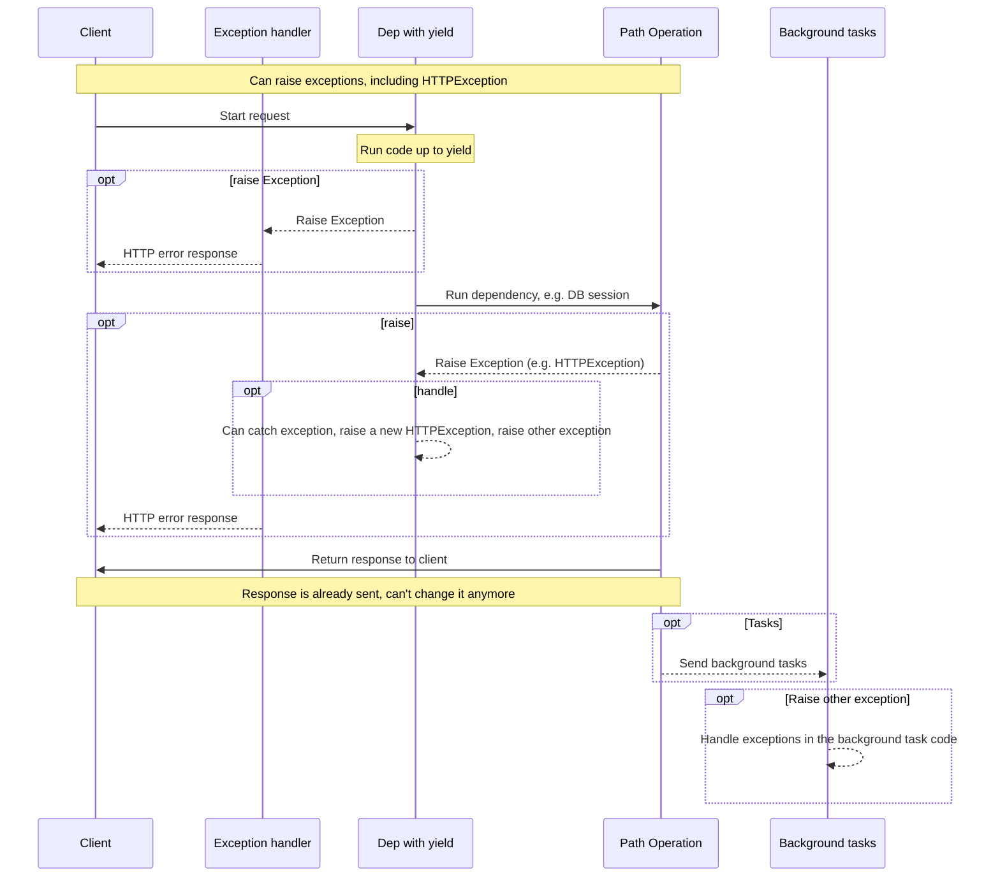
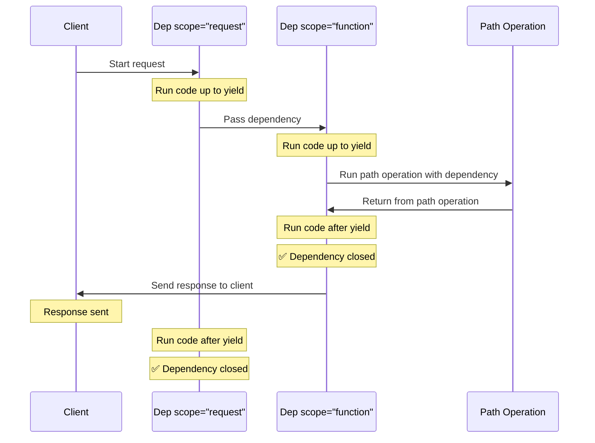

# Dependencies with yield { #dependencies-with-yield }

FastAPI supports dependencies that do some <abbr title='sometimes also called "exit code", "cleanup code", "teardown code", "closing code", "context manager exit code", etc.'>extra steps after finishing</abbr>.

To do this, use `yield` instead of `return`, and write the extra steps (code) after.

/// tip

Make sure to use `yield` one single time per dependency.

///

/// note | Technical Details

Any function that is valid to use with:

* <a href="https://docs.python.org/3/library/contextlib.html#contextlib.contextmanager" class="external-link" target="_blank">`@contextlib.contextmanager`</a> or
* <a href="https://docs.python.org/3/library/contextlib.html#contextlib.asynccontextmanager" class="external-link" target="_blank">`@contextlib.asynccontextmanager`</a>

would be valid to use as a **FastAPI** dependency.

In fact, FastAPI uses those two decorators internally.

///

## A database dependency with `yield` { #a-database-dependency-with-yield }

For example, you could use this to create a database session and close it after finishing.

Only the code prior to and including the `yield` statement is executed before creating a response:

{* ../../docs_src/dependencies/tutorial007.py hl[2:4] *}

The yielded value is what is injected into *path operations* and other dependencies:

{* ../../docs_src/dependencies/tutorial007.py hl[4] *}

The code following the `yield` statement is executed after the response:

{* ../../docs_src/dependencies/tutorial007.py hl[5:6] *}

/// tip

You can use `async` or regular functions.

**FastAPI** will do the right thing with each, the same as with normal dependencies.

///

## A dependency with `yield` and `try` { #a-dependency-with-yield-and-try }

If you use a `try` block in a dependency with `yield`, you'll receive any exception that was thrown when using the dependency.

For example, if some code at some point in the middle, in another dependency or in a *path operation*, made a database transaction "rollback" or created any other exception, you would receive the exception in your dependency.

So, you can look for that specific exception inside the dependency with `except SomeException`.

In the same way, you can use `finally` to make sure the exit steps are executed, no matter if there was an exception or not.

{* ../../docs_src/dependencies/tutorial007.py hl[3,5] *}

## Sub-dependencies with `yield` { #sub-dependencies-with-yield }

You can have sub-dependencies and "trees" of sub-dependencies of any size and shape, and any or all of them can use `yield`.

**FastAPI** will make sure that the "exit code" in each dependency with `yield` is run in the correct order.

For example, `dependency_c` can have a dependency on `dependency_b`, and `dependency_b` on `dependency_a`:

{* ../../docs_src/dependencies/tutorial008_an_py39.py hl[6,14,22] *}

And all of them can use `yield`.

In this case `dependency_c`, to execute its exit code, needs the value from `dependency_b` (here named `dep_b`) to still be available.

And, in turn, `dependency_b` needs the value from `dependency_a` (here named `dep_a`) to be available for its exit code.

{* ../../docs_src/dependencies/tutorial008_an_py39.py hl[18:19,26:27] *}

The same way, you could have some dependencies with `yield` and some other dependencies with `return`, and have some of those depend on some of the others.

And you could have a single dependency that requires several other dependencies with `yield`, etc.

You can have any combinations of dependencies that you want.

**FastAPI** will make sure everything is run in the correct order.

/// note | Technical Details

This works thanks to Python's <a href="https://docs.python.org/3/library/contextlib.html" class="external-link" target="_blank">Context Managers</a>.

**FastAPI** uses them internally to achieve this.

///

## Dependencies with `yield` and `HTTPException` { #dependencies-with-yield-and-httpexception }

You saw that you can use dependencies with `yield` and have `try` blocks that try to execute some code and then run some exit code after `finally`.

You can also use `except` to catch the exception that was raised and do something with it.

For example, you can raise a different exception, like `HTTPException`.

/// tip

This is a somewhat advanced technique, and in most of the cases you won't really need it, as you can raise exceptions (including `HTTPException`) from inside of the rest of your application code, for example, in the *path operation function*.

But it's there for you if you need it. 🤓

///

{* ../../docs_src/dependencies/tutorial008b_an_py39.py hl[18:22,31] *}

If you want to catch exceptions and create a custom response based on that, create a [Custom Exception Handler](../handling-errors.md#install-custom-exception-handlers){.internal-link target=_blank}.

## Dependencies with `yield` and `except` { #dependencies-with-yield-and-except }

If you catch an exception using `except` in a dependency with `yield` and you don't raise it again (or raise a new exception), FastAPI won't be able to notice there was an exception, the same way that would happen with regular Python:

{* ../../docs_src/dependencies/tutorial008c_an_py39.py hl[15:16] *}

In this case, the client will see an *HTTP 500 Internal Server Error* response as it should, given that we are not raising an `HTTPException` or similar, but the server will **not have any logs** or any other indication of what was the error. 😱

### Always `raise` in Dependencies with `yield` and `except` { #always-raise-in-dependencies-with-yield-and-except }

If you catch an exception in a dependency with `yield`, unless you are raising another `HTTPException` or similar, **you should re-raise the original exception**.

You can re-raise the same exception using `raise`:

{* ../../docs_src/dependencies/tutorial008d_an_py39.py hl[17] *}

Now the client will get the same *HTTP 500 Internal Server Error* response, but the server will have our custom `InternalError` in the logs. 😎

## Execution of dependencies with `yield` { #execution-of-dependencies-with-yield }

The sequence of execution is more or less like this diagram. Time flows from top to bottom. And each column is one of the parts interacting or executing code.



/// info

Only **one response** will be sent to the client. It might be one of the error responses or it will be the response from the *path operation*.

After one of those responses is sent, no other response can be sent.

///

/// tip

If you raise any exception in the code from the *path operation function*, it will be passed to the dependencies with yield, including `HTTPException`. In most cases you will want to re-raise that same exception or a new one from the dependency with `yield` to make sure it's properly handled.

///

## Early exit and `scope` { #early-exit-and-scope }

Normally the exit code of dependencies with `yield` is executed **after the response** is sent to the client.

But if you know that you won't need to use the dependency after returning from the *path operation function*, you can use `Depends(scope="function")` to tell FastAPI that it should close the dependency after the *path operation function* returns, but **before** the **response is sent**.

{* ../../docs_src/dependencies/tutorial008e_an_py39.py hl[12,16] *}

`Depends()` receives a `scope` parameter that can be:

* `"function"`: start the dependency before the *path operation function* that handles the request, end the dependency after the *path operation function* ends, but **before** the response is sent back to the client. So, the dependency function will be executed **around** the *path operation **function***.
* `"request"`: start the dependency before the *path operation function* that handles the request (similar to when using `"function"`), but end **after** the response is sent back to the client. So, the dependency function will be executed **around** the **request** and response cycle.

If not specified and the dependency has `yield`, it will have a `scope` of `"request"` by default.

### `scope` for sub-dependencies { #scope-for-sub-dependencies }

When you declare a dependency with a `scope="request"` (the default), any sub-dependency needs to also have a `scope` of `"request"`.

But a dependency with `scope` of `"function"` can have dependencies with `scope` of `"function"` and `scope` of `"request"`.

This is because any dependency needs to be able to run its exit code before the sub-dependencies, as it might need to still use them during its exit code.



## Dependencies with `yield`, `HTTPException`, `except` and Background Tasks { #dependencies-with-yield-httpexception-except-and-background-tasks }

Dependencies with `yield` have evolved over time to cover different use cases and fix some issues.

If you want to see what has changed in different versions of FastAPI, you can read more about it in the advanced guide, in [Advanced Dependencies - Dependencies with `yield`, `HTTPException`, `except` and Background Tasks](../../advanced/advanced-dependencies.md#dependencies-with-yield-httpexception-except-and-background-tasks){.internal-link target=_blank}.
## Context Managers { #context-managers }

### What are "Context Managers" { #what-are-context-managers }

"Context Managers" are any of those Python objects that you can use in a `with` statement.

For example, <a href="https://docs.python.org/3/tutorial/inputoutput.html#reading-and-writing-files" class="external-link" target="_blank">you can use `with` to read a file</a>:

```Python
with open("./somefile.txt") as f:
    contents = f.read()
    print(contents)
```

Underneath, the `open("./somefile.txt")` creates an object that is called a "Context Manager".

When the `with` block finishes, it makes sure to close the file, even if there were exceptions.

When you create a dependency with `yield`, **FastAPI** will internally create a context manager for it, and combine it with some other related tools.

### Using context managers in dependencies with `yield` { #using-context-managers-in-dependencies-with-yield }

/// warning

This is, more or less, an "advanced" idea.

If you are just starting with **FastAPI** you might want to skip it for now.

///

In Python, you can create Context Managers by <a href="https://docs.python.org/3/reference/datamodel.html#context-managers" class="external-link" target="_blank">creating a class with two methods: `__enter__()` and `__exit__()`</a>.

You can also use them inside of **FastAPI** dependencies with `yield` by using
`with` or `async with` statements inside of the dependency function:

{* ../../docs_src/dependencies/tutorial010.py hl[1:9,13] *}

/// tip

Another way to create a context manager is with:

* <a href="https://docs.python.org/3/library/contextlib.html#contextlib.contextmanager" class="external-link" target="_blank">`@contextlib.contextmanager`</a> or
* <a href="https://docs.python.org/3/library/contextlib.html#contextlib.asynccontextmanager" class="external-link" target="_blank">`@contextlib.asynccontextmanager`</a>

using them to decorate a function with a single `yield`.

That's what **FastAPI** uses internally for dependencies with `yield`.

But you don't have to use the decorators for FastAPI dependencies (and you shouldn't).

FastAPI will do it for you internally.

///
