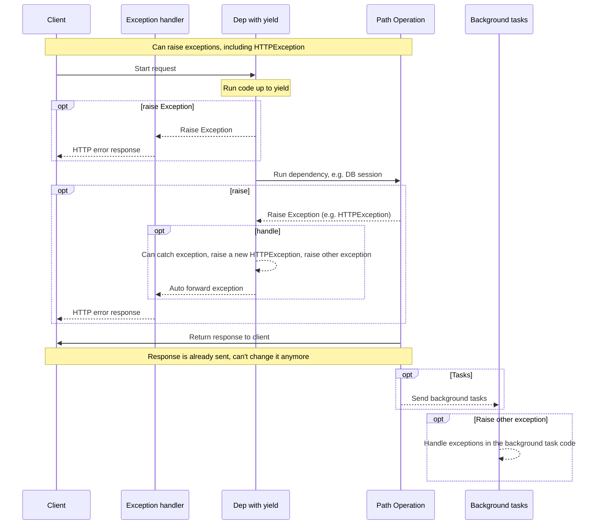

# Dependencies with yield

FastAPI supports dependencies that do some <abbr title='sometimes also called "exit code", "cleanup code", "teardown code", "closing code", "context manager exit code", etc.'>extra steps after finishing</abbr>.

To do this, use `yield` instead of `return`, and write the extra steps (code) after.

!!! tip
    Make sure to use `yield` one single time.

!!! note "Technical Details"
    Any function that is valid to use with:

    * <a href="https://docs.python.org/3/library/contextlib.html#contextlib.contextmanager" class="external-link" target="_blank">`@contextlib.contextmanager`</a> or
    * <a href="https://docs.python.org/3/library/contextlib.html#contextlib.asynccontextmanager" class="external-link" target="_blank">`@contextlib.asynccontextmanager`</a>

    would be valid to use as a **FastAPI** dependency.

    In fact, FastAPI uses those two decorators internally.

## A database dependency with `yield`

For example, you could use this to create a database session and close it after finishing.

Only the code prior to and including the `yield` statement is executed before creating a response:

```Python hl_lines="2-4"
{!../../../docs_src/dependencies/tutorial007.py!}
```

The yielded value is what is injected into *path operations* and other dependencies:

```Python hl_lines="4"
{!../../../docs_src/dependencies/tutorial007.py!}
```

The code following the `yield` statement is executed after the response has been delivered:

```Python hl_lines="5-6"
{!../../../docs_src/dependencies/tutorial007.py!}
```

!!! tip
    You can use `async` or regular functions.

    **FastAPI** will do the right thing with each, the same as with normal dependencies.

## A dependency with `yield` and `try`

If you use a `try` block in a dependency with `yield`, you'll receive any exception that was thrown when using the dependency.

For example, if some code at some point in the middle, in another dependency or in a *path operation*, made a database transaction "rollback" or create any other error, you will receive the exception in your dependency.

So, you can look for that specific exception inside the dependency with `except SomeException`.

In the same way, you can use `finally` to make sure the exit steps are executed, no matter if there was an exception or not.

```Python hl_lines="3  5"
{!../../../docs_src/dependencies/tutorial007.py!}
```

## Sub-dependencies with `yield`

You can have sub-dependencies and "trees" of sub-dependencies of any size and shape, and any or all of them can use `yield`.

**FastAPI** will make sure that the "exit code" in each dependency with `yield` is run in the correct order.

For example, `dependency_c` can have a dependency on `dependency_b`, and `dependency_b` on `dependency_a`:

=== "Python 3.9+"

    ```Python hl_lines="6  14  22"
    {!> ../../../docs_src/dependencies/tutorial008_an_py39.py!}
    ```

=== "Python 3.8+"

    ```Python hl_lines="5  13  21"
    {!> ../../../docs_src/dependencies/tutorial008_an.py!}
    ```

=== "Python 3.8+ non-Annotated"

    !!! tip
        Prefer to use the `Annotated` version if possible.

    ```Python hl_lines="4  12  20"
    {!> ../../../docs_src/dependencies/tutorial008.py!}
    ```

And all of them can use `yield`.

In this case `dependency_c`, to execute its exit code, needs the value from `dependency_b` (here named `dep_b`) to still be available.

And, in turn, `dependency_b` needs the value from `dependency_a` (here named `dep_a`) to be available for its exit code.

=== "Python 3.9+"

    ```Python hl_lines="18-19  26-27"
    {!> ../../../docs_src/dependencies/tutorial008_an_py39.py!}
    ```

=== "Python 3.8+"

    ```Python hl_lines="17-18  25-26"
    {!> ../../../docs_src/dependencies/tutorial008_an.py!}
    ```

=== "Python 3.8+ non-Annotated"

    !!! tip
        Prefer to use the `Annotated` version if possible.

    ```Python hl_lines="16-17  24-25"
    {!> ../../../docs_src/dependencies/tutorial008.py!}
    ```

The same way, you could have some dependencies with `yield` and some other dependencies with `return`, and have some of those depend on some of the others.

And you could have a single dependency that requires several other dependencies with `yield`, etc.

You can have any combinations of dependencies that you want.

**FastAPI** will make sure everything is run in the correct order.

!!! note "Technical Details"
    This works thanks to Python's <a href="https://docs.python.org/3/library/contextlib.html" class="external-link" target="_blank">Context Managers</a>.

    **FastAPI** uses them internally to achieve this.

## Dependencies with `yield` and `HTTPException`

You saw that you can use dependencies with `yield` and have `try` blocks that catch exceptions.

The same way, you could raise an `HTTPException` or similar in the exit code, after the `yield`.

!!! tip

    This is a somewhat advanced technique, and in most of the cases you won't really need it, as you can raise exceptions (including `HTTPException`) from inside of the rest of your application code, for example, in the *path operation function*.

    But it's there for you if you need it. 🤓

=== "Python 3.9+"

    ```Python hl_lines="18-22  31"
    {!> ../../../docs_src/dependencies/tutorial008b_an_py39.py!}
    ```

=== "Python 3.8+"

    ```Python hl_lines="17-21  30"
    {!> ../../../docs_src/dependencies/tutorial008b_an.py!}
    ```

=== "Python 3.8+ non-Annotated"

    !!! tip
        Prefer to use the `Annotated` version if possible.

    ```Python hl_lines="16-20  29"
    {!> ../../../docs_src/dependencies/tutorial008b.py!}
    ```

An alternative you could use to catch exceptions (and possibly also raise another `HTTPException`) is ot create a [Custom Exception Handler](../handling-errors.md#install-custom-exception-handlers){.internal-link target=_blank}.

## Execution of dependencies with `yield`

The sequence of execution is more or less like this diagram. Time flows from top to bottom. And each column is one of the parts interacting or executing code.



!!! info
    Only **one response** will be sent to the client. It might be one of the error responses or it will be the response from the *path operation*.

    After one of those responses is sent, no other response can be sent.

!!! tip
    This diagram shows `HTTPException`, but you could also raise any other exception that you catch in a dependency with `yield` or with a [Custom Exception Handler](../handling-errors.md#install-custom-exception-handlers){.internal-link target=_blank}.

    If you raise any exception, it will be passed to the dependencies with yield, including `HTTPException`, and then **again** to the exception handlers. If there's no exception handler for that exception, it will then be handled by the default internal `ServerErrorMiddleware`, returning a 500 HTTP status code, to let the client know that there was an error in the server.

## Dependencies with `yield`, `HTTPException` and Background Tasks

!!! warning
    You most probably don't need these technical details, you can skip this section and continue below.

    These details are useful mainly if you were using a version of FastAPI prior to 0.106.0 and used resources from dependencies with `yield` in background tasks.

Before FastAPI 0.106.0, raising exceptions after `yield` was not possible, the exit code in dependencies with `yield` was executed *after* the response was sent, so [Exception Handlers](../handling-errors.md#install-custom-exception-handlers){.internal-link target=_blank} would have already run.

This was designed this way mainly to allow using the same objects "yielded" by dependencies inside of background tasks, because the exit code would be executed after the background tasks were finished.

Nevertheless, as this would mean waiting for the response to travel through the network while unnecessarily holding a resource in a dependency with yield (for example a database connection), this was changed in FastAPI 0.106.0.

!!! tip

    Additionally, a background task is normally an independent set of logic that should be handled separately, with its own resources (e.g. its own database connection).

    So, this way you will probably have cleaner code.

If you used to rely on this behavior, now you should create the resources for background tasks inside the background task itself, and use internally only data that doesn't depend on the resources of dependencies with `yield`.

For example, instead of using the same database session, you would create a new database session inside of the background task, and you would obtain the objects from the database using this new session. And then instead of passing the object from the database as a parameter to the background task function, you would pass the ID of that object and then obtain the object again inside the background task function.

## Context Managers

### What are "Context Managers"

"Context Managers" are any of those Python objects that you can use in a `with` statement.

For example, <a href="https://docs.python.org/3/tutorial/inputoutput.html#reading-and-writing-files" class="external-link" target="_blank">you can use `with` to read a file</a>:

```Python
with open("./somefile.txt") as f:
    contents = f.read()
    print(contents)
```

Underneath, the `open("./somefile.txt")` creates an object that is a called a "Context Manager".

When the `with` block finishes, it makes sure to close the file, even if there were exceptions.

When you create a dependency with `yield`, **FastAPI** will internally create a context manager for it, and combine it with some other related tools.

### Using context managers in dependencies with `yield`

!!! warning
    This is, more or less, an "advanced" idea.

    If you are just starting with **FastAPI** you might want to skip it for now.

In Python, you can create Context Managers by <a href="https://docs.python.org/3/reference/datamodel.html#context-managers" class="external-link" target="_blank">creating a class with two methods: `__enter__()` and `__exit__()`</a>.

You can also use them inside of **FastAPI** dependencies with `yield` by using
`with` or `async with` statements inside of the dependency function:

```Python hl_lines="1-9  13"
{!../../../docs_src/dependencies/tutorial010.py!}
```

!!! tip
    Another way to create a context manager is with:

    * <a href="https://docs.python.org/3/library/contextlib.html#contextlib.contextmanager" class="external-link" target="_blank">`@contextlib.contextmanager`</a> or
    * <a href="https://docs.python.org/3/library/contextlib.html#contextlib.asynccontextmanager" class="external-link" target="_blank">`@contextlib.asynccontextmanager`</a>

    using them to decorate a function with a single `yield`.

    That's what **FastAPI** uses internally for dependencies with `yield`.

    But you don't have to use the decorators for FastAPI dependencies (and you shouldn't).

    FastAPI will do it for you internally.
