# Dependencies with yield

FastAPI supports dependencies that do some <abbr title='sometimes also called "exit", "cleanup", "teardown", "close", "context managers", ...'>extra steps after finishing</abbr>.

To do this, use `yield` instead of `return`, and write the extra steps after.

!!! tip
    Make sure to use `yield` one single time.

!!! note "Technical Details"
    Any function that is valid to use with:

    * <a href="https://docs.python.org/3/library/contextlib.html#contextlib.contextmanager" class="external-link" target="_blank">`@contextlib.contextmanager`</a> or 
    * <a href="https://docs.python.org/3/library/contextlib.html#contextlib.asynccontextmanager" class="external-link" target="_blank">`@contextlib.asynccontextmanager`</a>

    would be valid to use as a **FastAPI** dependency.

    In fact, FastAPI uses those two decorators internally.

## A database dependency with `yield`

For example, you could use this to create a database session and close it after finishing.

Only the code prior to and including the `yield` statement is executed before sending a response:

```Python hl_lines="2-4"
{!../../../docs_src/dependencies/tutorial007.py!}
```

The yielded value is what is injected into *path operations* and other dependencies:

```Python hl_lines="4"
{!../../../docs_src/dependencies/tutorial007.py!}
```

The code following the `yield` statement is executed after the response has been delivered:

```Python hl_lines="5-6"
{!../../../docs_src/dependencies/tutorial007.py!}
```

!!! tip
    You can use `async` or normal functions.

    **FastAPI** will do the right thing with each, the same as with normal dependencies.

## A dependency with `yield` and `try`

If you use a `try` block in a dependency with `yield`, you'll receive any exception that was thrown when using the dependency.

For example, if some code at some point in the middle, in another dependency or in a *path operation*, made a database transaction "rollback" or create any other error, you will receive the exception in your dependency.

So, you can look for that specific exception inside the dependency with `except SomeException`.

In the same way, you can use `finally` to make sure the exit steps are executed, no matter if there was an exception or not.

```Python hl_lines="3  5"
{!../../../docs_src/dependencies/tutorial007.py!}
```

## Sub-dependencies with `yield`

You can have sub-dependencies and "trees" of sub-dependencies of any size and shape, and any or all of them can use `yield`.

**FastAPI** will make sure that the "exit code" in each dependency with `yield` is run in the correct order.

For example, `dependency_c` can have a dependency on `dependency_b`, and `dependency_b` on `dependency_a`:

```Python hl_lines="4  12  20"
{!../../../docs_src/dependencies/tutorial008.py!}
```

And all of them can use `yield`.

In this case `dependency_c`, to execute its exit code, needs the value from `dependency_b` (here named `dep_b`) to still be available.

And, in turn, `dependency_b` needs the value from `dependency_a` (here named `dep_a`) to be available for its exit code.

```Python hl_lines="16-17  24-25"
{!../../../docs_src/dependencies/tutorial008.py!}
```

The same way, you could have dependencies with `yield` and `return` mixed.

And you could have a single dependency that requires several other dependencies with `yield`, etc.

You can have any combinations of dependencies that you want.

**FastAPI** will make sure everything is run in the correct order.

!!! note "Technical Details"
    This works thanks to Python's <a href="https://docs.python.org/3/library/contextlib.html" class="external-link" target="_blank">Context Managers</a>.

    **FastAPI** uses them internally to achieve this.

## Dependencies with `yield` and `HTTPException`

You saw that you can use dependencies with `yield` and have `try` blocks that catch exceptions.

It might be tempting to raise an `HTTPException` or similar in the exit code, after the `yield`. But **it won't work**.

The exit code in dependencies with `yield` is executed *after* [Exception Handlers](../handling-errors.md#install-custom-exception-handlers){.internal-link target=_blank}. There's nothing catching exceptions thrown by your dependencies in the exit code (after the `yield`).

So, if you raise an `HTTPException` after the `yield`, the default (or any custom) exception handler that catches `HTTPException`s and returns an HTTP 400 response won't be there to catch that exception anymore.

This is what allows anything set in the dependency (e.g. a DB session) to, for example, be used by background tasks.

Background tasks are run *after* the response has been sent. So there's no way to raise an `HTTPException` because there's not even a way to change the response that is *already sent*.

But if a background task creates a DB error, at least you can rollback or cleanly close the session in the dependency with `yield`, and maybe log the error or report it to a remote tracking system.

If you have some code that you know could raise an exception, do the most normal/"Pythonic" thing and add a `try` block in that section of the code.

If you have custom exceptions that you would like to handle *before* returning the response and possibly modifying the response, maybe even raising an `HTTPException`, create a [Custom Exception Handler](../handling-errors.md#install-custom-exception-handlers){.internal-link target=_blank}.

!!! tip
    You can still raise exceptions including `HTTPException` *before* the `yield`. But not after.

The sequence of execution is more or less like this diagram. Time flows from top to bottom. And each column is one of the parts interacting or executing code.

```mermaid
sequenceDiagram

participant client as Client
participant handler as Exception handler
participant dep as Dep with yield
participant operation as Path Operation
participant tasks as Background tasks

    Note over client,tasks: Can raise exception for dependency, handled after response is sent
    Note over client,operation: Can raise HTTPException and can change the response
    client ->> dep: Start request
    Note over dep: Run code up to yield
    opt raise
        dep -->> handler: Raise HTTPException
        handler -->> client: HTTP error response
        dep -->> dep: Raise other exception
    end
    dep ->> operation: Run dependency, e.g. DB session
    opt raise
        operation -->> handler: Raise HTTPException
        handler -->> client: HTTP error response
        operation -->> dep: Raise other exception
    end
    operation ->> client: Return response to client
    Note over client,operation: Response is already sent, can't change it anymore
    opt Tasks
        operation -->> tasks: Send background tasks
    end
    opt Raise other exception
        tasks -->> dep: Raise other exception
    end
    Note over dep: After yield
    opt Handle other exception
        dep -->> dep: Handle exception, can't change response. E.g. close DB session.
    end
```



!!! info
    Only **one response** will be sent to the client. It might be one of the error responses or it will be the response from the *path operation*.

    After one of those responses is sent, no other response can be sent.

!!! tip
    This diagram shows `HTTPException`, but you could also raise any other exception for which you create a [Custom Exception Handler](../handling-errors.md#install-custom-exception-handlers){.internal-link target=_blank}. And that exception would be handled by that custom exception handler instead of the dependency exit code.

    But if you raise an exception that is not handled by the exception handlers, it will be handled by the exit code of the dependency.

## Context Managers

### What are "Context Managers"

"Context Managers" are any of those Python objects that you can use in a `with` statement.

For example, <a href="https://docs.python.org/3/tutorial/inputoutput.html#reading-and-writing-files" class="external-link" target="_blank">you can use `with` to read a file</a>:

```Python
with open("./somefile.txt") as f:
    contents = f.read()
    print(contents)
```

Underneath, the `open("./somefile.txt")` creates an object that is a called a "Context Manager".

When the `with` block finishes, it makes sure to close the file, even if there were exceptions.

When you create a dependency with `yield`, **FastAPI** will internally convert it to a context manager, and combine it with some other related tools.

### Using context managers in dependencies with `yield`

!!! warning
    This is, more or less, an "advanced" idea.

    If you are just starting with **FastAPI** you might want to skip it for now.

In Python, you can create Context Managers by <a href="https://docs.python.org/3/reference/datamodel.html#context-managers" class="external-link" target="_blank">creating a class with two methods: `__enter__()` and `__exit__()`</a>.

You can also use them inside of **FastAPI** dependencies with `yield` by using
`with` or `async with` statements inside of the dependency function:

```Python hl_lines="1-9  13"
{!../../../docs_src/dependencies/tutorial010.py!}
```

!!! tip
    Another way to create a context manager is with:

    * <a href="https://docs.python.org/3/library/contextlib.html#contextlib.contextmanager" class="external-link" target="_blank">`@contextlib.contextmanager`</a> or 
    * <a href="https://docs.python.org/3/library/contextlib.html#contextlib.asynccontextmanager" class="external-link" target="_blank">`@contextlib.asynccontextmanager`</a>

    using them to decorate a function with a single `yield`.

    That's what **FastAPI** uses internally for dependencies with `yield`.

    But you don't have to use the decorators for FastAPI dependencies (and you shouldn't).

    FastAPI will do it for you internally.
