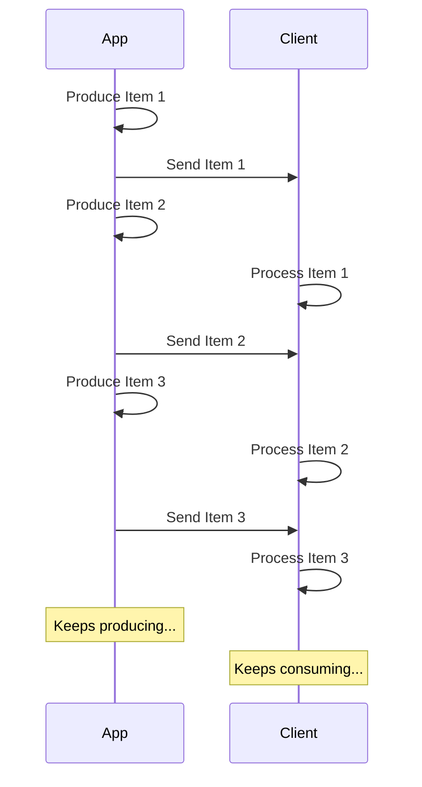

# Stream JSON Lines { #stream-json-lines }

You could have a sequence of data that you would like to send in a "**stream**", you could do it with **JSON Lines**.

## What is a Stream? { #what-is-a-stream }

"**Streaming**" data means that your app will start sending data items to the client without waiting for the entire sequence of items to be ready.

So, it will send the first item, the client will receive and start processing it, and you might still be producing the next item.



It could even be an infinite stream, where you keep sending data.

## JSON Lines { #json-lines }

In these cases, it's common to send "**JSON Lines**", which is a format where you send one JSON object per line.

A response would have a content type of `application/jsonl` (instead of `application/json`) and the body would be something like:

```json
{"name": "Plumbus", "description": "A multi-purpose household device."}
{"name": "Portal Gun", "description": "A portal opening device."}
{"name": "Meeseeks Box", "description": "A box that summons a Meeseeks."}
```

It's very similar to a JSON array (equivalent of a Python list), but instead of being wrapped in `[]` and having `,` between the items, it has **one JSON object per line**, they are separated by a new line character.

/// info

The important point is that your app will be able to produce each line in turn, while the client consumes the previous lines.

///

/// note | Technical Details

Because each JSON object will be separated by a new line, they can't contain literal new line characters in their content, but they can contain escaped new lines (`\n`), which is part of the JSON standard.

But normally you won't have to worry about it, it's done automatically, continue reading. 🤓

///

## Use Cases { #use-cases }

You could use this to stream data from an **AI LLM** service, from **logs** or **telemetry**, or from other types of data that can be structured in **JSON** items.

/// tip

If you want to stream binary data, for example video or audio, check the advanced guide: [Stream Data](../advanced/stream-data.md).

///

## Stream JSON Lines with FastAPI { #stream-json-lines-with-fastapi }

To stream JSON Lines with FastAPI you can, instead of using `return` in your *path operation function*, use `yield` to produce each item in turn.

{* ../../docs_src/stream_json_lines/tutorial001_py310.py ln[1:24] hl[24] *}

If each JSON item you want to send back is of type `Item` (a Pydantic model) and it's an async function, you can declare the return type as `AsyncIterable[Item]`:

{* ../../docs_src/stream_json_lines/tutorial001_py310.py ln[1:24] hl[9:11,22] *}

If you declare the return type, FastAPI will use it to **validate** the data, **document** it in OpenAPI, **filter** it, and **serialize** it using Pydantic.

/// tip

As Pydantic will serialize it in the **Rust** side, you will get much higher **performance** than if you don't declare a return type.

///

### Non-async *path operation functions* { #non-async-path-operation-functions }

You can also use regular `def` functions (without `async`), and use `yield` the same way.

FastAPI will make sure it's run correctly so that it doesn't block the event loop.

As in this case the function is not async, the right return type would be `Iterable[Item]`:

{* ../../docs_src/stream_json_lines/tutorial001_py310.py ln[27:30] hl[28] *}

### No Return Type { #no-return-type }

You can also omit the return type. FastAPI will then use the [`jsonable_encoder`](./encoder.md){.internal-link target=_blank} to convert the data to something that can be serialized to JSON and then send it as JSON Lines.

{* ../../docs_src/stream_json_lines/tutorial001_py310.py ln[33:36] hl[34] *}

## Server-Sent Events (SSE) { #server-sent-events-sse }

FastAPI also has first-class support for Server-Sent Events (SSE), which are quite similar but with a couple of extra details. You can learn about them in the next chapter: [Server-Sent Events (SSE)](server-sent-events.md){.internal-link target=_blank}. 🤓
