# Virtual Environments { #virtual-environments }

When you work in Python projects you probably should use a **virtual environment** (or a similar mechanism) to isolate the packages you install for each project.

/// info

If you already know about virtual environments, how to create them and use them, you might want to skip this section. 🤓

///

/// tip

A **virtual environment** is different than an **environment variable**.

An **environment variable** is a variable in the system that can be used by programs.

A **virtual environment** is a directory with some files in it.

///

/// info

This page will teach you how to use **virtual environments** and how they work.

If you are ready to adopt a **tool that manages everything** for you (including installing Python), try <a href="https://github.com/astral-sh/uv" class="external-link" target="_blank">uv</a>.

///

## Create a Project { #create-a-project }

First, create a directory for your project.

What I normally do is that I create a directory named `code` inside my home/user directory.

And inside of that I create one directory per project.

<div class="termy">

```console
// Go to the home directory
$ cd
// Create a directory for all your code projects
$ mkdir code
// Enter into that code directory
$ cd code
// Create a directory for this project
$ mkdir awesome-project
// Enter into that project directory
$ cd awesome-project
```

</div>

## Create a Virtual Environment { #create-a-virtual-environment }

When you start working on a Python project **for the first time**, create a virtual environment **<abbr title="there are other options, this is a simple guideline">inside your project</abbr>**.

/// tip

You only need to do this **once per project**, not every time you work.

///

//// tab | `venv`

To create a virtual environment, you can use the `venv` module that comes with Python.

<div class="termy">

```console
$ python -m venv .venv
```

</div>

/// details | What that command means

* `python`: use the program called `python`
* `-m`: call a module as a script, we'll tell it which module next
* `venv`: use the module called `venv` that normally comes installed with Python
* `.venv`: create the virtual environment in the new directory `.venv`

///

////

//// tab | `uv`

If you have <a href="https://github.com/astral-sh/uv" class="external-link" target="_blank">`uv`</a> installed, you can use it to create a virtual environment.

<div class="termy">

```console
$ uv venv
```

</div>

/// tip

By default, `uv` will create a virtual environment in a directory called `.venv`.

But you could customize it passing an additional argument with the directory name.

///

////

That command creates a new virtual environment in a directory called `.venv`.

/// details | `.venv` or other name

You could create the virtual environment in a different directory, but there's a convention of calling it `.venv`.

///

## Activate the Virtual Environment { #activate-the-virtual-environment }

Activate the new virtual environment so that any Python command you run or package you install uses it.

/// tip

Do this **every time** you start a **new terminal session** to work on the project.

///

//// tab | Linux, macOS

<div class="termy">

```console
$ source .venv/bin/activate
```

</div>

////

//// tab | Windows PowerShell

<div class="termy">

```console
$ .venv\Scripts\Activate.ps1
```

</div>

////

//// tab | Windows Bash

Or if you use Bash for Windows (e.g. <a href="https://gitforwindows.org/" class="external-link" target="_blank">Git Bash</a>):

<div class="termy">

```console
$ source .venv/Scripts/activate
```

</div>

////

/// tip

Every time you install a **new package** in that environment, **activate** the environment again.

This makes sure that if you use a **terminal (<abbr title="command line interface">CLI</abbr>) program** installed by that package, you use the one from your virtual environment and not any other that could be installed globally, probably with a different version than what you need.

///

## Check the Virtual Environment is Active { #check-the-virtual-environment-is-active }

Check that the virtual environment is active (the previous command worked).

/// tip

This is **optional**, but it's a good way to **check** that everything is working as expected and you are using the virtual environment you intended.

///

//// tab | Linux, macOS, Windows Bash

<div class="termy">

```console
$ which python

/home/user/code/awesome-project/.venv/bin/python
```

</div>

If it shows the `python` binary at `.venv/bin/python`, inside of your project (in this case `awesome-project`), then it worked. 🎉

////

//// tab | Windows PowerShell

<div class="termy">

```console
$ Get-Command python

C:\Users\user\code\awesome-project\.venv\Scripts\python
```

</div>

If it shows the `python` binary at `.venv\Scripts\python`, inside of your project (in this case `awesome-project`), then it worked. 🎉

////

## Upgrade `pip` { #upgrade-pip }

/// tip

If you use <a href="https://github.com/astral-sh/uv" class="external-link" target="_blank">`uv`</a> you would use it to install things instead of `pip`, so you don't need to upgrade `pip`. 😎

///

If you are using `pip` to install packages (it comes by default with Python), you should **upgrade** it to the latest version.

Many exotic errors while installing a package are solved by just upgrading `pip` first.

/// tip

You would normally do this **once**, right after you create the virtual environment.

///

Make sure the virtual environment is active (with the command above) and then run:

<div class="termy">

```console
$ python -m pip install --upgrade pip

---> 100%
```

</div>

/// tip

Sometimes, you might get a **`No module named pip`** error when trying to upgrade pip.

If this happens, install and upgrade pip using the command below:

<div class="termy">

```console
$ python -m ensurepip --upgrade

---> 100%
```

</div>

This command will install pip if it is not already installed and also ensures that the installed version of pip is at least as recent as the one available in `ensurepip`.

///

## Add `.gitignore` { #add-gitignore }

If you are using **Git** (you should), add a `.gitignore` file to exclude everything in your `.venv` from Git.

/// tip

If you used <a href="https://github.com/astral-sh/uv" class="external-link" target="_blank">`uv`</a> to create the virtual environment, it already did this for you, you can skip this step. 😎

///

/// tip

Do this **once**, right after you create the virtual environment.

///

<div class="termy">

```console
$ echo "*" > .venv/.gitignore
```

</div>

/// details | What that command means

* `echo "*"`: will "print" the text `*` in the terminal (the next part changes that a bit)
* `>`: anything printed to the terminal by the command to the left of `>` should not be printed but instead written to the file that goes to the right of `>`
* `.gitignore`: the name of the file where the text should be written

And `*` for Git means "everything". So, it will ignore everything in the `.venv` directory.

That command will create a file `.gitignore` with the content:

```gitignore
*
```

///

## Install Packages { #install-packages }

After activating the environment, you can install packages in it.

/// tip

Do this **once** when installing or upgrading the packages your project needs.

If you need to upgrade a version or add a new package you would **do this again**.

///

### Install Packages Directly { #install-packages-directly }

If you're in a hurry and don't want to use a file to declare your project's package requirements, you can install them directly.

/// tip

It's a (very) good idea to put the packages and versions your program needs in a file (for example `requirements.txt` or `pyproject.toml`).

///

//// tab | `pip`

<div class="termy">

```console
$ pip install "fastapi[standard]"

---> 100%
```

</div>

////

//// tab | `uv`

If you have <a href="https://github.com/astral-sh/uv" class="external-link" target="_blank">`uv`</a>:

<div class="termy">

```console
$ uv pip install "fastapi[standard]"
---> 100%
```

</div>

////

### Install from `requirements.txt` { #install-from-requirements-txt }

If you have a `requirements.txt`, you can now use it to install its packages.

//// tab | `pip`

<div class="termy">

```console
$ pip install -r requirements.txt
---> 100%
```

</div>

////

//// tab | `uv`

If you have <a href="https://github.com/astral-sh/uv" class="external-link" target="_blank">`uv`</a>:

<div class="termy">

```console
$ uv pip install -r requirements.txt
---> 100%
```

</div>

////

/// details | `requirements.txt`

A `requirements.txt` with some packages could look like:

```requirements.txt
fastapi[standard]==0.113.0
pydantic==2.8.0
```

///

## Run Your Program { #run-your-program }

After you activated the virtual environment, you can run your program, and it will use the Python inside of your virtual environment with the packages you installed there.

<div class="termy">

```console
$ python main.py

Hello World
```

</div>

## Configure Your Editor { #configure-your-editor }

You would probably use an editor, make sure you configure it to use the same virtual environment you created (it will probably autodetect it) so that you can get autocompletion and inline errors.

For example:

* <a href="https://code.visualstudio.com/docs/python/environments#_select-and-activate-an-environment" class="external-link" target="_blank">VS Code</a>
* <a href="https://www.jetbrains.com/help/pycharm/creating-virtual-environment.html" class="external-link" target="_blank">PyCharm</a>

/// tip

You normally have to do this only **once**, when you create the virtual environment.

///

## Deactivate the Virtual Environment { #deactivate-the-virtual-environment }

Once you are done working on your project you can **deactivate** the virtual environment.

<div class="termy">

```console
$ deactivate
```

</div>

This way, when you run `python` it won't try to run it from that virtual environment with the packages installed there.

## Ready to Work { #ready-to-work }

Now you're ready to start working on your project.


/// tip

Do you want to understand what's all that above?

Continue reading. 👇🤓

///

## Why Virtual Environments { #why-virtual-environments }

To work with FastAPI you need to install <a href="https://www.python.org/" class="external-link" target="_blank">Python</a>.

After that, you would need to **install** FastAPI and any other **packages** you want to use.

To install packages you would normally use the `pip` command that comes with Python (or similar alternatives).

Nevertheless, if you just use `pip` directly, the packages would be installed in your **global Python environment** (the global installation of Python).

### The Problem { #the-problem }

So, what's the problem with installing packages in the global Python environment?

At some point, you will probably end up writing many different programs that depend on **different packages**. And some of these projects you work on will depend on **different versions** of the same package. 😱

For example, you could create a project called `philosophers-stone`, this program depends on another package called **`harry`, using the version `1`**. So, you need to install `harry`.


Then, at some point later, you create another project called `prisoner-of-azkaban`, and this project also depends on `harry`, but this project needs **`harry` version `3`**.


But now the problem is, if you install the packages globally (in the global environment) instead of in a local **virtual environment**, you will have to choose which version of `harry` to install.

If you want to run `philosophers-stone` you will need to first install `harry` version `1`, for example with:

<div class="termy">

```console
$ pip install "harry==1"
```

</div>

And then you would end up with `harry` version `1` installed in your global Python environment.


But then if you want to run `prisoner-of-azkaban`, you will need to uninstall `harry` version `1` and install `harry` version `3` (or just installing version `3` would automatically uninstall version `1`).

<div class="termy">

```console
$ pip install "harry==3"
```

</div>

And then you would end up with `harry` version `3` installed in your global Python environment.

And if you try to run `philosophers-stone` again, there's a chance it would **not work** because it needs `harry` version `1`.

```mermaid
flowchart LR
    subgraph global[global env]
        harry-1[<strike>harry v1</strike>]
        style harry-1 fill:#ccc,stroke-dasharray: 5 5
        harry-3[harry v3]
    end
    subgraph stone-project[philosophers-stone project]
        stone(philosophers-stone) -.-x|⛔️| harry-1
    end
    subgraph azkaban-project[prisoner-of-azkaban project]
        azkaban(prisoner-of-azkaban) --> |requires| harry-3
    end
```



/// tip

It's very common in Python packages to try the best to **avoid breaking changes** in **new versions**, but it's better to be safe, and install newer versions intentionally and when you can run the tests to check everything is working correctly.

///

Now, imagine that with **many** other **packages** that all your **projects depend on**. That's very difficult to manage. And you would probably end up running some projects with some **incompatible versions** of the packages, and not knowing why something isn't working.

Also, depending on your operating system (e.g. Linux, Windows, macOS), it could have come with Python already installed. And in that case it probably had some packages pre-installed with some specific versions **needed by your system**. If you install packages in the global Python environment, you could end up **breaking** some of the programs that came with your operating system.

## Where are Packages Installed { #where-are-packages-installed }

When you install Python, it creates some directories with some files in your computer.

Some of these directories are the ones in charge of having all the packages you install.

When you run:

<div class="termy">

```console
// Don't run this now, it's just an example 🤓
$ pip install "fastapi[standard]"
---> 100%
```

</div>

That will download a compressed file with the FastAPI code, normally from <a href="https://pypi.org/project/fastapi/" class="external-link" target="_blank">PyPI</a>.

It will also **download** files for other packages that FastAPI depends on.

Then it will **extract** all those files and put them in a directory in your computer.

By default, it will put those files downloaded and extracted in the directory that comes with your Python installation, that's the **global environment**.

## What are Virtual Environments { #what-are-virtual-environments }

The solution to the problems of having all the packages in the global environment is to use a **virtual environment for each project** you work on.

A virtual environment is a **directory**, very similar to the global one, where you can install the packages for a project.

This way, each project will have its own virtual environment (`.venv` directory) with its own packages.


## What Does Activating a Virtual Environment Mean { #what-does-activating-a-virtual-environment-mean }

When you activate a virtual environment, for example with:

//// tab | Linux, macOS

<div class="termy">

```console
$ source .venv/bin/activate
```

</div>

////

//// tab | Windows PowerShell

<div class="termy">

```console
$ .venv\Scripts\Activate.ps1
```

</div>

////

//// tab | Windows Bash

Or if you use Bash for Windows (e.g. <a href="https://gitforwindows.org/" class="external-link" target="_blank">Git Bash</a>):

<div class="termy">

```console
$ source .venv/Scripts/activate
```

</div>

////

That command will create or modify some [environment variables](environment-variables.md){.internal-link target=_blank} that will be available for the next commands.

One of those variables is the `PATH` variable.

/// tip

You can learn more about the `PATH` environment variable in the [Environment Variables](environment-variables.md#path-environment-variable){.internal-link target=_blank} section.

///

Activating a virtual environment adds its path `.venv/bin` (on Linux and macOS) or `.venv\Scripts` (on Windows) to the `PATH` environment variable.

Let's say that before activating the environment, the `PATH` variable looked like this:

//// tab | Linux, macOS

```plaintext
/usr/bin:/bin:/usr/sbin:/sbin
```

That means that the system would look for programs in:

* `/usr/bin`
* `/bin`
* `/usr/sbin`
* `/sbin`

////

//// tab | Windows

```plaintext
C:\Windows\System32
```

That means that the system would look for programs in:

* `C:\Windows\System32`

////

After activating the virtual environment, the `PATH` variable would look something like this:

//// tab | Linux, macOS

```plaintext
/home/user/code/awesome-project/.venv/bin:/usr/bin:/bin:/usr/sbin:/sbin
```

That means that the system will now start looking first for programs in:

```plaintext
/home/user/code/awesome-project/.venv/bin
```

before looking in the other directories.

So, when you type `python` in the terminal, the system will find the Python program in

```plaintext
/home/user/code/awesome-project/.venv/bin/python
```

and use that one.

////

//// tab | Windows

```plaintext
C:\Users\user\code\awesome-project\.venv\Scripts;C:\Windows\System32
```

That means that the system will now start looking first for programs in:

```plaintext
C:\Users\user\code\awesome-project\.venv\Scripts
```

before looking in the other directories.

So, when you type `python` in the terminal, the system will find the Python program in

```plaintext
C:\Users\user\code\awesome-project\.venv\Scripts\python
```

and use that one.

////

An important detail is that it will put the virtual environment path at the **beginning** of the `PATH` variable. The system will find it **before** finding any other Python available. This way, when you run `python`, it will use the Python **from the virtual environment** instead of any other `python` (for example, a `python` from a global environment).

Activating a virtual environment also changes a couple of other things, but this is one of the most important things it does.

## Checking a Virtual Environment { #checking-a-virtual-environment }

When you check if a virtual environment is active, for example with:

//// tab | Linux, macOS, Windows Bash

<div class="termy">

```console
$ which python

/home/user/code/awesome-project/.venv/bin/python
```

</div>

////

//// tab | Windows PowerShell

<div class="termy">

```console
$ Get-Command python

C:\Users\user\code\awesome-project\.venv\Scripts\python
```

</div>

////

That means that the `python` program that will be used is the one **in the virtual environment**.

You use `which` in Linux and macOS and `Get-Command` in Windows PowerShell.

The way that command works is that it will go and check in the `PATH` environment variable, going through **each path in order**, looking for the program called `python`. Once it finds it, it will **show you the path** to that program.

The most important part is that when you call `python`, that is the exact "`python`" that will be executed.

So, you can confirm if you are in the correct virtual environment.

/// tip

It's easy to activate one virtual environment, get one Python, and then **go to another project**.

And the second project **wouldn't work** because you are using the **incorrect Python**, from a virtual environment for another project.

It's useful being able to check what `python` is being used. 🤓

///

## Why Deactivate a Virtual Environment { #why-deactivate-a-virtual-environment }

For example, you could be working on a project `philosophers-stone`, **activate that virtual environment**, install packages and work with that environment.

And then you want to work on **another project** `prisoner-of-azkaban`.

You go to that project:

<div class="termy">

```console
$ cd ~/code/prisoner-of-azkaban
```

</div>

If you don't deactivate the virtual environment for `philosophers-stone`, when you run `python` in the terminal, it will try to use the Python from `philosophers-stone`.

<div class="termy">

```console
$ cd ~/code/prisoner-of-azkaban

$ python main.py

// Error importing sirius, it's not installed 😱
Traceback (most recent call last):
    File "main.py", line 1, in <module>
        import sirius
```

</div>

But if you deactivate the virtual environment and activate the new one for `prisoner-of-askaban` then when you run `python` it will use the Python from the virtual environment in `prisoner-of-azkaban`.

<div class="termy">

```console
$ cd ~/code/prisoner-of-azkaban

// You don't need to be in the old directory to deactivate, you can do it wherever you are, even after going to the other project 😎
$ deactivate

// Activate the virtual environment in prisoner-of-azkaban/.venv 🚀
$ source .venv/bin/activate

// Now when you run python, it will find the package sirius installed in this virtual environment ✨
$ python main.py

I solemnly swear 🐺
```

</div>

## Alternatives { #alternatives }

This is a simple guide to get you started and teach you how everything works **underneath**.

There are many **alternatives** to managing virtual environments, package dependencies (requirements), projects.

Once you are ready and want to use a tool to **manage the entire project**, packages dependencies, virtual environments, etc. I would suggest you try <a href="https://github.com/astral-sh/uv" class="external-link" target="_blank">uv</a>.

`uv` can do a lot of things, it can:

* **Install Python** for you, including different versions
* Manage the **virtual environment** for your projects
* Install **packages**
* Manage package **dependencies and versions** for your project
* Make sure you have an **exact** set of packages and versions to install, including their dependencies, so that you can be sure that you can run your project in production exactly the same as in your computer while developing, this is called **locking**
* And many other things

## Conclusion { #conclusion }

If you read and understood all this, now **you know much more** about virtual environments than many developers out there. 🤓

Knowing these details will most probably be useful in a future time when you are debugging something that seems complex, but you will know **how it all works underneath**. 😎
