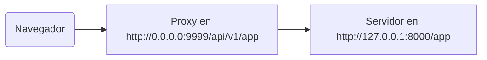

# Detrás de un Proxy

En algunas situaciones, podrías necesitar usar un **proxy** como Traefik o Nginx con una configuración que añade un prefijo de path extra que no es visto por tu aplicación.

En estos casos, puedes usar `root_path` para configurar tu aplicación.

El `root_path` es un mecanismo proporcionado por la especificación ASGI (en la que está construido FastAPI, a través de Starlette).

El `root_path` se usa para manejar estos casos específicos.

Y también se usa internamente al montar subaplicaciones.

## Proxy con un prefijo de path eliminado

Tener un proxy con un prefijo de path eliminado, en este caso, significa que podrías declarar un path en `/app` en tu código, pero luego añades una capa encima (el proxy) que situaría tu aplicación **FastAPI** bajo un path como `/api/v1`.

En este caso, el path original `/app` realmente sería servido en `/api/v1/app`.

Aunque todo tu código esté escrito asumiendo que solo existe `/app`.

{* ../../docs_src/behind_a_proxy/tutorial001.py hl[6] *}

Y el proxy estaría **"eliminando"** el **prefijo del path** sobre la marcha antes de transmitir el request al servidor de aplicaciones (probablemente Uvicorn a través de FastAPI CLI), manteniendo a tu aplicación convencida de que está siendo servida en `/app`, así que no tienes que actualizar todo tu código para incluir el prefijo `/api/v1`.

Hasta aquí, todo funcionaría normalmente.

Pero luego, cuando abres la UI integrada de los docs (el frontend), esperaría obtener el esquema de OpenAPI en `/openapi.json`, en lugar de `/api/v1/openapi.json`.

Entonces, el frontend (que se ejecuta en el navegador) trataría de alcanzar `/openapi.json` y no podría obtener el esquema de OpenAPI.

Porque tenemos un proxy con un prefijo de path de `/api/v1` para nuestra aplicación, el frontend necesita obtener el esquema de OpenAPI en `/api/v1/openapi.json`.



/// tip | Consejo

La IP `0.0.0.0` se usa comúnmente para indicar que el programa escucha en todas las IPs disponibles en esa máquina/servidor.

///

La UI de los docs también necesitaría el esquema de OpenAPI para declarar que este API `servidor` se encuentra en `/api/v1` (detrás del proxy). Por ejemplo:

```JSON hl_lines="4-8"
{
    "openapi": "3.1.0",
    // Más cosas aquí
    "servers": [
        {
            "url": "/api/v1"
        }
    ],
    "paths": {
            // Más cosas aquí
    }
}
```

En este ejemplo, el "Proxy" podría ser algo como **Traefik**. Y el servidor sería algo como FastAPI CLI con **Uvicorn**, ejecutando tu aplicación de FastAPI.

### Proporcionando el `root_path`

Para lograr esto, puedes usar la opción de línea de comandos `--root-path` como:

<div class="termy">

```console
$ fastapi run main.py --root-path /api/v1

<span style="color: green;">INFO</span>:     Uvicorn running on http://127.0.0.1:8000 (Press CTRL+C to quit)
```

</div>

Si usas Hypercorn, también tiene la opción `--root-path`.

/// note | Detalles Técnicos

La especificación ASGI define un `root_path` para este caso de uso.

Y la opción de línea de comandos `--root-path` proporciona ese `root_path`.

///

### Revisar el `root_path` actual

Puedes obtener el `root_path` actual utilizado por tu aplicación para cada request, es parte del diccionario `scope` (que es parte de la especificación ASGI).

Aquí lo estamos incluyendo en el mensaje solo con fines de demostración.

{* ../../docs_src/behind_a_proxy/tutorial001.py hl[8] *}

Luego, si inicias Uvicorn con:

<div class="termy">

```console
$ fastapi run main.py --root-path /api/v1

<span style="color: green;">INFO</span>:     Uvicorn running on http://127.0.0.1:8000 (Press CTRL+C to quit)
```

</div>

El response sería algo como:

```JSON
{
    "message": "Hello World",
    "root_path": "/api/v1"
}
```

### Configurar el `root_path` en la app de FastAPI

Alternativamente, si no tienes una forma de proporcionar una opción de línea de comandos como `--root-path` o su equivalente, puedes configurar el parámetro `root_path` al crear tu app de FastAPI:

{* ../../docs_src/behind_a_proxy/tutorial002.py hl[3] *}

Pasar el `root_path` a `FastAPI` sería el equivalente a pasar la opción de línea de comandos `--root-path` a Uvicorn o Hypercorn.

### Acerca de `root_path`

Ten en cuenta que el servidor (Uvicorn) no usará ese `root_path` para nada, a excepción de pasárselo a la app.

Pero si vas con tu navegador a <a href="http://127.0.0.1:8000" class="external-link" target="_blank">http://127.0.0.1:8000/app</a> verás el response normal:

```JSON
{
    "message": "Hello World",
    "root_path": "/api/v1"
}
```

Así que no se esperará que sea accedido en `http://127.0.0.1:8000/api/v1/app`.

Uvicorn esperará que el proxy acceda a Uvicorn en `http://127.0.0.1:8000/app`, y luego será responsabilidad del proxy añadir el prefijo extra `/api/v1` encima.

## Sobre proxies con un prefijo de path eliminado

Ten en cuenta que un proxy con prefijo de path eliminado es solo una de las formas de configurarlo.

Probablemente en muchos casos, el valor predeterminado será que el proxy no tenga un prefijo de path eliminado.

En un caso así (sin un prefijo de path eliminado), el proxy escucharía algo como `https://myawesomeapp.com`, y luego si el navegador va a `https://myawesomeapp.com/api/v1/app` y tu servidor (por ejemplo, Uvicorn) escucha en `http://127.0.0.1:8000`, el proxy (sin un prefijo de path eliminado) accedería a Uvicorn en el mismo path: `http://127.0.0.1:8000/api/v1/app`.

## Probando localmente con Traefik

Puedes ejecutar fácilmente el experimento localmente con un prefijo de path eliminado usando <a href="https://docs.traefik.io/" class="external-link" target="_blank">Traefik</a>.

<a href="https://github.com/containous/traefik/releases" class="external-link" target="_blank">Descarga Traefik</a>, es un archivo binario único, puedes extraer el archivo comprimido y ejecutarlo directamente desde la terminal.

Luego crea un archivo `traefik.toml` con:

```TOML hl_lines="3"
[entryPoints]
  [entryPoints.http]
    address = ":9999"

[providers]
  [providers.file]
    filename = "routes.toml"
```

Esto le dice a Traefik que escuche en el puerto 9999 y que use otro archivo `routes.toml`.

/// tip | Consejo

Estamos utilizando el puerto 9999 en lugar del puerto HTTP estándar 80 para que no tengas que ejecutarlo con privilegios de administrador (`sudo`).

///

Ahora crea ese otro archivo `routes.toml`:

```TOML hl_lines="5  12  20"
[http]
  [http.middlewares]

    [http.middlewares.api-stripprefix.stripPrefix]
      prefixes = ["/api/v1"]

  [http.routers]

    [http.routers.app-http]
      entryPoints = ["http"]
      service = "app"
      rule = "PathPrefix(`/api/v1`)"
      middlewares = ["api-stripprefix"]

  [http.services]

    [http.services.app]
      [http.services.app.loadBalancer]
        [[http.services.app.loadBalancer.servers]]
          url = "http://127.0.0.1:8000"
```

Este archivo configura Traefik para usar el prefijo de path `/api/v1`.

Y luego Traefik redireccionará sus requests a tu Uvicorn ejecutándose en `http://127.0.0.1:8000`.

Ahora inicia Traefik:

<div class="termy">

```console
$ ./traefik --configFile=traefik.toml

INFO[0000] Configuration loaded from file: /home/user/awesomeapi/traefik.toml
```

</div>

Y ahora inicia tu app, utilizando la opción `--root-path`:

<div class="termy">

```console
$ fastapi run main.py --root-path /api/v1

<span style="color: green;">INFO</span>:     Uvicorn running on http://127.0.0.1:8000 (Press CTRL+C to quit)
```

</div>

### Revisa los responses

Ahora, si vas a la URL con el puerto para Uvicorn: <a href="http://127.0.0.1:8000/app" class="external-link" target="_blank">http://127.0.0.1:8000/app</a>, verás el response normal:

```JSON
{
    "message": "Hello World",
    "root_path": "/api/v1"
}
```

/// tip | Consejo

Nota que incluso aunque estés accediendo en `http://127.0.0.1:8000/app`, muestra el `root_path` de `/api/v1`, tomado de la opción `--root-path`.

///

Y ahora abre la URL con el puerto para Traefik, incluyendo el prefijo de path: <a href="http://127.0.0.1:9999/api/v1/app" class="external-link" target="_blank">http://127.0.0.1:9999/api/v1/app</a>.

Obtenemos el mismo response:

```JSON
{
    "message": "Hello World",
    "root_path": "/api/v1"
}
```

pero esta vez en la URL con el prefijo de path proporcionado por el proxy: `/api/v1`.

Por supuesto, la idea aquí es que todos accedan a la app a través del proxy, así que la versión con el prefijo de path `/api/v1` es la "correcta".

Y la versión sin el prefijo de path (`http://127.0.0.1:8000/app`), proporcionada directamente por Uvicorn, sería exclusivamente para que el _proxy_ (Traefik) la acceda.

Eso demuestra cómo el Proxy (Traefik) usa el prefijo de path y cómo el servidor (Uvicorn) usa el `root_path` de la opción `--root-path`.

### Revisa la UI de los docs

Pero aquí está la parte divertida. ✨

La forma "oficial" de acceder a la app sería a través del proxy con el prefijo de path que definimos. Así que, como esperaríamos, si intentas usar la UI de los docs servida por Uvicorn directamente, sin el prefijo de path en la URL, no funcionará, porque espera ser accedida a través del proxy.

Puedes verificarlo en <a href="http://127.0.0.1:8000/docs" class="external-link" target="_blank">http://127.0.0.1:8000/docs</a>:


Pero si accedemos a la UI de los docs en la URL "oficial" usando el proxy con puerto `9999`, en `/api/v1/docs`, ¡funciona correctamente! 🎉

Puedes verificarlo en <a href="http://127.0.0.1:9999/api/v1/docs" class="external-link" target="_blank">http://127.0.0.1:9999/api/v1/docs</a>:


Justo como queríamos. ✔️

Esto es porque FastAPI usa este `root_path` para crear el `server` por defecto en OpenAPI con la URL proporcionada por `root_path`.

## Servidores adicionales

/// warning | Advertencia

Este es un caso de uso más avanzado. Siéntete libre de omitirlo.

///

Por defecto, **FastAPI** creará un `server` en el esquema de OpenAPI con la URL para el `root_path`.

Pero también puedes proporcionar otros `servers` alternativos, por ejemplo, si deseas que *la misma* UI de los docs interactúe con un entorno de pruebas y de producción.

Si pasas una lista personalizada de `servers` y hay un `root_path` (porque tu API existe detrás de un proxy), **FastAPI** insertará un "server" con este `root_path` al comienzo de la lista.

Por ejemplo:

{* ../../docs_src/behind_a_proxy/tutorial003.py hl[4:7] *}

Generará un esquema de OpenAPI como:

```JSON hl_lines="5-7"
{
    "openapi": "3.1.0",
    // Más cosas aquí
    "servers": [
        {
            "url": "/api/v1"
        },
        {
            "url": "https://stag.example.com",
            "description": "Entorno de pruebas"
        },
        {
            "url": "https://prod.example.com",
            "description": "Entorno de producción"
        }
    ],
    "paths": {
            // Más cosas aquí
    }
}
```

/// tip | Consejo

Observa el server auto-generado con un valor `url` de `/api/v1`, tomado del `root_path`.

///

En la UI de los docs en <a href="http://127.0.0.1:9999/api/v1/docs" class="external-link" target="_blank">http://127.0.0.1:9999/api/v1/docs</a> se vería como:


/// tip | Consejo

La UI de los docs interactuará con el server que selecciones.

///

### Desactivar el server automático de `root_path`

Si no quieres que **FastAPI** incluya un server automático usando el `root_path`, puedes usar el parámetro `root_path_in_servers=False`:

{* ../../docs_src/behind_a_proxy/tutorial004.py hl[9] *}

y entonces no lo incluirá en el esquema de OpenAPI.

## Montando una sub-aplicación

Si necesitas montar una sub-aplicación (como se describe en [Aplicaciones secundarias - Monturas](sub-applications.md){.internal-link target=_blank}) mientras usas un proxy con `root_path`, puedes hacerlo normalmente, como esperarías.

FastAPI usará internamente el `root_path` de manera inteligente, así que simplemente funcionará. ✨
