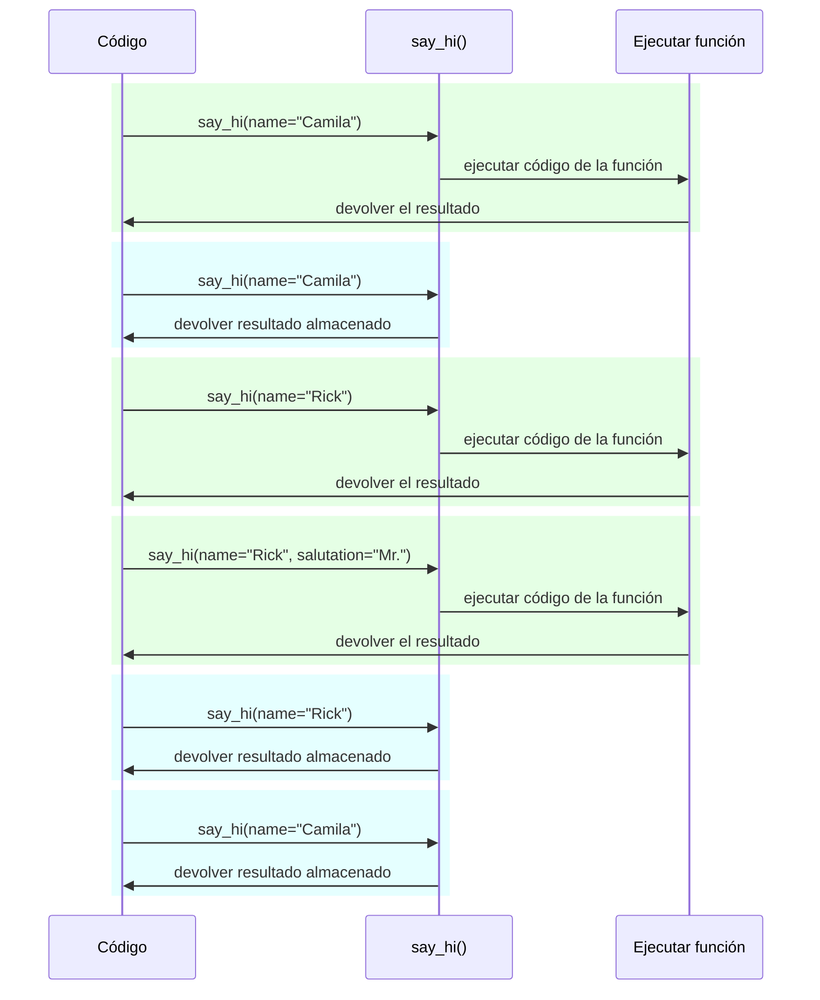

# Configuraciones y Variables de Entorno

En muchos casos, tu aplicación podría necesitar algunas configuraciones o ajustes externos, por ejemplo, claves secretas, credenciales de base de datos, credenciales para servicios de correo electrónico, etc.

La mayoría de estas configuraciones son variables (pueden cambiar), como las URLs de bases de datos. Y muchas podrían ser sensibles, como los secretos.

Por esta razón, es común proporcionarlas en variables de entorno que son leídas por la aplicación.

/// tip | Consejo

Para entender las variables de entorno, puedes leer [Variables de Entorno](../environment-variables.md){.internal-link target=_blank}.

///

## Tipos y validación

Estas variables de entorno solo pueden manejar strings de texto, ya que son externas a Python y tienen que ser compatibles con otros programas y el resto del sistema (e incluso con diferentes sistemas operativos, como Linux, Windows, macOS).

Eso significa que cualquier valor leído en Python desde una variable de entorno será un `str`, y cualquier conversión a un tipo diferente o cualquier validación tiene que hacerse en código.

## Pydantic `Settings`

Afortunadamente, Pydantic proporciona una gran utilidad para manejar estas configuraciones provenientes de variables de entorno con <a href="https://docs.pydantic.dev/latest/concepts/pydantic_settings/" class="external-link" target="_blank">Pydantic: Settings management</a>.

### Instalar `pydantic-settings`

Primero, asegúrate de crear tu [entorno virtual](../virtual-environments.md){.internal-link target=_blank}, actívalo y luego instala el paquete `pydantic-settings`:

<div class="termy">

```console
$ pip install pydantic-settings
---> 100%
```

</div>

También viene incluido cuando instalas los extras `all` con:

<div class="termy">

```console
$ pip install "fastapi[all]"
---> 100%
```

</div>

/// info | Información

En Pydantic v1 venía incluido con el paquete principal. Ahora se distribuye como este paquete independiente para que puedas elegir si instalarlo o no si no necesitas esa funcionalidad.

///

### Crear el objeto `Settings`

Importa `BaseSettings` de Pydantic y crea una sub-clase, muy similar a un modelo de Pydantic.

De la misma forma que con los modelos de Pydantic, declaras atributos de clase con anotaciones de tipos, y posiblemente, valores por defecto.

Puedes usar todas las mismas funcionalidades de validación y herramientas que usas para los modelos de Pydantic, como diferentes tipos de datos y validaciones adicionales con `Field()`.

//// tab | Pydantic v2

{* ../../docs_src/settings/tutorial001.py hl[2,5:8,11] *}

////

//// tab | Pydantic v1

/// info | Información

En Pydantic v1 importarías `BaseSettings` directamente desde `pydantic` en lugar de desde `pydantic_settings`.

///

{* ../../docs_src/settings/tutorial001_pv1.py hl[2,5:8,11] *}

////

/// tip | Consejo

Si quieres algo rápido para copiar y pegar, no uses este ejemplo, usa el último más abajo.

///

Luego, cuando creas una instance de esa clase `Settings` (en este caso, en el objeto `settings`), Pydantic leerá las variables de entorno de una manera indiferente a mayúsculas y minúsculas, por lo que una variable en mayúsculas `APP_NAME` aún será leída para el atributo `app_name`.

Luego convertirá y validará los datos. Así que, cuando uses ese objeto `settings`, tendrás datos de los tipos que declaraste (por ejemplo, `items_per_user` será un `int`).

### Usar el `settings`

Luego puedes usar el nuevo objeto `settings` en tu aplicación:

{* ../../docs_src/settings/tutorial001.py hl[18:20] *}

### Ejecutar el servidor

Luego, ejecutarías el servidor pasando las configuraciones como variables de entorno, por ejemplo, podrías establecer un `ADMIN_EMAIL` y `APP_NAME` con:

<div class="termy">

```console
$ ADMIN_EMAIL="deadpool@example.com" APP_NAME="ChimichangApp" fastapi run main.py

<span style="color: green;">INFO</span>:     Uvicorn running on http://127.0.0.1:8000 (Press CTRL+C to quit)
```

</div>

/// tip | Consejo

Para establecer múltiples variables de entorno para un solo comando, simplemente sepáralas con un espacio y ponlas todas antes del comando.

///

Y luego la configuración `admin_email` se establecería en `"deadpool@example.com"`.

El `app_name` sería `"ChimichangApp"`.

Y el `items_per_user` mantendría su valor por defecto de `50`.

## Configuraciones en otro módulo

Podrías poner esas configuraciones en otro archivo de módulo como viste en [Aplicaciones Más Grandes - Múltiples Archivos](../tutorial/bigger-applications.md){.internal-link target=_blank}.

Por ejemplo, podrías tener un archivo `config.py` con:

{* ../../docs_src/settings/app01/config.py *}

Y luego usarlo en un archivo `main.py`:

{* ../../docs_src/settings/app01/main.py hl[3,11:13] *}

/// tip | Consejo

También necesitarías un archivo `__init__.py` como viste en [Aplicaciones Más Grandes - Múltiples Archivos](../tutorial/bigger-applications.md){.internal-link target=_blank}.

///

## Configuraciones en una dependencia

En algunas ocasiones podría ser útil proporcionar las configuraciones desde una dependencia, en lugar de tener un objeto global con `settings` que se use en todas partes.

Esto podría ser especialmente útil durante las pruebas, ya que es muy fácil sobrescribir una dependencia con tus propias configuraciones personalizadas.

### El archivo de configuración

Proveniente del ejemplo anterior, tu archivo `config.py` podría verse como:

{* ../../docs_src/settings/app02/config.py hl[10] *}

Nota que ahora no creamos una instance por defecto `settings = Settings()`.

### El archivo principal de la app

Ahora creamos una dependencia que devuelve un nuevo `config.Settings()`.

{* ../../docs_src/settings/app02_an_py39/main.py hl[6,12:13] *}

/// tip | Consejo

Hablaremos del `@lru_cache` en un momento.

Por ahora puedes asumir que `get_settings()` es una función normal.

///

Y luego podemos requerirlo desde la *path operation function* como una dependencia y usarlo donde lo necesitemos.

{* ../../docs_src/settings/app02_an_py39/main.py hl[17,19:21] *}

### Configuraciones y pruebas

Luego sería muy fácil proporcionar un objeto de configuraciones diferente durante las pruebas al sobrescribir una dependencia para `get_settings`:

{* ../../docs_src/settings/app02/test_main.py hl[9:10,13,21] *}

En la dependencia sobreescrita establecemos un nuevo valor para el `admin_email` al crear el nuevo objeto `Settings`, y luego devolvemos ese nuevo objeto.

Luego podemos probar que se está usando.

## Leer un archivo `.env`

Si tienes muchas configuraciones que posiblemente cambien mucho, tal vez en diferentes entornos, podría ser útil ponerlos en un archivo y luego leerlos desde allí como si fueran variables de entorno.

Esta práctica es lo suficientemente común que tiene un nombre, estas variables de entorno generalmente se colocan en un archivo `.env`, y el archivo se llama un "dotenv".

/// tip | Consejo

Un archivo que comienza con un punto (`.`) es un archivo oculto en sistemas tipo Unix, como Linux y macOS.

Pero un archivo dotenv realmente no tiene que tener ese nombre exacto.

///

Pydantic tiene soporte para leer desde estos tipos de archivos usando un paquete externo. Puedes leer más en <a href="https://docs.pydantic.dev/latest/concepts/pydantic_settings/#dotenv-env-support" class="external-link" target="_blank">Pydantic Settings: Dotenv (.env) support</a>.

/// tip | Consejo

Para que esto funcione, necesitas `pip install python-dotenv`.

///

### El archivo `.env`

Podrías tener un archivo `.env` con:

```bash
ADMIN_EMAIL="deadpool@example.com"
APP_NAME="ChimichangApp"
```

### Leer configuraciones desde `.env`

Y luego actualizar tu `config.py` con:

//// tab | Pydantic v2

{* ../../docs_src/settings/app03_an/config.py hl[9] *}

/// tip | Consejo

El atributo `model_config` se usa solo para configuración de Pydantic. Puedes leer más en <a href="https://docs.pydantic.dev/latest/concepts/config/" class="external-link" target="_blank">Pydantic: Concepts: Configuration</a>.

///

////

//// tab | Pydantic v1

{* ../../docs_src/settings/app03_an/config_pv1.py hl[9:10] *}

/// tip | Consejo

La clase `Config` se usa solo para configuración de Pydantic. Puedes leer más en <a href="https://docs.pydantic.dev/1.10/usage/model_config/" class="external-link" target="_blank">Pydantic Model Config</a>.

///

////

/// info | Información

En la versión 1 de Pydantic la configuración se hacía en una clase interna `Config`, en la versión 2 de Pydantic se hace en un atributo `model_config`. Este atributo toma un `dict`, y para obtener autocompletado y errores en línea, puedes importar y usar `SettingsConfigDict` para definir ese `dict`.

///

Aquí definimos la configuración `env_file` dentro de tu clase Pydantic `Settings`, y establecemos el valor en el nombre del archivo con el archivo dotenv que queremos usar.

### Creando el `Settings` solo una vez con `lru_cache`

Leer un archivo desde el disco es normalmente una operación costosa (lenta), por lo que probablemente quieras hacerlo solo una vez y luego reutilizar el mismo objeto de configuraciones, en lugar de leerlo para cada request.

Pero cada vez que hacemos:

```Python
Settings()
```

se crearía un nuevo objeto `Settings`, y al crearse leería el archivo `.env` nuevamente.

Si la función de dependencia fuera simplemente así:

```Python
def get_settings():
    return Settings()
```

crearíamos ese objeto para cada request, y estaríamos leyendo el archivo `.env` para cada request. ⚠️

Pero como estamos usando el decorador `@lru_cache` encima, el objeto `Settings` se creará solo una vez, la primera vez que se llame. ✔️

{* ../../docs_src/settings/app03_an_py39/main.py hl[1,11] *}

Entonces, para cualquier llamada subsiguiente de `get_settings()` en las dependencias de los próximos requests, en lugar de ejecutar el código interno de `get_settings()` y crear un nuevo objeto `Settings`, devolverá el mismo objeto que fue devuelto en la primera llamada, una y otra vez.

#### Detalles Técnicos de `lru_cache`

`@lru_cache` modifica la función que decora para devolver el mismo valor que se devolvió la primera vez, en lugar de calcularlo nuevamente, ejecutando el código de la función cada vez.

Así que la función debajo se ejecutará una vez por cada combinación de argumentos. Y luego, los valores devueltos por cada una de esas combinaciones de argumentos se utilizarán una y otra vez cada vez que la función sea llamada con exactamente la misma combinación de argumentos.

Por ejemplo, si tienes una función:

```Python
@lru_cache
def say_hi(name: str, salutation: str = "Ms."):
    return f"Hello {salutation} {name}"
```

tu programa podría ejecutarse así:



En el caso de nuestra dependencia `get_settings()`, la función ni siquiera toma argumentos, por lo que siempre devolverá el mismo valor.

De esa manera, se comporta casi como si fuera solo una variable global. Pero como usa una función de dependencia, entonces podemos sobrescribirla fácilmente para las pruebas.

`@lru_cache` es parte de `functools`, que es parte del library estándar de Python, puedes leer más sobre él en las <a href="https://docs.python.org/3/library/functools.html#functools.lru_cache" class="external-link" target="_blank">docs de Python para `@lru_cache`</a>.

## Resumen

Puedes usar Pydantic Settings para manejar las configuraciones o ajustes de tu aplicación, con todo el poder de los modelos de Pydantic.

* Al usar una dependencia, puedes simplificar las pruebas.
* Puedes usar archivos `.env` con él.
* Usar `@lru_cache` te permite evitar leer el archivo dotenv una y otra vez para cada request, mientras te permite sobrescribirlo durante las pruebas.
