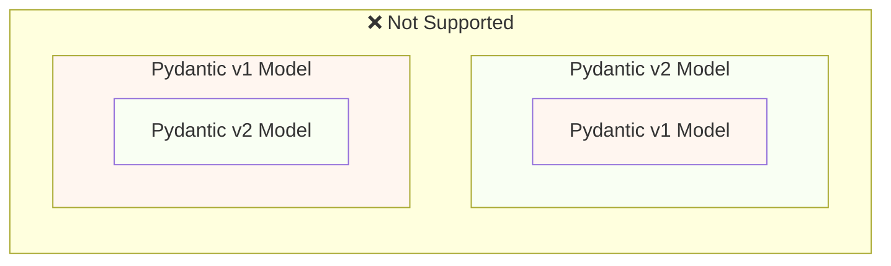
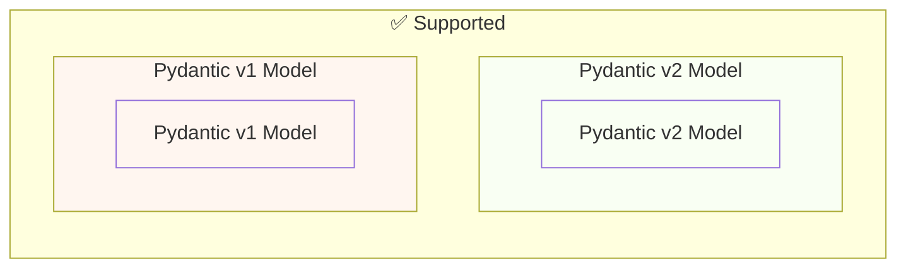

# Migra de Pydantic v1 a Pydantic v2 { #migrate-from-pydantic-v1-to-pydantic-v2 }

Si tienes una app de FastAPI antigua, podrías estar usando Pydantic versión 1.

FastAPI versión 0.100.0 tenía compatibilidad con Pydantic v1 o v2. Usaba la que tuvieras instalada.

FastAPI versión 0.119.0 introdujo compatibilidad parcial con Pydantic v1 desde dentro de Pydantic v2 (como `pydantic.v1`), para facilitar la migración a v2.

FastAPI 0.126.0 eliminó la compatibilidad con Pydantic v1, aunque siguió soportando `pydantic.v1` por un poquito más de tiempo.

/// warning | Advertencia

El equipo de Pydantic dejó de dar soporte a Pydantic v1 para las versiones más recientes de Python, comenzando con **Python 3.14**.

Esto incluye `pydantic.v1`, que ya no está soportado en Python 3.14 y superiores.

Si quieres usar las funcionalidades más recientes de Python, tendrás que asegurarte de usar Pydantic v2.

///

Si tienes una app de FastAPI antigua con Pydantic v1, aquí te muestro cómo migrarla a Pydantic v2, y las **funcionalidades en FastAPI 0.119.0** para ayudarte con una migración gradual.

## Guía oficial { #official-guide }

Pydantic tiene una <a href="https://docs.pydantic.dev/latest/migration/" class="external-link" target="_blank">Guía de migración</a> oficial de v1 a v2.

También incluye qué cambió, cómo las validaciones ahora son más correctas y estrictas, posibles consideraciones, etc.

Puedes leerla para entender mejor qué cambió.

## Tests { #tests }

Asegúrate de tener [tests](../tutorial/testing.md){.internal-link target=_blank} para tu app y de ejecutarlos en integración continua (CI).

Así podrás hacer la actualización y asegurarte de que todo sigue funcionando como esperas.

## `bump-pydantic` { #bump-pydantic }

En muchos casos, cuando usas modelos de Pydantic normales sin personalizaciones, podrás automatizar gran parte del proceso de migración de Pydantic v1 a Pydantic v2.

Puedes usar <a href="https://github.com/pydantic/bump-pydantic" class="external-link" target="_blank">`bump-pydantic`</a> del mismo equipo de Pydantic.

Esta herramienta te ayudará a cambiar automáticamente la mayor parte del código que necesita cambiarse.

Después de esto, puedes ejecutar los tests y revisa si todo funciona. Si es así, ya terminaste. 😎

## Pydantic v1 en v2 { #pydantic-v1-in-v2 }

Pydantic v2 incluye todo lo de Pydantic v1 como un submódulo `pydantic.v1`. Pero esto ya no está soportado en versiones por encima de Python 3.13.

Esto significa que puedes instalar la versión más reciente de Pydantic v2 e importar y usar los componentes viejos de Pydantic v1 desde este submódulo, como si tuvieras instalado el Pydantic v1 antiguo.

{* ../../docs_src/pydantic_v1_in_v2/tutorial001_an_py310.py hl[1,4] *}

### Compatibilidad de FastAPI con Pydantic v1 en v2 { #fastapi-support-for-pydantic-v1-in-v2 }

Desde FastAPI 0.119.0, también hay compatibilidad parcial para Pydantic v1 desde dentro de Pydantic v2, para facilitar la migración a v2.

Así que podrías actualizar Pydantic a la última versión 2 y cambiar los imports para usar el submódulo `pydantic.v1`, y en muchos casos simplemente funcionaría.

{* ../../docs_src/pydantic_v1_in_v2/tutorial002_an_py310.py hl[2,5,15] *}

/// warning | Advertencia

Ten en cuenta que, como el equipo de Pydantic ya no da soporte a Pydantic v1 en versiones recientes de Python, empezando por Python 3.14, usar `pydantic.v1` tampoco está soportado en Python 3.14 y superiores.

///

### Pydantic v1 y v2 en la misma app { #pydantic-v1-and-v2-on-the-same-app }

**No está soportado** por Pydantic tener un modelo de Pydantic v2 con sus propios campos definidos como modelos de Pydantic v1 o viceversa.

...pero puedes tener modelos separados usando Pydantic v1 y v2 en la misma app.

En algunos casos, incluso es posible tener modelos de Pydantic v1 y v2 en la misma **path operation** de tu app de FastAPI:

{* ../../docs_src/pydantic_v1_in_v2/tutorial003_an_py310.py hl[2:3,6,12,21:22] *}

En el ejemplo anterior, el modelo de entrada es un modelo de Pydantic v1 y el modelo de salida (definido en `response_model=ItemV2`) es un modelo de Pydantic v2.

### Parámetros de Pydantic v1 { #pydantic-v1-parameters }

Si necesitas usar algunas de las herramientas específicas de FastAPI para parámetros como `Body`, `Query`, `Form`, etc. con modelos de Pydantic v1, puedes importarlas de `fastapi.temp_pydantic_v1_params` mientras terminas la migración a Pydantic v2:

{* ../../docs_src/pydantic_v1_in_v2/tutorial004_an_py310.py hl[4,18] *}

### Migra por pasos { #migrate-in-steps }

/// tip | Consejo

Primero prueba con `bump-pydantic`, si tus tests pasan y eso funciona, entonces terminaste con un solo comando. ✨

///

Si `bump-pydantic` no funciona para tu caso de uso, puedes usar la compatibilidad de modelos Pydantic v1 y v2 en la misma app para hacer la migración a Pydantic v2 de forma gradual.

Podrías primero actualizar Pydantic para usar la última versión 2, y cambiar los imports para usar `pydantic.v1` para todos tus modelos.

Luego puedes empezar a migrar tus modelos de Pydantic v1 a v2 por grupos, en pasos graduales. 🚶
