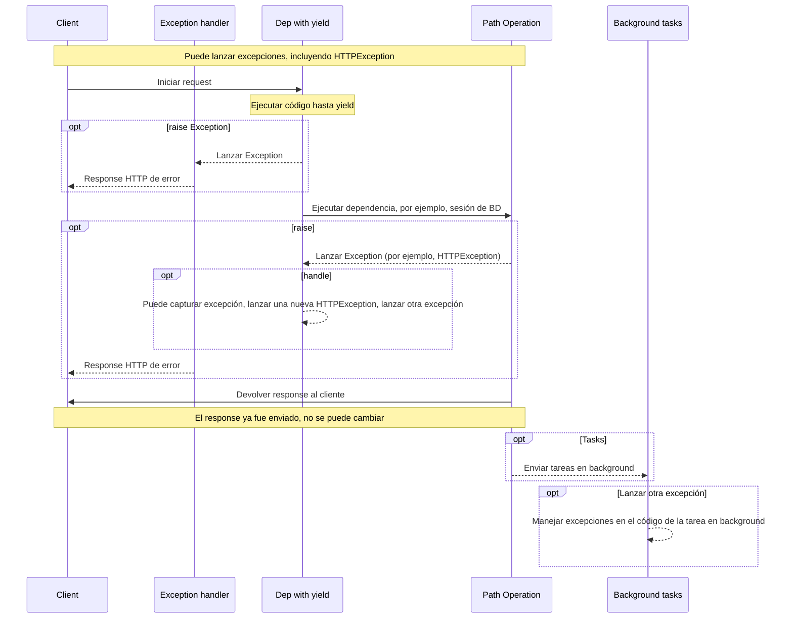

# Dependencias con yield

FastAPI admite dependencias que realizan algunos <abbr title='sometimes also called "exit code", "cleanup code", "teardown code", "closing code", "context manager exit code", etc.'>pasos adicionales después de finalizar</abbr>.

Para hacer esto, usa `yield` en lugar de `return` y escribe los pasos adicionales (código) después.

/// tip | Consejo

Asegúrate de usar `yield` una sola vez por dependencia.

///

/// note | Nota técnica

Cualquier función que sea válida para usar con:

* <a href="https://docs.python.org/3/library/contextlib.html#contextlib.contextmanager" class="external-link" target="_blank">`@contextlib.contextmanager`</a> o
* <a href="https://docs.python.org/3/library/contextlib.html#contextlib.asynccontextmanager" class="external-link" target="_blank">`@contextlib.asynccontextmanager`</a>

sería válida para usar como una dependencia en **FastAPI**.

De hecho, FastAPI usa esos dos decoradores internamente.

///

## Una dependencia de base de datos con `yield`

Por ejemplo, podrías usar esto para crear una sesión de base de datos y cerrarla después de finalizar.

Solo el código anterior e incluyendo la declaración `yield` se ejecuta antes de crear un response:

{* ../../docs_src/dependencies/tutorial007.py hl[2:4] *}

El valor generado es lo que se inyecta en *path operations* y otras dependencias:

{* ../../docs_src/dependencies/tutorial007.py hl[4] *}

El código posterior a la declaración `yield` se ejecuta después de crear el response pero antes de enviarla:

{* ../../docs_src/dependencies/tutorial007.py hl[5:6] *}

/// tip | Consejo

Puedes usar funciones `async` o regulares.

**FastAPI** hará lo correcto con cada una, igual que con dependencias normales.

///

## Una dependencia con `yield` y `try`

Si usas un bloque `try` en una dependencia con `yield`, recibirás cualquier excepción que se haya lanzado al usar la dependencia.

Por ejemplo, si algún código en algún punto intermedio, en otra dependencia o en una *path operation*, realiza un "rollback" en una transacción de base de datos o crea cualquier otro error, recibirás la excepción en tu dependencia.

Por lo tanto, puedes buscar esa excepción específica dentro de la dependencia con `except SomeException`.

Del mismo modo, puedes usar `finally` para asegurarte de que los pasos de salida se ejecuten, sin importar si hubo una excepción o no.

{* ../../docs_src/dependencies/tutorial007.py hl[3,5] *}

## Sub-dependencias con `yield`

Puedes tener sub-dependencias y "árboles" de sub-dependencias de cualquier tamaño y forma, y cualquiera o todas ellas pueden usar `yield`.

**FastAPI** se asegurará de que el "código de salida" en cada dependencia con `yield` se ejecute en el orden correcto.

Por ejemplo, `dependency_c` puede tener una dependencia de `dependency_b`, y `dependency_b` de `dependency_a`:

{* ../../docs_src/dependencies/tutorial008_an_py39.py hl[6,14,22] *}

Y todas ellas pueden usar `yield`.

En este caso, `dependency_c`, para ejecutar su código de salida, necesita que el valor de `dependency_b` (aquí llamado `dep_b`) todavía esté disponible.

Y, a su vez, `dependency_b` necesita que el valor de `dependency_a` (aquí llamado `dep_a`) esté disponible para su código de salida.

{* ../../docs_src/dependencies/tutorial008_an_py39.py hl[18:19,26:27] *}

De la misma manera, podrías tener algunas dependencias con `yield` y otras dependencias con `return`, y hacer que algunas de esas dependan de algunas de las otras.

Y podrías tener una sola dependencia que requiera varias otras dependencias con `yield`, etc.

Puedes tener cualquier combinación de dependencias que quieras.

**FastAPI** se asegurará de que todo se ejecute en el orden correcto.

/// note | Nota técnica

Esto funciona gracias a los <a href="https://docs.python.org/3/library/contextlib.html" class="external-link" target="_blank">Context Managers</a> de Python.

**FastAPI** los utiliza internamente para lograr esto.

///

## Dependencias con `yield` y `HTTPException`

Viste que puedes usar dependencias con `yield` y tener bloques `try` que capturen excepciones.

De la misma manera, podrías lanzar una `HTTPException` o similar en el código de salida, después del `yield`.

/// tip | Consejo

Esta es una técnica algo avanzada, y en la mayoría de los casos realmente no lo necesitarás, ya que puedes lanzar excepciones (incluyendo `HTTPException`) desde dentro del resto del código de tu aplicación, por ejemplo, en la *path operation function*.

Pero está ahí para ti si la necesitas. 🤓

///

{* ../../docs_src/dependencies/tutorial008b_an_py39.py hl[18:22,31] *}

Una alternativa que podrías usar para capturar excepciones (y posiblemente también lanzar otra `HTTPException`) es crear un [Manejador de Excepciones Personalizado](../handling-errors.md#install-custom-exception-handlers){.internal-link target=_blank}.

## Dependencias con `yield` y `except`

Si capturas una excepción usando `except` en una dependencia con `yield` y no la lanzas nuevamente (o lanzas una nueva excepción), FastAPI no podrá notar que hubo una excepción, al igual que sucedería con Python normal:

{* ../../docs_src/dependencies/tutorial008c_an_py39.py hl[15:16] *}

En este caso, el cliente verá un response *HTTP 500 Internal Server Error* como debería, dado que no estamos lanzando una `HTTPException` o similar, pero el servidor **no tendrá ningún registro** ni ninguna otra indicación de cuál fue el error. 😱

### Siempre `raise` en Dependencias con `yield` y `except`

Si capturas una excepción en una dependencia con `yield`, a menos que estés lanzando otra `HTTPException` o similar, deberías volver a lanzar la excepción original.

Puedes volver a lanzar la misma excepción usando `raise`:

{* ../../docs_src/dependencies/tutorial008d_an_py39.py hl[17] *}

Ahora el cliente obtendrá el mismo response *HTTP 500 Internal Server Error*, pero el servidor tendrá nuestro `InternalError` personalizado en los registros. 😎

## Ejecución de dependencias con `yield`

La secuencia de ejecución es más o menos como este diagrama. El tiempo fluye de arriba a abajo. Y cada columna es una de las partes que interactúa o ejecuta código.



/// info | Información

Solo **un response** será enviado al cliente. Podría ser uno de los responses de error o será el response de la *path operation*.

Después de que se envíe uno de esos responses, no se podrá enviar ningún otro response.

///

/// tip | Consejo

Este diagrama muestra `HTTPException`, pero también podrías lanzar cualquier otra excepción que captures en una dependencia con `yield` o con un [Manejador de Excepciones Personalizado](../handling-errors.md#install-custom-exception-handlers){.internal-link target=_blank}.

Si lanzas alguna excepción, será pasada a las dependencias con yield, incluyendo `HTTPException`. En la mayoría de los casos querrás volver a lanzar esa misma excepción o una nueva desde la dependencia con `yield` para asegurarte de que se maneje correctamente.

///

## Dependencias con `yield`, `HTTPException`, `except` y Tareas en Background

/// warning | Advertencia

Probablemente no necesites estos detalles técnicos, puedes omitir esta sección y continuar abajo.

Estos detalles son útiles principalmente si estabas usando una versión de FastAPI anterior a 0.106.0 y usabas recursos de dependencias con `yield` en tareas en background.

///

### Dependencias con `yield` y `except`, Detalles Técnicos

Antes de FastAPI 0.110.0, si usabas una dependencia con `yield`, y luego capturabas una excepción con `except` en esa dependencia, y no volvías a lanzar la excepción, la excepción se lanzaría automáticamente/transmitiría a cualquier manejador de excepciones o al manejador de errores interno del servidor.

Esto se cambió en la versión 0.110.0 para corregir el consumo no gestionado de memoria de excepciones transmitidas sin un manejador (errores internos del servidor), y para que sea consistente con el comportamiento del código regular de Python.

### Tareas en Background y Dependencias con `yield`, Detalles Técnicos

Antes de FastAPI 0.106.0, lanzar excepciones después de `yield` no era posible, el código de salida en dependencias con `yield` se ejecutaba *después* de que el response se enviara, por lo que los [Manejadores de Excepciones](../handling-errors.md#install-custom-exception-handlers){.internal-link target=_blank} ya se habrían ejecutado.

Esto se diseñó de esta manera principalmente para permitir usar los mismos objetos "extraídos" por dependencias dentro de tareas en background, porque el código de salida se ejecutaría después de que las tareas en background terminaran.

Sin embargo, ya que esto significaría esperar a que el response viaje a través de la red mientras se retiene innecesariamente un recurso en una dependencia con yield (por ejemplo, una conexión a base de datos), esto se cambió en FastAPI 0.106.0.

/// tip | Consejo

Además, una tarea en background es normalmente un conjunto independiente de lógica que debería manejarse por separado, con sus propios recursos (por ejemplo, su propia conexión a base de datos).

De esta manera probablemente tendrás un código más limpio.

///

Si solías depender de este comportamiento, ahora deberías crear los recursos para tareas en background dentro de la propia tarea en background, y usar internamente solo datos que no dependan de los recursos de las dependencias con `yield`.

Por ejemplo, en lugar de usar la misma sesión de base de datos, crearías una nueva sesión de base de datos dentro de la tarea en background, y obtendrías los objetos de la base de datos usando esta nueva sesión. Y luego, en lugar de pasar el objeto de la base de datos como parámetro a la función de tarea en background, pasarías el ID de ese objeto y luego obtendrías el objeto nuevamente dentro de la función de tarea en background.

## Context Managers

### Qué son los "Context Managers"

Los "Context Managers" son aquellos objetos de Python que puedes usar en una declaración `with`.

Por ejemplo, <a href="https://docs.python.org/3/tutorial/inputoutput.html#reading-and-writing-files" class="external-link" target="_blank">puedes usar `with` para leer un archivo</a>:

```Python
with open("./somefile.txt") as f:
    contents = f.read()
    print(contents)
```

Internamente, `open("./somefile.txt")` crea un objeto llamado "Context Manager".

Cuando el bloque `with` termina, se asegura de cerrar el archivo, incluso si hubo excepciones.

Cuando creas una dependencia con `yield`, **FastAPI** creará internamente un context manager para ella y lo combinará con algunas otras herramientas relacionadas.

### Usando context managers en dependencias con `yield`

/// warning | Advertencia

Esto es, más o menos, una idea "avanzada".

Si apenas estás comenzando con **FastAPI**, podrías querer omitirlo por ahora.

///

En Python, puedes crear Context Managers <a href="https://docs.python.org/3/reference/datamodel.html#context-managers" class="external-link" target="_blank">creando una clase con dos métodos: `__enter__()` y `__exit__()`</a>.

También puedes usarlos dentro de las dependencias de **FastAPI** con `yield` usando
`with` o `async with` en la función de dependencia:

{* ../../docs_src/dependencies/tutorial010.py hl[1:9,13] *}

/// tip | Consejo

Otra manera de crear un context manager es con:

* <a href="https://docs.python.org/3/library/contextlib.html#contextlib.contextmanager" class="external-link" target="_blank">`@contextlib.contextmanager`</a> o
* <a href="https://docs.python.org/3/library/contextlib.html#contextlib.asynccontextmanager" class="external-link" target="_blank">`@contextlib.asynccontextmanager`</a>

usándolos para decorar una función con un solo `yield`.

Eso es lo que **FastAPI** usa internamente para dependencias con `yield`.

Pero no tienes que usar los decoradores para las dependencias de FastAPI (y no deberías).

FastAPI lo hará por ti internamente.

///
