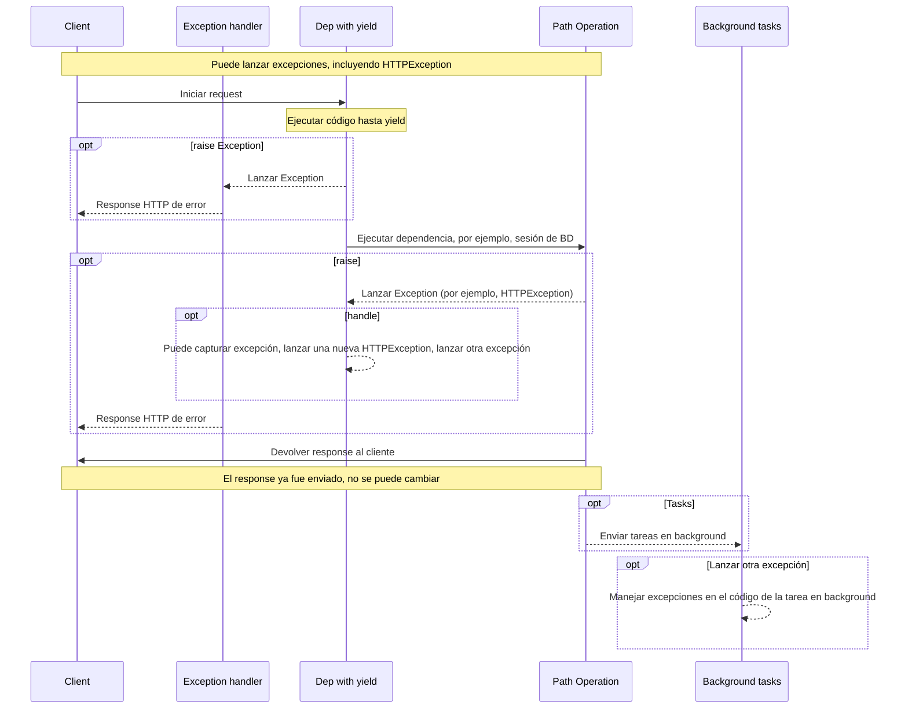
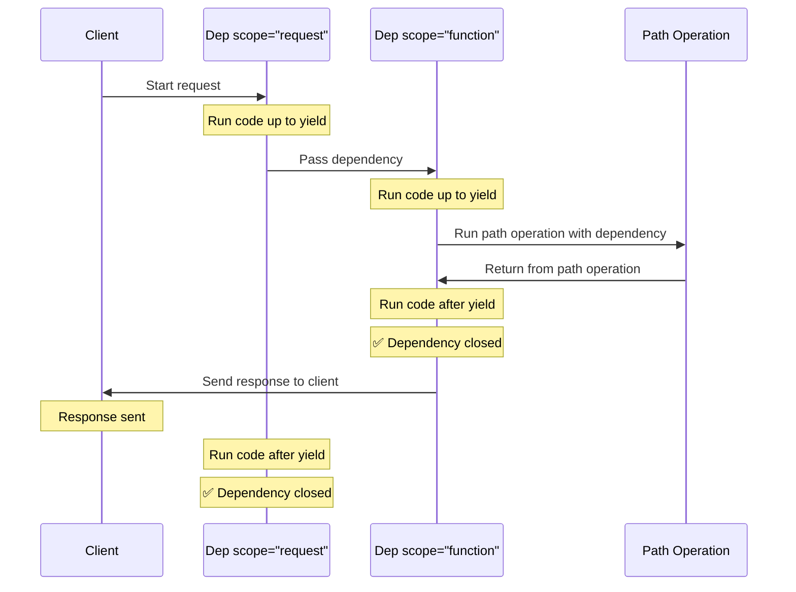

# Dependencias con yield { #dependencies-with-yield }

FastAPI admite dependencias que realizan algunos <abbr title='a veces también llamado "código de salida", "código de limpieza", "código de teardown", "código de cierre", "código de salida del context manager", etc.'>pasos adicionales después de finalizar</abbr>.

Para hacer esto, usa `yield` en lugar de `return`, y escribe los pasos adicionales (código) después.

/// tip | Consejo

Asegúrate de usar `yield` una sola vez por dependencia.

///

/// note | Detalles técnicos

Cualquier función que sea válida para usar con:

* <a href="https://docs.python.org/3/library/contextlib.html#contextlib.contextmanager" class="external-link" target="_blank">`@contextlib.contextmanager`</a> o
* <a href="https://docs.python.org/3/library/contextlib.html#contextlib.asynccontextmanager" class="external-link" target="_blank">`@contextlib.asynccontextmanager`</a>

sería válida para usar como una dependencia en **FastAPI**.

De hecho, FastAPI usa esos dos decoradores internamente.

///

## Una dependencia de base de datos con `yield` { #a-database-dependency-with-yield }

Por ejemplo, podrías usar esto para crear una sesión de base de datos y cerrarla después de finalizar.

Solo el código anterior e incluyendo la declaración `yield` se ejecuta antes de crear un response:

{* ../../docs_src/dependencies/tutorial007_py39.py hl[2:4] *}

El valor generado es lo que se inyecta en *path operations* y otras dependencias:

{* ../../docs_src/dependencies/tutorial007_py39.py hl[4] *}

El código posterior a la declaración `yield` se ejecuta después del response:

{* ../../docs_src/dependencies/tutorial007_py39.py hl[5:6] *}

/// tip | Consejo

Puedes usar funciones `async` o regulares.

**FastAPI** hará lo correcto con cada una, igual que con dependencias normales.

///

## Una dependencia con `yield` y `try` { #a-dependency-with-yield-and-try }

Si usas un bloque `try` en una dependencia con `yield`, recibirás cualquier excepción que se haya lanzado al usar la dependencia.

Por ejemplo, si algún código en algún punto intermedio, en otra dependencia o en una *path operation*, realiza un "rollback" en una transacción de base de datos o crea cualquier otro error, recibirás la excepción en tu dependencia.

Por lo tanto, puedes buscar esa excepción específica dentro de la dependencia con `except SomeException`.

Del mismo modo, puedes usar `finally` para asegurarte de que los pasos de salida se ejecuten, sin importar si hubo una excepción o no.

{* ../../docs_src/dependencies/tutorial007_py39.py hl[3,5] *}

## Sub-dependencias con `yield` { #sub-dependencies-with-yield }

Puedes tener sub-dependencias y "árboles" de sub-dependencias de cualquier tamaño y forma, y cualquiera o todas ellas pueden usar `yield`.

**FastAPI** se asegurará de que el "código de salida" en cada dependencia con `yield` se ejecute en el orden correcto.

Por ejemplo, `dependency_c` puede tener una dependencia de `dependency_b`, y `dependency_b` de `dependency_a`:

{* ../../docs_src/dependencies/tutorial008_an_py39.py hl[6,14,22] *}

Y todas ellas pueden usar `yield`.

En este caso, `dependency_c`, para ejecutar su código de salida, necesita que el valor de `dependency_b` (aquí llamado `dep_b`) todavía esté disponible.

Y, a su vez, `dependency_b` necesita que el valor de `dependency_a` (aquí llamado `dep_a`) esté disponible para su código de salida.

{* ../../docs_src/dependencies/tutorial008_an_py39.py hl[18:19,26:27] *}

De la misma manera, podrías tener algunas dependencias con `yield` y otras dependencias con `return`, y hacer que algunas de esas dependan de algunas de las otras.

Y podrías tener una sola dependencia que requiera varias otras dependencias con `yield`, etc.

Puedes tener cualquier combinación de dependencias que quieras.

**FastAPI** se asegurará de que todo se ejecute en el orden correcto.

/// note | Detalles técnicos

Esto funciona gracias a los <a href="https://docs.python.org/3/library/contextlib.html" class="external-link" target="_blank">Context Managers</a> de Python.

**FastAPI** los utiliza internamente para lograr esto.

///

## Dependencias con `yield` y `HTTPException` { #dependencies-with-yield-and-httpexception }

Viste que puedes usar dependencias con `yield` y tener bloques `try` que intentan ejecutar algo de código y luego ejecutar código de salida después de `finally`.

También puedes usar `except` para capturar la excepción que se lanzó y hacer algo con ella.

Por ejemplo, puedes lanzar una excepción diferente, como `HTTPException`.

/// tip | Consejo

Esta es una técnica algo avanzada, y en la mayoría de los casos realmente no la necesitarás, ya que puedes lanzar excepciones (incluyendo `HTTPException`) desde dentro del resto del código de tu aplicación, por ejemplo, en la *path operation function*.

Pero está ahí para ti si la necesitas. 🤓

///

{* ../../docs_src/dependencies/tutorial008b_an_py39.py hl[18:22,31] *}

Si quieres capturar excepciones y crear un response personalizado en base a eso, crea un [Manejador de Excepciones Personalizado](../handling-errors.md#install-custom-exception-handlers){.internal-link target=_blank}.

## Dependencias con `yield` y `except` { #dependencies-with-yield-and-except }

Si capturas una excepción usando `except` en una dependencia con `yield` y no la lanzas nuevamente (o lanzas una nueva excepción), FastAPI no podrá notar que hubo una excepción, al igual que sucedería con Python normal:

{* ../../docs_src/dependencies/tutorial008c_an_py39.py hl[15:16] *}

En este caso, el cliente verá un response *HTTP 500 Internal Server Error* como debería, dado que no estamos lanzando una `HTTPException` o similar, pero el servidor **no tendrá ningún registro** ni ninguna otra indicación de cuál fue el error. 😱

### Siempre `raise` en Dependencias con `yield` y `except` { #always-raise-in-dependencies-with-yield-and-except }

Si capturas una excepción en una dependencia con `yield`, a menos que estés lanzando otra `HTTPException` o similar, **deberías volver a lanzar la excepción original**.

Puedes volver a lanzar la misma excepción usando `raise`:

{* ../../docs_src/dependencies/tutorial008d_an_py39.py hl[17] *}

Ahora el cliente obtendrá el mismo response *HTTP 500 Internal Server Error*, pero el servidor tendrá nuestro `InternalError` personalizado en los registros. 😎

## Ejecución de dependencias con `yield` { #execution-of-dependencies-with-yield }

La secuencia de ejecución es más o menos como este diagrama. El tiempo fluye de arriba a abajo. Y cada columna es una de las partes que interactúa o ejecuta código.



/// info | Información

Solo **un response** será enviado al cliente. Podría ser uno de los responses de error o será el response de la *path operation*.

Después de que se envíe uno de esos responses, no se podrá enviar ningún otro response.

///

/// tip | Consejo

Si lanzas cualquier excepción en el código de la *path operation function*, se pasará a las dependencias con `yield`, incluyendo `HTTPException`. En la mayoría de los casos querrás volver a lanzar esa misma excepción o una nueva desde la dependencia con `yield` para asegurarte de que se maneje correctamente.

///

## Salida temprana y `scope` { #early-exit-and-scope }

Normalmente, el código de salida de las dependencias con `yield` se ejecuta **después de que el response** se envía al cliente.

Pero si sabes que no necesitarás usar la dependencia después de regresar de la *path operation function*, puedes usar `Depends(scope="function")` para decirle a FastAPI que debe cerrar la dependencia después de que la *path operation function* regrese, pero **antes** de que se envíe el **response**.

{* ../../docs_src/dependencies/tutorial008e_an_py39.py hl[12,16] *}

`Depends()` recibe un parámetro `scope` que puede ser:

* `"function"`: iniciar la dependencia antes de la *path operation function* que maneja el request, terminar la dependencia después de que termine la *path operation function*, pero **antes** de que el response se envíe de vuelta al cliente. Entonces, la función de dependencia se ejecutará **alrededor** de la *path operation **function***.
* `"request"`: iniciar la dependencia antes de la *path operation function* que maneja el request (similar a cuando se usa `"function"`), pero terminar **después** de que el response se envíe de vuelta al cliente. Entonces, la función de dependencia se ejecutará **alrededor** del **request** y del ciclo del response.

Si no se especifica y la dependencia tiene `yield`, tendrá un `scope` de `"request"` por defecto.

### `scope` para sub-dependencias { #scope-for-sub-dependencies }

Cuando declaras una dependencia con `scope="request"` (el valor por defecto), cualquier sub-dependencia también necesita tener un `scope` de `"request"`.

Pero una dependencia con `scope` de `"function"` puede tener dependencias con `scope` de `"function"` y `scope` de `"request"`.

Esto es porque cualquier dependencia necesita poder ejecutar su código de salida antes que las sub-dependencias, ya que podría necesitar seguir usándolas durante su código de salida.



## Dependencias con `yield`, `HTTPException`, `except` y Tareas en Background { #dependencies-with-yield-httpexception-except-and-background-tasks }

Las dependencias con `yield` han evolucionado con el tiempo para cubrir diferentes casos de uso y corregir algunos problemas.

Si quieres ver qué ha cambiado en diferentes versiones de FastAPI, puedes leer más al respecto en la guía avanzada, en [Dependencias avanzadas - Dependencias con `yield`, `HTTPException`, `except` y Tareas en Background](../../advanced/advanced-dependencies.md#dependencies-with-yield-httpexception-except-and-background-tasks){.internal-link target=_blank}.

## Context Managers { #context-managers }

### Qué son los "Context Managers" { #what-are-context-managers }

Los "Context Managers" son aquellos objetos de Python que puedes usar en una declaración `with`.

Por ejemplo, <a href="https://docs.python.org/3/tutorial/inputoutput.html#reading-and-writing-files" class="external-link" target="_blank">puedes usar `with` para leer un archivo</a>:

```Python
with open("./somefile.txt") as f:
    contents = f.read()
    print(contents)
```

Internamente, `open("./somefile.txt")` crea un objeto llamado "Context Manager".

Cuando el bloque `with` termina, se asegura de cerrar el archivo, incluso si hubo excepciones.

Cuando creas una dependencia con `yield`, **FastAPI** creará internamente un context manager para ella y lo combinará con algunas otras herramientas relacionadas.

### Usando context managers en dependencias con `yield` { #using-context-managers-in-dependencies-with-yield }

/// warning | Advertencia

Esto es, más o menos, una idea "avanzada".

Si apenas estás comenzando con **FastAPI**, podrías querer omitirlo por ahora.

///

En Python, puedes crear Context Managers <a href="https://docs.python.org/3/reference/datamodel.html#context-managers" class="external-link" target="_blank">creando una clase con dos métodos: `__enter__()` y `__exit__()`</a>.

También puedes usarlos dentro de las dependencias de **FastAPI** con `yield` usando
`with` o `async with` en la función de dependencia:

{* ../../docs_src/dependencies/tutorial010_py39.py hl[1:9,13] *}

/// tip | Consejo

Otra manera de crear un context manager es con:

* <a href="https://docs.python.org/3/library/contextlib.html#contextlib.contextmanager" class="external-link" target="_blank">`@contextlib.contextmanager`</a> o
* <a href="https://docs.python.org/3/library/contextlib.html#contextlib.asynccontextmanager" class="external-link" target="_blank">`@contextlib.asynccontextmanager`</a>

usándolos para decorar una función con un solo `yield`.

Eso es lo que **FastAPI** usa internamente para dependencias con `yield`.

Pero no tienes que usar los decoradores para las dependencias de FastAPI (y no deberías).

FastAPI lo hará por ti internamente.

///
