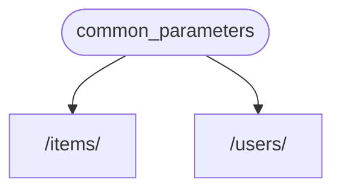
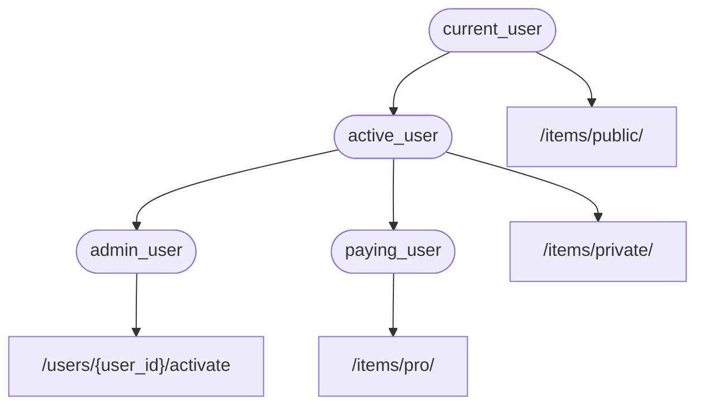

# Dependencias

**FastAPI** tiene un sistema de **<abbr title="también conocido como componentes, recursos, proveedores, servicios, inyectables">Inyección de Dependencias</abbr>** muy poderoso pero intuitivo.

Está diseñado para ser muy simple de usar, y para hacer que cualquier desarrollador integre otros componentes con **FastAPI** de forma muy sencilla.

## Qué es la "Inyección de Dependencias"

**"Inyección de Dependencias"** significa, en programación, que hay una manera para que tu código (en este caso, tus *path operation functions*) declare las cosas que necesita para funcionar y utilizar: "dependencias".

Y luego, ese sistema (en este caso **FastAPI**) se encargará de hacer lo que sea necesario para proporcionar a tu código esas dependencias necesarias ("inyectar" las dependencias).

Esto es muy útil cuando necesitas:

* Tener lógica compartida (la misma lógica de código una y otra vez).
* Compartir conexiones a bases de datos.
* Imponer seguridad, autenticación, requisitos de roles, etc.
* Y muchas otras cosas...

Todo esto, mientras minimizas la repetición de código.

## Primeros Pasos

Veamos un ejemplo muy simple. Será tan simple que no es muy útil, por ahora.

Pero de esta manera podemos enfocarnos en cómo funciona el sistema de **Inyección de Dependencias**.

### Crear una dependencia, o "dependable"

Primero enfoquémonos en la dependencia.

Es solo una función que puede tomar todos los mismos parámetros que una *path operation function* puede tomar:

{* ../../docs_src/dependencies/tutorial001_an_py310.py hl[8:9] *}

Eso es todo.

**2 líneas**.

Y tiene la misma forma y estructura que todas tus *path operation functions*.

Puedes pensar en ella como una *path operation function* sin el "decorador" (sin el `@app.get("/some-path")`).

Y puede devolver lo que quieras.

En este caso, esta dependencia espera:

* Un parámetro de query opcional `q` que es un `str`.
* Un parámetro de query opcional `skip` que es un `int`, y por defecto es `0`.
* Un parámetro de query opcional `limit` que es un `int`, y por defecto es `100`.

Y luego solo devuelve un `dict` que contiene esos valores.

/// info | Información

FastAPI agregó soporte para `Annotated` (y comenzó a recomendarlo) en la versión 0.95.0.

Si tienes una versión anterior, obtendrás errores al intentar usar `Annotated`.

Asegúrate de [Actualizar la versión de FastAPI](../../deployment/versions.md#upgrading-the-fastapi-versions){.internal-link target=_blank} al menos a la 0.95.1 antes de usar `Annotated`.

///

### Importar `Depends`

{* ../../docs_src/dependencies/tutorial001_an_py310.py hl[3] *}

### Declarar la dependencia, en el "dependant"

De la misma forma en que usas `Body`, `Query`, etc. con los parámetros de tu *path operation function*, usa `Depends` con un nuevo parámetro:

{* ../../docs_src/dependencies/tutorial001_an_py310.py hl[13,18] *}

Aunque usas `Depends` en los parámetros de tu función de la misma manera que usas `Body`, `Query`, etc., `Depends` funciona un poco diferente.

Le das a `Depends` un solo parámetro.

Este parámetro debe ser algo como una función.

**No la llames** directamente (no agregues los paréntesis al final), solo pásala como un parámetro a `Depends()`.

Y esa función toma parámetros de la misma manera que las *path operation functions*.

/// tip | Consejo

Verás qué otras "cosas", además de funciones, pueden usarse como dependencias en el próximo capítulo.

///

Cada vez que llega un nuevo request, **FastAPI** se encargará de:

* Llamar a tu función de dependencia ("dependable") con los parámetros correctos.
* Obtener el resultado de tu función.
* Asignar ese resultado al parámetro en tu *path operation function*.



De esta manera escribes código compartido una vez y **FastAPI** se encarga de llamarlo para tus *path operations*.

/// check | Revisa

Nota que no tienes que crear una clase especial y pasarla en algún lugar a **FastAPI** para "registrarla" o algo similar.

Solo la pasas a `Depends` y **FastAPI** sabe cómo hacer el resto.

///

## Compartir dependencias `Annotated`

En los ejemplos anteriores, ves que hay un poquito de **duplicación de código**.

Cuando necesitas usar la dependencia `common_parameters()`, tienes que escribir todo el parámetro con la anotación de tipo y `Depends()`:

```Python
commons: Annotated[dict, Depends(common_parameters)]
```

Pero como estamos usando `Annotated`, podemos almacenar ese valor `Annotated` en una variable y usarlo en múltiples lugares:

{* ../../docs_src/dependencies/tutorial001_02_an_py310.py hl[12,16,21] *}

/// tip | Consejo

Esto es solo Python estándar, se llama un "alias de tipo", en realidad no es específico de **FastAPI**.

Pero porque **FastAPI** está basado en los estándares de Python, incluido `Annotated`, puedes usar este truco en tu código. 😎

///

Las dependencias seguirán funcionando como se esperaba, y la **mejor parte** es que la **información de tipo se preservará**, lo que significa que tu editor podrá seguir proporcionándote **autocompletado**, **errores en línea**, etc. Lo mismo para otras herramientas como `mypy`.

Esto será especialmente útil cuando lo uses en una **gran base de código** donde uses **las mismas dependencias** una y otra vez en **muchas *path operations***.

## Usar `async` o no usar `async`

Como las dependencias también serán llamadas por **FastAPI** (lo mismo que tus *path operation functions*), las mismas reglas aplican al definir tus funciones.

Puedes usar `async def` o `def` normal.

Y puedes declarar dependencias con `async def` dentro de *path operation functions* normales `def`, o dependencias `def` dentro de *path operation functions* `async def`, etc.

No importa. **FastAPI** sabrá qué hacer.

/// note | Nota

Si no lo sabes, revisa la sección [Async: *"¿Con prisa?"*](../../async.md#in-a-hurry){.internal-link target=_blank} sobre `async` y `await` en la documentación.

///

## Integración con OpenAPI

Todas las declaraciones de request, validaciones y requisitos de tus dependencias (y sub-dependencias) se integrarán en el mismo esquema de OpenAPI.

Así, la documentación interactiva tendrá toda la información de estas dependencias también:


## Uso simple

Si lo ves, las *path operation functions* se declaran para ser usadas siempre que un *path* y una *operación* coincidan, y luego **FastAPI** se encarga de llamar la función con los parámetros correctos, extrayendo los datos del request.

En realidad, todos (o la mayoría) de los frameworks web funcionan de esta misma manera.

Nunca llamas directamente a esas funciones. Son llamadas por tu framework (en este caso, **FastAPI**).

Con el sistema de Inyección de Dependencias, también puedes decirle a **FastAPI** que tu *path operation function* también "depende" de algo más que debe ejecutarse antes que tu *path operation function*, y **FastAPI** se encargará de ejecutarlo e "inyectar" los resultados.

Otros términos comunes para esta misma idea de "inyección de dependencias" son:

* recursos
* proveedores
* servicios
* inyectables
* componentes

## Plug-ins de **FastAPI**

Las integraciones y "plug-ins" pueden construirse usando el sistema de **Inyección de Dependencias**. Pero, de hecho, en realidad **no hay necesidad de crear "plug-ins"**, ya que al usar dependencias es posible declarar una cantidad infinita de integraciones e interacciones que se vuelven disponibles para tus *path operation functions*.

Y las dependencias se pueden crear de una manera muy simple e intuitiva que te permite simplemente importar los paquetes de Python que necesitas, e integrarlos con tus funciones de API en un par de líneas de código, *literalmente*.

Verás ejemplos de esto en los próximos capítulos, sobre bases de datos relacionales y NoSQL, seguridad, etc.

## Compatibilidad de **FastAPI**

La simplicidad del sistema de inyección de dependencias hace que **FastAPI** sea compatible con:

* todas las bases de datos relacionales
* bases de datos NoSQL
* paquetes externos
* APIs externas
* sistemas de autenticación y autorización
* sistemas de monitoreo de uso de la API
* sistemas de inyección de datos de response
* etc.

## Simple y Poderoso

Aunque el sistema de inyección de dependencias jerárquico es muy simple de definir y usar, sigue siendo muy poderoso.

Puedes definir dependencias que a su vez pueden definir dependencias ellas mismas.

Al final, se construye un árbol jerárquico de dependencias, y el sistema de **Inyección de Dependencias** se encarga de resolver todas estas dependencias por ti (y sus sub-dependencias) y proporcionar (inyectar) los resultados en cada paso.

Por ejemplo, digamos que tienes 4 endpoints de API (*path operations*):

* `/items/public/`
* `/items/private/`
* `/users/{user_id}/activate`
* `/items/pro/`

entonces podrías agregar diferentes requisitos de permiso para cada uno de ellos solo con dependencias y sub-dependencias:



## Integrado con **OpenAPI**

Todas estas dependencias, al declarar sus requisitos, también añaden parámetros, validaciones, etc. a tus *path operations*.

**FastAPI** se encargará de agregar todo al esquema de OpenAPI, para que se muestre en los sistemas de documentación interactiva.
