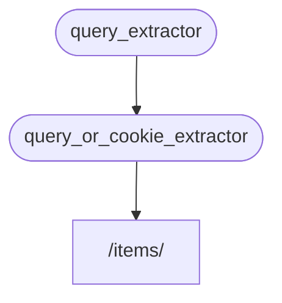

# Sub-dependencias

Puedes crear dependencias que tengan **sub-dependencias**.

Pueden ser tan **profundas** como necesites.

**FastAPI** se encargará de resolverlas.

## Primera dependencia "dependable"

Podrías crear una primera dependencia ("dependable") así:

{* ../../docs_src/dependencies/tutorial005_an_py310.py hl[8:9] *}

Declara un parámetro de query opcional `q` como un `str`, y luego simplemente lo devuelve.

Esto es bastante simple (no muy útil), pero nos ayudará a centrarnos en cómo funcionan las sub-dependencias.

## Segunda dependencia, "dependable" y "dependant"

Luego puedes crear otra función de dependencia (un "dependable") que al mismo tiempo declare una dependencia propia (por lo que también es un "dependant"):

{* ../../docs_src/dependencies/tutorial005_an_py310.py hl[13] *}

Centrémonos en los parámetros declarados:

* Aunque esta función es una dependencia ("dependable") en sí misma, también declara otra dependencia (depende de algo más).
    * Depende del `query_extractor`, y asigna el valor que devuelve al parámetro `q`.
* También declara una `last_query` cookie opcional, como un `str`.
    * Si el usuario no proporcionó ningún query `q`, usamos el último query utilizado, que guardamos previamente en una cookie.

## Usa la dependencia

Entonces podemos usar la dependencia con:

{* ../../docs_src/dependencies/tutorial005_an_py310.py hl[23] *}

/// info | Información

Fíjate que solo estamos declarando una dependencia en la *path operation function*, `query_or_cookie_extractor`.

Pero **FastAPI** sabrá que tiene que resolver `query_extractor` primero, para pasar los resultados de eso a `query_or_cookie_extractor` al llamarlo.

///



## Usando la misma dependencia múltiples veces

Si una de tus dependencias se declara varias veces para la misma *path operation*, por ejemplo, múltiples dependencias tienen una sub-dependencia común, **FastAPI** sabrá llamar a esa sub-dependencia solo una vez por request.

Y guardará el valor devuelto en un <abbr title="Una utilidad/sistema para almacenar valores calculados/generados, para reutilizarlos en lugar de calcularlos nuevamente.">"cache"</abbr> y lo pasará a todos los "dependants" que lo necesiten en ese request específico, en lugar de llamar a la dependencia varias veces para el mismo request.

En un escenario avanzado donde sabes que necesitas que la dependencia se llame en cada paso (posiblemente varias veces) en el mismo request en lugar de usar el valor "cache", puedes establecer el parámetro `use_cache=False` al usar `Depends`:

//// tab | Python 3.8+

```Python hl_lines="1"
async def needy_dependency(fresh_value: Annotated[str, Depends(get_value, use_cache=False)]):
    return {"fresh_value": fresh_value}
```

////

//// tab | Python 3.8+ sin Anotaciones

/// tip | Consejo

Prefiere usar la versión `Annotated` si es posible.

///

```Python hl_lines="1"
async def needy_dependency(fresh_value: str = Depends(get_value, use_cache=False)):
    return {"fresh_value": fresh_value}
```

////

## Resumen

Aparte de todas las palabras rimbombantes usadas aquí, el sistema de **Inyección de Dependencias** es bastante simple.

Solo son funciones que se ven igual que las *path operation functions*.

Pero aun así, es muy potente y te permite declarar "grafos" de dependencia anidados arbitrariamente profundos (árboles).

/// tip | Consejo

Todo esto podría no parecer tan útil con estos ejemplos simples.

Pero verás lo útil que es en los capítulos sobre **seguridad**.

Y también verás la cantidad de código que te ahorrará.

///
