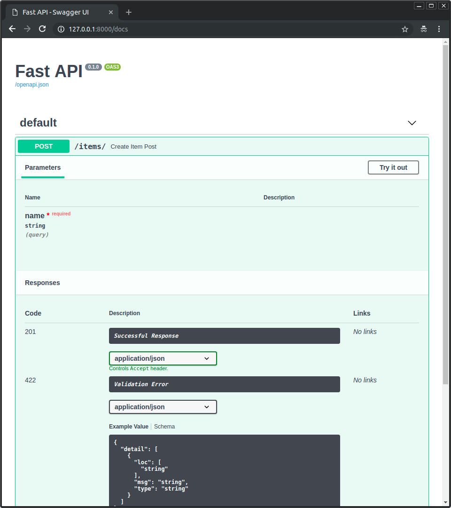

# Response Status Code

De la misma manera que puedes especificar un modelo de respuesta, también puedes declarar códigos de estado HTTP
usados para la respuesta con el parámetro `status_code` en cualquiera de los *path operations*:

- `@app.get()`
- `@app.post()`
- `@app.put()`
- `@app.delete()`
- etc.

```Python hl_lines="6"
{!../../../docs_src/response_status_code/tutorial001.py!}
```

!!! note
    Ten en cuenta que `status_code` es un parámetro del método del "decorador" (`get`, `post`, etc)-
No de la función de tu *path operation*, como todos los parámetros y cuerpo.


El parámetro `status_code` recibe un número con el código del estado HTTP.

!!! info
   `status_code` puede alternativamente recibir un `IntEnum`, como <a href="https://docs.python.org/3/library/http.html#http.HTTPStatus" class="external-link" target="_blank">`http.HTTPStatus`</a> de Python.

Será:

   - Devolverá ese código de estado en la respuesta.
   - Lo documentará como tal en el esquema OpenAPI (y por lo tanto, en las interfaces de usuario):





!!! note
    Algunos códigos de respuesta (ve la siguiente sección) indica que la respuesta no tiene cuerpo.

```
FastAPI sabe esto, y producirá documentación OpenAPI diciendo que no hay cuerpo en la respuesta.
```

# Acerca de los códigos de estado HTTP

!!! note
    Si ya sabes lo que son los códigos de estado HTTP, salta a la siguiente sección.

En HTTP, tú envías un código de estado de tres dígitos como parte de la respuesta.

Estos códigos de estado tienen un nombre asociado para reconocerlos, pero lo más importante es el número.

En resumen:

 - `100` en adelante son para "Información". Rara vez los usas directamente. Las respuestas con estos códigos de estado no tienen cuerpo.
 - `200` en adelante son para respuestas "Exitosas". Estos son los que se usan con mayor frecuencia.
      - `200` es el código de estado por defecto, el cual significa que todo estuvo "OK".
      - Otro ejemplo sería `201`, "Creado". Es comúnmente usado después de crear una nueva entrada en la base de datos.
      - `204` es un caso especial, "Sin contenido". Esta respuesta es usada cuando no hay contenido para devolver al cliente,
      y la respuesta no debe tener cuerpo.

- `300` en adelante son para "Redirección". Las Respuestas con estos códigos de estado pueden o no tener cuerpo, excepto para `304`, "No Modificado",
  el cual no debe tener cuerpo.

- `400` en adelante son para respuestas de `Error del Cliente`. Estos son el segundo tipo de codigós que probablemente más usarás.
     - Un ejemplo es `404`, para respuesta de "No encontrado".
     - Para errores genéricos desde el cliente, puedes usar `400`.

- `500` en adelante son para errores del servidor. Tú casi nunca los usas directamente. Cuando algo sale mal en alguna parte del código de tu aplicación,
  o en el servidor, automáticamente retornará uno de estos códigos.

!!! tip
    Para saber más acerca de estos códigos de estado y cuál código se usa para cada caso, revisa la
<a href="https://developer.mozilla.org/en-US/docs/Web/HTTP/Status" class="external-link" target="_blank"><abbr title="Mozilla Developer Network"> documentación acerca de los códigos de estado MDN</abbr> .

# Atajos para recordar los nombres

Vamos a ver el ejemplo previo otra vez:

```Python hl_lines="6"
{!../../../docs_src/response_status_code/tutorial001.py!}
```

`201` es el código de estado para "Creado".

Pero tú no tienes que memorizar lo que significa cada uno de estos códigos.

Puedes usar las convenientes variables desde `fastapi.status`.

```Python hl_lines="6"
{!../../../docs_src/response_status_code/tutorial002.py!}
```

Son solo convenientes, mantienen el mismo número, pero puedes usar el autocompletado del editor para encontrarlas:


!!! note "Detalles técnicos"
    Podrías usar también `from starlette import status`.


```
**FastAPI** provee el mismo `starlette.status` como  `fastapi.status`  solo como una conveniencia para tí, el desarrollador. Pero viene directamente desde Starlette.
```

# Cambiando el por defecto

Después, en la [Guía Avanzada de Usuario](https://github.com/carlosm27/fastapi/blob/master/docs/en/docs/advanced/response-change-status-code.md), verás cómo retornar un coódigo de estado diferente al predeterminado que declaras aquí.
