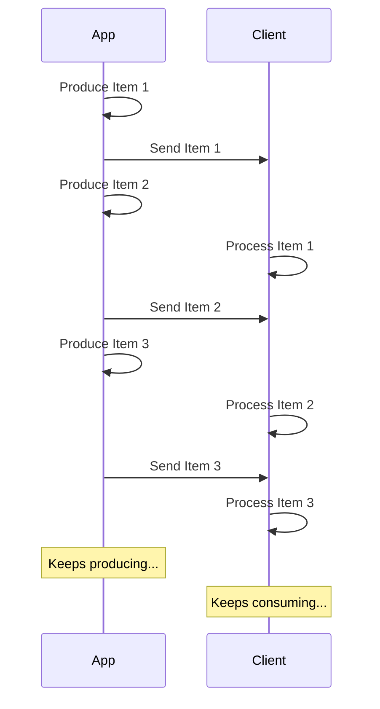

# Transmitir JSON Lines { #stream-json-lines }

Podrías tener una secuencia de datos que quieras enviar en un "**stream**", podrías hacerlo con **JSON Lines**.

/// info | Información

Añadido en FastAPI 0.134.0.

///

## ¿Qué es un Stream? { #what-is-a-stream }

Hacer "**Streaming**" de datos significa que tu app empezará a enviar ítems de datos al cliente sin esperar a que toda la secuencia de ítems esté lista.

Entonces, enviará el primer ítem, el cliente lo recibirá y empezará a procesarlo, y tú podrías seguir produciendo el siguiente ítem.



Incluso podría ser un stream infinito, donde sigues enviando datos.

## JSON Lines { #json-lines }

En estos casos, es común enviar "**JSON Lines**", que es un formato donde envías un objeto JSON por línea.

Una response tendría un tipo de contenido `application/jsonl` (en lugar de `application/json`) y el response body sería algo como:

```json
{"name": "Plumbus", "description": "A multi-purpose household device."}
{"name": "Portal Gun", "description": "A portal opening device."}
{"name": "Meeseeks Box", "description": "A box that summons a Meeseeks."}
```

Es muy similar a un array JSON (equivalente de una list de Python), pero en lugar de estar envuelto en `[]` y tener `,` entre los ítems, tiene **un objeto JSON por línea**, separados por un carácter de nueva línea.

/// info | Información

El punto importante es que tu app podrá producir cada línea a su turno, mientras el cliente consume las líneas anteriores.

///

/// note | Detalles técnicos

Como cada objeto JSON estará separado por una nueva línea, no pueden contener caracteres de nueva línea literales en su contenido, pero sí pueden contener nuevas líneas escapadas (`\n`), lo cual es parte del estándar JSON.

Pero normalmente no tendrás que preocuparte por eso, se hace automáticamente, sigue leyendo. 🤓

///

## Casos de uso { #use-cases }

Podrías usar esto para hacer stream de datos desde un servicio de **AI LLM**, desde **logs** o **telemetry**, o desde otros tipos de datos que puedan estructurarse en ítems **JSON**.

/// tip | Consejo

Si quieres hacer stream de datos binarios, por ejemplo video o audio, Revisa la guía avanzada: [Transmitir datos](../advanced/stream-data.md).

///

## Transmitir JSON Lines con FastAPI { #stream-json-lines-with-fastapi }

Para transmitir JSON Lines con FastAPI puedes, en lugar de usar `return` en tu *path operation function*, usar `yield` para producir cada ítem a su turno.

{* ../../docs_src/stream_json_lines/tutorial001_py310.py ln[1:24] hl[24] *}

Si cada ítem JSON que quieres enviar de vuelta es de tipo `Item` (un modelo de Pydantic) y es una función async, puedes declarar el tipo de retorno como `AsyncIterable[Item]`:

{* ../../docs_src/stream_json_lines/tutorial001_py310.py ln[1:24] hl[9:11,22] *}

Si declaras el tipo de retorno, FastAPI lo usará para **validar** los datos, **documentarlos** en OpenAPI, **filtrarlos** y **serializarlos** usando Pydantic.

/// tip | Consejo

Como Pydantic lo serializará en el lado de **Rust**, obtendrás un **rendimiento** mucho mayor que si no declaras un tipo de retorno.

///

### *path operation functions* no-async { #non-async-path-operation-functions }

También puedes usar funciones `def` regulares (sin `async`), y usar `yield` de la misma forma.

FastAPI se asegurará de que se ejecute correctamente para que no bloquee el event loop.

Como en este caso la función no es async, el tipo de retorno correcto sería `Iterable[Item]`:

{* ../../docs_src/stream_json_lines/tutorial001_py310.py ln[27:30] hl[28] *}

### Sin tipo de retorno { #no-return-type }

También puedes omitir el tipo de retorno. Entonces FastAPI usará [`jsonable_encoder`](./encoder.md) para convertir los datos a algo que se pueda serializar a JSON y luego enviarlo como JSON Lines.

{* ../../docs_src/stream_json_lines/tutorial001_py310.py ln[33:36] hl[34] *}

## Server-Sent Events (SSE) { #server-sent-events-sse }

FastAPI también tiene soporte de primera clase para Server-Sent Events (SSE), que son bastante similares pero con un par de detalles extra. Puedes aprender sobre ellos en el siguiente capítulo: [Eventos enviados por el servidor (SSE)](server-sent-events.md). 🤓
