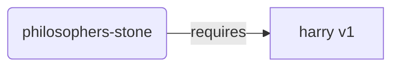
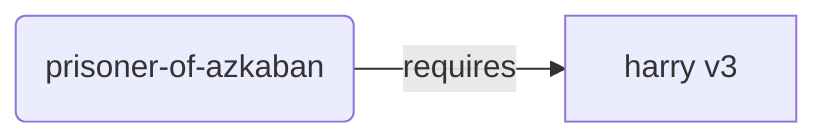
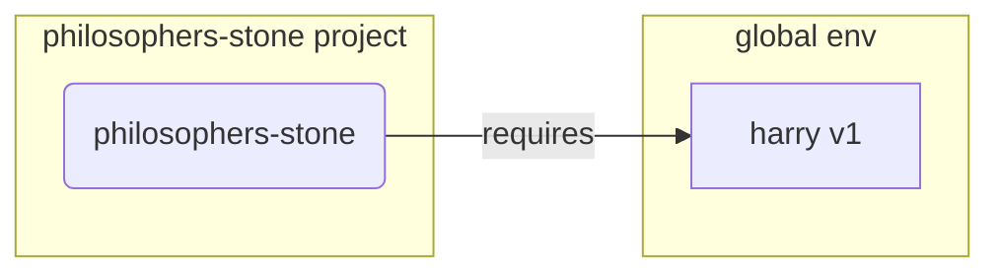
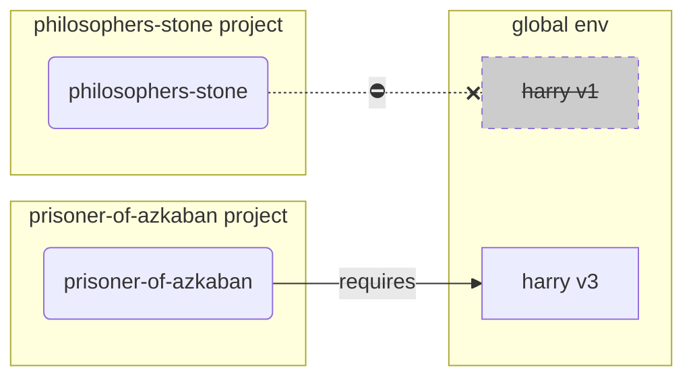
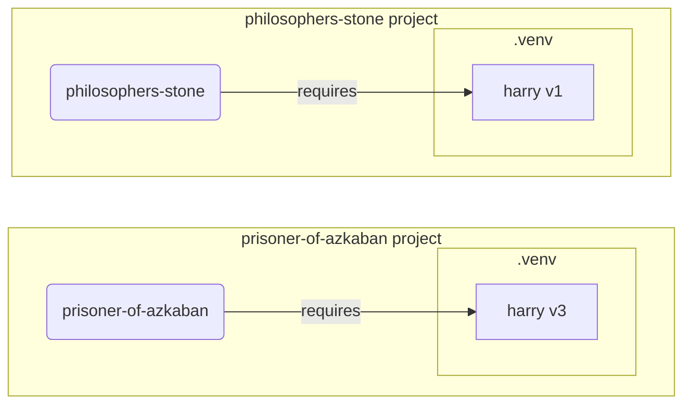

# Entornos Virtuales

Cuando trabajas en proyectos Python probablemente deberías usar **entornos virtuales** (o algún mecanismo similar) para aislar los paquetes que instalas para cada proyecto.

/// info

Si ya sabes sobre entornos virtuales, cómo crearlos y usarlos, podrías saltarte esta sección. 🤓

///

/// tip

Un **entorno virtual** es diferente de una **variable de entorno**.

Una **variable de entorno** es una variable en el sistema que puede ser utilizada por programas.

Un **entorno virtual** es un directorio con algunos archivos en él.

///

/// info

Esta página te enseñará cómo usar **entornos virtuales** y cómo funcionan.

Si estás listo para adoptar una **herramienta que gestione todo** por ti (incluyendo la instalación de Python), prueba <a href="https://github.com/astral-sh/uv" class="external-link" target="_blank">uv</a>.

///

## Crea un Proyecto

Primero, crea un directorio para tu proyecto.

Lo que normalmente hago es crear un directorio llamado `code` dentro de mi directorio home/user.

Y dentro de él creo un directorio para cada proyecto.

<div class="termy">

```console
// Ve al directorio home (raíz)
$ cd
// Crea un directorio para todos tus proyectos de programación
$ mkdir code
// Entra dentro de ese directorio
$ cd code
// Crea un directorio para un proyecto
$ mkdir awesome-project
// Entra dentro del directorio del proyecto
$ cd awesome-project
```

</div>

## Crea un Entorno Virtual

Cuando comiences a trabajar en un proyecto Python **por primera vez**, crea un entorno virtual **<abbr title="existen otras opciones, esta es una sencilla guía">dentro de tu proyecto</abbr>**.

/// tip

Sólo necesitas hacer esto **una vez por cada proyecto**, no cada vez que trabajas.

///

//// tab | `venv`

Para crear un entorno virtual puedes usar el módulo `venv` que viene con Python.

<div class="termy">

```console
$ python -m venv .venv
```

</div>

/// details | Qué significa cada comando

* `python`: usa el programa llamado `python`
* `-m`: ejecuta el módulo como un script, indicando el módulo a continuación
* `venv`: usa el módulo llamado `venv` que normalmente viene instalado con Python
* `.venv`: crea el entorno virtual en el nuevo directorio `.venv`

///

////

//// tab | `uv`

Si tienes <a href="https://github.com/astral-sh/uv" class="external-link" target="_blank">`uv`</a> instalado, puedes usarlo para crear un entorno virtual.

<div class="termy">

```console
$ uv venv
```

</div>

/// tip

Por defecto, `uv` creará un entorno virtual en un directorio llamado `.venv`.

Pero puedes personalizarlo pasando un argumento adicional indicando el nombre del directorio que deseas crear.

///

////

Este comando crea un nuevo entorno virtual en un directorio llamado `.venv`.

/// details | `.venv` u otro nombre

Puedes crear un entorno virtual en un directorio diferente, pero existe una convención para denominarlo `.venv`.

///

## Activa el Entorno Virtual

Activa el nuevo entorno virtual para que cualquier comando Python que ejecutes o paquete que instales lo haga en dicho entorno.

/// tip

Haz esto **cada vez** que inicies una **nueva sesión de terminal** para trabajar en el proyecto.

///

//// tab | Linux, macOS

<div class="termy">

```console
$ source .venv/bin/activate
```

</div>

////

//// tab | Windows PowerShell

<div class="termy">

```console
$ .venv\Scripts\Activate.ps1
```

</div>

////

//// tab | Windows Bash

O si usas Bash para Windows (e.g. <a href="https://gitforwindows.org/" class="external-link" target="_blank">Git Bash</a>):

<div class="termy">

```console
$ source .venv/Scripts/activate
```

</div>

////

/// tip

Cada vez que instales un **nuevo paquete** en ese entorno, **activa** el entorno de nuevo.

Esto asegura que si usas un **programa de terminal (<abbr title="command line interface">CLI</abbr>)** instalado por ese paquete, usarás el de tu entorno virtual y no cualquier otro que pudiera estar instalado globalmente, probablemente con una versión diferente a a la que necesitas.

///

## Comprueba que el Entorno Virtual está Activo

Comprueba que el entorno virtual está activo (es decir, que el comando anterior funcionó).

/// tip

Esto es **opcional**, pero es una buena manera de **comprobar** que todo está funcionando como esperas y que estás usando el entorno virtual que deseas.

///

//// tab | Linux, macOS, Windows Bash

<div class="termy">

```console
$ which python

/home/user/code/awesome-project/.venv/bin/python
```

</div>

Si se muestra el fichero ejecutable `python` en `.venv/bin/python`, dentro de tu proyecto (en este caso `awesome-project`), entonces funcionó. 🎉

////

//// tab | Windows PowerShell

<div class="termy">

```console
$ Get-Command python

C:\Users\user\code\awesome-project\.venv\Scripts\python
```

</div>

Si se muestra el fichero ejecutable `python` en `.venv\Scripts\python`, dentro de tu proyecto (en este caso `awesome-project`), entonces funcionó. 🎉

////

## Actualiza `pip`

/// tip

Si usas <a href="https://github.com/astral-sh/uv" class="external-link" target="_blank">`uv`</a> podrías utilizarlo para instalar algunas cosas, en vez de `pip`, por lo que no necesitas actualizar `pip`. 😎

///

Si usas `pip` para instalar paquetes (viene por defecto con Python), deberías **actualizarlo** a la última versión.

Muchos errores exóticos que aparecen cuando instalas un paquete se resuelven simplemente con actualizar primero `pip`.

/// tip

Normalmente deberías hacer esto **una vez**, justo después de crear el entorno virtual.

///

Asegúrate que el entorno virtual está activo (con el comando anterior) y ejecuta:

<div class="termy">

```console
$ python -m pip install --upgrade pip

---> 100%
```

</div>

## Añade `.gitignore`

Si estás usando **Git** (deberías), añade el fichero `.gitignore` para excluir todo el contenido de `.venv` de Git.

/// tip

Si usas <a href="https://github.com/astral-sh/uv" class="external-link" target="_blank">`uv`</a> para crear el entorno virtual, esta herramienta ya lo hace por ti, por lo que puedes saltar este paso. 😎

///

/// tip

Haz esto **una vez**, justo después de crear el entorno virtual.

///

<div class="termy">

```console
$ echo "*" > .venv/.gitignore
```

</div>

/// details | Qué significan los comandos

* `echo "*"`: imprimirá el texto `*` en la terminal (la siguiente parte cambia un poco)
* `>`: cualquier texto enviado a la terminal por el comando a la izquierda de `>` no se mostrará, sino que será escrito en el fichero indicado a la derecha de `>`
* `.gitignore`: el nombre del fichero donde el texto será escrito

`*` para Git significa "todo". Por lo tanto, ignorará todo el contenido del directorio `.venv`.

Así, ese comando creará un fichero `.gitignore` con el siguiente contenido:

```gitignore
*
```

///

## Instala Paquetes

Después de activar el entorno, puedes instalar paquetes en él.

/// tip

Haz esto al instalar o actualizar los paquetes que tu proyecto necesita.

Si necesitas actualizar una versión o instalar un nuevo paquete deberías **hacer esto de nuevo**.

///

### Instalar Paquetes Directamente

Si tienes prisa y no quieres usar un fichero para declarar los paquetes requeridos de tu proyecto, puedes instalarlos directamente.

/// tip

Es una (muy) buena idea poner todos los paquetes y versiones que tu programa necesita en un fichero (por ejemplo `requirements.txt` o `pyproject.toml`).

///

//// tab | `pip`

<div class="termy">

```console
$ pip install "fastapi[standard]"

---> 100%
```

</div>

////

//// tab | `uv`

Si tienes <a href="https://github.com/astral-sh/uv" class="external-link" target="_blank">`uv`</a>:

<div class="termy">

```console
$ uv pip install "fastapi[standard]"
---> 100%
```

</div>

////

### Instalar Paquetes Usando `requirements.txt`

Si tienes un fichero `requirements.txt`, puedes usarlo para instalar sus paquetes.

//// tab | `pip`

<div class="termy">

```console
$ pip install -r requirements.txt
---> 100%
```

</div>

////

//// tab | `uv`

Si tienes <a href="https://github.com/astral-sh/uv" class="external-link" target="_blank">`uv`</a>:

<div class="termy">

```console
$ uv pip install -r requirements.txt
---> 100%
```

</div>

////

/// details | `requirements.txt`

Un fichero `requirements.txt` con algunos paquetes puedes tener un aspecto similar a:

```requirements.txt
fastapi[standard]==0.113.0
pydantic==2.8.0
```

///

## Ejecuta tu Programa

Después de activar el entorno virtual, puedes ejecutar tu programa, y usará el binario Python que está dentro de tu entorno virtual con los paquetes que has instalado allí.

<div class="termy">

```console
$ python main.py

Hello World
```

</div>

## Configura tu Editor

Probablemente uses un editor, así que asegúrate de que lo configuras para usar el mismo entorno virtual que has creado (probablemente el editor será capaz de detectarlo), por lo que tendrás autocompletado y detección de errores en línea.

Por ejemplo:

* <a href="https://code.visualstudio.com/docs/python/environments#_select-and-activate-an-environment" class="external-link" target="_blank">VS Code</a>
* <a href="https://www.jetbrains.com/help/pycharm/creating-virtual-environment.html" class="external-link" target="_blank">PyCharm</a>

/// tip

Normalmente tendrás que hacer esto **una sóla vez**, cuando crees el entorno virtual.

///

## Desactiva el Entorno Virtual

Una vez que has hecho el trabajo en tu proyecto puedes **desactivar** el entorno virtual.

<div class="termy">

```console
$ deactivate
```

</div>

De esta manera, cuando ejecutas `python` no se ejecutará desde ese entorno virtual junto con los paquetes que contiene.

## Preparado para Trabajar

Ahora estás preparado para comennzar a trabajar en tu proyecto.


/// tip

¿Quieres comprender todo lo anterior?

Continua leyendo. 👇🤓

///

## Por qué Entornos Virtuales

Para trabajar con FastAPI necesitas instalar <a href="https://www.python.org/" class="external-link" target="_blank">Python</a>.

Después de eso, podrías tener que necesitar **instalar** FastAPI y algunos otros **paquetes** que quieras usar.

Para instalar paquetes, normalmente usas el comando `pip` que viene con Python (o alternativas similares).

Sin embargo, si tan sólo usas `pip` directamente, los paquetes podrían instalarse en tu **entorno global de Python** (donde se encuentra la instalación global de Python).

### El Problema

Pero, ¿cuál es el problema de instalar paquetes en el entorno global de Python?

En algún momento, probablemente terminarás escribiendo muchos programas diferentes que dependan de **diferentes paquetes**. Y algunos de estos proyectos en los que trabajas dependerán de **diferentes versiones** del mismo paquete. 😱

Por ejemplo, podrías crear un proyecto llamado `philosophers-stone`, y este programa depende de otro paquete llamado **`harry`, que usa la versión `1`**. Así que necesitas instalar `harry`.



Entonces, en algún momento posterior, creas otro proyecto denominado `prisoner-of-azkaban`, y este proyecto también depende de `harry`, pero en este caso, este proyecto necesita la **versión `harry` `3`**.



Así que ahora el problema es, si instalas los paquetes globalmente (en el entorno global) en vez de en un **entorno virtual** local, tendrías que escoger qué versión de `harry` instalar.

Si quieres ejecutar `philosophers-stone` primero tienes que instalar `harry` versión `1`, por ejemplo mediante:

<div class="termy">

```console
$ pip install "harry==1"
```

</div>

Y así tendrías el paquete `harry` versión `1` instalado en tu entorno global de Python.



Pero si quieres ejecutar `prisoner-of-azkaban`, necesitarás desinstalar `harry` versión `1` e instalar `harry` versión `3` (o tan sólo instalar la versión `3`, lo que automáticamente desinstalaría la versión `1`).

<div class="termy">

```console
$ pip install "harry==3"
```

</div>

Y así tendrías el paquete `harry` versión `3` instalado en tu entorno global de Python.

Pero, si quieres ejecutar `philosophers-stone` de nuevo, habría posibilidades de que **no funcionara** porque necesita `harry` versión `1`.



/// tip

Es una práctica muy común en los paquetes de Python intentar **evitar cambios incompatibles** en **nuevas versiones**, pero es mejor ser precavido e instalar nuevas versiones intencionalmente y cuando puedas ejecutar las pruebas necesarias para verificar que todo funciona correctamente.

///

Ahora, imagina eso con **muchos** otros **paquetes** de los que dependen todos tus **proyectos**. Es algo muy difícil de gestionar. Y probablemente terminarías ejecutando algunos proyectos con algunas **versiones incompatibles** de los paquetes, sin saber por qué algo no está funcionando.

Además, dependiendo de tu sistema operativo (por ejemplo, Linux, Windows, macOS), podría haber venido con Python ya instalado. Y en ese caso, probablemente tenía algunos paquetes preinstalados con versiones específicas **necesarias para tu sistema**. Si instalas paquetes en el entorno global de Python, podrías terminar **provocando que no funcionen** algunos de los programas que vinieron con tu sistema operativo.

## Dónde se Instalan los Paquetes

Cuando instalas Python, se crean algunos directorios con algunos ficheros en tu ordenador.

Algunos de estos directorios son los encargados de contener todos los paquetes que instalas.

Cuando ejecutas:

<div class="termy">

```console
// No lo ejecutes ahora, es tan sólo un ejemplo 🤓
$ pip install "fastapi[standard]"
---> 100%
```

</div>

Eso descargará un fichero comprimido con el código de FastAPI, normalmente desde <a href="https://pypi.org/project/fastapi/" class="external-link" target="_blank">PyPI</a>.

También **descargará** ficheros de otros paquetes de los que depende FastAPI.

Finalmente, se **extraerán** todos esos ficheros y se guardarán en un directorio de tu ordenador.

Por defecto, se guardarán esos archivos descargados y extraídos en el directorio de tu instalación de Python, ese es el **entorno global**.

## Qué son los Entornos Virtuales

La solución a los problemas de tener todos los paquetes en el entorno global es usar un **entorno virtual para cada proyecto** en el que trabajes.

Un entorno virtual es un **directorio**, muy similar al global, donde puedes instalar los paquetes para un proyecto.

De esta manera, cada proyecto tendrá su propio entorno virtual (directorio `.venv`) con sus propios paquetes.



## Qué Significa Activar un Entorno Virtual

Cuando activas un entorno virtual, por ejemplo con:

//// tab | Linux, macOS

<div class="termy">

```console
$ source .venv/bin/activate
```

</div>

////

//// tab | Windows PowerShell

<div class="termy">

```console
$ .venv\Scripts\Activate.ps1
```

</div>

////

//// tab | Windows Bash

O si usas Bash para Windows (e.g. <a href="https://gitforwindows.org/" class="external-link" target="_blank">Git Bash</a>):

<div class="termy">

```console
$ source .venv/Scripts/activate
```

</div>

////

Esos comandos crearán o modificarán algunas [variables de entorno](environment-variables.md){.internal-link target=_blank}que estarán disponibles para los siguientes comandos.

Una de esas variables es la variable `PATH`.

/// tip

Puedes aprender más sobre la variable de entorno `PATH` en la sección [Variables de Entorno](environment-variables.md#path-environment-variable){.internal-link target=_blank}.

///

Activar un entorno virtual agrega su ruta `.venv/bin` (en Linux y macOS) o `.venv\Scripts` (en Windows) a la variable de entorno `PATH`.

Supongamos que antes de activar el entorno, la variable `PATH` contiene:

//// tab | Linux, macOS

```plaintext
/usr/bin:/bin:/usr/sbin:/sbin
```

Eso significa que el sistema buscaría programas en:

* `/usr/bin`
* `/bin`
* `/usr/sbin`
* `/sbin`

////

//// tab | Windows

```plaintext
C:\Windows\System32
```

Eso significa que el sistema buscaría programas en:

* `C:\Windows\System32`

////

Después de activar el entorno virtual, la variable `PATH` se vería algo así:

//// tab | Linux, macOS

```plaintext
/home/user/code/awesome-project/.venv/bin:/usr/bin:/bin:/usr/sbin:/sbin
```

Eso significa que el sistema ahora comenzará en primer lugar a buscar programas en:

```plaintext
/home/user/code/awesome-project/.venv/bin
```

antes de buscar en los otros directorios.

Entonces, cuando escribas `python` en la terminal, el sistema encontrará el programa Python en:

```plaintext
/home/user/code/awesome-project/.venv/bin/python
```

y usará ése.

////

//// tab | Windows

```plaintext
C:\Users\user\code\awesome-project\.venv\Scripts;C:\Windows\System32
```

Eso significa que el sistema ahora comenzará en primer lugar a buscar programas en:

```plaintext
C:\Users\user\code\awesome-project\.venv\Scripts
```

antes de buscar en los otros directorios.

Entonces, cuando escribas `python` en la terminal, el sistema encontrará el programa Python en:

```plaintext
C:\Users\user\code\awesome-project\.venv\Scripts\python
```

y usará ése.

////

Un detalle importante es que se colocará la ruta del entorno virtual al **principio** de la variable `PATH`. El sistema lo encontrará **antes** de encontrar cualquier otro Python disponible. De esta manera, cuando ejecutes `python`, usará el Python **del entorno virtual** en lugar de cualquier otro `python` (por ejemplo, un `python` del entorno global).

Activar un entorno virtual también cambia un par de cosas más, pero ésta es una de las más importantes.

## Comprobar un Entorno Virtual

Cuando compruebas si un entorno virtual está activo, por ejemplo mediante:

//// tab | Linux, macOS, Windows Bash

<div class="termy">

```console
$ which python

/home/user/code/awesome-project/.venv/bin/python
```

</div>

////

//// tab | Windows PowerShell

<div class="termy">

```console
$ Get-Command python

C:\Users\user\code\awesome-project\.venv\Scripts\python
```

</div>

////

Eso significa que el programa `python` que se usará es el que está **en el entorno virtual**.

Usas `which` en Linux y macOS y `Get-Command` en Windows PowerShell.

La forma en que funcionan esos comandos es consultando la variable de entorno `PATH`, recorriendo **cada ruta en orden**, buscando el programa llamado `python`. Una vez que lo encuentren, te **mostrarán la ruta** a ese programa.

Lo más importante es que cuando llames a `python`, ése es justo el "`python`" que se ejecutará.

Así que puedes confirmar si estás en el entorno virtual correcto.

/// tip

Es fácil activar un entorno virtual, obtener un entorno Python, y luego **ir a otro proyecto**.

Y el segundo proyecto es posible que **no funcione** porque estás usando el **Python incorrecto**, de un entorno virtual para otro proyecto.

Por eso, es útil poder verificar qué `python` se está usando. 🤓

///

## Por qué Desactivar un Entorno Virtual

Por ejemplo, podrías estar trabajando en un proyecto llamado `philosophers-stone`, **activar ese entorno virtual**, instalar paquetes y trabajar con ese entorno.

Y luego quieres trabajar en **otro proyecto** llamado `prisoner-of-azkaban`.

Vas a ese proyecto:

<div class="termy">

```console
$ cd ~/code/prisoner-of-azkaban
```

</div>

Si no desactivas el entorno virtual de `philosophers-stone`, cuando ejecutes `python` en la terminal, intentará usar el Python de `philosophers-stone`.

<div class="termy">

```console
$ cd ~/code/prisoner-of-azkaban

$ python main.py

// Error importando sirius, no está instalado 😱
Traceback (most recent call last):
    File "main.py", line 1, in <module>
        import sirius
```

</div>

Pero si desactivas el entorno virtual y activas el nuevo para `prisoner-of-azkaban`, entonces cuando ejecutes `python` usará el Python del entorno virtual en `prisoner-of-azkaban`.

<div class="termy">

```console
$ cd ~/code/prisoner-of-azkaban

// No necesitas estar en el directorio anterior para desactivar, puedes hacerlo donde estés, incluso después de ir al otro proyecto. 😎
$ deactivate

// Activa el entorno virtual en prisoner-of-azkaban/.venv 🚀
$ source .venv/bin/activate

// Ahora, cuando ejecutes python, encontrará el paquete sirius instalado en este entorno virtual. ✨
$ python main.py

Lo juro solemnemente 🐺
```

</div>

## Alternativas

Esta es una guía simple para comenzar y enseñarte cómo funciona todo **"por debajo"**.

Hay muchas **alternativas** para gestionar entornos virtuales, dependencias de paquetes (requisitos), proyectos.

Una vez que estés listo y quieras usar una herramienta para **gestionar todo el proyecto**, dependencias de paquetes, entornos virtuales, etc., te sugeriría que pruebes <a href="https://github.com/astral-sh/uv" class="external-link" target="_blank">uv</a>.

`uv` puede hacer muchas cosas, como:

* **Instalar Python** por ti, incluyendo diferentes versiones
* Gestionar el **entorno virtual** para tus proyectos
* Instalar **paquetes**
* Gestionar las **dependencias y versiones** de los paquetes para tu proyecto
* Tener un conjunto **exacto** de paquetes y versiones para instalar, incluyendo sus dependencias, para que puedas estar seguro de que puedes ejecutar tu proyecto en producción exactamente igual que en tu ordenador mientras desarrollas, esto se llama **bloqueo**
* Y muchas otras cosas

## Conclusión

Si leíste y entendiste todo esto, ahora **sabes mucho más** sobre entornos virtuales que muchos desarrolladores. 🤓

Conocer estos detalles probablemente te será útil en el futuro cuando estés depurando algo que parece complejo, pero sabrás **cómo funciona todo "por debajo"**. 😎
