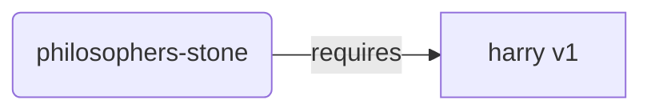
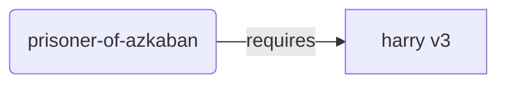
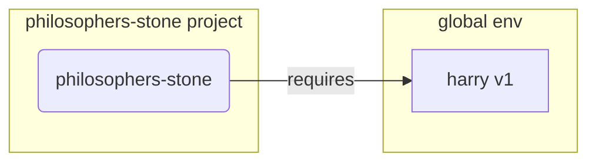
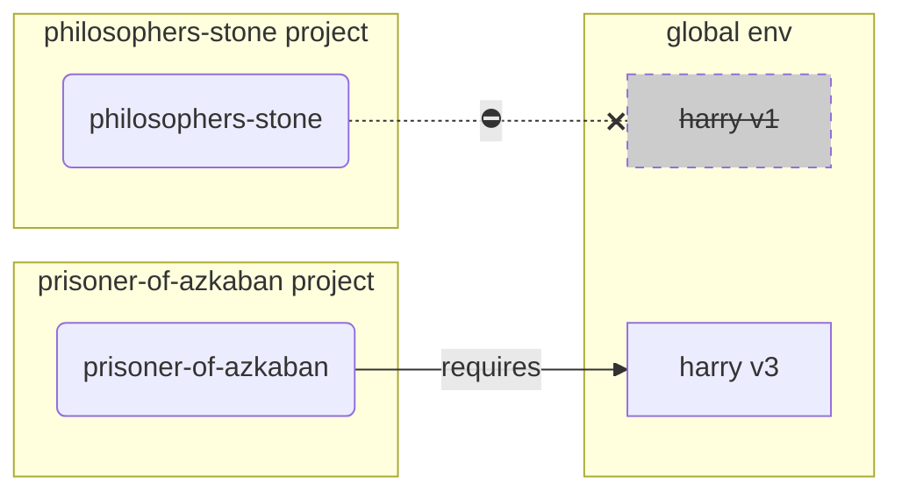
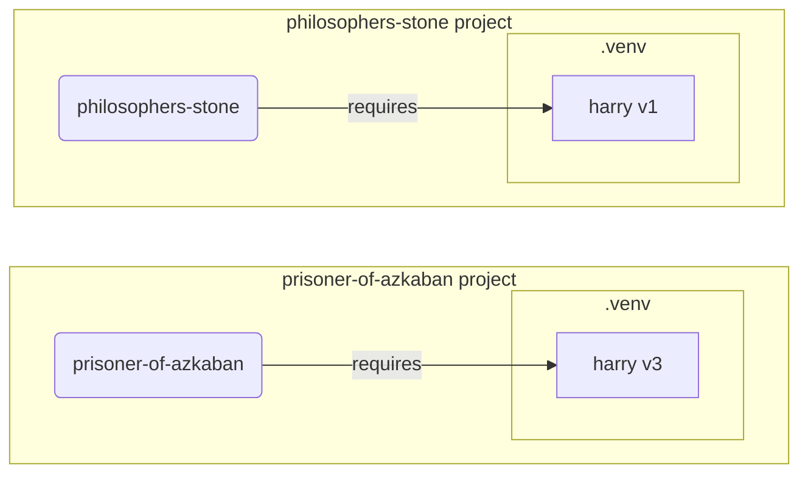

# Entornos Virtuales

Cuando trabajas en proyectos de Python probablemente deberías usar un **entorno virtual** (o un mecanismo similar) para aislar los paquetes que instalas para cada proyecto.

/// info | Información

Si ya sabes sobre entornos virtuales, cómo crearlos y usarlos, podrías querer saltar esta sección. 🤓

///

/// tip | Consejo

Un **entorno virtual** es diferente de una **variable de entorno**.

Una **variable de entorno** es una variable en el sistema que puede ser usada por programas.

Un **entorno virtual** es un directorio con algunos archivos en él.

///

/// info | Información

Esta página te enseñará cómo usar **entornos virtuales** y cómo funcionan.

Si estás listo para adoptar una **herramienta que gestiona todo** por ti (incluyendo la instalación de Python), prueba <a href="https://github.com/astral-sh/uv" class="external-link" target="_blank">uv</a>.

///

## Crea un Proyecto

Primero, crea un directorio para tu proyecto.

Lo que normalmente hago es crear un directorio llamado `code` dentro de mi directorio de usuario.

Y dentro de eso creo un directorio por proyecto.

<div class="termy">

```console
// Ve al directorio principal
$ cd
// Crea un directorio para todos tus proyectos de código
$ mkdir code
// Entra en ese directorio de código
$ cd code
// Crea un directorio para este proyecto
$ mkdir awesome-project
// Entra en ese directorio del proyecto
$ cd awesome-project
```

</div>

## Crea un Entorno Virtual

Cuando empiezas a trabajar en un proyecto de Python **por primera vez**, crea un entorno virtual **<abbr title="hay otras opciones, esto es solo una guía sencilla">dentro de tu proyecto</abbr>**.

/// tip | Consejo

Solo necesitas hacer esto **una vez por proyecto**, no cada vez que trabajas.

///

//// tab | `venv`

Para crear un entorno virtual, puedes usar el módulo `venv` que viene con Python.

<div class="termy">

```console
$ python -m venv .venv
```

</div>

/// details | Qué significa ese comando

* `python`: usa el programa llamado `python`
* `-m`: llama a un módulo como un script, indicaremos cuál módulo a continuación
* `venv`: usa el módulo llamado `venv` que normalmente viene instalado con Python
* `.venv`: crea el entorno virtual en el nuevo directorio `.venv`

///

////

//// tab | `uv`

Si tienes instalado <a href="https://github.com/astral-sh/uv" class="external-link" target="_blank">`uv`</a>, puedes usarlo para crear un entorno virtual.

<div class="termy">

```console
$ uv venv
```

</div>

/// tip | Consejo

Por defecto, `uv` creará un entorno virtual en un directorio llamado `.venv`.

Pero podrías personalizarlo pasando un argumento adicional con el nombre del directorio.

///

////

Ese comando crea un nuevo entorno virtual en un directorio llamado `.venv`.

/// details | `.venv` u otro nombre

Podrías crear el entorno virtual en un directorio diferente, pero hay una convención de llamarlo `.venv`.

///

## Activa el Entorno Virtual

Activa el nuevo entorno virtual para que cualquier comando de Python que ejecutes o paquete que instales lo utilicen.

/// tip | Consejo

Haz esto **cada vez** que inicies una **nueva sesión de terminal** para trabajar en el proyecto.

///

//// tab | Linux, macOS

<div class="termy">

```console
$ source .venv/bin/activate
```

</div>

////

//// tab | Windows PowerShell

<div class="termy">

```console
$ .venv\Scripts\Activate.ps1
```

</div>

////

//// tab | Windows Bash

O si usas Bash para Windows (por ejemplo, <a href="https://gitforwindows.org/" class="external-link" target="_blank">Git Bash</a>):

<div class="termy">

```console
$ source .venv/Scripts/activate
```

</div>

////

/// tip | Consejo

Cada vez que instales un **nuevo paquete** en ese entorno, **activa** el entorno de nuevo.

Esto asegura que si usas un programa de **terminal (<abbr title="command line interface">CLI</abbr>)** instalado por ese paquete, uses el de tu entorno virtual y no cualquier otro que podría estar instalado globalmente, probablemente con una versión diferente a la que necesitas.

///

## Verifica que el Entorno Virtual esté Activo

Verifica que el entorno virtual esté activo (el comando anterior funcionó).

/// tip | Consejo

Esto es **opcional**, pero es una buena forma de **revisar** que todo está funcionando como se esperaba y estás usando el entorno virtual que pretendes.

///

//// tab | Linux, macOS, Windows Bash

<div class="termy">

```console
$ which python

/home/user/code/awesome-project/.venv/bin/python
```

</div>

Si muestra el binario de `python` en `.venv/bin/python`, dentro de tu proyecto (en este caso `awesome-project`), entonces funcionó. 🎉

////

//// tab | Windows PowerShell

<div class="termy">

```console
$ Get-Command python

C:\Users\user\code\awesome-project\.venv\Scripts\python
```

</div>

Si muestra el binario de `python` en `.venv\Scripts\python`, dentro de tu proyecto (en este caso `awesome-project`), entonces funcionó. 🎉

////

## Actualiza `pip`

/// tip | Consejo

Si usas <a href="https://github.com/astral-sh/uv" class="external-link" target="_blank">`uv`</a> usarías eso para instalar cosas en lugar de `pip`, por lo que no necesitas actualizar `pip`. 😎

///

Si estás usando `pip` para instalar paquetes (viene por defecto con Python), deberías **actualizarlo** a la última versión.

Muchos errores exóticos al instalar un paquete se resuelven simplemente actualizando `pip` primero.

/// tip | Consejo

Normalmente harías esto **una vez**, justo después de crear el entorno virtual.

///

Asegúrate de que el entorno virtual esté activo (con el comando anterior) y luego ejecuta:

<div class="termy">

```console
$ python -m pip install --upgrade pip

---> 100%
```

</div>

## Añade `.gitignore`

Si estás usando **Git** (deberías), añade un archivo `.gitignore` para excluir todo en tu `.venv` de Git.

/// tip | Consejo

Si usaste <a href="https://github.com/astral-sh/uv" class="external-link" target="_blank">`uv`</a> para crear el entorno virtual, ya lo hizo por ti, puedes saltarte este paso. 😎

///

/// tip | Consejo

Haz esto **una vez**, justo después de crear el entorno virtual.

///

<div class="termy">

```console
$ echo "*" > .venv/.gitignore
```

</div>

/// details | Qué significa ese comando

* `echo "*"`: "imprimirá" el texto `*` en el terminal (la siguiente parte cambia eso un poco)
* `>`: cualquier cosa impresa en el terminal por el comando a la izquierda de `>` no debería imprimirse, sino escribirse en el archivo que va a la derecha de `>`
* `.gitignore`: el nombre del archivo donde debería escribirse el texto

Y `*` para Git significa "todo". Así que, ignorará todo en el directorio `.venv`.

Ese comando creará un archivo `.gitignore` con el contenido:

```gitignore
*
```

///

## Instala Paquetes

Después de activar el entorno, puedes instalar paquetes en él.

/// tip | Consejo

Haz esto **una vez** al instalar o actualizar los paquetes que necesita tu proyecto.

Si necesitas actualizar una versión o agregar un nuevo paquete, **harías esto de nuevo**.

///

### Instala Paquetes Directamente

Si tienes prisa y no quieres usar un archivo para declarar los requisitos de paquetes de tu proyecto, puedes instalarlos directamente.

/// tip | Consejo

Es una (muy) buena idea poner los paquetes y las versiones que necesita tu programa en un archivo (por ejemplo, `requirements.txt` o `pyproject.toml`).

///

//// tab | `pip`

<div class="termy">

```console
$ pip install "fastapi[standard]"

---> 100%
```

</div>

////

//// tab | `uv`

Si tienes <a href="https://github.com/astral-sh/uv" class="external-link" target="_blank">`uv`</a>:

<div class="termy">

```console
$ uv pip install "fastapi[standard]"
---> 100%
```

</div>

////

### Instala desde `requirements.txt`

Si tienes un `requirements.txt`, ahora puedes usarlo para instalar sus paquetes.

//// tab | `pip`

<div class="termy">

```console
$ pip install -r requirements.txt
---> 100%
```

</div>

////

//// tab | `uv`

Si tienes <a href="https://github.com/astral-sh/uv" class="external-link" target="_blank">`uv`</a>:

<div class="termy">

```console
$ uv pip install -r requirements.txt
---> 100%
```

</div>

////

/// details | `requirements.txt`

Un `requirements.txt` con algunos paquetes podría verse así:

```requirements.txt
fastapi[standard]==0.113.0
pydantic==2.8.0
```

///

## Ejecuta Tu Programa

Después de activar el entorno virtual, puedes ejecutar tu programa, y usará el Python dentro de tu entorno virtual con los paquetes que instalaste allí.

<div class="termy">

```console
$ python main.py

Hello World
```

</div>

## Configura Tu Editor

Probablemente usarías un editor, asegúrate de configurarlo para que use el mismo entorno virtual que creaste (probablemente lo autodetectará) para que puedas obtener autocompletado y errores en línea.

Por ejemplo:

* <a href="https://code.visualstudio.com/docs/python/environments#_select-and-activate-an-environment" class="external-link" target="_blank">VS Code</a>
* <a href="https://www.jetbrains.com/help/pycharm/creating-virtual-environment.html" class="external-link" target="_blank">PyCharm</a>

/// tip | Consejo

Normalmente solo tendrías que hacer esto **una vez**, cuando crees el entorno virtual.

///

## Desactiva el Entorno Virtual

Una vez que hayas terminado de trabajar en tu proyecto, puedes **desactivar** el entorno virtual.

<div class="termy">

```console
$ deactivate
```

</div>

De esta manera, cuando ejecutes `python` no intentará ejecutarse desde ese entorno virtual con los paquetes instalados allí.

## Listo para Trabajar

Ahora estás listo para empezar a trabajar en tu proyecto.

/// tip | Consejo

¿Quieres entender todo lo anterior?

Continúa leyendo. 👇🤓

///

## Por qué Entornos Virtuales

Para trabajar con FastAPI necesitas instalar <a href="https://www.python.org/" class="external-link" target="_blank">Python</a>.

Después de eso, necesitarías **instalar** FastAPI y cualquier otro **paquete** que desees usar.

Para instalar paquetes normalmente usarías el comando `pip` que viene con Python (o alternativas similares).

Sin embargo, si solo usas `pip` directamente, los paquetes se instalarían en tu **entorno global de Python** (la instalación global de Python).

### El Problema

Entonces, ¿cuál es el problema de instalar paquetes en el entorno global de Python?

En algún momento, probablemente terminarás escribiendo muchos programas diferentes que dependen de **diferentes paquetes**. Y algunos de estos proyectos en los que trabajas dependerán de **diferentes versiones** del mismo paquete. 😱

Por ejemplo, podrías crear un proyecto llamado `philosophers-stone`, este programa depende de otro paquete llamado **`harry`, usando la versión `1`**. Así que, necesitas instalar `harry`.



Luego, en algún momento después, creas otro proyecto llamado `prisoner-of-azkaban`, y este proyecto también depende de `harry`, pero este proyecto necesita **`harry` versión `3`**.



Pero ahora el problema es, si instalas los paquetes globalmente (en el entorno global) en lugar de en un **entorno virtual local**, tendrás que elegir qué versión de `harry` instalar.

Si deseas ejecutar `philosophers-stone` necesitarás primero instalar `harry` versión `1`, por ejemplo con:

<div class="termy">

```console
$ pip install "harry==1"
```

</div>

Y entonces terminarías con `harry` versión `1` instalada en tu entorno global de Python.



Pero luego si deseas ejecutar `prisoner-of-azkaban`, necesitarás desinstalar `harry` versión `1` e instalar `harry` versión `3` (o simplemente instalar la versión `3` automáticamente desinstalaría la versión `1`).

<div class="termy">

```console
$ pip install "harry==3"
```

</div>

Y entonces terminarías con `harry` versión `3` instalada en tu entorno global de Python.

Y si intentas ejecutar `philosophers-stone` de nuevo, hay una posibilidad de que **no funcione** porque necesita `harry` versión `1`.



/// tip | Consejo

Es muy común en los paquetes de Python intentar lo mejor para **evitar romper cambios** en **nuevas versiones**, pero es mejor estar seguro e instalar nuevas versiones intencionalmente y cuando puedas ejecutar las pruebas para verificar que todo está funcionando correctamente.

///

Ahora, imagina eso con **muchos** otros **paquetes** de los que dependen todos tus **proyectos**. Eso es muy difícil de manejar. Y probablemente terminarías ejecutando algunos proyectos con algunas **versiones incompatibles** de los paquetes, y sin saber por qué algo no está funcionando.

Además, dependiendo de tu sistema operativo (por ejemplo, Linux, Windows, macOS), podría haber venido con Python ya instalado. Y en ese caso probablemente tenía algunos paquetes preinstalados con algunas versiones específicas **necesitadas por tu sistema**. Si instalas paquetes en el entorno global de Python, podrías terminar **rompiendo** algunos de los programas que vinieron con tu sistema operativo.

## Dónde se Instalan los Paquetes

Cuando instalas Python, crea algunos directorios con algunos archivos en tu computadora.

Algunos de estos directorios son los encargados de tener todos los paquetes que instalas.

Cuando ejecutas:

<div class="termy">

```console
// No ejecutes esto ahora, solo es un ejemplo 🤓
$ pip install "fastapi[standard]"
---> 100%
```

</div>

Eso descargará un archivo comprimido con el código de FastAPI, normalmente desde <a href="https://pypi.org/project/fastapi/" class="external-link" target="_blank">PyPI</a>.

También **descargará** archivos para otros paquetes de los que depende FastAPI.

Luego, **extraerá** todos esos archivos y los pondrá en un directorio en tu computadora.

Por defecto, pondrá esos archivos descargados y extraídos en el directorio que viene con tu instalación de Python, eso es el **entorno global**.

## Qué son los Entornos Virtuales

La solución a los problemas de tener todos los paquetes en el entorno global es usar un **entorno virtual para cada proyecto** en el que trabajas.

Un entorno virtual es un **directorio**, muy similar al global, donde puedes instalar los paquetes para un proyecto.

De esta manera, cada proyecto tendrá su propio entorno virtual (directorio `.venv`) con sus propios paquetes.



## Qué Significa Activar un Entorno Virtual

Cuando activas un entorno virtual, por ejemplo con:

//// tab | Linux, macOS

<div class="termy">

```console
$ source .venv/bin/activate
```

</div>

////

//// tab | Windows PowerShell

<div class="termy">

```console
$ .venv\Scripts\Activate.ps1
```

</div>

////

//// tab | Windows Bash

O si usas Bash para Windows (por ejemplo, <a href="https://gitforwindows.org/" class="external-link" target="_blank">Git Bash</a>):

<div class="termy">

```console
$ source .venv/Scripts/activate
```

</div>

////

Ese comando creará o modificará algunas [variables de entorno](environment-variables.md){.internal-link target=_blank} que estarán disponibles para los siguientes comandos.

Una de esas variables es la variable `PATH`.

/// tip | Consejo

Puedes aprender más sobre la variable de entorno `PATH` en la sección [Variables de Entorno](environment-variables.md#path-environment-variable){.internal-link target=_blank}.

///

Activar un entorno virtual agrega su path `.venv/bin` (en Linux y macOS) o `.venv\Scripts` (en Windows) a la variable de entorno `PATH`.

Digamos que antes de activar el entorno, la variable `PATH` se veía así:

//// tab | Linux, macOS

```plaintext
/usr/bin:/bin:/usr/sbin:/sbin
```

Eso significa que el sistema buscaría programas en:

* `/usr/bin`
* `/bin`
* `/usr/sbin`
* `/sbin`

////

//// tab | Windows

```plaintext
C:\Windows\System32
```

Eso significa que el sistema buscaría programas en:

* `C:\Windows\System32`

////

Después de activar el entorno virtual, la variable `PATH` se vería algo así:

//// tab | Linux, macOS

```plaintext
/home/user/code/awesome-project/.venv/bin:/usr/bin:/bin:/usr/sbin:/sbin
```

Eso significa que el sistema ahora comenzará a buscar primero los programas en:

```plaintext
/home/user/code/awesome-project/.venv/bin
```

antes de buscar en los otros directorios.

Así que, cuando escribas `python` en el terminal, el sistema encontrará el programa Python en

```plaintext
/home/user/code/awesome-project/.venv/bin/python
```

y utilizará ese.

////

//// tab | Windows

```plaintext
C:\Users\user\code\awesome-project\.venv\Scripts;C:\Windows\System32
```

Eso significa que el sistema ahora comenzará a buscar primero los programas en:

```plaintext
C:\Users\user\code\awesome-project\.venv\Scripts
```

antes de buscar en los otros directorios.

Así que, cuando escribas `python` en el terminal, el sistema encontrará el programa Python en

```plaintext
C:\Users\user\code\awesome-project\.venv\Scripts\python
```

y utilizará ese.

////

Un detalle importante es que pondrá el path del entorno virtual al **comienzo** de la variable `PATH`. El sistema lo encontrará **antes** que cualquier otro Python disponible. De esta manera, cuando ejecutes `python`, utilizará el Python **del entorno virtual** en lugar de cualquier otro `python` (por ejemplo, un `python` de un entorno global).

Activar un entorno virtual también cambia un par de otras cosas, pero esta es una de las cosas más importantes que hace.

## Verificando un Entorno Virtual

Cuando revisas si un entorno virtual está activo, por ejemplo con:

//// tab | Linux, macOS, Windows Bash

<div class="termy">

```console
$ which python

/home/user/code/awesome-project/.venv/bin/python
```

</div>

////

//// tab | Windows PowerShell

<div class="termy">

```console
$ Get-Command python

C:\Users\user\code\awesome-project\.venv\Scripts\python
```

</div>

////

Eso significa que el programa `python` que se utilizará es el que está **en el entorno virtual**.

Usas `which` en Linux y macOS y `Get-Command` en Windows PowerShell.

La forma en que funciona ese comando es que irá y revisará la variable de entorno `PATH`, pasando por **cada path en orden**, buscando el programa llamado `python`. Una vez que lo encuentre, te **mostrará el path** a ese programa.

La parte más importante es que cuando llamas a `python`, ese es el exacto "`python`" que será ejecutado.

Así que, puedes confirmar si estás en el entorno virtual correcto.

/// tip | Consejo

Es fácil activar un entorno virtual, obtener un Python, y luego **ir a otro proyecto**.

Y el segundo proyecto **no funcionaría** porque estás usando el **Python incorrecto**, de un entorno virtual para otro proyecto.

Es útil poder revisar qué `python` se está usando. 🤓

///

## Por qué Desactivar un Entorno Virtual

Por ejemplo, podrías estar trabajando en un proyecto `philosophers-stone`, **activar ese entorno virtual**, instalar paquetes y trabajar con ese entorno.

Y luego quieres trabajar en **otro proyecto** `prisoner-of-azkaban`.

Vas a ese proyecto:

<div class="termy">

```console
$ cd ~/code/prisoner-of-azkaban
```

</div>

Si no desactivas el entorno virtual para `philosophers-stone`, cuando ejecutes `python` en el terminal, intentará usar el Python de `philosophers-stone`.

<div class="termy">

```console
$ cd ~/code/prisoner-of-azkaban

$ python main.py

// Error importando sirius, no está instalado 😱
Traceback (most recent call last):
    File "main.py", line 1, in <module>
        import sirius
```

</div>

Pero si desactivas el entorno virtual y activas el nuevo para `prisoner-of-askaban` entonces cuando ejecutes `python` utilizará el Python del entorno virtual en `prisoner-of-azkaban`.

<div class="termy">

```console
$ cd ~/code/prisoner-of-azkaban

// No necesitas estar en el directorio antiguo para desactivar, puedes hacerlo donde sea que estés, incluso después de ir al otro proyecto 😎
$ deactivate

// Activa el entorno virtual en prisoner-of-azkaban/.venv 🚀
$ source .venv/bin/activate

// Ahora cuando ejecutes python, encontrará el paquete sirius instalado en este entorno virtual ✨
$ python main.py

I solemnly swear 🐺
```

</div>

## Alternativas

Esta es una guía simple para comenzar y enseñarte cómo funciona todo **por debajo**.

Hay muchas **alternativas** para gestionar entornos virtuales, dependencias de paquetes (requisitos), proyectos.

Una vez que estés listo y quieras usar una herramienta para **gestionar todo el proyecto**, dependencias de paquetes, entornos virtuales, etc. Te sugeriría probar <a href="https://github.com/astral-sh/uv" class="external-link" target="_blank">uv</a>.

`uv` puede hacer muchas cosas, puede:

* **Instalar Python** por ti, incluyendo diferentes versiones
* Gestionar el **entorno virtual** para tus proyectos
* Instalar **paquetes**
* Gestionar **dependencias y versiones** de paquetes para tu proyecto
* Asegurarse de que tengas un conjunto **exacto** de paquetes y versiones para instalar, incluidas sus dependencias, para que puedas estar seguro de que puedes ejecutar tu proyecto en producción exactamente igual que en tu computadora mientras desarrollas, esto se llama **locking**
* Y muchas otras cosas

## Conclusión

Si leíste y comprendiste todo esto, ahora **sabes mucho más** sobre entornos virtuales que muchos desarrolladores por ahí. 🤓

Conocer estos detalles probablemente te será útil en el futuro cuando estés depurando algo que parece complejo, pero sabrás **cómo funciona todo por debajo**. 😎
