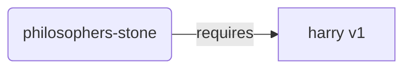
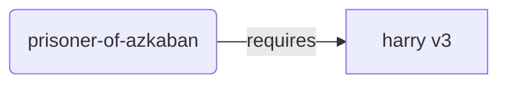
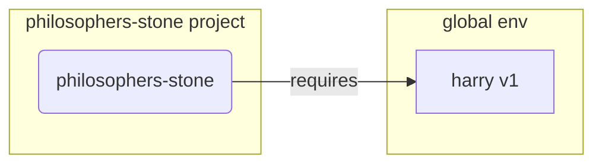
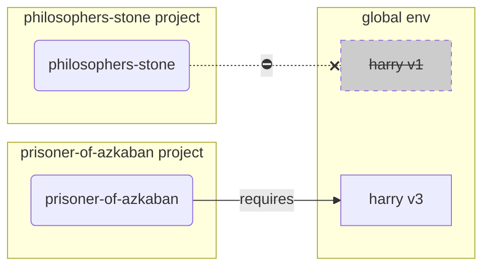
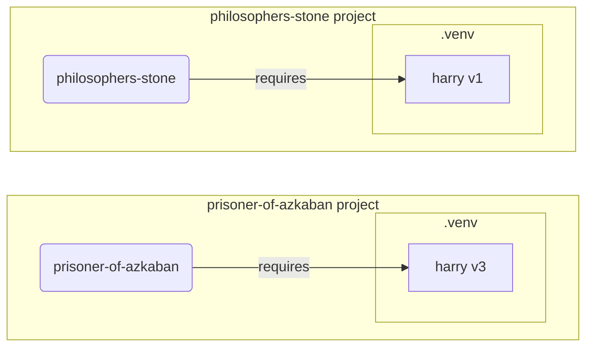

# محیط‌های مجازی { #virtual-environments }

هنگامی که روی پروژه‌های پایتون کار می‌کنید، احتمالاً باید از یه **محیط مجازی** (یا مکانیزمی مشابه) برای جداسازی پکیج‌هایی که برای هر پروژه نصب می‌کنید استفاده کنید.

/// info

اگر قبلاً در مورد محیط‌های مجازی، نحوه ایجاد و استفاده از اونها اطلاعات دارید، ممکنه بخواید این بخش رو رد کنید. 🤓

///

/// tip

**محیط مجازی** با **متغیر محیطی** تفاوت داره.

**متغیر محیطی** یک متغیر در سیستم است که میتونه توسط برنامه‌ها استفاده بشه.

**محیط مجازی** یک دایرکتوریه که شامل تعدادی فایله.

///

/// info

این صفحه به شما یاد میده که چجوری از **محیط‌های مجازی** استفاده کنید و چگونه کار میکنن.

اگر آماده اید که از **ابزاری که همه چیز را مدیریت میکنه** استفاده کنید (از جمله نصب پایتون)، <a href="https://github.com/astral-sh/uv" class="external-link" target="_blank">uv</a> رو امتحان کنید.

///

## ایجاد یک پروژه { #create-a-project }

ابتدا، یک دایرکتوری برای پروژه خودتون ایجاد کنید.

کاری که من معمولاً انجام میدم اینه که یک دایرکتوری به نام `code` در داخل دایرکتوری خانگی/کاربری خودم ایجاد می‌کنم.

و در داخل اون برای هر پروژه یک دایرکتوری جداگونه ایجاد می‌کنم.

<div class="termy">

```console
// به دایرکتوری خانگی برید
$ cd
// یک دایرکتوری برای تمام کدهای پروژه خودتون ایجاد کنید
$ mkdir code
// وارد اون دایرکتوری code بشید
$ cd code
// یک دایرکتوری برای این پروژه ایجاد کنید
$ mkdir awesome-project
// وارد اون دایرکتوری پروژه بشید
$ cd awesome-project
```

</div>

## ایجاد یک محیط مجازی { #create-a-virtual-environment }

هنگامی که **برای اولین بار** روی یک پروژه پایتون شروع به کار می‌کنید، یک محیط مجازی **<abbr title="گزینه‌های دیگه ایی هم وجود داره، این یک راهنمای ساده است">در داخل پروژه خود</abbr>** ایجاد کنید.

/// tip

فقط باید این کار را **یک بار برای هر پروژه** انجام بدید، نه هر بار که کار می‌کنید.

///

//// tab | `venv`

برای ایجاد یک محیط مجازی، میتونید از ماژول `venv` که همراه با پایتون ارائه میشه استفاده کنید.

<div class="termy">

```console
$ python -m venv .venv
```

</div>

/// details | این دستور چه معنایی داره

* `python`: از برنامه‌ای به نام `python` استفاده کن
* `-m`: یک ماژول رو به عنوان اسکریپت فراخوانی کن، در مرحله بعد به اون میگیم کدوم ماژول
* `venv`: از ماژولی به نام `venv` استفاده کن که معمولاً با پایتون نصب میشه
* `.venv`: محیط مجازی را در دایرکتوری جدید `.venv` ایجاد کن

///

////

//// tab | `uv`

اگر <a href="https://github.com/astral-sh/uv" class="external-link" target="_blank">`uv`</a> را نصب دارید، میتونید از اون برای ایجاد محیط مجازی استفاده کنید.

<div class="termy">

```console
$ uv venv
```

</div>

/// tip

به طور پیش‌فرض، `uv` یک محیط مجازی در دایرکتوری به نام `.venv` ایجاد میکنه.

اما میتونید با ارسال یک آرگومان اضافی با نام دایرکتوری، اون را سفارشی‌سازی کنید.

///

////

این دستور یک محیط مجازی جدید در دایرکتوری به نام `.venv` ایجاد میکنه.

/// details | `.venv` یا نام دیگه ایی

میتونید محیط مجازی را در دایرکتوری متفاوتی ایجاد کنید، اما یک قرارداد وجود داره که بهتره اون رو `.venv` نام گذاری کنید.

///

## فعال‌سازی محیط مجازی { #activate-the-virtual-environment }

محیط مجازی جدید را فعال کنید تا هر دستور پایتونی که اجرا می‌کنید یا پکیجی که نصب می‌کنید از اون استفاده کنه.

/// tip

این کار را **هر بار** که یک **ترمینال جدید** برای کار روی پروژه شروع می‌کنید، انجام بدید.

///

//// tab | Linux, macOS

<div class="termy">

```console
$ source .venv/bin/activate
```

</div>

////

//// tab | Windows PowerShell

<div class="termy">

```console
$ .venv\Scripts\Activate.ps1
```

</div>

////

//// tab | Windows Bash

یا اگه از Bash برای ویندوز استفاده می‌کنید (مثلاً <a href="https://gitforwindows.org/" class="external-link" target="_blank">Git Bash</a>):

<div class="termy">

```console
$ source .venv/Scripts/activate
```

</div>

////

/// tip

هر بار که یه **پکیج جدید** در اون محیط نصب می‌کنید، محیط را دوباره **فعال** کنید.

این کار اطمینان حاصل میکنه که اگر از یک **برنامه ترمینال (<abbr title="command line interface">CLI</abbr>)** که توسط اون پکیج نصب شده استفاده می‌کنید، از نسخه موجود در محیط مجازی خودتون استفاده کنه و نه از نسخه‌های دیگه ایی که ممکنه به صورت سراسری نصب شده باشن، احتمالا با نسخه متفاوتی از اونچه نیاز دارید.

///

## بررسی فعال بودن محیط مجازی { #check-the-virtual-environment-is-active }

بررسی کنید که محیط مجازی فعال است (دستور قبلی کار کرده است).

/// tip

این کار **اختیاریه**، اما راه خوبی برای **بررسی** اینه که همه چیز اونطور که انتظار دارید کار میکنه و از محیط مجازی مورد نظر خودتون استفاده میکنه.

///

//// tab | Linux, macOS, Windows Bash

<div class="termy">

```console
$ which python

/home/user/code/awesome-project/.venv/bin/python
```

</div>

اگر باینری `python` را در `.venv/bin/python`، در داخل پروژه شما (در این مورد `awesome-project`) نشان بده، پس کار کرده. 🎉

////

//// tab | Windows PowerShell

<div class="termy">

```console
$ Get-Command python

C:\Users\user\code\awesome-project\.venv\Scripts\python
```

</div>

اگر باینری `python` را در `.venv\Scripts\python`، در داخل پروژه شما (در این مورد `awesome-project`) نشان بده، پس کار کرده. 🎉

////

## ارتقای `pip` { #upgrade-pip }

/// tip

اگر از <a href="https://github.com/astral-sh/uv" class="external-link" target="_blank">`uv`</a> استفاده می‌کنید، از اون برای نصب چیزها به جای `pip` استفاده خواهید کرد، بنابراین نیازی به ارتقای `pip` ندارید. 😎

///

اگر از `pip` برای نصب پکیج‌ها استفاده می‌کنید (به طور پیش‌فرض با پایتون ارائه میشه)، باید اون را به آخرین نسخه **ارتقا** بدید.

بسیاری از خطاهای عجیب و غریب هنگام نصب یک پکیج، فقط با ارتقای `pip` در ابتدا حل میشن.

/// tip

معمولاً این کار را **یک بار**، درست بعد از ایجاد محیط مجازی انجام میدید.

///

مطمئن بشید که محیط مجازی فعاله (با دستور بالا) و سپس اجرا کنید:

<div class="termy">

```console
$ python -m pip install --upgrade pip

---> 100%
```

</div>

## اضافه کردن `.gitignore` { #add-gitignore }

اگر از **Git** استفاده می‌کنید (که باید استفاده کنید)، یک فایل `.gitignore` اضافه کنید تا همه چیز در `.venv` شما از Git مستثنی بشه.

/// tip

اگر از <a href="https://github.com/astral-sh/uv" class="external-link" target="_blank">`uv`</a> برای ایجاد محیط مجازی استفاده کردید، این کار را قبلاً برای شما انجام داده، میتونید این مرحله رو رد کنید. 😎

///

/// tip

این کار رو **یک بار**، درست بعد از ایجاد محیط مجازی انجام بدید.

///

<div class="termy">

```console
$ echo "*" > .venv/.gitignore
```

</div>

/// details | این دستور چه معنایی داره

* `echo "*"`: متن `*` را در ترمینال "چاپ" میکنه (قسمت بعدی اون رو کمی تغییر میده)
* `>`: هر چیزی که توسط دستور سمت چپ `>` در ترمینال چاپ میشه، نباید چاپ بشه بلکه باید در فایلی که در سمت راست `>` قرار داره نوشته بشه
* `.gitignore`: نام فایلی که متن باید در اون نوشته بشه

و `*` برای Git به معنای "همه چیز" است. بنابراین، همه چیز را در دایرکتوری `.venv` نادیده میگیره.

این دستور یک فایل `.gitignore` با محتوای زیر ایجاد میکنه:

```gitignore
*
```

///

## نصب پکیج‌ها { #install-packages }

پس از فعال‌سازی محیط، میتونید پکیج‌ها را در اون نصب کنید.

/// tip

این کار را **یک بار** هنگام نصب یا ارتقای پکیج‌هایی که پروژه شما نیاز داره انجام بدید.

اگر نیاز به ارتقای نسخه یا اضافه کردن یک پکیج جدید دارید، این کار را **دوباره** انجام میدید.

///

### نصب مستقیم پکیج‌ها { #install-packages-directly }

اگر عجله دارید و نمیخواید از یک فایل برای اعلام الزامات پکیج پروژه خودتون استفاده کنید، میتونید اونها را مستقیماً نصب کنید.

/// tip

ایده خوب (بسیار خوبیه) که پکیج‌ها و نسخه‌هایی که برنامه شما نیاز داره را در یک فایل قرار بدید (به عنوان مثال `requirements.txt` یا `pyproject.toml`).

///

//// tab | `pip`

<div class="termy">

```console
$ pip install "fastapi[standard]"

---> 100%
```

</div>

////

//// tab | `uv`

اگر <a href="https://github.com/astral-sh/uv" class="external-link" target="_blank">`uv`</a> دارید:

<div class="termy">

```console
$ uv pip install "fastapi[standard]"
---> 100%
```

</div>

////

### نصب از `requirements.txt` { #install-from-requirements-txt }

اگر یک `requirements.txt` دارید، اکنون میتونید از اون برای نصب پکیج‌های خودتون استفاده کنید.

//// tab | `pip`

<div class="termy">

```console
$ pip install -r requirements.txt
---> 100%
```

</div>

////

//// tab | `uv`

اگر <a href="https://github.com/astral-sh/uv" class="external-link" target="_blank">`uv`</a> دارید:

<div class="termy">

```console
$ uv pip install -r requirements.txt
---> 100%
```

</div>

////

/// details | `requirements.txt`

یک `requirements.txt` با چند پکیج میتونه اینجوری باشه:

```requirements.txt
fastapi[standard]==0.113.0
pydantic==2.8.0
```

///

## اجرای برنامه شما { #run-your-program }

بعد از اینکه محیط مجازی را فعال کردید، میتونید برنامه خودتون رو اجرا کنید، و از پایتون داخل محیط مجازیتون با پکیج‌هایی که در اونجا نصب کردید استفاده کنید.

<div class="termy">

```console
$ python main.py

Hello World
```

</div>

## پیکربندی ویرایشگر خود { #configure-your-editor }

احتمالاً از یک ویرایشگر استفاده می‌کنید، مطمئن بشید که اون را طوری پیکربندی کردید که از همون محیط مجازی که ایجاد کردید استفاده میکنه (احتمالاً به طور خودکار اون را تشخیص میده) تا بتونید تکمیل خودکار و خطاهای درون خطی را دریافت کنید.

به عنوان مثال:

* <a href="https://code.visualstudio.com/docs/python/environments#_select-and-activate-an-environment" class="external-link" target="_blank">VS Code</a>
* <a href="https://www.jetbrains.com/help/pycharm/creating-virtual-environment.html" class="external-link" target="_blank">PyCharm</a>

/// tip

معمولاً فقط باید این کار را **یک بار** انجام بدید، زمانی که محیط مجازی را ایجاد می‌کنید.

///

## غیرفعال کردن محیط مجازی { #deactivate-the-virtual-environment }

پس از اتمام کار روی پروژتون، میتونید محیط مجازی را **غیرفعال** کنید.

<div class="termy">

```console
$ deactivate
```

</div>

به این ترتیب، هنگامی که `python` را اجرا می‌کنید، سعی نمیکنه اون رو از اون محیط مجازی با پکیج‌های نصب شده در اون اجرا کنه.

## آماده برای کار { #ready-to-work }

اکنون آماده اید تا روی پروژتون شروع به کار کنید.


/// tip

آیا میخواید بفهمید همه اینها چه هستن؟

به خواندن ادامه بدید. 👇🤓

///

## چرا محیط‌های مجازی { #why-virtual-environments }

برای کار با FastAPI باید <a href="https://www.python.org/" class="external-link" target="_blank">Python</a> را نصب کنید.

پس از اون، باید FastAPI و هر **پکیج** دیگه ایی که میخواید استفاده کنید را **نصب** کنید.

برای نصب پکیج‌ها معمولاً از دستور `pip` که با پایتون ارائه میشه استفاده می‌کنید (یا جایگزین‌های مشابه).

با این حال، اگر فقط از `pip` به طور مستقیم استفاده کنید، پکیج‌ها در **محیط سراسری پایتون** شما (نصب سراسری پایتون) نصب میشن.

### مشکل { #the-problem }

پس، مشکل نصب پکیج‌ها در محیط سراسری پایتون چیه؟

در نقطه‌ای، احتمالاً در نهایت، برنامه‌های مختلف زیادی مینویسید که به **پکیج‌های مختلف** وابسته هستن. و یعضی از این پروژه‌هایی که روی اونها کار می‌کنید به **نسخه‌های مختلفه** یک پکیجه یکسان وابسته خواهد بود. 😱

به عنوان مثال، میتونید یک پروژه به نام `philosophers-stone` ایجاد کنید، این برنامه به پکیج دیگه ایی به نام **`harry`، با استفاده از نسخه `1`** وابسته است. بنابراین، باید `harry` را نصب کنید.



سپس، در مقطعی بعدتر، پروژه دیگری به نام `prisoner-of-azkaban` ایجاد می‌کنید، و این پروژه نیز به `harry` وابسته است، اما این پروژه به **`harry` نسخه `3`** نیاز داره.



اما حالا مشکل اینجاست، اگر پکیج‌ها را به صورت سراسری (در محیط سراسری) به جای یک **محیط مجازی** محلی نصب کنید، باید انتخاب کنید که کدوم نسخه از `harry` را نصب کنید.

اگر میخواید `philosophers-stone` را اجرا کنید، ابتدا باید `harry` نسخه `1` را نصب کنید، به عنوان مثال با این:

<div class="termy">

```console
$ pip install "harry==1"
```

</div>

و در نهایت، نسخه `1` از `harry` در محیط پایتون سراسری شما نصب خواهد شد.



اما سپس اگر میخواید `prisoner-of-azkaban` را اجرا کنید، باید `harry` نسخه `1` را حذف نصب کنید و `harry` نسخه `3` را نصب کنید (یا فقط نصب نسخه `3` که به طور خودکار نسخه `1` را حذف نصب میکنه).

<div class="termy">

```console
$ pip install "harry==3"
```

</div>

و در نهایت، نسخه `3` از `harry` در محیط پایتون سراسری شما نصب خواهد شد.

و اگر سعی کنید `philosophers-stone` را دوباره اجرا کنید، احتمال داره که **کار نکنه** چون به `harry` نسخه `1` نیاز داره.



/// tip

در پکیج‌های پایتون بسیار رایجه که سعی بشه بهترین کار برای **جلوگیری از تغییرات ناسازگار** در **نسخه‌های جدید** انجام بشه، اما بهتره ایمن باشه، و نسخه‌های جدیدتر را عمداً و زمانی که میتونید تست‌ها را اجرا کنید تا مطمئن بشید همه چیز به درستی کار میکنه، نصب کنید.

///

حالا، این رو با **بسیاری** از **پکیج‌های دیگه** که همه **پروژه‌های شما به اونها وابسته هستند** تصور کنید. مدیریت اون بسیار دشواره. و احتمالاً در نهایت برخی از پروژه‌ها را با برخی **نسخه‌های ناسازگار** از پکیج‌ها اجرا خواهید کرد، و نمیدونید چرا چیزی کار نمیکنه.

همچنین، بسته به سیستم عامل شما (مثلاً Linux، Windows، macOS)، ممکنه با پایتون از قبل نصب شده باشه. و در اون صورت احتمالاً برخی از پکیج‌ها با نسخه‌های خاصی که **مورد نیاز سیستمونه** از قبل نصب شده. اگر پکیج‌ها را در محیط سراسری پایتون نصب کنید، میتونید در نهایت برخی از برنامه‌هایی که با سیستم عامل شما ارائه شده‌اند را **خراب** کنید.

## پکیج‌ها کجا نصب میشن { #where-are-packages-installed }

وقتی که پایتون را نصب می‌کنید، چند دایرکتوری با چند فایل در کامپیوتر شما ایجاد میشه.

برخی از این دایرکتوری‌ها مسئول داشتن تمام پکیج‌هایی هستن که نصب می‌کنید.

وقتی اجرا می‌کنید:

<div class="termy">

```console
// الان این را اجرا نکنید، فقط یه مثاله 🤓
$ pip install "fastapi[standard]"
---> 100%
```

</div>

این کار یک فایل فشرده با کد FastAPI را دانلود میکنه، معمولاً از <a href="https://pypi.org/project/fastapi/" class="external-link" target="_blank">PyPI</a>.

همچنین فایل‌هایی را برای پکیج‌های دیگری که FastAPI به اونها وابسته است **دانلود** میکنه.

سپس همه اون فایل‌ها رو **استخراج** میکنه و در یک دایرکتوری در کامپیوتر شما قرار میده.

به طور پیش‌فرض، اون فایل‌های دانلود شده و استخراج شده را در دایرکتوری که با نصب پایتون شما ارائه میشه قرار میده، که **محیط سراسریه**.

## محیط‌های مجازی چی هستن { #what-are-virtual-environments }

راه حل مشکلات داشتن تمام پکیج‌ها در محیط سراسری اینه که از یک **محیط مجازی برای هر پروژه‌ای** که روی اون کار می‌کنید استفاده کنید.

یک محیط مجازی یک **دایرکتوریه**، بسیار شبیه به محیط سراسری، جایی که میتونید پکیج‌ها را برای یک پروژه نصب کنید.

به این ترتیب، هر پروژه محیط مجازی خاص خودش (دایرکتوری `.venv`) رو با پکیج‌های خاص خودش خواهد داشت.



## فعال کردن یک محیط مجازی به چه معناست { #what-does-activating-a-virtual-environment-mean }

هنگامی که یک محیط مجازی را فعال می‌کنید، به عنوان مثال با:

//// tab | Linux, macOS

<div class="termy">

```console
$ source .venv/bin/activate
```

</div>

////

//// tab | Windows PowerShell

<div class="termy">

```console
$ .venv\Scripts\Activate.ps1
```

</div>

////

//// tab | Windows Bash

یا اگر از Bash برای ویندوز استفاده می‌کنید (مثلاً <a href="https://gitforwindows.org/" class="external-link" target="_blank">Git Bash</a>):

<div class="termy">

```console
$ source .venv/Scripts/activate
```

</div>

////

این دستور برخی [متغیرهای محیطی](environment-variables.md){.internal-link target=_blank} را ایجاد یا اصلاح میکنه که برای دستورات بعدی در دسترس خواهد بود.

یکی از این متغیرها، متغیر `PATH` است.

/// tip

میتونید در مورد متغیر محیطی `PATH` در بخش [متغیرهای محیطی](environment-variables.md#path-environment-variable){.internal-link target=_blank} بیشتر یاد بگیرید.

///

فعال کردن یک محیط مجازی، مسیر اون `.venv/bin` (در Linux و macOS) یا `.venv\Scripts` (در Windows) را به متغیر محیطی `PATH` اضافه میکنه.

فرض کنیم قبل از فعال کردن محیط، متغیر `PATH` اینجوری بود:

//// tab | Linux, macOS

```plaintext
/usr/bin:/bin:/usr/sbin:/sbin
```

این به این معناست که سیستم برنامه‌ها را در موارد زیر جستجو میکنه:

* `/usr/bin`
* `/bin`
* `/usr/sbin`
* `/sbin`

////

//// tab | Windows

```plaintext
C:\Windows\System32
```

این به این معناست که سیستم برنامه‌ها را در موارد زیر جستجو میکنه:

* `C:\Windows\System32`

////

پس از فعال کردن محیط مجازی، متغیر `PATH` چیزی شبیه به این خواهد بود:

//// tab | Linux, macOS

```plaintext
/home/user/code/awesome-project/.venv/bin:/usr/bin:/bin:/usr/sbin:/sbin
```

این به این معناست که سیستم اکنون ابتدا در موارد زیر به دنبال برنامه‌ها خواهد گشت:

```plaintext
/home/user/code/awesome-project/.venv/bin
```

قبل از اینکه به دایرکتوری‌های دیگر نگاه گنه.

بنابراین، وقتی `python` را در ترمینال تایپ می‌کنید، سیستم برنامه پایتون را در

```plaintext
/home/user/code/awesome-project/.venv/bin/python
```

پیدا کرده و از اون استفاده میکنه.

////

//// tab | Windows

```plaintext
C:\Users\user\code\awesome-project\.venv\Scripts;C:\Windows\System32
```

این به این معناست که سیستم اکنون ابتدا در موارد زیر به دنبال برنامه‌ها خواهد گشت:

```plaintext
C:\Users\user\code\awesome-project\.venv\Scripts
```

قبل از اینکه به دایرکتوری‌های دیگه ایی نگاه کنه.

بنابراین، وقتی `python` را در ترمینال تایپ می‌کنید، سیستم برنامه پایتون را در

```plaintext
C:\Users\user\code\awesome-project\.venv\Scripts\python
```

پیدا کرده و از اون استفاده میکنه.

////

یه نکته مهم اینه که مسیر محیط مجازی را در **ابتدای** متغیر `PATH` قرار میده. سیستم اون رو **قبل** از پیدا کردن هر پایتون دیگری پیدا خواهد کرد. به این ترتیب، هنگامی که `python` را اجرا می‌کنید، از پایتون **از محیط مجازی** به جای هر `python` دیگری (به عنوان مثال، یک `python` از محیط سراسری) استفاده خواهد کرد.

فعال کردن یک محیط مجازی چند چیز دیگه رو هم تغییر میده، اما این یکی از مهم‌ترین کارهایی که انجام میده.

## بررسی یک محیط مجازی { #checking-a-virtual-environment }

هنگامی که بررسی می‌کنید، آیا یک محیط مجازی فعاله یا نه، به عنوان مثال با:

//// tab | Linux, macOS, Windows Bash

<div class="termy">

```console
$ which python

/home/user/code/awesome-project/.venv/bin/python
```

</div>

////

//// tab | Windows PowerShell

<div class="termy">

```console
$ Get-Command python

C:\Users\user\code\awesome-project\.venv\Scripts\python
```

</div>

////

این به این معناست که برنامه `python` که استفاده خواهد شد، همون برنامه ایی که **در محیط مجازی** قرار داره.

شما از `which` در Linux و macOS و `Get-Command` در Windows PowerShell استفاده می‌کنید.

روشی که این دستور کار میکنه اینه که به متغیر محیطی `PATH` میره و اون را بررسی میکنه، **هر مسیر را به ترتیب** بررسی کرده و به دنبال برنامه‌ای به نام `python` میگرده. هنگامی که اون را پیدا کنه، **مسیر اون برنامه رو نشان میده**.

مهم‌ترین قسمت اینه که هنگامی که `python` را فراخوانی می‌کنید، این دقیقاً همون "`python`" که اجرا خواهد شد.

بنابراین، میتونید تأیید کنید که در محیط مجازی درستی هستید.

/// tip

فعال کردن یک محیط مجازی، دریافت یک پایتون، و سپس **رفتن به پروژه دیگر** آسونه.

و پروژه دوم **کار نمیکنه** چون از **پایتون نادرستی** استفاده می‌کنید، از محیط مجازی یه پروژه دیگه.

مفیده که بتونید بررسی کنید کدام `python` در حال استفاده است. 🤓

///

## چرا یک محیط مجازی را غیرفعال کنیم { #why-deactivate-a-virtual-environment }

به عنوان مثال، ممکنه روی یک پروژه `philosophers-stone` کار کنید، **اون محیط مجازی را فعال کنید**، پکیج‌ها را نصب کرده و با اون محیط کار کنید.

و سپس میخواید روی **پروژه دیگه ایی** `prisoner-of-azkaban` کار کنید.

به اون پروژه میرید:

<div class="termy">

```console
$ cd ~/code/prisoner-of-azkaban
```

</div>

اگر محیط مجازی برای `philosophers-stone` را غیرفعال نکنید، وقتی `python` را در ترمینال اجرا می‌کنید، سعی میکنه از پایتون `philosophers-stone` استفاده کنه.

<div class="termy">

```console
$ cd ~/code/prisoner-of-azkaban

$ python main.py

// خطا در import کردن sirius، نصب نشده 😱
Traceback (most recent call last):
    File "main.py", line 1, in <module>
        import sirius
```

</div>

اما اگه محیط مجازی را غیرفعال کنید و محیط جدید را برای `prisoner-of-askaban` فعال کنید، سپس وقتی `python` را اجرا می‌کنید از پایتون محیط مجازی در `prisoner-of-azkaban` استفاده خواهد کرد.

<div class="termy">

```console
$ cd ~/code/prisoner-of-azkaban

// لازم نیست در دایرکتوری قدیمی باشید تا غیرفعالش کنید، میتونید هر جا که هستید این کار رو انجام بدید، حتی بعد از رفتن به پروژه دیگه ایی 😎
$ deactivate

// محیط مجازی در prisoner-of-azkaban/.venv رو فعال کنید 🚀
$ source .venv/bin/activate

// حالا وقتی python را اجرا می‌کنید، پکیج sirius نصب شده در این محیط مجازی را پیدا خواهد کرد ✨
$ python main.py

I solemnly swear 🐺
```

</div>

## جایگزین‌ها { #alternatives }

این یک راهنمای ساده برای شروع کار و آموزش نحوه عملکرد همه چیز  **در زیرساخت** است.

**جایگزین‌های** زیادی برای مدیریت محیط‌های مجازی، وابستگی‌های پکیج (الزامات)، پروژه‌ها وجود داره.

هنگامی که آماده هستید و میخواید از ابزاری برای **مدیریت کل پروژه**، وابستگی‌های پکیج، محیط‌های مجازی و غیره استفاده کنید، پیشنهاد می‌کنم <a href="https://github.com/astral-sh/uv" class="external-link" target="_blank">uv</a> رو امتحان کنید.

`uv` میتونه کارهای زیادی انجام بده، میتونه:

* **پایتون را برای شما نصب کنه**، از جمله نسخه‌های مختلف
* **محیط مجازی** را برای پروژه‌های شما مدیریت کنه
* **پکیج‌ها** را نصب کنه
* **وابستگی‌ها و نسخه‌های** پکیج را برای پروژه شما مدیریت کنه
* مطمئن بشید که یک مجموعه **دقیق** از پکیج‌ها و نسخه‌ها برای نصب دارید، از جمله وابستگی‌های اونها، به طوری که میتونید مطمئن باشید که میتونید پروژه خودتون رو در محیط تولید، دقیقاً مثل کامپیوتر خودتون هنگام توسعه اجرا کنید، به این کار **قفل کردن** میگن.
* و موارد زیاد دیگه ایی

## نتیجه‌گیری { #conclusion }

اگر همه اینها را خوندید و فهمیدید، اکنون **چیزهای بیشتری** نسبت به بسیاری از توسعه‌دهندگان در مورد محیط های مجازی میدونید. 🤓

دونستن این جزئیات به احتمال زیاد در زمان آینده که در حال اشکال‌زدایی چیزی هستید که پیچیده به نظر میرسه مفید خواهد بود، اما **نحوه عملکرد همه چیز را در زیرساخت** را خواهید دانست. 😎
