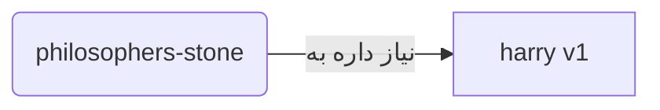
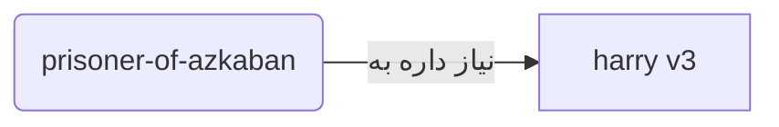
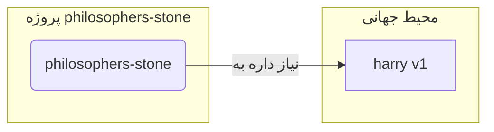
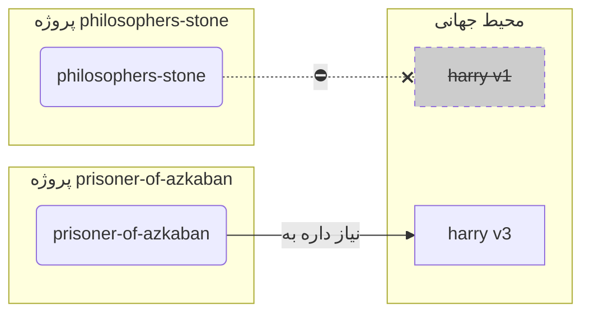
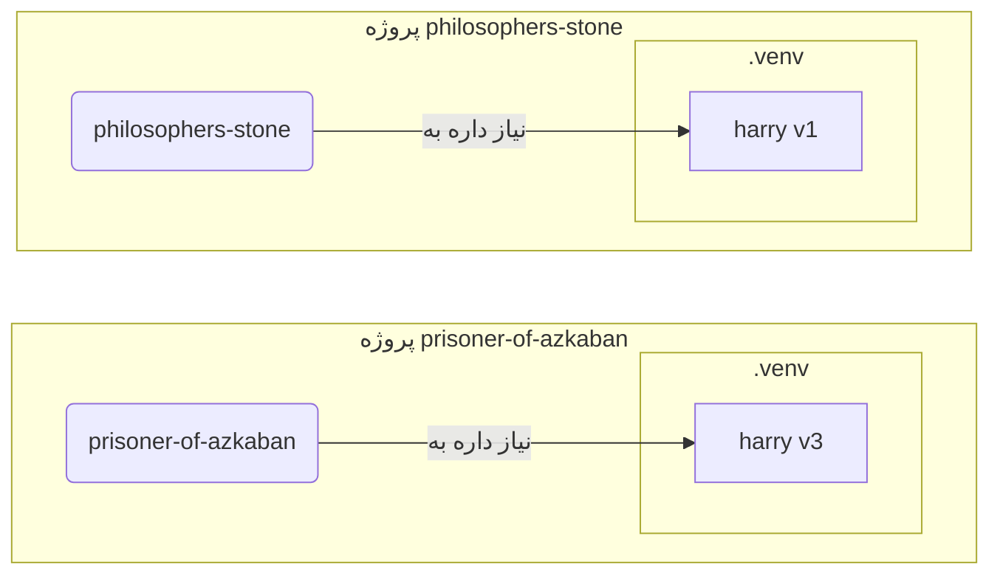

# محیط‌های مجازی

وقتی توی پروژه‌های پایتون کار می‌کنی، احتمالاً باید از یه **محیط مجازی** (یا یه مکانیزم مشابه) استفاده کنی تا پکیج‌هایی که برای هر پروژه نصب می‌کنی رو جدا نگه داری.

/// info

اگه از قبل در مورد محیط‌های مجازی می‌دونی، چطور بسازیشون و استفاده‌شون کنی، شاید بخوای این بخش رو رد کنی. 🤓

///

/// tip

یه **محیط مجازی** با **متغیر محیطی** فرق داره.

یه **متغیر محیطی** یه متغیره توی سیستمه که برنامه‌ها می‌تونن ازش استفاده کنن.

یه **محیط مجازی** یه دایرکتوریه که یه سری فایل توشه.

///

/// info

این صفحه بهت یاد می‌ده چطور از **محیط‌های مجازی** استفاده کنی و چطور کار می‌کنن.

اگه آماده‌ای یه **ابزار که همه‌چیز رو برات مدیریت کنه** رو امتحان کنی (از جمله نصب پایتون)، <a href="https://github.com/astral-sh/uv" class="external-link" target="_blank">uv</a> رو تست کن.

///

## ساختن یه پروژه

اول، یه دایرکتوری برای پروژه‌ات بساز.

کاری که من معمولاً می‌کنم اینه که یه دایرکتوری به اسم `code` توی دایرکتوری اصلی/کاربری‌م می‌سازم.

و توی اون، برای هر پروژه یه دایرکتوری جدا می‌سازم.

<div class="termy">

```console
// برو به دایرکتوری اصلی
$ cd
// یه دایرکتوری برای همه پروژه‌های کدت بساز
$ mkdir code
// برو توی اون دایرکتوری کد
$ cd code
// یه دایرکتوری برای این پروژه بساز
$ mkdir awesome-project
// برو توی دایرکتوری پروژه
$ cd awesome-project
```

</div>

## ساختن یه محیط مجازی

وقتی برای **اولین بار** شروع به کار روی یه پروژه پایتون می‌کنی، یه محیط مجازی **<abbr title="گزینه‌های دیگه هم هست، این یه راهنمای ساده‌ست">توی پروژه‌ات</abbr>** بساز.

/// tip

فقط **یه بار برای هر پروژه** این کار رو می‌کنی، نه هر بار که کار می‌کنی.

///

//// tab | `venv`

برای ساختن یه محیط مجازی، می‌تونی از ماژول `venv` که با پایتون میاد استفاده کنی.

<div class="termy">

```console
$ python -m venv .venv
```

</div>

/// details | این دستور چی معنی می‌ده

* `python`: از برنامه‌ای به اسم `python` استفاده کن
* `-m`: یه ماژول رو به‌عنوان اسکریپت صدا کن، بعدش می‌گیم کدوم ماژول
* `venv`: از ماژولی به اسم `venv` که معمولاً با پایتون نصب شده استفاده کن
* `.venv`: محیط مجازی رو توی دایرکتوری جدید `.venv` بساز

///

////

//// tab | `uv`

اگه <a href="https://github.com/astral-sh/uv" class="external-link" target="_blank">`uv`</a> رو نصب کردی، می‌تونی ازش برای ساختن یه محیط مجازی استفاده کنی.

<div class="termy">

```console
$ uv venv
```

</div>

/// tip

به‌صورت پیش‌فرض، `uv` یه محیط مجازی توی دایرکتوری به اسم `.venv` می‌سازه.

ولی می‌تونی با دادن یه آرگومان اضافی اسم دایرکتوری رو سفارشی کنی.

///

////

این دستور یه محیط مجازی جدید توی دایرکتوری به اسم `.venv` می‌سازه.

/// details | `.venv` یا اسم دیگه

می‌تونی محیط مجازی رو توی یه دایرکتوری دیگه بسازی، ولی رسمه که بهش `.venv` بگن.

///

## فعال کردن محیط مجازی

محیط مجازی جدید رو فعال کن تا هر دستور پایتونی که اجرا می‌کنی یا پکیجی که نصب می‌کنی ازش استفاده کنه.

/// tip

هر بار که یه **جلسه ترمینال جدید** برای کار روی پروژه شروع می‌کنی این کار رو بکن.

///

//// tab | لینوکس، مک‌او‌اس

<div class="termy">

```console
$ source .venv/bin/activate
```

</div>

////

//// tab | ویندوز PowerShell

<div class="termy">

```console
$ .venv\Scripts\Activate.ps1
```

</div>

////

//// tab | ویندوز Bash

یا اگه از Bash برای ویندوز استفاده می‌کنی (مثلاً <a href="https://gitforwindows.org/" class="external-link" target="_blank">Git Bash</a>):

<div class="termy">

```console
$ source .venv/Scripts/activate
```

</div>

////

/// tip

هر بار که یه **پکیج جدید** توی اون محیط نصب می‌کنی، دوباره محیط رو **فعال** کن.

این مطمئن می‌کنه که اگه از یه **برنامه ترمینال (<abbr title="رابط خط فرمان">CLI</abbr>)** که توسط اون پکیج نصب شده استفاده کنی، از نسخه توی محیط مجازی‌ات استفاده می‌کنی نه یه نسخه دیگه که ممکنه به‌صورت جهانی نصب شده باشه و احتمالاً نسخه‌ش با چیزی که نیاز داری فرق داشته باشه.

///

## چک کردن فعال بودن محیط مجازی

چک کن که محیط مجازی فعاله (دستور قبلی کار کرده).

/// tip

این **اختیاریه**، ولی یه راه خوب برای **چک کردن** اینه که همه‌چیز درست کار می‌کنه و تو داری از محیط مجازی‌ای که می‌خواستی استفاده می‌کنی.

///

//// tab | لینوکس، مک‌او‌اس، ویندوز Bash

<div class="termy">

```console
$ which python

/home/user/code/awesome-project/.venv/bin/python
```

</div>

اگه باینری `python` رو توی `.venv/bin/python`، توی پروژه‌ات (توی این مورد `awesome-project`) نشون بده، یعنی کار کرده. 🎉

////

//// tab | ویندوز PowerShell

<div class="termy">

```console
$ Get-Command python

C:\Users\user\code\awesome-project\.venv\Scripts\python
```

</div>

اگه باینری `python` رو توی `.venv\Scripts\python`، توی پروژه‌ات (توی این مورد `awesome-project`) نشون بده، یعنی کار کرده. 🎉

////

## به‌روزرسانی `pip`

/// tip

اگه از <a href="https://github.com/astral-sh/uv" class="external-link" target="_blank">`uv`</a> استفاده می‌کنی، به‌جای `pip` ازش برای نصب چیزا استفاده می‌کنی، پس لازم نیست `pip` رو به‌روز کنی. 😎

///

اگه از `pip` برای نصب پکیج‌ها استفاده می‌کنی (که به‌صورت پیش‌فرض با پایتون میاد)، باید **به‌روز**ش کنی به آخرین نسخه.

خیلی از خطاهای عجیب موقع نصب یه پکیج فقط با به‌روزرسانی `pip` حل می‌شن.

/// tip

معمولاً این کار رو **یه بار**، درست بعد از ساختن محیط مجازی، انجام می‌دی.

///

مطمئن شو محیط مجازی فعاله (با دستور بالا) و بعد اجرا کن:

<div class="termy">

```console
$ python -m pip install --upgrade pip

---> 100%
```

</div>

## اضافه کردن `.gitignore`

اگه از **Git** استفاده می‌کنی (که باید)، یه فایل `.gitignore` اضافه کن تا همه‌چیز توی `.venv` رو از Git مستثنی کنی.

/// tip

اگه از <a href="https://github.com/astral-sh/uv" class="external-link" target="_blank">`uv`</a> برای ساختن محیط مجازی استفاده کردی، اون این کار رو برات کرده، می‌تونی این مرحله رو رد کنی. 😎

///

/// tip

این کار رو **یه بار**، درست بعد از ساختن محیط مجازی، انجام بده.

///

<div class="termy">

```console
$ echo "*" > .venv/.gitignore
```

</div>

/// details | این دستور چی معنی می‌ده

* `echo "*"`: متن `*` رو توی ترمینال "چاپ" می‌کنه (بخش بعدی اینو یه کم تغییر می‌ده)
* `>`: هر چیزی که دستور سمت چپ `>` توی ترمینال چاپ کنه، به‌جای چاپ شدن باید توی فایلی که سمت راست `>` هست نوشته بشه
* `.gitignore`: اسم فایلی که متن باید توش نوشته بشه

و `*` برای Git یعنی "همه‌چیز". پس همه‌چیز توی دایرکتوری `.venv` رو نادیده می‌گیره.

این دستور یه فایل `.gitignore` با این محتوا می‌سازه:

```gitignore
*
```

///

## نصب پکیج‌ها

بعد از فعال کردن محیط، می‌تونی پکیج‌ها رو توش نصب کنی.

/// tip

این کار رو **یه بار** وقتی پکیج‌های مورد نیاز پروژه‌ات رو نصب یا به‌روز می‌کنی انجام بده.

اگه بخوای نسخه‌ای رو به‌روز کنی یا یه پکیج جدید اضافه کنی، **دوباره این کار رو می‌کنی**.

///

### نصب مستقیم پکیج‌ها

اگه عجله داری و نمی‌خوای از یه فایل برای تعریف نیازهای پکیج پروژه‌ات استفاده کنی، می‌تونی مستقیم نصبشون کنی.

/// tip

یه ایده (خیلی) خوبه که پکیج‌ها و نسخه‌هایی که برنامه‌ات نیاز داره رو توی یه فایل (مثلاً `requirements.txt` یا `pyproject.toml`) بذاری.

///

//// tab | `pip`

<div class="termy">

```console
$ pip install "fastapi[standard]"

---> 100%
```

</div>

////

//// tab | `uv`

اگه <a href="https://github.com/astral-sh/uv" class="external-link" target="_blank">`uv`</a> داری:

<div class="termy">

```console
$ uv pip install "fastapi[standard]"
---> 100%
```

</div>

////

### نصب از `requirements.txt`

اگه یه `requirements.txt` داری، حالا می‌تونی ازش برای نصب پکیج‌هاش استفاده کنی.

//// tab | `pip`

<div class="termy">

```console
$ pip install -r requirements.txt
---> 100%
```

</div>

////

//// tab | `uv`

اگه <a href="https://github.com/astral-sh/uv" class="external-link" target="_blank">`uv`</a> داری:

<div class="termy">

```console
$ uv pip install -r requirements.txt
---> 100%
```

</div>

////

/// details | `requirements.txt`

یه `requirements.txt` با چند تا پکیج می‌تونه این شکلی باشه:

```requirements.txt
fastapi[standard]==0.113.0
pydantic==2.8.0
```

///

## اجرای برنامه‌ات

بعد از اینکه محیط مجازی رو فعال کردی، می‌تونی برنامه‌ات رو اجرا کنی، و اون از پایتون توی محیط مجازی‌ات با پکیج‌هایی که اونجا نصب کردی استفاده می‌کنه.

<div class="termy">

```console
$ python main.py

سلام جهان
```

</div>

## تنظیم ویرایشگرت

احتمالاً از یه ویرایشگر استفاده می‌کنی، مطمئن شو که اونو طوری تنظیم کنی که از همون محیط مجازی‌ای که ساختی استفاده کنه (شاید خودش خودکار تشخیص بده) تا بتونی تکمیل خودکار و خطاهای درون‌خطی بگیری.

مثلاً:

* <a href="https://code.visualstudio.com/docs/python/environments#_select-and-activate-an-environment" class="external-link" target="_blank">VS Code</a>
* <a href="https://www.jetbrains.com/help/pycharm/creating-virtual-environment.html" class="external-link" target="_blank">PyCharm</a>

/// tip

معمولاً فقط **یه بار**، وقتی محیط مجازی رو می‌سازی، باید این کار رو بکنی.

///

## غیرفعال کردن محیط مجازی

وقتی کار روی پروژه‌ات تموم شد، می‌تونی محیط مجازی رو **غیرفعال** کنی.

<div class="termy">

```console
$ deactivate
```

</div>

اینجوری، وقتی `python` رو اجرا می‌کنی، سعی نمی‌کنه از اون محیط مجازی با پکیج‌هایی که اونجا نصب شدن استفاده کنه.

## آماده برای کار

حالا آماده‌ای که روی پروژه‌ات کار شروع کنی.

/// tip

می‌خوای بفهمی همه اون بالا چی بود؟

ادامه بده بخونی. 👇🤓

///

## چرا محیط‌های مجازی

برای کار با FastAPI باید <a href="https://www.python.org/" class="external-link" target="_blank">پایتون</a> رو نصب کنی.

بعد از اون، باید FastAPI و هر **پکیج** دیگه‌ای که می‌خوای استفاده کنی رو **نصب** کنی.

برای نصب پکیج‌ها معمولاً از دستور `pip` که با پایتون میاد (یا گزینه‌های مشابه) استفاده می‌کنی.

با این حال، اگه مستقیم از `pip` استفاده کنی، پکیج‌ها توی **محیط جهانی پایتون** (نصب جهانی پایتون) نصب می‌شن.

### مشکل

خب، مشکل نصب پکیج‌ها توی محیط جهانی پایتون چیه؟

یه جایی احتمالاً آخر خط می‌رسی به نوشتن کلی برنامه مختلف که به **پکیج‌های مختلف** وابستن. و بعضیا از این پروژه‌هایی که روشون کار می‌کنی به **نسخه‌های مختلف** یه پکیج وابسته‌ان. 😱

مثلاً، می‌تونی یه پروژه به اسم `philosophers-stone` بسازی، این برنامه به یه پکیج دیگه به اسم **`harry`، نسخه `1`** وابسته‌ست. پس باید `harry` رو نصب کنی.



بعد، یه مدت بعد، یه پروژه دیگه به اسم `prisoner-of-azkaban` می‌سازی، و این پروژه هم به `harry` وابسته‌ست، ولی این پروژه به **`harry` نسخه `3`** نیاز داره.



حالا مشکل اینجاست که اگه پکیج‌ها رو به‌صورت جهانی (توی محیط جهانی) نصب کنی به‌جای یه **محیط مجازی محلی**، باید انتخاب کنی کدوم نسخه از `harry` رو نصب کنی.

اگه بخوای `philosophers-stone` رو اجرا کنی، باید اول `harry` نسخه `1` رو نصب کنی، مثلاً با:

<div class="termy">

```console
$ pip install "harry==1"
```

</div>

و بعدش توی محیط جهانی پایتون‌ات `harry` نسخه `1` نصب شده.



ولی بعد اگه بخوای `prisoner-of-azkaban` رو اجرا کنی، باید `harry` نسخه `1` رو حذف کنی و `harry` نسخه `3` رو نصب کنی (یا فقط نصب نسخه `3` به‌صورت خودکار نسخه `1` رو حذف می‌کنه).

<div class="termy">

```console
$ pip install "harry==3"
```

</div>

و بعدش توی محیط جهانی پایتون‌ات `harry` نسخه `3` نصب شده.

اگه دوباره سعی کنی `philosophers-stone` رو اجرا کنی، ممکنه **کار نکنه** چون به `harry` نسخه `1` نیاز داره.



/// tip

توی پکیج‌های پایتون خیلی رایجه که سعی کنن **تغییرات خراب‌کننده** توی **نسخه‌های جدید** نداشته باشن، ولی بهتره احتیاط کنی و نسخه‌های جدید رو عمداً نصب کنی و وقتی می‌تونی تست‌ها رو اجرا کنی تا مطمئن شی همه‌چیز درست کار می‌کنه.

///

حالا تصور کن اینو با **خیلی** **پکیج‌های دیگه** که همه **پروژه‌هات بهشون وابستن**. مدیریتش خیلی سخت می‌شه. و احتمالاً آخرش یه سری پروژه رو با یه سری **نسخه‌های ناسازگار** پکیج‌ها اجرا می‌کنی و نمی‌دونی چرا یه چیزی کار نمی‌کنه.

ضمناً، بسته به سیستم‌عاملت (مثلاً لینوکس، ویندوز، مک‌او‌اس)، ممکنه پایتون از قبل نصب شده باشه. و توی اون صورت احتمالاً یه سری پکیج با نسخه‌های خاص **مورد نیاز سیستم** از قبل نصب شده باشن. اگه پکیج‌ها رو توی محیط جهانی پایتون نصب کنی، ممکنه آخرش یه سری از برنامه‌هایی که با سیستم‌عاملت اومده رو **خراب** کنی.

## پکیج‌ها کجا نصب می‌شن

وقتی پایتون رو نصب می‌کنی، یه سری دایرکتوری با یه سری فایل توی کامپیوترت می‌سازه.

بعضی از این دایرکتوری‌ها مسئول نگه داشتن همه پکیج‌هایی هستن که نصب می‌کنی.

وقتی اجرا می‌کنی:

<div class="termy">

```console
// الان اینو اجرا نکن، فقط یه مثاله 🤓
$ pip install "fastapi[standard]"
---> 100%
```

</div>

این یه فایل فشرده با کد FastAPI رو دانلود می‌کنه، معمولاً از <a href="https://pypi.org/project/fastapi/" class="external-link" target="_blank">PyPI</a>.

همچنین فایل‌هایی برای پکیج‌های دیگه‌ای که FastAPI بهشون وابسته‌ست رو **دانلود** می‌کنه.

بعد همه اون فایل‌ها رو **استخراج** می‌کنه و توی یه دایرکتوری توی کامپیوترت می‌ذاره.

به‌صورت پیش‌فرض، اون فایل‌های دانلودشده و استخراج‌شده رو توی دایرکتوری‌ای که با نصب پایتون‌ات میاد می‌ذاره، که همون **محیط جهانی** هست.

## محیط‌های مجازی چی هستن

راه‌حل مشکلات داشتن همه پکیج‌ها توی محیط جهانی اینه که برای هر پروژه‌ای که روش کار می‌کنی از یه **محیط مجازی** استفاده کنی.

یه محیط مجازی یه **دایرکتوریه**، خیلی شبیه محیط جهانی، که می‌تونی پکیج‌های یه پروژه رو توش نصب کنی.

اینجوری، هر پروژه محیط مجازی خودش (دایرکتوری `.venv`) رو با پکیج‌های خودش داره.



## فعال کردن یه محیط مجازی یعنی چی

وقتی یه محیط مجازی رو فعال می‌کنی، مثلاً با:

//// tab | لینوکس، مک‌او‌اس

<div class="termy">

```console
$ source .venv/bin/activate
```

</div>

////

//// tab | ویندوز PowerShell

<div class="termy">

```console
$ .venv\Scripts\Activate.ps1
```

</div>

////

//// tab | ویندوز Bash

یا اگه از Bash برای ویندوز استفاده می‌کنی (مثلاً <a href="https://gitforwindows.org/" class="external-link" target="_blank">Git Bash</a>):

<div class="termy">

```console
$ source .venv/Scripts/activate
```

</div>

////

این دستور یه سری [متغیرهای محیطی](environment-variables.md){.internal-link target=_blank} رو می‌سازه یا تغییر می‌ده که برای دستورهای بعدی در دسترس هستن.

یکی از اون متغیرها متغیر `PATH` هست.

/// tip

می‌تونی توی بخش [متغیرهای محیطی](environment-variables.md#path-environment-variable){.internal-link target=_blank} بیشتر در مورد متغیر محیطی `PATH` بخونی.

///

فعال کردن یه محیط مجازی مسیرش `.venv/bin` (توی لینوکس و مک‌او‌اس) یا `.venv\Scripts` (توی ویندوز) رو به متغیر محیطی `PATH` اضافه می‌کنه.

فرض کن قبل از فعال کردن محیط، متغیر `PATH` این شکلی بوده:

//// tab | لینوکس، مک‌او‌اس

```plaintext
/usr/bin:/bin:/usr/sbin:/sbin
```

یعنی سیستم دنبال برنامه‌ها توی اینا می‌گرده:

* `/usr/bin`
* `/bin`
* `/usr/sbin`
* `/sbin`

////

//// tab | ویندوز

```plaintext
C:\Windows\System32
```

یعنی سیستم دنبال برنامه‌ها توی اینا می‌گرده:

* `C:\Windows\System32`

////

بعد از فعال کردن محیط مجازی، متغیر `PATH` چیزی شبیه این می‌شه:

//// tab | لینوکس، مک‌او‌اس

```plaintext
/home/user/code/awesome-project/.venv/bin:/usr/bin:/bin:/usr/sbin:/sbin
```

یعنی سیستم حالا اول دنبال برنامه‌ها توی این می‌گرده:

```plaintext
/home/user/code/awesome-project/.venv/bin
```

قبل از اینکه توی دایرکتوری‌های دیگه بگرده.

پس وقتی توی ترمینال `python` رو تایپ می‌کنی، سیستم برنامه پایتون رو توی

```plaintext
/home/user/code/awesome-project/.venv/bin/python
```

پیدا می‌کنه و از اون استفاده می‌کنه.

////

//// tab | ویندوز

```plaintext
C:\Users\user\code\awesome-project\.venv\Scripts;C:\Windows\System32
```

یعنی سیستم حالا اول دنبال برنامه‌ها توی این می‌گرده:

```plaintext
C:\Users\user\code\awesome-project\.venv\Scripts
```

قبل از اینکه توی دایرکتوری‌های دیگه بگرده.

پس وقتی توی ترمینال `python` رو تایپ می‌کنی، سیستم برنامه پایتون رو توی

```plaintext
C:\Users\user\code\awesome-project\.venv\Scripts\python
```

پیدا می‌کنه و از اون استفاده می‌کنه.

////

یه جزئیات مهم اینه که مسیر محیط مجازی رو توی **ابتدای** متغیر `PATH` می‌ذاره. سیستم اونو **قبل** از پیدا کردن هر پایتون دیگه‌ای پیدا می‌کنه. اینجوری، وقتی `python` رو اجرا می‌کنی، از پایتون **توی محیط مجازی** استفاده می‌کنه نه هر `python` دیگه‌ای (مثلاً یه `python` از محیط جهانی).

فعال کردن یه محیط مجازی یه چند تا چیز دیگه رو هم تغییر می‌ده، ولی این یکی از مهم‌ترین کاراییه که می‌کنه.

## چک کردن یه محیط مجازی

وقتی چک می‌کنی که یه محیط مجازی فعاله یا نه، مثلاً با:

//// tab | لینوکس، مک‌او‌اس، ویندوز Bash

<div class="termy">

```console
$ which python

/home/user/code/awesome-project/.venv/bin/python
```

</div>

////

//// tab | ویندوز PowerShell

<div class="termy">

```console
$ Get-Command python

C:\Users\user\code\awesome-project\.venv\Scripts\python
```

</div>

////

یعنی برنامه `python` که استفاده می‌شه همونیه که **توی محیط مجازی** هست.

توی لینوکس و مک‌او‌اس از `which` و توی ویندوز PowerShell از `Get-Command` استفاده می‌کنی.

نحوه کار این دستور اینه که می‌ره توی متغیر محیطی `PATH` و **هر مسیر رو به ترتیب** چک می‌کنه، دنبال برنامه‌ای به اسم `python` می‌گرده. وقتی پیداش کرد، **مسیرش رو بهت نشون می‌ده**.

مهم‌ترین بخشش اینه که وقتی `python` رو صدا می‌کنی، دقیقاً همون "`python`" اجرا می‌شه.

پس می‌تونی مطمئن شی توی محیط مجازی درست هستی.

/// tip

خیلی راحت می‌شه یه محیط مجازی رو فعال کنی، یه پایتون بگیری، و بعد **بری یه پروژه دیگه**.

و پروژه دوم **کار نمی‌کنه** چون داری از **پایتون اشتباه**، از یه محیط مجازی برای یه پروژه دیگه، استفاده می‌کنی.

چک کردن اینکه چه `python`ای داره استفاده می‌شه مفیده. 🤓

///

## چرا محیط مجازی رو غیرفعال کنیم

مثلاً، ممکنه داری روی پروژه `philosophers-stone` کار کنی، **اون محیط مجازی رو فعال کنی**، پکیج‌ها رو نصب کنی و با اون محیط کار کنی.

و بعد بخوای بری روی **یه پروژه دیگه** به اسم `prisoner-of-azkaban` کار کنی.

می‌ری به اون پروژه:

<div class="termy">

```console
$ cd ~/code/prisoner-of-azkaban
```

</div>

اگه محیط مجازی `philosophers-stone` رو غیرفعال نکنی، وقتی توی ترمینال `python` رو اجرا می‌کنی، سعی می‌کنه از پایتون توی `philosophers-stone` استفاده کنه.

<div class="termy">

```console
$ cd ~/code/prisoner-of-azkaban

$ python main.py

// خطای وارد کردن sirius، نصب نشده 😱
Traceback (most recent call last):
    File "main.py", line 1, in <module>
        import sirius
```

</div>

ولی اگه محیط مجازی رو غیرفعال کنی و محیط جدید برای `prisoner-of-azkaban` رو فعال کنی، اون موقع وقتی `python` رو اجرا می‌کنی، از پایتون توی محیط مجازی توی `prisoner-of-azkaban` استفاده می‌کنه.

<div class="termy">

```console
$ cd ~/code/prisoner-of-azkaban

// لازم نیست توی دایرکتوری قدیمی باشی تا غیرفعال کنی، هر جا باشی می‌تونی این کار رو بکنی، حتی بعد از رفتن به پروژه دیگه 😎
$ deactivate

// محیط مجازی توی prisoner-of-azkaban/.venv رو فعال کن 🚀
$ source .venv/bin/activate

// حالا وقتی python رو اجرا می‌کنی، پکیج sirius که توی این محیط مجازی نصب شده رو پیدا می‌کنه ✨
$ python main.py

من با جدیت قسم می‌خورم 🐺
```

</div>

## گزینه‌های دیگه

این یه راهنمای ساده‌ست که بهت شروع کار رو یاد بده و نشون بده همه‌چیز **زیر پوسته** چطور کار می‌کنه.

کلی **گزینه دیگه** برای مدیریت محیط‌های مجازی، وابستگی‌های پکیج (نیازمندی‌ها)، و پروژه‌ها هست.

وقتی آماده شدی و خواستی از یه ابزار برای **مدیریت کل پروژه**، وابستگی‌های پکیج، محیط‌های مجازی و غیره استفاده کنی، پیشنهاد می‌کنم <a href="https://github.com/astral-sh/uv" class="external-link" target="_blank">uv</a> رو امتحان کنی.

`uv` کلی کار می‌تونه بکنه، از جمله:

* **نصب پایتون** برات، از جمله نسخه‌های مختلف
* مدیریت **محیط مجازی** برای پروژه‌هات
* نصب **پکیج‌ها**
* مدیریت **وابستگی‌ها و نسخه‌های پکیج** برای پروژه‌ات
* مطمئن شدن که یه مجموعه **دقیق** از پکیج‌ها و نسخه‌هاشون رو برای نصب داری، از جمله وابستگی‌هاشون، تا مطمئن شی می‌تونی پروژه‌ات رو توی محیط واقعی دقیقاً مثل وقتی که روی کامپیوترت توسعه می‌دی اجرا کنی، به این می‌گن **قفل کردن**
* و کلی چیز دیگه

## نتیجه‌گیری

اگه همه اینو خوندی و فهمیدی، حالا **خیلی بیشتر** در مورد محیط‌های مجازی از خیلی از توسعه‌دهنده‌های دیگه می‌دونی. 🤓

دونستن این جزئیات احتمالاً توی آینده وقتی داری یه چیزی که پیچیده به نظر میاد رو دیباگ می‌کنی به‌دردت می‌خوره، چون می‌دونی **همه‌چیز زیر پوسته چطور کار می‌کنه**. 😎
