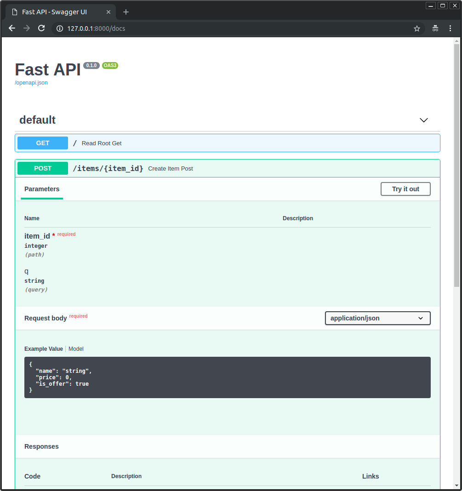
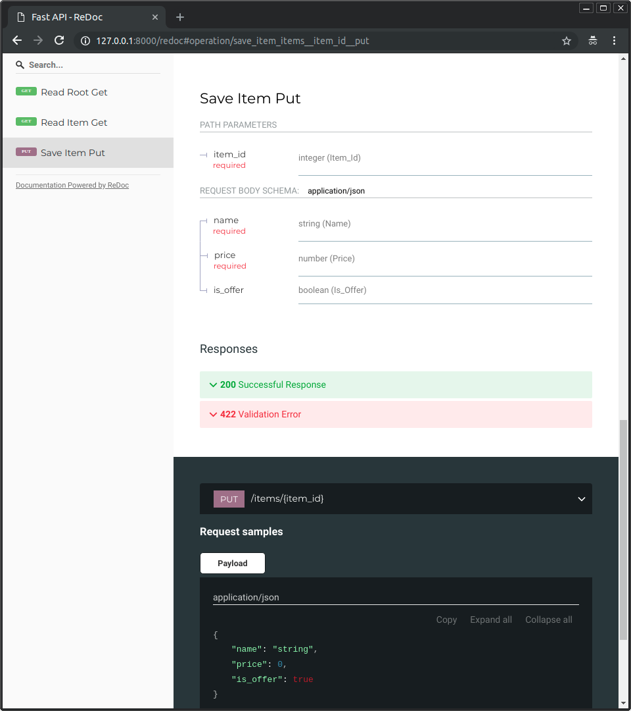
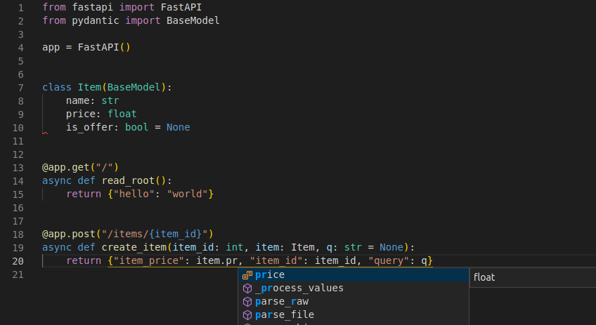
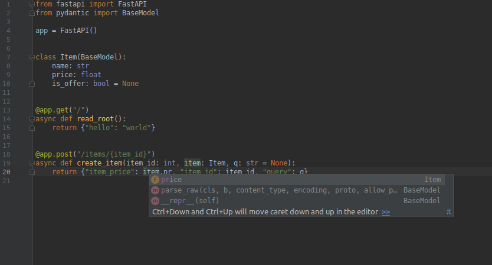

## FastAPI features

**FastAPI** gives you the following:

### Based on open standards

* <a href="https://github.com/OAI/OpenAPI-Specification" target="_blank"><strong>OpenAPI</strong></a> for API creation, including declarations of <abbr title="also known as: endpoints, routes">path</abbr> <abbr title="also known as HTTP methods, as POST, GET, PUT, DELETE">operations</abbr>, parameters, body requests, security, etc.
* Automatic data model documentation with <a href="http://json-schema.org/" target="_blank"><strong>JSON Schema</strong></a> (as OpenAPI itself is based on JSON Schema).
* Designed around these standards, after a meticulous study. Instead of an afterthought layer on top.
* This also allows using automatic **client code generation** in many languages.

### Automatic docs

Interactive API documentation and exploration web user interfaces. As the framework is based on OpenAPI, there are multiple options, 2 included by default.

* <a href="https://github.com/swagger-api/swagger-ui" target="_blank"><strong>Swagger UI</strong></a>, with interactive exploration, call and test your API directly from the browser.



* Alternative API documentation with <a href="https://github.com/Rebilly/ReDoc" target="_blank"><strong>ReDoc</strong></a>.




### Just Modern Python

It's all based on standard **Python 3.6 type** declarations (thanks to Pydantic). No new syntax to learn. Just standard modern Python.

If you need a 2 minute refresher of how to use Python types (even if you don't use FastAPI), check the tutorial section: [Python types](tutorial/python-types.md).

You write standard Python with types:

```Python
from typing import List, Dict
from datetime import date

from pydantic import BaseModel

# Declare a variable as an str
# and get editor support inside the function
def main(user_id: str):
    return user_id


# A Pydantic model
class User(BaseModel):
    id: int
    name: str
    joined: date
```

That can then be used like:

```Python
my_user: User = User(id=3, name="John Doe", joined="2018-07-19")

second_user_data = {
    "id": 4,
    "name": "Mary",
    "joined": "2018-11-30",
}


# **second_user_data means: 
# pass the keys and values of the dict 
# directly as key-value arguments
# equivalent to:
# id=4, name="Mary", joined="2018-11-30"
my_second_user: User = User(**second_user_data)
```

### Editor support

All the framework was designed to be easy and intuitive to use, all the decisons where tested on multiple editors even before starting development, to ensure the best development experience.

In the last Python developer survey it was clear <a href="https://www.jetbrains.com/research/python-developers-survey-2017/#tools-and-features" target="_blank">that the most used feature is "autocompletion"</a>. 

The whole **FastAPI** framework is based to satisfy that. Autocompletion works everywhere.

You will rarely need to come back to the docs.

Here's how your editor might help you:

* in <a href="https://code.visualstudio.com/" target="_blank">Visual Studio Code</a>:



* in <a href="https://www.jetbrains.com/pycharm/" target="_blank">PyCharm</a>:



You will get completion in code you might even consider imposible before. As for example, the `price` key inside a JSON body (that could have been nested) that comes from a request.

No more typing the wrong key names, coming back and forth between docs, or scrolling up and down to find if you finally used `username` or `user_name`.

### Short

It has sensible **defaults** for everything, with optional configurations everywhere. All the parameters can be fine-tuned to do what you need and to define the API you need.

But by default, it all **"just works"**.

### Validation

* Validation for most (or all?) Python **data types**, including:
    * JSON objects (`dict`).
    * JSON array (`list`) defining item types.
    * String (`str`) fields, defining min and max lengths.
    * Numbers (`int`, `float`) with min and max values, etc.

* Validation for more exotic types, like:
    * URL.
    * Email.
    * UUID.
    * ...and others.

All the validation is handled by the well-established and robust **Pydantic**.

### Security and authentication

Security and authentication integrated. Without any compromise with databases or data models.

All the security schemes defined in OpenAPI, including:

* HTTP Basic.
* **OAuth2** (also with **JWT tokens**). Check the [tutorial on OAuth2 with JWT](tutorial/security/oauth2-jwt.md).
* API keys in:
    * Headers.
    * Query parameters.
    * Cookies, etc.

Plus all the security features from Starlette (including **session cookies**). 

All built as reusable tools and components that are easy to integrate with your systems, data stores, relational and NoSQL databases, etc.

### Dependency Injection

FastAPI includes an extremely easy to use, but extremely powerful <abbr title='also known as "components", "resources", "services", "providers"'><strong>Dependency Injection</strong></abbr> system.

* Even dependencies can have dependencies, creating a hierarchy or **"graph" of dependencies**.
* All **automatically handled** by the framework. 
* All the dependencies can require data from requests and **augment the path operation** constraints and automatic documentation.
* **Automatic validation** even for path operation parameters defined in dependencies.
* Support for complex user authentication systems, **database connections**, etc.
* **No compromise** with databases, frontends, etc. But easy integration with all of them.


### Unlimited "plug-ins"

Or in other way, no need for them, import and use the code you need. 

Any integration is designed to be so simple to use (with dependencies) that you can create a "plug-in" for your application in 2 lines of code using the same structure and syntax used for your path operations.


### Tested

* 100% <abbr title="The amount of code that is automatically tested">test coverage</abbr> (* not yet, in a couple days).
* 100% <abbr title="Python type annotations, with this your editor and external tools can give you better support">type annotated</abbr> code base.
* Used in production applications.

## Starlette features

**FastAPI** is fully compatible with (and based on) <a href="https://www.starlette.io/" target="_blank"><strong>Starlette</strong></a>. So, any additional Starlette code you have, will also work.

`FastAPI` is actually a sub-class of `Starlette`. So, if you already know or use Starlette, most of the functionality will work the same way.

With **FastAPI** you get all of **Starlette**'s features (as FastAPI is just Starlette on steroids):

* Seriously impressive performance. It is <a href="https://github.com/encode/starlette#performance" target="_blank">one of the fastest Python frameworks available, on par with **NodeJS** and **Go**</a>.
* **WebSocket** support.
* **GraphQL** support.
* In-process background tasks.
* Startup and shutdown events.
* Test client built on `requests`.
* **CORS**, GZip, Static Files, Streaming responses.
* **Session and Cookie** support.
* 100% test coverage.
* 100% type annotated codebase.

## Pydantic features

**FastAPI** is fully compatible with (and based on) <a href="https://pydantic-docs.helpmanual.io" target="_blank"><strong>Pydantic</strong></a>. So, any additional Pydantic code you have, will also work.

Including external libraries also based on Pydantic, as <abbr title="Object-Relational Mapper">ORM</abbr>s, <abbr title="Object-Document Mapper">ODM</abbr>s for databases.

This also means that in many cases you can pass the same object you get from a request **directly to the database**, as everything is validated automatically.

The same applies the other way around, in many cases you can just pass the object you get from the database **directly to the client**.

With **FastAPI** you get all of **Pydantic**'s features (as FastAPI is based on Pydantic for all the data handling):

* **No brainfuck**: 
    * No new schema definition micro-language to learn.
    * If you know Python types you know how to use Pydantic.
* Plays nicely with your **<abbr title="Integrated Development Environment, similar to a code editor">IDE</abbr>/<abbr title="A program that checks for code errors">linter</abbr>/brain**:
    * Because pydantic data structures are just instances of classes you define; auto-completion, linting, mypy and your intuition should all work properly with your validated data.
* **Fast**:
    * in <a href="https://pydantic-docs.helpmanual.io/#benchmarks-tag" target="_blank">benchmarks</a> Pydantic is faster than all other tested libraries.
* Validate **complex structures**:
    * Use of hierarchical Pydantic models, Python `typing`’s `List` and `Dict`, etc.
    * And validators allow complex data schemas to be clearly and easily defined, checked and documented as JSON Schema.
    * You can have deeply **nested JSON** objects and have them all validated and annotated.
* **Extendible**:
    * Pydantic allows custom data types to be defined or you can extend validation with methods on a model decorated with the validator decorator.
* 100% test coverage.