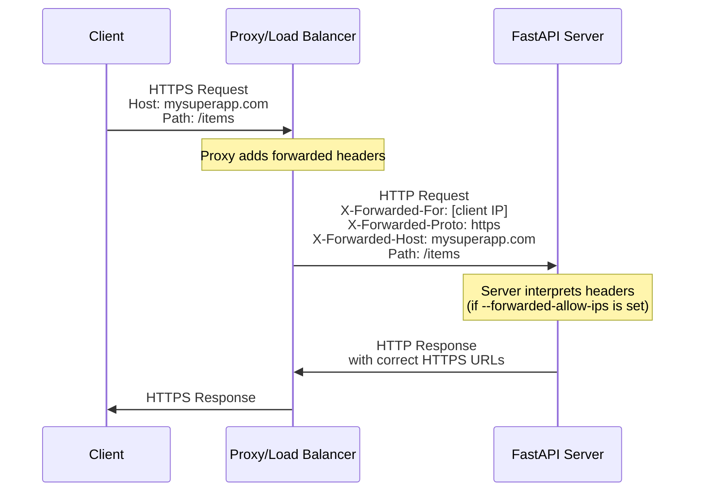
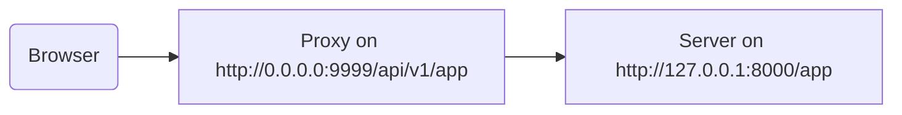

# Être derrière un proxy { #behind-a-proxy }

Dans de nombreuses situations, vous utiliserez un **proxy** comme Traefik ou Nginx devant votre application FastAPI.

Ces proxies peuvent gérer les certificats HTTPS et d'autres aspects.

## En-têtes transférés par le proxy { #proxy-forwarded-headers }

Un **proxy** placé devant votre application définit normalement certains en-têtes à la volée avant d'envoyer les requêtes à votre **serveur**, afin d'indiquer au serveur que la requête a été **transférée** par le proxy, en lui donnant l'URL d'origine (publique), y compris le domaine, le fait qu'elle utilise HTTPS, etc.

Le programme **serveur** (par exemple **Uvicorn** via **FastAPI CLI**) est capable d'interpréter ces en‑têtes, puis de transmettre ces informations à votre application.

Mais, par sécurité, comme le serveur ne sait pas qu'il se trouve derrière un proxy de confiance, il n'interprétera pas ces en‑têtes.

/// note | Détails techniques

Les en-têtes du proxy sont :

* <a href="https://developer.mozilla.org/en-US/docs/Web/HTTP/Reference/Headers/X-Forwarded-For" class="external-link" target="_blank">X-Forwarded-For</a>
* <a href="https://developer.mozilla.org/en-US/docs/Web/HTTP/Reference/Headers/X-Forwarded-Proto" class="external-link" target="_blank">X-Forwarded-Proto</a>
* <a href="https://developer.mozilla.org/en-US/docs/Web/HTTP/Reference/Headers/X-Forwarded-Host" class="external-link" target="_blank">X-Forwarded-Host</a>

///

### Activer les en-têtes transférés par le proxy { #enable-proxy-forwarded-headers }

Vous pouvez démarrer FastAPI CLI avec l'option de CLI `--forwarded-allow-ips` et fournir les adresses IP à considérer comme fiables pour lire ces en‑têtes transférés.

Si vous la définissez à `--forwarded-allow-ips="*"`, elle fera confiance à toutes les IP entrantes.

Si votre **serveur** est derrière un **proxy** de confiance et que seul le proxy lui parle, cela fera accepter l'IP de ce **proxy**, quelle qu'elle soit.

<div class="termy">

```console
$ fastapi run --forwarded-allow-ips="*"

<span style="color: green;">INFO</span>:     Uvicorn running on http://127.0.0.1:8000 (Press CTRL+C to quit)
```

</div>

### Redirections avec HTTPS { #redirects-with-https }

Par exemple, disons que vous définissez un *chemin d'accès* `/items/` :

{* ../../docs_src/behind_a_proxy/tutorial001_01_py310.py hl[6] *}

Si le client essaie d'aller à `/items`, par défaut, il sera redirigé vers `/items/`.

Mais avant de définir l'option de CLI `--forwarded-allow-ips`, il pourrait rediriger vers `http://localhost:8000/items/`.

Mais peut‑être que votre application est hébergée à `https://mysuperapp.com`, et la redirection devrait être vers `https://mysuperapp.com/items/`.

En définissant `--proxy-headers`, FastAPI pourra désormais rediriger vers l'emplacement correct. 😎

```
https://mysuperapp.com/items/
```

/// tip | Astuce

Si vous voulez en savoir plus sur HTTPS, consultez le guide [À propos de HTTPS](../deployment/https.md){.internal-link target=_blank}.

///

### Comment fonctionnent les en‑têtes transférés par le proxy { #how-proxy-forwarded-headers-work }

Voici une représentation visuelle de la façon dont le **proxy** ajoute des en‑têtes transférés entre le client et le **serveur d'application** :



Le **proxy** intercepte la requête client d'origine et ajoute les en-têtes spéciaux *forwarded* (`X-Forwarded-*`) avant de transmettre la requête au **serveur d'application**.

Ces en‑têtes conservent des informations sur la requête d'origine qui seraient autrement perdues :

* **X-Forwarded-For** : l'adresse IP du client d'origine
* **X-Forwarded-Proto** : le protocole d'origine (`https`)
* **X-Forwarded-Host** : l'hôte d'origine (`mysuperapp.com`)

Lorsque **FastAPI CLI** est configurée avec `--forwarded-allow-ips`, elle fait confiance à ces en‑têtes et les utilise, par exemple pour générer les bonnes URL dans les redirections.

## Proxy avec un préfixe de chemin supprimé { #proxy-with-a-stripped-path-prefix }

Vous pouvez avoir un proxy qui ajoute un préfixe de chemin à votre application.

Dans ces cas, vous pouvez utiliser `root_path` pour configurer votre application.

Le `root_path` est un mécanisme fourni par la spécification ASGI (sur laquelle FastAPI est construit, via Starlette).

Le `root_path` est utilisé pour gérer ces cas spécifiques.

Et il est également utilisé en interne lors du montage de sous‑applications.

Avoir un proxy avec un préfixe de chemin supprimé, dans ce cas, signifie que vous pourriez déclarer un chemin à `/app` dans votre code, mais ensuite, vous ajoutez une couche au‑dessus (le proxy) qui place votre application **FastAPI** sous un chemin comme `/api/v1`.

Dans ce cas, le chemin original `/app` serait en réalité servi à `/api/v1/app`.

Même si tout votre code est écrit en supposant qu'il n'y a que `/app`.

{* ../../docs_src/behind_a_proxy/tutorial001_py310.py hl[6] *}

Et le proxy **« stripping »** le **préfixe de chemin** à la volée avant de transmettre la requête au serveur de l'application (probablement Uvicorn via FastAPI CLI), en gardant votre application convaincue qu'elle est servie à `/app`, afin que vous n'ayez pas à mettre à jour tout votre code pour inclure le préfixe `/api/v1`.

Jusqu'ici, tout fonctionnerait normalement.

Mais ensuite, lorsque vous ouvrez l'interface de documentation intégrée (le frontend), elle s'attendra à obtenir le schéma OpenAPI à `/openapi.json`, au lieu de `/api/v1/openapi.json`.

Ainsi, le frontend (qui s'exécute dans le navigateur) essaiera d'atteindre `/openapi.json` et ne pourra pas obtenir le schéma OpenAPI.

Parce que nous avons un proxy avec un préfixe de chemin `/api/v1` pour notre application, le frontend doit récupérer le schéma OpenAPI à `/api/v1/openapi.json`.



/// tip | Astuce

L'IP `0.0.0.0` est couramment utilisée pour signifier que le programme écoute sur toutes les IP disponibles de cette machine/serveur.

///

L'interface de documents doit également indiquer dans le schéma OpenAPI que ce `server` d'API se trouve à `/api/v1` (derrière le proxy). Par exemple :

```JSON hl_lines="4-8"
{
    "openapi": "3.1.0",
    // Plus d'éléments ici
    "servers": [
        {
            "url": "/api/v1"
        }
    ],
    "paths": {
            // Plus d'éléments ici
    }
}
```

Dans cet exemple, le « Proxy » pourrait être quelque chose comme **Traefik**. Et le serveur serait quelque chose comme FastAPI CLI avec **Uvicorn**, exécutant votre application FastAPI.

### Fournir le `root_path` { #providing-the-root-path }

Pour y parvenir, vous pouvez utiliser l'option de ligne de commande `--root-path` comme suit :

<div class="termy">

```console
$ fastapi run main.py --forwarded-allow-ips="*" --root-path /api/v1

<span style="color: green;">INFO</span>:     Uvicorn running on http://127.0.0.1:8000 (Press CTRL+C to quit)
```

</div>

Si vous utilisez Hypercorn, il dispose également de l'option `--root-path`.

/// note | Détails techniques

La spécification ASGI définit un `root_path` pour ce cas d'usage.

Et l'option de ligne de commande `--root-path` fournit ce `root_path`.

///

### Vérifier le `root_path` actuel { #checking-the-current-root-path }

Vous pouvez obtenir le `root_path` actuel utilisé par votre application pour chaque requête, il fait partie du dictionnaire `scope` (qui fait partie de la spécification ASGI).

Ici, nous l'incluons dans le message uniquement à des fins de démonstration.

{* ../../docs_src/behind_a_proxy/tutorial001_py310.py hl[8] *}

Ensuite, si vous démarrez Uvicorn avec :

<div class="termy">

```console
$ fastapi run main.py --forwarded-allow-ips="*" --root-path /api/v1

<span style="color: green;">INFO</span>:     Uvicorn running on http://127.0.0.1:8000 (Press CTRL+C to quit)
```

</div>

La réponse sera semblable à :

```JSON
{
    "message": "Hello World",
    "root_path": "/api/v1"
}
```

### Définir le `root_path` dans l'application FastAPI { #setting-the-root-path-in-the-fastapi-app }

Autrement, si vous n'avez pas la possibilité de fournir une option de ligne de commande comme `--root-path` ou équivalent, vous pouvez définir le paramètre `root_path` lors de la création de votre application FastAPI :

{* ../../docs_src/behind_a_proxy/tutorial002_py310.py hl[3] *}

Passer le `root_path` à `FastAPI` équivaut à passer l'option de ligne de commande `--root-path` à Uvicorn ou Hypercorn.

### À propos de `root_path` { #about-root-path }

Gardez à l'esprit que le serveur (Uvicorn) n'utilisera ce `root_path` que pour le transmettre à l'application.

Mais si vous allez avec votre navigateur sur <a href="http://127.0.0.1:8000/app" class="external-link" target="_blank">http://127.0.0.1:8000/app</a>, vous verrez la réponse normale :

```JSON
{
    "message": "Hello World",
    "root_path": "/api/v1"
}
```

Donc, il ne s'attendra pas à être accessible à `http://127.0.0.1:8000/api/v1/app`.

Uvicorn s'attendra à ce que le proxy accède à Uvicorn sur `http://127.0.0.1:8000/app`, et ce sera ensuite la responsabilité du proxy d'ajouter le préfixe supplémentaire `/api/v1` au‑dessus.

## À propos des proxies avec un préfixe de chemin supprimé { #about-proxies-with-a-stripped-path-prefix }

Gardez à l'esprit qu'un proxy avec préfixe de chemin supprimé n'est qu'une des façons de le configurer.

Dans de nombreux cas, la valeur par défaut sera probablement que le proxy n'a pas de préfixe de chemin supprimé.

Dans un cas comme celui‑ci (sans préfixe de chemin supprimé), le proxy écoutera sur quelque chose comme `https://myawesomeapp.com`, puis si le navigateur va sur `https://myawesomeapp.com/api/v1/app` et que votre serveur (par ex. Uvicorn) écoute sur `http://127.0.0.1:8000`, le proxy (sans préfixe de chemin supprimé) accédera à Uvicorn au même chemin : `http://127.0.0.1:8000/api/v1/app`.

## Tester localement avec Traefik { #testing-locally-with-traefik }

Vous pouvez facilement faire l'expérience en local avec un préfixe de chemin supprimé en utilisant <a href="https://docs.traefik.io/" class="external-link" target="_blank">Traefik</a>.

<a href="https://github.com/containous/traefik/releases" class="external-link" target="_blank">Téléchargez Traefik</a> ; c'est un binaire unique, vous pouvez extraire le fichier compressé et l'exécuter directement depuis le terminal.

Créez ensuite un fichier `traefik.toml` avec :

```TOML hl_lines="3"
[entryPoints]
  [entryPoints.http]
    address = ":9999"

[providers]
  [providers.file]
    filename = "routes.toml"
```

Cela indique à Traefik d'écouter sur le port 9999 et d'utiliser un autre fichier `routes.toml`.

/// tip | Astuce

Nous utilisons le port 9999 au lieu du port HTTP standard 80 afin que vous n'ayez pas à l'exécuter avec des privilèges administrateur (`sudo`).

///

Créez maintenant cet autre fichier `routes.toml` :

```TOML hl_lines="5  12  20"
[http]
  [http.middlewares]

    [http.middlewares.api-stripprefix.stripPrefix]
      prefixes = ["/api/v1"]

  [http.routers]

    [http.routers.app-http]
      entryPoints = ["http"]
      service = "app"
      rule = "PathPrefix(`/api/v1`)"
      middlewares = ["api-stripprefix"]

  [http.services]

    [http.services.app]
      [http.services.app.loadBalancer]
        [[http.services.app.loadBalancer.servers]]
          url = "http://127.0.0.1:8000"
```

Ce fichier configure Traefik pour utiliser le préfixe de chemin `/api/v1`.

Puis Traefik redirigera ses requêtes vers votre Uvicorn tournant sur `http://127.0.0.1:8000`.

Démarrez maintenant Traefik :

<div class="termy">

```console
$ ./traefik --configFile=traefik.toml

INFO[0000] Configuration loaded from file: /home/user/awesomeapi/traefik.toml
```

</div>

Et démarrez maintenant votre application, en utilisant l'option `--root-path` :

<div class="termy">

```console
$ fastapi run main.py --forwarded-allow-ips="*" --root-path /api/v1

<span style="color: green;">INFO</span>:     Uvicorn running on http://127.0.0.1:8000 (Press CTRL+C to quit)
```

</div>

### Vérifier les réponses { #check-the-responses }

Maintenant, si vous allez à l'URL avec le port pour Uvicorn : <a href="http://127.0.0.1:8000/app" class="external-link" target="_blank">http://127.0.0.1:8000/app</a>, vous verrez la réponse normale :

```JSON
{
    "message": "Hello World",
    "root_path": "/api/v1"
}
```

/// tip | Astuce

Remarquez que même si vous y accédez via `http://127.0.0.1:8000/app`, il affiche le `root_path` de `/api/v1`, repris depuis l'option `--root-path`.

///

Et maintenant ouvrez l'URL avec le port pour Traefik, en incluant le préfixe de chemin : <a href="http://127.0.0.1:9999/api/v1/app" class="external-link" target="_blank">http://127.0.0.1:9999/api/v1/app</a>.

Nous obtenons la même réponse :

```JSON
{
    "message": "Hello World",
    "root_path": "/api/v1"
}
```

mais cette fois à l'URL avec le préfixe fourni par le proxy : `/api/v1`.

Bien sûr, l'idée ici est que tout le monde accède à l'application via le proxy ; la version avec le préfixe de chemin `/api/v1` est donc la « correcte ».

Et la version sans préfixe de chemin (`http://127.0.0.1:8000/app`), fournie directement par Uvicorn, serait exclusivement destinée au _proxy_ (Traefik) pour y accéder.

Cela montre comment le Proxy (Traefik) utilise le préfixe de chemin et comment le serveur (Uvicorn) utilise le `root_path` fourni par l'option `--root-path`.

### Vérifier l'interface de documentation { #check-the-docs-ui }

Mais voici la partie intéressante. ✨

La manière « officielle » d'accéder à l'application serait via le proxy avec le préfixe de chemin que nous avons défini. Donc, comme on s'y attend, si vous essayez l'interface de documentation servie directement par Uvicorn, sans le préfixe de chemin dans l'URL, cela ne fonctionne pas, car elle s'attend à être accédée via le proxy.

Vous pouvez le vérifier sur <a href="http://127.0.0.1:8000/docs" class="external-link" target="_blank">http://127.0.0.1:8000/docs</a> :


Mais si nous accédons à l'interface de documents à l'URL « officielle » en utilisant le proxy avec le port `9999`, à `/api/v1/docs`, cela fonctionne correctement ! 🎉

Vous pouvez le vérifier sur <a href="http://127.0.0.1:9999/api/v1/docs" class="external-link" target="_blank">http://127.0.0.1:9999/api/v1/docs</a> :


Exactement comme nous le voulions. ✔️

C'est parce que FastAPI utilise ce `root_path` pour créer le `server` par défaut dans OpenAPI avec l'URL fournie par `root_path`.

## Serveurs supplémentaires { #additional-servers }

/// warning | Alertes

Ceci est un cas d'utilisation plus avancé. N'hésitez pas à l'ignorer.

///

Par défaut, **FastAPI** créera un `server` dans le schéma OpenAPI avec l'URL correspondant au `root_path`.

Mais vous pouvez aussi fournir d'autres `servers` alternatifs, par exemple si vous voulez que la même interface de documents interagisse avec un environnement de staging et un environnement de production.

Si vous passez une liste personnalisée de `servers` et qu'il y a un `root_path` (parce que votre API vit derrière un proxy), **FastAPI** insérera un « server » avec ce `root_path` au début de la liste.

Par exemple :

{* ../../docs_src/behind_a_proxy/tutorial003_py310.py hl[4:7] *}

Générera un schéma OpenAPI comme :

```JSON hl_lines="5-7"
{
    "openapi": "3.1.0",
    // Plus d'éléments ici
    "servers": [
        {
            "url": "/api/v1"
        },
        {
            "url": "https://stag.example.com",
            "description": "Staging environment"
        },
        {
            "url": "https://prod.example.com",
            "description": "Production environment"
        }
    ],
    "paths": {
            // Plus d'éléments ici
    }
}
```

/// tip | Astuce

Remarquez le serveur généré automatiquement avec une valeur `url` de `/api/v1`, reprise depuis le `root_path`.

///

Dans l'interface de documents sur <a href="http://127.0.0.1:9999/api/v1/docs" class="external-link" target="_blank">http://127.0.0.1:9999/api/v1/docs</a>, cela ressemblera à ceci :


/// tip | Astuce

L'interface de documents interagit avec le serveur que vous sélectionnez.

///

/// note | Détails techniques

La propriété `servers` dans la spécification OpenAPI est facultative.

Si vous ne spécifiez pas le paramètre `servers` et que `root_path` est égal à `/`, la propriété `servers` dans le schéma OpenAPI généré sera entièrement omise par défaut, ce qui équivaut à un seul serveur avec une valeur `url` de `/`.

///

### Désactiver le serveur automatique issu de `root_path` { #disable-automatic-server-from-root-path }

Si vous ne voulez pas que **FastAPI** inclue un serveur automatique utilisant le `root_path`, vous pouvez utiliser le paramètre `root_path_in_servers=False` :

{* ../../docs_src/behind_a_proxy/tutorial004_py310.py hl[9] *}

et il ne l'inclura alors pas dans le schéma OpenAPI.

## Monter une sous-application { #mounting-a-sub-application }

Si vous avez besoin de monter une sous‑application (comme décrit dans [Sous‑applications - montages](sub-applications.md){.internal-link target=_blank}) tout en utilisant un proxy avec `root_path`, vous pouvez le faire normalement, comme vous vous y attendez.

FastAPI utilisera intelligemment le `root_path` en interne, donc cela fonctionnera simplement. ✨
