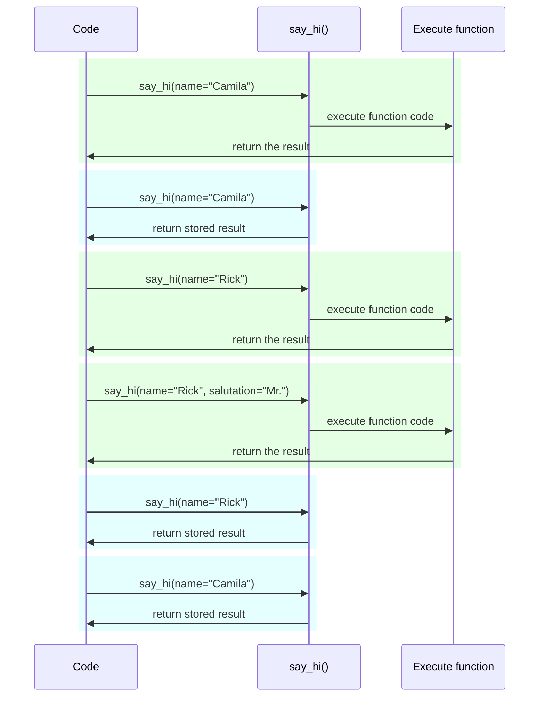

# Paramètres et variables d'environnement { #settings-and-environment-variables }

Dans de nombreux cas, votre application peut avoir besoin de paramètres ou de configurations externes, par exemple des clés secrètes, des identifiants de base de données, des identifiants pour des services d'e-mail, etc.

La plupart de ces paramètres sont variables (peuvent changer), comme les URL de base de données. Et beaucoup peuvent être sensibles, comme les secrets.

C'est pourquoi il est courant de les fournir via des variables d'environnement lues par l'application.

/// tip | Astuce

Pour comprendre les variables d'environnement, vous pouvez lire [Variables d'environnement](../environment-variables.md){.internal-link target=_blank}.

///

## Types et validation { #types-and-validation }

Ces variables d'environnement ne gèrent que des chaînes de texte, car elles sont externes à Python et doivent être compatibles avec d'autres programmes et le reste du système (et même avec différents systèmes d'exploitation, comme Linux, Windows, macOS).

Cela signifie que toute valeur lue en Python depuis une variable d'environnement sera une `str`, et toute conversion vers un autre type ou toute validation doit être effectuée dans le code.

## Pydantic `Settings` { #pydantic-settings }

Heureusement, Pydantic fournit un excellent utilitaire pour gérer ces paramètres provenant des variables d'environnement avec <a href="https://docs.pydantic.dev/latest/concepts/pydantic_settings/" class="external-link" target="_blank">Pydantic : gestion des paramètres</a>.

### Installer `pydantic-settings` { #install-pydantic-settings }

D'abord, vous devez créer votre [environnement virtuel](../virtual-environments.md){.internal-link target=_blank}, l'activer, puis installer le paquet `pydantic-settings` :

<div class="termy">

```console
$ pip install pydantic-settings
---> 100%
```

</div>

Il est également inclus lorsque vous installez les extras `all` avec :

<div class="termy">

```console
$ pip install "fastapi[all]"
---> 100%
```

</div>

### Créer l'objet `Settings` { #create-the-settings-object }

Importez `BaseSettings` depuis Pydantic et créez une sous-classe, comme pour un modèle Pydantic.

De la même manière qu'avec les modèles Pydantic, vous déclarez des attributs de classe avec des annotations de type, et éventuellement des valeurs par défaut.

Vous pouvez utiliser toutes les mêmes fonctionnalités et outils de validation que pour les modèles Pydantic, comme différents types de données et des validations supplémentaires avec `Field()`.

{* ../../docs_src/settings/tutorial001_py310.py hl[2,5:8,11] *}

/// tip | Astuce

Si vous voulez quelque chose à copier-coller rapidement, n'utilisez pas cet exemple, utilisez le dernier ci-dessous.

///

Ensuite, lorsque vous créez une instance de cette classe `Settings` (dans ce cas, l'objet `settings`), Pydantic lira les variables d'environnement de manière insensible à la casse, donc une variable en majuscules `APP_NAME` sera tout de même lue pour l'attribut `app_name`.

Il convertira ensuite et validera les données. Ainsi, lorsque vous utilisez cet objet `settings`, vous aurez des données des types que vous avez déclarés (par exemple, `items_per_user` sera un `int`).

### Utiliser `settings` { #use-the-settings }

Vous pouvez ensuite utiliser le nouvel objet `settings` dans votre application :

{* ../../docs_src/settings/tutorial001_py310.py hl[18:20] *}

### Exécuter le serveur { #run-the-server }

Ensuite, vous exécutez le serveur en passant les configurations comme variables d'environnement ; par exemple, vous pouvez définir un `ADMIN_EMAIL` et `APP_NAME` avec :

<div class="termy">

```console
$ ADMIN_EMAIL="deadpool@example.com" APP_NAME="ChimichangApp" fastapi run main.py

<span style="color: green;">INFO</span>:     Uvicorn running on http://127.0.0.1:8000 (Press CTRL+C to quit)
```

</div>

/// tip | Astuce

Pour définir plusieurs variables d'environnement pour une seule commande, séparez-les simplement par un espace et placez-les toutes avant la commande.

///

Ainsi, le paramètre `admin_email` sera défini sur « deadpool@example.com ».

Le `app_name` sera « ChimichangApp ».

Et `items_per_user` conservera sa valeur par défaut de `50`.

## Paramètres dans un autre module { #settings-in-another-module }

Vous pouvez placer ces paramètres dans un autre module comme vous l'avez vu dans [Applications plus grandes - Plusieurs fichiers](../tutorial/bigger-applications.md){.internal-link target=_blank}.

Par exemple, vous pourriez avoir un fichier `config.py` avec :

{* ../../docs_src/settings/app01_py310/config.py *}

Puis l'utiliser dans un fichier `main.py` :

{* ../../docs_src/settings/app01_py310/main.py hl[3,11:13] *}

/// tip | Astuce

Vous aurez également besoin d'un fichier `__init__.py` comme vous l'avez vu dans [Applications plus grandes - Plusieurs fichiers](../tutorial/bigger-applications.md){.internal-link target=_blank}.

///

## Paramètres dans une dépendance { #settings-in-a-dependency }

Dans certains cas, il peut être utile de fournir les paramètres via une dépendance, au lieu d'avoir un objet global `settings` utilisé partout.

Cela peut être particulièrement utile pendant les tests, car il est très facile de surcharger une dépendance avec vos propres paramètres personnalisés.

### Le fichier de configuration { #the-config-file }

En repartant de l'exemple précédent, votre fichier `config.py` pourrait ressembler à :

{* ../../docs_src/settings/app02_an_py310/config.py hl[10] *}

Notez que maintenant, nous ne créons pas d'instance par défaut `settings = Settings()`.

### Le fichier principal de l'application { #the-main-app-file }

Nous créons maintenant une dépendance qui renvoie un nouveau `config.Settings()`.

{* ../../docs_src/settings/app02_an_py310/main.py hl[6,12:13] *}

/// tip | Astuce

Nous parlerons de `@lru_cache` dans un instant.

Pour l'instant, vous pouvez supposer que `get_settings()` est une fonction normale.

///

Nous pouvons ensuite l'exiger depuis la fonction de chemin d'accès comme dépendance et l'utiliser où nous en avons besoin.

{* ../../docs_src/settings/app02_an_py310/main.py hl[17,19:21] *}

### Paramètres et tests { #settings-and-testing }

Il devient alors très simple de fournir un autre objet de paramètres pendant les tests en créant une surcharge de dépendance pour `get_settings` :

{* ../../docs_src/settings/app02_an_py310/test_main.py hl[9:10,13,21] *}

Dans la surcharge de dépendance, nous définissons une nouvelle valeur pour `admin_email` lors de la création du nouvel objet `Settings`, puis nous renvoyons ce nouvel objet.

Nous pouvons ensuite tester qu'il est bien utilisé.

## Lire un fichier `.env` { #reading-a-env-file }

Si vous avez de nombreux paramètres susceptibles de beaucoup changer, peut-être selon les environnements, il peut être utile de les placer dans un fichier, puis de les lire comme s'il s'agissait de variables d'environnement.

Cette pratique est suffisamment courante pour avoir un nom ; ces variables d'environnement sont fréquemment placées dans un fichier `.env`, et le fichier est appelé un « dotenv ».

/// tip | Astuce

Un fichier commençant par un point (`.`) est un fichier caché dans les systèmes de type Unix, comme Linux et macOS.

Mais un fichier dotenv n'a pas forcément exactement ce nom de fichier.

///

Pydantic prend en charge la lecture depuis ce type de fichiers en utilisant une bibliothèque externe. Vous pouvez en lire davantage ici : <a href="https://docs.pydantic.dev/latest/concepts/pydantic_settings/#dotenv-env-support" class="external-link" target="_blank">Pydantic Settings : prise en charge de Dotenv (.env)</a>.

/// tip | Astuce

Pour que cela fonctionne, vous devez exécuter `pip install python-dotenv`.

///

### Le fichier `.env` { #the-env-file }

Vous pouvez avoir un fichier `.env` avec :

```bash
ADMIN_EMAIL="deadpool@example.com"
APP_NAME="ChimichangApp"
```

### Lire les paramètres depuis `.env` { #read-settings-from-env }

Puis mettre à jour votre `config.py` avec :

{* ../../docs_src/settings/app03_an_py310/config.py hl[9] *}

/// tip | Astuce

L'attribut `model_config` est utilisé uniquement pour la configuration Pydantic. Vous pouvez en lire davantage ici : <a href="https://docs.pydantic.dev/latest/concepts/config/" class="external-link" target="_blank">Pydantic : Concepts : Configuration</a>.

///

Ici, nous définissons la configuration `env_file` à l'intérieur de votre classe Pydantic `Settings` et lui attribuons le nom du fichier dotenv que nous voulons utiliser.

### Créer `Settings` une seule fois avec `lru_cache` { #creating-the-settings-only-once-with-lru-cache }

Lire un fichier depuis le disque est normalement une opération coûteuse (lente), vous voudrez donc probablement le faire une seule fois puis réutiliser le même objet de paramètres, au lieu de le lire à chaque requête.

Mais chaque fois que nous faisons :

```Python
Settings()
```

un nouvel objet `Settings` serait créé, et à sa création il lirait à nouveau le fichier `.env`.

Si la fonction de dépendance était simplement :

```Python
def get_settings():
    return Settings()
```

nous créerions cet objet pour chaque requête, et nous lirions le fichier `.env` pour chaque requête. ⚠️

Mais comme nous utilisons le décorateur `@lru_cache` au-dessus, l'objet `Settings` sera créé une seule fois, la première fois qu'il est appelé. ✔️

{* ../../docs_src/settings/app03_an_py310/main.py hl[1,11] *}

Ensuite, pour tout appel ultérieur de `get_settings()` dans les dépendances pour les requêtes suivantes, au lieu d'exécuter le code interne de `get_settings()` et de créer un nouvel objet `Settings`, il renverra le même objet que celui retourné au premier appel, encore et encore.

#### Détails techniques de `lru_cache` { #lru-cache-technical-details }

`@lru_cache` modifie la fonction qu'il décore pour renvoyer la même valeur que celle qui a été retournée la première fois, au lieu de la recalculer en exécutant le code de la fonction à chaque fois.

Ainsi, la fonction située en dessous sera exécutée une fois pour chaque combinaison d'arguments. Ensuite, les valeurs renvoyées par chacune de ces combinaisons d'arguments seront réutilisées à chaque fois que la fonction sera appelée avec exactement la même combinaison d'arguments.

Par exemple, si vous avez une fonction :

```Python
@lru_cache
def say_hi(name: str, salutation: str = "Ms."):
    return f"Hello {salutation} {name}"
```

votre programme pourrait s'exécuter comme ceci :



Dans le cas de notre dépendance `get_settings()`, la fonction ne prend même aucun argument, elle renvoie donc toujours la même valeur.

De cette façon, elle se comporte presque comme s'il s'agissait simplement d'une variable globale. Mais comme elle utilise une fonction de dépendance, nous pouvons alors la surcharger facilement pour les tests.

`@lru_cache` fait partie de `functools` qui fait partie de la bibliothèque standard de Python, vous pouvez en lire davantage dans la <a href="https://docs.python.org/3/library/functools.html#functools.lru_cache" class="external-link" target="_blank">documentation Python pour `@lru_cache`</a>.

## Récapitulatif { #recap }

Vous pouvez utiliser Pydantic Settings pour gérer les paramètres ou configurations de votre application, avec toute la puissance des modèles Pydantic.

* En utilisant une dépendance, vous pouvez simplifier les tests.
* Vous pouvez utiliser des fichiers `.env`.
* Utiliser `@lru_cache` vous permet d'éviter de relire le fichier dotenv à chaque requête, tout en vous permettant de le surcharger pendant les tests.
